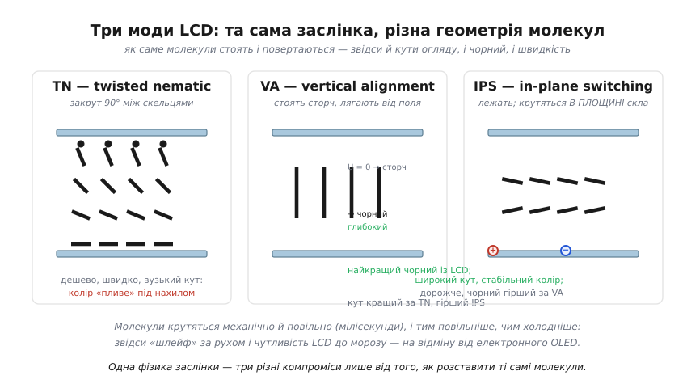
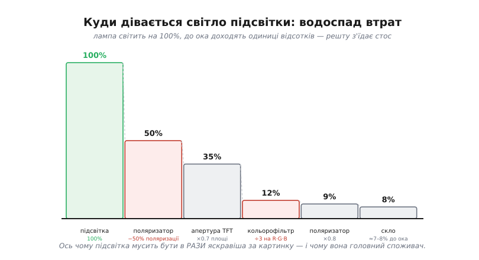
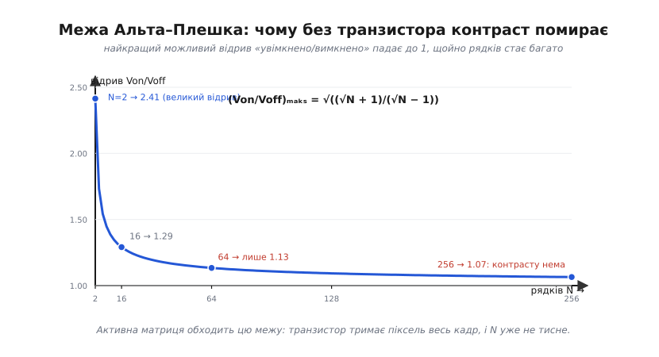
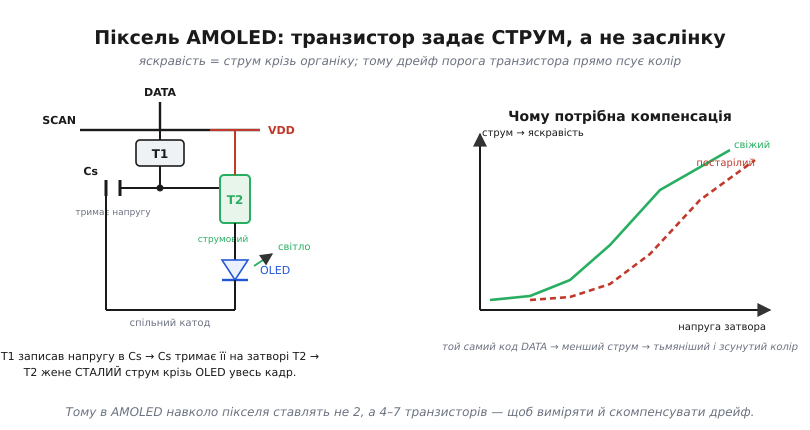
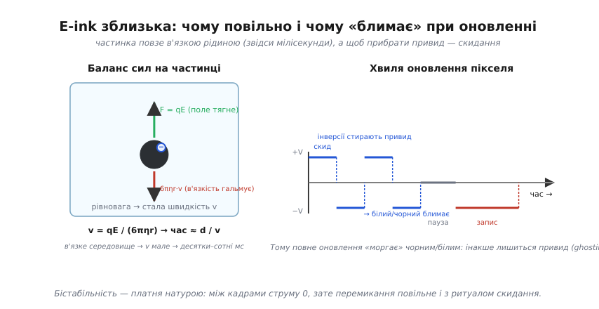

# Класи дисплеїв: TFT, OLED, e-ink — глибше

<preknowlist>
- [В'язкість](topic:physics/viscosity) — внутрішнє тертя в рідині (коефіцієнт η): що рідина густіша, то сильніше вона гальмує занурену частинку; на цьому триматиметься виведення, чому e-ink повільний.
</preknowlist>

У базовому кроці ми звели всю різноманітність екранів до одного питання — **звідки береться світло, що долітає до ока?** — і дістали три родини: OLED світиться сам, TFT-LCD дозує світло лампи позаду, e-ink відбиває навколишнє. Цього достатньо, щоб орієнтуватися. Але щойно доходить до реального виробу — вибрати конкретну панель, порахувати струм підсвітки, зрозуміти, чому дешевий екран тягне за собою дорогий мікроконтролер, чому OLED вигоряє нерівномірно, чому e-ink «моргає» при кожному оновленні, — інтуїції трьох стрілок уже мало. Кожна з тих стрілок ховає під собою власну механіку, і саме в ній народжуються всі числа, що потраплять у ваш даташит і бюджет.

Тут ми розкриємо кожен клас до його інженерної серцевини. Ми не переказуватимемо базове — воно лишається фундаментом, на який спираємося. Натомість дійдемо до трьох речей, яких базовий крок лише торкнувся: **звідки беруться числа** (контраст, світловий бюджет, час відгуку — з виведенням, а не з таблиці), **чому саме така архітектура** (транзистор на кожному пікселі — не примха, а наслідок жорсткої математичної межі), і **де кожен клас ламається** (граничні випадки, старіння, температура). А наприкінці побачимо, що трьох класів насправді вже не три: на порозі стоїть четверта фізична відповідь на те саме питання про світло.

### LCD — це не одна заслінка, а сімейство геометрій

Базовий крок описав рідкий кристал як «керовану напругою заслінку»: подаси напругу — молекули перешикуються, і пара поляризаторів пропустить світло або перекриє. Це правда, але це лише кістяк. Насправді **як саме** молекули стоять у комірці й **як саме** повертаються від поля — це не одна конструкція, а щонайменше три різні, і кожна дає свій характер екрана. Коли в даташиті пишуть «IPS» чи «TN» чи «VA», це і є ці геометрії. Різниця між ними — не маркетинг, а пряма фізика того, куди дивиться молекула.

Почнімо з того, що взагалі означає «заслінка». Світло від підсвітки спершу проходить нижній поляризатор і стає **лінійно поляризованим** — коливається в одній площині. Верхній поляризатор поставлено так, щоб пропускати світло, поляризоване **в іншій** площині (найчастіше під 90°). Якби між ними було порожньо, верхній поляризатор гасив би все: площини схрещені. Рідкий кристал — це те, що **повертає площину поляризації** дорогою вгору. Якщо він поверне її рівно на 90°, світло дійде до верхнього поляризатора «правильно орієнтованим» і пройде — піксель світлий. Якщо кристал випрямиться й перестане повертати площину, світло дійде «неправильним» і згасне — піксель темний. Напруга керує саме кутом закруту молекул, а отже, тим, наскільки повертається площина поляризації. Ось повна механіка заслінки, якої в базовому кроці не було.

Тепер — три способи розставити молекули.


*Одна фізика заслінки — три різні компроміси лише від того, як розставити молекули. **TN** закручує їх гвинтом на 90° між скельцями; дешево й швидко, але під нахилом закрут «пливе» і колір спотворюється — звідси горезвісний вузький кут TN-панелей. **VA** ставить молекули сторч (перпендикулярно склу) у спокої — світло не повертається, піксель по-справжньому чорний, тож у VA найкращий чорний із усіх LCD; поле кладе їх набік і відкриває піксель. **IPS** кладе молекули вздовж скла й крутить їх у площині самого скла гребінчастими електродами — картина майже не залежить від кута погляду, колір стабільний з усіх боків, але коштує дорожче й дає гірший чорний за VA.*

Придивімося, чому ці геометрії дають саме такі властивості — бо це причинно-наслідковий ланцюг, а не список.

**TN** (twisted nematic — «закручений нематик»; nematic від грец. *nēma* — «нитка», бо молекули шикуються ниткоподібно). Молекули утворюють плавний гвинт на 90° від нижнього скла до верхнього. Світло «з'їжджає» цим гвинтом, як поляризація гвинтовими сходами, і повертається рівно на 90° — піксель світлий. Подаси напругу — молекули в середині шару випростуються вздовж поля, гвинт розкручується, поворот зникає, піксель темніє. Проблема захована в геометрії: коли ви дивитеся на такий закручений шар **збоку чи згори**, промінь проходить крізь молекули під іншим кутом і бачить інший ефективний закрут. Тому яскравість і колір різко змінюються з кутом погляду — а на великих кутах TN-панель здатна навіть **інвертувати** зображення (темне стає світлим). Це не дефект конкретної панелі, а неминучий наслідок того, що робочий елемент — просторовий гвинт, який виглядає по-різному з різних боків.

**VA** (vertical alignment — «вертикальне вирівнювання»). Тут у спокої молекули стоять **перпендикулярно** до скла — сторч. Світло проходить уздовж їхньої довгої осі й **не бачить** оптичної анізотропії: площина поляризації не повертається зовсім, і схрещені поляризатори гасять світло начисто. Ось звідки в VA найкращий чорний серед LCD: у стані «вимкнено» заслінка закрита не «майже», а майже ідеально, бо молекула, повернута сторчма до променя, оптично для нього прозора й нейтральна. Поле кладе молекули набік — і аж тоді вони починають повертати площину, відкриваючи піксель. Кут огляду в VA кращий за TN (бо немає гвинта), але гірший за IPS.

**IPS** (in-plane switching — «перемикання в площині»). Найрозумніша ідея: молекули лежать **у площині скла** й повертаються теж **у площині скла** — не встають дибки, а обертаються, як стрілка компаса на столі. Керують ними електроди-гребінка, розташовані обидва **на одному** склі, тож поле йде горизонтально. Оскільки молекула весь час лежить паралельно до скла, промінь бачить її майже однаково з будь-якого кута — звідси знаменита стабільність кольору й широкий кут IPS, за який його беруть у монітори й прилади, де на екран зиркають збоку. Платня — складніша структура електродів (два на одному склі, менше місця під світло), дорожче виробництво й трохи гірший чорний, ніж у VA.

Одна фізика заслінки, три геометрії — три різні прилади. Це перший урок глибшого погляду: «LCD» — не монолітна технологія, а сімейство, і вибір моди всередині нього часто важить не менше, ніж вибір самого класу.

> 🔧 **Навіщо це.** Коли в даташиті бачите «IPS» проти «TN» за майже однакову ціну — знайте, за що доплачуєте: за кут огляду й сталість кольору, не за яскравість. Для приладу, на який дивиться одна людина строго в лоб (кишеньковий вимірювач), дешевий TN цілком годиться. Для приладової панелі, термінала, будь-чого, на що зиркають збоку чи вдвох, беріть IPS — інакше половина операторів бачитиме спотворені кольори. А якщо головне — глибокий чорний у темряві (нічний режим приладу), придивіться до VA. Три букви в рядку специфікації — це три різні фізичні картинки.

### Скільки світла реально доходить: бюджет підсвітки з числами

Базовий крок сказав, що кольорофільтр «викидає дві третини» світла й що до ока доходять «кілька відсотків». Це варто не проголосити, а **порахувати** — бо саме цей розрахунок пояснює, чому підсвітка мусить бути в рази яскравіша за картинку і чому вона головний споживач у пристрої. Пройдімо світло крізь стос шар за шаром і множмо втрати.


*Куди дівається світло. Лампа світить на 100%. Нижній поляризатор одразу викидає половину: неполяризоване світло має дві рівні складові, а пропускається лише одна. Тонкоплівкові транзистори й дроти затуляють частину площі пікселя — це апертурне відношення, тут ×0.7. Кольорофільтр лишає кожному підпікселю тільки його третину спектра — ÷3. Верхній поляризатор і відбиття на межах скла з'їдають ще потроху. Підсумок — одиниці відсотків того, що випромінила лампа.*

Порахуймо наскрізний коефіцієнт пропускання (те, яку частку світла лампи ми зрештою побачимо):

```
поляризатор (нижній) : ×0.50   ← з неполяризованого лишається одна площина
апертура (TFT+дроти) : ×0.70   ← транзистори й шини затуляють ~30% площі
кольорофільтр R·G·B  : ×0.33   ← кожен підпіксель лишає лише свою третину спектра
поляризатор (верхній): ×0.80   ← неідеальний, трохи гасить і «свою» поляризацію
скло / відбиття      : ×0.80   ← втрати на межах середовищ (Френель)
───────────────────────────────
разом ≈ 0.50 × 0.70 × 0.33 × 0.80 × 0.80 ≈ 0.074  →  ~7.4%
```

Тобто з кожних 100 фотонів лампи до ока долітає близько семи. Решта дев'яносто три перетворюються на **тепло** всередині панелі. Це не недбалість конструкції — це фундаментальна ціна методу «біле світло крізь фільтри й поляризатори». Звідси прямо випливає інженерний висновок: щоб екран **здавався** яскравим на, скажімо, 400 кд/м², лампа мусить світити так, ніби видає ~5400 кд/м² «сирого» світла. Практично це десятки-сотні міліватів на підсвітку, і саме вони, а не малюнок, визначають енергетичний бюджет.

Порахуємо цей бюджет так, як його рахують у прошивці, коли прикидають час роботи від батареї:

**Приклад (струм підсвітки під потрібну яскравість екрана).** Панель 2.4″ має наскрізне пропускання ~7% і потребує на екрані 300 кд/м². Світлодіоди підсвітки на повній яскравості дають потрібний рівень при струмі 60 мА від boost-драйвера. Ми хочемо приглушити її до половини яскравості й зрозуміти виграш:

```c
// Модель: яскравість екрана ≈ (струм LED) × (оптичне пропускання панелі).
// Приглушення підсвіткою — це просто менший середній струм LED.
float screen_nits(float led_mA, float mA_full, float nits_full) {
    return nits_full * (led_mA / mA_full);      // лінійно за струмом (спрощено)
}

const float MA_FULL = 60.0f, NITS_FULL = 300.0f;

float i_full = 60.0f;                            // повна яскравість: 60 мА
float n_full = screen_nits(i_full, MA_FULL, NITS_FULL);   // = 300 кд/м²

float i_half = 30.0f;                            // приглушили струм удвічі
float n_half = screen_nits(i_half, MA_FULL, NITS_FULL);   // = 150 кд/м²

// у бюджеті струму це прямий виграш: −30 мА постійно, поки екран увімкнено
float saved_mA = i_full - i_half;               // = 30 мА заощаджено
```

Тридцять міліватів здаються дрібницею, поки не згадати, що процесор у сплячці бере одиниці мікроамперів. Підсвітка на 30 мА — це в **тисячі разів** більше за сплячий мікроконтролер; вона легко стає головним споживачем усього приладу. Ось чому [керування яскравістю підсвітки](topic:electronics/backlight-dimming) — не косметика, а перший важіль економії в будь-якому LCD-виробі на батареї: приглушив екран — подовжив життя батареї майже пропорційно.

> 🔧 **Навіщо це.** Пишучи енергетичний бюджет виробу з LCD, закладайте підсвітку **окремою постійною статтею**, незалежною від того, що на екрані, і рахуйте її від потрібної **яскравості за реального освітлення**, а не «на око». Дуже часта помилка — узяти струм підсвітки з даташита «typ» і забути, що для читаності на яскравому світлі його доведеться підняти в кілька разів. Тоді батарея, розрахована на «typ», сідає вдвічі швидше в полі. Виведіть керування яскравістю в прошивку й приглушуйте екран за бездіяльності — це найдешевший спосіб продовжити автономність.

### Контраст: звідки береться «сіруватий чорний»

Базовий крок сказав, що чорний на TFT-LCD «сіруватий», бо заслінка не перекриває світло повністю. Тепер означмо це числом. **Контрастність** (contrast ratio, CR) — це відношення яскравості повністю білого пікселя до яскравості повністю чорного:

```
CR = L_біле / L_чорне
```

У доброго IPS у темряві L_біле може бути 300 кд/м², а L_чорне — 0.3 кд/м², тоді CR = 1000:1. Ключ — у знаменнику: **чорне ніколи не буває нулем**, бо крізь закриту заслінку завжди протікає трохи світла (заслінка неідеальна, поляризатори неідеальні). Саме цей ненульовий знаменник і робить чорний «сіруватим»: у темній кімнаті ви бачите, що вимкнена ділянка екрана ледь світиться. У VA знаменник менший (краще перекриття) — тому CR вищий; у OLED знаменник **справді нуль** (вимкнений піксель не світить зовсім) — тому контраст OLED формально нескінченний.

Але це **статичний** контраст — виміряний у темряві. У реальному світі до нього додається зовнішнє світло, що відбивається від екрана, і картина міняється радикально. Введемо **контраст за наявності світла** (ambient contrast ratio):

```
CR_ambient = (L_біле + R·E) / (L_чорне + R·E)
```

де E — освітленість довкола, а R — частка світла, яку екран відбиває назад. Погляньмо, що робить це доданок R·E. У темряві (E = 0) формула зводиться до звичайного CR. Але на яскравому світлі R·E стає великим і **однаково додається і до чисельника, і до знаменника**. Якщо R·E набагато більше за L_біле, то і чисельник, і знаменник майже дорівнюють R·E, і CR_ambient → 1: екран стає нечитабельним, бо і «біле», і «чорне» тонуть у відбитому світлі. Ось чому будь-який випромінювальний чи пропускний екран сліпне на сонці незалежно від того, який у нього чудовий статичний контраст: сонце заливає обидва рівні. І ось чому e-ink, у якого немає власного світла, а L_біле — це і є відбите R·E, поводиться навпаки: що яскравіше довкола, то краще він читається, бо його «біле» росте разом з освітленням. Дві протилежні поведінки — з однієї формули, варто лише подивитися, куди входить R·E.

> 🔧 **Навіщо це.** Цифра «1000:1» у даташиті — це контраст у темряві, і вона нічого не каже про читаність на світлі. Для приладу, що працюватиме при денному освітленні, важить не статичний CR, а відбивність поверхні (матове антивідблискове покриття різко зменшує R і рятує контраст) і абсолютна яскравість білого. Якщо виріб іде надвір — рахуйте CR_ambient для реальної освітленості (пряме сонце — це ~100 000 люксів), і ви побачите, чому туди беруть e-ink чи трансфлектив, а не «яскравий OLED».

### Чому на кожному пікселі транзистор: межа Альта–Плешка

Тепер — найглибше місце в усій темі LCD, якого базовий крок торкнувся лише інтуїтивно («без транзисторів картинка тьмяніє й розпливається»). Чому взагалі знадобилася **активна** матриця з транзистором на кожному підпікселі? Відповідь — не «так яскравіше», а сувора математична межа, яку 1974 року вивели **Пітер Альт** і **Пітер Плешко** (Peter M. Alt, Peter Pleshko) в IBM у статті «Scanning limitations of liquid-crystal displays» (усталений результат, класика галузі). Пройдімо їхнє міркування — воно варте того, бо показує, як фізика ставить стіну, яку інженерія обходить лише переозброєнням.

Уявімо **пасивну** матрицю: сітка рядків і стовпців, на перетинах — рідкокристалічні комірки, і жодних транзисторів. Щоб показати кадр, ми скануємо рядки по черзі: вибрали рядок, подали на всі стовпці потрібні напруги, засвітили цей рядок; перейшли до наступного. Кожен рядок отримує «свою» напругу лише 1/N частку часу (N — кількість рядків). Рідкий кристал реагує не на миттєву напругу, а на її **діюче (середньоквадратичне, RMS) значення** за кадр — бо він механічний і повільний, він усереднює. І тут виникає халепа: поки ми світимо один рядок, напруги на стовпцях, призначені для нього, **проходять і крізь усі інші** комірки цього стовпця. Виходить, що навіть невибрані комірки весь час підбираються трохи напруги. Питання Альта й Плешка: наскільки сильно ми можемо відрізнити «увімкнену» комірку від «вимкненої» за їхніми RMS-напругами, коли рядків багато?

Вони знайшли оптимальну схему зміщення (напруга вибірки й напруга стовпців у правильній пропорції) — так званий **оптимальний біас** `b = 1/√N` — і вивели **максимально можливий** відрив між діючою напругою ввімкненого пікселя й вимкненого:

```
        Von        ┌  √N + 1  ┐ ½
       ─────  =    │ ─────── │
        Voff       └  √N − 1  ┘
```

Це і є межа Альта–Плешка. Подивімося, що вона каже, підставляючи числа.


*Найкращий можливий відрив між «увімкнено» і «вимкнено» в пасивній матриці як функція числа рядків N. При N=2 відрив ще великий (2.41 — майже вдвічі), але вже при 64 рядках він падає до 1.13, а при 256 — до 1.07. Коли різниця діючих напруг мізерна, рідкий кристал уже не може впевнено відрізнити ввімкнений піксель від вимкненого: контраст помирає, картинка сіріє й розпливається. Активна матриця обходить цю межу зовсім — транзистор тримає піксель увесь кадр, і N перестає тиснути.*

```
N = 2   →  √((√2+1)/(√2−1))  = √(2.414/0.414) = √5.83  ≈ 2.41
N = 16  →  √((4+1)/(4−1))    = √(5/3)          = √1.67  ≈ 1.29
N = 64  →  √((8+1)/(8−1))    = √(9/7)          = √1.286 ≈ 1.13
N = 256 →  √((16+1)/(16−1))  = √(17/15)        = √1.133 ≈ 1.07
```

Простежмо логіку до кінця. При двох рядках увімкнений піксель має діючу напругу в 2.4 раза вищу за вимкнений — легко відрізнити, добрий контраст. Але вже при 64 рядках відрив — лише 13%, а при 256 — жалюгідні 7%. А рідкий кристал має **порогову** характеристику з певною крутістю: щоб він упевнено перемкнувся з «прозоро» на «темно», потрібен певний запас напруги. Коли весь доступний відрив — 7%, цього запасу просто немає: увімкнені й вимкнені пікселі опиняються по один бік порога, картинка вироджується в сіру кашу з поповзом яскравості на сусідів. Ось точна причина, чому пасивна матриця не масштабується: не «тьмяніє загалом», а математично втрачає здатність розрізняти стани, і межа ця настає тим раніше, чим більший екран.

Що робить транзистор? Він розриває саме той механізм, що породжує межу. У [активній матриці](topic:electronics/panel-parameters) транзистор на пікселі — це ключ із пам'яттю: коли рядок вибрано, ключ відкривається, конденсатор комірки заряджається до потрібної напруги **за повну величину**, тоді ключ закривається — і комірка тримає цю напругу **весь кадр**, поки черга не дійде до неї знову. Невибрані рядки більше не «підбирають» паразитної напруги, бо їхні ключі закриті. Відрив між увімкненим і вимкненим тепер визначається не жалюгідним 1/N, а повною записаною напругою — незалежно від того, скільки рядків. Межа Альта–Плешка зникає, і роздільність можна нарощувати як завгодно. Ось повна відповідь на «навіщо TFT»: не заради яскравості, а щоб обійти фундаментальну межу пасивного сканування.

Повне виведення цієї межі — з розписаною RMS-сумою по кадру, вибором оптимального біаса й доведенням, що `b = 1/√N` справді максимізує відрив, — заслуговує окремого розбору; хто хоче побачити всю алгебру, знайде її у вставці [«Виведення межі Альта–Плешка»](root:embedded/display-classes/math-alt-pleshko.md). Тут нам досить головного: фізика ставить стіну на пасивному мультиплексуванні, і транзистор на пікселі — це спосіб її обійти, а не прикраса.

> 🔧 **Навіщо це.** Ця межа пояснює цілий клас реальних рішень. Сегментний і символьний дисплеї з жменькою рядків чудово живуть на пасивній матриці — тому дешеві годинникові й мультиметрові LCD не мають жодного транзистора. Але щойно вам треба справжня графічна матриця бодай 128×64 і вище — пасивна схема впирається в цю стіну, і ви або миритеся з поганим контрастом (старі монохромні STN-екрани), або платите за активну матрицю. Коли обираєте між дешевим пасивним OLED-модулем і активним — знайте: пасивний обмежений тими самими N рядками, і чим більший екран, тим гірше він виглядатиме й тим більший піковий струм йому потрібен (про це далі).

### OLED зблизька: керують не заслінкою, а струмом

Перейдімо до OLED і копнімо там, де базовий крок зупинився. Він сказав, що в AMOLED «транзистор керує струмом крізь органіку, а не заслінкою». У цій фразі — ключ до всіх особливостей OLED, і її варто розгорнути повністю, бо саме звідси ростуть і компенсаційні схеми, і вигоряння, і різниця між пасивним та активним OLED.

Згадаймо базову фізику з попереднього кроку: OLED — це [органічний світлодіод](topic:electronics/led-photodiode), де електрон і дірка рекомбінують в емісійному шарі й народжують фотон. Головне для керування: **яскравість світлодіода задається струмом крізь нього**, а не напругою на ньому. Це принципово інакше, ніж LCD, де яскравість задає напруга на заслінці. У LCD транзистор має лише **зарядити конденсатор** до потрібної напруги й відпустити — далі рідкий кристал тримає стан майже без струму (заслінка майже не споживає). У OLED так не можна: щоб піксель світив, крізь нього має **весь час текти струм** відповідної величини. Тож транзистор у пікселі OLED — це не ключ-засувка, а **джерело струму**, кероване напругою.


*Найпростіший піксель AMOLED — схема «2T1C» (два транзистори, один конденсатор). Транзистор T1 (ключ вибору) на час вибору рядка пропускає напругу зі стовпця DATA й записує її в конденсатор Cs. Cs тримає цю напругу на затворі T2 весь кадр. T2 — струмовий: величина напруги на його затворі задає струм, який він жене крізь OLED від VDD. Тобто код пікселя перетворюється на напругу → напруга на затворі T2 → сталий струм → яскравість. Праворуч — корінь проблеми: характеристика транзистора з часом «пливе» (поріг Vth зростає), і той самий код DATA дає менший струм — піксель тьмяніє й зсувається в кольорі. Тому реальні AMOLED-пікселі мають не 2, а 4–7 транзисторів: додаткові потрібні, щоб виміряти й скомпенсувати цей дрейф.*

Простежмо ланцюг «2T1C» крок за кроком, бо він — серце будь-якого активного OLED:

```
1 · вибрали рядок SCAN  → T1 відкрився
2 · напруга стовпця DATA пройшла крізь T1 і зарядила Cs
3 · рядок зняли         → T1 закрився, Cs тримає напругу на затворі T2
4 · T2 весь кадр жене крізь OLED струм, заданий цією напругою → піксель світить
```

І одразу видно, чому OLED складніший за LCD у керуванні. У LCD похибка транзистора чи його старіння майже не шкодять: важлива лише кінцева напруга на заслінці, а її легко перезаписати. У OLED яскравість залежить від **точної величини струму**, а струм залежить від характеристики транзистора T2 — від його порогової напруги (Vth) і рухливості. А ці параметри **пливуть**: і від температури, і від старіння самого транзистора, і від технологічного розкиду між пікселями. Той самий код DATA на постарілому чи гарячішому пікселі дасть інший струм — тобто **іншу яскравість і колір**. У LCD цього ефекту нема; в OLED він фундаментальний.

Саме тому реальні AMOLED-пікселі мають не два транзистори, а чотири, п'ять, сім — уся ця «зайва» логіка існує заради **компенсації**: перед кадром схема вимірює фактичний поріг Vth транзистора (чи навіть струм самого OLED) і підправляє записувану напругу так, щоб струм вийшов правильним попри дрейф. Це ціла інженерна дисципліна, схована за словом «AMOLED». Практичний код, який робить зовнішню компенсацію яскравості та згасання на рівні прошивки — щоб пом'якшити нерівномірне старіння панелі, — винесено в окрему вставку [«Компенсація й захист OLED у прошивці»](root:embedded/display-classes/proj-oled-compensation.md); тут важливо зрозуміти саму причину її існування: керування струмом, а не напругою.

Тепер стає зрозумілою й різниця **PMOLED проти AMOLED**, про яку базовий крок згадав лише назвою. Пасивний OLED (PMOLED) керується так само, як пасивний LCD, — скануванням рядків без транзисторів. Але тут межа з пасивного мультиплексування б'є ще боляче, ніж у LCD, і зовсім з іншого боку. Оскільки в OLED піксель світить лише в ту частку часу 1/N, коли його рядок вибрано, то щоб середня яскравість була прийнятною, у **цю коротку мить** він мусить світити в N разів яскравіше. А яскравіше — це в N разів більший струм. При 64 рядках піксель у момент засвічення мусить брати струм у 64 рази більший за середній; це шалене навантаження, що гріє органіку, пришвидшує її старіння й вимагає високих напруг. Тому PMOLED роблять лише маленьким і малорядковим (годинникові вставки, дрібні індикатори), а все, що більше пари сантиметрів, — обов'язково AMOLED. Знову та сама причина, що й з LCD: пасивне сканування не масштабується, тільки в OLED воно впирається не в контраст, а в піковий струм.

### Вигоряння як кількісне явище, не як прокляття

Базовий крок правильно назвав вигоряння (burn-in) і навіть указав винуватця — синій підпіксель. Копнімо механіку, бо це перетворює «страшилку» на інженерну величину, якою можна керувати.

Вигоряння — це **диференційне старіння**: різні пікселі світили різну кількість годин на різній яскравості, тому постаріли по-різному, і там, де довго стояла яскрава статична деталь (логотип, шкала, рядок статусу), органіка зносилася сильніше, ніж довкола. Коли потім показати рівне поле, зношені ділянки світять тьмяніше — і на полі проступає «привид» колишньої картинки. Ключове слово — **диференційне**: якби вся панель старіла рівномірно, ви б цього не бачили (просто весь екран потроху тьмянів би). Проблема саме в **різниці** швидкостей старіння сусідніх ділянок.

Чому синій найгірший? Тут сходяться дві причини, обидві підтверджені дослідженнями деградації OLED (усталений результат). Перша — **енергія фотона**. Синє світло — найкоротша хвиля, а отже, найенергійніший фотон із трьох. Щоб народити синій фотон, молекула емітера мусить оперувати вищими енергіями, ніж для червоного чи зеленого. А висока енергія — це стрес: коли вона застрягає в молекулі, вона радше розриває саму молекулу-барвник, ніж вилітає світлом. Друга — **матеріали**. Червоні й зелені підпікселі вже давно роблять на ефективних **фосфоресцентних** емітерах, а стабільного синього фосфоресцентного емітера промисловість довго не мала, тож синій досі часто **флуоресцентний** — менш ефективний і менш живучий (порядок 10 000 годин проти набагато довших червоного й зеленого). Механізми зносу мають імена: анігіляція триплет-триплет і триплет-полярон (TTA і TPA) — по суті, два збуджені стани стикаються й гасять один одного, руйнуючи молекулу. Підсумок: синій деградує швидше, тому з роками панель не просто тьмяніє, а **зсувається в кольорі** — синього стає дедалі менше, білий жовтіє.

Тривалість життя міряють параметром **L70** (чи L50) — час, за який яскравість падає до 70% (чи 50%) від початкової. Це та сама логіка, що ресурс будь-якого зношуваного вузла: не «зламається раптом», а «поступово втратить норму». І звідси випливають усі способи боротьби:

- **Приглушувати білий і статику.** Швидкість старіння росте з яскравістю (та ще й нелінійно), тож нижча яскравість статичних елементів прямо подовжує L70.
- **Рухати картинку** (pixel shift) — щоб статична деталь не стояла на тих самих пікселях, розмазуючи знос по площі.
- **Логічно компенсувати** — панель веде облік, скільки кожен піксель світив, і поступово підправляє яскравість, вирівнюючи знос (те, заради чого й потрібні додаткові транзистори з попереднього розділу).
- **Геометрія підпікселів** — і тут ми доходимо до дуже гарного інженерного трюку.

Цей трюк називається **PenTile**. Його придумала **Кендіс Браун Елліотт** (Candice H. Brown Elliott) у компанії Clairvoyante (заснована 2000 року; 2008-го Samsung викупив цю інтелектуальну власність і заснував Nouvoyance для розвитку; за винахід Елліотт дістала премію Отто Шаде від Товариства інформаційних дисплеїв у 2014 — усталені факти). Ідея спирається на біологію ока: у сітківці приблизно порівну «червоних» і «зелених» колбочок, але **синіх помітно менше**, і до синього деталі око найменш чутливе. Тож PenTile-розкладка RGBG ставить **удвічі більше зелених** підпікселів, ніж червоних чи синіх, а червоні й сині — **спільні** для сусідніх пікселів (підвибірка). Око цього майже не помічає, бо до кольорових деталей воно грубе — воно ловить різкість переважно за зеленим (яскравісним) каналом. А виграш подвійний: менше підпікселів на матрицю (простіше й дешевше виробництво високої роздільності на OLED) — і, головне для нашої теми, **синій підпіксель можна зробити більшим** і засвічувати його м'якше на одиницю площі. А м'якший режим синього — це прямо **довше життя** панелі, бо ми б'ємо по головному винуватцю вигоряння. PenTile — це не «економія на пікселях», як його часто лають, а свідомий обмін надлишкової кольорової роздільності (якої око однаково не бачить) на ресурс найслабшого підпікселя. Фізика ока + фізика старіння, зведені в одну геометрію.

> 🔧 **Навіщо це.** Для HMI на OLED вигоряння — це проєктне обмеження, яке треба закласти **на етапі інтерфейсу**, а не лікувати потім. Уникайте яскравих незмінних елементів; якщо шкала чи логотип мусять бути завжди — тримайте їх тьмяними, періодично зсувайте всю картинку на кілька пікселів, гасіть екран за бездіяльності. Оцінюйте ресурс за L70 при **вашій** робочій яскравості, а не за паспортною при максимумі. І пам'ятайте про кольоровий зсув: прилад, що має точно показувати колір (медичний, вимірювальний), за рік безперервної роботи на OLED «пожовтіє» — для таких задач це вагомий аргумент проти OLED або за регулярну калібрацію.

### E-ink зблизька: чому повільно, чому «моргає», звідки бістабільність

Тепер розкриємо третій клас — електрофоретичний [e-ink](topic:electronics/eink-refresh). Базовий крок дав чудову картину мікрокапсули із зарядженими білими й чорними частинками, які поле піднімає до поверхні. Але він назвав повільність і «привиди» як дані властивості, а їх можна **вивести** з фізики частинки в рідині — і тоді стане зрозуміло, чому інакше й бути не може.

Почнімо з того, **чому e-ink повільний**. Частинка пігменту — це крихітна кулька із зарядом q, що плаває у в'язкій рідині. Прикладемо поле E — на частинку діє сила `F = qE`, що тягне її до потрібного електрода. Але щойно частинка рушає, її гальмує **опір в'язкості**. Для маленької кульки, що повільно рухається в рідині, цей опір описує закон Стокса: `F_опору = 6πηr·v`, де η — в'язкість рідини, r — радіус частинки, v — її швидкість. Опір росте зі швидкістю, тож дуже швидко настає рівновага: рушійна сила зрівнюється з гальмом, і частинка далі повзе зі **сталою** швидкістю.


*Ліворуч — чому повільно. На заряджену частинку поле діє силою qE, а в'язка рідина гальмує силою 6πηr·v; у рівновазі частинка повзе зі сталою швидкістю v = qE/(6πηr). Оскільки середовище в'язке, а частинка мала, ця швидкість мізерна — і щоб пройти товщину капсули, потрібні десятки-сотні мілісекунд. Праворуч — чому «моргає»: щоб прибрати привид попереднього зображення, контролер спершу кілька разів жене піксель між чорним і білим (скидання), і аж потім записує потрібний рівень. Ці інверсії й дають характерне блимання при повному оновленні.*

Прирівняймо сили й дістанемо швидкість, а з неї — час перемикання:

```
рівновага сил:   qE = 6πηr·v
звідси:          v = qE / (6πηr)          ← стала швидкість дрейфу
час на товщину d: t ≈ d / v = 6πηr·d / (qE)
```

Тепер видно фізику повільності напряму. Рідина **в'язка** (η велике), частинка **мала** (r мале, а заряд q на ній обмежений) — тож швидкість v виходить мізерною. Щоб частинка перетнула товщину капсули d (мікрометри), потрібні **десятки-сотні мілісекунд**. Це не недоробка — це закон Стокса: перемістити тверду частинку крізь рідину принципово повільніше, ніж повернути молекулу рідкого кристала (LCD, мілісекунди) чи перемкнути електронний стан (OLED, мікросекунди). Порядок повільності e-ink закладено в самому методі «возити пігмент у рідині», і жодна електроніка його не обійде.

Друге — **бістабільність** (bistable, від лат. *bi-* «двічі» + *stabilis* «стійкий»), звідки нульове споживання в спокої. Коли поле прибрати, що втримає частинку на місці? Вона осіла на поверхню (чи на дно) капсули, і щоб зрушити її назад, знову потрібно подолати той самий в'язкий опір і сили злипання з поверхнею. Іншими словами, обидва крайні положення частинки — це **енергетичні ями**: система сама з них не вибереться, потрібен зовнішній поштовх (поле). Тому картинка тримається без струму — буквально роками, як ми бачили в базовому кроці на прикладі цінника й знеструмленої читалки. Але ця ж яма — причина повільності: те, що робить стан стійким без живлення, водночас робить перехід між станами важким і повільним. Одна властивість, дві сторони.

Третє — **чому e-ink «моргає» при оновленні** й **звідки привиди (ghosting)**. Тут вступає та сама бістабільність, тепер уже як проблема. Бо частинки осідають не ідеально: після кількох перемикань частина пігменту застрягає «на півдорозі», і той самий цільовий рівень сірого виходить трохи іншим залежно від того, **яким був попередній** стан пікселя (це підтверджено дослідженнями драйвінгу електрофоретичних дисплеїв). Якщо просто перезаписати новий кадр поверх старого, від старого лишиться слабкий слід — привид. Щоб його прибрати, контролер робить **повне оновлення з хвилею скидання**: кілька разів жене піксель туди-сюди між чорним і білим, «струшуючи» всі частинки в чіткий крайній стан, і аж потім веде їх у потрібний рівень. Ці інверсії ви й бачите як характерне **блимання** чорним-білим при перегортанні сторінки в читалці. Керована послідовність напруг для одного переходу називається **хвилею** (waveform), і вона залежить і від того, звідки й куди йде піксель, і від температури (на холоді частинки повзуть ще повільніше, тож хвилю доводять довшою). Швидкі «часткові» оновлення без блимання можливі, але лишають більше привидів — звідси вічний компроміс e-ink між швидкістю й чистотою, який кожна читалка розв'язує по-своєму.

Звідси ж і **сірі рівні** та **колір**. Проміжний сірий — це не «підняти частинку наполовину», а точно відміряти, **скільки часу** тримати поле: частинка проходить частину шляху й зупиняється. Тому e-ink керується не «рівнем напруги», як LCD, а **часовими послідовностями** — і що більше сірих рівнів треба, то складніша й довша хвиля. Колір іще важчий: базовий крок казав, що поверх капсул кладуть фільтр або беруть кілька пігментів. Тепер зрозуміло чому це блякло й повільно: фільтр з'їдає світло (а власного світла нема, відбивати нема чого зайвого), а кілька пігментів в одній капсулі означають ще складнішу хвилю, щоб розвести їх по позиціях, — звідси й кольоровий e-ink досі радше виняток.

> 🔧 **Навіщо це.** Плануючи виріб на e-ink, закладайте в прошивку **два режими оновлення**: рідке повне (з блиманням, чиста картинка) і часте часткове (без блимання, для дрібних змін типу годинника, ціною привидів, які раз на N кадрів прибирають повним). Не намагайтеся анімувати — фізика Стокса цього не дозволить. Пам'ятайте про температуру: на морозі хвилі довшають, оновлення сповільнюється, і це треба або компенсувати (грітий режим хвиль), або прийняти. І рахуйте енергію правильно: у бюджеті e-ink стаття не «яскравість×час», а «енергія одного оновлення × частота оновлень», бо між ними — справжній нуль.

### Проміжні випадки: коли межі класів розмиваються

Три класи — це три чисті полюси, але реальність підкидає гібриди, що сидять між ними, і знати їх корисно, бо вони розв'язують задачі, де жоден чистий клас не тягне. Два з них варто назвати, бо вони прямо випливають із фізики, яку ми щойно розібрали.

**Трансфлективний LCD** (transflective, від лат. *trans-* «крізь» + *reflectere* «відбивати») — це LCD, який уміє водночас **пропускати** підсвітку (як звичайний TFT) і **відбивати** зовнішнє світло (як e-ink). У кожному пікселі частина площі має дзеркальний відбивач, частина — прозора над підсвіткою. У темряві вмикається підсвітка, і панель працює як пропускна; на яскравому сонці підсвітку гасять, і панель читається за рахунок відбитого світла, як папір. Це прямий інженерний компроміс проти формули CR_ambient з попереднього розділу: додавши відбивну складову, ми не даємо сонцю «залити» контраст. Платня — і пропускна, і відбивна частини виходять гіршими за чисті аналоги (менше площі кожній), тож трансфлектив ніде не блищить, зате читається **скрізь** — від темряви до сонця. Тому його беруть у прилади, що мусять працювати в будь-якому світлі (польові вимірювачі, годинники для активного відпочинку).

**Пам'ять-у-пікселі (Memory-in-Pixel, MIP)** — найцікавіший гібрид, бо він бере бістабільність e-ink і поєднує зі швидкістю LCD. Найвідоміша реалізація — Sharp Memory LCD. Ідея: у кожен піксель вбудовують **1-бітну комірку статичної пам'яті (SRAM)** прямо поруч із рідкокристалічною коміркою. Піксель зберігає свій стан **сам**, тож поки картинка не міняється, контролер не сканує панель узагалі — ні рядки, ні стовпці не працюють, споживання падає майже до нуля, як в e-ink. Але оскільки основа — рідкий кристал, а не пігмент у рідині, перемикання **швидке** (мілісекунди, не сотні мілісекунд): MIP-екран тягне навіть прокрутку тексту й просте відео, чого e-ink не вміє. Панель відбивна (працює від зовнішнього світла, без підсвітки), тож читається на сонці. Виходить майже ідеал для розумного годинника чи польового приладу: нульове споживання на статиці **плюс** жвавість LCD. Платня — зазвичай обмежена глибина кольору й нижча роздільність, ніж у повноцінного TFT. MIP — гарний приклад того, як розуміння фізики обох класів дає змогу зшити з них третє: взяли «пам'ять без струму» від бістабільних і «швидкість» від рідкого кристала, оминувши слабкість кожного.

Ці гібриди — не екзотика, а робочі відповіді для ніші «мусить читатися на сонці, жити довго від батареї, але зрідка й швидко оновлюватися», куди жоден чистий клас не влазить ідеально.

### Час відгуку й рух: чому OLED жвавий, а LCD «змазує»

Ще одна вісь, яку базовий крок згорнув у слово «відео», варта окремого погляду, бо вона теж прямо випливає з фізики пікселя, і на ній видно всі три класи разом. Мова про **час відгуку** — як швидко піксель переходить з одного стану в інший.

Логіка проста, якщо тримати в голові механізм кожного класу. У OLED стан пікселя — це електронний струм крізь органіку; змінити струм можна майже миттєво, тож час відгуку OLED — **мікросекунди** (типово частки мілісекунди). У LCD стан — це механічний поворот молекули в в'язкому середовищі; повернути її треба фізично, долаючи в'язкість, тож відгук LCD — **мілісекунди**, приблизно в тисячу разів повільніше за OLED (усталене порівняння). А в e-ink стан — це переміщення твердої частинки крізь рідину, тож відгук — **сотні мілісекунд**, ще на два-три порядки повільніше. Три класи вишикувані рівно за «важкістю» того, що доводиться рухати: електрон → молекула → частинка.

У LCD із цим борються **розгоном** (overdrive): щоб молекула повернулася швидше, їй на короткий час подають напругу **більшу** за цільову — «штовхають» сильніше, а коли вона майже дійшла, знижують до потрібної. Це стискає час відгуку (типово до ~1.3 мс «сірий-у-сірий» на добрих панелях), але не прибирає фізичну межу — і має побічний ефект: якщо перестаратися, піксель «перестрибне» ціль (overshoot) і дасть світлий чи темний ореол за рухомим об'єктом. Тому overdrive — це завжди тонке налаштування, а не безкоштовна перемога. І ще одна пастка, що прямо випливає з в'язкості: на **холоді** рідкий кристал густішає, молекула повертається важче, і час відгуку LCD різко зростає — на морозі дешева панель показує помітний «шлейф» за рухом, а то й тимчасово завмирає. OLED цієї слабкості майже позбавлений (електроніка від температури залежить куди менше), тому в прилади для холоду часто беруть саме його.

> 🔧 **Навіщо це.** Якщо виріб показує рух — плавні графіки, анімацію, відео з камери, — час відгуку панелі стає реальним обмеженням, а не рядком у даташиті. Для швидкої динаміки на LCD дивіться, чи є overdrive і як він налаштований (щоб не було ореолів), і **обов'язково** перевіряйте поведінку в холоді, якщо прилад працюватиме надворі. Для по-справжньому жвавої графіки в широкому діапазоні температур OLED простіший — у нього час відгуку сталий і мізерний. А e-ink для руху не розглядайте взагалі: його місце там, де картинка міняється рідко.

### Четверта відповідь на старе питання: microLED

Насамкінець варто вийти за межу трьох класів, бо саме питання «звідки світло?» має ще одну відповідь, яка зараз визріває в промисловості й цілком може стати четвертим класом. Це **microLED** — і він показує, що наша тришарова карта не закон природи, а знімок сьогоднішньої техніки.

Згадаймо OLED: піксель світиться сам, бо струм проганяють крізь **органічний** світлодіод. А що, як зробити те саме, але зі звичайним **неорганічним** світлодіодом — таким самим, як індикаторні LED, тільки мікроскопічним, по одному на підпіксель? Це і є microLED: матриця з мільйонів крихітних кристалічних (найчастіше на нітриді галію, GaN) світлодіодів. Фізика випромінювання — та сама «випромінювальна» відповідь, що й у OLED, але матеріал інший, і звідси всі переваги (усталені дані галузі): неорганічний кристал **не старіє** від світіння так, як органіка, — тобто **немає вигоряння**; він витримує набагато **вищу яскравість** (важливо для сонця й для HUD-проєкторів); він ефективний і довговічний. По суті, microLED поєднує ідеальний чорний і контраст OLED (кожен піксель гасне повністю) з яскравістю й стійкістю, яких OLED не має. На папері — найкраща з чотирьох відповідей.

Чому ж ми на ньому не дивимося просто зараз? Через одну-єдину, але страшенно вперту інженерну стіну — **масове перенесення** (mass transfer). Щоб зробити екран, треба переставити **мільйони** цих мікроскопічних кристаликів із пластини, де їх виростили, на підкладку дисплея — точно, швидко, дешево й майже без браку. Кожен кристалик — одиниці мікрометрів; точність перенесення потрібна субмікронна; а зробити це треба мільйони разів на кожен екран. Поки що жоден спосіб не робить це водночас дешево й надійно у великих обсягах — і саме тому microLED досі лишається в дорогих нішах (величезні відеостіни, дослідні мікродисплеї), а не в кишенях. Показово, що Apple, за повідомленнями, згорнула власний microLED-проєкт саме тому, що не змогла зробити панель дешевшою за наявні OLED. Наука готова; зупиняє технологія складання — рівно та сама ситуація, що колись була з рідкими кристалами (готова фізика, невистачало виробництва), яку ви бачили в [історії LCD](root:embedded/display-classes/hist-lcd.md).

Для нас microLED — не абстракція, а урок про природу самої класифікації. Три класи, з яких ми почали, — це не вічний закон, а поточний стан рівноваги між фізикою й тим, що промисловість уміє масово робити. Зміниться технологія перенесення — і карта компромісів перемалюється, а «на сонці», «глибокий чорний» і «без вигоряння» перестануть бути взаємовиключними. Тримати це в голові корисно: обираючи дисплей на виріб із довгим життям, варто знати не лише сьогоднішні три полюси, а й куди рухається сама межа.

### Від фізики класів — до вибору

Уся розібрана механіка тримається на одному корені: клас дисплея — це відповідь на питання «звідки світло», а решта властивостей лише випливають із неї. Тому «найкращого» класу й не буває — буває той, чиї наслідки збігаються з тим, що потрібно конкретному виробу. Саме цим наслідкам ми далі дамо ціну в конкретиці: як під заданий сценарій [обрати дисплей](root:embedded/display-selection), як прочитати його [числа в даташиті](topic:electronics/panel-parameters) і як [під'єднати панель по шині](topic:electronics/panel-interfaces). Кожне з цих рішень спирається на розібрану тут фізику — і тепер, коли даташит подасть сухий рядок «IPS, 1000:1, 1.3 мс», за кожним числом ви вже бачитимете механіку, що його породила.

---
