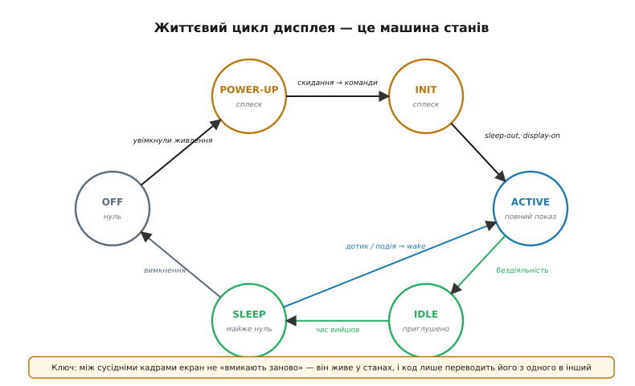
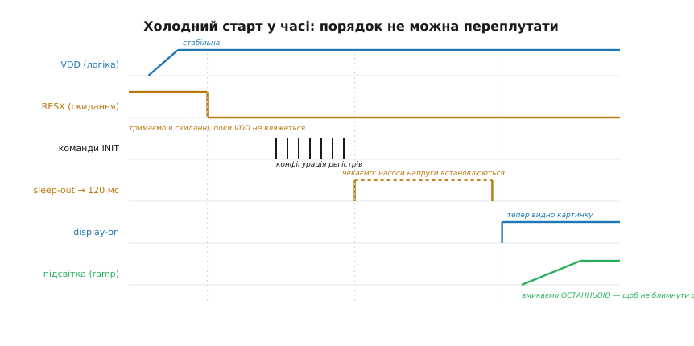
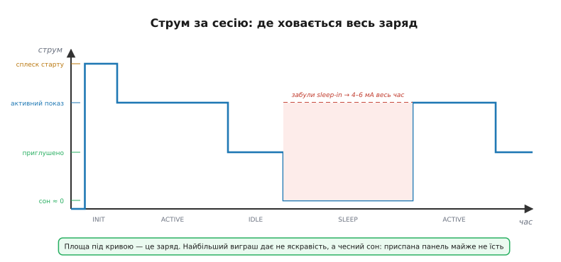
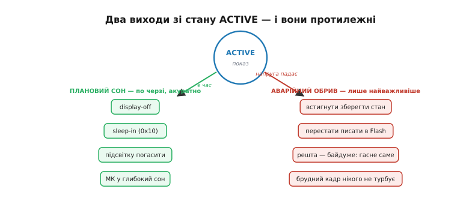

# Керування життєвим циклом дисплея

Дисплей ми вже [вибрали](root:embedded/display-selection) під свій сценарій і [розбудили його контролер](root:embedded/gram-init-sequence) — залили в нього потрібні регістри, і на склі вперше зʼявилася картинка. Здавалося б, на цьому з дисплеєм покінчено: пиши в кадровий буфер та й годі. Але між тим першим увімкненням і тією миттю, коли пристрій кладуть на полицю розрядженим, екран проживає ціле **життя** — він прокидається, світить, дрімає, гасне, оживає знову, і так тисячі разів. І найпідступніше, що **більшість дисплейних бід — це біди не малювання, а саме цього життя**. Білий екран після ввімкнення, чорний екран після виходу зі сну, спалах сміття на старті, акумулятор, що тане за ніч на вимкненому з вигляду приладі, — усе це не помилки у графіці, а помилки в керуванні станами. Тому варто на крок відступити від «що намалювати» й розібратися з «у якому стані зараз екран і як його перевести в наступний».

Корінь усіх цих проблем — спокусливо хибна модель у голові. Здається, ніби дисплей має два положення, як вимикач світла: увімкнено й вимкнено. Насправді ж він радше схожий на живу істоту, що має кілька **режимів буття** і не вміє стрибати між ними як завгодно — лише переходити сусідніми, у правильному порядку й витримавши паузи. Сприймати екран як вимикач — і означає наражатися на весь той букет збоїв. Сприймати його як машину станів — і більшість бід зникає сама.

### Дисплей живе у станах, а не вмикається наодинці

Найперше треба перебудувати саму картину в голові: екран не «вмикають» і не «вимикають» — його **проводять через ланцюг станів**. У кожен момент панель перебуває в одному з кількох цілком конкретних режимів, і весь код керування дисплеєм зводиться, по суті, до того, щоб **вчасно й правильно переводити її з одного режиму в сусідній**.


*Життя дисплея — це машина станів, а не вимикач. З **OFF** живлення піднімає панель у **POWER-UP**, далі йде **INIT** (заливка регістрів), і аж тоді — **ACTIVE**, повний показ. Якщо нічого не діється, екран сповзає в **IDLE** (приглушений), а звідти — у **SLEEP**, де майже не їсть; будь-яка подія будить його назад. Кожна стрілка — окрема дія коду; стрибнути навскоси, поза стрілками, не можна.*

Чому це не просто зручна метафора, а буквально те, як влаштоване залізо? Бо в самій панелі сидить [контролер із власною памʼяттю-картинкою](book:electronics/display-controller) — невеличкий процесор, що має свої внутрішні джерела живлення, свій генератор тактів і свій набір команд. Він фізично **не може** з холодного стану миттю почати правильно світити: спершу мусять піднятися й устоятися його внутрішні напруги, тоді він має прийняти налаштування, і лише потому здатний гнати на скло коректну картинку. Стани — це не вигадка програміста, а відбиток того, через що послідовно проходить кремній усередині модуля. Наша робота — рухатися цим ланцюгом у тому самому темпі, що й залізо, не забігаючи наперед.

> 🔧 **Навіщо це.** Тримайте в коді **явну змінну поточного стану** дисплея, а не вгадуйте його за побічними ознаками. Половина «плаваючих» дисплейних багів — це спроба намалювати в буфер, коли панель ще в INIT, або приспати вже приспану, або розбудити неприспану. Коли стан записаний явно, кожна така дія стає неможливою помилкою, яку видно з коду, а не загадковим миготінням на столі.

Пройдімо це коло по черзі — від холодного старту, найкаверзнішого, до планового засинання й аварійного обриву живлення. Кожен перехід має свою логіку, свої паузи й свої граблі.

### Холодний старт: чому порядок священний

Найтонше місце всього циклу — перший перехід, **холодний старт**: від знеструмленої панелі до видимої картинки. Тут усе вирішує **порядок** і **паузи між кроками**, і саме тут роблять найбільше помилок, бо спокуса «подати живлення й одразу малювати» нездоланна. А панель цього не подарує.

Розберімо, чому послідовність не можна переплутати. Уявімо весь старт як кілька подій на спільній осі часу.


*Холодний старт у часі. Спершу піднімається й **стабілізується** живлення логіки (VDD). Лінію скидання (RESX) тримають притиснутою, поки напруга не вляжеться, і **аж тоді** відпускають. Далі йдуть команди налаштування. Команда «вийти зі сну» (sleep-out) запускає внутрішні насоси напруги — і їм треба **~120 мс**, перш ніж панель можна вмикати. Лише потому подають display-on, і **останньою** плавно піднімають підсвітку. Переставиш кроки місцями — дістанеш білий екран, спалах сміття або взагалі мовчання.*

Логіка цього ланцюга — суто фізична, ланка за ланкою. Спершу — **живлення**: на контролер подають напругу, і їй треба час, щоб піднятися до номіналу й устоятися (внутрішні ємності заряджаються не миттєво). Доки напруга повзе вгору, чіп перебуває в тій самій підступній сірій зоні, що й будь-яка цифрова логіка під недостатнім живленням, — він **ще не здатний думати правильно**. Тому другий крок — **скидання** (англ. *reset*): лінію RESX тримають притиснутою весь час, поки живлення не вляжеться, і відпускають **лише після** того. Відпустиш скидання зарано, поки VDD ще низька, — контролер «прокинеться» з кашею в регістрах і поведеться непередбачувано.

Аж коли скидання відпущено й чіп отямився, надходить черга **налаштування** — тих самих команд, якими [ініціалізують контролер](root:embedded/gram-init-sequence): формат пікселя, орієнтація, гамма, режим інтерфейсу. І тут — найважливіша й найчастіше проґавлена ланка. Серед цих команд є **«вийти зі сну»** (sleep-out), і вона не просто перемикає прапорець: вона **запускає внутрішні джерела живлення панелі**. Річ у тім, що рідкому кристалу для роботи потрібні напруги значно вищі за ті 3.3 вольта, якими живиться логіка, — і контролер добуває їх сам, крихітними **зарядними насосами** (англ. *charge pump* — схема, що накачує вищу напругу, перекидаючи заряд між конденсаторами) та перетворювачами. Ці насоси не вмикаються вмить: конденсаторам треба час набрати й утримати високу напругу. Тому даташити контролерів класу ST7789 та ILI9341 прямо вимагають: після sleep-out **зачекати щонайменше близько 120 мілісекунд**, перш ніж робити наступний крок. Це не запас «про всяк випадок» — це час, за який внутрішня напруга панелі доростає до робочої.

```
порядок старту (порушиш — зламаєш):
  1. подати VDD          → і дати їй устоятися
  2. тримати RESX low    → відпустити ПІСЛЯ стабільної VDD
  3. команди init        → формат, орієнтація, гамма…
  4. sleep-out (0x11)    → і ЧЕКАТИ ~120 мс (насоси напруги)
  5. display-on (0x29)   → аж тепер картинку видно
  6. підсвітка плавно ↑  → ОСТАННЬОЮ, щоб не блимнути сміттям
```

Пропустиш або вкоротиш паузу після sleep-out — і дістанеш класичний симптом: **білий екран** або бліду нерівну картинку. Це і є ознака того, що панель почали гнати, поки її внутрішнє живлення ще не вляглося. Той самий збій спливає й тоді, коли зовнішнє живлення хитке: якщо VDD просідає в мить старту, насоси не добирають напруги, і екран білітиме випадково від ввімкнення до ввімкнення. Тому, побачивши «іноді білий екран на старті», насамперед перевіряють дві речі — чи витримана пауза й чи стабільне живлення, а вже потім чіпають код малювання.

> 🔧 **Навіщо це.** Винесіть холодний старт в **одну функцію з явними паузами** й більше ніколи її не «оптимізуйте» викиданням затримок. Спокуса прибрати «зайві» 120 мс заради швидшого ввімкнення — пряма дорога до плавучих білих екранів, які неможливо відтворити на столі й які виповзають уже в полі. Ці мілісекунди — не ваші; вони належать фізиці насосів усередині панелі.

Останній крок старту заслуговує окремого слова — **підсвітку вмикають найостаннішою, і плавно**. Причина в тому, що в перші миті після display-on у кадровому буфері панелі ще може лежати сміття — хаотичний вміст памʼяті, який не встигли затерти. Якби підсвітка спалахнула одночасно з display-on, користувач побачив би яскравий спалах цього сміття перед тим, як зʼявиться справжня картинка. Тому правильний лад такий: вмикаємо display-on, **уже маючи в буфері чистий перший кадр**, і лише тоді м'яко піднімаємо яскравість підсвітки від нуля. Плавне наростання (це робить [драйвер підсвітки з ШІМ-регулюванням](book:electronics/backlight-dimming)) і ховає залишковий перехід, і виглядає доглянутіше за різкий стрибок. Дрібниця — а саме з таких дрібниць складається відчуття, що прилад зроблено добре, а не нашвидкуруч.

### Три різні «вимкнути»: екран, сон і живлення

Перш ніж рухатися далі по колу, треба розплутати вузол, на якому спотикаються чи не всі початківці. Слово «вимкнути дисплей» означає **три зовсім різні речі**, і плутати їх — означає або марнувати заряд, або діставати чорний екран там, де чекав картинку. Розберімо їх від найлегшої дії до найважчої.

Найлегше — **погасити показ, не чіпаючи нічого іншого**. Це команда display-off (у стандартному наборі — код `0x28`). Вона лише велить контролеру **перестати виводити вміст памʼяті на скло**: картинка зникає, екран чорніє, але сам контролер працює, його насоси гудуть, кадровий буфер цілий, а внутрішнє освіження триває. Це швидкий перехід — увімкнути назад (display-on, `0x29`) можна вмить, без жодних пауз, і на склі знову той самий кадр. Але економія тут мала: горить майже все, крім самого світіння пікселів.

Глибше — **приспати контролер**. Це команда sleep-in (`0x10`), дзеркальна до знайомого нам sleep-out. Вона не просто гасить показ, а **зупиняє внутрішні насоси напруги** й переводить контролер у режим мінімального споживання. Ось де ховається справжня економія — і справжня пастка. Вийти зі сну вмить уже **не можна**: оскільки sleep-in зупинив насоси, то sleep-out муситиме запустити їх наново — а ми вже знаємо, що це знову коштує **тих самих ~120 мс** очікування. Сон економить багато, але платить за це часом пробудження.

І нарешті найважче — **зняти живлення зовсім**, фізично відрубати VDD від панелі (зазвичай ключем-транзистором, яким керує мікроконтролер). Тоді панель не їсть **зовсім нічого**, та оживити її можна лише повним холодним стартом — з усією послідовністю від скидання й до підсвітки. Це найбільша економія й найдовше пробудження.

```
display-off (0x28) : гасне показ, насоси працюють   → вмить назад, економія мала
sleep-in    (0x10) : насоси стоять, контролер дрімає → ~120 мс назад, економія велика
зняти VDD          : панель мертва, нуль струму      → повний старт, економія повна
```

Вибір між ними — це завжди обмін **економії на швидкість пробудження**. Якщо екран гасне на секунду й має миттю ожити (відпустили палець — підсвітку приглушили) — досить display-off. Якщо прилад дрімає хвилинами й готовий зачекати десяту частку секунди на пробудження — варто sleep-in. Якщо пристрій іде в глибокий сон на години — є сенс зняти живлення геть. Сплутати ці три рівні — типова причина того, що «вимкнений» прилад чомусь розряджається: програміст думав, що зняв усе, а насправді лише погасив показ.

> 🔧 **Навіщо це.** Заведіть для дисплея три окремі функції — `display_blank()`, `display_sleep()`, `display_power_off()` — і ніколи не ховайте їх за однією назвою «вимкнути». Інакше колега (чи ви за півроку) викличе «легку» display-off там, де треба було глибокий sleep-in, і прилад тихо їстиме струм цілу ніч. Назва дії має чесно казати, **наскільки глибоко** ви гасите екран.

### Сон і пробудження: де ховається заряд батареї

Тепер — найважливіша частина циклу для всього, що живиться від акумулятора. Ми вже бачили в [виборі дисплея](root:embedded/display-selection), що екран часто стає головним споживачем у пристрої. Але це лише пів правди. Друга половина така: **навіть найощадливіша панель зведе нанівець усю економію, якщо її не присипляти чесно**. І найбільший заряд витікає не тоді, коли екран світить, а тоді, коли ми **думаємо**, що він не світить, а він тихо їсть.

Подивімося на струм пристрою протягом однієї робочої сесії.


*Струм за сесію. На старті — короткий **сплеск** (насоси заводяться, заливається перший кадр). Далі рівне плато **активного показу**. У бездіяльності підсвітку приглушили — струм просів (**IDLE**). А у **SLEEP** він майже на нулі. Червоний пунктир — те, що було б, якби панель забули приспати: вона мовчки тягла б 4–6 мА весь час дрімання. Заряд — це площа під кривою; найбільшу частину його зʼїдає не яскравість, а недоприспаний екран.*

Розберімо, чому саме сон вирішує все. Заряд, що витік з батареї, — це **площа під кривою струму**: струм, помножений на час. Активний показ тягне багато, але триває він зазвичай недовго — користувач глянув і відвів очі. А ось дрімання триває **годинами**, і навіть малесенький струм, помножений на ці години, дає величезний заряд. Тому два-три міліампери, що їх панель тягне у недоприспаному стані, за ніч зʼїдають більше, ніж яскравий показ за весь день. Боротьба за автономність — це передусім боротьба за **чесний нуль** під час сну, а не за яскравість під час показу.

І тут чигає найдорожча помилка всієї теми. Контролери класу ST7789 та ILI9341 у звичайному робочому стані тягнуть кілька міліампер — порядку **4–6 мА** — самі по собі, навіть із погашеним показом, бо їхні внутрішні насоси й логіка працюють. Якщо, вкладаючи пристрій спати, ви приспите мікроконтролер, але **забудете надіслати панелі sleep-in**, — контролер дисплея так і лишиться тягнути ці міліампери всю ніч. Мікроконтролер у глибокому сні їсть мікроампери, а забутий контролер дисплея поруч — міліампери: він **у тисячу разів** ненажерливіший за приспаний МК. Уся ваша робота над струмом спокою піде нанівець через одну ненадіслану команду. Тому **залізне правило**: перш ніж вкладати спати мікроконтролер, спочатку **явно приспи дисплей** — sleep-in, а краще ще й зніми живлення панелі, якщо сон довгий.

```c
// Правильний лад засинання: спершу дисплей, тоді мікроконтролер.
void enter_deep_sleep(void) {
    backlight_set(0);           // 1. погасити підсвітку (найбільший споживач)
    display_send_cmd(0x28);     // 2. display-off: зупинити показ
    display_send_cmd(0x10);     // 3. sleep-in: ЗУПИНИТИ насоси панелі ← без цього 4–6 мА всю ніч
    panel_power_enable(false);  // 4. (для довгого сну) зняти VDD панелі ключем
    mcu_enter_deep_sleep();     // 5. і лише ТЕПЕР приспати сам МК
}
```

Пробудження йде **точно у зворотному порядку**, і це не випадковість, а загальний закон коректного засинання-пробудження: **гасимо від зовнішнього до внутрішнього, будимо від внутрішнього до зовнішнього**. Спершу прокидається мікроконтролер, тоді він повертає живлення панелі (якщо знімав), будить контролер дисплея командою sleep-out, **витримує ті самі ~120 мс**, поки насоси набирають напругу, вмикає показ display-on і **аж тоді** плавно піднімає підсвітку — знов-таки останньою, щоб не блимнути. Якщо ж сон був неглибокий і живлення з панелі не знімали, пробудження зводиться до sleep-out, паузи, display-on і підсвітки — швидше, бо холодного старту не треба.

```c
void wake_from_sleep(void) {
    mcu_wake();                 // 1. МК прокинувся першим
    panel_power_enable(true);   // 2. повернути живлення панелі (якщо знімали)
    display_send_cmd(0x11);     // 3. sleep-out: завести насоси
    delay_ms(120);              // 4. ОБОВʼЯЗКОВА пауза: насоси встановлюються
    display_redraw_current();   // 5. відновити кадр у буфері (його могло не стати)
    display_send_cmd(0x29);     // 6. display-on
    backlight_fade_in();        // 7. підсвітку — плавно й ОСТАННЬОЮ
}
```

Окремо варто памʼятати про крок 5 — **відновлення кадру**. Якщо ви знімали з панелі живлення, її кадровий буфер (GRAM) **забув** усе, що там було, бо памʼять цього класу леткá. Тому після холодного пробудження картинку треба **намалювати наново**, перш ніж умикати показ, — інакше display-on виведе на скло пусту памʼять. Якщо ж ви тільки присипляли контролер (sleep-in), не знімаючи живлення, GRAM зазвичай уцілів, і перемальовувати не обовʼязково. Це ще один доказ того, наскільки важливо чітко знати, **в який саме «сон»** ви вклали панель: від глибини сну прямо залежить, чи треба відновлювати зображення на виході.

> 🔧 **Навіщо це.** Виміряйте струм пристрою в гаданому «сні» **амперметром**, а не вірте, що команда подіяла. Класична картина: прошивка нібито присипляє все, а прилад тягне 5 мА — і виявляється, що sleep-in загубився або панель так і не знеструмилася. Кілька хвилин з мультиметром на старті проєкту рятують від «таємничого» розряду за ніч, який інакше шукатимуть тижнями вже в готовому виробі.

### Робочий стан і м'яке згасання в дрімоту

Між яскравим показом і глибоким сном лежить корисний проміжний режим — **дрімота за бездіяльності**, той самий IDLE з нашого кільця. Це не різке вимкнення, а поступове пригасання: попрацював користувач — екран світить на повну; відвів увагу на кілька секунд — підсвітка плавно **приглушується** до тьмяного рівня; не повертається ще довше — панель іде в справжній sleep. Така драбинка економить заряд, не дратуючи різкими зникненнями картинки, і відтворює знайому поведінку будь-якого смартфона.

Чому драбинка, а не один поріг? Бо різке вимкнення екрана щоразу, тільки-но користувач завмер на секунду, дратувало б і змушувало раз у раз будити пристрій. М'яке приглушення — це делікатний натяк «я зараз засну, але ще тут», який легко скасувати одним дотиком. А вже якщо й після приглушення нічого не відбувається — тоді панель сповзає глибше, у sleep, де economія справжня. Кожна сходинка цієї драбинки вимикає трохи більше й вимагає трохи більше зусиль на пробудження — рівно та сама вісь «економія проти швидкості», що проходить через усю тему.

Практично дрімоту веде простий **таймер бездіяльності**: щоразу, коли стається подія (дотик, кнопка, нові важливі дані), лічильник скидається в нуль; коли він перетинає перший поріг — приглушуємо підсвітку; коли другий — присипляємо панель. Це кілька рядків у головному циклі, але саме вони визначають, скільки протягне батарея у звичайному, рваному ритмі користування, де показ потрібен короткими спалахами, а решту часу екран міг би дрімати.

### Коли живлення обривається саме: аварійний вихід

Дотепер ми керували переходами **самі** — вибирали мить, коли погасити чи приспати. Але є перехід, якого ми не обираємо: **живлення обривається без попиту**. Висмикнули шнур, сіла батарея, просіла напруга. І тут поведінка має бути **протилежною** до планового засинання — бо протилежна сама ситуація.

Згадаймо логіку [захисту від зникнення живлення](root:embedded/power-fail-safety): коли напруга падає, у пристрою лишаються лічені мілісекунди, поки конденсатори ще тримають заряд, і за це коротке вікно треба встигнути **найважливіше** — зберегти стан і перестати псувати дані в памʼяті. Прикладімо це до дисплея — і побачимо, що його доля в аварії геть інша, ніж при плановому сні.


*Зі стану ACTIVE ведуть два протилежні виходи. **Ліворуч — плановий сон**: є час, тож гасимо акуратно й по черзі — display-off, sleep-in, підсвітка, потім МК. **Праворуч — аварійний обрив**: часу катма, тож робимо лише життєво потрібне — встигнути зберегти стан і не зіпсувати Flash; а дисплей просто кидаємо. Брудний останній кадр на екрані, що й так гасне, не турбує нікого.*

Ось ключове прозріння теми про аварію: **дисплей у мить обриву живлення не має значення**. Він і так за частку секунди згасне сам, бо зникне напруга. Витрачати дорогоцінні мілісекунди аварійного вікна на акуратне гасіння екрана — display-off, sleep-in, плавне згасання підсвітки — було б грубою помилкою: ці команди ще й повільні (згадаймо паузи), а вікно вузьке. Брудний, недомальований останній кадр на екрані, який однаково чорніє, **не зашкодить нікому**. Тому в аварійному обробнику дисплей **просто лишають як є** — а весь дефіцитний час кидають на те, що справді незворотне: дописати критичний стан у [нелетку памʼять](root:embedded/eeprom-fram) і не лишити в ній напівзапис.

Звідси й головна різниця двох виходів. Плановий сон — це **акуратність**: часу досить, тож гасимо все по черзі, у правильному порядку, щоб і заряд зберегти, і виглядало охайно. Аварійний обрив — це **тріаж**: часу обмаль, тож рятуємо лише незамінне (цілість даних), а на все відновне — зокрема й на дисплей — махаємо рукою, бо воно само владнається при наступному ввімкненні. Сплутати ці дві стратегії — марнувати аварійне вікно на косметику й через те втратити справді важливе — типова й дорога помилка.

> 🔧 **Навіщо це.** В обробнику просідання живлення **не чіпайте дисплей узагалі**. Кожна команда панелі там — це вкрадені у збереження стану мікросекунди, та ще й на повільну операцію, що однаково не встигне доробитися. Хай екран гасне як завгодно брудно: його ніхто вже не побачить, а от напівзаписане калібрування у Flash отруїть наступний запуск. У аварії дисплей — найменша з ваших турбот.

### Усе разом: дисплей як машина станів у прошивці

Зведімо коло докупи. Усе, що ми розібрали, — холодний старт із його паузами, три різні «вимкнути», чесний сон і пробудження, аварійний вихід — це насправді **одна машина станів**, яку варто прямо так і записати в коді. Не розкидані по проєкту виклики «вмикнути тут, вимкнути там», а єдине місце, що тримає поточний стан дисплея й знає всі дозволені переходи.

```c
typedef enum {
    DISP_OFF,        // живлення знято, панель мертва
    DISP_INIT,       // холодний старт у процесі (паузи, насоси)
    DISP_ACTIVE,     // повний показ
    DISP_IDLE,       // приглушено, чекаємо на подію
    DISP_SLEEP       // sleep-in: насоси стоять, ~нуль струму
} disp_state_t;

static disp_state_t disp_state = DISP_OFF;   // ← явний стан, єдине джерело правди

// малювати дозволено ЛИШЕ в показових станах — інакше пишемо в панель, що не готова
bool display_ready(void) {
    return disp_state == DISP_ACTIVE || disp_state == DISP_IDLE;
}

void display_draw(const frame_t *f) {
    if (!display_ready()) return;   // захист: у INIT/SLEEP/OFF малювати марно або шкідливо
    framebuffer_blit(f);
}
```

Чому це варте окремого зусилля? Бо явний стан перетворює цілий клас плаваючих багів на **неможливі за побудовою**. Спроба намалювати в панель, що ще в `DISP_INIT`, тихо нічого не зробить замість того, щоб видати спалах сміття. Спроба приспати вже приспану чи розбудити неприспану відсіється перевіркою стану. А найголовніше — увесь порядок переходів (паузи, лад гасіння й пробудження) живе **в одному місці**, а не розповзається копіями по обробниках кнопок, таймерах і драйвері живлення, де його неминуче десь та й переплутають.

```c
// Єдина точка переходів: тут — увесь порядок і всі паузи, більше ніде.
void display_request(disp_event_t ev) {
    switch (disp_state) {
    case DISP_OFF:
        if (ev == EV_WAKE)  { cold_start(); disp_state = DISP_ACTIVE; }
        break;
    case DISP_ACTIVE:
        if (ev == EV_TIMEOUT) { backlight_dim();  disp_state = DISP_IDLE;  }
        if (ev == EV_SLEEP)   { go_to_sleep();     disp_state = DISP_SLEEP; }
        break;
    case DISP_IDLE:
        if (ev == EV_TOUCH)   { backlight_full();  disp_state = DISP_ACTIVE; }
        if (ev == EV_TIMEOUT) { go_to_sleep();     disp_state = DISP_SLEEP;  }
        break;
    case DISP_SLEEP:
        if (ev == EV_TOUCH)   { wake_from_sleep(); disp_state = DISP_ACTIVE; }
        break;
    default: break;   // у DISP_INIT події ігноруємо — старт завершиться сам
    }
}
```

Так керування дисплеєм перестає бути джерелом загадкових збоїв і стає тим, чим має бути, — **передбачуваною машиною з кількох станів і чітких переходів між ними**. Білий екран на старті, розряд за ніч, спалах сміття, чорнота після пробудження — усі ці біди ростуть з одного кореня: зі ставлення до екрана як до вимикача замість живої істоти зі своїми режимами. Тримайте стан явно, шануйте паузи фізики, гасіть від зовнішнього до внутрішнього й будіть навпаки, а в аварії — рятуйте дані, не екран. Тоді дисплей проживе своє довге життя — тисячі ввімкнень, дрімот і пробуджень — без жодного з тих симптомів, на які інакше підуть тижні марних пошуків. Лишається тільки навчити цей живий екран показувати **правильні кольори** — а [керування кольором і гамою](root:embedded/color-management) вже окрема історія.
