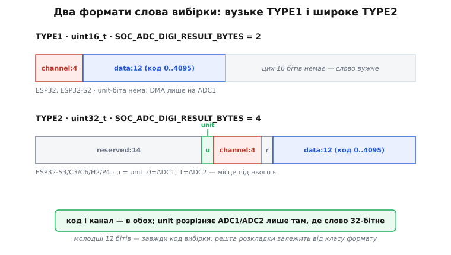
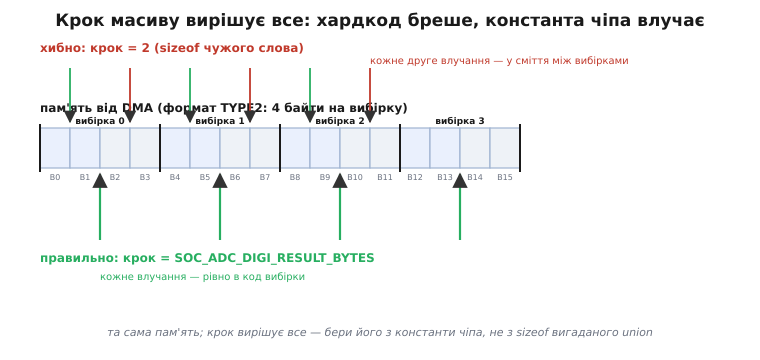

# 🔌 Формат слова вибірки ADC-DMA: вузьке TYPE1 і широке TYPE2

Ми вже бачили, що [DMA-контролер](root:hw-arch/dma-controller) складає в буфер не голі числа, а **слова**, де поряд із кодом виміру лежить номер каналу. Поки код працює на одному чіпі, цим можна не перейматися: узяв структуру з прикладу, навів на буфер — і читаєш. Морока починається в мить, коли той самий код переносять з класичного ESP32 на ESP32-S3. Він компілюється без єдиного попередження, запускається — і віддає кашу: правильна кожна друга вибірка, а між ними сміття. Жодної логічної помилки в коді немає. Помилка глибша: **слово вибірки на цих двох чіпах має різну ширину й різну бітову розкладку**, а код мовчки припускав одну.

Ця вставка — про цілий клас таких слів, а не про конкретний чіп. У ESP-IDF їх рівно два: вузьке шістнадцятибітне (його називають **TYPE1**) і широке тридцятидвобітне (**TYPE2**). Розберімо обидва до останнього біта, з'ясуймо, **чому** широке слово несе зайвий біт, якого нема у вузького, і виведімо один спосіб розпакування, який працює правильно на будь-якому чіпі — бо спирається не на партномер, а на **клас формату**, який чіп сам про себе повідомляє константою.

## Що це за клас

Слово вибірки — це домовленість між залізом і кодом про те, **як упакувати результат одного перетворення** так, щоб у ньому вмістилося не лише саме число, а й службова прикмета: з якого каналу (а часом і з якого АЦП) цей результат прийшов. Домовленість потрібна саме тому, що в безперервному режимі АЦП сканує кілька входів по черзі, і без прикмети канал від каналу в суцільному потоці слів не відрізнити.

Espressif закріпила цю домовленість однією структурою — `adc_digi_output_data_t`. Але сама структура на різних чіпах розкладається по-різному, і ESP-IDF відкрито називає два її варіанти:

```c
/* із hal/adc_types.h — перелічення форматів виходу */
typedef enum {
    ADC_DIGI_OUTPUT_FORMAT_TYPE1,   // слово 16 біт: data + channel
    ADC_DIGI_OUTPUT_FORMAT_TYPE2,   // слово 32 біти: data + channel + unit
} adc_digi_output_format_t;
```

**TYPE1** (від англ. *type* — «тип», просто перший тип формату) — вузьке слово завширшки з `uint16_t`: два байти на вибірку. Так упаковують результат класичний ESP32 і ESP32-S2.

**TYPE2** — широке слово завширшки з `uint32_t`: чотири байти на вибірку. Так роблять ESP32-S3, C3, C6, H2, P4 — усі чіпи новішого покоління із загальним контролером [прямого доступу](root:hw-arch/dma-controller) (GDMA).

Ключова прикмета, за якою код надійно розрізняє ці два світи, — не назва чіпа, а константа `SOC_ADC_DIGI_RESULT_BYTES`: вона дорівнює **2** там, де слово TYPE1, і **4** там, де TYPE2. Саме навколо цієї константи ми й побудуємо безпечний розбір — але спершу подивімося, що всередині кожного слова.

> 🔧 **Навіщо це.** Це не академічний поділ, а прямий корінь найпідступнішого «привида» багатоканального збору даних: код працює на одному чіпі й розсипається на іншому без жодного попередження компілятора. Знаючи, що форматів рівно два й що їх розрізняє одна константа, ви не гадаєте на осцилографі, а одразу дивитеся в правильний бік — на ширину слова цього чіпа. Це різниця між годиною й трьома днями пошуку.

## Блок-схема: обидва слова в одному масштабі

Найкоротший шлях зрозуміти різницю — покласти обидва слова поряд, біт до біта, в однаковому масштабі. Тоді видно не лише *що* різне, а й *чому* воно мусило бути різним.


*Обидва слова вибірки в одному масштабі. У вузькому TYPE1 усі шістнадцять бітів зайняті кодом (12) і каналом (4) — місця під прапорець АЦП немає. У широкому TYPE2 ті самі код і канал лягають вільно, а зайві біти дають простір під unit — прикмету, з якого АЦП знято вибірку. Молодші дванадцять бітів в обох варіантах — завжди код вибірки; решта розкладки залежить від класу формату.*

Розберімо кожне слово окремо.

**TYPE1 — усі шістнадцять бітів під зав'язку.** Розкладка гранично щільна:

```
біти  15 … 12 | 11 … 0
поле  channel | data
      (4 біти) | (12 біт, код 0..4095)
```

Дванадцять молодших бітів — код вибірки, рівно стільки, скільки дає дванадцятибітний SAR-перетворювач: числа від 0 до 4095. Чотири старших біти — номер каналу. І все: шістнадцять бітів вичерпані до останнього. **Вільного місця у слові не лишилося ні на що.** Це стане важливим за хвилину.

**TYPE2 — тридцять два біти, і в них є простір.** Розкладка та сама за суттю, але з повітрям між полями й одним зайвим прапорцем:

```
біти  31 … 17 | 16   | 15 … 13 | 12  | 11 … 0
поле  reserved | unit | channel | rsv | data
      (14 біт)  | (1)  | (4 біти) | (1) | (12 біт, код)
```

Ті самі дванадцять бітів коду в молодшому кінці, той самий чотирибітний канал — а понад ними з'являється **unit**: один біт, якого у вузького слова не було. Решта — резерв, просто незаповнений простір широкого слова. (Точний розподіл резервних бітів різниться від чіпа до чіпа — до цього ми ще дійдемо у варіаціях класу, — але суть скрізь однакова: код і канал на місці, а вгорі є простір, і в ньому сидить unit.)

## Типова «розпіновка»: три поля слова

Слово не має виводів, як мікросхема, але має свій сталий склад «полів», і він повторюється в класі так само, як розпіновка повторюється в родині чипів. Полів усього три, і кожне відповідає на своє питання.

**`data` — саме число.** Дванадцять бітів, код від 0 до 4095, результат одного перетворення дванадцятибітного АЦП. Це те, заради чого все й робилося; решта полів — службова обгортка навколо нього. Ширина рівно дванадцять — тому стеля коду 4095 = 2¹² − 1, і саме це число стоїть у знаменнику переведення коду в напругу.

**`channel` — з якого входу.** Чотири біти (на деяких чіпах — три, про це нижче), номер каналу мультиплексора. У режимі сканування АЦП обходить входи по черзі, і без цього поля суцільний потік слів був би анонімним: код є, а який вивід його породив — невідомо. Поле `channel` робить кожне слово самоописовим.

**`unit` — з якого АЦП** (лише у TYPE2). Один біт: `0` означає ADC1, `1` — ADC2. Він каже не про канал усередині перетворювача, а про те, **який із двох перетворювачів чіпа** зняв цю вибірку. У вузького TYPE1 цього поля немає зовсім.

> 🔧 **Навіщо це.** Поле `channel` — це те, без чого багатоканальний потік неможливо розкласти назад на окремі сигнали. Коли ви скануєте, скажімо, три давачі, у буфер лягає перемішаний потік їхніх кодів; лише `channel` дозволяє розсортувати його в три окремі ряди. Проґавили це поле — і три сигнали злипаються в один безглуздий. Тому в розборі слова читання каналу — не менш обов'язкове, ніж читання самого коду.

## «Підключення»: чому unit розрізняє ADC1/ADC2 — і чому лише в широкому слові

Тепер — до найцікавішого «чому», яке пояснює всю різницю форматів. Звідки взагалі взявся unit-біт і чому його немає в TYPE1? Відповідь не в примсі розробників, а в простій арифметиці бітів і в тому, як влаштоване залізо кожного покоління.

Почнімо з класичного ESP32. У нього два АЦП — ADC1 і ADC2, — але **прямий доступ до пам'яті вміє лише ADC1**: ADC2 у режим DMA не ходить узагалі (він ділить вузли з радіо й лишений безперервного режиму). Отже, у потоці DMA на класичному ESP32 **усі вибірки завжди з ADC1** — без винятків. Раз джерело завжди одне, то й позначати його в кожному слові безглуздо: це було б як штампувати на кожному листі з однієї друкарні її адресу, коли інших друкарень не існує. Прапорець `unit` тут не потрібен за самою логікою заліза.

І тут арифметика бітів сходиться з логікою напрочуд вдало. Шістнадцять бітів TYPE1 **і так вичерпані** дванадцятьма бітами коду й чотирма бітами каналу — вільного місця під зайвий прапорець просто **немає**. Якби ADC2 і вмів DMA, unit-біт нікуди було б покласти, не жертвуючи бітом коду чи каналу. Але жертвувати й не довелося: раз джерело завжди ADC1, біт і не потрібен. Вузьке слово й обмежене залізо збіглися ідеально.

Новіші чіпи змінили обидві половини цієї рівноваги. Їхній загальний GDMA гнучкіший, і на частині з них DMA може обслуговувати **обидва** АЦП — тож у потоці вже можуть перемішуватися вибірки з ADC1 і ADC2. Тепер джерело **не завжди одне**, і його доводиться позначати в кожному слові, інакше після розбору не скажеш, звідки код. Прапорець `unit` став **потрібним**. І тут знову втручається арифметика: щоб його вмістити, слово розширили до тридцяти двох бітів. У широкому слові місця вдосталь — дванадцять бітів коду, чотири каналу, один unit, а решта чотирнадцять лишаються резервом. **Ширина слова виросла рівно тому, що з'явилася потреба, якій у вузькому слові не було де поміститися.**

Ось чому два «чому» — чому unit розрізняє ADC1/ADC2 і чому він живе лише в TYPE2 — це насправді одне «чому». Біт з'являється там і тоді, де залізо здатне змішати два джерела в один потік; а вміщається він лише туди, де слово досить широке, щоб його прийняти. На класичному ESP32 не було ні потреби (завжди ADC1), ні місця (16 бітів під зав'язку) — і біта немає. На нових чіпах з'явилися і потреба, і місце — і біт є.

> 🔧 **Навіщо це.** Практичний висновок прямий: на TYPE1 ви **знаєте наперед**, що всі вибірки з ADC1, і читати unit нема звідки й нема потреби. На TYPE2, якщо ви налаштували потік лише з ADC1, unit у кожному слові теж буде 0 — але код, який хоче лишитися переносним і чесним, не має *припускати* цього, бо на змішаному потоці припущення розсиплеться. Правило просте: unit існує рівно там, де слово 32-бітне; читати його є сенс, коли в потоці може бути більш ніж один АЦП.

## «Перший байт»: прочитати перше слово, не помилившись форматом

Оживімо клас так само, як оживляють нову мікросхему, — доведімо потік до першого осмисленого числа. Тільки «перший байт» тут — це «перше **слово**», і головна пастка чигає саме на тому, як від буфера дійти до полів цього слова.

Наївний шлях, який спокушає кожного: оголосити свою структуру з бітовими полями, навести на буфер як на масив — і читати `arr[i].data`. На одному чіпі це працює й підманює вас думкою, що все гаразд. Але саме тут закладено міну переносності: **розмір вашої структури зашитий у код намертво**, а справжня ширина слова залежить від чіпа. Оголосили `uint16_t`-слово — воно правильне на TYPE1 і вдвічі вузьке за реальне слово TYPE2; індексація `arr[i]` поїде, і ви читатимете кожну другу вибірку, ловлячи між ними сміття.

Правильний «перший байт» спирається на три опори, які ESP-IDF дає саме для цього:

1. **`SOC_ADC_DIGI_RESULT_BYTES`** — справжня ширина слова цього чіпа (2 або 4). Крок по буферу беруть **звідси**, а не з `sizeof` вигаданої структури.
2. **Готова структура `adc_digi_output_data_t`** із її членами `type1` і `type2` — бітову розкладку вже описав виробник, свою вигадувати не треба.
3. **Прапорець чіпа `CONFIG_IDF_TARGET_*`** — за ним на етапі компіляції обирають, який член структури (`type1` чи `type2`) дійсний саме тут.

Складімо з них найкоротший чесний розбір першого слова:

```c
#include "esp_adc/adc_continuous.h"
#include "soc/soc_caps.h"

/* Навести на найперше слово буфера — через РОЗМІР РЕЗУЛЬТАТУ цього чіпа,
   а не через тип вигаданої структури. */
const adc_digi_output_data_t *p = (const void *)&buf[0];

/* Дістати код і канал із того члена структури, що дійсний на цьому чіпі. */
#if CONFIG_IDF_TARGET_ESP32 || CONFIG_IDF_TARGET_ESP32S2
    uint32_t code = p->type1.data;      /* TYPE1: 16-бітне слово */
    uint32_t ch   = p->type1.channel;
#else
    uint32_t code = p->type2.data;      /* TYPE2: 32-бітне слово */
    uint32_t ch   = p->type2.channel;
#endif

float v = code * 3.3f / 4095.0f;        /* код → вольти (перше наближення) */
```

«Ага-момент» настає, коли це перше число виявляється розумним — не нуль, не 4095, а щось посередині, що ворушиться, коли ви чіпаєте вхід. Значить, ви поцілили у правильний член структури й узяли правильну ширину. З цієї миті можна проходити весь буфер — але саме тут ховається друга половина пастки, і її варто винести окремо.

## Безпечний до чіпа розбір: крок — із константи, поля — через макроси

Перше слово прочитати легко; уся хитрість — пройти **масив** таких слів, не спіткнувшись об його крок. Повернімося до образу з блок-схеми: та сама пам'ять, але два способи по ній крокувати дають протилежний результат.


*Крок масиву вирішує все. Угорі хардкод «крок = 2» (успадкований від вузького слова) на широкому TYPE2 влучає то у справжню вибірку, то у сміття між ними — кожне друге число хибне. Унизу крок, узятий із `SOC_ADC_DIGI_RESULT_BYTES`, дорівнює справжній ширині слова й потрапляє рівно в код кожної вибірки. Пам'ять одна — різниця лише в тому, звідки взяли крок.*

Звідси два тверді правила безпечного розбору, обидва — про те, щоб **нічого не хардкодити**.

**Правило перше: крок по буферу — з константи чіпа.** Кількість вибірок у блоці — це довжина блока, поділена на `SOC_ADC_DIGI_RESULT_BYTES`, а не на `sizeof` якоїсь структури. І до i-ї вибірки наводяться через зсув `i * SOC_ADC_DIGI_RESULT_BYTES` байтів від початку буфера, а не через індекс `arr[i]` масиву вигаданого типу. Тоді на TYPE1 крок сам стане 2, на TYPE2 — 4, і жоден випадок не зламається.

**Правило друге: поля — через власні макроси, що самі розводяться на `type1`/`type2`.** Замість `#if` у кожному місці читання визначають два коротких макроси один раз — і далі код читає поля через них, не думаючи про чіп. Саме так це зроблено в офіційному прикладі ESP-IDF:

```c
#include "esp_adc/adc_continuous.h"
#include "soc/soc_caps.h"

#define VREF    3.3f
#define ADC_MAX 4095.0f            /* 2¹² − 1 */

/* Власні макроси доступу — розводяться на потрібний член структури під час
   компіляції. TYPE1 на класичному ESP32/S2, TYPE2 на решті чіпів. */
#if CONFIG_IDF_TARGET_ESP32 || CONFIG_IDF_TARGET_ESP32S2
    #define GET_CHANNEL(p)  ((p)->type1.channel)
    #define GET_DATA(p)     ((p)->type1.data)
#else
    #define GET_CHANNEL(p)  ((p)->type2.channel)
    #define GET_DATA(p)     ((p)->type2.data)
#endif

/* Розбір одного блоку. Крок масиву — з константи чіпа, НЕ з sizeof:
   на TYPE1 це 2 байти, на TYPE2 — 4; хардкод зламав би один із випадків. */
void process_block(const uint8_t *buf, uint32_t len)
{
    /* скільки вибірок у блоці — ділимо на РОЗМІР РЕЗУЛЬТАТУ цього чіпа */
    uint32_t count = len / SOC_ADC_DIGI_RESULT_BYTES;

    for (uint32_t i = 0; i < count; ++i) {
        /* наводимося на i-ту вибірку через розмір результату,
           а не через індекс масиву вигаданого типу */
        const adc_digi_output_data_t *p =
            (const adc_digi_output_data_t *)&buf[i * SOC_ADC_DIGI_RESULT_BYTES];

        uint32_t ch   = GET_CHANNEL(p);
        uint32_t code = GET_DATA(p);

        /* Скільки каналів має ADC1 на цьому чіпі; більший номер —
           службове/сміттєве слово, пропускаємо. */
        if (ch >= SOC_ADC_CHANNEL_NUM(ADC_UNIT_1)) continue;

        float v = code * VREF / ADC_MAX;   /* код → вольти */
        route_sample(ch, v);               /* калібрування/фільтр/черга — тут */
    }
}
```

Зверніть увагу на дві дрібниці, що рятують від тихих помилок. По-перше, перевірка `ch >= SOC_ADC_CHANNEL_NUM(ADC_UNIT_1)`: сам виробник у коментарі до поля `channel` попереджає, що номер каналу понад допустимий означає **недійсні дані** (арбітр АЦП може вкинути сміттєве слово). Ми такі слова пропускаємо, а не переводимо в напругу. По-друге, ділення довжини на `SOC_ADC_DIGI_RESULT_BYTES`, а не на `sizeof(...)`: якщо колись хтось оголосить структуру з іншим вирівнюванням чи додасть поле, `sizeof` збреше, а константа чіпа — ні.

Порахуймо, у що обходиться ширше слово, щоб різниця форматів стала числом, а не абстракцією.

**Умова.** Один канал, частота вибірки f_s = 40 кГц. Порівняти потік *байтів* у пам'ять на TYPE1 і на TYPE2 та кількість кроків розбору на секунду.

```
Потік байтів у пам'ять:
  TYPE1 (2 Б/вибірку):  40 000 · 2 = 80 000 Б/с =  80 кБ/с
  TYPE2 (4 Б/вибірку):  40 000 · 4 = 160 000 Б/с = 160 кБ/с

Кроків розбору на секунду (по одному на вибірку) — однаково:
  40 000 кроків/с в обох випадках

Але крок по буферу в байтах різний:
  TYPE1: +2 байти за крок
  TYPE2: +4 байти за крок
```

**Висновок.** Той самий потік вибірок на широкому слові дає **вдвічі більший потік байтів** — просто тому, що корисних дванадцять бітів їдуть тепер у чотирибайтовій обгортці замість двобайтової. На шину внутрішньої RAM це лягає вдвічі важче, хоча числа однакові. Ось чому оцінки розміру буфера й пропускної здатності не можна переносити зі старого чіпа на новий дослівно: рахунок у байтах змінюється, навіть коли частота вибірок та сама. І ось чому крок беруть із константи — вона несе цю різницю автоматично.

## Типові граблі класу

- **Хардкод ширини слова.** Найголовніша й найтиповіша. Оголосили `uint16_t`-слово (або будь-яку структуру фіксованого розміру) й ходять по буферу індексом `arr[i]`. На TYPE1 працює, на TYPE2 крок удвічі малий — кожна друга вибірка правильна, між ними сміття. Лікується єдиним правилом: крок — із `SOC_ADC_DIGI_RESULT_BYTES`.
- **`sizeof` замість константи чіпа.** Тонший різновид того самого: беруть `len / sizeof(adc_digi_output_data_t)`. Часто збігається з правильним, але спирається на розмір/вирівнювання структури, а не на офіційну ширину результату; надійніше й чесніше — константа.
- **Читання unit на TYPE1.** Спроба звернутися до `p->type1.unit` не скомпілюється (такого поля немає) — а от звернення до `type2` на класичному ESP32 дасть неправильну розкладку. Читати треба той член, що дійсний на цьому чіпі, через макроси, які розводяться самі.
- **Пропущена перевірка каналу.** Не відсіяли слова з номером каналу понад допустимий — і в дані просочується службове/сміттєве слово арбітра, псуючи середні й спектр. Завжди `ch >= SOC_ADC_CHANNEL_NUM(...)` → пропустити.
- **Плутанина з історичним значенням «TYPE2».** У старих (4.x) версіях ESP-IDF ці ж імена `type1`/`type2` означали інше — дванадцятибітний проти одинадцятибітного формату **на класичному ESP32**, а не ширину слова між чіпами. У сучасному (5.x) вжитку, про який тут ідеться, TYPE1 — це 16-бітне слово ESP32/S2, TYPE2 — 32-бітне слово нових чіпів. Читаючи старі поради в мережі, звіряйте, про яке значення йдеться.
- **Припущення «unit завжди 0».** На TYPE2 з потоком лише від ADC1 unit і справді нуль — але код, що на це закладається, зламається в мить, коли хтось увімкне змішаний потік із ADC1 і ADC2. Якщо в потоці буває більш ніж один АЦП — читайте unit, а не припускайте.

## Варіації класу

Усередині широкого TYPE2 бітова розкладка не буквально однакова на всіх чіпах — і корисно знати, де саме вона гуляє, бо це впливає на те, які номери каналів і АЦП взагалі можливі.

**Ширина поля `channel`: чотири біти проти трьох.** Більшість чіпів (ESP32, S2, S3, C6, H2, P4) дають каналу чотири біти. Але ESP32-C3 і C2 — три біти (`channel:3`), бо в них менше каналів АЦП, і четвертий біт зайвий. Практично це означає лише те, що на C3/C2 припустимих номерів каналу менше; безпечний розбір це не ламає, бо перевірку робить `SOC_ADC_CHANNEL_NUM(...)`, яка знає число каналів саме цього чіпа. Хардкод «каналів рівно шістнадцять» тут збрехав би — ще один аргумент проти магічних чисел.

**Наявність поля `unit`: є не скрізь навіть у TYPE2.** ESP32-C6 і H2 мають широке 32-бітне слово, але **unit-біта в ньому немає** — ті ж чотирнадцять чи п'ятнадцять бітів там просто резерв. Причина та сама, що робила його зайвим на класичному ESP32: DMA на цих чіпах обслуговує лише один АЦП, тож розрізняти нема чого. Тобто «широке слово» не завжди означає «є unit» — воно означає лише «є місце під unit, якщо він потрібен». Потрібність вирішує залізо конкретного чіпа.

**Розрядність коду.** У всьому сучасному ряду код — дванадцятибітний (0..4095), тож знаменник переведення в напругу скрізь 4095. Історичний одинадцятибітний формат класичного ESP32 (те саме старе значення «type2») у безперервному DMA сьогодні не використовують; сталу розрядність дає `SOC_ADC_DIGI_MAX_BITWIDTH`, якщо треба не хардкодити й це число.

Хоч би яка варіація, кістяк класу незмінний: **молодші дванадцять бітів — завжди код вибірки**, поряд — канал, а прапорець АЦП з'являється лише там, де слово широке *і* залізо здатне змішати два джерела. Тому весь безпечний розбір зводиться до однієї дисципліни — не вгадувати ширину й розкладку, а брати їх у самого чіпа: крок із `SOC_ADC_DIGI_RESULT_BYTES`, поля через `type1`/`type2`-макроси, межі каналів із `SOC_ADC_CHANNEL_NUM`. Код, написаний так, переживає переїзд між чіпами без єдиної правки — саме тому, що ніде не назвав жодного партномера, а спитав залізо, який на ньому клас формату.

*(Бітові розкладки, значення `SOC_ADC_DIGI_RESULT_BYTES` по чіпах, ширини полів `channel`/`unit` і макросний спосіб доступу звірені з вихідними текстами ESP-IDF — `components/hal/include/hal/adc_types.h`, `components/soc/*/include/soc/soc_caps.h` та офіційним прикладом `peripherals/adc/continuous_read`, гілки release/v5.x, станом на липень 2026; статус — усталено.)*
