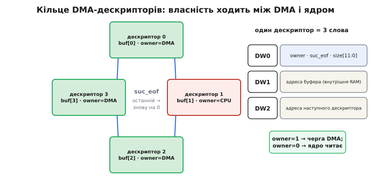
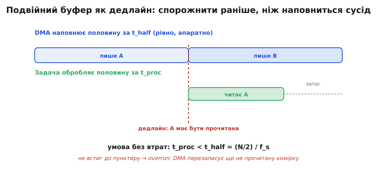
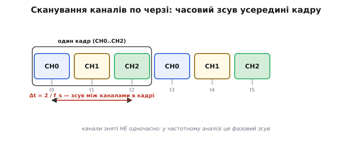

# DMA + АЦП: механіка безперервного потоку до дна

У [базовому кроці](root:embedded/dma-adc) ми звели зв'язку в один образ: таймер задає ритм, [АЦП](root:hw-analog/adc) на кожен тік робить вибірку й піднімає запит, [DMA-контролер](root:hw-arch/dma-controller) складає слова в кільцевий буфер, а ядро вмикається раз на заповнену половину. Цього образу досить, щоб зрозуміти *навіщо* воно й *що* дає — на два-три порядки менше пробуджень ядра при рівному кроці вибірок. Але щойно ви сядете піднімати частоту, ловити рідкісні втрати вибірок чи діставати чистий спектр із багатоканального сканування, образ розсиплеться на десяток «а чому саме так». Чому частота дискретизації драйвера на класичному ESP32 упирається в 83 кГц, хоча сам SAR-перетворювач тягне два мегагерци? Що насправді ховається за словом «кільцевий буфер» — це один масив чи щось складніше? Куди дівається тремтіння кроку і чи дійсно воно зникає повністю? Чому вибірки різних каналів у «одному кадрі» насправді зняті в різні моменти? І чому на ESP32-S3 блок даних, який щойно записав DMA, ядро може прочитати **порожнім**, хоча пам'ять уже заповнена?

Ці питання не з'являються, поки код працює. Вони з'являються, коли він працює *майже* — спектр трохи брудний, зрідка губиться вибірка, дві осі акселерометра зсунуті по фазі. Щоб їх бачити наперед, треба спуститися нижче образу — до того, як задається темп у залізі, як влаштований ланцюг DMA-дескрипторів, звідки береться залишкове тремтіння й де ядро та контролер б'ються за ту саму комірку пам'яті. Саме туди ми й підемо: не переказувати базову зв'язку, а розбирати її механіку до дна.

### Звідки береться темп: не «таймер тікає», а поділ частоти вглиб

У базовому кроці темп задавав «таймер із частотою f_s». Це правда для тих чіпів, де вибірку запускає окремий [таймер-лічильник](root:hw-arch/timer-counter). Але на ESP32 темп народжується інакше — усередині самого цифрового контролера АЦП, — і зрозуміти цей шлях варто, бо саме він пояснює тверді межі частоти.

У безперервному режимі перетворювач крокує не від зовнішнього таймера, а від власного дільника частоти. Є базовий тактовий генератор цифрового контролера — назвімо його f_d (англ. *digital controller clock*). Espressif радить тримати f_d не вище 5 МГц, бо на вищому такті аналоговий тракт SAR не встигає усталитися й точність падає. Кожна вибірка вимагає двох тактів цього дільника (один — на запуск перетворення, один — на зчитування результату), а між запусками стоїть програмований інтервал. Звідси частота вибірок:

```
f_s = f_d / interval / 2
```

Розгорнімо, що це означає для меж. Візьмімо стелю f_d = 5 МГц і найкоротший інтервал interval = 1:

```
f_s(max) = 5 000 000 / 1 / 2 = 2 500 000 вибірок/с ≈ 2.5 МГц
```

Ось звідки береться легендарна цифра «до 2 МГц»: це стеля **самого перетворювача**, коли дільник розкручений на максимум. Але драйвер `adc_continuous` у ESP-IDF навмисне не пускає вас туди. Він тримає f_s у вікні, заданому двома константами з `soc/soc_caps.h`:

```
SOC_ADC_SAMPLE_FREQ_THRES_LOW  =   611  Гц   (нижня межа)
SOC_ADC_SAMPLE_FREQ_THRES_HIGH = 83333  Гц   (верхня межа за замовчуванням)
```

Верхня межа 83.333 кГц — не примха. Це та частота, на якій драйвер за стандартних налаштувань дільника гарантує, що оцифровані коди ще коректні: вище неї аналоговий вхід не встигає зарядити внутрішній конденсатор вибірки-зберігання до потрібної точності, і молодші біти починають брехати. Підняти стелю можна — Espressif дозволяє переписати `SOC_ADC_SAMPLE_FREQ_THRES_HIGH` і `ADC_LL_CLKM_DIV_NUM_DEFAULT`, — але тоді відповідальність за точність лягає на вас: доведеться подовжувати час вибірки або миритися з гіршими молодшими бітами. Нижня межа 611 Гц теж змістовна: нижче неї дільник уже не може розтягти інтервал, лишаючись у робочому режимі, — для повільніших вимірів беруть не безперервний режим, а поодинокі перетворення на вимогу.

> 🔧 **Навіщо це.** Коли колега каже «поставив 200 кГц, а коди якісь брудні» — причина майже завжди тут: він переступив `THRES_HIGH`, не подовживши час вибірки. Знаючи формулу f_s = f_d / interval / 2, ви одразу бачите, який важіль крутити: не «магічну» частоту, а або дільник f_d, або час заряду входу. І навпаки — якщо треба рівно 8 кГц під телефонну смугу, ви впевнені, що це всередині вікна 611…83333 і драйвер віддасть чесні коди без танців із бубном.

Порахуймо реальний робочий приклад, щоб зчепити формулу з практикою.

**Умова.** Треба вибірка 44.1 кГц (якість компакт-диска) на класичному ESP32. Чи всередині вікна? Який інтервал дільника при f_d = 5 МГц?

```
Перевірка вікна:
  611 ≤ 44100 ≤ 83333  →  так, усередині

Інтервал при f_d = 5 МГц:
  f_s = f_d / interval / 2
  interval = f_d / (2 · f_s) = 5 000 000 / (2 · 44100)
           = 5 000 000 / 88200 ≈ 56.7  →  округлення до 57

Фактична частота при interval = 57:
  f_s(факт) = 5 000 000 / 57 / 2 ≈ 43 860 вибірок/с
```

**Висновок.** 44.1 кГц лягає у вікно, але через цілочисловий дільник фактична частота виходить 43.86 кГц — на 0.3 % нижча. Для звуку це нечутно, а от для точного частотного аналізу цю поправку треба знати: якщо ви шукаєте лінію на 20 000 Гц, вона в спектрі стане на позначці 20 000 × (43860/44100) ≈ 19 891 умовних герців, і без поправки на реальну f_s ви прочитаєте частоту з похибкою. Драйвер повертає фактичну f_s — беріть її, а не ту, що замовляли.

### Кільцевий буфер — насправді ланцюг дескрипторів

У базовому кроці «кільцевий буфер у SRAM» звучав як єдиний масив, по якому DMA біжить по колу. Для розуміння ідеї цього досить, але залізо влаштоване хитріше, і різниця стає важливою, щойно ви налаштовуєте розміри або ловите збій. На ESP32-S3, C3 та інших чіпах із загальним контролером [прямого доступу](root:hw-arch/dma-controller) (GDMA, англ. *General DMA*) DMA не знає ні про який «масив». Він знає лише про **ланцюг дескрипторів** (англ. *descriptor* — «описувач») — маленьких структур у пам'яті, кожна з яких описує один шматок буфера й указує на наступну.

Один дескриптор GDMA — це рівно три 32-бітні слова:

```
DW0  — керівне слово:  owner · suc_eof · err_eof · size[11:0]
DW1  — адреса буфера, куди складати дані (лише внутрішня RAM)
DW2  — адреса наступного дескриптора (0, якщо цей останній)
```

Розберімо керівне слово DW0 по бітах, бо в ньому вся суть механіки.

**Біт `owner` (DW0[31]) — хто зараз володіє буфером.** Це серце всієї схеми. `owner = 1` означає «буфером розпоряджається DMA, ядро туди не лізе»; `owner = 0` — «DMA закінчив, буфер належить ядру». Контролер, дійшовши до дескриптора, дивиться на `owner`: якщо 1 — він має право писати; записавши свій шматок, він **сам скидає** `owner` у 0, віддаючи буфер ядру. Ядро, дочитавши, ставить `owner` назад у 1 — і буфер знову в черзі DMA. Це апаратний семафор: власність ходить туди-сюди без жодного м'ютекса в коді.

**Біт `suc_eof` (DW0[30]) — кінець ланцюга.** `suc_eof = 1` каже: «це останній дескриптор». Досягнувши його й переписавши свій буфер, DMA піднімає переривання «successful EOF». Саме на це переривання й прокидається задача — не «на половину масиву», а на кінець наповненого дескриптора, позначеного як EOF.

**Поле `size` (DW0[11:0]) — скільки байтів у цьому шматку.** Дванадцять бітів дають максимум 4095 байтів на один дескриптор. Ось перша тверда межа, невидима в базовому образі: **один дескриптор не може описати буфер більший за 4 КБ**. Хочете кільце на 16 КБ — це не один дескриптор, а чотири, зчеплені в ланцюг через DW2.

І тут головне: **«кільцевий» буфер — це ланцюг, у якого останній дескриптор указує назад на перший.** Замикання робиться не магією, а полем DW2: DW2 останнього дескриптора містить адресу нульового. DMA, дійшовши до кінця, читає DW2, бачить адресу початку — і йде на друге коло. Ніякого «переповнення масиву» немає, є просто нескінченний обхід замкненого списку.


*«Кільцевий буфер» на рівні заліза — це не масив, а замкнений ланцюг дескрипторів. Кожен дескриптор — три слова (DW0 з бітами owner/suc_eof/size, DW1 з адресою буфера, DW2 з адресою наступного). Біт owner віддає буфер то контролеру (owner=1), то ядру (owner=0); DW2 останнього вказує на перший — звідси «кільце».*

Ця будова пояснює одразу кілька правил, які інакше виглядають довільними. Чому буфери мусять лежати **у внутрішній RAM**? Бо поля DW1 і DW2 апаратно вміють адресувати лише її — зовнішню PSRAM DMA-дескриптор просто не бачить. Чому розмір буфера має бути кратний певній гранулі? Бо кожен дескриптор описує цілу кількість вибірок, а вибірка на цих чіпах — чотири байти (про це нижче), тож розмір округлюється до кратного. І чому переривань саме два на коло, а не одне? Бо коли ланцюг ділиться на дві половини, EOF ставлять на межі кожної — це і є апаратна реалізація «половина заповнена».

На класичному ESP32 картина зовні та сама (кільце буферів, переривання на межі), але двигун інший, і про цю відмінність варто знати окремо.

### Два різні двигуни: I2S0 на класичному ESP32 і GDMA на нових

Тут ховається пастка сумісності, що з'їдає години в того, хто перебирається зі старого ESP32 на S3 і копіює код дослівно. Драйвер `adc_continuous` має однаковий програмний інтерфейс на всіх чіпах, але **під капотом крутить два зовсім різні апаратні блоки**, і два наслідки цієї різниці протікають нагору — у формат даних і в те, які периферії конфліктують.

На **класичному ESP32** окремого GDMA немає. Роль DMA-двигуна для АЦП грає **периферія I2S0** — той самий блок, що зазвичай гонить цифровий звук. Її FIFO й ланцюг буферів переносять коди АЦП у пам'ять. Звідси прямий наслідок: якщо I2S0 у вашому проєкті вже зайнятий (наприклад, під зовнішній звуковий кодек), драйвер АЦП поверне `ESP_ERR_NOT_FOUND` — вільного двигуна немає. І формат вибірки тут — **TYPE1**: рівно два байти на результат.

На **ESP32-S3, C3, C6** роль двигуна грає загальний **GDMA** з тими самими дескрипторами DW0/DW1/DW2, які ми щойно розібрали. Якщо всі канали GDMA зайняті — те саме `ESP_ERR_NOT_FOUND`, але вже про GDMA-канал. І формат тут — **TYPE2**: чотири байти на результат.

Різниця в кількості байтів на вибірку — не дрібниця обліку, а те, від чого залежить кожен ваш розрахунок буфера й кожен цикл розпакування. Її задає одна константа:

```
SOC_ADC_DIGI_RESULT_BYTES = 2   на класичному ESP32   (формат TYPE1)
SOC_ADC_DIGI_RESULT_BYTES = 4   на ESP32-S3/C3/C6      (формат TYPE2)
```

Ось чому в базовому кроці ми обережно писали код під TYPE1 із `uint16_t`: він вірний для класичного ESP32. На S3 та сама структура **зламає розпакування** — крок масиву стане вдвічі більшим, і ви читатимете кожну другу вибірку зі сміттям між ними. Правильний спосіб — ніколи не хардкодити крок, а брати його з `SOC_ADC_DIGI_RESULT_BYTES`. Повне розкладання обох форматів по бітах і безпечний до чіпа код розпакування ми винесли в окрему [вставку про два формати вибірки](root:embedded/dma-adc/comp-adc-sample-formats.md); тут досить пам'ятати правило: **крок масиву — з константи чіпа, а не з `sizeof` вигаданої структури**.

### Подвійний буфер під мікроскопом: дедлайн, а не просто «дві половини»

Базовий крок дав головну обіцянку — на високій частоті потік іде без втрат, бо запис і читання ніколи не б'ються за ту саму комірку. Тепер виведімо, **коли саме** ця обіцянка виконується, бо вона не безумовна. За нею стоїть жорсткий часовий бюджет, і варто вивести його з нуля, а не приймати на віру, щоб бачити, скільки у вас запасу й що відбувається, коли його не стало.

Нехай кільце має повний розмір N вибірок і ділиться на дві половини по N/2. DMA наповнює половину рівно, зі швидкістю f_s вибірок за секунду. Час наповнення однієї половини:

```
t_half = (N/2) / f_s
```

Це — інтервал між сусідніми перериваннями EOF і водночас **дедлайн** (англ. *deadline* — «крайній строк») для задачі: щойно DMA заповнив половину B, він одразу починає лити в половину A, і в задачі рівно t_half на те, щоб дочитати A, поки DMA не дійшов туди знову. Позначмо час, за який задача розпаковує й обробляє одну половину, як t_proc. Умова роботи без втрат:

```
t_proc < t_half  =  (N/2) / f_s
```

Слово `<`, а не `≤`, тут принципове: рівність означає, що задача закінчує рівно в мить, коли DMA вже стукає в двері, — жодного запасу на джиттер планувальника, на витіснення вищим пріоритетом чи на кеш-промах. Практичне правило — тримати t_proc щонайбільше в половину t_half, щоб мати дворазовий запас.

Розгорнімо, що станеться, коли умову порушено. DMA доходить по колу до дескриптора, який усе ще позначений `owner = 1` (бо задача не встигла дочитати й повернути `owner = 0`) — і **все одно пише в нього**, затираючи вибірки, яких ядро ще не бачило. Це і є переповнення (англ. *overrun* — «перебіг»). У драйвері ESP-IDF воно виявляється не мовчки: якщо внутрішній пул результатів заповнюється швидше, ніж задача його спорожнює, `adc_continuous_read` повертає `ESP_ERR_INVALID_STATE` із красномовним поясненням у документації — «частота вибірки швидша за темп обробки». Є й окремий сигнал: колбек `on_pool_ovf` спрацьовує в ISR, щойно пул переповнився. Ловити його варто завжди — це найчесніший індикатор, що ви перебрали з f_s або недодали буфера.


*Часовий сенс подвійного буфера. DMA наповнює половину за t_half і одразу переходить на сусідню — це дедлайн для задачі, позначений пунктиром. Смуга «читає A» мусить закінчитися до пунктиру; проміжок до нього — запас часу. Не встигла — DMA другим колом перепише ще не прочитану комірку: overrun.*

Тепер видно, як розмір буфера перетворюється на важіль. Збільшуючи N, ми подовжуємо t_half — рідші переривання, більший запас проти затримок задачі, вища терпимість до сплесків завантаження ядра. Але той самий більший N подовжує затримку від миті вибірки до її обробки: вибірка, що потрапила на початок половини, дочекається обробки аж наприкінці її наповнення. Це і є вічний компроміс подвійної буферизації — пропускна здатність проти затримки, — і його кількісний бік (як обрати N під заданий бюджет затримки й запас проти джиттера) розібрано у [темі про подвійну буферизацію](root:sf-tasks/double-buffering). Порахуймо його на конкретних числах.

**Умова.** ESP32-S3, f_s = 40 кГц, один канал, формат TYPE2 (4 байти на вибірку). Задача обробки одного блоку виміряно займає t_proc = 0.8 мс. Який мінімальний розмір половини буфера дає дворазовий запас? Яка при цьому затримка й скільки байтів за секунду?

```
Дворазовий запас:  t_half ≥ 2 · t_proc = 2 · 0.8 мс = 1.6 мс

Вибірок у половині:
  N/2 = t_half · f_s = 0.0016 с · 40 000 = 64 вибірки

Байтів у половині (TYPE2, 4 Б/вибірку):
  64 · 4 = 256 байтів     →  повне кільце N = 512 байтів

Затримка «вибірка → обробка» (гірший випадок):
  вибірка на початку половини чекає ціле t_half + t_proc
  = 1.6 мс + 0.8 мс = 2.4 мс

Потік у пам'ять:
  40 000 вибірок/с · 4 Б = 160 000 Б/с = 160 кБ/с
```

**Висновок.** Досить крихітного кільця на 512 байтів, щоб мати дворазовий запас часу, а розплата — затримка 2.4 мс від вибірки до її обробки. Хочете відгук швидший — беріть менший буфер, але тоді запас проти джиттера тане; хочете стійкіший потік під важким завантаженням ядра — збільшуйте буфер ціною затримки. Число 160 кБ/с корисне окремо: це навантаження на шину пам'яті, і на високих f_s кількох каналів воно швидко впирається в пропускну здатність внутрішньої RAM.

### Куди зникає тремтіння — і куди не зникає

Базовий крок обіцяв, що DMA прибирає *jitter* — «тремтіння» кроку між вибірками. Це правда, але правда неповна, і різниця важлива для будь-кого, хто робить точний частотний аналіз. Тремтіння має **два різні джерела**, і DMA прибирає лише одне з них; друге лишається й ставить фізичну стелю точності. Плутати їх — означає гнатися за тим, чого вже не поліпшити.

**Джерело перше — програмне тремтіння.** У циклі з `analogRead` мить вибірки визначає код: ядро дійшло до рядка виклику — тоді й сталася вибірка. Але ядро постійно відволікається: прилетіло переривання, планувальник віддав квант іншій задачі, стався кеш-промах. Тому проміжок між сусідніми `analogRead` плаває на мікросекунди й навіть десятки мікросекунд — це й є великий, «брудний» джиттер, що розмазує спектр. **Ось його DMA прибирає повністю**, бо мить вибірки тепер визначає не код, а апаратний дільник частоти: ядро взагалі не бере участі в запуску окремої вибірки, тож і відволікатися нема чому.

**Джерело друге — апертурне тремтіння** (англ. *aperture jitter* — «тремтіння вікна вибірки»). Навіть коли вибірку запускає залізо, момент, у який ключ вибірки-зберігання (англ. *sample-and-hold*) замикається й «заморожує» напругу, визначений фронтом тактового сигналу. А будь-який тактовий генератор має власне фазове тремтіння — фронт приходить то на пікосекунди раніше, то пізніше. Плюс сам ключ замикається не миттєво. Це тремтіння **DMA прибрати не може** — воно нижче за всякий програмний рівень, у самому аналоговому тракті. Воно маленьке (пікосекунди-наносекунди проти мікросекунд програмного), але нікуди не дівається.


*Тремтіння має два шари. Програмне (верхня доріжка) — великий розкид від того, що ядро відволікається; DMA його прибирає. Апертурне (нижня доріжка) — дрібний залишковий розкид від фазового шуму тактового генератора й скінченної швидкості ключа вибірки; воно лишається завжди. DMA не робить крок ідеальним — він переносить межу точності з програми на якість кварцу.*

Чому апертурне тремтіння взагалі шкодить, якщо воно таке дрібне? Бо на швидкому фронті сигналу навіть крихітна невизначеність *у часі* обертається помітною похибкою *в напрузі*. Уявімо, що ми міряємо синусоїду частотою f_in. Її найбільша крутість (похідна) — у нулі, і там вона дорівнює 2π·f_in·A, де A — амплітуда. Якщо мить вибірки плаває на Δt, то виміряна напруга плаває на:

```
Δv ≈ (швидкість зміни сигналу) · Δt = 2π · f_in · A · Δt
```

Поділивши на амплітуду A, дістаємо відносну похибку, а з неї — стелю відношення сигнал/шум, яку апертурне тремтіння накладає на будь-який АЦП:

```
SNR_апертури ≈ 1 / (2π · f_in · Δt_rms)     (у разах, не в дБ)
```

Ключове тут: похибка росте **з частотою сигналу**. На повільному сигналі апертурне тремтіння невидиме; на високочастотному воно стає головним обмежником — раніше, ніж розрядність АЦП. Порахуймо, де ця межа.

**Умова.** Міряємо синусоїду f_in = 20 кГц. Апертурне тремтіння тактового джерела Δt_rms = 1 нс (типовий порядок для простого генератора). Яку стелю SNR це ставить і скільки «чесних» бітів лишає?

```
SNR_апертури = 1 / (2π · f_in · Δt_rms)
             = 1 / (2 · 3.14159 · 20 000 · 1×10⁻⁹)
             = 1 / (1.2566×10⁻⁴)
             ≈ 7958  разів

У децибелах:
  SNR_дБ = 20 · log₁₀(7958) ≈ 78 дБ

Скільки бітів це відповідає (SNR ≈ 6.02·N + 1.76):
  N ≈ (78 − 1.76) / 6.02 ≈ 12.7 біта
```

**Висновок.** На 20 кГц тактове тремтіння 1 нс само по собі обмежує точність приблизно 12–13 бітами — рівно там, де й розрядність АЦП ESP32. Отже, для звукових частот воно ще не вирішальне. Але підніміть сигнал до 200 кГц — і стеля впаде на ті самі ~20 дБ, лишивши близько 9 чесних бітів: тремтіння з'їсть три-чотири молодші розряди раніше, ніж це зробить квантування. Мораль для практики: на низьких частотах женіться за розрядністю й калібруванням, на високих — за якістю тактового генератора, бо саме він, а не АЦП, стане стелею. DMA у всьому цьому — герой лише першої половини історії: він прибирає програмний бруд, але апертурну межу лишає фізиці.

### Багатоканальне сканування: вибірки в «кадрі» зняті не одночасно

У базовому кроці ми згадали формат слова з номером каналу — бо в режимі сканування АЦП обходить кілька входів по черзі. Тепер витягнімо звідси наслідок, який мовчки псує дані й про який легко забути: **вибірки різних каналів у «одному кадрі» зняті в різні моменти часу.** Один SAR-перетворювач на весь чіп фізично не може оцифрувати два входи одночасно — він мультиплексує їх, перемикаючи вхідний ключ і роблячи вибірки послідовно.

Нехай ми скануємо три канали CH0, CH1, CH2 із загальною частотою вибірок f_s. Перетворювач знімає CH0, через один крок 1/f_s — CH1, ще через крок — CH2, і аж тоді повертається до CH0 наступного кадру. Отже, всередині одного кадру між першим і останнім каналом накопичується часовий зсув (англ. *skew* — «перекіс»):

```
Δt(між сусідніми каналами) = 1 / f_s
Δt(CH0 → CH2, три канали)   = 2 / f_s
```

І частота вибірок **кожного окремого каналу** падає в стільки разів, скільки каналів у скані: замовили f_s = 30 кГц на три канали — кожен канал міряється лише 10 000 разів на секунду. Це перша поправка, яку легко проґавити: [теорема відліків](root:com-signal/nyquist-aliasing) діє на *поканальну* частоту, не на загальну. Хочете чесно ловити 4 кГц на кожному з трьох каналів — загальна f_s мусить бути щонайменше 3 × 2 × 4 = 24 кГц.


*Один SAR мультиплексує канали, тому «кадр» CH0..CH2 — це не миттєвий зріз, а три вибірки, зняті послідовно з кроком 1/f_s. Між крайніми каналами кадру накопичується зсув 2/f_s. Для частотного аналізу цей зсув у часі стає фазовим зсувом між каналами, який тим більший, чим вища частота сигналу.*

Другий, тонший наслідок — фазовий. Зсув у часі Δt на синусоїді частотою f_in перетворюється на зсув фази:

```
Δφ = 2π · f_in · Δt = 2π · f_in · (k / f_s)
```

де k — на скільки кроків пізніше знято цей канал відносно першого. Це критично там, де ви порівнюєте **фазу** між каналами: два мікрофони для визначення напрямку на джерело звуку, дві осі акселерометра, дві фази трифазної мережі. Порахуймо, наскільки це псує картину.

**Умова.** Два мікрофони на одному ADC1, сканування по черзі, загальна f_s = 40 кГц (отже, 20 кГц на канал). Сигнал — тон 5 кГц. Який фазовий зсув між каналами вносить саме сканування?

```
Крок між каналами:
  Δt = 1 / f_s = 1 / 40 000 = 25 мкс

Фазовий зсув на 5 кГц:
  Δφ = 2π · f_in · Δt = 2 · 3.14159 · 5000 · 25×10⁻⁶
     = 2 · 3.14159 · 0.125
     ≈ 0.785 рад ≈ 45°
```

**Висновок.** Саме сканування вносить 45° фальшивого зсуву фаз між двома мікрофонами на 5 кГц — а це вже груба помилка для будь-якого визначення напрямку, де реальні міжмікрофонні зсуви бувають одиниці градусів. Є три виходи. Перший — компенсувати зсув у математиці, знаючи точний порядок каналів і f_s (найдешевше). Другий — підняти f_s так, щоб Δt і Δφ стали дрібними на робочих частотах. Третій, найчистіший, коли фаза священна, — не мультиплексувати, а взяти **окремий АЦП на кожен канал** із синхронним запуском, щоб вибірки були справді одночасні. Вибір залежить від того, наскільки вам дорога фаза; головне — не вважати кадр миттєвим зрізом, бо він таким не є.

### Пастка, якої немає в базовому образі: кеш і когерентність

І остання, найпідступніша механіка — та, що ламає код, який «за всіма правилами» мусить працювати. На класичному ESP32 її немає, тому в базовому кроці ми її й не торкались. Але на ESP32-S3 (і будь-якому чіпі з кешем даних) вона чекає кожного, хто спробує читати DMA-буфер повз драйвер, — тому розберімо її окремо.

Ядро S3 звертається до пам'яті не напряму, а через **кеш даних** (англ. *cache* — «схованка»): найчастіше вживані слова тримаються у швидкій копії поряд із ядром. DMA-контролер, натомість, пише **прямо в RAM, повз кеш** — він про кеш нічого не знає. Звідси суперечність, яку легко не помітити: DMA залив у RAM свіжу половину вибірок, а ядро, читаючи ту саму адресу, дістає **стару копію з кешу** — порожнечу або дані з минулого кола. Пам'ять правильна, а ядро бачить неправду. Це і є проблема **когерентності** (англ. *coherence* — «узгодженість») кешу й DMA.

Напрямків рятунку два, дзеркальних. Коли DMA щойно записав дані, а ядро збирається читати, треба **скинути (інвалідувати) кеш** для цієї адреси, щоб наступне читання пішло у справжню RAM — це напрям «пам'ять → кеш». В ESP-IDF це `esp_cache_msync` із прапорцем `ESP_CACHE_MSYNC_FLAG_DIR_M2C` (memory-to-cache). Симетрично, коли ядро щось записало в буфер, який зараз читатиме DMA, треба **виштовхнути кеш у пам'ять** (`...DIR_C2M`, cache-to-memory), інакше DMA прочитає стару RAM, а свіже ще висітиме в кеші. Для АЦП актуальний саме перший напрям (M2C): дані породжує DMA, споживає ядро.

Тут стає видно, **чому базовий приклад ходив через `adc_continuous_read`, а не читав буфер напряму.** Драйвер бере всю цю когерентність на себе: усередині він робить потрібну інвалідацію й **копіює** свіжі вибірки з DMA-кільця у ваш звичайний буфер, який ви передали в `adc_continuous_read`. Ви отримуєте когерентні дані без жодної думки про кеш. Розплата — зайве копіювання: на дуже високих f_s воно саме стає навантаженням. Хто женеться за граничною швидкістю, обходить копію — читає DMA-кільце прямо через колбек `on_conv_done`, — але тоді когерентність лягає на нього: або ручний `esp_cache_msync`, або DMA-буфер із некешованої пам'яті (`esp_dma_malloc`), до якого кеш просто не застосовується.

> 🔧 **Навіщо це.** Це найтиповіший «привид» у високошвидкісному зборі даних на S3: код без єдиної логічної помилки віддає нулі або старі вибірки. Причина не в АЦП і не в DMA — обидва працюють бездоганно; винна неінвалідована лінія кешу. Знаючи це, ви не гаєте дні на осцилограф, а одразу дивитеся у правильний бік: або довіряєте копію драйверу через `adc_continuous_read`, або, якщо оптимізуєте, свідомо ставите `esp_cache_msync`/некешований буфер. Класичний ESP32 цієї пастки не має — ще одна причина не переносити S3-код наосліп на старий чіп і навпаки.

І остання деталь когерентності, що стосується колбеків. Обидва колбеки — `on_conv_done` і `on_pool_ovf` — драйвер викликає в контексті **переривання**. Якщо ви ввімкнули `CONFIG_ADC_CONTINUOUS_ISR_IRAM_SAFE` (щоб АЦП жив навіть під час стирання флешу, коли кеш інструкцій вимкнено), то весь код колбека й усі дані, до яких він торкається, мусять лежати в IRAM/DRAM, а не в кешованій флеш-пам'яті — інакше в мить, коли кеш відключено, ядро впаде на спробі дістати відсутню інструкцію. Це та сама історія кешу, лише з іншого боку: не дані від DMA, а власний код ISR.

### Повний worked-приклад: безпечне до чіпа розпакування з обробкою переповнення

Зберімо все докупи в одному прикладі, глибшому за базовий: він не хардкодить формат, реагує на переповнення й розкладає слово правильно на будь-якому чіпі — через константу `SOC_ADC_DIGI_RESULT_BYTES` і два власні макроси доступу до полів, що самі розводяться на `type1`/`type2` під час компіляції (саме так це зроблено в офіційному прикладі ESP-IDF).

**Умова.** ADC1 у режимі `adc_continuous`, один чи кілька каналів, довільний чіп (класичний ESP32 із TYPE1 або S3 із TYPE2). Розпакувати готовий блок у пари (канал, вольти), не покладаючись на розмір структури, і не проґавити переповнення пулу. Гарячий шлях (сам DMA) чіпати не можна.

```c
#include "esp_adc/adc_continuous.h"
#include "soc/soc_caps.h"

#define VREF    3.3f
#define ADC_MAX 4095.0f            /* 2¹² − 1, розрядність 12 біт */

/* Власні макроси доступу — самі розводяться на потрібне поле під час компіляції.
   На класичному ESP32/S2 слово у форматі type1, на решті чіпів — type2. */
#if CONFIG_IDF_TARGET_ESP32 || CONFIG_IDF_TARGET_ESP32S2
    #define GET_CHANNEL(p)  ((p)->type1.channel)
    #define GET_DATA(p)     ((p)->type1.data)
#else
    #define GET_CHANNEL(p)  ((p)->type2.channel)
    #define GET_DATA(p)     ((p)->type2.data)
#endif

/* Розбір одного блоку. Крок масиву — з константи чіпа, НЕ з sizeof вигаданого union:
   на TYPE1 це 2 байти, на TYPE2 — 4, і хардкод зламав би один із випадків. */
void process_block(const uint8_t *buf, uint32_t len)
{
    /* скільки вибірок у блоці — ділимо на РОЗМІР РЕЗУЛЬТАТУ ЦЬОГО чіпа */
    uint32_t count = len / SOC_ADC_DIGI_RESULT_BYTES;

    for (uint32_t i = 0; i < count; ++i) {
        /* наводимося на i-ту вибірку через розмір результату, а не через індекс масиву union */
        const adc_digi_output_data_t *p =
            (const adc_digi_output_data_t *)&buf[i * SOC_ADC_DIGI_RESULT_BYTES];

        uint32_t ch   = GET_CHANNEL(p);
        uint32_t code = GET_DATA(p);

        /* SOC_ADC_CHANNEL_NUM(ADC_UNIT_1) — скільки каналів у ADC1 на цьому чіпі;
           більший номер = службове/сміттєве слово, пропускаємо */
        if (ch >= SOC_ADC_CHANNEL_NUM(ADC_UNIT_1)) continue;

        float v = code * VREF / ADC_MAX;           /* код → вольти (перше наближення) */
        route_sample(ch, v);                        /* калібрування/фільтр/черга — тут, не в ISR */
    }
}

/* Колбек переповнення: сигналить, що f_s швидша за темп обробки. В ISR — тільки прапорець. */
static volatile uint32_t g_overflows = 0;
static bool IRAM_ATTR on_pool_ovf(adc_continuous_handle_t h,
                                  const adc_continuous_evt_data_t *e, void *arg)
{
    g_overflows++;         /* нарощуємо лічильник; важку роботу — поза ISR */
    return false;          /* не будимо задачу вищого пріоритету */
}

/* Задача: блокується, доки драйвер не віддасть когерентний блок (копію з DMA-кільця). */
void adc_task(void *arg)
{
    adc_continuous_handle_t h = (adc_continuous_handle_t)arg;
    uint8_t  block[1024];
    uint32_t got = 0;
    for (;;) {
        esp_err_t r = adc_continuous_read(h, block, sizeof(block), &got, portMAX_DELAY);
        if (r == ESP_OK) {
            process_block(block, got);
        } else if (r == ESP_ERR_INVALID_STATE) {
            /* пул переповнено: обробка відстає від вибірки — збільшити буфер або знизити f_s */
            handle_overrun();
        }
    }
}
```

Порівняймо тягар обробки на двох чіпах при однаковій f_s, щоб побачити ціну ширшого слова TYPE2:

```
f_s = 40 кГц, один канал.

Класичний ESP32 (TYPE1, 2 Б/вибірку):
  потік = 40 000 · 2 = 80 000 Б/с = 80 кБ/с

ESP32-S3 (TYPE2, 4 Б/вибірку):
  потік = 40 000 · 4 = 160 000 Б/с = 160 кБ/с
```

**Висновок.** Той самий потік вибірок на S3 дає вдвічі більший потік *байтів* — просто тому, що результат займає чотири байти замість двох. На шину пам'яті й на роботу з когерентністю це лягає вдвічі важче, хоча корисних бітів (12) стільки ж. Це ще один аргумент не переносити оцінки буфера й пропускної здатності зі старого чіпа на новий дослівно: рахунок у *байтах* зміниться, навіть коли частота вибірок та сама.

### Що з блоком робити далі — і чому весь конвеєр саме такий

Коли когерентна половина розпакована в пари (канал, вольти), вона стає входом для аналізу — і тут варто зчепити всю механіку з метою, заради якої вона будувалась. Калібрування (поправка на зсув нуля й нелінійність — [похибки АЦП](root:hw-sensing/adc-errors)) роблять уже на розпакованих вибірках, поза гарячим шляхом; воно піднімає точність, не заважаючи потоку. А далі найчастіше — [швидке перетворення Фур'є](root:com-signal/fft): готовий блок рівномірних вибірок розкладають на частоти, з яких складений сигнал.

Тепер видно, чому кожна ланка конвеєра саме така, а не інакша, — і це головне, що дає детальний погляд. ШПФ вимагає **рівномірних** вибірок — тому ми виганяли програмний джиттер у DMA й турбувалися про апертурний. ШПФ працює **блоками** — тому нам потрібен подвійний буфер із дедлайном, а не потік поодинці. ШПФ чутливе до **фази** — тому ми рахували скіс між каналами в скані. І ШПФ хоче **чистих даних без діри** — тому ми виводили умову без втрат і ловили переповнення пулу. Уся ця механіка не самоціль: вона рівно те, що перетворює сирий аналоговий вхід на рівний, повний, когерентний блок, який частотний аналіз може взяти й повірити йому. Базовий крок показав, що конвеєр розвантажує ядро; детальний показує, **чому** без кожної його деталі спектр вийшов би брудним, зсунутим по фазі або з дірами — і як кожен важіль (f_s, розмір буфера, кількість каналів, якість такту, робота з кешем) зсуває цей результат.

---
