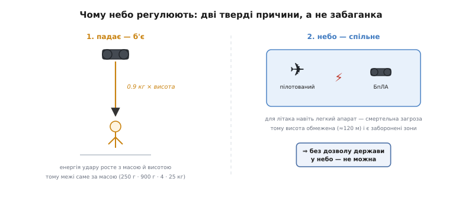

# Регуляції БпЛА

Ми зібрали плату, розвели її, замовили на заводі, продумали корпус і навіть [пройшли модульну сертифікацію радіо](topic:sys-notary/emc-certification) — щоб наш передавач не глушив сусідів і сам витримав чужі завади. Здавалося б, виріб готовий. Але якщо цей виріб — **політ**, попереду ще один бар'єр, і геть іншої природи. Радіосертифікація питала: «чи не заважає твій пристрій ефіру?». Тепер держава питає інше, страшніше: «а що станеться, коли ця штука впаде комусь на голову — або зіткнеться з літаком?».

Це і є **регуляції безпілотних апаратів** (БпЛА — безпілотний літальний апарат; в англомовних джерелах *UAS*, *unmanned aircraft system*). Вони не про електроніку всередині — вони про те, що ваш виріб тепер **літає в спільному небі серед людей**, і це змінює все. Розберімо, **чому** таке небо взагалі регулюють (від першопричини, не від букви закону), який кістяк правил повторюється у **кожній** країні, і — найважливіше для нас — **що з цього лягає особисто на вас як на творця апарата**, ще до того, як він злетить. Бо, як побачимо, добра половина цих вимог — це не папери оператора, а **рядки прошивки й мітки на корпусі**, які закладаєте саме ви.

## Чому небо взагалі регулюють

Почнімо не з законів, а з фізики — бо закон тут лише наздоганяє два тверді факти, яких не обійти.

**Факт перший: усе, що літає, падає, а падаючи — б'є.** Ваш квадрокоптер тримається в повітрі, лише поки крутяться мотори й живе керування. Розрядилась батарея, збоїв контролер, зламався пропелер — і апарат перетворюється на камінь, що набирає швидкість. Енергія цього каменя росте з масою й висотою, і навіть скромний апарат внизу траєкторії несе удар, здатний скалічити людину. Ось звідки, як ми скоро побачимо, у всіх правилах світу межі проводять **саме за масою**: 250 грамів, 900 грамів, 4 кілограми, 25 кілограмів — це не випадкові числа, а грубі щаблі тієї самої шкали «наскільки боляче, якщо впаде».

**Факт другий: це небо — не ваше.** У тому самому об'ємі повітря літають пілотовані машини — від санітарного гелікоптера до пасажирського лайнера. Для них зіткнення навіть із легким апаратом — не подряпина: пластиковий дрон, затягнутий у турбіну чи пробивши лобове скло на швидкості, може вбити сотні людей. Тому небо поділене на висоти й зони, і безпілотнику відведено вузьку смугу біля землі — типово **до 120 метрів**, — а над аеропортами й іншими критичними місцями його немає взагалі.


*Реґуляція БпЛА — не забаганка чиновника, а наслідок двох речей, яких не скасувати. Ліворуч: енергія удару росте з масою й висотою, тому межі проводять за масою. Праворуч: повітря спільне з пілотованою авіацією, тому висота обмежена, а над критичними місцями політ заборонено. З обох випливає одне: підіймати в небо апарат без пілота можна лише з дозволу держави.*

Цю думку — «безпілотник у небі потребує дозволу держави» — світ усвідомив напрочуд рано. Ще у **1944 році**, коли справжніх дронів не існувало, а «літак без пілота» був радше радіокерованою мішенню, автори [Чиказької конвенції](root:embedded/drone-regulations/hist-chicago-article-8.md) — угоди, що заклала весь міжнародний цивільний повітряний порядок, — вписали окрему статтю 8: жоден апарат, здатний летіти без пілота, не сміє летіти над територією держави без її особливого дозволу. Уся сьогоднішня гора правил про дрони — це, по суті, розгортання цього одного речення, якому вже за вісімдесят років.

> 🔧 **Навіщо це.** Тримайте ці дві причини в голові — і будь-яка норма перестане здаватися бюрократичним свавіллям. Питають масу апарата? Бо від неї енергія удару. Обмежують висоту 120 метрами? Бо вище — коридори пілотованих. Вимагають, щоб апарат «повідомляв, хто він»? Бо в спільному небі анонімний об'єкт — загроза, яку нема як адресувати. Коли ви бачите за правилом його фізичну причину, ви не «виконуєте вимогу наосліп», а розумієте, від чого вона захищає, — і легше приймаєте інженерні рішення, що її задовольняють.

## Кістяк, спільний для всіх країн

Країн багато, законів іще більше, і на перший погляд це хаос: тут реєструють від 250 грамів, там від 20 кілограмів, десь треба іспит, десь ні. Але під усім цим лежить **один кістяк** — бо всі відповідають на ті самі два факти, і відповідають схоже. Побачивши цей кістяк, ви впізнаєте будь-яку національну систему як варіацію на спільну тему.

Кістяк складається з чотирьох ідей, що випливають одна з одної.

**Перше — ризик міряють, а не рівняють усіх під один гребінець.** Було б безглуздо вимагати від іграшкового дрона за 250 грамів того самого, що від 20-кілограмового апарата з бензиновим двигуном. Тому скрізь діє **розбивка за ризиком**: що важчий апарат (сильніше вдарить) і що ближче до людей та критичних зон він літає (більше шансів, що вдарить когось), то суворіші вимоги. Легкий апарат далеко в полі — майже вільно; важкий над містом — майже як велика авіація. Між цими полюсами — щаблі.

**Друге — реєструють оператора, щоб було з кого спитати.** Анонімний апарат у небі — це загроза без адреси: впав, налякав, порушив — а винного не знайти. Тому держава веде облік не так самих апаратів, як **людей, відповідальних за політ**. Тут криється тонкість, яку часто плутають: реєструють здебільшого **оператора** (того, хто відповідає за апарат і його застосування), а не борт. Один оператор може мати цілий парк дронів під одним номером; і навпаки — **пілот** (той, хто безпосередньо кермує) може бути іншою людиною зі своєю підготовкою. Компанія-оператор наймає пілотів; підліток може бути пілотом батькового дрона, не будучи оператором. Ця пара «оператор / пілот» — не крючкотворство, а розподіл відповідальності.

**Третє — апарат мусить назватися: Remote ID.** Реєстрація дає номер, але який сенс із номера, якщо в небі не видно, чий саме апарат летить? Тому дозріла вимога **дистанційної ідентифікації** (*Remote ID*): апарат під час польоту **сам, по радіо, безперервно мовить** — ось мій реєстраційний номер, ось де я, ось де мій пілот. Це ніби електронний номерний знак, тільки він не висить збоку, а **транслюється в ефір**, щоб поліція чи інший пілот змогли зчитати його з землі звичайним смартфоном. Для нас це ключова точка: Remote ID — не папірець, а **функція, яку хтось мусить запрограмувати в апараті**. І цей хтось — ви.

**Четверте — де й коли летіти: правила самого польоту.** Нарешті — обмеження на політ як дію: не вище відведеної висоти, не над натовпом, у прямій видимості апарата очима, не в заборонених зонах (аеропорти, військові об'єкти, тюрми). Це вже здебільшого відповідальність оператора в момент польоту, а не ваша як виробника, — хоча, як побачимо, частину з цього теж можна й треба вшити в апарат.


*Той самий кістяк на прикладі європейської «відкритої» категорії, але логіка всюди однакова. Вертикально — маса (сильніше вдарить), горизонтально — близькість до людей (більше шанс когось зачепити). Легкий апарат далеко (лівий низ) — майже вільно; важчий і ближче до людей — потрібні мітка класу, іспит пілота, дистанція. Вийшов за цю сітку (ще важче чи ризикованіше) — переходиш у режим, де на кожен політ треба окремий дозвіл.*

Далі — три конкретні втілення цього кістяка: європейське (найдетальніше пророблене, тож беремо його за головний приклад), американське (для контрасту) і українське (наше, і з війною — особливе). Придивляйтеся не до чисел, а до того, як у кожному проступає той самий скелет.

## Європа: три категорії ризику й класи, що стосуються саме виробника

Європейський Союз звів усе безпілотне до **двох головних документів**, що набули чинності одночасно (у 2021 році) й працюють у парі. Перший — **регламент 2019/945** — про **сам продукт**: яким апарат має бути як виріб, що на ньому позначити, які захисні функції вбудувати. Другий — регламент 2019/947 — про **експлуатацію**: хто, де і як має право літати. Цей поділ — «продукт окремо, політ окремо» — і є та сама лінія «виробник / оператор», тільки на рівні законів. Один документ адресований вам, другий — тому, хто злетить.

Політ поділено на **три категорії за ризиком** — і це чиста ілюстрація кістяка:

- **Відкрита (Open)** — низький ризик, без попереднього дозволу. Сюди потрапляє більшість аматорських і легких комерційних апаратів. Усередині вона ще ділиться на три підкатегорії за близькістю до людей: **A1** (можна над окремими людьми, але не над натовпом), **A2** (близько до людей, з дистанцією порядку 30 метрів) і **A3** (далеко від людей — щонайменше 150 метрів від житлової чи промислової забудови).
- **Специфічна (Specific)** — підвищений ризик: політ за межі прямої видимості, над людьми, важчим апаратом. Тут уже потрібен **дозвіл** національного авіаційного органу, виданий на основі оцінки ризику конкретної операції.
- **Сертифікована (Certified)** — високий ризик, як у великій авіації: перевезення людей, польоти над натовпами, найважчі апарати. Апарат сертифікують і оператора ліцензують майже так само, як пасажирський літак.

А тепер — те, що стосується нас найбільше. Щоб апарат мав право літати у відкритій категорії, він мусить нести **клас-мітку** — маркування **C0, C1, C2, C3 або C4**. Це і є ті щаблі маси з нашого кістяка, тільки з європейськими іменами: C0 — до 250 грамів, C1 — до 900 грамів, C2 — до 4 кілограмів, C3 і C4 — до 25 кілограмів. Кожен клас дозволяє свій набір підкатегорій: C0 і C1 пускають у найм'якшу A1, C2 — у A2 (з іспитом пілота), важчі C3/C4 — лише в A3, найдалі від людей.

Ключове ось у чому: **клас-мітку наносить виробник**. Це не наліпка, яку оператор чіпляє перед польотом, — це частина того, як апарат виходить на ринок, поряд зі знайомим нам **знаком CE**. З **1 січня 2024 року** ця мітка стала **обов'язковою для нових апаратів**: без класу C-марки новий апарат у відкриту категорію (крім найлегших саморобних і старих «спадкових» дронів) просто не пускають. А щоб отримати право на певний клас, апарат мусить мати вбудовані функції: наприклад, для C1 і вище — той самий **Remote ID** і систему **геоусвідомлення** (знати про заборонені зони). Тобто європейський закон прямо каже виробникові: хочеш продавати апарат для польотів серед людей — **вшивай ідентифікацію й межі зон у сам виріб**.

Про реєстрацію: у ЄС реєструється **оператор** (з 31 грудня 2020 року це обов'язково майже для всіх, крім найлегших іграшок без камери), отримує унікальний **номер оператора** — і цей номер наносить на кожен свій апарат **та вписує в його Remote ID**. Пілот проходить свою підготовку окремо. Знову той самий поділ: борт мовить у ефір номер оператора, а конкретний пілот відповідає за політ.

> 🔧 **Навіщо це.** Європейська система — це готова карта того, що від вас, творця апарата, вимагатиме ринок. Клас-мітка й CE — рішення, які ви приймаєте **на стадії проєктування**: обрана маса й функції визначають клас, а клас — де апарат узагалі зможе літати легально. Захотіли компактний апарат «для всіх» — цілитеся в C0 (до 250 г, найм'якші правила) або C1 із вбудованим Remote ID. Проґавили це на старті — і готовий, електрично бездоганний виріб виявиться товаром, який у Європі не можна продати для реального польоту. Регуляція тут — не бар'єр наприкінці, а вимога до архітектури із самого початку.

## США: інша буква, той самий кістяк

Погляньмо на Америку — не щоб вивчити її правила напам'ять, а щоб побачити той самий скелет під іншою шкірою. У США безпілотним відає Федеральне авіаційне управління (**FAA**), і система на вигляд простіша, ніж європейська.

Головний поріг тут — **250 грамів**, і він ділить світ навпіл так само, як європейські класи, тільки грубіше. Апарат від 250 грамів і важчий **треба зареєструвати**; легший — за умови, що літаєте суто для розваги, реєструвати не треба. Знову та сама фізична логіка: 250 грамів — межа, нижче якої удар вважають достатньо легким, щоб послабити вимоги.

Другий поділ — **за метою польоту**, і це американська версія пари «оператор / пілот». Летите для роботи чи бізнесу — працюєте за правилами **Part 107**: складаєте іспит, отримуєте посвідчення дистанційного пілота. Летите суто для задоволення — користуєтеся винятком для аматорів: замість повного іспиту складаєте коротший тест на знання правил (**TRUST**) і возите з собою підтвердження.

І, звісно, **Remote ID** — той самий електронний номерний знак. FAA зробила його обов'язковим (крайній строк виконання — **16 вересня 2023 року**): апарат, який треба реєструвати, мусить мовити в ефір свою ідентифікацію. Найлегші аматорські апарати до 250 грамів від цього звільнені — рівно тому ж, чому й від реєстрації.

Бачите візерунок? Інші пороги, інші назви органів та іспитів — але кістяк той самий: **міряй ризик за масою, реєструй відповідального, змусь апарат назватися, обмеж політ**. Хто зрозумів логіку на європейському прикладі, американську систему читає з півпогляду. Це головна причина, чому ми вчимо кістяк, а не зубримо таблиці: таблиці різні й змінюються, кістяк — один.

## Україна: наші правила й реальність війни

Тепер — наше небо, і тут до звичайного кістяка додається обставина, якої немає в мирних країнах: **війна**. Розділимо ці два шари, бо їх легко сплутати.

**Мирний кістяк.** У звичайних умовах безпілотним в Україні відає **Державіаслужба** (Державна авіаційна служба України, ДАСУ), і базова логіка та сама, що всюди. Аматорські апарати відносно легкі (орієнтовно до 20 кілограмів) не потребують державної реєстрації в реєстрі повітряних суден і посвідчення пілота — це м'яка зона для хобі. Комерційний апарат — інша річ: незалежно від маси його вносять до державного реєстру, а оператор отримує відповідні сертифікати. Правила самого польоту — знайомі до дрібниць: **у прямій видимості**, **не вище 120 метрів**, на швидкості **до 160 кілометрів на годину**, поза заборонами й обмеженнями, подалі від натовпу й щільної забудови. Це той самий четвертий елемент кістяка — «де й коли летіти».

**Шар війни.** З початком повномасштабного вторгнення над Україною діє особливий режим: цивільний повітряний простір фактично закрито, і будь-який неузгоджений політ безпілотника поза межами дозволеного — не просто адміністративне порушення, а ризик бути прийнятим за ворожу ціль з усіма наслідками. Водночас для **військового** застосування держава пішла у зворотний бік — **спрощення**: у 2025 році Міністерство оборони скасувало частину «мирних» бюрократичних вимог до бойових апаратів, щоб не гальмувати їх виробництво й застосування на фронті; більшість легких тактичних дронів звільнили від внесення до реєстру повітряних суден. Паралельно в парламенті рухається законопроєкт (номер 13600) про **деанонімізацію** цивільних польотів — обов'язкову реєстрацію та ідентифікацію операторів у мирному небі. Тобто вектор подвійний: суворіше й прозоріше — для цивільних у тилу, простіше й швидше — для оборони.

Для вас як розробника з України це означає тверезий висновок: **правова рамка тут рухається швидко й залежить від того, куди летить ваш апарат** — цивільний ринок, експорт чи оборона. Числа й статті змінюються від сесії до сесії; незмінний — кістяк, тому орієнтуйтеся на нього, а конкретну норму завжди звіряйте з чинним актом Державіаслужби чи профільним рішенням на момент, коли справді випускаєте виріб.

## Що з усього цього — ваша робота як інженера

Ми обійшли три системи. Настав час звести докупи те, заради чого все й затівалося: **що з регуляцій лягає особисто на вас** — не на юриста, не на оператора, а на того, хто пише прошивку й проєктує плату. І виявляється, що частка ваша чимала.

Розділимо обов'язки навпіл — і одразу видно, де ваша половина.


*Обов'язки розпадаються на дві колонки. Ліва — ваша: усе це закладається в залізо й прошивку ще до того, як апарат покинув майстерню. Права — оператора, що злетить у небо. Ваша половина не «менш важлива»: без вбудованого Remote ID апарат просто не отримає класу C і не матиме права на політ серед людей. Зверніть увагу на стик: ваш код транслює в ефір той номер, під яким оператор зареєструвався, — виробник і оператор зустрічаються саме в цьому радіоповідомленні.*

Найвідчутніша з ваших вимог — **Remote ID у прошивці**. Це не абстракція: апарат мусить періодично, поки летить, збирати кілька полів (свій ідентифікатор, поточні координати з GPS, висоту, координати пілота) і транслювати їх у ефір відкритим форматом — типово короткими пакетами по Wi-Fi чи Bluetooth, щоб приймач на землі зчитав їх без пари. По суті це маленька, але сувора під-задача прошивки: узяти дані з навігації, спакувати їх у стандартний кадр і регулярно кидати в радіо. Ось як виглядає серце такого мовлення — заповнення пакета ідентифікації перед відправкою:

**Умова:** апарат щосекунди мусить оголосити свій ідентифікатор і поточне місце. Формуємо пакет Remote ID (спрощена ілюстрація — реальні поля й кодування суворіше):

```c
#include <stdint.h>
#include <string.h>

// Спрощений кадр дистанційної ідентифікації, що йде в ефір.
typedef struct {
    uint8_t  msg_type;      // тип повідомлення (тут: базова ідентифікація)
    char     uas_id[20];    // реєстраційний рядок оператора (наноситься й мовиться)
    int32_t  lat_1e7;       // широта апарата, градуси × 1e7 (цілочисельно)
    int32_t  lon_1e7;       // довгота апарата
    int16_t  alt_m;         // висота над рівнем моря, метри
    int32_t  pilot_lat_1e7; // широта пілота (звідки керують)
    int32_t  pilot_lon_1e7; // довгота пілота
} rid_frame_t;

// Складання кадру з поточних даних навігації.
// pos — свіжі координати апарата, home — місце пілота (точка зльоту).
void rid_fill(rid_frame_t *f, const char *operator_id,
              const gps_fix_t *pos, const gps_fix_t *home) {
    f->msg_type = 0x00;                       // 0x00 — базова ідентифікація
    memset(f->uas_id, 0, sizeof(f->uas_id));  // очистити «хвіст» рядка
    strncpy(f->uas_id, operator_id, sizeof(f->uas_id) - 1);  // -1: лишити місце під '\0'

    f->lat_1e7 = (int32_t)(pos->lat_deg  * 1e7);   // градуси → цілі, щоб не тягти float в ефір
    f->lon_1e7 = (int32_t)(pos->lon_deg  * 1e7);
    f->alt_m   = (int16_t)(pos->alt_m + 0.5f);     // округлення до метра

    f->pilot_lat_1e7 = (int32_t)(home->lat_deg * 1e7);
    f->pilot_lon_1e7 = (int32_t)(home->lon_deg * 1e7);
}
```

Дрібниця, на якій легко спіткнутися: координати передають **цілими числами** (градуси, помножені на 10⁷), а не дробовими. Причина суто інженерна — цілі однакові на будь-якому приймачі, займають менше й не тягнуть у радіокадр примхи представлення дробів; множник 10⁷ дає роздільність краще за сантиметр, чого з головою досить. А `strncpy` із `sizeof(...) - 1` — щоб задовгий ідентифікатор не переповнив буфер і рядок гарантовано завершився нулем. Це той самий рівень акуратності, що й у будь-якій прошивці, тільки тепер від нього залежить, чи легальний ваш апарат у небі. Повна робоча реалізація такого мовника — від читання GPS до періодичної відправки кадру по радіо з коректною частотою — розібрана окремо як [проєкт «мовник Remote ID»](root:embedded/drone-regulations/proj-remote-id-broadcaster.md).

Друга ваша вимога тісно пов'язана з першою — **знати межі й не пускати за них**. Європейський клас C1 і вище прямо вимагає **геоусвідомлення**: апарат мусить мати уявлення про заборонені зони й попереджати (або не давати) в них залетіти. У прошивці це вже знайома нам річ — **[геозона](topic:sys-dron/geofence)**: апарат порівнює свої координати з межами дозволеного простору й, наблизившись до краю, вмикає захисну реакцію. А що робити при виході за межу чи втраті зв'язку — це наш давній знайомий **[failsafe](topic:sys-dron/failsafe)**: повернутися додому, зависнути, сісти. Регуляція, по суті, робить ці дві функції — геозону й failsafe — **не «хорошим тоном», а умовою легальності апарата**.

І третя, найпростіша механічно, але не за важливістю: **паспорт продукту**. Клас-мітка й знак CE на корпусі, інструкція з чесно вказаною масою, класом, обмеженнями висоти. Це те, що ми вже бачили в модульній сертифікації, тільки тепер маркування посвідчує не радіо, а весь апарат як повітряне судно свого класу.

> 🔧 **Навіщо це.** Головний висновок усієї теми — короткий: **регуляцію БпЛА не можна доробити наприкінці, як наліпку**. Remote ID треба закласти в архітектуру прошивки поряд із керуванням мотором; клас апарата — визначити на старті проєкту, бо він диктує масу й функції; геозону з failsafe — вшити як частину системи безпеки. Інженер, який дізнається про ці вимоги вже з готовим виробом у руках, приречений на болісну переробку — або на виріб, який ніде не можна легально підняти в повітря. Той, хто тримає кістяк у голові з першого дня, проєктує апарат, що народжується легальним.

## Куди далі

Ми пройшли повне коло теми: **чому** небо регулюють (падає-б'є плюс спільний простір, і стаття 8 ще з 1944-го), який **кістяк** повторюється всюди (міряй ризик за масою → реєструй оператора → змусь апарат назватися через Remote ID → обмеж політ), як він проступає в **європейській, американській та українській** системах — і, головне, **що з цього ваша інженерна робота**: Remote ID у прошивці, геозона й failsafe як умова легальності, клас-мітка й CE на продукті.

Придивившись, ви помітите спільний корінь між цією темою й тим, чим ми займалися весь модуль про надійність. Remote ID, геозона, failsafe, обмеження висоти — усе це про одне: **апарат мусить лишатися безпечним, навіть коли щось пішло не так**. Регуляція — це, зрештою, суспільна вимога тієї самої функційної безпеки, тільки записана мовою закону. А як ту саму ідею — «система не має завдати шкоди, навіть відмовляючи» — формалізує вже інженерна дисципліна, з її стандартами й рівнями допустимого ризику, ми розберемо в наступному кроці, коли візьмемося за **огляд стандартів функційної безпеки**. Регуляція БпЛА була конкретним випадком; далі — загальний принцип, що стоїть за ним.
