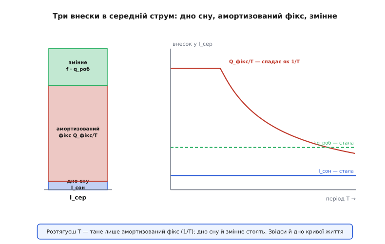
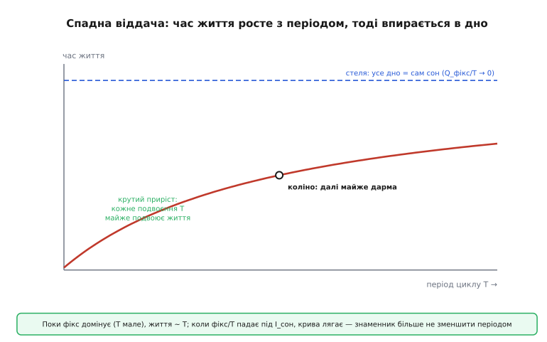
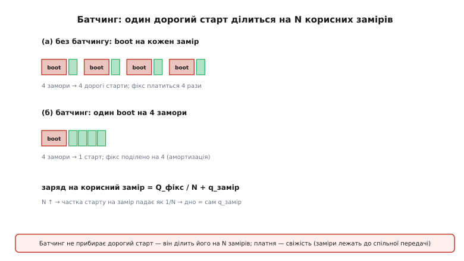

# Цикл і середній струм — детально

У базовому кроці ми навчилися головного руху: рваний профіль струму зводиться до одного числа — середнього струму, — а з нього діленням ємності дістається час життя. Ми побачили два важелі (зрізати заряд активної фази або розтягнути період), пастку boot-вартості й сліпу пляму до піків. Цього досить, щоб порахувати метеостанцію на серветці.

Але щойно проєкт стає серйозним, «на серветці» перестає рятувати. Замовник питає не «скільки приблизно», а «скільки саме, і що буде, якщо прокидатися вдвічі рідше, — час подвоїться чи майже не зміниться?». Інженер, який щойно поміняв boot-фазу, хоче знати наперед: цей важіль ще тягне чи вже вичерпався? А коли постає вибір між [light-sleep і deep-sleep](book:programming/sleep-modes), рука тягнеться до deep — бо мікроампери, — і це рішення виявляється помилковим рівно там, де прокидань багато. На всі ці питання «на око» відповісти не можна; на них відповідає **структура** середнього струму, яку ми зараз розберемо до кінця.

Тож тут ми не повторюємо базове, а розгортаємо його вглиб: розкладаємо середній струм на складові, з яких видно поведінку кожного важеля окремо; виводимо, де важіль періоду впирається в стелю; знаходимо точний поріг між light- і deep-sleep; і доводимо до чисел ту саму сліпу пляму до піків — через опір батареї та згладжувальний конденсатор. Усе це — той самий один дріб `Q/T`, лише розібраний на частини, кожна з яких має свою фізику й свій важіль.

## Три доданки замість одного дробу

Почнемо з того, що середній струм — не монолітне число, а сума трьох різних за природою внесків. Розклад починається з базової формули, яку ми вже вивели:

```
I_сер = Q_цикл / T
```

де `Q_цикл` — увесь заряд за один цикл, `T` — тривалість циклу. Тепер розіб'ємо `Q_цикл` за тим, **звідки** береться кожен кулон. У циклі є фази, що йдуть **щоразу однаково** — передусім boot і підключення до мережі: вони не залежать ні від того, як довго пристрій спав, ні від того, скільки корисної роботи він зробить. Це **фіксована вартість пробудження** `Q_фікс`. Є фази, що залежать від **обсягу корисної роботи** цього циклу, — вимір, обчислення, передача даних: назвемо їхній заряд `q_роб` (заряд однієї «порції» роботи). І є сон, що тягне сталий струм `I_сон` протягом майже всього періоду.

Складемо заряд циклу з цих частин. За один цикл пристрій прокидається один раз, тож платить `Q_фікс` рівно раз і виконує одну порцію роботи `q_роб`. Сон займає майже весь період — тривалість активної частини `t_акт` дуже мала проти `T`, тож заряд сну ≈ `I_сон · T`:

```
Q_цикл = Q_фікс + q_роб + I_сон · (T − t_акт)
       ≈ Q_фікс + q_роб + I_сон · T          (бо t_акт ≪ T)
```

Поділимо на `T` — і дріб розпадається на три доданки, кожен зі своєю поведінкою:

```
                Q_фікс     q_роб
I_сер  =  I_сон + ────── + ─────
                   T          T
          └─┬─┘   └──┬──┘   └─┬─┘
          дно     амортизо-  внесок
          сну     ваний фікс  роботи
```

Це та сама формула `Q/T`, але тепер видно її нутро. Введемо **частоту пробуджень** `f = 1/T` (скільки разів на секунду пристрій прокидається) — і два останні доданки стають `f · Q_фікс` та `f · q_роб`. У цьому вигляді розклад читається як речення:

```
I_сер  =  I_сон  +  f · Q_фікс  +  f · q_роб
```

Середній струм — це **дно сну плюс частота пробуджень, помножена на вартість одного пробудження** (фіксовану плюс корисну). Три доданки поводяться зовсім по-різному, коли ми крутимо важелі, і саме тому їх варто тримати нарізно.



*Зліва — з чого складається середній струм: тонке дно сну, товстий амортизований фікс (boot), помірне змінне. Справа — доля кожного внеску від періоду: дно сну стоїть незмінно, змінне теж стале на пробудження, а лише амортизований фікс тане як 1/T. Розтягуючи період, ми тиснемо тільки цю одну складову.*

> 🔧 **Навіщо це.** Розклад — це діагностична панель проєкту. Порахувавши три числа для свого циклу, одразу бачиш, який доданок домінує, а отже, який важіль узагалі має сенс тягнути. Якщо в балансі править `f · Q_фікс` — рятує рідший сон або батчинг; якщо `I_сон` — рідший сон уже дарма, і копати треба в сам сон або в саморозряд батареї; якщо `f · q_роб` — скорочуй саму роботу (коротша передача, менше даних). Тягнути не той важіль — це витратити тижні на оптимізацію доданка, який і так дав би одиниці відсотків.

## Чому важіль періоду впирається в стелю

Тепер, маючи розклад, повернімося до другого важеля з базового кроку — «розтягнути період» — і поставмо питання, на яке там ми відповісти не могли: чи завжди подвоєння періоду дає приблизно подвоєння часу життя? Відповідь — ні, і розклад показує, чому саме.

Дивимось на три доданки очима періоду `T`. Дно сну `I_сон` від періоду **не залежить** — це фізична властивість режиму сну, стала. Внесок роботи `f · q_роб = q_роб / T` від періоду залежить, але в реальному давачі він зазвичай малий проти фіксу (вимір коротший за boot). А головний, найтовстіший доданок — амортизований фікс `Q_фікс / T` — спадає **обернено пропорційно** періоду. Ось де собака заритий.

Поки період малий і `Q_фікс / T` домінує над `I_сон`, майже весь середній струм — це амортизований фікс, і він падає як `1/T`. Час життя `= k / I_сер` (де `k` — ємність у відповідних одиницях) тоді росте майже пропорційно `T`: подвоїв період — майже подвоїв життя. Це «крута» ділянка.

Але `Q_фікс / T` спадає й спадає, а `I_сон` стоїть на місці. У якийсь момент вони зрівнюються, а далі дно сну починає **переважати**. Тепер середній струм — це майже самий `I_сон`, який періодом не зменшити взагалі. Крива життя виходить на **горизонтальну асимптоту** — стелю `k / I_сон`, — і подальше розтягування періоду дає копійки.

Знайдемо цю точку зламу — **коліно** кривої — строго. Вона там, де амортизований фікс зрівнявся з дном сну:

```
Q_фікс / T*  =  I_сон
       ⇓
T*  =  Q_фікс / I_сон
```

Проста й дуже корисна формула. Ліворуч від `T*` (частіші пробудження) править фікс — важіль періоду тягне сильно. Праворуч від `T*` (рідші пробудження) править сон — важіль майже вичерпано. Підставмо числа метеостанції з базового кроку: `Q_фікс` там — це boot із Wi-Fi-конектом, `144 мА·с` у базовому сценарії, а `I_сон = 0.008 мА`.

**Коліно метеостанції.** Де важіль періоду перестає тягнути:

```
Q_фікс = 144 мА·с        (boot + Wi-Fi конект)
I_сон  = 0.008 мА

T* = Q_фікс / I_сон = 144 / 0.008 = 18000 с ≈ 5 годин

Висновок: доки період менший за ~5 год, розтягувати його вигідно
(фікс іще домінує). Метеостанція з базового кроку прокидається раз
на 10–30 хв — це ГЛИБОКО в крутій зоні, ліворуч від коліна.
Тому потроєння інтервалу там і дало майже потрійний виграш.
```

Ось чому в базовому кроці потроєння інтервалу (сценарій Б) дало виграш ≈ 2.9 раза, майже пропорційний. Пристрій сидів далеко зліва від коліна, де важіль періоду майже лінійний. А якби метеостанція вже прокидалася раз на 5 годин, потроєння до 15 годин дало б жалюгідні відсотки — бо праворуч від коліна знаменник більше не зменшити періодом, він упирається в дно сну.



*Час життя росте з періодом, поки амортизований фікс домінує (ліва крута ділянка — кожне подвоєння T майже подвоює життя). У коліні, де Q_фікс/T падає до рівня I_сон, крива різко лягає й далі майже не росте: знаменник уперся в дно сну, і період більше нічого не дає. Стеля дорівнює k/I_сон.*

Із цього випливає інженерне правило, якого «на око» не побачити: **порахуй `T* = Q_фікс / I_сон` до того, як тягнути період.** Якщо твій робочий інтервал уже за коліном, розтягувати сон марно — виграш з'їдений; тоді єдиний спосіб просунутися далі — атакувати або сам `I_сон` (глибший режим сну, вимкнути зайві споживачі — [куди тече струм у схемі](book:programming/current-paths)), або `Q_фікс` (дешевше пробудження), а не період. І навпаки: якщо до коліна ще далеко, а свіжість даних дозволяє, найдешевший виграш — саме рідший сон.

## Точний поріг між light- і deep-sleep

Найпідступніше рішення в усій темі — вибір режиму сну. Інтуїція кричить: бери [deep-sleep](book:programming/sleep-modes), там же мікроампери проти майже міліампера в light-sleep. І для рідкісних пробуджень ця інтуїція має рацію. Але вона зраджує рівно там, де пробудження часті, — і розклад показує чому, а тоді дає точний поріг.

Річ у тім, що два режими мають **різну ціну виходу**. Deep-sleep вимикає майже все: після нього чіп [завантажується з нуля](book:programming/wakeup-sources) — повний boot, а якщо треба мережа — ще й підключення. Це і є той дорогий `Q_фікс`. Light-sleep натомість тримає живлення ядра й пам'яті: чіп прокидається **на тому самому місці коду**, без boot, — його фіксована вартість `Q_фікс` близька до нуля. Розплата за це — вищий струм самого сну: light-sleep тягне сотні мікроампер (на ESP32 — близько 0.8 мА), тоді як deep-sleep — одиниці мікроампер (близько 10 мкА). Це підтверджують і дані Espressif: рекомендація «менше ~10 с між пробудженнями — light-sleep, більше — deep-sleep» — це якраз наближення до порога, який ми зараз виведемо точно.

Порівняємо середній струм у двох режимах через наш розклад. Внесок корисної роботи `f · q_роб` в обох однаковий (вимір і передача ті самі), тож він скорочується й на вибір не впливає — викидаємо його з порівняння. Лишаються дно сну плюс амортизований фікс:

```
Deep-sleep:   I_deep  = I_сон,deep  + f · Q_фікс,deep    (мале дно, дорогий boot)
Light-sleep:  I_light = I_сон,light + f · Q_фікс,light   (велике дно, boot ≈ 0)
```

Deep вигідніший, поки `I_deep < I_light`. Поріг — рівність. Оскільки в light-sleep `Q_фікс,light ≈ 0`, а `f = 1/T`:

```
I_сон,deep + Q_фікс,deep / T  =  I_сон,light

Q_фікс,deep / T  =  I_сон,light − I_сон,deep
        ⇓
T_поріг  =  Q_фікс,deep / (I_сон,light − I_сон,deep)
```

Читається просто: **deep-sleep вигідний лише тоді, коли період більший за `T_поріг`.** Знаменник — це наскільки дорожче обходиться дно сну в light-режимі; чисельник — ціна одного дорогого boot у deep. Якщо пробудження рідші за поріг, дорогий boot амортизується на довгий сон і тоне в ньому — виграє deep з його мікроамперним дном. Якщо частіші — boot платиться надто часто, його амортизований внесок перевищує економію на дні, і виграє light, який boot взагалі не платить.

**Поріг для типового ESP32-давача.** Коли переходити з light на deep:

```
Дано (з даташита й виміру профілю):
  I_сон,light  ≈ 800 мкА    (light-sleep з вимкненим модемом)
  I_сон,deep   ≈ 10 мкА     (deep-sleep)
  Q_фікс,deep  ≈ 144 мА·с = 144000 мкА·с   (boot + Wi-Fi конект)

T_поріг = Q_фікс,deep / (I_сон,light − I_сон,deep)
        = 144000 мкА·с / (800 − 10) мкА
        = 144000 / 790
        ≈ 182 с ≈ 3 хвилини

Висновок: прокидаєшся рідше ніж раз на ~3 хв → deep-sleep вигідніший.
Частіше ніж раз на ~3 хв → light-sleep, попри «страшні» 800 мкА:
дорогий boot з'їв би всю економію на дні сну.
```

Зверни увагу, як сильно поріг залежить від `Q_фікс,deep`. Головний його доданок — це Wi-Fi-підключення. Якщо його здешевити — [кешувати сесію](book:programming/sleep-modes), щоб конект тривав 0.3 с замість 1.2 с (той самий трюк, що в сценарії В базового кроку), — `Q_фікс,deep` падає з 144 до ≈ 40 тис. мкА·с, і поріг зсувається:

```
T_поріг = 40000 / 790 ≈ 51 с

Дешевший boot ⇒ deep-sleep вигідний уже від ~50 с, а не від 3 хв.
Що дешевший старт, то ширша зона, де deep перемагає.
```

Це відповідь на питання, з якого починався розділ. «Бери deep, там мікроампери» — правда лише праворуч від `T_поріг`. Ліворуч — там, де пристрій має реагувати часто (щосекунди слухати кнопку, тримати з'єднання), — deep з його вічним boot програє light-sleep, який просто продовжує з місця. І поріг цей не абстрактний: підстав свої три числа — і дізнаєшся точку переходу для свого пристрою, а не покладайся на «менше 10 секунд».

Ось коротка перевірка, яку варто вшити в прошивку пристрою, що сам обирає режим за поточним інтервалом (наприклад, логер, що міняє темп за порою року):

```c
#include <stdint.h>
#include <stdbool.h>

// Чи вигідніший deep-sleep за light-sleep для заданого періоду циклу.
// Усе в цілих: заряд у мкА·с, струми в мкА, період у секундах.
// q_fixed_deep_uA_s — фіксований заряд одного deep-пробудження (boot + конект).
static bool prefer_deep_sleep(uint32_t period_s,
                              uint32_t q_fixed_deep_uA_s,
                              uint32_t i_sleep_light_uA,
                              uint32_t i_sleep_deep_uA) {
    if (i_sleep_light_uA <= i_sleep_deep_uA) return false;  // light не гірший за дном — deep не рятує
    uint32_t d_floor = i_sleep_light_uA - i_sleep_deep_uA;   // наскільки дорожче дно light

    // Порівнюємо БЕЗ ділення, щоб не гнати float і не втрачати точність:
    //   deep вигідний  ⇔  period_s > q_fixed / d_floor
    //   ⇔  period_s * d_floor > q_fixed          (обидва боки × d_floor)
    // period_s * d_floor може перевищити 32 біти → рахуємо у 64.
    uint64_t lhs = (uint64_t)period_s * d_floor;
    return lhs > (uint64_t)q_fixed_deep_uA_s;
}
```

Замість того щоб рахувати сам поріг діленням (і тягнути дроби), ми множимо навхрест: `period > Q_фікс / d_floor` рівносильне `period · d_floor > Q_фікс`. Обидва боки цілі, ділення нема зовсім, а добуток `period_s · d_floor` легко переростає 32 біти (при періоді години й `d_floor` у сотні мкА), тож рахуємо його у 64-бітному цілому — та сама [пастка переповнення](book:programming/overflow-wraparound), що й у таблиці бюджету. Функція чиста, її можна ганяти юніт-тестами без жодного заліза.

## Батчинг: ділення дорогого старту на N

Другий спосіб приборкати фіксовану вартість — не рідше прокидатися, а **за одне пробудження робити більше корисного**. Це батчинг (англ. *batch* — «партія, гурт»), і базовий крок згадав його побіжно. Тепер розберемо його механіку через розклад, бо саме він показує межу батчингу.

Ідея прямо з формули. Внесок фіксу на **один цикл** — це `Q_фікс`. Але якщо за одне пробудження зняти не один вимір, а `N`, то дорогий boot ділиться між ними. Заряд у розрахунку на **один корисний вимір** стає:

```
q_на_замір  =  Q_фікс / N  +  q_роб
               └───┬────┘   └──┬──┘
               амортизований   сам
               старт           замір
```

Це знову `1/N`-крива, точнісінько як `Q_фікс/T` була `1/T`-кривою для періоду. При `N = 1` кожен замір несе повну вартість старту. При `N = 4` старт розподіляється на четверо — його частка падає вчетверо. При великому `N` частка старту прямує до нуля, і заряд на замір впирається в **дно `q_роб`** — сам корисний замір, дешевший за який батчинг зробити не може.



*Угорі — без батчингу: кожен замір тягне власний дорогий старт, фікс платиться N разів. Унизу — батчинг: один старт обслуговує N замірів, фікс поділено на N. Заряд на корисний замір = Q_фікс/N + q_замір; зі зростанням N частка старту тане як 1/N, а дном лишається сам q_замір. Платня — свіжість: заміри лежать до спільної передачі.*

Помітно, наскільки батчинг споріднений із важелем періоду: обидва амортизують той самий `Q_фікс`, обидва дають `1/N` чи `1/T` спад, обидва мають дно, у яке впираються. Різниця — у платні. Розтягуючи період, ти платиш свіжістю **самого показника**: оновлення тепер рідше. Батчачи, ти платиш свіжістю **доставки**: заміри знімаються так само часто, але лежать у пам'яті до спільної передачі, тож на сервер приходять пачкою із затримкою. Який компроміс прийнятний — диктує задача. Термометр у теплиці стерпить і рідший замір, і відкладену доставку; сигналізація не стерпить ні того, ні того.

Є й тонкість, що робить батчинг вигіднішим, ніж здається з формули вище. У ній `q_роб` — заряд одного повного циклу роботи, включно з часткою передачі. Але передача теж має свою фіксовану частину: підняти радіо, встановити з'єднання, віддати заголовки пакета. Передати `N` вимірів одним пакетом майже завжди дешевше, ніж `N` окремих передач, бо накладні витрати радіо теж діляться. Тобто батчинг тисне **обидва** фіксовані внески — і boot, і накладні радіо, — тому на практиці виграш від нього часто більший за просте `Q_фікс/N`.

## Сліпа пляма до піків — до чисел

Базовий крок попередив: середній струм відповідає на «скільки протримається батарея», але не на «чи переживе живлення піковий струм». Тепер доведемо цю сліпу пляму до чисел і покажемо, звідки береться згладжувальний конденсатор і як рахують його ємність.

Механізм такий. Батарея — не ідеальне джерело: у неї є **внутрішній опір** `R_вн`. Коли пристрій смикає струм `I`, на цьому опорі падає напруга `ΔV = I · R_вн`, і напруга на клемах просідає рівно на стільки. У сні струм мікроамперний — просідання нікчемне. Але в мить передачі струм стрибає до сотень міліампер, і просідання стає відчутним.

**Просідання від піка передачі.** Скільки батарея втрачає на власному опорі:

```
Дано:
  I_пік  = 0.2 А        (Wi-Fi TX, 200 мА)
  R_вн   ≈ 0.3 Ом       (свіжа пара AA; до кінця служби росте до ~0.7 Ом)

ΔV = I_пік · R_вн = 0.2 · 0.3 = 0.06 В = 60 мВ   (свіжі батареї)

Наприкінці служби, коли R_вн виросте до ~0.7 Ом:
ΔV = 0.2 · 0.7 = 0.14 В = 140 мВ
```

Шістдесят мілівольт на свіжих батареях — дрібниця. Але дві AA, коли підсядуть, дають десь 2.2 В сумарно, а поріг [захисту від просідання](book:programming/brownout) ESP32 стоїть близько 2.4–2.8 В. Додай до підсілої напруги ще й `ΔV`, що виріс до 140 мВ на постарілому опорі, — і клеми в мить передачі провалюються під поріг. Спрацьовує brown-out, чіп перезавантажується **рівно в мить передачі**, хоч середній струм лишався бездоганним. Ось чому сліпа пляма губить пристрій під кінець служби батареї, а не на старті: `R_вн` росте з розрядом, і те саме просідання, що було безпечним на свіжих, стає фатальним на підсілих.

Рятунок — **згладжувальний (розв'язувальний) конденсатор** поряд із чіпом. Він працює як маленький локальний резервуар заряду: у мить піка струм бере переважно з конденсатора, а не тягне все з батареї через її опір. Скільки треба ємності? Із означення напруги на конденсаторі. Конденсатор віддає заряд `ΔQ = I_пік · Δt` за час піка `Δt`, і від цього його напруга падає на `ΔV = ΔQ / C`. Звідси:

```
ΔV = I_пік · Δt / C     ⇒     C = I_пік · Δt / ΔV_доп
```

**Розмір згладжувального конденсатора.** Скільки ємності треба, щоб пік не просадив напругу більш ніж на 100 мВ:

```
Дано:
  I_пік    = 0.2 А
  Δt       = 0.3 с        (тривалість TX-піка з базового кроку)
  ΔV_доп   = 0.1 В        (скільки просідання дозволяємо)

C = I_пік · Δt / ΔV_доп = 0.2 · 0.3 / 0.1 = 0.6 Ф !!!

0.6 фарада — це суперконденсатор, не керамічний конденсатор.
```

Число вражає й одразу навчає важливого. Керамічний конденсатор на десятки-сотні мікрофарад, який ставлять біля чіпа, **не** призначений тримати напругу протягом 0.3-секундного Wi-Fi-піка — для цього треба в тисячі разів більше. Керамічний конденсатор бореться з **короткими й швидкими** сплесками (наносекунди-мікросекунди перемикань логіки), де `Δt` крихітне. Тримати ж напругу протягом довгого радіопіка можна лише двома способами: або джерело з малим `R_вн` (свіжі батареї, добрий стабілізатор), або справді велика ємність — суперконденсатор чи великий електролітичний, — якщо джерело слабке. Плутати ці дві ролі конденсатора — часта помилка: «поставив сотку мікрофарад, а brown-out усе одно», бо сотка мікрофарад на радіопік — це наперсток проти відра.

Є й глибша причина, чому середній струм тут безсилий **у принципі**, а не через недбалість розрахунку. Середнє — це заряд, **розмазаний по часу**. Але просідання напруги — миттєве, воно живе на масштабі `Δt` самого піка. Усереднення навмисне стирає час, а саме час тут вирішує. Два профілі можуть мати **однаковий** середній струм, але зовсім різну долю: один віддає заряд плавно, інший — рідкісними лютими піками, що садять напругу під поріг. Тому пік і середнє — це принципово **два незалежні числа про два різні масштаби часу**: середнє — про години розряду (чи вистачить кулонів), пік — про частки секунди (чи витримає напруга). Жодне з них не виводиться з іншого, і рахувати треба обидва.

## Граничні випадки й крайні режими

Розклад на три доданки корисний ще й тим, що дає готову мову для граничних випадків — тих, де загальна інтуїція «спати глибше й рідше» ламається. Пройдімо їх, бо саме на них спотикаються.

**Робочий цикл прямує до одиниці.** Досі ми припускали `t_акт ≪ T` — активна фаза мала проти періоду. А якщо ні? Якщо пристрій майже не спить (безперервний збір, потокова передача), то `t_акт ≈ T`, наближення `Q_цикл ≈ Q_фікс + q_роб + I_сон·T` розвалюється, бо сну майже нема. Тоді середній струм — це просто зважене середнє **активних** струмів, а весь апарат амортизації фіксу втрачає сенс: boot платиться раз і тоне не в сні, а в довгій активності. Це вже не задача енергоощадності на батареї, а задача теплова й про [живлення](book:programming/current-paths): такий пристрій живлять від мережі, а не від AA. Межа тут різка: доки `t_акт/T` мале, править амортизація фіксу; коли воно близьке до одиниці, править сама активна робота, і думати треба зовсім інакше.

**Сон нижче дна саморозряду.** Ми виводили, що стеля життя — `k / I_сон`: зменшуй `I_сон` — рости стелю. Але це правда лише доки `I_сон` більший за власний **саморозряд** батареї. Батарея втрачає заряд навіть у нікуди не під'єднаному стані — внутрішня хімія тече сама. Коли струм сну падає до одиниць мікроампер, він може стати меншим за еквівалентний струм саморозряду, і тоді подальше зниження `I_сон` **нічого не дає** — стелю тримає вже не пристрій, а сама комірка. Ганятися за кожним мікроампером сну під цим дном — марно; це та межа, за якою оптимізують не прошивку, а вибір хімії батареї (LiSOCl₂ з ~1% на рік проти лужних). Точна арифметика цього дна — саморозряд, температура, недосяжний «хвіст» ємності — лежить у [математиці бюджету батареї](book:programming/battery-budget/math-battery-math.md), і це саме та поправка, що перетворює оптимістичні «10 років» ділення на чесні місяці.

**Домінує робота, а не старт.** Ми весь час брали приклад, де править `Q_фікс` (дорогий Wi-Fi-boot). Але буває навпаки: старт дешевий, а робота важка — скажімо, пристрій прокидається легко, зате знімає й обробляє довгий сигнал, ганяючи ядро на повній швидкості секундами. Тоді в розкладі домінує `f · q_роб`, і жоден з наших головних важелів не головний: ні рідший сон (він тисне переважно фікс і дно), ні батчинг фіксу не врятують, бо не фікс тут винен. Рятує атака на саму роботу: нижча тактова частота під час обчислень, [ULP-співпроцесор](book:programming/ulp-coprocessor) замість великого ядра для дрібних вимірів, ефективніший алгоритм, менше даних у передачу. Ось навіщо розклад: він **першим ділом каже, куди дивитися**, і рятує від оптимізації не того доданка.

**Проміжки на «третьому» струмі.** Наша модель ділила час на дві категорії — активне й сон. Реальність буває тонша: між фазами трапляється очікування на **проміжному** струмі, ні сон, ні повна активність. Класика — чекання відповіді сервера: радіо ввімкнене (десятки міліампер), але пристрій нічого не робить, просто висить. Такий проміжок не можна занести ні в `q_роб`, ні в `I_сон` — він окремий доданок, і якщо його «забути», оцінка вийде надто оптимістичною. Правильно — внести його окремим рядком у [таблицю фаз](root:embedded/duty-cycle-current/proj-energy-budget-table.md), де кожен рядок «струм × час» додається до заряду адитивно; там же розібрано, чому таблиця гнучка саме до таких доповнень і які цілочисельні пастки чигають при її обчисленні в прошивці.

## Що з усього цього тримати в голові

Ми почали з одного дробу `Q/T` і розібрали його до трьох доданків — дно сну, амортизований фікс, змінна робота, — кожен зі своєю фізикою й своїм важелем. З цього розкладу випало все інше. Важіль періоду тисне лише амортизований фікс і тому впирається в **коліно** `T* = Q_фікс / I_сон`, за яким майже дарма. Вибір між light- і deep-sleep має точний **поріг** `T_поріг = Q_фікс,deep / (I_сон,light − I_сон,deep)`, а не гасло «бери мікроампери». Батчинг ділить фікс на `N`, як період ділив його на `T`, і теж має дно. А сліпу пляму до піків ми довели до чисел: просідання `ΔV = I·R_вн` росте з віком батареї, згладжування довгого радіопіка потребує не керамічного наперстка, а суперконденсаторного відра, і головне — пік та середнє живуть на різних масштабах часу, тож рахувати треба обидва.

Практичний висновок один і простий, як і в базовому кроці, лише тепер озброєний. Спершу розклади свій цикл на три доданки й порахуй їх. Той, що домінує, і скаже, який з усіх цих важелів узагалі варто тягнути, — а решту можна відкласти зі спокійною совістю, бо математика вже показала, що вони дадуть копійки.

---
