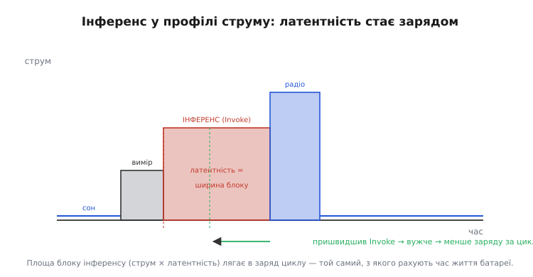

# Інференс на пристрої (Edge AI)

Дотепер у курсі ми навчилися зводити рваний профіль пристрою до [середнього струму й часу життя батареї](root:embedded/duty-cycle-current), бачили, як [DMA годує АЦП без участі ядра](root:embedded/dma-adc), і вже вирішили, що критичне за часом мусить [рахуватися на борту](root:embedded/where-to-compute). Тепер на цей борт приходить дещо нове — **навчена модель**. Хтось у хмарі натренував нейромережу впізнавати слово-команду чи бачити людину в кадрі, [стиснув її до розмірів мікроконтролера](topic:sf-ml/tinyml) і дав тобі один файл — `.tflite` на кількадесят кілобайтів. Питання курсу тепер вузьке й інженерне: **як цей файл перетворити на функцію, яку ти викликаєш зі свого super-loop, і скільки вона коштує в тактах і байтах?**

Це і є **інференс на пристрої** (англ. *inference* — «висновування», від лат. *inferre* «вносити, виводити»; означає прохід уже навченої моделі, що з входу виводить відповідь). Краєм, на якому він живе, англомовці звуть *edge* — «край» мережі, найдальша її точка, сам пристрій. Звідси **Edge AI**: штучний інтелект, що працює не в дата-центрі, а тут, на чипі в тебе в руках.

## Інференс — це не навчання

Перше, що треба викинути з голови: на пристрої **жодного навчання немає**. Навчання — це коли модель дивиться на тисячі прикладів і **підкручує власні ваги**, щоб менше помилятися; воно жадібне до пам'яті, до даних і до часу, і живе в хмарі. Те, що приїхало до тебе, — навпаки: ваги вже **застигли**, їх більше ніхто не чіпає. Різницю між цими двома режимами докладно розбирає окрема тема.

> 🔧 **Навіщо це.** Сплутати їх — типова й дорога помилка новачка: «а давай дрон сам довчиться в польоті». Ні. На борту ваги **сталі**, інференс лише читає їх; будь-яке донавчання — це повернути дані в хмару, перетренувати там і прислати **новий** `.tflite`. Чому навчання важче за інференс на порядки й що саме відбувається у кожному режимі — у темі [навчання проти виводу](topic:sf-ml/train-vs-inference).

З цього застигання випливає головна гарна звістка для вбудованика: **інференс детермінований**. Граф операцій фіксований, ваги сталі, тож кожен виклик — це той самий ланцюжок множень і додавань над новими числами. Немає циклів «доки не збіжеться», немає випадковості, немає алокацій у розпал роботи. А отже, інференс має **передбачуваний час** — і його можна вписати в той самий бюджет реального часу, що й будь-яку іншу периферійну операцію.

Сам прохід — це послідовність **шарів** (англ. *layer*). Кожен шар бере вхідні числа, перемножує їх із вагами, додає зсув і пропускає через просту нелінійність — і так шар за шаром, від входу до виходу. У згорткової мережі це згортки, що ковзають фільтром по зображенню; у решти — здебільшого великі множення матриць. Що це за шари й чому згортка так пасує до зображень — справа [теми про згорткові мережі](topic:sf-ml/cnn); нам тут важить інше: усе це врешті зводиться до **мільйонів множень-додавань** (MAC, *multiply-accumulate*) над масивами чисел. І саме ця гора MAC-ів визначить, скільки інференс з'їсть тактів і енергії.


*Інференс на чипі розпадається на дві дуже різні за частотою частини. Розбір моделі й розкладку пам'яті роблять **один раз** при старті. А власне прохід — input-тензор, граф операцій у топологічному порядку, output-тензор, деквантування — крутять **на кожен кадр**. Граф і ваги при цьому сталі: «навчання» лишилося в хмарі.*

## Де живуть байти моделі

Перш ніж викликати модель, треба зрозуміти, **куди вона лягає в пам'ять**, бо саме пам'ять — найдефіцитніший ресурс мікроконтролера, і саме об неї найчастіше розбивається перша спроба. Тут працює природний поділ, що дзеркалить будову самого чипа.

**Ваги лягають у Flash.** Їх — найбільше (десятки чи сотні кілобайтів), вони **сталі** й не змінюються між викликами. Усе, що сталеве й об'ємне, місце якому — нелетка [пам'ять програм](root:embedded/memory-budget-mcu): ваги вшивають у Flash разом із кодом, як велику константу. Звідти їх читають **прямо на місці**, не копіюючи в RAM, — на те Flash і пристосована до читання. Бонусом ваги **переживають вимкнення живлення**: чіп прокинувся з глибокого сну — модель уже на місці, вантажити нічого.

**Активації лягають у RAM.** Це числа, що течуть **між шарами**: вихід першого шару стає входом другого, той — входом третього. Вони тимчасові, живуть частки секунди й щоразу інші, тож їм потрібна пам'ять, у яку можна **писати**, — оперативна. Фреймворк не розкидає їх по змінних, а виділяє один суцільний шмат RAM наперед і зве його **тензорною ареною** (*tensor arena* — «арена», бо на цьому майданчику тензори по черзі з'являються й зникають). Усередині арени активації одного шару переписують активаціями наступного — пам'ять перевикористовують, тримаючи водночас лише те, що зараз потрібне.


*Поділ пам'яті прямо відбиває природу даних. Ваги — сталі й об'ємні — сидять у Flash і читаються звідти на місці, переживаючи скидання. Активації — тимчасові й перезаписувані — живуть у тензорній арені в RAM, яку фреймворк ліпить наново після кожного запуску. Розмір арени задаєш ти сам, і вгадати його — окрема морока.*

> 🔧 **Навіщо це.** Цей поділ — твій бюджет, складений із двох незалежних чисел. **Flash:** чи влізуть ваги поряд із кодом? **RAM:** чи влізе арена поряд зі стеком, купою й буферами драйверів? Друге підступніше: арену задаєш ти руками одним числом, і замала арена валить запуск моделі, а зависока — краде RAM у решти прошивки. Як зважувати ці дві шухляди в межах усього проєкту — у темі [бюджет пам'яті мікроконтролера](root:embedded/memory-budget-mcu).

## Чому int8, а не float

Тепер придивімося до самих чисел. Ваги в нашому файлі — не звичні дробові, а **цілі восьмибітні** (int8), і це не дрібниця реалізації, а те, що взагалі робить інференс можливим на дешевому чипі.

Причин дві, і обидві земні. Перша — **пам'ять**: одне int8-число займає 1 байт замість 4 у звичайного float32, тож модель ужимається **вчетверо** — рівно та різниця, що часом і вирішує, влізе вона у Flash чи ні. Друга, не менш важлива на найпростіших чипах, — **швидкість**: багато дешевих мікроконтролерів **узагалі не мають** апаратного блока дробових обчислень (FPU), і кожне множення float там розкладається в десятки інструкцій. А цілочисельне множення вони роблять **за один такт**. Чому дробова арифметика без FPU така дорога й як її взагалі тягнуть на цілих числах — окрема [тема про fixed-point](topic:com-signal/fixed-point-implementation); нам досить висновку: на цілих числах та сама гора MAC-ів злітає в рази швидше.

Розплата — точність, але мізерна. Округлити вагу до одного з 256 рівнів — те саме [квантування, яким TinyML стискає модель](topic:sf-ml/tinyml); мережа цю згрубілість майже не помічає, бо вона й так надлишкова. Зв'язок між цілим і справжнім значенням лінійний, через два числа на тензор: **масштаб** (scale, ціна однієї поділки) і **нульову точку** (zero-point, який код відповідає справжньому нулю):

```
справжнє ≈ масштаб · (ціле − нульова_точка)
```

Це і є той місток, яким чіп перекладає вхідні дані в int8 на вході й розкодовує int8-вихід назад у звичне число наприкінці. Усе **проміжне** — згортки, множення матриць — лишається в цілих, бо саме цілі дешеві. Як саме масштаб і нульова точка виводяться з діапазону величин, чому добуток двох int8 теж вдається втримати цілим і де ховається пастка округлення — у вставці [афінне квантування: арифметика int8-інференсу](root:embedded/edge-inference/math-affine-quantization.md).

## Як це виглядає в коді

Зберімо все докупи в робочій прошивці. Сьогоднішній фактичний стандарт для інференсу на мікроконтролерах — **TFLite Micro** (TensorFlow Lite for Microcontrollers): крихітна бібліотека на C++, що вміє прочитати `.tflite` і прокрутити його граф, не вимагаючи ні операційної системи, ні купи, ні файлової системи. Звідки вона взялася, чому злилася з ARM-івським uTensor і як у 2024-му стала зватися LiteRT — невелика, але повчальна історія, [винесена окремо](root:embedded/edge-inference/hist-tinyml-frameworks.md).

Скелет завжди той самий і прямо лягає на дві частини з нашої першої схеми. **Один раз** при старті: дати бібліотеці модель і набір потрібних операцій, віддати їй шматок RAM під арену й попросити розкласти тензори. **На кожен кадр**: покласти дані у вхідний тензор, викликати `Invoke()`, прочитати вихід.

```cpp
#include "tensorflow/lite/micro/micro_interpreter.h"
#include "tensorflow/lite/micro/micro_mutable_op_resolver.h"
#include "model_data.h"   // масив g_model[] — наш .tflite, вшитий у Flash

// Арену задаємо РУКАМИ. Замала — AllocateTensors() впаде; зависока — крадемо RAM.
// alignas(16): бібліотека хоче вирівняний буфер.
constexpr int kArenaSize = 24 * 1024;
alignas(16) static uint8_t tensor_arena[kArenaSize];

static tflite::MicroInterpreter* interp = nullptr;
static TfLiteTensor* input  = nullptr;
static TfLiteTensor* output = nullptr;

bool model_setup() {                                   // ← ОДИН РАЗ при старті
    const tflite::Model* model = tflite::GetModel(g_model);

    // Перелічуємо ЛИШЕ ті операції, що є в моделі (кожна важить пам'ять).
    static tflite::MicroMutableOpResolver<4> resolver;
    resolver.AddConv2D();
    resolver.AddDepthwiseConv2D();
    resolver.AddFullyConnected();
    resolver.AddSoftmax();

    static tflite::MicroInterpreter static_interp(
        model, resolver, tensor_arena, kArenaSize);
    interp = &static_interp;

    if (interp->AllocateTensors() != kTfLiteOk)        // розкладка арени
        return false;                                  // ← арени не вистачило

    input  = interp->input(0);
    output = interp->output(0);
    return true;
}
```

Зверни увагу на три речі, що відрізняють вбудований код від хмарного. Арена — **статичний масив фіксованого розміру**, ніякого `malloc`; її розмір ти підбираєш сам і перевіряєш за поверненням `AllocateTensors()`. Операції перелічуєш **поіменно** — резолвер тягне в збірку лише ті ядра, що реально потрібні, бо кожне зайве важить кілобайти Flash. І весь стан — `static`, бо живе він усе життя прошивки.

Сам виклик на кожному кадрі короткий — уся робота захована в одному `Invoke()`:

```cpp
float model_classify(const int8_t* features, int n) {  // ← НА КОЖЕН КАДР
    // 1. Дані вже у int8 (масштаб/нульова точка взяті з input->params).
    for (int i = 0; i < n; i++)
        input->data.int8[i] = features[i];

    // 2. Один прохід графа — детермінований, без алокацій.
    if (interp->Invoke() != kTfLiteOk)
        return -1.0f;

    // 3. Вихід — теж int8; повертаємо в звичне число тим самим містком.
    int8_t  raw   = output->data.int8[0];
    float   scale = output->params.scale;
    int     zp    = output->params.zero_point;
    return scale * (raw - zp);                          // ймовірність 0…1
}
```

Це повний цикл інференсу на мікроконтролері: записав вхід, смикнув `Invoke()`, деквантував вихід. Усе між цими рядками — гора int8-MAC-ів — бібліотека робить сама, шар за шаром, по тензорній арені. Бойова версія цього скелета — з вирівнюванням, перевіркою сумісності схеми, заміром латентності й охороною від переповнення арени — зібрана у вставці [запуск моделі через TFLite Micro](root:embedded/edge-inference/proj-tflm-invoke.md).

## Скільки це коштує

Лишилося найголовніше для вбудованика — **ціна**. Інференс не безплатний, і його вартість лягає рівно в ті бюджети, які ми вже навчилися рахувати.

**Латентність.** Час одного `Invoke()` визначає та сама гора MAC-ів: грубо кажучи, скільки множень-додавань у моделі, стільки тактів (а часто й кілька на кожне) ядро й молотитиме. Звідси проста й чесна прикидка:

**Умова.** Модель — крихітний детектор «є людина / нема», у проході ≈ 6 мільйонів MAC-ів. Чіп — Cortex-M4 на 80 МГц, цілочисельне множення за такт, але реально на кожен MAC із накладними витратами йде ≈ 5 тактів.

```
тактів на прохід ≈ 6 000 000 MAC × 5 такт/MAC = 30 000 000 тактів
латентність      = 30 000 000 / 80 000 000 такт/с ≈ 0.375 с
кадрів за секунду = 1 / 0.375 ≈ 2.7 кадр/с
```

Майже три кадри на секунду — для «час від часу глянути, чи з'явилася людина» цього досить, для відстеження руху в реальному часі — ні. Це число — найперше, що треба **зміряти на самому чипі** ще до будь-якої оптимізації; чому теоретична оцінка систематично бреше (кеш, доступ до пам'яті, реальна вартість операцій) — у [темі про латентність інференсу](topic:sf-ml/inference-latency).

**Енергія.** А ось тут наша попередня робота окупається прямо. Поки крутиться `Invoke()`, ядро працює на повній швидкості й тягне активний струм — інференс додає у профіль пристрою **окремий активний блок**, ширина якого дорівнює латентності. А заряд цього блока — це просто струм на час, той самий доданок, з якого ми [складали бюджет батареї](root:embedded/duty-cycle-current).



*Інференс у профілі споживання — це активний блок завширшки в латентність. Його площа (струм × час) лягає у заряд циклу так само, як вимір чи радіопередача. Звідси прямий висновок: пришвидшив `Invoke()` — звузив блок — зрізав заряд за цикл, а отже, продовжив життя батареї.*

**Умова.** Той самий детектор. Під час `Invoke()` чіп тягне 20 мА протягом 0.375 с; пристрій робить це раз на 10 секунд, решту часу спить на 0.01 мА.

```
заряд інференсу за цикл = 20 мА × 0.375 с      = 7.5 мА·с
заряд сну за цикл       = 0.01 мА × 9.625 с    ≈ 0.096 мА·с
заряд циклу             ≈ 7.6 мА·с,   період 10 с
середній струм         = 7.6 / 10              = 0.76 мА = 760 мкА
```

Один лише інференс підняв середній струм до 760 мкА — тобто від пари AA на 2000 мА·год пристрій протягне близько 2630 годин, чи трохи менш як чотири місяці, і левову частку цього з'їла саме модель. Звідси й важіль: **усе, що скорочує латентність, прямо економить батарею**. Менша модель, агресивніше квантування і — найбільший виграш — апаратне прискорення MAC-ів: ті самі шари на спеціалізованих ядрах (бібліотека CMSIS-NN, NPU-прискорювачі) рахуються в рази швидше, звужуючи червоний блок на схемі без жодної зміни решти прошивки. Глибше зважування «потужність проти ватів і грамів» — у [темі про вартість обчислень](topic:hw-arch/compute-cost), а вибір самого заліза під задачу ми вже проходили у [питанні, де рахувати](root:embedded/where-to-compute).

## Куди це вставити в прошивку

Лишається посадити інференс у структуру програми. `Invoke()` на сотні мілісекунд — це **довга блокувальна операція**, і пхати її абияк у super-loop небезпечно: поки модель молотить, ядро не обслужить нічого іншого. Тут діє все, що ми вже знаємо про межі super-loop і реальний час. Якщо в системі є строгі дедлайни (стабілізація апарата, реакція на переривання), інференс **не сміє** їх блокувати — його або виносять у найнижчий пріоритет між критичними задачами, або розривають на шматки, або взагалі віддають окремому ядру чи прискорювачу. Якщо ж пристрій простий і періодичний — прокинувся, глянув, заснув, — то блокувальний `Invoke()` у головному циклі цілком доречний, бо більше ніхто на ядро й не претендує. Правило те саме, що й для будь-якої важкої роботи: спершу спитай, **які дедлайни поряд**, і лише тоді вирішуй, як її розмістити.

> 🔧 **Навіщо це.** Інференс — звичайна, хоч і важка, периферійна операція, і ставитися до неї треба як до будь-якої іншої: знати її **латентність** (зміряну, не вгадану), її **заряд** у бюджеті батареї та її **місце** серед дедлайнів. Зробив це — і «штучний інтелект на борту» перестає бути магією й стає рядком у тій самій таблиці фаз, що й вимір та радіопередача.

## Підсумок теми

Інференс на пристрої — це прохід **уже навченої** моделі прямо на чипі: ваги сталі, навчання лишилося в хмарі, тож кожен виклик **детермінований** і має передбачуваний час. Байти моделі розкладаються за природою: сталі **ваги — у Flash** (читаються на місці, переживають сон), тимчасові **активації — у тензорній арені в RAM**, розмір якої задаєш ти сам. Числа — **int8**, бо це вчетверо менше пам'яті й набагато швидше на чипах без FPU, а зв'язок із справжніми значеннями тримають масштаб і нульова точка. У коді все зводиться до двох частин: **один раз** розкласти тензори (`AllocateTensors`), **на кожен кадр** записати вхід, смикнути `Invoke()` і деквантувати вихід — фактичний стандарт тут TFLite Micro. А ціна інференсу лягає в уже знайомі бюджети: **латентність** від гори MAC-ів (мір на самому чипі), **енергія** як активний блок у профілі споживання, і **місце** серед дедлайнів super-loop. Пришвидшив `Invoke()` — квантуванням, меншою моделлю чи апаратним прискоренням — і одразу зрізав і час відгуку, і заряд за цикл.
