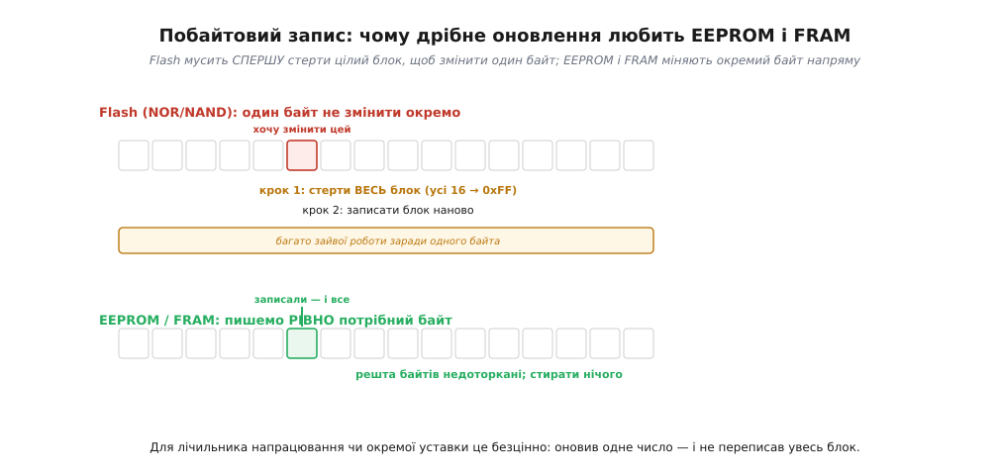
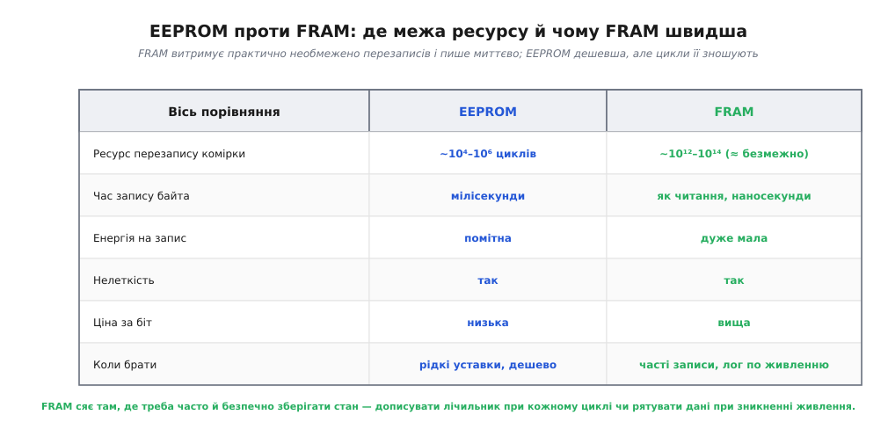

# EEPROM і FRAM: маленькі сховища налаштувань

Великі сховища — [NAND](root:embedded/nor-vs-nand), SD, [eMMC та SSD](topic:hw-arch/emmc-ssd) — заточені під **великі** дані й працюють **блоками**: щоб змінити байт, флеш мусить стерти цілу сторінку чи блок. Це чудово для файлів і медіа, але геть незручно для іншого, дуже частого випадку: коли треба зберегти **крихітку** даних — серійний номер, калібрувальну поправку, лічильник напрацювання, одну уставку — і час від часу її **оновлювати**. Городити заради одного байта стирання цілого блоку — марнотратство. Для таких маленьких сховищ існують дві спеціальні нелеткі пам'яті з **побайтовим** записом: давня й дешева **EEPROM** і молодша, майже ідеальна **FRAM**. Розберімо, чим вони зручні й чим відрізняються одна від одної.

### Головна перевага: пишемо окремий байт

Найважливіша риса цих пам'ятей — можна записати **рівно один байт**, не чіпаючи сусідів і нічого попередньо не стираючи.


*Щоб змінити один байт у Flash, доводиться спершу стерти цілий блок (усі його байти), а потім записати блок наново, — багато зайвої роботи заради однієї комірки. EEPROM і FRAM пишуть рівно потрібний байт напряму: решта комірок недоторкані, стирати нічого не треба. Для окремої уставки чи лічильника це безцінно.*

Різниця в зручності тут разюча. У флеші дрібне оновлення обертається важкою процедурою «стерти блок → переписати блок», бо стирати можна лише гуртом. EEPROM (від англ. *Electrically Erasable Programmable ROM* — «електрично стирана програмована постійна пам'ять») і FRAM (від англ. *Ferroelectric RAM* — «сегнетоелектрична RAM»; та сама пам'ять часто зветься FeRAM) працюють інакше: кожна комірка адресується й перезаписується **окремо**, як у звичайній RAM, але при цьому пам'ять лишається **нелеткою** — дані стоять без живлення. Записати нове значення лічильника чи поправки — це одна проста операція над потрібним байтом, без жодного стирання й без зачіпання решти. Саме тому ці пам'яті — природний дім для **налаштувань**: маленьких, але важливих даних, що мусять пережити вимкнення й час від часу оновлюватися.

Виглядають ці пам'яті скромно — здебільшого це **крихітні мікросхеми** на кілька кілобайтів, що під'єднуються до мікроконтролера простою послідовною шиною (тими самими [I²C](topic:com-devices/i2c-bus) чи [SPI](topic:com-devices/spi-bus)). Для коду робота з ними зводиться до «прочитати байт за адресою» / «записати байт за адресою» — рівно та [модель пам'яті як масиву комірок](topic:hw-arch/memory-as-array). Деякі мікроконтролери навіть мають невеличку вбудовану EEPROM (або **імітують** її в куточку своєї Flash), щоб тримати дрібні уставки без окремого чіпа. Обсяг тут навмисно малий — кілобайти, не мегабайти, — бо й призначення дрібне: не файли й медіа (для цього є NAND чи [SD-картка](topic:hw-arch/sd-card)), а кілька важливих чисел, які мусять пережити вимкнення. Велике сховище й маленьке сховище — це різні пам'яті під різні потреби.

> 🔌 **А як ця мікросхема виглядає зблизька?** Здебільшого це вісім ніжок у крихітному корпусі SOIC-8, у двох шинних версіях — два дроти I²C чи чотири SPI, — з адресними ніжками A0–A2 та ніжкою захисту запису WP. Як завести такий чип на мікроконтролер і чому запис у EEPROM треба робити обережно (дочекатися готовності, не лізти через межу сторінки), а у FRAM — ні, зібрано у вставці [Послідовна EEPROM/FRAM як мікросхема](root:embedded/eeprom-fram/comp-serial-eeprom-fram.md).

### EEPROM проти FRAM: ресурс, швидкість, енергія

Маючи спільну рису (побайтовий нелеткий запис), EEPROM і FRAM різняться в трьох вимірах, що й визначають вибір між ними: **ресурс** перезаписів, **швидкість** запису й **енергія**.


*EEPROM дешева, але її комірка зношується: вона витримує близько 10⁴–10⁶ перезаписів, запис байта триває мілісекунди й помітно споживає. FRAM витримує ~10¹²–10¹⁴ циклів (практично необмежено), пише миттєво (наносекунди, як читання) і майже не споживає на запис, — але дорожча за біт. Обидві нелеткі. Звідси й вибір: рідкі уставки — EEPROM; часті записи чи рятування даних при зникненні живлення — FRAM.*

Розберімо ці три осі, бо вони вирішальні. **Ресурс** (*endurance*) — скільки разів комірку можна перезаписати, поки вона не зноситься: у EEPROM це від десятків тисяч до мільйона циклів — багато для рідкісних змін, але мало, якщо писати щосекунди (адже основа EEPROM — той самий [плаваючий затвор](root:embedded/memory-cell-physics), що зношується від запису). FRAM зберігає біт інакше — поляризацією особливого матеріалу, — і тому витримує трильйони циклів, тобто **практично необмежено**. **Швидкість**: EEPROM пише байт мілісекунди (помітна пауза), FRAM — за наносекунди, не повільніше за читання. **Енергія**: запис у EEPROM відчутно споживає, у FRAM — майже задарма. Підсумок очевидний: FRAM кращий майже в усьому, крім **ціни** й **щільності** — він дорожчий за біт, а та сама комірка займає більше площі, тож на чіпі вміщається менше пам'яті (типові FRAM — кілобіти-мегабіти, не гігабайти). Саме тому EEPROM досі живий там, де треба дешево й зрідка. А там, де записувати треба **часто** — наприклад, дописувати лічильник при кожному циклі роботи чи блискавично зберегти стан у мить зникнення живлення, — FRAM незамінний.

**Приклад (ресурс лічильника напрацювання).** Уявімо пристрій, що при кожному ввімкненні дописує лічильник у нелетку пам'ять. Скільки циклів він переживе на EEPROM і на FRAM?

```
сценарій: запис лічильника 1 раз за хвилину, 24/7

EEPROM (ресурс ≈ 100 000 циклів комірки):
   100 000 циклів ÷ (60 запис/год × 24 год) ≈ 69 діб → комірка зношена!
   (рятує «розмазування» запису по багатьох комірках, але це ускладнення)

FRAM (ресурс ≈ 10¹³ циклів):
   10¹³ ÷ (1440 запис/добу) ≈ 19 мільярдів діб → практично вічно
```

Для **частого** запису EEPROM швидко вичерпує ресурс однієї комірки (за тижні!), і доводиться хитрувати, розкидаючи запис; FRAM же витримує такий режим **необмежено** — тому саме його ставлять, коли стан оновлюють постійно.

Окремо варто розкрити випадок «зберегти стан в останню мить», де FRAM незрівнянний. Уявімо пристрій, у якого зненацька зникає живлення — висмикнули кабель, сіла батарея. Між миттю, коли напруга почала падати, і миттю, коли її вже замало для роботи, минає крихітний проміжок: конденсатори на платі ще тримають заряд кілька мілісекунд. Цього вікна вистачає, щоб **встигнути записати** найважливіше — поточні лічильники, останній стан, незавершені дані, — **якщо** пам'ять пише швидко. FRAM пише за наносекунди й майже без енергії, тож устигає зберегти все за це коротке вікно; EEPROM зі своїми мілісекундами на байт часто **не встигає** — напруга впаде раніше. Тому в пристроях, де живлення може обірватися будь-коли, а втрачати стан не можна, FRAM — не примха, а правильний інструмент: він перетворює «раптову смерть» на акуратне збереження.

> 🔧 **Навіщо це.** EEPROM і FRAM закривають той клас даних, з яким велика флеш незручна, — **маленькі налаштування**. Перше: коли треба зберегти серійний номер, калібрування, уставки користувача чи лічильник — це робота для **побайтової** нелеткої пам'яті, а не для блокової флеші чи картки (городити стирання блоку заради байта безглуздо). Друге, критично важливе — **ресурс**: якщо записуєте **часто**, рахуйте цикли. EEPROM (10⁴–10⁶ циклів) вичерпується за тижні безперервного запису в одну комірку — для такого беріть **FRAM** (практично безмежний ресурс) або «розмазуйте» запис по EEPROM. Третє: **FRAM пише миттєво й майже без енергії**, тому він ідеальний, щоб **зберегти стан у момент зникнення живлення** (встигаєте записати, поки конденсатори ще тримають напругу) — для EEPROM з її мілісекундами це часто запізно. Коротко: рідко й дешево — EEPROM; часто, швидко чи «в останню мить» — FRAM.

---

Отже, для **маленьких** даних, які треба оновлювати **окремими байтами** (серійний номер, калібрування, уставки, лічильники), велика блокова флеш незручна — вона стирає цілими блоками. Тут служать дві нелеткі пам'яті з **побайтовим** записом: **EEPROM** і **FRAM**. Обидві дають змінити рівно потрібний байт, не чіпаючи сусідів і нічого не стираючи, та зберегти дані без живлення. Різниця — у трьох осях: **EEPROM** дешева, але зношується (~10⁴–10⁶ циклів, бо [плаваючий затвор](root:embedded/memory-cell-physics)), пише мілісекунди й помітно споживає; **FRAM** витримує ~10¹²–10¹⁴ циклів (практично безмежно), пише за наносекунди й майже без енергії, але дорожча за біт і має меншу щільність. Звідси вибір: рідкі уставки — EEPROM; часті записи чи рятування стану в мить зникнення живлення — FRAM. Разом із швидкою леткою [DRAM під контролером](topic:hw-components/dram-cell) та ємним нелетким сховищем (NOR, NAND, SD, eMMC, SSD) ці дві побайтові пам'яті складають повний набір, з якого [обирають сховище під конкретний проєкт](root:embedded/choosing-memory).

---
