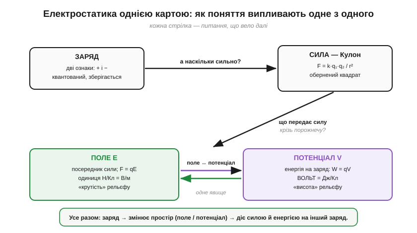
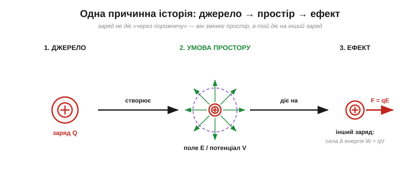

# Електростатика як єдина картина

Електростатика тримається на жменьці понять — заряд, сила, поле, потенціал, вольт, — і легко сприйняти їх як окремі факти для запам'ятовування. Насправді це **одна струнка історія**, де поняття неминуче випливають одне з одного: жодне з них не висить саме собою, а народжується з питання, яке відкриває сусіднє. Глянути на всі шість разом, **згори**, корисно саме тому, що тоді видно цю єдність — кістяк, на якому тримається решта.

### Логічний ланцюг: як одне веде до іншого

Веде тут **ланцюг питань**, де кожна відповідь породжує наступне.


*Уся електростатика на одній мапі. Заряд → «а наскільки сильно діє?» → закон Кулона → «що передає силу крізь порожнечу?» → поле ↔ потенціал, що виявилися одним явищем. Жодне поняття не висить окремо — кожне народжується з потреби, яку лишає попереднє.*

Початок — [заряд](topic:ph-electromagnetism/electric-charge): первинна властивість матерії, двох родів, квантована й незнищенна. Та сказати, що заряди «діють одне на одного», замало; постає питання **наскільки сильно** — і [закон Кулона](topic:ph-electromagnetism/coulomb-law) дає на нього відповідь із його оберненим квадратом. Але закон сили лишає глибшу загадку: **що саме** передає цю силу через порожній простір? Відповідь — [поле](topic:ph-electromagnetism/electric-field), посередник, що змінює сам простір. Коли ж заряд під дією поля рушає, постає питання **енергії** — і тут з'являються робота, потенціальна енергія й [потенціал](topic:ph-electromagnetism/electric-potential), а з ним і головна одиниця — [вольт = Дж/Кл](topic:hw-sensing/volt). Нарешті виявляється, що [поле й потенціал](root:embedded/field-and-potential) — не дві речі, а **дві мови** одного явища. Кожна ланка тут — не довільний розділ підручника, а **вимушений наступний крок**.

### Одна причинна історія

Якщо логічний ланцюг — це послідовність **питань**, то є й простіший, фізичний погляд: що насправді **відбувається** в просторі. І вся електростатика вкладається в одне речення з трьох слів: **джерело → простір → ефект**.


*Заряд-джерело не дотягується до іншого заряду «через порожнечу». Він **змінює простір** довкола — наповнює його полем E і потенціалом V. А вже цей змінений простір діє на будь-який інший заряд: штовхає його силою F = qE й наділяє енергією W = qV. Уся електростатика — це ці три стадії.*

Ось чому поле виявилося такою плідною ідеєю: воно прибирає містику «дії на відстані», замінивши її ланцюжком **локальних** причин. Заряд тут — причина; поле/потенціал — стан простору, який вона створює; сила й енергія на інший заряд — наслідок. Заряд, поле, потенціал, вольт — це не чотири окремі факти для зубріння, а чотири погляди на **одну** просту картину.

### Наскрізні мотиви

Крізь усю електростатику проходить кілька **візерунків**, які варто помітити, бо вони повторюються і в інших розділах фізики. Перший — знаменник «**на заряд**»: і поле (E = F/q), і потенціал (V = W/q) виходять із того, що ділимо щось на заряд, щоб мати властивість самого простору, незалежну від пробного тіла. Другий — пара «**крутість і висота**»: те, що поле спадає як 1/r², а потенціал як 1/r, — це той самий зв'язок «нахил проти накопиченого». Третій — **аналогія з гравітацією**: висота, схил, запасена енергія супроводжують усю цю теорію, від сили між зарядами до єдності поля й потенціалу. І скрізь діє **збереження** — заряду, енергії. Упізнавати ці мотиви — означає вчитися швидше: нове часто виявляється старим у новому вбранні.

**Приклад (уся теорія в одному розрахунку).** З'єднаймо все. Маємо джерело — точковий заряд Q = +10 нКл. Розгляньмо точку за 5 см від нього.

```
поле там:      E = k·Q/r² = (8.99×10⁹)(10×10⁻⁹)/(0.05)² ≈ 3.6×10⁴ Н/Кл
потенціал там: V = k·Q/r  = (8.99×10⁹)(10×10⁻⁹)/(0.05)  ≈ 1800 В
сила на +2 нКл: F = qE = (2×10⁻⁹)(3.6×10⁴) ≈ 7.2×10⁻⁵ Н
енергія, коли цей заряд відійде з 5 см на 10 см:
   V(10 см) = k·Q/0.10 ≈ 900 В
   ΔV = 1800 − 900 = 900 В
   W = q·ΔV = (2×10⁻⁹)(900) ≈ 1.8×10⁻⁶ Дж = 1.8 мкДж
```

Один заряд-джерело — і за хвилину з нього виходять поле, потенціал, сила й енергія. Усі поняття електростатики працюють разом, як деталі одного механізму. Якщо цей приклад читається легко — картина склалася.

> 🔧 **Навіщо це.** Електростатика дає **робочий словник** усієї електроніки: заряд (кулон), поле (В/м), потенціал і напруга (вольт = Дж/Кл), енергія (qV), а ще — інтуїцію «висоти й схилу» та звичку бачити провідник як одну еквіпотенціаль. Це фундамент, на якому тримається все інше — струми, опір, кола, сигнали. Жодну схему не можна по-справжньому зрозуміти, не відчуваючи за «вольтами» саме **енергію на заряд**.

### Показова перевірка: абетка в дії

Усю цю **абетку** — заряд, силу, поле, потенціал, вольт — найкраще перевірити на явищі, яке не вводить жодного нового поняття, а лише змушує всі вже відомі працювати разом. Таким явищем є екранування, або [клітка Фарадея](topic:ph-electromagnetism/faraday-cage). Щоб зрозуміти, чому замкнута металева оболонка робить простір усередині «сліпим» до зовнішніх полів, доводиться поєднати водночас: [вільні заряди у провіднику](topic:ph-electromagnetism/electric-charge), [суперпозицію полів](topic:ph-electromagnetism/electric-field), те, що поле біля провідника перпендикулярне до поверхні, і що [провідник — одна еквіпотенціаль](root:embedded/field-and-potential). Якщо все це складається в голові в єдину картину — абетку засвоєно.

Варто усвідомити й **вагу** цього фундаменту. Давач, що віддає мілівольти; логічний рівень, що є просто напругою; транзистор, яким керує поле на затворі; антена, що випромінює поле, — усе це говорить мовою заряду, поля, потенціалу й енергії на заряд. Це та абетка, якою написано решту електроніки, — опора, до якої варто повертатися знову й знову.

---
