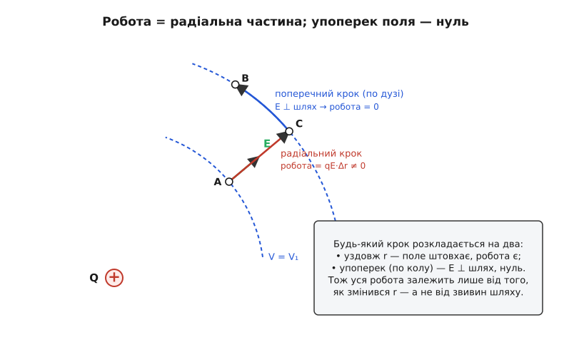

# 🧮 Чому робота поля не залежить від шляху — і звідки береться потенціал

Ми вже користувалися потенціалом так, ніби він завжди був: приписували кожній точці простору одне число V, казали «різниця потенціалів між A і B» і рахували роботу як W = q·(V_A − V_B). Але тут захована нетривіальна обіцянка. Приписати точці **одне** число енергії можна лише тоді, коли енергія в цій точці справді **одна** — не залежить від того, яким шляхом заряд туди дістався. А це зовсім не очевидно. Уявіть силу тертя: щоб протягти ящик з A до B, робота залежить від довжини шляху — довшим маршрутом витратиш більше. Для такої сили «енергія в точці B» — беззмістовна: вона різна для різних доріг. Ніякого «потенціалу тертя» не існує.

Тож питання, від якого залежить уся будівля, звучить різко: **чому для електростатичного поля робота не залежить від шляху?** Поки на нього немає чесної відповіді, потенціал V — це припущення, а не поняття. Розберімо це від самого низу — і побачимо, що відповідь не постулат, а неминучий наслідок однієї-єдиної риси кулонівського поля.

## Що саме треба довести

Спершу назвімо ціль точно, бо в неї три обличчя, і всі три — та сама теорема.

**Перше обличчя — незалежність від шляху.** Візьмемо дві точки A і B і два різні шляхи між ними. Робота поля над зарядом уздовж шляху 1 і вздовж шляху 2 має бути **однаковою**. Не приблизно — точно, для будь-яких двох шляхів.

**Друге обличчя — нуль по замкненому контуру.** Якщо робота з A до B та сама будь-яким шляхом, то, пройшовши з A до B одним шляхом і повернувшись з B до A іншим, ми обійдемо **замкнену петлю** — і сумарна робота буде нуль. Бо назад робота просто змінює знак. Формально це записують так:

```
∮ F · dl = 0        (по будь-якому замкненому контуру)
```

Кружечок на інтегралі означає «по замкненому шляху». Поле, для якого цей інтеграл завжди нуль, називають **консервативним** (лат. *conservare* — зберігати): воно **зберігає** енергію, не дає її ні викачати, ні накачати за один оберт.

**Третє обличчя — існування потенціалу.** Якщо робота залежить лише від кінців, а не від дороги, то величину «робота, щоб дістатися сюди» можна повісити на **саму точку** як її властивість. Оце число на точку і є потенціал. Тобто **потенціал існує тоді й лише тоді, коли поле консервативне** — це не два факти, а один.

Ці три — логічно рівносильні: доведи одне, і решта два випливуть самі. Найлегше почати з незалежності від шляху, бо там видно **механізм**. Але спершу — чому взагалі варто підозрювати, що з електростатикою пощастило.

> 🔧 **Навіщо це.** Уся практична робота з напругою тримається на цьому доведенні. Коли ви кажете «на цьому вузлі 3.3 В», ви припускаєте, що в цій точці схеми потенціал **один** — не залежить від того, якою доріжкою по колу до неї дійшов заряд. Саме консервативність дозволяє мультиметру показувати одне число на точку, а закону Кірхгофа для напруг (сума спадів по замкненому контуру = 0) — узагалі існувати. Це прямий нащадок ∮E·dl = 0. Коли ж поле перестає бути консервативним (наведене змінним магнітним полем — про це наприкінці), «напруга між двома точками» стає неоднозначною, і вимірювання починає залежати від того, як прокладено щупи. Розуміти, **звідки** береться однозначність напруги, — значить розуміти, коли їй можна довіряти.

## Одна риса, з якої випливає все

Поле точкового заряду має дві риси, і саме їхня пара робить чудо.

**Риса перша — радіальність.** Поле напрямлене строго **вздовж прямої** від заряду (або до нього): силові лінії — це промені, що розходяться з однієї точки. Жодної закрутки вбік, жодної «завихреності» — тільки геть від центра чи до нього.

**Риса друга — залежність лише від r.** Величина поля залежить **тільки від відстані** до заряду, E = k·Q/r², і ні від чого більше — ні від напрямку, ні від того, як ти сюди прийшов. На сфері даного радіуса поле всюди однакове за модулем.

Тримаймо ці дві риси в голові — далі ми вичавимо з них усе. Причому важлива саме **пара**: радіальність без сталості на сфері (або навпаки) чуда б не дала. А втім, і вимога «точковий заряд» надто вузька: реальні поля — це суми полів багатьох зарядів, і треба, щоб теорема пережила таке додавання. Переживе — але про це в кінці; спершу розберімо один заряд, де все прозоро.

## Ядро: розкладемо будь-який крок на два

Ось прийом, який вирішує все. Пройдімо шлях не одразу, а **крихітними кроками** — і кожен крок розкладімо на дві складові: рух **уздовж** напрямку на заряд (радіальний, змінює r) і рух **упоперек** (по колу навколо заряду, r не міняється). Будь-який крок у площині — це сума цих двох. Як на карті будь-який зсув є «стільки на північ і стільки на схід», так тут будь-який зсув є «стільки вздовж радіуса і стільки по дузі».


*Заряд-джерело Q ліворуч; штрихові дуги — кола сталого r, тобто однакового V. Зелена стрілка — поле E у точці A, воно строго вздовж радіуса. Червоний крок A→C іде вздовж E: тут робота є, W = qE·Δr. Синій крок C→B іде по дузі, поперек E: поле перпендикулярне до руху, тож робота точно нуль. Будь-який шлях — це драбинка з таких кроків, і поперечні ланки не додають нічого.*

Тепер порахуймо роботу на кожній складовій. Робота — це «сила вздовж напрямку руху, помножена на пройдену відстань». Ключове слово — **вздовж**: працює лише та частина сили, що збігається з напрямком кроку; частина сили поперек до руху роботи не робить зовсім. Це не електричний факт, а сама означеність роботи: несучи валізу горизонтально, ти не робиш роботи проти сили тяжіння, хоч і втомлюєшся — бо сила тяжіння дивиться вниз, а рух горизонтальний.

Прикладемо це до наших двох складових.

**Поперечний крок — робота нуль.** Рухаючись по колу навколо заряду, ми йдемо перпендикулярно до радіуса. А поле — вздовж радіуса (риса перша!). Отже, сила qE **перпендикулярна** до кроку. Складова сили вздовж руху — нуль. Робота — нуль. Точно нуль, не приблизно: скільки б ми не крутилися по колу сталого r, поле не робить ані джоуля.

**Радіальний крок — робота є, і залежить лише від r.** Рухаючись уздовж радіуса, ми йдемо точно вздовж (чи проти) поля. Тут працює вся сила: робота на кроці — це qE помножити на зміну радіуса Δr. А оскільки E = k·Q/r² залежить **лише від r** (риса друга!), уся ця робота визначається тільки тим, з якого r на який r ми перейшли. Не тим, під яким кутом, не тим, коли — тільки початковим і кінцевим r цього кроку.

Складімо тепер увесь шлях. Робота на всьому шляху — це сума робіт на всіх кроках. Поперечні ланки дають нуль — їх можна викреслити всі до одної. Лишаються тільки радіальні ланки, і кожна з них залежить лише від зміни r. Але сума всіх змін r уздовж шляху — це просто **різниця між кінцевим і початковим радіусами**: усі проміжні r скорочуються, скільки б їх не було. Хоч ти петляй, хоч іди спіраллю — усі «туди-сюди» по радіусу взаємно погашаються, і лишається чиста різниця r_кінець − r_початок.

Ось і все. **Робота залежить тільки від початкового й кінцевого r — а отже, тільки від початкової й кінцевої точок.** Дорога між ними стерлася з відповіді. Ми не постулювали незалежність від шляху — ми **побачили**, як поперечні шматки шляху самознищуються, а радіальні згортаються в одну різницю. Це і є доведення першого обличчя теореми.

## Той самий доказ формулою

Тепер зробімо цей самий крок мовою математики — не заради строгості заради строгості, а щоб побачити, що інтуїція й формула кажуть буквально те саме, і щоб мати апарат для складніших випадків.

Робота поля над зарядом q на нескінченно малому кроці dl — це скалярний добуток:

```
dW = F · dl = qE · dl
```

Скалярний добуток E · dl бере саме ту складову E, що вздовж dl, — точно те «сила вздовж руху», про яке ми говорили. Тепер розкладімо dl на радіальну частину (dr вздовж напрямку на заряд, позначимо орт r̂) і поперечну (уздовж напрямку по колу). Поле для точкового заряду — чисто радіальне:

```
E = k·Q/r² · r̂
```

Скалярний добуток r̂ на поперечну частину dl дорівнює нулю (перпендикуляри), а на радіальну — просто dr. Тому з усього dl виживає тільки dr:

```
dW = q · (k·Q/r²) · dr
```

Погляньте, що сталося: у правій частині немає нічого, крім q, сталих і **dr**. Ні кута, ні напрямку, ні форми шляху — вони випали самі, бо поперечна складова обнулилася в скалярному добутку. Зберімо роботу по всьому шляху від точки A (радіус r_A) до точки B (радіус r_B) — інтегруємо:

```
W = ∫ dW = q·k·Q · ∫[r_A→r_B] dr/r² = q·k·Q · [ −1/r ]  від r_A до r_B
```

```
W = q·k·Q · (1/r_A − 1/r_B)
```

У відповіді стоять **лише радіуси кінців** — r_A і r_B. Форма шляху ніде не з'явилася, бо ще на кроці dW = q·(k·Q/r²)·dr вона зникла. Це той самий висновок, що ми здобули руками, тільки тепер видно його неминучість у кожному символі: інтеграл від функції **самого r** уздовж шляху завжди зводиться до значень на кінцях.

**Приклад (перевіримо, що дорога справді не рахується).** Заряд-джерело Q = +10 нКл. Переносимо пробний заряд q = +2 нКл з точки A на відстані r_A = 5 см до точки B на відстані r_B = 10 см. Порахуймо роботу поля — і байдуже, чи це прямий радіальний хід, чи хитра дуга.

```
W = q·k·Q·(1/r_A − 1/r_B)
W = (2×10⁻⁹)(8.99×10⁹)(10×10⁻⁹)·(1/0.05 − 1/0.10)
   = (2×10⁻⁹)(8.99×10⁹)(10×10⁻⁹)·(20 − 10)
   = (1.798×10⁻⁶)·(10)
   ≈ 1.8×10⁻⁵ Дж = 18 мкДж
```

Тепер спробуймо «схитрити»: спершу проведімо заряд по дузі на тому самому радіусі 5 см — хоч на чверть кола, хоч на пів. На всій дузі r не міняється, отже 1/r_A − 1/r_(та сама) = 0, робота нуль. Дуга нічого не додала. Потім радіальний хід з 5 см на 10 см дає ті самі 18 мкДж. Скільки б петель ми не вплели — рахуються лише кінцеві радіуси. Саме це у детальній статті названо «робота — число на точку, а не на шлях»; тут ми бачимо, **чому** так виходить.

## Від незалежності шляху — до нуля по контуру

Тепер зачинимо петлю — і отримаємо друге обличчя даром. Нехай заряд вийшов з точки A, поблукав як завгодно і **повернувся в ту саму A**. Тоді r_кінець = r_початок, бо кінцева точка — то й є початкова. Підставмо в нашу формулу:

```
∮ F · dl = q·k·Q·(1/r_A − 1/r_A) = 0
```

Робота по будь-якому замкненому контуру — нуль. Ось і консервативність, чорним по білому. Причому доводити її окремо не довелось: вона **вже сиділа** в незалежності від шляху. Логіка проста: якщо з A у будь-яку точку й назад завжди виходить нуль, то поле не має «скритого джерела енергії», яке можна було б обійти по колу й щось намолоти. Спробуй збудувати вічний двигун на електростатичному полі — обертай заряд по петлі й збирай роботу — і природа відповість строгим нулем на кожному оберті.

Тут варто застерегтися від хибного образу. «Нуль роботи по колу» **не** означає, що поле нікуди не штовхає, — ще й як штовхає. Означає інше: що воно **віддало** заряду на одній ділянці петлі, те точно **забрало** на іншій. Спуск і підйом за один оберт узаємно гасяться до копійки. Як гірська стежка, що вертає тебе у вихідну точку: сумарний набір висоти — нуль, хоч ти й наламався на підйомах. Різниця тільки в тому, що поле повертає енергію без утрат, а стежка — ні, бо там є тертя, поле-неконсервативна домішка.

## Народження потенціалу: число на точку

Тепер — третє обличчя, найкорисніше. Ми показали, що робота залежить лише від кінців. Це відкриває двері до потужного спрощення. Закріпімо **одну** точку відліку — назвімо її «нуль» (зручно взяти нескінченність, де поле вже не сягає). Тоді кожній точці P простору можна приписати одне число: **роботу, потрібну, щоб принести одиничний заряд з нуля в P** (точніше — роботу зовнішньої сили проти поля, поділену на заряд). Це число залежить **лише від P**, бо шлях, як ми довели, не рахується. Оце число і є потенціал:

```
V(P) = робота проти поля з відліку в P, на одиницю заряду
```

Чому це коректне означення? Бо якби робота залежала від шляху, то в точці P було б **багато** різних «робіт принесення» — і жодного одного числа приписати не вдалося б. Саме доведена незалежність від шляху робить V(P) **однозначною функцією точки**. Ось глибокий зв'язок: **потенціал існує рівно тому, що поле консервативне**. Прибери консервативність — і саме поняття «потенціал точки» розсиплеться, бо точці не відповідатиме одне число.

А різниця потенціалів двох точок — це просто робота поля перенести одиничний заряд з однієї в іншу; проміжний «нуль» скорочується:

```
V_A − V_B = робота поля з A в B, на одиничний заряд = W / q
```

Ось звідки взялася формула W = q·(V_A − V_B), якою ми користувалися як готовою. Тепер вона не з неба: V — це «робота на точку», а різниця V — «робота між точками», бо шлях між ними не важить. Для точкового заряду, узявши відлік у нескінченності, з нашого W (де r_B → ∞ дає 1/r_B → 0) одразу випадає знайомий вигляд:

```
V(r) = k·Q / r
```

Ту саму V(r) = k·Q/r у детальній статті виводили з «драбини понять»; тепер видно її фундамент — вона існує лише завдяки доведеній консервативності.

## Локальний бік: E — це нахил V

Ми йшли від сили до числа-на-точці. Пройдімо той самий місток **назад**: маючи потенціал, дістати поле. Це дасть другу половину зв'язку E ↔ V і водночас — найкорисніший робочий інструмент.

Повернімося до кроку роботи, але поділімо на заряд, щоб мати саме потенціал. Пройшовши малий крок і впавши в потенціалі на dV, ми маємо (робота поля на одиницю заряду = − зміна потенціалу):

```
dV = − E · dl
```

Знак «мінус» тут не формальність, а фізика: поле штовхає заряд туди, де потенціал **нижчий** (як тіло скочується з гори вниз), тож рух уздовж поля потенціал **зменшує**. Візьмімо крок уздовж однієї осі, скажімо вздовж радіуса, і перепишімо:

```
E = − dV/dr        (поле = мінус нахил потенціалу)
```

Поле — це **крутість** потенціалу зі знаком мінус, спрямована в бік найшвидшого спаду. Де V міняється різко (круті стінки) — поле велике; де V пологий — поле слабке; де V рівний (плато) — поле нуль. Це та сама пара «крутість і висота», яку в детальній статті названо наскрізним мотивом; тут вона постає як строгий локальний зв'язок, дзеркальний до інтегрального V = −∫E·dl.

Перевірмо на нашому ж потенціалі, чи повертає це початкове поле:

```
V(r) = k·Q/r
E = − dV/dr = − d/dr (k·Q·r⁻¹) = − k·Q·(−1)·r⁻² = k·Q/r²
```

Коло замкнулося: з V = k·Q/r нахил повертає рівно E = k·Q/r², з якого ми починали. Дві мови — інтегральна (V — це накопичена робота поля) і локальна (E — це миттєвий нахил V) — описують один об'єкт і переходять одна в одну без утрат. Це й є та єдність поля й потенціалу, до якої весь час веде зведення електростатики.

Тут ховається ще одна причина, чому з потенціалом так зручно рахувати. Поле E — **вектор**: у кожній точці це стрілка, три числа (напрямок і величина). Потенціал V — **скаляр**: одне число на точку. Ми звели опис поля до однієї числової «карти висот», з якої векторне поле дістається простим узяттям нахилу. Складати скаляри від багатьох зарядів (просто додати числа) куди легше, ніж складати вектори (з проєкціями й кутами) — тому на практиці спершу рахують V, а поле беруть як його нахил. Уся ця зручність — премія за консервативність: без неї скалярної карти не існувало б.

## Чому теорема переживає багато зарядів

Ми довели все для **одного** точкового заряду. Реальні поля — суми полів багатьох зарядів; треба переконатися, що консервативність не ламається при складанні. Ламатися їй нема з чого — і ось чому.

Поле кількох зарядів — це **сума** їхніх полів (принцип суперпозиції): E = E₁ + E₂ + E₃ + … А робота від суми полів — це сума робіт від кожного поля окремо, бо інтеграл суми є сума інтегралів. По замкненому контуру кожен доданок дає нуль (ми це щойно довели для одного заряду), а сума нулів — нуль:

```
∮ E · dl = ∮ E₁·dl + ∮ E₂·dl + … = 0 + 0 + … = 0
```

Отже, будь-яке електростатичне поле — від однієї порошинки заряду до складного розподілу на пластинах конденсатора — консервативне, бо збудоване складанням консервативних цеглинок, а сума консервативних полів консервативна. І потенціали складаються так само просто: V = V₁ + V₂ + … — знову сума скалярів. Теорема не просто вижила при переході до багатьох зарядів — вона стала ще й обчислювально дружньою.

## Межа: коли потенціалу більше немає

І тепер — найважливіше застереження, місток до наступних модулів. Усе доведення трималося на **радіальності** поля точкового заряду: саме вона обнуляла поперечні кроки. А що, як поле **не** радіальне — має справжню «закрутку», завихреність? Тоді поперечні кроки перестають бути нульовими, обходячи петлю можна назбирати ненульову роботу — і вся будівля потенціалу валиться.

Це не вигадка — так буває насправді. **Змінне магнітне поле породжує електричне поле, що завихрене** — його силові лінії замкнені в петлі, а не розходяться променями. Такому полю немає куди подіти поперечні кроки: вони не гасяться, і робота по замкненому контуру виходить **ненульовою**. Тут спрацьовує [електромагнітна індукція](topic:ph-electromagnetism/electromagnetic-induction): змінний у часі магнітний потік крізь контур наводить у ньому електричне поле, що жене струм по кільцю без жодного джерела — саме на цьому стоять генератор і трансформатор. Замість нашого чистого нуля стоїть закон **індукції Фарадея**:

```
∮ E · dl = − dΦ/dt         (Φ — магнітний потік крізь контур)
```

Права частина — швидкість зміни магнітного потоку крізь петлю — і вона **не нуль**, щойно магнітне поле міняється в часі. Це рівносильно порушенню всього, що ми тут вибудували: робота залежить від шляху, «напруга між двома точками» стає неоднозначною, а **єдиного потенціалу V(P) вже не існує** — точці не можна приписати одне число, бо різними петлями до неї «набігає» різна робота. Саме тому наведене поле генератора чи трансформатора **гонить струм по кільцю** без жодної батарейки: воно робить ненульову роботу за оберт — те, на що електростатичне поле принципово нездатне.

Історично це відкриття Майкла Фарадея (1831) і стало тріщиною, крізь яку електростатика переросла в **електродинаміку**: виявилося, що «нерухома» картина зарядів і потенціалів — лише окремий випадок, де магнітне поле стале. Це підтверджено безліччю дослідів і зведено в рівняння Максвелла — статус усталений. Тому наша теорема має точну адресу: **∮E·dl = 0 і потенціал V(P) справедливі саме для електростатики** — нерухомих зарядів і сталих полів. Щойно поля рушать у часі, цей чистий нуль оживає й перетворюється на −dΦ/dt, а простий скалярний потенціал доводиться замінювати складнішим апаратом. Але це вже історія наступних модулів — і тепер ми точно знаємо, де саме проходить межа й **чому** вона там, де є.
