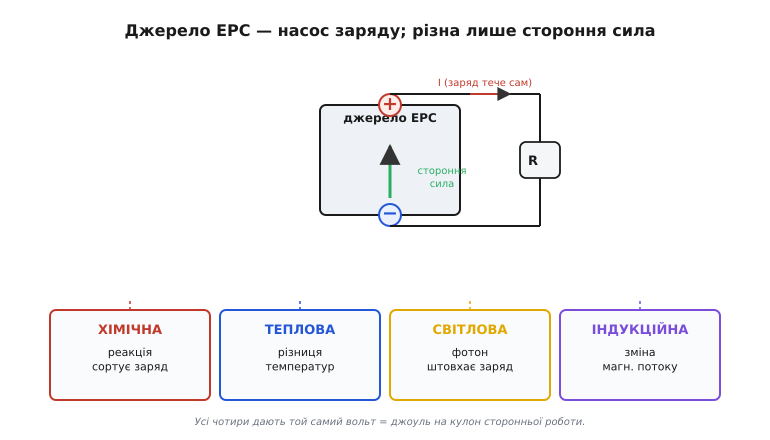
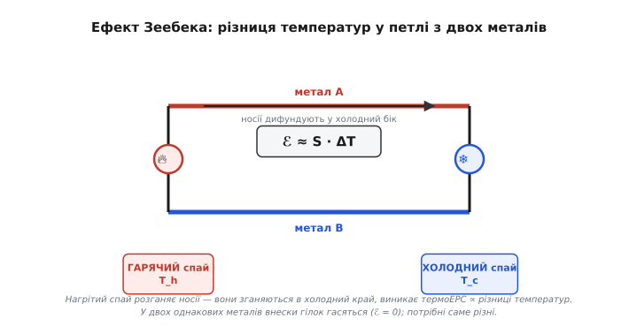
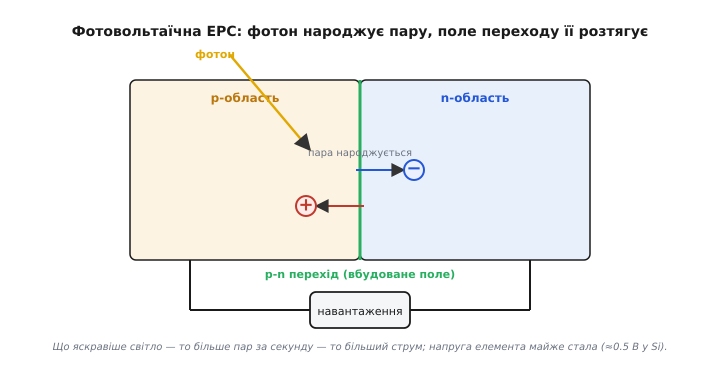
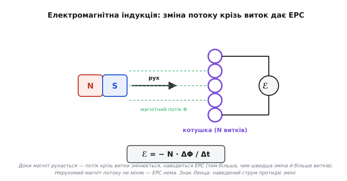

# Типи ЕРС: хімічна, теплова, світлова, індукційна

Коли ми зібрали [замкнене коло](topic:ph-electromagnetism/closed-circuit), у ньому конче мусив стояти **насос** — джерело, що жене заряд по петлі й тримає на затискачах [напругу](topic:ph-electromagnetism/voltage). Тоді ми назвали його одним словом — **джерело ЕРС** — і вважали чорною скринькою: «звідси береться напруга». Тепер відкриймо скриньку. Що **фізично** качає заряд усередині батарейки, сонячної панелі, термопари чи котушки генератора? Виявиться, що насосів буває чотири роди — хімічний, тепловий, світловий та індукційний, — але качають вони всі за **однією** ідеєю. Зрозуміти цю ідею важливіше, ніж завчити чотири пристрої: вона пояснює, чому батарейка «сідає», чому термопара показує температуру, чому сонячна панель дає струм і чому в розетці взагалі є напруга.

### Спершу — що таке ЕРС насправді

Назва збиває з пантелику. **ЕРС** розшифровують як «**е**лектро**р**ушійна **с**ила» (англ. *electromotive force*, лат. *movere* — «рухати»), і слово «сила» змушує думати, ніби це щось, що міряється в ньютонах. Це не так, і це найважливіше, що треба засвоїти. ЕРС — **не сила**. Це **робота, яку джерело виконує над кожним кулоном заряду**, проштовхуючи його крізь себе від «мінуса» до «плюса». Одиниця її — **вольт**, той самий, що в напруги: один вольт ЕРС означає, що джерело віддає один джоуль енергії кожному кулону, який крізь нього пройшов.

```
ℰ = A / q

ℰ — ЕРС (В = Дж/Кл)
A — робота сторонніх сил над зарядом усередині джерела (Дж)
q — пройдений заряд (Кл)
```

Чому ж тоді джерело взагалі мусить виконувати роботу — хіба заряд не сам тече? У зовнішньому колі — сам: там «плюс» притягує електрони, поле штовхає їх «під гірку», від високого потенціалу до низького. Але всередині джерела заряд має йти **проти** цього природного скочування — з «мінуса» назад на «плюс», угору на пагорб потенціалу. Електростатичне поле тут не помічник, а супротивник: воно тягне заряд назад. Тож усередині мусить діяти **інша**, **не електростатична** сила — її називають **сторонньою** (бо вона стороння для електростатики), і саме вона штовхає заряд угору. ЕРС — це міра роботи цієї сторонньої сили на кулон.

> 🔧 **Навіщо це.** Через те, що ЕРС — це енергія на заряд, а не «тиск», який нікуди не дівається, джерело не безмежне: воно віддає рівно стільки джоулів, скільки має запасу (хімія батареї, потік світла, потік тепла, механічна робота, що крутить генератор). Звідси «батарейка сідає» — запас сторонньої роботи скінчився. І звідси ж головне інженерне число джерела поряд із ЕРС — його [внутрішній опір](topic:hw-analog/internal-resistance): під навантаженням частина ЕРС марно гріє нутро джерела, тож на затискачах напруга **просідає** нижче за ЕРС. Це ми порахуємо нижче.

Тепер видно, у чому суть усіх чотирьох типів. Вони **всі** роблять одне — розділяють заряд сторонньою силою, створюючи ЕРС. Різняться лише тим, **звідки беруть силу**: з хімічної реакції, з різниці температур, зі світла чи зі зміни магнітного поля. Чотири двигуни — одна задача.


*Будь-яке джерело ЕРС — це насос, що жене заряд **проти** електростатичного поля всередині себе, від «−» до «+». Відрізняються лише сторонньою силою, яка крутить насос: хімічна реакція (батарея), різниця температур (термопара), світло (фотоелемент), зміна магнітного потоку (котушка). Назовні від «+» до «−» заряд тече вже сам, під дією поля, і дорогою віддає здобуту енергію навантаженню.*

### Хімічна ЕРС: реакція, що сортує заряд

Найзвичніший насос — **батарейка**. Стороння сила в ній — **хімічна**: реакція, у якій атоми віддають або хапають електрони, а двигун із цього робить електричну машину, рознісши «віддавачів» і «хапачів» по різних кінцях.

Розберімо на пальцях. Опустімо два **різні** метали в провідний розчин (**електроліт**, гр. *lytos* — «розкладений»). Метали неоднаково охоче розлучаються зі своїми електронами. Активніший (скажімо, цинк) залюбки віддає електрони: його атоми переходять у розчин іонами, а електрони лишаються в металі — пластинка заряджається **мінусом**. Менш активний (мідь чи вугільний стрижень у вугільно-цинковому елементі) робить навпаки — на ньому йде реакція, що електрони **забирає**, тож він стає **плюсом**. Маємо два затискачі з різним зарядом, тобто [напругу](topic:ph-electromagnetism/voltage), народжену не тертям і не полем, а **хімією**.

Поки коло розімкнене, процес майже одразу спиняється сам: на цинку зібрався мінус, він електрично відштовхує наступні електрони й не дає реакції тривати — встановлюється рівновага, і на затискачах стоїть повна ЕРС. Та щойно ми **замкнемо** коло, електрони з «мінуса» побіжать зовнішнім дротом до «плюса» (це й є струм у навантаженні), рівновагу зрушено — і реакція **відновлюється**, женучи нову порцію електронів. Усередині розчину коло замикають **іони**: це [іонна провідність](topic:ph-electromagnetism/ionic-conduction), несуть струм не електрони, а заряджені атоми, що дрейфують крізь електроліт. Доки є з чого «їсти» — активний метал не розчинився весь, реагент не вичерпався, — насос працює.

> 🔧 **Навіщо це.** Звідси одразу видно дві речі про реальні батарейки. По-перше, **ЕРС елемента задає хімія, а не розмір**: пальчикова й величезна банка тієї самої хімії дають однакові ≈1.5 В — більша просто має більший **запас** (місткість, А·год) і менший внутрішній опір. Хочеш більше вольтів — стався елементи **послідовно** (батарея з кількох). По-друге, «сіла» означає, що реагенти вичерпано: у незворотній (первинній) хімії це назавжди, у зворотній (акумуляторній) реакцію можна **погнати назад** зовнішнім струмом — це і є заряджання. Які саме хімії бувають і чим відрізняються, докладно розбираємо окремим кроком курсу.[^chem]

[^chem]: Конкретні системи — лужний цинк-марганець, свинцево-кислотний, літій-іонний — мають різні ЕРС на елемент (≈1.5 / ≈2 / ≈3.7 В), різний запас і різний внутрішній опір; зворотні (акумулятори) проти незворотних (батарейки). Це окремий крок курсу: [Хімії батарей](root:embedded/battery-chemistries).

**Приклад (чому напруга просідає під навантаженням).** Свіжий елемент має ЕРС ℰ = 1.5 В і [внутрішній опір](topic:hw-analog/internal-resistance) r = 0.5 Ом. Під'єднали навантаження R = 9.5 Ом. Яка напруга буде на затискачах і скільки ЕРС марно гріє сам елемент?

```
струм у колі:        I = ℰ / (R + r) = 1.5 / (9.5 + 0.5) = 0.15 А
напруга на затискачах: U = I · R = 0.15 × 9.5 = 1.425 В
просідання всередині:  ΔU = I · r = 0.15 × 0.5 = 0.075 В
```

Вийшло 1.425 В замість 1.5 В: 0.075 В «з'їв» внутрішній опір. Поки струм малий, різниця дрібна. Та коли елемент старіє, r росте до кількох ом — і той самий елемент під тим самим навантаженням уже видасть помітно менше. Ось чому розряджена батарейка показує майже 1.5 В **без** навантаження (мультиметр майже не бере струму), а під лампочкою провалюється: ЕРС нікуди не зникла, її просто всю з'їдає здоровезний внутрішній опір. Перевіряти батарейку треба **під навантаженням**, інакше дохлий елемент удає живого.

### Теплова ЕРС: різниця температур качає заряд

Другий насос дивовижніший: ЕРС народжує **просто різниця температур**. Спаяймо два **різні** метали в петлю, нагріймо один спай, а другий лишімо холодним — і в колі з'явиться напруга й потече струм. Це **термоелектрична ЕРС**, або **ефект Зеебека** (нім. *Seebeck-Effekt*).

Чому так? Тепло — це безладний рух носіїв заряду; на гарячому кінці [електрони](topic:ph-condensed/electron-drift) рухаються прудкіше й **дифундують** (лат. *diffundere* — «розтікатися») у холодний бік охочіше, ніж назад. Гарячий кінець ними збіднюється й заряджається «плюсом», холодний — збагачується й стає «мінусом». От і стороння сила: її роль грає **тепловий розгін носіїв**, що зганяє їх у холодний край. У кожного металу цей «потяг у холод» свій за силою (коефіцієнт Зеебека), тож у петлі з **двох різних** металів внески двох гілок не гасяться, а **складаються** в чисту ЕРС. Якби метали були однакові, обидві гілки тягли б рівно — і ЕРС вийшла б нуль; саме **різниця** матеріалів дає сигнал.


*Петля з двох різних металів, спаяна на двох кінцях. Нагрітий спай розганяє носії, вони дифундують у холодний бік — виникає термоЕРС, пропорційна **різниці** температур спаїв. У двох однакових металів внески гілок гасяться (ЕРС = 0); потрібні саме різні. Виміряну напругу перетворюють на температуру — це термопара.*

ЕРС тут крихітна — десятки мікровольтів на кожен градус різниці, — зате майже точно **пропорційна різниці температур** спаїв:

```
ℰ ≈ S · ΔT

ℰ  — термоЕРС (В)
S  — коефіцієнт Зеебека пари металів (В/°C), типово 10⁻⁵…10⁻⁴
ΔT — різниця температур гарячого й холодного спаїв (°C)
```

Саме на цьому стоїть **термопара** (англ. *thermocouple*) — найпоширеніший у техніці давач високих температур. Вона нічим не живиться: сам перепад тепла народжує напругу, а ми за нею читаємо температуру. Той самий ефект, узятий навпаки, працює в [елементі Пельтьє](topic:hw-components/peltier): пропустиш струм крізь пару матеріалів — і він **переноситиме тепло**, охолоджуючи один спай (це відкрив француз Жан Пельтьє 1834 року як обернення Зеебекового ефекту). А якщо взяти не два метали, а сильно леговані напівпровідники, де S у сотні разів більший, той самий принцип збирає помітну потужність зі звичайного тепла — **термоелектричний генератор**.

**Приклад (АЦП читає термопару).** Термопара типу K має чутливість приблизно S = 41 мкВ/°C. Гарячий спай у печі при 300 °C, холодний (на платі) при 25 °C. Яку напругу побачить мікроконтролер?

```
ΔT = 300 − 25 = 275 °C
ℰ  ≈ S · ΔT = 41×10⁻⁶ × 275 ≈ 0.0113 В = 11.3 мВ
```

Лише 11 мілівольтів на 275 градусів — ось чому термопару **не можна** заводити просто на вхід АЦП: сигнал треба підсилити в сотні разів, та ще й знати температуру холодного спаю (його, на жаль, не уникнути — він на самій платі), бо прилад міряє лише **різницю**:

:::tabs
```c
// Грубе відновлення температури гарячого спаю з напруги термопари типу K.
// v_tc — напруга термопари (В), t_cold — температура холодного спаю (°C),
// яку дає окремий давач на платі (компенсація холодного спаю).
const float S_K = 41e-6f;          // ≈ чутливість типу K, В/°C

float hot_junction_c(float v_tc, float t_cold) {
    float dT = v_tc / S_K;         // різниця температур зі співвідношення ℰ ≈ S·ΔT
    return t_cold + dT;            // абсолютна температура гарячого спаю
}
```
```py
# Грубе відновлення температури гарячого спаю з напруги термопари типу K.
# v_tc — напруга термопари (В), t_cold — температура холодного спаю (°C),
# яку дає окремий давач на платі (компенсація холодного спаю).
S_K = 41e-6                        # ≈ чутливість типу K, В/°C

def hot_junction_c(v_tc, t_cold):
    dT = v_tc / S_K                # різниця температур зі співвідношення ℰ ≈ S·ΔT
    return t_cold + dT             # абсолютна температура гарячого спаю
```
:::

> 🔧 **Навіщо це.** Дві риси термоЕРС визначають усю роботу з нею. Перша — вона **мізерна**, тож потрібен точний малошумний підсилювач, інакше [тепловий шум](root:embedded/noise-interference) і наводки потоплять корисні мікровольти. Друга, підступніша: давач реагує на **різницю** спаїв, тож кожне місце, де провід термопари переходить у звичайну мідь плати, саме стає паразитним спаєм зі своєю термоЕРС. Тому термопарні модулі завжди мають **компенсацію холодного спаю** — окремий давач температури біля затискачів, що віднімає внесок цього паразитного переходу. Забути про неї — типова причина показів, які «пливуть» від нагріву плати.

### Світлова ЕРС: фотон вибиває заряд

Третій насос живиться **світлом**. Це **фотоефект (фотовольтаїчна ЕРС)** — те, що дає струм із сонячної панелі. Стороння сила тут — **енергія фотона** (гр. *phōs* — «світло»), кванта світла, який, влетівши в речовину, віддає свою енергію носієві заряду.

Сам по собі вибитий світлом електрон ще не дає корисної напруги — він би просто погасав на місці. Щоб вийшла ЕРС, потрібен **внутрішній механізм, який розтягне народжені заряди в різні боки**. У сонячному елементі це **p-n перехід** — межа двох по-різному легованих половинок напівпровідника, на якій сам собою існує вбудоване електричне поле. Фотон народжує поблизу цієї межі пару «вільний електрон + дірка»; вбудоване поле переходу негайно **зносить** електрон в один бік, а дірку — в інший. Заряди розділено — на контактах з'явилася напруга, і доки світло сипле фотони, насос качає.


*Фотон віддає енергію в зоні p-n переходу й народжує пару «електрон + дірка». Вбудоване поле переходу розтягує їх у протилежні боки — електрон в один контакт, дірку в інший. Розділені заряди дають напругу; що яскравіше світло, то більше пар за секунду, то більший струм.*

Звідси випливає вся поведінка сонячної панелі. **Напруга одного елемента** залежить від матеріалу й світла слабко — у кремнієвого це близько 0.5–0.6 В, хоч у яскравий полудень, хоч у похмурий день. А от **струм** прямо залежить від яскравості: більше фотонів за секунду — більше народжених пар за секунду — більший струм. Тому панель у тіні дає майже ту саму напругу, але крихітний струм, тобто крихітну потужність. І тому елементи в панелі стосують **послідовно**: щоб з half-вольтових цеглинок скласти потрібні 12, 18 чи 24 В.

**Приклад (скільки дасть маленька панель).** Панелька з елементів сумарною напругою U = 6 В у яскравому світлі віддає струм I = 0.16 А. Яка її потужність і чи вистачить зарядити вузол, що споживає 0.5 Вт?

```
P = U · I = 6 × 0.16 = 0.96 Вт   ← у яскравому світлі
```

У повне сонце майже ват — вузла на 0.5 Вт вистачить із запасом. Та сховай панель у тінь, де фотонів удесятеро менше: струм упаде приблизно до 0.016 А, потужність — до ≈0.1 Вт, і вузол уже не потягне. Ось чому сонячні пристрої рахують **по найгіршому освітленню**, а не по сонячному пікові, і чому між панеллю та навантаженням майже завжди стоїть буфер — акумулятор чи [суперконденсатор](topic:hw-components/supercapacitor), що згладжує провали.

> 🔧 **Навіщо це.** Головне практичне число фотоелемента — не напруга (вона майже стала), а **струм за даного освітлення**, бо саме він задає потужність. Звідси дві засади дизайну. Потрібну напругу набирають **кількістю елементів послідовно**; потрібну потужність у слабкому світлі — **площею** (більше елементів — більше зібраних фотонів). І оскільки сонце примхливе, живлення «від світла» майже ніколи не годує навантаження напряму: панель заряджає буфер, а вже буфер живить пристрій рівним струмом.

### Індукційна ЕРС: змінне магнітне поле жене струм

Четвертий насос дає **найбільше** енергії з усіх — на ньому стоїть уся світова електроенергетика. Стороння сила тут — **зміна магнітного поля**. Підсунь магніт до котушки чи прибери його — і в котушці спалахне ЕРС; тримай нерухомо — і ЕРС зникне. Це **електромагнітна індукція** (лат. *inductio* — «наведення»), і ключове слово в ній — **зміна**.

Розберімо чому. [Магнітне поле](topic:ph-electromagnetism/magnetic-field) саме по собі заряд у нерухомому дроті не штовхає. Але коли поле крізь контур **змінюється** — магніт наближається, струм у сусідній котушці росте, виток обертається в полі, — народжується сторонній штовхач, що жене заряд по контуру. Сила цього штовхача залежить не від самого поля, а від **швидкості його зміни**: що різкіше міняється потік крізь виток, то більша ЕРС. Це і є суть [закону електромагнітної індукції](topic:ph-electromagnetism/electromagnetic-induction) (закон Фарадея):

```
ℰ = − N · ΔΦ / Δt

ℰ  — наведена ЕРС (В)
N  — кількість витків котушки
ΔΦ — зміна магнітного потоку крізь один виток (Вб)
Δt — час, за який сталася зміна (с)
знак «−» — наведений струм протидіє зміні (правило Ленца)
```

Звідси видно три важелі індукційної ЕРС, і всі три задіяні в реальних машинах: **більше витків N** (тому в котушках генераторів і трансформаторів їх тисячі), **сильніша зміна потоку ΔΦ** (потужні магніти, осердя з [феромагнетика](topic:ph-electromagnetism/electromagnetic-induction), що концентрує поле) і **швидша зміна Δt** (тому генератор треба крутити швидко). Знак «мінус» — це правило Ленца: наведений струм завжди тече так, щоб **протидіяти** тій зміні, що його породила; саме тому генератор чинить опір обертанню (інакше ми діставали б енергію з нічого), і саме цей опір ми долаємо, обертаючи вал.


*Доки магніт рухається відносно котушки, магнітний потік крізь витки змінюється — і наводиться ЕРС, тим більша, чим швидша зміна й чим більше витків. Нерухомий магніт потоку не міняє — ЕРС нема. Знак Ленца: наведений струм протидіє зміні (магніт відштовхується від котушки), тож обертання генератора доводиться долати, перетворюючи механічну роботу на електричну.*

Цей насос унікальний тим, що дає **змінну** ЕРС: крутиться виток у полі — потік крізь нього то росте, то спадає, і ЕРС гойдається синусоїдою. Так працює всякий генератор у розетці — від гідротурбіни до автомобільного. Той самий принцип, але між **двома** котушками без обертання, дає [трансформатор](topic:hw-components/transformer): змінний струм у першій котушці робить змінний потік, а той наводить ЕРС у другій — так напругу піднімають і знижують. Без індукції не було б ні електромереж, ні зарядних блоків, ні бездротового заряджання.

**Приклад (давач обертів на котушці).** Зубчасте сталеве колесо крутиться повз котушку (N = 200 витків); кожен зуб, проходячи, змінює потік крізь котушку на ΔΦ = 8×10⁻⁶ Вб за Δt = 0.5 мс. Який імпульс ЕРС наведеться?

```
ℰ = N · ΔΦ / Δt = 200 × 8×10⁻⁶ / 0.5×10⁻³
ℰ = 200 × 8×10⁻⁶ / 5×10⁻⁴ = 3.2 В
```

Понад три вольти на кожен зуб — цілком придатний імпульс, щоб мікроконтролер його полічив:

```c
// Лічильник зубів від індуктивного давача обертів.
// На кожен зуб котушка дає сплеск ЕРС; компаратор перетворює його на фронт,
// що смикає переривання. Лічимо фронти за вікно часу → оберти.
volatile uint32_t teeth = 0;          // лічильник зубів (росте в перериванні)

void tooth_isr(void) { teeth++; }     // викликається фронтом від компаратора

float rpm(uint32_t teeth_count, uint32_t teeth_per_rev, float window_s) {
    float revs = (float)teeth_count / teeth_per_rev;   // скільки обертів за вікно
    return revs / window_s * 60.0f;                    // → обертів за хвилину
}
```

Що швидше крутиться колесо, то менший Δt на зуб — і, за законом Фарадея, **то вищі імпульси**. Це водночас зручно (на високих обертах сигнал чистий) і підступно: на малих обертах ЕРС падає так, що давач «не бачить» обертання, поки вал не розженеться. Тому індуктивні давачі мають **нижню межу швидкості**, нижче за яку сигнал тоне в шумі, — і там, де треба «бачити» нерухомий вал, ставлять інший принцип (наприклад, [ефект Холла](topic:ph-electromagnetism/electromagnetic-induction), що реагує на саме поле, а не на його зміну).

### Одна ідея, чотири двигуни

Зведімо все докупи. Будь-яке джерело ЕРС — це **насос заряду**, що жене заряд проти електростатичного поля всередині себе, а ЕРС — міра роботи, яку він віддає кожному кулону (вольт = джоуль на кулон). Чотири типи відрізняються **лише** сторонньою силою, що крутить насос:

- **хімічна** — реакція сортує електрони між двома різними електродами (батарейка);
- **теплова** — різниця температур розганяє носії й зганяє їх у холодний бік (термопара, ефект Зеебека);
- **світлова** — фотон народжує пару зарядів, а поле переходу їх розтягує (сонячна панель);
- **індукційна** — зміна магнітного потоку наводить ЕРС у витку (генератор, трансформатор).

Глибша краса в тому, що це **той самий вольт**. Мікровольти термопари, пів-вольта фотоелемента, півтора вольта батарейки, сотні вольтів генератора — усі вони міряні однією міркою, бо всі означають одне: стільки джоулів стороння сила дала кожному кулону. Тому їх можна порівнювати, додавати послідовно, заряджати ними той самий акумулятор — енергія є енергія, хоч би звідки взялася стороння сила. А звідки конкретно її взяти в пристрої, диктує задача: треба автономне живлення на роки — хімія; виміряти жар печі без живлення — тепло; зібрати енергію просто неба — світло; узяти багато потужності з обертання чи перетворити напругу — індукція.

Як ці чотири двигуни взагалі відкрили — історія повчальна сама по собі: вона почалася зі сварки про **жаб'ячі лапки** й того, хто має рацію — біолог чи фізик.[^hist]

[^hist]: Чотири типи ЕРС відкривали понад сорок років, і за кожним — конкретні люди й суперечки: дует Гальвані—Вольта про «тваринну електрику», Зеебек, що сам не повірив у власний струм, дев'ятнадцятирічний Беккерель зі світлом і Фарадей з індукцією. Хто, коли й чому помилявся: [Від жаб'ячої лапки до генератора](root:embedded/emf-sources/hist-galvani-volta.md).
