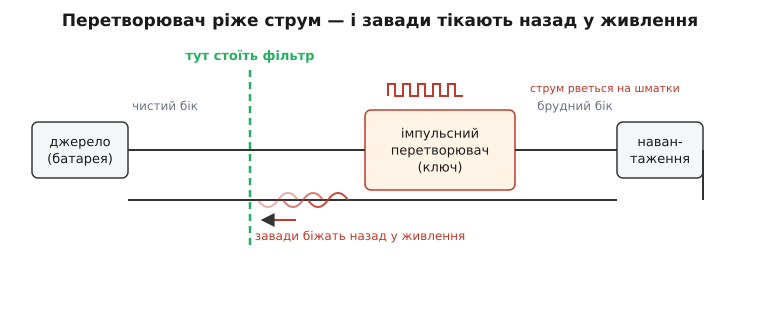
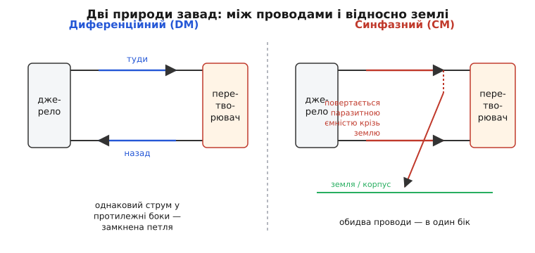
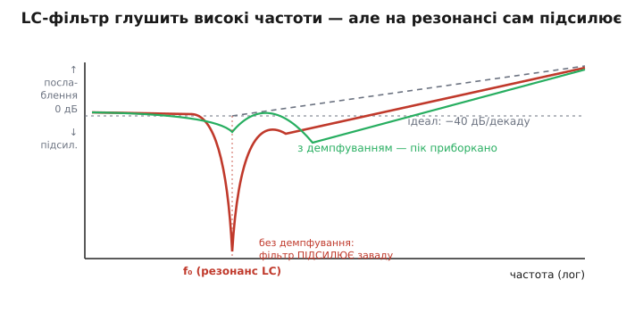
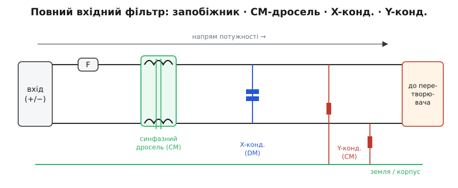

# Вхідний EMI-фільтр перетворювача

<preknowlist>
- [Лінійний vs імпульсний перетворювач](root:embedded/linear-vs-switching) — імпульсний ключ вмикає й вимикає коло сотні тисяч разів на секунду, тож бере з живлення не плавний, а рваний струм.
- [Котушка](book:electronics/inductor-coil) — чим вища частота, тим сильніше опирається струмові: для постійного майже дріт, для високочастотного шуму — серйозний опір.
- [Конденсатор](book:electronics/capacitor) — навпаки: постійний струм не пропускає зовсім, а високочастотний пропускає легко.
</preknowlist>

У попередньому кроці ми дійшли неприємного висновку: імпульсний перетворювач ефективний саме тому, що **ріже струм на шматки** — швидко вмикає й вимикає ключ. Але та сама різкість, що дає високий ККД, породжує **шум**. І шум цей не лишається всередині перетворювача: він тече назад, у дроти живлення, і розповзається по всій системі. Вхідний EMI-фільтр (англ. *electromagnetic interference* — електромагнітна завада) — це стіна, яку ставлять на вході перетворювача, щоб той шум не випустити назовні. Розберімо, звідки він береться, чому це справді проблема, і як ту стіну скласти з кількох конкретних деталей.

### Звідки беруться завади

Згадаймо, як працює перетворювач. Ключ (MOSFET) сотні тисяч разів на секунду замикає й розмикає коло. Коли він відкритий, з джерела тягнеться великий струм; коли закритий — струм із джерела майже зникає. Тобто струм, який перетворювач бере **з вхідних проводів**, — не плавний, а рваний: різкі імпульси з частотою перемикання, скажімо, 400 кГц.


*Ключ перетворювача замикає й розмикає коло сотні тисяч разів на секунду, тож струм із вхідних проводів іде не плавно, а різкими порціями. Кожен різкий фронт — це не одна частота, а ціла гребінка гармонік аж до сотень мегагерців. Ці завади біжать назад у дроти джерела й живлять усю систему «брудною» напругою. Фільтр ставлять прямо на вході перетворювача — як стіну між брудним боком і рештою плати.*

Чому рваний струм — це завада на багатьох частотах, а не просто «гудіння на 400 кГц»? Бо важить не частота повторення, а **крутість фронтів**. Ключ перемикається за одиниці-десятки наносекунд; а різка сходинка струму — це, з погляду частот, сума безлічі синусоїд, що тягнеться вгору до сотень мегагерців. Цю математику докладно розкриває [розклад сигналу на частоти](book:math/fourier-series); тут досить інтуїції: **чим різкіший фронт, тим вищі частоти він містить**. Тому імпульсний перетворювач шумить не на одній ноті, а цілим «віялом» гармонік — і саме високі з них найкраще випромінюються в ефір і найгірше глушаться.

> 🔧 **Навіщо це.** Коли бачиш у даташиті перетворювача частоту перемикання 400 кГц чи 2 МГц — це **не** найвища частота завад, а лише основний тон. Реальний спектр тягнеться в десятки разів вище через крутість фронтів. Тому фільтр проєктують не «під 400 кГц», а під увесь діапазон, де нормують завади, — від 150 кГц до 30 МГц.

### Чому це справді проблема

Можна подумати: ну шумить і шумить, кому яка різниця. Різниця є, і одразу з двох боків.

Перший — **свої ж чутливі вузли**. Та «брудна» напруга з вхідних проводів живить не лише перетворювач, а часто й сусідні кола: радіомодуль, аналоговий давач, [АЦП](book:electronics/adc-resolution). Завада, що пролізла в живлення приймача, підіймає поріг шуму й вкорочує дальність зв'язку; завада в опорі АЦП псує точність вимірів. На дроні, де поруч на одній платі і силовий перетворювач, і Wi-Fi, і барометр, це не теорія, а щоденний головний біль.

Другий бік — **закон**. Будь-який пристрій, що йде на продаж, мусить пройти випробування на електромагнітну сумісність (EMC). Один із ключових тестів — на **кондуктивні завади** (*conducted emissions*): скільки високочастотного «бруду» пристрій віддає назад у дроти живлення. За міжнародним стандартом CISPR (та гармонізованими з ним правилами FCC у США) цей тест проводять у смузі **від 150 кГц до 30 МГц**, вимірюючи напругу завад на спеціальному стабілізаторі імпедансу лінії (LISN). Якщо пристрій перевищує межі — він просто не отримає дозволу на продаж. *(Це усталений факт: смуга 150 кГц–30 МГц і метод із LISN прописані в CISPR і дзеркально у FCC Part 15.)* Вхідний фільтр — головний інструмент, яким ці межі тримають.

> 🔧 **Навіщо це.** EMC-сертифікація — часто остання й найдорожча перешкода перед випуском пристрою. Завалити її означає тижні переробок і повторні випробування за гроші. Інженери, які проєктують живлення з прицілом на фільтр **від початку**, проходять її з першого разу; ті, хто згадує про шум наприкінці, місяцями ліплять феритові кільця на готову плату.

### Дві природи завад: диференційна і синфазна

Перш ніж будувати фільтр, треба зрозуміти, що завада буває **двох видів** — і глушаться вони геть по-різному. Це поділ, без якого фільтр не спроєктувати.


*Диференційна завада (DM) — це струм, що йде туди одним проводом і назад другим: акуратна замкнена петля між плюсом і мінусом. Синфазна завада (CM) — підступніша: однаковий струм тече в **обох** проводах в один бік, а повертається до джерела манівцями — крізь землю, корпус, паразитні ємності між платою й «масою». Перший вид глушать одними деталями, другий — іншими, тож їх завжди розрізняють.*

**Диференційна завада** (*differential-mode*, DM) — найочевидніша. Це пульсація струму, що йде «туди» плюсовим проводом і «назад» мінусовим, точнісінько як корисний струм. Її породжує сам рваний вхідний струм перетворювача. Вона замкнена між двома проводами живлення, і боротися з нею просто: треба згладити різницю напруг між плюсом і мінусом.

**Синфазна завада** (*common-mode*, CM) — хитріша й зазвичай гірша на високих частотах. Тут завадний струм тече в **обох** проводах **в один бік** одночасно — і плюсовим, і мінусовим — а повертається до джерела не другим проводом, а **манівцем**: крізь землю, металевий корпус, паразитну ємність між гарячими вузлами плати й «масою». Звідки вона береться? Усередині перетворювача є вузли, що різко стрибають по напрузі (наприклад, точка перемикання — *switch node*). Через паразитну ємність цих вузлів на корпус кожен стрибок «впорскує» струм у землю — і той струм мусить кудись повернутися, розтікаючись по обох проводах живлення в один бік.

Чому цей поділ настільки важливий? Бо **фільтр, що чудово глушить DM, може бути цілком сліпий до CM**, і навпаки. Конденсатор між плюсом і мінусом закорочує диференційну заваду — але синфазній, що тече в обох проводах однаково, він байдужий (між його обкладками різниці немає). А деталь, що зупиняє синфазний струм, не заважає корисному диференційному струму текти. Тож грамотний вхідний фільтр завжди має **дві частини**: одну проти DM, другу проти CM.

> 🔧 **Навіщо це.** Коли фільтр «не працює», хоч деталі стоять, найчастіша причина — переплутані природи: поставили багато ємності проти DM, а реальна проблема була синфазна. Перше питання при налагодженні завад: **це DM чи CM?** Відповідь визначає, які саме деталі чіпати.

### LC-фільтр: стіна для високих частот

Як зробити стіну, прозору для постійного струму (корисної потужності) і непрозору для високочастотних завад? Поєднанням двох деталей, які ми вже знаємо, — **котушки й конденсатора**.

Ідея спирається на те, як ці деталі реагують на частоту. [Котушка](book:electronics/inductor-coil) тим сильніше опирається струму, чим вища частота: для постійного струму вона майже дріт, а для мегагерцового шуму — серйозний опір. [Конденсатор](book:electronics/capacitor) — навпаки: постійний струм не пропускає зовсім, а високочастотний пропускає легко. Постав котушку **послідовно** в провід, а конденсатор — **впоперек**, між проводами, і отримаєш фільтр: корисна потужність проходить майже без втрат, а завада натикається на високий опір котушки й «стікає» крізь конденсатор назад, не дійшовши до джерела.

Ось ключова формула — **частота зрізу** такого LC-фільтра, тобто межа, вище за яку він починає глушити:

```
f₀ = 1 / (2·π·√(L·C))

приклад: L = 10 мкГн, C = 4.7 мкФ
  √(L·C) = √(10·10⁻⁶ · 4.7·10⁻⁶) = √(4.7·10⁻¹¹) ≈ 6.86·10⁻⁶
  f₀ = 1 / (2·π·6.86·10⁻⁶) ≈ 23 200 Гц ≈ 23 кГц
```

Усе, що вище за f₀, фільтр давить; усе, що нижче, пропускає. Причому давить дедалі сильніше: ідеальний LC-фільтр другого порядку послаблює заваду на **40 децибел на декаду** — тобто кожне десятикратне зростання частоти зменшує заваду в сто разів. Тому f₀ беруть **значно нижчою** за частоту перемикання: при перемиканні 400 кГц і f₀ ≈ 23 кГц основна гармоніка лежить майже на півтори декади вище зрізу й буде придушена в сотні разів.

> 🔧 **Навіщо це.** Правило великого пальця: став f₀ хоча б у 10 разів нижче за частоту перемикання перетворювача. Тоді на робочій частоті фільтр уже впевнено в зоні −40 дБ/декаду й давить заваду з добрим запасом. Якщо ж f₀ заблизько до частоти перемикання — фільтр не встигає «набрати» послаблення, і шум проходить.

### Пастка резонансу: коли фільтр сам підсилює

Тут ховається підступ, через який наївно складений LC-фільтр може зробити **гірше**, ніж його відсутність. Котушка з конденсатором — це не лише фільтр, це ще й **резонансний контур**. А резонанс означає, що рівно на частоті f₀ фільтр не глушить, а **підсилює**.


*Вище за резонанс f₀ фільтр чесно глушить із нахилом −40 дБ/декаду. Але прямо на f₀ котушка й конденсатор входять у резонанс, і без втрат фільтр там не глушить, а **підсилює** заваду — гострий пік угору (на графіку — вниз, у бік підсилення). Якщо якась гармоніка перетворювача потрапить на цей пік, фільтр зробить її ще більшою. Демпфування (додатковий опір) приборкує пік, лишаючи спад майже незмінним.*

Чому так? На резонансі енергія перекидається між котушкою (магнітне поле) і конденсатором (електричне поле) туди-сюди, і амплітуда коливань може рости в рази. Цей механізм — той самий, що й у будь-якій [резонансній системі](book:physics/resonance): мала сила в такт розгойдує велику амплітуду. Якщо в системі мало втрат (а добрий фільтр навмисне роблять із малими втратами, щоб не гріти корисний струм), пік на резонансі виходить гострий і високий — підсилення вшестеро-вдесятеро цілком реальне.

Біда стається, коли на цей резонансний пік потрапляє якась гармоніка перетворювача або, ще гірше, коли через пік починає коливатися петля керування самого перетворювача — і тоді вся шина живлення дзвенить. Тому LC-фільтр майже ніколи не лишають «голим»: у нього додають **демпфування** (англ. *to damp* — гасити, заспокоювати). Найпростіше — додатковий резистор у парі з ще одним конденсатором, увімкнений так, щоб він з'їдав енергію саме на резонансній частоті, не псуючи ні корисного струму, ні крутого спаду на високих частотах. Демпфований фільтр трохи поступається ідеальному в гостроті зрізу, зате не вистрілює на резонансі — а це для стабільності важливіше.

> 🔧 **Навіщо це.** Якщо після встановлення вхідного фільтра шум на якійсь частоті **зріс** замість спасти — майже напевно це резонанс f₀, і фільтру бракує демпфування. Лікується це не більшою ємністю (вона лише посуне пік), а демпфувальною ланкою (резистор + конденсатор). Класичні граблі, на які наступає кожен, хто вперше ставить LC-фільтр.

### Деталі фільтра: що ставлять насправді

Тепер зберімо реальний вхідний фільтр із конкретних деталей. Він має дві частини — проти CM і проти DM — плюс захист і демпфування.


*Типовий порядок деталей від входу: запобіжник, синфазний дросель (дві обмотки на спільному осерді) проти синфазної завади, X-конденсатор упоперек проводів проти диференційної завади і пара Y-конденсаторів на землю — знову проти синфазної. Кожна деталь працює проти своєї природи шуму; разом вони дають стіну, прозору для потужності й непрозору для бруду.*

**Синфазний дросель** (*common-mode choke*) — серце CM-частини. Це дві обмотки на спільному феритовому осерді, намотані так, що **корисний** диференційний струм (туди-назад) створює в осерді протилежні магнітні потоки, які гасять одне одного, — для нього дросель майже невидимий. А **синфазний** струм (в обох обмотках в один бік) дає потоки, що складаються, — і натикається на велику індуктивність. Геніально просте рішення: одна деталь пропускає потужність і зупиняє синфазну заваду. Як саме намотка перетворює напрям струму на велику чи малу індуктивність, докладніше розбирає [синфазний дросель](book:electronics/common-mode-choke); тут головне — він ставиться проти CM і корисному струму не заважає.

**X-конденсатор** — DM-частина. Це конденсатор упоперек проводів, між плюсом і мінусом, прямо біля входу перетворювача. Він закорочує диференційну заваду назад, не пускаючи її до джерела. Часто його ставлять у парі з невеликою котушкою (або разом із розсіюванням синфазного дроселя) — і виходить той самий LC проти DM. Сюди ж додають демпфувальну ланку проти резонансу.

**Y-конденсатори** — ще одна лінія проти CM. Це пара конденсаторів від кожного проводу живлення **на землю** (корпус). Вони дають синфазному струму короткий шлях «стекти» на масу прямо тут, біля перетворювача, замість розповзатися по системі. Працюють у парі з синфазним дроселем: дросель не пускає CM-струм далі, а Y-конденсатори відводять те, що лишилось, на землю.

Зверни увагу на симетрію задуму: проти диференційної завади працюють деталі **між проводами** (X-конденсатор), проти синфазної — деталі, що бачать обидва проводи однаково (синфазний дросель) або ведуть **на землю** (Y-конденсатори). Це пряме відлуння двох природ шуму, які ми розрізнили раніше. А роль котушки на вході часто бере на себе скромна [феритова намистина](book:electronics/ferrite-bead) — вона дає високий опір саме на високих частотах і гасить найвищі гармоніки, які звичайна котушка вже пропускає через власні паразити.

> 🔧 **Навіщо це.** Дивлячись на чужу плату, входу перетворювача впізнаєш цю трійцю: товстеньке кільце з двома обмотками (синфазний дросель), конденсатор упоперек проводів (X) і пара дрібних конденсаторів на корпус (Y). Якщо чогось бракує — це підказка, де шукати джерело завад. А якщо плата шумить по землі — насамперед дивись на синфазний дросель і Y-конденсатори.

### Безпека: X і Y у мережі 220 В

Поки ми говорили про низьковольтний DC-вхід (батарея, 5 чи 12 В) — там конденсатори звичайні. Але та сама схема X/Y стоїть і на вході пристроїв від **мережі 220 В**, і там до конденсаторів додається сувора вимога **безпеки**, бо вони під'єднані прямо до небезпечної напруги.

Звідси й самі назви класів. **X-конденсатор** стоїть між фазою й нулем (*line-to-line*) — там, де його пробій викличе коротке замикання, але **не** вдарить людину струмом. Тому X-конденсатори роблять стійкими до імпульсів і допускають, що в разі відмови вони закоротяться (запобіжник тоді знеструмить пристрій). **Y-конденсатор** стоїть між проводом мережі і **землею/корпусом** (*line-to-ground*) — тобто між небезпечною напругою і тим, чого торкається людина. Його відмова в коротке замикання вивела б фазу прямо на корпус — смертельно. Тому Y-конденсатори зобов'язані відмовляти **тільки в обрив** і виготовляються за найжорсткішими нормами. *(Це усталений поділ: клас X — лінія-лінія, гасить диференційну заваду, допускається відмова в коротке; клас Y — лінія-земля, гасить синфазну, мусить відмовляти в обрив. Підкласи X1/X2 і Y1/Y2 різняться витримуваною імпульсною напругою.)*

Глибше — конкретні підкласи, норми на імпульсну напругу й чому їх не можна заміняти звичайними конденсаторами — розбирає окрема вставка про [запобіжні конденсатори класів X і Y](root:embedded/emi-filter-design/comp-x-y-safety-caps.md): там і таблиця підкласів, і типові партномери-приклади, і пастки добору для мережевого живлення.

> 🔧 **Навіщо це.** На вході будь-якого пристрою від розетки ці конденсатори — питання не лише завад, а й життя. Ставити туди звичайний керамічний конденсатор замість сертифікованого Y — груба й небезпечна помилка: він може відмовити в коротке й вивести 220 В на корпус. У ремонті й розробці мережевих пристроїв клас конденсатора на вході перевіряють завжди.

### Скільки фільтра треба: оцінка на пальцях

Останнє питання — як прикинути параметри фільтра, не йдучи одразу в лабораторію. Точно це роблять вимірюванням, але початкову оцінку дає проста логіка: **на скільки треба придушити заваду й на якій частоті**.

Припустімо, перетворювач на 400 кГц дає на вході диференційну заваду на 20 дБ вищу за межу стандарту на основній гармоніці. Тобто фільтру треба прибрати щонайменше 20 дБ запасу на 400 кГц (а на практиці беруть із додатковим запасом 6–10 дБ — на розкид деталей і неточність моделі). LC-фільтр другого порядку дає 40 дБ/декаду; порахуймо, де поставити f₀:

**Приклад (вибір f₀ під потрібне послаблення).** Треба 26 дБ послаблення (20 дБ перевищення + 6 дБ запасу) на 400 кГц, фільтр −40 дБ/декаду:

```
кожна декада нижче робочої частоти дає 40 дБ
потрібно 26 дБ → 26 / 40 = 0.65 декади

f₀ = 400 кГц / 10^0.65 = 400 кГц / 4.47 ≈ 89 кГц

беремо з округленням униз: f₀ ≈ 50 кГц (більший запас)
тоді при C = 4.7 мкФ:
  L = 1 / ( (2·π·f₀)² · C )
  L = 1 / ( (2·π·50000)² · 4.7·10⁻⁶ ) ≈ 2.2·10⁻⁶ Гн = 2.2 мкГн
```

Маємо стартову точку: котушка близько 2.2 мкГн і конденсатор 4.7 мкФ дають зріз близько 50 кГц і потрібне послаблення на 400 кГц із запасом. Це **не** остаточні номінали — реальний шум доводять вимірюванням і підкручуванням, — але вони задають масштаб: одиниці мікрогенрі, одиниці мікрофарад, а не випадкові «що було в шухляді».

З боку прошивки теж є важіль. Багато сучасних перетворювачів уміють **розмазувати спектр** (*spread spectrum*): замість фіксованих 400 кГц вони злегка «гуляють» частотою перемикання туди-сюди. Енергія завади тоді не стоїть гострим піком на одній частоті, а розмазується в смугу — і кожна окрема гармоніка стає нижчою, що допомагає пройти EMC. Часто це вмикається одним бітом у регістрі перетворювача:

**Приклад (увімкнення spread spectrum у регістрі перетворювача).**

```c
// Увімкнути модуляцію частоти перемикання (spread spectrum)
// заради нижчих піків кондуктивних завад. Біт і адреса — умовні,
// конкретні значення бери з даташита свого перетворювача.
#define PMIC_REG_CONFIG2   0x12
#define SPREAD_SPECTRUM_EN (1u << 3)

uint8_t cfg = pmic_read(PMIC_REG_CONFIG2);
cfg |= SPREAD_SPECTRUM_EN;          // дозволити «гуляння» частоти
pmic_write(PMIC_REG_CONFIG2, cfg);
```

Це не заміняє фільтр, а полегшує йому роботу: розмазаний пік легше дотиснути меншою котушкою й конденсатором. Тонкощі — точний розрахунок демпфувальної ланки, роздільна оцінка CM проти DM і читання реального спектру з вимірювань — це вже наступний шар глибини, до якого варто братися з осцилографом і аналізатором спектра в руках; стартову ж точку, як ми бачили, дає проста оцінка з потрібного послаблення й нахилу −40 дБ/декаду.

> 🔧 **Навіщо це.** Оцінка на пальцях рятує від двох крайнощів: поставити фільтр «навмання» (і завалити EMC) або перестрахуватися величезними котушками (зайва вага, ціна, втрати). Прикинувши потрібне послаблення й f₀ заздалегідь, ти приходиш у лабораторію з фільтром, який майже напевно вже близький до потрібного, — і доводиш його дрібними правками, а не переробляєш з нуля.
