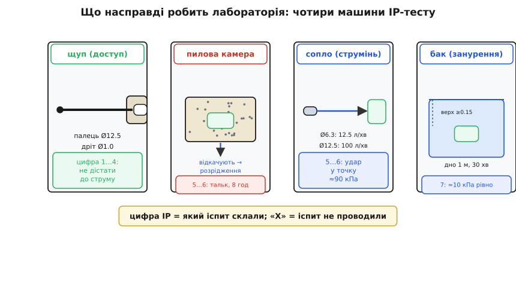
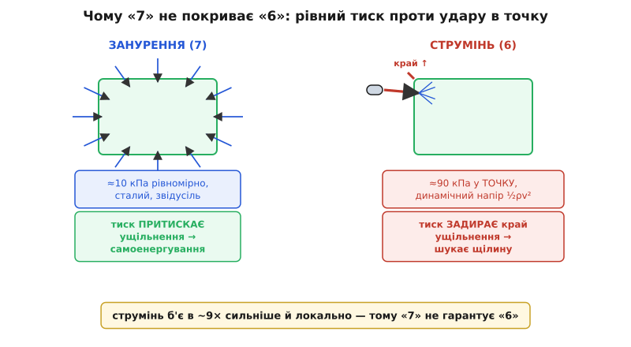

# Корпус, IP-захист, роз'єми: глибший шар

<preknowlist>
- [Закон ідеального газу](topic:physics/ideal-gas-law) — за сталого об'єму тиск замкненого газу прямо пропорційний абсолютній температурі; основа «дихання» корпусу.
- [Поверхневий натяг](topic:physics/surface-tension) — поверхня рідини поводиться як напнута плівка; без цього не зрозуміти, чому мембрана й ущільнення тримають воду.
- [Втома матеріалу](topic:physics/material-fatigue) — знакозмінне навантаження руйнує метал і гуму за багато циклів там, де один цикл нешкідливий; механізм смерті і прокладки, і ніжки конденсатора.
</preknowlist>

У базовому кроці ми поставили каркас: стіна виробу несе [три різні роботи](root:embedded/enclosure-ip-rating) — не пустити воду й пил, витримати удар і вібрацію, чесно пропустити живлення й повітря, — і кожна з них окрема фізика. Ми прочитали IP-код як два незалежні числа, побачили головну контрінтуїцію («щільніше не завжди сухіше»: запаяний ящик сам качає в себе вологу), і засвоїли правило найслабшого проходу. Цього досить, щоб не зробити грубої помилки при виборі корпусу.

Але між «не зробити грубої помилки» і «розуміти, що саме ти купуєш і чому воно поводиться так» лежить цілий шар, який базова версія свідомо стиснула. Що насправді робить лабораторія, коли пише в паспорт «IP67», — які сопла, яка вода, який тиск, скільки хвилин? Чому струмінь злий до ущільнення, а нерухомий стовп води — ні; можна це порахувати, а не просто сказати «різна фізика»? Як влаштована та гумова прокладка, яку в базовій версії ми згадали одним словом, — чому її стискають рівно на стільки, а не більше, і чому під тиском вона тримає ліпше, а не гірше? Що таке точка роси й чому IP-клас, який ми так хотіли підняти, у пастці термоциклу обертається проти нас, замикаючи воду всередині? І звідки взагалі беруться цифри IK, чому там енергія, а не сила, і що з вібрацією, яка вбиває не корпус, а ніжку конденсатора?

Розберімо все це до першопричини. Нитку поведемо тим самим порядком трьох робіт, але тепер щоразу спускаючись на шар глибше — від «що написано в паспорті» до «яка фізика за цим написом і як вона диктує твоє інженерне рішення».

## Перша робота, шар другий: що насправді робить лабораторія

Базово ми сказали: перша цифра IP — тверде (0…6), друга — вода (0…9), і кожне число відповідає на питання «який тест пройшов пристрій». Тепер відкриймо самі тести. Бо поки ти не бачив апаратури, число в паспорті лишається абстракцією; а коли побачив — воно стає точним твердженням про конкретне поле, і ти вже не сплутаєш «переживе дощ» із «переживе мийку».

### Перша цифра: від пальця до порошку в камері

Нижня половина шкали твердого — це насправді **захист людини від електрики**, а не електроніки від бруду, і саме тому тест тут — не пил, а **калібрований щуп**, яким пробують дотягтися до небезпечних частин усередині. IEC 60529 задає чотири щупи, і кожна сходинка першої цифри — це «такий предмет усередину не проходить»:

```
Перша    Що не проходить          Тест-щуп (діаметр)
цифра
──────────────────────────────────────────────────────
  1      тильний бік долоні       куля Ø 50 мм
  2      палець                   щуп Ø 12.5 мм, довжина 80 мм
  3      інструмент, товстий дріт  стрижень Ø 2.5 мм
  4      тонкий дріт              дріт Ø 1.0 мм
  5      пил (частково)          ─ уже не щуп, а пилова камера
  6      пил (повністю)          ─ пилова камера
```

Щуп «палець» (Ø 12.5 мм) — це не випадкове число: то модель людського пальця, і сходинка IP2X буквально означає «дитина не встромить палець у вентиляційну щілину до струмоведучої частини». Для нашого польового виробу ці нижні сходинки не мета — ми й так усе запаковуємо, — але важливо розуміти, **звідки взялася шкала**: перша цифра народилася із захисту людей, а «пилозахист» — це вже її верхні дві сходинки, доточені пізніше. Тому в паспортах трапляється дивне на позір поєднання: **IP2X** для приладу, який нічого не тримає проти пилу, зате гарантує, що пальцем до фази не дістати.

А ось верхні дві сходинки — 5 і 6 — це вже випробування електроніки, і тут замість щупа працює **пилова камера**. Виріб ставлять у герметичну камеру, де вентилятор ганяє дрібний **тальк** (просіяний так, що майже всі частинки дрібніші за 75 мкм), і тримають там **щонайменше 8 годин**. Ключова тонкість, яку базова версія проминула: для більшості виробів камеру не просто наповнюють пилом, а **відкачують із корпусу повітря**, створюючи всередині розрідження. Логіка сувора й повчальна: прилад у полі сам створює розрідження — згадай нашу «помпу дихання», яка щоночі втягує повітря знадвору. Отже, і в камері пил підсмоктують досередини штучним розрідженням, імітуючи найгірший випадок. Різниця між 5 і 6 — у результаті: для **5** дозволено, щоб трохи пилу зайшло, аби це не завадило роботі й безпеці; для **6** — жодної порошинки після 8 годин відкачування. Ось чому «пилонепроникний» (6) — це так дорого: це герметичність, доведена **під активним підсмоктуванням**, а не просто «пил не сипеться крізь щілини сам собою».

> 🔧 **Навіщо це.** Тепер видно, чому для виробу з власним «диханням» (а це будь-який негерметичний корпус із вентиляцією або з мембраною) розрізнення 5/6 — не формальність. Якщо твій прилад качає повітря крізь щілини (перепад тиску від нагріву), він качає й пил — рівно як камера з відкачуванням. Тоді IP5X у полі поводитиметься гірше за паспортний, бо реальне розрідження від термоциклу може перевищити тестове. Висновок практичний: для запиленого поля (ровер, сільгосптехніка) бери **6**, а не 5, і став **мембрану** (яка не пускає пил зовсім), а не голу вентиляцію — інакше «пилозахищений на папері» набере пилу через власну помпу.

### Друга цифра: чотири різні машини для чотирьох різних вод

Друга цифра — вода, і базово ми перелічили сходинки словами (краплі, бризки, струмінь, занурення). Тепер — конкретні числа апаратури, бо саме вони роблять цифри незвідними одна до одної. За шкалою води стоять **чотири принципово різні машини**, і перехід між ними — не «більше того самого», а зміна самого способу подавати воду:

```
Друга   Машина                         Ключові параметри (IEC 60529)
цифра
──────────────────────────────────────────────────────────────────────
 1–2    крапельниця згори              вертикальні краплі, ±15°
 3      осцилювальна трубка / душ      бризки в секторі до 60° від вертикалі
 4      той самий душ                  бризки з усіх боків (сектор до 180°)
 5      сопло Ø 6.3 мм                 12.5 л/хв, з 2.5…3 м, ≥3 хв
 6      сопло Ø 12.5 мм                100 л/хв (!), з 2.5…3 м, ≥3 хв
 7      бак: занурення                 глибина 1 м до дна, верх ≥0.15 м; 30 хв
 8      бак: занурення                 глибина й час — ОГОЛОШУЄ виробник
 9(K)   гаряче сопло під тиском        80…100 бар, 80 °C, 14…16 л/хв, 10…15 см
```

Придивися до стрибка потоку між 5 і 6: із **12.5 л/хв** на **100 л/хв** — увосьмеро. Це вже не «трохи сильніший струмінь», а зовсім інший режим удару. І геометрія занурення (7) теж точна, з двома різними числами: **дно** виробу на глибині 1 метр, а **верх** — щонайменше на 15 см під поверхнею. Навіщо два числа? Бо тиск води залежить від глибини, і стандарт фіксує обидві межі: маленький виріб занурюють так, щоб його верхня грань була хоч трохи під водою (15 см), а великий — так, щоб дно не глибше метра. Це прямо каже, який гідростатичний тиск діє на ущільнення (про це — за мить, коли рахуватимемо).

Найзліша машина — **IP69K** (літера K — від німецького стандарту DIN 40050-9, звідки цей рівень прийшов; згодом його ввели і в IEC 60529 як IPX9). Тут вода вже не просто ллється, а **б'є гарячим струменем під шаленим тиском**: 80–100 бар (це тиск, як під вісьмома-десятьма метрами… ні, набагато більше — 80 бар це вісімсот метрів водяного стовпа за тиском, тобто удар, а не занурення), температура **80 °C**, з дуже близької відстані **10–15 см**, під чотирма кутами (0°, 30°, 60°, 90°) по 30 секунд кожен, поки виріб повільно обертається. Це імітація **промислової мийки** — так миють харчове обладнання й вантажівки. Гаряча вода тут не для жорстокості: гаряча краще змочує (нижчий поверхневий натяг), тож глибше лізе в щілини й активніше атакує ущільнення. Для нашого коптера чи ровера IP69K — надмір, але знати про нього варто, бо це верхня межа того, що взагалі означає «водозахист».


*За кожною цифрою IP стоїть конкретна машина, і між ними — не «більше того самого», а зміна способу подавати навантаження. Щуп (перша цифра 1…4) перевіряє, чи не дістанеш пальцем чи дротом до струму. Пилова камера (5…6) ганяє тальк і **відкачує повітря з корпусу**, імітуючи власне розрідження виробу, — тому «пилонепроникний» доводять під активним підсмоктуванням. Сопло (5…6 води) б'є струменем у точку; бак (7…8) кладе виріб під рівний стовп води. А літера «X» на місці цифри означає не «нуль захисту», а «цей іспит не проводили».*

### «X», додаткові й додаткові-додаткові літери: як читати неповний код

Тут — три деталі читання коду, яких базова версія не торкнулась, а вони рятують від хибного розуміння паспорта.

Перша: **«X» — це не нуль, а «не випробувано».** Коли пишуть **IPX7**, це не означає «нуль захисту від пилу» — це означає «пил окремо не перевіряли, дивись лише воду». Так роблять, коли по воді клас важливий, а по пилу виробник просто не проводив тесту. Тому **IP5X** (перевірили пил, воду — ні) і **IPX5** (перевірили воду, пил — ні) — різні твердження, і сплутати їх — груба помилка. Літера X на місці цифри завжди означає «тут інформації немає», а не «тут захисту немає».

Друга: **додаткові літери A/B/C/D** — коли захист людини вищий, ніж каже перша цифра. Уяви корпус із великими вентиляційними щілинами: пил крізь них лізе (перша цифра низька), але вони так хитро зроблені, що палець до фази не дістає. Тоді пишуть, скажімо, **IP2XB** абощо — цифра каже про пил, а літера B окремо гарантує «палець захищений». Ці літери (A — тил долоні, B — палець, C — інструмент, D — дріт) додають лише коли треба **окремо** підкреслити безпеку доступу.

Третя: **додаткові літери H/M/S/W** — умови випробування. **W** («weather») — «пристосований до погоди з додатковим захистом»; **S** і **M** — чи рухалися рухомі частини під час тесту (S — стояли, M — рухалися), бо для мотора з валом і вентилятора це принципово: обертовий вал герметизувати важче, ніж нерухомий. Для нашого виробу ці літери рідкість, але побачивши їх у паспорті мотора чи вентилятора, ти вже знаєш, що вони кажуть.

> 🔧 **Навіщо це.** Читання коду — це читання **того, що перевірили, і мовчання про решту**. IPX8 у наручного годинника й IP68 у промислового давача — різні світи не лише через дужки-глибину, а й через ту «X»: годинник по пилу могли просто не тестувати. Коли обираєш компонент під поле, привчи себе питати не «яка цифра більша», а «яку саме машину до нього підносили»: щуп, камеру, душ, сопло, бак чи гарячу мийку — і чи це та машина, що відповідає **твоєму** полю. IP-код — це протокол складених іспитів, і кожна літера в ньому або називає іспит, або чесно зізнається, що його не складали.

## Чому 7 не ⊇ 6: тиск занурення проти удару струменя, у числах

Базово ми сказали: рівні 7–8 (занурення) не гарантують 5–6 (струмінь), бо «занурення — рівномірний тиск звідусіль, а струмінь — концентрований удар». Це правда, але це якісне пояснення, і проникливий читач має право спитати: **наскільки** концентрований? Чому вода, що спокійно тримається стовпом, раптом продавлює ущільнення, коли її пустити струменем? Виведімо обидва тиски й порівняймо — бо число тут переконує так, як слова не можуть.

### Тиск занурення: гідростатика, повільний і всебічний

Коли виріб під водою, на ущільнення тисне **гідростатичний тиск** — вага стовпа води над ним. Це той самий закон, за яким глибше в морі тисне сильніше:

```
P_гідро = ρ · g · h

  ρ = 1000 кг/м³      (густина води)
  g = 9.81 м/с²       (прискорення вільного падіння)
  h — глибина занурення точки, м
```

Для стандартного тесту IPX7 (дно на 1 м):

```
P_гідро = 1000 · 9.81 · 1.0 = 9810 Па ≈ 9.8 кПа ≈ 0.1 атм
```

Менш ніж десята частина атмосфери. Навіть глибоке занурення IPX8 на 8 метрів дає лише ≈78 кПа. І — ключове — цей тиск **однаковий з усіх боків** (гідростатика тисне ізотропно) і **сталий у часі**: він не б'є, він лежить. Ущільнення, притиснуте по всьому периметру рівномірним тиском, тримає його легко — більше того, як побачимо далі, гумова прокладка від рівномірного тиску притискається **щільніше**, тобто занурення їй навіть на руку.

### Тиск струменя: динамічний напір, швидкий і в точку

Струмінь — зовсім інша фізика. Тут вода не лежить, а **летить** і б'є в поверхню, віддаючи їй свій рух. У точці удару (**точці гальмування**, англ. *stagnation point*) весь рух струменя перетворюється на тиск. Величина цього тиску — **динамічний напір**, і виводиться він із закону Бернуллі: коли струмінь швидкості *v* повністю гальмується об стінку, його кінетична енергія переходить у надлишковий тиск

```
P_дин = ½ · ρ · v²
```

Уся сіль — у **квадраті швидкості**. Порахуймо швидкість струменя для тесту IPX6. Сопло Ø 12.5 мм дає 100 л/хв — знайдімо, з якою швидкістю вода вилітає:

```
потік:      Q = 100 л/хв = 100 · 10⁻³ / 60 м³/с = 1.667 · 10⁻³ м³/с
переріз:    A = π · (d/2)² = π · (0.0125/2)² = π · (0.00625)² ≈ 1.227 · 10⁻⁴ м²
швидкість:  v = Q / A = 1.667·10⁻³ / 1.227·10⁻⁴ ≈ 13.6 м/с
```

Тринадцять із половиною метрів за секунду — це майже 49 км/год, добрий струмінь. Тепер динамічний напір у точці удару:

```
P_дин = ½ · 1000 · (13.6)² = ½ · 1000 · 185 ≈ 92 500 Па ≈ 92 кПа
```

**Дев'яносто два кілопаскалі** — майже ціла атмосфера! Порівняй два числа, які я зараз поставлю поруч, бо в цьому й уся розгадка:

```
Занурення IPX7 (1 м):    ≈ 9.8 кПа   — рівномірно, звідусіль, сталий
Струмінь  IPX6 (сопло):  ≈ 92 кПа    — у точку, локально, з ударом
```

Струмінь б'є в **дев'ять-десять разів сильніше** за занурення на метр — і не всебічно, а **концентровано в пляму** діаметром із сопло. Ось кількісна причина, чому «сімка» не покриває «шістку»: ущільнення, спроєктоване тримати рівномірні 10 кПа занурення, може **не витримати** локальних 90 кПа удару, який до того ж намагається **відігнути край** кришки чи прокладки, а не притиснути її. Занурення притискає ущільнення до посадки; струмінь навпаки — шукає щілину й **задирає** край, продавлюючи воду під прокладку саме там, де тиск локально перевищив притиск.


*Дві різні фізики однієї «води». Занурення (ліворуч) тисне рівно, звідусіль і сталим тиском ≈10 кПа — і цей тиск **притискає** ущільнення до посадки (самоенергування), тому нерухомий стовп води правильна прокладка тримає легко. Струмінь (праворуч) б'є **в точку** динамічним напором ≈90 кПа — уп'ятеро-вдесятеро сильніше за занурення — і не притискає, а **задирає** край ущільнення, шукаючи щілину. Ось чому висока «сімка» (занурення) не гарантує «шістку» (струмінь): це різні навантаження на ущільнення, а не два рівні одного.*

> 🔧 **Навіщо це.** Ця пара чисел — не академічна цікавинка, а прямий інструмент проєктування. Якщо твій виріб миють зі шланга (ферма, гараж, кухня), рахуй на **динамічний напір струменя** (десятки кПа локально), а не на глибину занурення. Практичний наслідок: проти струменя рятує не «глибше занурення в паспорті», а **правильно затиснутий край** — прокладка в закритій канавці (щоб струмінь не мав куди задерти її край), лабіринтові стики (вода тратить напір на поворотах), козирки над щілинами. І навпаки: якщо виріб лише занурюють (датчик рівня, підводний вузол), тобі байдужа «шістка» — тобі потрібні «сімка/вісімка» і рівномірне обтиснення по колу. Дві різні загрози — два різні рішення, і числа кажуть, куди вкладати зусилля.

## Сама стіна тримає воду: механіка ущільнення як машини

Досі і базова версія, і вставки говорили про ущільнення як про даність: «поклади гумову прокладку, стягни гвинтами». Але прокладка — це не пасивна гумка, а **пружна машина зі своєю логікою**, і саме тонкощі цієї логіки вирішують, тримає корпус чи тече. Розберімо її, бо без цього «зробити водонепроникний корпус» лишається замовлянням.

### Ущільнення тримає не тому, що «щільно», а тому, що стиснуте

Головна ідея, від якої все залежить: гумове ущільнення герметизує не тим, що заповнює щілину, а тим, що воно **стиснуте й тисне назад**. Гума майже нестислива за об'ємом (як вода — її не можна ущільнити в менший об'єм), зате легко **міняє форму**. Коли ти затискаєш круглий джгут (**O-подібне кільце**, англ. *O-ring*) між двома поверхнями, він розплющується, намагається розтектися вбік — і, впершись у стінки канавки, тисне на всі поверхні контакту. Ось цей **контактний тиск** гуми на метал і є ущільненням: поки гума тисне на посадку сильніше, ніж вода намагається пролізти, води немає ходу.

Скільки саме стискати? Тут є точне інженерне вікно, і воно не «якнайбільше». Стиснення (англ. *squeeze*) — це на скільки відсотків зменшили товщину джгута:

```
squeeze = (d − h) / d · 100%

  d — товщина (переріз) кільця у вільному стані
  h — глибина канавки (проміжок, у який його затиснули)
```

Для нерухомого ущільнення (а корпус — саме такий випадок, половинки не ковзають) стандартне вікно — **15…30%**, найчастіше цілять у **20…25%**. Чому саме так, а не «стисни на 50% для надійності»?

- **Замало (< 15%)** — гума не встигає вибрати всі мікронерівності поверхні, контактний тиск малий, і в найглибшій подряпині лишається капілярний хід для води. Течія.
- **Забагато (> 30%)** — гумі **нема куди розтектися**. Вона нестислива за об'ємом; якщо канавку заповнити гумою під зав'язку й ще й розплющити, тиск усередині гуми злітає, її **видавлює** в зазор між поверхнями (це зветься екструзією), вона рветься по краю, дубіє від перенапруження й швидше набирає залишкову деформацію. Ущільнення, перетягнуте до 40%, живе менше за правильно затиснуте до 20%.

Тому канавку рахують не лише по глибині, а й по **заповненню об'ємом**: гума має заповнювати канавку приблизно на **60…85%**, лишаючи 15…40% порожнечі, **куди їй розтектися** при стисненні. Це найменш очевидна річ для новачка: у канавці ущільнення **навмисно лишають вільне місце**, інакше нестислива гума сама себе розірве. «Щільніше» і тут, як і в темі дихання, обертається гіршим.

### Дві геометрії затиску: торцевий і радіальний

Затиснути ущільнення можна двома принципово різними способами, і для корпусу вибір між ними — це вибір, **як половинки сходяться**.

**Торцевий (осьовий) затиск** (*face seal*): кільце лежить у канавці на пласкій поверхні, а друга половинка притискає його **згори**, як кришка каструлі притискає гумку. Стиснення — вздовж осі закриття. Це найпростіший і найнадійніший варіант для корпусу з кришкою: закрутив гвинти по периметру — і кришка рівномірно тисне на кільце. Головна вимога — **жорстка кришка й досить гвинтів**, щоб між гвинтами кришка не вигнулася й не відпустила ущільнення (згадай силу від перепаду тиску з нашого розрахунку — десятки-сотні ньютонів норовлять відігнути кут).

**Радіальний затиск** (*radial seal*): кільце обтискається **збоку**, між двома циліндричними поверхнями (внутрішня деталь входить у зовнішню, як поршень у циліндр). Стиснення — впоперек осі. Так ущільнюють круглі роз'єми й різьбові кришки, що вкручуються: кільце обтискає стик по колу, коли одна деталь заходить в іншу. Радіальний затиск зручний тим, що зусилля закриття (вкручування) саме собою тисне на кільце, але вимагає точних діаметрів — завеликий зазор кільце не перекриє.

Обидві геометрії підкоряються тому самому вікну стиснення 15…30% і тій самій вимозі лишити місце для розтікання. Різниця лише в напрямку, з якого приходить притиск.


*Ущільнення як пружна машина. Ліворуч і посередині — дві геометрії затиску: торцевий (притиск згори, вздовж осі закриття) і радіальний (обтиск збоку, впоперек). В обох випадках гума розплющується, впирається в канавку й тисне на посадку — цей контактний тиск і є герметичністю. Праворуч — чому занурення ущільненню на руку: тиск води заганяє кільце в дальній від себе кут канавки й притискає його до посадкової поверхні, додаючи власний тиск до контактного. Що глибше занурення, то щільніше кільце самозатискається — це самоенергування.*

### Чому занурення допомагає ущільненню: самоенергування

Тепер найкрасивіша деталь, яка замикає попередній розділ. Ми казали: занурення притискає ущільнення, а струмінь задирає. Ось механізм. Правильно посаджене O-кільце під тиском води веде себе як **самоенергований** ущільнювач: тиск води заходить у канавку з одного боку й **штовхає кільце** в протилежний кут, притискаючи його до посадкової поверхні. Тиск води не просто «намагається пролізти» — він **сам додається до контактного тиску** кільця на посадку. Формально контактний тиск виходить приблизно «стиснення + прикладений тиск води»: чим сильніше тисне вода, тим щільніше кільце тисне на посаду.

Ось чому нерухоме занурення на десятки метрів O-кільце тримає легко, тоді як голий пласкій стик потік би: рівномірний тиск занурення **самоенергує** кільце. І ось чому струмінь небезпечніший навіть за менших сумарних сил: він тисне **локально й асиметрично**, здатний у точці удару перевищити контактний тиск і **задерти** край кільця там, де самоенергування не встигає його притиснути. Занурення — друг правильного ущільнення; струмінь — його ворог.

> 🔧 **Навіщо це.** Із цієї механіки випливає ціла жменя практичних правил, яких не вивести з «поклади гумку». (1) Ущільнення **в закритій канавці** завжди надійніше за прокладку між двома пласкими поверхнями — канавці є куди самоенергуватися й ніде екструдувати. (2) Гвинти кришки став **частіше по периметру**, а не лише по кутах, — інакше край між гвинтами відгинається під тиском і відпускає ущільнення (найчастіша течія по кутах саме тому). (3) Стиснення тримай у вікні 15…30% — виміряй глибину канавки під товщину джгута, не «на око». (4) Ущільнення **не клей і не розтягуй понад 5%** — розтягнуте кільце тоншає й тисне слабше. Плата ідеальна, мембрана дорога, а тече по кутах кришки — бо ущільнення затиснуте неправильною геометрією або замалою кількістю гвинтів.

### З чого зроблена гума: чому EPDM, а не «просто гума»

Матеріал ущільнення — не дрібниця, і саме тут вуличні вироби найчастіше програють у довгій дистанції. «Гума» — це сімейство еластомерів із дуже різною стійкістю, і для поля критичні три властивості: **твердість** (щоб правильно тиснути), **стійкість до озону й ультрафіолету** (щоб не потріскатися за сезон надворі) і **робочий діапазон температур** (щоб не задубіти на морозі й не потекти в спеку).

Твердість міряють **дюрометром за шкалою Шора A** (від нім. на честь Альберта Шора, який винайшов прилад): вдавлюють калібрований наконечник і дивляться, наскільки глибоко вгруз. М'яка гума — низьке число, тверда — високе. Для корпусних ущільнень типове значення — **близько 70 Shore A**: досить м'яко, щоб вибрати нерівності посадки малим зусиллям закриття, і досить твердо, щоб не видавлюватись у зазор. Занадто м'яке (40 Shore A) погано тримає форму й екструдує; занадто тверде (90 Shore A) вимагає великого зусилля закриття й гірше вибирає мікронерівності. Сімдесят — золота середина, тому це майже галузевий стандарт.

Матеріал же вибирають під середовище:

- **EPDM** (етилен-пропілен-дієновий каучук) — **головний вибір для вулиці й води.** Він чудово тримає **озон, ультрафіолет, погоду й воду**, працює в широкому діапазоні (приблизно −50…+120 °C). Його слабкість — олива й пальне (у них він набухає), але для водозахисту надворі це рідко проблема. Якщо корпус місяцями стоїть просто неба під сонцем і дощем, ущільнення майже напевно має бути EPDM.
- **Силікон** (VMQ) — **чемпіон за температурою** (приблизно −60…+200 °C) і теж стійкий до озону й UV, фізіологічно нейтральний. Але він **механічно слабший** (легко рветься, гірше тримає стирання) і проникний для водяної пари більше за інші. Його беруть, коли головне — екстремальні температури або харчова/медична чистота, а механічних навантажень мало.
- **Нітрил** (NBR) — **чемпіон за оливою й пальним**, дешевий, міцний. Але він **боїться озону й UV** — на сонці тріскається за місяці. Тому нітрил чудовий для внутрішніх ущільнень, контакту з мастилом, паливної системи — і **поганий** для відкритого вуличного корпусу.

Ось чому «взяв першу-ліпшу гумку» — типова прихована помилка вуличного виробу: поставив дешевий нітрил, він потримав воду перший сезон, а на другий рік розтріскався від ультрафіолету по всій довжині — і корпус, що мав IP67, тихо став негерметичним, хоча плата й мембрана цілі. Ущільнення старіє **першим**, і матеріал вирішує, як швидко.

Є ще одне поняття, яке вбиває ущільнення непомітно, — **залишкова деформація** (англ. *compression set*): якщо гуму довго тримати стиснутою (а прокладка стиснута постійно), вона частково «запам'ятовує» стиснуту форму й, коли тиск послаблюється (кришку відкрили), **не повертається** до повної товщини. Втратила товщину — втратила стиснення — почала текти. Тому паспорти ущільнень окремо задають compression set (менше — краще), а конструктори дають ущільненню невеликий запас стиснення, розраховуючи на те, що з роками воно трохи «сяде». Це та сама втома, лише не від гойдання, а від довгого сталого тиску.

## Пастка запаяного ящика, шар другий: точка роси й жорстокість IP

У базовій версії ми показали, що [запаяний ящик сам качає в себе воду через дихання температури](root:embedded/enclosure-ip-rating/comp-pressure-vent.md), а математична вставка [порахувала тиск, силу й утому ущільнення](root:embedded/enclosure-ip-rating/math-sealed-box-pressure.md). Але там ми зупинилися на тому, що волога **заходить**. Тепер спитаймо глибше: чому саме вона **шкодить**, коли вже зайшла, — адже волога в повітрі сама по собі електроніці не страшна, поки вона пара? Відповідь — у **точці роси**, і вона додає до картини дві жорстокі деталі, яких базова версія не торкнулась.

### Волога шкодить не як пара, а коли конденсується

Повітря може тримати в собі лише обмежену кількість водяної пари, і ця межа **різко падає з холодом**. Тепле повітря вміщає багато пари; охолоди його — і в якийсь момент пари стає більше, ніж холодне повітря здатне втримати, і надлишок **випадає рідиною** на найхолодшій поверхні. Температура, за якої це починається для даної вологості, і є **точка роси** (англ. *dew point*). Роса на траві вранці, запотіла склянка з холодним напоєм, туман від дихання на морозі — усе це перехід через точку роси.

Тепер приклади це до нашого корпусу. За добовий цикл «помпа дихання» втягнула всередину трохи вологого повітря. Удень усередині тепло — пара тримається в повітрі, плата суха, усе гаразд. **Уночі корпус холоне** — і плата, як найтепліша вдень і найшвидша до охолодження деталь із великою поверхнею, часто стає **найхолоднішою точкою** всередині. Повітря біля плати остигає нижче точки роси — і водяна пара **конденсується прямо на платі**: на доріжках, під мікросхемами, у роз'ємах. Ось де волога стає вбивчою: не як пара в повітрі, а як **плівка рідкої води на міді**, що замикає сусідні доріжки, живить електрохімічну корозію й струми витоку. Кожна холодна ніч — новий конденсат; за сезон він накопичується, бо, як побачимо, вийти йому нікуди.

### Жорстока іронія: IP-клас замикає воду всередині

І ось найгостріша деталь, повна гіркої іронії, якої немає в базовій версії. Ми весь час **піднімали** IP-клас, щоб не пускати воду. Але коли волога вже опинилась усередині (крізь дихання, крізь монтаж, крізь мікротечу) — **той самий високий IP-клас не випускає її назад.** Герметичний корпус симетричний: він однаково не пускає воду і всередину, і **назовні**. Крапля, що сконденсувалася на платі, не має ходу випаруватись і вийти — вона замкнена рівно тим ущільненням, яким ми так пишалися. Виходить парадокс: **що вищий IP, то надійніше корпус тримає в собі ту воду, що вже зайшла.** Прилад IP68, у який одного разу потрапила волога (наприклад, закрутили кришку вологого дощового дня), може мокнути зсередини **роками**, тоді як негерметичний корпус давно б висох.

Це кардинально міняє стратегію. Проти вологи всередині є **два протилежні шляхи**, і плутати їх — помилка:

- **Абсолютна герметика + осушувач.** Запаяти намертво (щоб волога не заходила зовсім) і покласти всередину **осушувач** (силікагель), який поглине ту вологу, що вже є. Працює, **якщо корпус справді герметичний** — без дихання. Але тут пастка: якщо корпус хоч трохи дихає, осушувач за **тижні** насититься вологою з кожного вдиху й перетвориться на марний камінь, а далі волога піде на плату. Осушувач — розв'язок лише для по-справжньому запаяних, малих, «одноразових» об'ємів (герметичні модулі), і навіть там його доводиться міняти.
- **Дихаюча мембрана.** Не боротися з диханням, а **очолити** його: поставити [ePTFE-вент](root:embedded/enclosure-ip-rating/comp-pressure-vent.md), який зрівнює тиск (прибирає помпу) **і водночас випускає водяну пару назовні молекула за молекулою**, бо мембрана прозора для пари. Тоді волога, що зайшла, не накопичується — вона повільно дифундує геть, і система сама себе сушить, не набираючи конденсату. Це той самий вент, що рятував від помпи, тепер видно в другій ролі: він не лише зрівнює тиск, а й **виводить вологу**, не даючи їй досягти точки роси на платі.

Ось чому «дихаючий і сухий» — не оксиморон, а найправильніша стратегія вуличного виробу: мембрана **впускає** повітря для зрівнювання тиску, **не впускає** рідку воду й пил, і **випускає** водяну пару — три ролі однієї плівки. Осушувач за зачиненими дверима бореться з наслідком; вент прибирає причину.

> 🔧 **Навіщо це.** Практичний висновок жорсткий і контрінтуїтивний: **сам по собі високий IP-клас не рятує від внутрішньої вологи — він може її погіршити.** Проєктуючи вуличний корпус, вирішуй окремо дві задачі: (1) не пустити воду **ззовні** — IP-клас, ущільнення, роз'єми; (2) не дати волозі накопичитися **всередині** — або справжня герметика з осушувачем (і планом його заміни), або дихаюча мембрана (яка ще й тиск зрівнює). Найгірший, найпоширеніший вибір — «просто запечатати щільніше й забути»: він і помпу лишає, і воду, що зайшла, замикає назавжди. Збирай корпус **у сухому теплому приміщенні** (щоб усередині лишилось якнайменше вологи), і став вент — тоді точка роси на платі не настане.

## Теплова ціна герметизації: сухо — але гаряче

Є ще один наслідок запаювання, про який базова версія не сказала зовсім, а він часом важливіший за воду: **герметичний корпус не дає теплу піти.** Це прямий конфлікт двох робіт стіни, і його треба тримати в голові з першого дня.

Плата гріється — [кожен ват втрат стає теплом](topic:physics/joule-heating), яке мусить кудись подітися. У відкритому приладі це тепло **зносить повітря** (природна конвекція: гаряче повітря піднімається, холодне підходить знизу — безперервний потік уздовж плати). Це головний шлях охолодження дешевої електроніки. А тепер запечатай корпус герметично. Повітря всередині **замкнене** — воно вже нікуди не тече назовні. Конвекція всередині ще є (гаряче повітря крутиться в об'ємі), але **винести** тепло за стіну вона не може: єдиний шлях назовні тепер — **теплопровідність крізь стінку**, а пластик проводить тепло погано (він майже ізолятор). Виходить [тепловий опір](topic:physics/thermal-resistance) від плати назовні різко зростає: тепло впирається в замкнене повітря й пластикову стіну.

Наслідок кількісний і суворий: **та сама плата в герметичному корпусі гріється помітно сильніше, ніж на відкритому повітрі** — часто на 15…30 °C вище за однакової потужності, бо втрачено конвективний шлях. Тобто, запаявши корпус проти води, ти **підняв внутрішню температуру** — а вона, своєю чергою, скорочує ресурс електроліту в конденсаторах, зсуває характеристики давачів і наближає плату до межі робочих температур. Герметизація й охолодження **тягнуть у різні боки**, як тягнули герметичність і дихання.

Розв'язки тут — не «менше герметизувати», а вивести тепло **не порушуючи стіни**:

- **Кондукція крізь корпус.** Найгарячіший компонент (регулятор, силовий ключ) притискають **тепловим містком** до **металевої** стінки чи основи корпусу, і вже метал розганяє тепло по всій площі й віддає його зовнішньому повітрю. Алюмінієвий корпус тут удвічі вигідний: він і міцний (IK), і сам собі радіатор. Тому серйозні вуличні герметичні прилади так часто в литому алюмінії, а не в пластику.
- **Знизити самі втрати.** Найдешевший «холодильник» — це ват, який не виділився. Ефективніший перетворювач, менший струм спокою, сон між вимірами — усе, що [зменшує тепловий бюджет](root:embedded/thermal-budget), прямо знімає проблему, бо в запаяному корпусі кожен зекономлений ват коштує вдвічі.
- **Рознести гаряче й чутливе.** Якщо давач температури сидить поруч із регулятором у замкненому гарячому об'ємі, він міряє не довкілля, а власний корпус. Гаряче — до металевої стінки, чутливе — подалі від нього.

> 🔧 **Навіщо це.** Перше, що треба зробити, вирішивши «зробимо герметичний корпус», — **перерахувати тепловий бюджет для замкненого об'єму**, а не для відкритої плати. Те, що на столі гріється до теплих 45 °C, у запаяній коробці на сонці може дійти до 75 °C — і вийти за межі компонентів. Герметичність купується ціною тепла; або платиш металевим корпусом як радіатором, або знижуєш втрати, або втрачаєш ресурс. Проєктувальник, який запаяв корпус і не перерахував температуру, зробив виріб водонепроникним і **перегрітим** — обміняв одну смерть у полі на іншу.

## Роз'єми й проходи, шар другий: скільки саме коштує кожна діра

Базово ми вивели правило найслабшого проходу: **IP усього виробу не вищий за IP найгіршого роз'єму**, і ущільнили кабель сальником. Тепер — глибше в механіку проходів, бо саме тут гине найбільше польових виробів, і кожен різновид проходу має свою фізику течі.

### Роз'єм герметичний лише зчленований — і лише правильно

Найтонше, що треба зрозуміти про вуличний роз'єм: його IP-клас діє **лише коли він з'єднаний із відповідною половинкою й затягнутий**. Роз'єм IP67 у паспорті — це роз'єм, чиє внутрішнє гумове кільце обтискає стик, **коли байонет чи різьба дотягнуті до кінця**. Половина людей у полі забуває дотягнути — і незчленований або недокручений роз'єм має IP рівно **ніякий**: його гніздо відкрите дощу. Гірше того, багато роз'ємів мають **два різні класи**: один зчленований (скажімо, IP67), інший — **розчленований, із заглушкою** (окремий клас, часто нижчий). Заглушка (кришечка на ланцюжку) — це не аксесуар, а **частина ущільнення**: незакрите гніздо без заглушки не має захисту взагалі. Правило поля: **кожне невикористане гніздо — під заглушкою, кожен роз'єм — дотягнутий до клацання/упору.**

### Сальник: чому «затягнув» ≠ «ущільнив»

Кабельний **сальник** (англ. *cable gland*) ми згадали як «гумову втулку, що обтискає оболонку». Механіка глибша й пояснює головні граблі. Усередині сальника — конічна гумова втулка; коли ти закручуєш гайку, вона наповзає на конус і **обтискає втулку рівномірно по колу** навколо кабелю. Тут дві критичні умови, і порушення кожної — течія:

- **Діаметр кабелю мусить бути у вікні сальника.** Кожен сальник розрахований на діапазон діаметрів (скажімо, 5…10 мм). Затягнеш у нього **тонший** кабель — втулка не зійдеться до нього, лишиться щілина, тече. **Товщий** — не закрутиш або роздавиш ізоляцію. Сальник тримає **лише свій діаметр** — це найчастіша помилка: узяли «сальник узагалі», а кабель тонший за його вікно.
- **Обтиск по круглій оболонці.** Сальник розрахований на **круглий** кабель із суцільною зовнішньою оболонкою. Пропустиш крізь нього **плаский** шлейф або **пучок окремих дротів** без спільної оболонки — обтиснути рівномірно нема що, між дротами лишаються канавки, і вода йде по них, а ще гірше — **по капілярах усередині самого кабелю**, між жилами під ізоляцією (це зветься капілярним підсмоктуванням і «дихаючим» ефектом кабелю: волога повзе всередині обплетення на метри). Тому серйозні кабельні вводи ущільнюють не лише оболонку зовні, а й **заливають** торець кабелю компаундом, перекриваючи внутрішні капіляри.

Окрема, часто забута функція вводу — **розвантаження натягу** (англ. *strain relief*): сальник має не лише ущільнювати, а й **тримати кабель**, щоб смик за нього передавався на корпус, а не на пайку всередині. Без розвантаження перший же ривок за кабель відірве провід від плати — і навіть якщо вода не зайде, виріб мертвий по обриву.

### Заливка як межа: коли простіше залити все

Є радикальний і потужний спосіб зробити прохід (та й усю плату) стійким до вологи — **заливка компаундом** (англ. *potting*): вузол чи всю плату заливають твердіючою смолою (епоксидною, поліуретановою, силіконовою), яка застигає монолітом, обіймаючи кожен провід, кожну ніжку, кожен капіляр. Воді фізично нема куди зайти — немає порожнин. Це найнадійніший, майже абсолютний захист від вологи й вібрації одночасно (залита деталь не має чого розхитувати). Ціна — вагома, і її треба знати:

- **Немає ремонту.** Залита плата — одноразова; щось відмовило — на смітник, не полагодити.
- **Тепло.** Компаунд теплопровідніший за повітря (це плюс — тепло йде в масу), але заливка додає теплового опору між кристалом і повітрям, якщо компаунд поганий; тепловіддачу треба рахувати заново.
- **Механічна напруга від усадки й термоциклу.** Компаунд при твердінні **всідається**, а при нагріванні-охолодженні розширюється сильніше за плату — і циклічно тисне на компоненти, здатний **відірвати** великі деталі чи тріснути кристал, якщо коефіцієнти розширення не узгоджені (тут знову [втома](topic:physics/material-fatigue), лише в іншій ролі — від різного теплового розширення). Тому силіконовий (м'який) компаунд для електроніки часто безпечніший за жорсткий епоксид.

Заливку беруть, коли виріб дрібний, важливий, невідновний і живе в жорсткому середовищі (підводні датчики, автомобільні модулі, вузли в вібрації): простіше залити монолітом, ніж воювати за кожен сальник і кожну прокладку. Це верхня межа стратегії «прибрати всі порожнини, куди могла б зайти вода».

> 🔧 **Навіщо це.** Зведімо проходи в одну карту рішень, від дешевого до абсолютного. **Мінімум дір** — об'єднай живлення й дані, винеси налагодження всередину, віддай телеметрію радіо (стіну не проколюй). **Неминучий роз'єм** — бери з паспортом IP, дотягуй до упору, невикористані гнізда під заглушку. **Кабель** — сальник строго під свій діаметр, круглий кабель, розвантаження натягу, торець залий проти капіляра. **Найжорсткіше середовище** — залий вузол чи плату компаундом (пам'ятаючи про ремонт і термонапругу). Кожен рівень дорожчий і надійніший за попередній; вибирай найнижчий, що покриває твоє поле. І тримай залізне: **захист виробу дорівнює захисту найслабшого проходу** — один недотягнутий роз'єм зводить нанівець найдорожчий корпус.

## Друга робота, шар другий: удар — це енергія, а не сила

Базово ми назвали IK-код (IEC 62262) і сказали «скільки джоулів удару витримує корпус». Тепер — чому саме **джоулі**, а не ньютони, звідки беруться числа шкали, і як це диктує товщину стінки. Бо плутанина «удар = велика сила» веде до неправильного корпусу.

### Чому енергія, а не сила: сила залежить від того, у що вдарився

Спитаймо прямо: чому міцність до удару міряють енергією, а статичну міцність — силою? Бо удар — це **передача енергії за дуже короткий час**, і **сила** удару залежить не лише від того, що вдарило, а й від того, **у що** вдарилось. Кинь однакову гирю на бетон і на подушку — енергія та сама, а сила удару відрізняється в сотні разів (бетон гальмує гирю за частку міліметра — величезна сила; подушка гальмує за сантиметри — мала сила). Отже, «сила удару» — не властивість снаряда, а властивість **пари** «снаряд + перешкода». А от **енергія** снаряда — це його чиста характеристика, однакова хоч об бетон, хоч об подушку. Тому стандарт задає саме енергію: скільки джоулів корпус мусить **поглинути**, не тріснувши, — а вже як він її поглине (прогнеться, розплющить ребро, розсіє в пластик), це його справа.

Енергія падаючого тіла — це кінетична енергія, яку воно набрало, падаючи з висоти, і вона дорівнює виконаній над ним роботі гравітації:

```
E = m · g · h

  m — маса бойка, кг
  g = 9.81 м/с²
  h — висота падіння, м
```

Перевіримо шкалу IK на цій формулі — і побачимо, що числа не з повітря:

```
IK07:  E = 0.5 кг · 9.81 · 0.400 м = 1.96 Дж ≈ 2 Дж   ✓
IK08:  E = 1.7 кг · 9.81 · 0.300 м = 5.00 Дж = 5 Дж    ✓
IK09:  E = 5.0 кг · 9.81 · 0.200 м = 9.81 Дж ≈ 10 Дж   ✓
IK10:  E = 5.0 кг · 9.81 · 0.400 м = 19.6 Дж ≈ 20 Дж   ✓
```

Кожен рівень — конкретна пара «маса + висота», підібрана під круглу цифру джоулів. IK10 (20 Дж) — це п'ятикілограмовий бойок із 40 см або, що те саме за енергією, кілограм із двох метрів. У 2021-му доточили **IK11 = 50 Дж** для особливо стійких корпусів. Стандарт випробування (IEC 60068-2-75) задає ще й **форму бойка** — сталева півсфера певного радіуса, — бо гострий і тупий удари тієї самої енергії руйнують по-різному (гострий концентрує в точку).

### Що з цією енергією робить стінка

Тепер практичне: як перекласти джоулі в товщину й матеріал стінки? Повного розрахунку тут не даси (він залежить від геометрії ребер, точки удару, властивостей пластику), але **інтуїцію** — цілком. Стінка поглинає енергію удару, **прогинаючись**: сила на бойок × прогин ≈ поглинута енергія. Що більше стінка може прогнутись, не тріснувши, то більше енергії поглине. Звідси два важелі:

- **Матеріал, що гнеться, а не колеться.** В'язкий пластик (полікарбонат, ABS) прогинається й пружинить, поглинаючи удар; крихкий (дешевий полістирол, скло) розколюється, поглинувши мало. Тому ударостійкі корпуси роблять із **полікарбонату** — він гнеться, а не тріскається, і тримає IK08…IK10 за помірної товщини. На морозі в'язкі пластики **крихкішають** (полімер «замерзає»), тому зимова ударостійкість завжди нижча за кімнатну — це перевіряють окремо.
- **Геометрія: ребра й товщина в точці удару.** Рівна тонка стінка — найслабша: вона легко прогинається до тріщини. **Ребра жорсткості** зсередини й потовщення в найбільш відкритих місцях (кути, виступи) розганяють енергію по більшій площі. Тому міцний корпус — не «товстий скрізь» (це вага й гроші), а **з ребрами там, де б'є, і тонкий там, де ні**.

Часто забувають головне: **найкрихкіше — не корпус, а те, що всередині й видно назовні.** Дисплей, лінза давача, антена, кнопка — ось куди приходить удар і що ламається першим, хоч би який міцний був сам корпус. IK-клас усього виробу — це знову клас найслабшої **зовнішньої** деталі, як IP був класом найгіршого проходу. Захистити треба **виступи**: втопити дисплей за рамку, прикрити лінзу козирком, зробити кнопки заглибленими.

> 🔧 **Навіщо це.** Для нашого класу виробів (коптер, ровер, наземна станція) IK у паспорт зазвичай не пишуть, але **сама модель обов'язкова**: удар — це джоулі, які треба поглинути, а не сила, якої треба «витримати». Проєктуй так, щоб виріб **поглинав** енергію падіння (в'язкий пластик або гума-бампер по кутах), а не намагався «встояти» жорсткістю (жорстке колеться). Рахуй реальну загрозу: падіння з висоти рук (≈1.5 м) для приладу масою 0.5 кг — це E = 0.5·9.81·1.5 ≈ 7 Дж, рівень між IK08 і IK09; закладай стінку й кути під це. І пам'ятай: захищати треба виступи — дисплей, лінзу, антену, — бо саме вони приймуть удар за весь виріб.

## Друга робота, шар третій: вібрація вбиває резонансом і втомою

Базово ми сказали, що вібрація вбиває **втомою**: мільйони поштовхів розхитують ніжку конденсатора, доки вона не переломиться, а ліки — амортизувальні стійки й фіксація важких деталей. Тепер розберімо **механізм** глибше, бо в ньому є одна річ, без якої не зрозуміти, чому вібрація буває катастрофічною, а буває майже безпечною за тієї самої тряски: **резонанс**. Саме він перетворює дрібні поштовхи мотора на смертельні для міді розмахи.

### Кожна плата — пружина зі своєю частотою

Плата, закріплена в кутах, — це не жорстка пластина, а **пружна мембрана**: натисни в центр — прогнеться, відпусти — гойднеться назад і кілька разів коливнеться, доки не заспокоїться. Кожна така пружна система має **власну частоту** (англ. *natural frequency* fₙ) — частоту, з якою вона «хоче» коливатися, якщо її смикнути. Для плати вона залежить від розмірів, товщини, матеріалу й точок кріплення; для типової плати це десь від сотень герц до кількох кілогерц. Мотор коптера чи ровера трясе плату на своїх частотах (оберти × лопаті — теж сотні-тисячі герц). І ось ключове питання: що буде, якщо частота тряски **збігається** з власною частотою плати?

Станеться **резонанс** — і це вибухонебезпечна річ. Коли зовнішні поштовхи приходять точно в такт із власним гойданням плати, кожен поштовх додає до амплітуди, як розгойдування гойдалки поштовхами в такт: плата починає коливатися **набагато сильніше**, ніж її трясуть. У скільки саме разів сильніше — каже **добротність** (англ. *quality factor*, Q) системи: на резонансі амплітуда плати перевищує амплітуду тряски приблизно **в Q разів**. Для слабко демпфованої плати (гола склотканина, жорстко прикручена) **Q ≈ 20…40**. Це означає: мотор трясе плату на 1 g, а на резонансі центр плати відчуває **20…40 g**. Компонент, що спокійно жив би за 1 g тряски, на резонансі зазнає у десятки разів більших сил — і його ніжка, розрахована на нормальне, ламається від втоми за години замість років.

Величину, що показує, **у скільки разів** коливання об'єкта більше за коливання опори на кожній частоті, звуть **передавальністю** (англ. *transmissibility*). Її графік — крива з гострим піком висотою Q на власній частоті fₙ:


*Чому резонанс вирішує все. По горизонталі — частота тряски, по вертикалі — передавальність (у скільки разів коливання плати більше за коливання опори). Далеко нижче власної частоти fₙ плата просто йде за опорою (передавальність ≈ 1, безпечно). На fₙ — гострий пік висотою Q (для жорсткої плати Q ≈ 20…40): коливання підсилюється в десятки разів, тут вібрація вбиває. Вище fₙ·√2 передавальність падає нижче одиниці — плата коливається менше за опору, це зона ізоляції. Головна стратегія (пунктир): амортизатори зсувають fₙ у низькі частоти, під частоти мотора, щоб на робочих частотах плата опинилася в зоні спаду, а не на піку.*

### Дві стратегії проти резонансу: тікати від частоти або гасити пік

Із кривої передавальності випливають рівно **дві** робочі стратегії, і обидві згадані в базовій версії — тепер видно, **чому** вони працюють.

**Стратегія 1: рознести частоти (правило октави).** Якщо власна частота плати fₙ **далеко** від частот мотора, плата ніколи не потрапляє в пік — вона або йде за опорою (нижче fₙ), або ізолюється (вище fₙ·√2), але не резонує. Правило-орієнтир інженерів: тримати власну частоту **щонайменше в 2 рази** (октаву) далі від частоти збудження. Це досягається жорсткістю: **жорсткіша, менша, ближче прикріплена** плата має **вищу** fₙ — її задирають вище всіх частот мотора (кріплять плату частіше, додають опорну точку в центр великої плати, роблять її товщою). Або навпаки — **пом'якшити** підвіс, щоб fₙ впала **нижче** частот мотора: це вже амортизатори.

**Стратегія 2: демпфувати (збити пік).** Навіть якщо потрапити в резонанс не уникнути, можна **зменшити Q** — зробити пік нижчим і ширшим, додавши демпфування (втрати, що з'їдають енергію коливань). Демпфування дають: **амортизувальні гумові стійки** (гума розсіює енергію в тепло — Q падає з 30 до 5), **заливка компаундом** (монолітна плата майже не має чого гойдати), **в'язкі прокладки** й **притискні планки** на великі важкі компоненти. Менший Q — менше підсилення на резонансі — довший ресурс.

**Амортизувальні стійки** роблять **обидві** роботи одразу, тому вони й головні ліки: м'яка гумова опора (а) **знижує fₙ** усієї плати в низькі частоти (пунктирна крива на рисунку — пік зсувається вліво, під частоти мотора, щоб робочі частоти лягли в зону спаду) і (б) **гасить Q** своїм внутрішнім тертям. Плата на правильних амортизаторах опиняється в зоні передавальності **менше одиниці** — вона трясеться **менше**, ніж рама. Але тут пастка: м'який підвіс дає велику **амплітуду ходу** на низах — плата гуляє на кілька міліметрів; треба лишити їй зазор і не дати битись об стінки корпусу, інакше замість ізоляції отримаєш удари.

### Реальна тряска — не одна частота, а спектр

Останній, найглибший шар: у полі мотор трясе не однією чистою частотою, а **широким спектром** — це **випадкова вібрація** (англ. *random vibration*). Її описують не амплітудою на одній частоті, а **спектральною густиною потужності** (англ. *power spectral density*, PSD) — скільки енергії тряски припадає на кожну смугу частот, у одиницях g²/Гц. Загальну «силу» такої тряски згортають в одне число — **середньоквадратичне прискорення** (англ. *Grms*, «джі-ер-ем-ес»): корінь із площі під кривою PSD. Grms — це те число, яким характеризують вібросередовище («літак: 6 Grms», «двигун ракети: 12 Grms»).

Чому це важливо для нас? Бо широкий спектр **майже завжди зачіпає власну частоту плати** — десь у спектрі знайдеться енергія на fₙ, і плата **обов'язково резонуватиме**, підсилюючи ту частину спектра в Q разів. Тому в випадковій вібрації резонанс не «може статися, якщо не пощастить», а **стається завжди** — питання лише, скільки енергії спектр несе на твоїй fₙ. Звідси остаточне правило: або задери fₙ вище основної енергії спектра (жорсткість), або поклади плату на амортизатори (зсунь fₙ вниз і додай демпфування), — але **не лишай плату жорстко прикрученою з високим Q у широкому спектрі**, бо тоді вона резонує на власній частоті всі години польоту, і найдовший вивід переломлюється від утоми першим.

> 🔧 **Навіщо це.** Вібрація — найпідступніша з трьох робіт, бо на столі її не видно: плата працює бездоганно, а гине лише в польоті й лише за тижні. Модель, яку треба тримати в голові: **тряска сама по собі не страшна — страшний резонанс, що підсилює її в Q разів на власній частоті плати.** Тому три дії обов'язкові. (1) **Важкі деталі** (великі конденсатори, реле, роз'єми) — низько, коротко, **фіксувати не пайкою, а клеєм/скобою**, бо їхня маса на довгій ніжці — це окремий резонатор із низькою fₙ, що ламається першим. (2) **Довгі виводи вкоротити**, вертикальні деталі покласти або підперти. (3) **Плату — на амортизатори** (зсунути fₙ під частоти мотора й погасити Q), лишивши їй зазор для ходу. Плата ідеальна, корпус міцний, IP бездоганний — а виріб гине через ніжку конденсатора, що резонувала в польоті. Це не про воду й не про удар — це третя, невидима зі столу фізика стіни.

## Матеріал стіни: із чого це все зробити

Ми говорили про ущільнення, тепло, удар, вібрацію — час звести, **з чого** роблять саму стіну, бо матеріал корпусу одночасно впливає на всі роботи, і вибір тут — компроміс, а не «беремо найміцніше».

**Пластики** — дешево, легко, форму лити як завгодно, радіопрозоро (антену можна ставити всередину, стіна не глушить сигнал — важливо для нашого радіо). Але:
- **ABS** — дешевий, добре формується, пристойно тримає удар; **боїться ультрафіолету** (жовтіє й крихкішає на сонці за рік-два) — для вулиці лише під фарбою чи в тіні.
- **Полікарбонат (PC)** — **чемпіон за ударом** (в'язкий, гнеться), прозорий (з нього роблять оглядові вікна й лінзи); дорожчий, гірше тримає деякі розчинники.
- **ASA** — як ABS, але **стійкий до UV**: спеціально для вулиці, тримає сонце роками без крихкіти. Частий вибір для вуличних пластикових корпусів і дронів.
- **Поліамід (нейлон, PA), часто зі скловолокном** — міцний, стійкий до хімії й тепла, добре тримає вібрацію; з нього роблять навантажені деталі й кронштейни.

Ключова спільна пастка пластиків — **ультрафіолет**: сонце розриває полімерні ланцюги, пластик втрачає в'язкість, вигорає й **крихкішає**, аж поки удар, який колись тримав, не колеться. Тому для вулиці або UV-стійкий пластик (ASA, стабілізований PC), або фарба/покриття як UV-бар'єр. Це та сама повільна смерть, що спіткала нітрилове ущільнення, лише тепер самого корпусу.

**Метали (алюміній)** — дорожче й важче, форму складніше й дорожче робити, **глушать радіо** (антену доведеться виносити назовні або в радіопрозоре вікно). Зате: **міцність** (IK високий сам собою), **сам собі радіатор** (розв'язує теплову проблему герметизації), не боїться UV взагалі, добре екранує від електромагнітних завад. Литий алюмінієвий корпус — типовий вибір серйозного вуличного герметичного приладу, де важать міцність і тепло, а радіо або зовні, або в пластиковому вікні.

Вибір матеріалу — це знову перетин усіх трьох робіт плюс радіо й ціна: пластик легкий, дешевий, радіопрозорий, але слабший на удар, гірший з теплом і боїться UV; метал міцний, тепловідвідний, вічний на сонці, але важкий, дорогий і глушить радіо. Для коптера, де [вага критична](root:embedded/propulsion-sizing), майже завжди пластик (UV-стійкий) із локальними підсиленнями; для наземного герметичного приладу, де важать тепло й міцність, — часто алюміній.

## Зведення: три паспорти, три фізики, одна стіна

Зберімо весь глибший шар в одну картину — бо тепер видно, що за кожним словом базової версії стоїть окрема механіка, і всі вони мусять зійтися в одній стіні.

**Перша робота — проникнення.** IP-код (IEC 60529) — це протокол складених іспитів, і за кожною цифрою стоїть конкретна машина: щуп (палець, дріт) і пилова камера з відкачуванням для першої цифри; крапельниця, душ, сопло, бак і гаряча мийка — для другої. «X» означає «не випробувано», не «нуль». Друга цифра не монотонна, і тепер ми знаємо чому в числах: занурення на метр — це ≈10 кПа рівномірного, самоенергувального тиску, а струмінь — ≈90 кПа локального динамічного напору, що задирає край ущільнення; тому «сімка» не покриває «шістку». Саму воду тримає не «щільність», а **стиснуте на 15…30% пружне ущільнення**, що самоенергується під тиском, у закритій канавці з місцем для розтікання, з правильного матеріалу (EPDM для вулиці, не нітрил, що згниє на сонці).

**Пастка герметизації** глибша, ніж «помпа вологи»: волога, що зайшла, конденсується на платі при переході через **точку роси** холодної ночі, а високий IP-клас **замикає її всередині**, бо симетричний. Рятує не «щільніше», а або справжня герметика з осушувачем (що насититься за тижні, якщо корпус дихає), або **мембрана**, яка зрівнює тиск і **випускає пару**. І окремо: герметизація **душить тепло** — замкнене повітря не виносить його конвекцією, тож запаяний корпус гріється на 15…30 °C сильніше, і тепловий бюджет треба рахувати заново, а рятує метал-радіатор або зниження втрат.

**Проходи** — найслабша ланка в числах: IP виробу = IP найгіршого проходу, і кожен прохід має свою фізику течі: роз'єм герметичний **лише зчленований і дотягнутий** (заглушка — частина ущільнення), сальник тримає **лише свій діаметр круглого кабелю** (і треба глушити внутрішній капіляр та розвантажувати натяг), а межа надійності — **заливка компаундом** (ціною ремонту й термонапруги).

**Друга робота — механіка**, про яку IP мовчить. Удар — це **енергія** (джоулі, E = mgh), а не сила, бо сила залежить від перешкоди; стінка має її **поглинути**, прогнувшись (в'язкий пластик, ребра, захист виступів), а не «встояти». Вібрація вбиває не тряскою, а **резонансом**: на власній частоті плати передавальність підскакує в **Q разів** (20…40 для жорсткої плати), і у широкому спектрі реальної тряски резонанс **неминучий**; ліки — рознести частоти (жорсткість вгору) або амортизатори (fₙ вниз + гасіння Q), плюс фіксація важких деталей і вкорочення виводів. І все це — на **матеріалі стіни**, який сам є компромісом: пластик легкий і радіопрозорий, але слабший і боїться UV; метал міцний і тепловідвідний, але важкий і глушить радіо.

І остання нитка — назад у курс. Тепер, обираючи корпус, давач чи роз'єм, ти читаєш IP і IK не як зірочки, а **розкладаєш на фізику**: яку машину підносили до цього класу, чи це моє поле; чи тримає ущільнення струмінь, а не лише занурення; чи не задушу я тепло, запечатавши; чи не залишу резонанс у польоті. Ти береш рівно той захист, що відповідає середовищу, — бо зайвий клас коштує [ваги, якої коптеру нема куди дівати](root:embedded/propulsion-sizing), а недобраний — втраченого виробу в полі. Виріб тепер захищений від середовища по-справжньому, з розумінням кожного паспорта. Лишилося зробити його **законним** — довести, що його радіо не глушить сусідів і що він відповідає нормам країни, — а це вже [сертифікація й регуляції](topic:communications/emc-certification), з якої починається останній розділ модуля.
