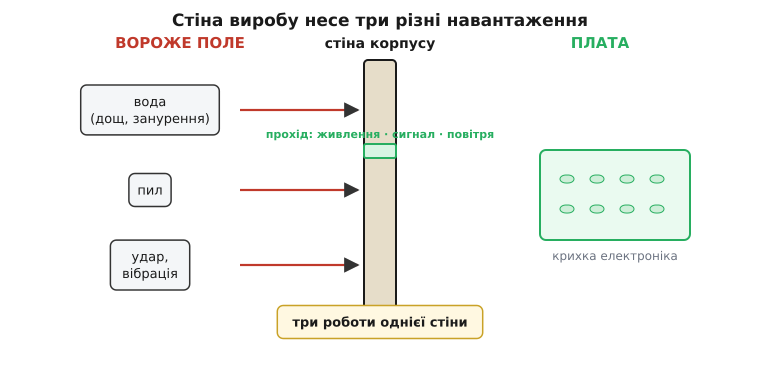
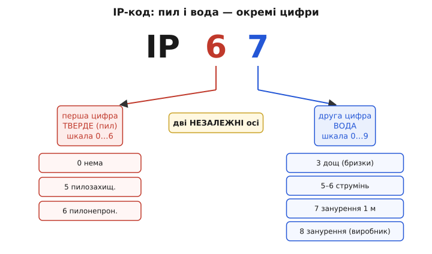
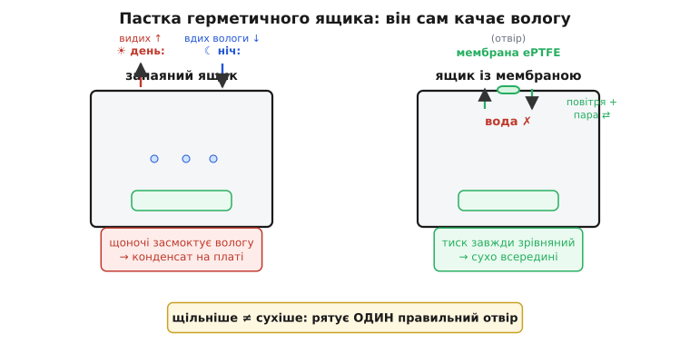

# Корпус, IP-захист, роз'єми

Ми зробили плату придатною до виготовлення: [розвели, спакували гербери, замовили серію](root:embedded/pcb-layout-flow) і навчилися [проєктувати під сліпий конвеєр](root:embedded/dfm-basics), щоб з партії вийшла не жменя, а вся тисяча однакових плат. І ось партія прийшла — рівні площадки, читабельні ревізії, жодного надгробка. Плата працює на столі бездоганно. А тепер ти береш її й ставиш туди, задля чого все затівалося: на раму коптера, що злітає під дощем; у корпус наземної станції, що місяць стоїть у полі; на ровер, який котиться крізь пилюку. І гола плата, яка щойно була взірцем інженерії, помирає за години.

Не тому, що вона погана. Тому, що поле — вороже, а плата гола. Крапля роси сяде між двома доріжками живлення й замкне їх. Пил осяде на роз'єм і з часом з'їсть контакт. Вібрація мотора за тиждень відламає високий конденсатор по ніжці. Хтось необережно поставить пристрій — і кут удару прийдеться просто в кристал давача. Плата — це мозок виробу; але мозок без черепа в полі не живе. **Корпус — це і є той череп**: те, що перетворює працездатну плату на виріб, який виживає там, де його поставили. Розберімо, з чого насправді складається ця задача — бо за словом «корпус» ховаються три різні фізики, і плутати їх дорого.

## Стіна виробу має три роботи, і кожна — окрема фізика

Спокуса — думати про корпус як про «коробку, у яку кладуть плату». Але коробка мовчить, а корпус працює: він тримає межу між ворожим полем і крихкою електронікою. І ця межа несе одразу **три різні навантаження**, які легко сплутати в одне «захистити», а насправді їх треба розв'язувати нарізно.

**Перше — не пустити всередину те, що вбиває електроніку**: воду й пил. Це боротьба з проникненням (*ingress*, від лат. *ingressus* — «вхід»). **Друге — витримати механічний удар і вібрацію**, щоб плата й корпус не тріснули від падіння чи від тряски мотора. Це вже не про герметичність, а про міцність. І **третє — пропустити крізь стіну те, що мусить пройти**: живлення, сигнал антени, повітря для тиску. Бо корпус, який нічого не пропускає, — це цегла: у нього не залити заряд, не витягти телеметрію, і, як ми побачимо, він сам себе руйнує зсередини.


*Одна стіна — три різні задачі. Ліворуч ворожий світ: вода, пил, удар. Праворуч крихка плата. Стіна мусить не пустити (проникнення), витримати (міцність) і водночас пропустити те, без чого виріб мертвий, — живлення, сигнал, повітря. Плутати ці три — типова помилка: «герметичний» корпус нічого не каже про те, чи переживе він падіння, і навпаки.*

> 🔧 **Навіщо це.** Розділити три роботи — не педантизм, а гроші й безпека. Ти купуєш захист, і кожен різновид коштує окремо: гумова прокладка проти води не додає ані джоуля міцності на удар; товстий алюміній проти удару сам по собі не тримає воду, поки не ущільнено стики; а найгерметичніший корпус без продуманого проходу для антени просто заглушить твоє радіо. Проєктувальник, який каже «зробимо міцний і водонепроникний», ще нічого не сказав, поки не назвав **скільки саме** кожного — а мова цих чисел уже придумана, стандартизована й записана в паспорт кожного давача, який ти купуєш.

Почнімо з першої роботи — проти води й пилу, — бо саме тут інженери домовилися про спільну мову чисел, і саме ці числа ти щодня бачиш у паспортах, не завжди розуміючи, що за ними стоїть.

## IP-код: два незалежні числа, бо пил і вода — різні вороги

Відкрий паспорт майже будь-якого давача, роз'єму чи готового корпусу — і побачиш напис на кшталт **IP67**. Це не маркетинг, а рядок міжнародного стандарту [IEC 60529](root:embedded/enclosure-ip-rating/hist-ip-code.md), який придумали саме тому, що слова «водонепроникний» і «пилозахищений» нічого точного не означають: водонепроникний під дощем — це одне, під водою — зовсім інше. Стандарт замінив слова двома цифрами. Літери **IP** у першому виданні 1976 року стояли просто як «характеристичні літери» без розшифровки; пізніші видання глосують їх то як *International Protection*, то (у європейській версії) як *Ingress Protection* — «захист від проникнення». За назвою можна не сперечатися; важлива механіка коду.

А механіка ось у чому. Після «IP» стоять **дві цифри, і вони незалежні**, бо описують двох різних ворогів:

```
IP  6  7
    │  └── друга цифра: захист від ВОДИ        (шкала 0…9)
    └───── перша цифра: захист від ТВЕРДОГО    (шкала 0…6)
           — пилу й доступу до небезпечних частин
```

Чому дві, а не одна «оцінка захисту»? Бо фізика проникнення пилу й фізика проникнення води — різні, і високий бал за одним нічого не гарантує за іншим. Пил лізе крізь **найменшу щілину** й накопичується сухим порошком; його спиняє щільність прилягання. Вода лізе під **тиском** — краплею, струменем, стовпом при зануренні; її спиняє ущільнення проти напору. Можна зробити корпус, крізь який не пройде порошинка, але який протече під струменем, — і навпаки. Тому й цифри дві.

**Перша цифра — тверде тіло, від 0 до 6.** Це сходинки від «жодного захисту» (0) через «не пролізе дріт чи інструмент» до двох важливих верхів: **5 — пилозахищений** (*dust-protected*: трохи пилу пройде, але не стільки, щоб зашкодити роботі) і **6 — пилонепроникний** (*dust-tight*: усередину не потрапить жодної порошинки). Для електроніки в полі майже завжди цільове число тут — 6: пил, що осідає на плату, з часом тягне вологу й струми витоку, тож його не пускають зовсім.

**Друга цифра — вода, від 0 до 9**, і тут сходинки — це наростання **суворості випробування**, а не абстрактної «якості». Кожен рівень — конкретний тест: 1 — вертикальні краплі згори; 3 — бризки з розпилювача під кутом до 60° від вертикалі (це, по суті, «дощ»); 4 — бризки з будь-якого боку; 5 — струмінь із сопла 6.3 мм; 6 — потужний струмінь із сопла 12.5 мм; **7 — тимчасове занурення** на 1 метр глибини до 30 хвилин; **8 — тривале занурення** на глибину й час, які **задає виробник**. Тобто число — це буквально відповідь на питання «який тест пройшов пристрій».


*Дві цифри читаються нарізно. Ліва гілка (перша цифра) — захист від твердого: 0 — нічого, 5 — пилозахищений, 6 — пилонепроникний. Права гілка (друга цифра) — захист від води за наростанням суворості тесту: дощ, струмінь, занурення. Осі незалежні: висока цифра води нічого не гарантує щодо пилу, і навпаки.*

І тут ховається пастка, на якій горять навіть інженери. **Друга цифра — не «чим більше, тим краще» по прямій.** Рівні 7 і 8 (занурення) **не означають автоматично**, що пристрій витримає рівні 5 і 6 (струмені). Це різні тести з різною фізикою: занурення — це рівномірний тиск води звідусіль, а струмінь — це концентрований удар потоку в одну точку, який може продавити ущільнення, що спокійно тримає нерухомий стовп води. Тому пристрій з IP**67** пройшов занурення, але **міг не проходити** випробування струменем. Якщо виробу треба і те, й те (наприклад, миття з мийки високого тиску **і** випадкове занурення), пишуть подвійний код — **IP66/IP68**: обидва тести пройдено окремо.

> 🔧 **Навіщо це.** Плутанина «більше значить краще» коштує реальних відмов. Уяви прилад для миття під струменем на фермі; ти бачиш у паспорті давача IP67 і заспокоюєшся — «занурення тримає, струмінь і поготів». А струмінь під тиском продавлює ущільнення роз'єму, вода потрапляє на плату, прилад гине — хоч «сімка» була вища за «шістку». Читати IP-код треба не як шкільну оцінку, а як **список складених іспитів**: тобі потрібні ті іспити, які відповідають твоєму реальному полю. І окремо тримай у голові, що IP-код нічого не каже про **удар** — для нього своя, зовсім інша цифра, до якої ми ще дійдемо.

Найтонше — верхня межа, IP68, бо її любить маркетинг і не любить фізика.

**Прочитаймо реальний рядок паспорта — крок за кроком.**

```
Давач тиску, паспорт:  IP68 (1.5 m, 30 min)

  IP        — код за IEC 60529
   6        — перша цифра: пилонепроникний (жодної порошинки)
    8       — друга цифра: тривале занурення…
  (1.5 m…)  — …але глибина й час НЕ в стандарті; їх ОГОЛОШУЄ виробник:
              тут — 1.5 метра протягом 30 хвилин
```

Ключове — у дужках. На відміну від «сімки», де умови фіксовані стандартом (1 м, 30 хв), **«вісімка» умов не фіксує**: стандарт вимагає, щоб глибину й тривалість **оголосив сам виробник**. Тому «IP68» без дужок — напівпорожній напис: у одного це 1.5 метра на пів години, у іншого — 6 метрів (як у деяких телефонів), у третього — десятки метрів для дайв-комп'ютера. Число «8» однакове, а фізична стійкість відрізняється в рази. Тому інженерне правило просте: **IP68 читай тільки разом із дужками**; без них ти не знаєш, що купив.

## Пастка запаяного ящика: чому «щільніше» починає текти

Тепер найцікавіше — і найменш очевидне. Здавалося б, рецепт герметичності прямий: візьми міцний корпус, поклади між половинками гумову прокладку (*gasket*, від дав.-англ. — «застібка»), стягни гвинтами так, щоб ані щілинки, — і вода не пройде. Логіка ніби залізна: чим щільніше запечатано, тим безпечніше. І саме тут вона ламається об фізику. **Ідеально запаяний ящик, який стоїть просто неба, з часом сам засмоктує в себе воду** — і що краще він запаяний, то надійніше це робить. Розберімо цей парадокс, бо він визначає, як насправді будують надійні вуличні корпуси.

Корінь — у тому, що всередині корпусу замкнено **повітря**, а повітря реагує на температуру. Виріб у полі живе в добовому циклі: удень сонце й власний нагрів електроніки розігрівають корпус, уночі він холоне. Замкнений об'єм повітря сталий, тож при нагріванні тиск усередині росте, при охолодженні — падає. Це той самий закон, за яким [газ під нагрівом тисне сильніше](book:physics/ideal-gas-law): за сталого об'єму тиск прямо пропорційний абсолютній температурі.

І ось що з цього виходить у динаміці. **Удень**, коли всередині гарячіше, надлишковий тиск **виштовхує** трохи повітря назовні — воно просочується там, де ущільнення слабше. **Уночі** корпус холоне, тиск усередині падає нижче зовнішнього, і тепер атмосфера **вдавлює** повітря назад — але тягне вона його разом із тим, що є на поверхні корпусу: вологою, росою, дощовою плівкою. Кожна доба — один цикл «видихнув сухе — вдихнув вологе». Волога заходить, а вийти сухою вже не може: вона конденсується на холодній платі. **Запаяний ящик працює як помпа, що повільно накачує в себе воду** — не крізь пробій ущільнення, а прямо крізь дихання температури. Парадокс у тому, що ідеальне ущільнення тут **шкодить**: чим герметичніше, тим більший перепад тиску встигає накопичитися, перш ніж повітря знайде вихід, — і тим сильніше кожен цикл б'є по прокладці, аж поки вона не здасться.


*Чому «щільніше» тече. Ліворуч герметичний ящик проходить добовий цикл: гарячий день виштовхує сухе повітря назовні, холодна ніч засмоктує назад вологе — і волога лишається всередині, конденсуючись на платі. Праворуч той самий ящик, але з навмисним отвором під мембраною (ePTFE): пори пропускають молекули повітря й пари, тож тиск завжди зрівняний і помпи немає, — а краплі води й пил крізь ті пори не пролазять. Отвір робить корпус водночас «дихаючим» і сухим.*

Наскільки сильний цей перепад? [Порахуймо тиск на прокладку від добового перепаду температури](root:embedded/enclosure-ip-rating/math-sealed-box-pressure.md) — виходить, що навіть скромні 20 °C коливання дають перепад у кілька відсотків атмосфери, а на площі кришки це десятки ньютонів, які циклічно смикають ущільнення тисячі разів за сезон. Ось груба оцінка самого перепаду:

```
Закон за сталого об'єму:   P₁/T₁ = P₂/T₂   (T — АБСОЛЮТНА, у кельвінах)

  день:  T₁ = 20 °C = 293 K,  P₁ = 101.3 кПа (запечатали вдень)
  ніч:   T₂ =  0 °C = 273 K
  P₂ = P₁ · T₂/T₁ = 101.3 · 273/293 ≈ 94.4 кПа

  перепад:  ΔP = 101.3 − 94.4 ≈ 6.9 кПа  нижче зовнішнього

  на кришці 100 × 60 мм = 0.006 м²:
  F = ΔP · S = 6900 Па · 0.006 м² ≈ 41 Н   (≈ 4 кг тягне всередину)
```

Сорок ньютонів, що вдавлюють кришку й тягнуть атмосферу крізь ущільнення, — і так щоночі. Не диво, що прокладка з часом здається.

Розв'язок не в тому, щоб запаяти ще щільніше (це, як ми бачили, лише гірше), а в тому, щоб **дати ящику дихати — але тільки повітрям**. Для цього в стінці роблять навмисний отвір і закривають його [мембраною зрівнювання тиску](root:embedded/enclosure-ip-rating/comp-pressure-vent.md) — тонкою плівкою з розтягнутого політетрафлуоретилену (ePTFE, той самий матеріал, що в мембранах «дихаючого» одягу). Її пори — це компроміс, вибудуваний на різниці розмірів: молекула повітря чи водяної пари крізь пору **пролазить вільно**, а крапля рідкої води — ні, бо поверхневий натяг не пускає її в таку дрібну діру. Отже, тиск усередині й зовні тепер завжди зрівняний — помпи немає, ущільнення не смикає, — а рідка вода й пил усе одно лишаються за стіною. Корпус став водночас **дихаючим і сухим**. Це головна контрінтуїція теми: справжня герметичність вуличного виробу — це не «нуль отворів», а **один правильний отвір**.

## Роз'єми: найслабша ділянка стіни — там, де її навмисне продірявили

Ми щойно бачили, що навіть один потрібний отвір — задача. А тепер згадай третю роботу стіни: пропустити живлення й сигнал. Це означає **проколоти** герметичну стіну там, де крізь неї має пройти метал провідника, — і кожен такий прокол є ділянкою, де захист найлегше програти. Логіка проста й невблаганна: суцільна стіна тримає рівно стільки, скільки тримає її **найслабше місце**, а найслабше місце — завжди там, де стіну перервали заради роз'єму (*connector*, від лат. *conectere* — «з'єднувати»).

Звідси перше й головне правило корпусної електроніки: **найкращий отвір — той, якого немає.** Кожен зайвий роз'єм — це ще одна ділянка, яку треба ущільнювати, яка старіє, у яку набивається бруд. Тому кількість проходів крізь стіну тримають мінімальною: об'єднують живлення й дані в один кабель, виносять налагоджувальні контакти всередину (щоб не дірявити корпус заради того, чим користуються раз у житті), а те, що можна передати без дроту — телеметрію, оновлення прошивки — передають радіо, не проколюючи стіну взагалі.

Коли ж прохід неминучий, ключова думка така: **IP-код усього виробу не вищий за IP-код найгіршого роз'єму на ньому**. Постав корпус із IP68 і встроми в нього звичайний роз'єм без ущільнення — і весь виріб став рівно таким водонепроникним, як той роз'єм, тобто ніяким. Тому роз'єми для вуличних виробів беруть із власним паспортом IP: у них ущільнення закладене в саму конструкцію — гумове кільце обтискає стик, коли половинки з'єднані. А **кабель**, що виходить крізь стінку, ущільнюють окремим вузлом — **сальником** (*cable gland*): гумова втулка обтискає оболонку кабелю по колу, коли її стягують, і закриває щілину навколо дроту. Дрібне, але критичне: сальник тримає лише той діаметр кабелю, під який розрахований, — надто тонкий кабель він не обтисне, і саме там протече.

> 🔧 **Навіщо це.** У польовій практиці роз'єми — причина відмов номер один, і не через воду під час занурення, а через дрібниці: у незакручений до кінця роз'єм зайшла волога, у сальник затягнули задонкий кабель, лишили заглушку на невикористаному гнізді відкритою. Плата може бути ідеальна, корпус — з дорогою мембраною, а гине виріб через п'ятигривневу гумку, яку неправильно обтиснули. Тому при проєктуванні корпусу питання «скільки в мене роз'ємів і який IP у кожного» важливіше, ніж клас самого корпусу: **захист виробу дорівнює захисту його найслабшого проходу.**

## Удар і вібрація: друга робота, про яку IP мовчить

Лишилася середня з трьох робіт — витримати механіку, — і про неї треба сказати окремо саме тому, що IP-код про неї **не говорить нічого**. Пристрій може бути IP68 і розсипатися від падіння з полиці: вода й удар — незалежні осі, як пил і вода були незалежні між собою.

Для удару є **своя цифра — IK-код** (стандарт IEC 62262), і читається вона просто: скільки **джоулів** удару витримує корпус, не тріснувши. Шкала від IK00 (без захисту) до IK10, і на відміну від IP тут числа — прямо енергія: **IK08 — це 5 джоулів** (наче кілограмова маса впала з висоти пів метра), **IK10 — 20 джоулів** (п'ятикілограмова з 40 см); у 2021-му додали ще IK11 на 50 джоулів. Для більшості наших виробів IK-код у паспорті не пишуть, але **сама ідея** важлива: механічна стійкість — окрема характеристика, і для виробу, який тримають у руках, возять і кидають, її треба закладати свідомо, а не сподіватися, що «товстий пластик якось витримає».

А для нашого коптера й ровера є ще підступніший різновид механіки — **вібрація**. Це не одиничний удар, а мільйони дрібних поштовхів від мотора, і вбиває вона не тріщиною корпусу, а **втомою**: високий конденсатор чи роз'єм, припаяний за дві ніжки, розхитується, доки ніжка не переломиться по місцю згину. Плата на столі цього не показує ніколи — вона з'являється лише в польоті й лише за тижні. Ліки — механічні, і закладати їх треба ще при [проєктуванні під виготовлення](root:embedded/dfm-basics): важкі деталі кладуть низько й фіксують не самою пайкою, а клеєм чи скобою; плату кріплять до корпусу через **амортизувальні стійки**, щоб вони гасили тряску, а не передавали її прямо на мідь; довгі виводи вкорочують. Корпус тут не лише «череп», а й **демпфер** — він мусить розв'язати плату від вібрації рами, інакше сам передасть її на найкрихкіше з'єднання.

## Корпус — це паспорт середовища, а не просто коробка

Зберімо нитку. Плата, яку ми довели до серії, у полі гине не від власних вад, а від середовища; корпус — те, що ставить між ними стіну. Але «стіна» — це не одна властивість, а **три незалежні паспорти**: скільки води й пилу вона не пускає (IP-код IEC 60529, дві незалежні цифри, і вісімка — тільки з дужками), скільки удару тримає (IK-код), і як чесно вона пропускає те, без чого виріб мертвий, — живлення й сигнал крізь ущільнені роз'єми та повітря крізь дихаючу мембрану. Головні контрінтуїції, які варто винести: **щільніше — не завжди сухіше** (запаяний ящик сам себе накачує вологою, рятує один правильний отвір), і **захист виробу дорівнює захисту його найслабшого проходу** (а не класу самого корпусу).

І ось що з цього випливає для послідовності курсу. Коли ти обираєш корпус чи давач, ти більше не читаєш IP і IK як маркетингові зірочки — ти читаєш їх як **список іспитів, складених під конкретне поле**: коптер під дощем, ровер у пилюці, наземна станція просто неба цілий сезон. Ти обираєш рівно той захист, який відповідає середовищу, і жодним більше — бо зайвий клас коштує грошей і ваги (а вагу коптеру, як ми рахували при [підборі пропульсії](root:embedded/propulsion-sizing), нема куди дівати), а недобраний клас коштує втраченого виробу в полі.

Виріб тепер захищений від середовища. Лишилося зробити його **законним**: довести, що його радіо не глушить сусідів, що він відповідає нормам країни, де працюватиме, — а це вже не фізика корпусу, а [сертифікація й регуляції](book:communications/emc-certification), з якої починається наступний, останній розділ цього модуля.
