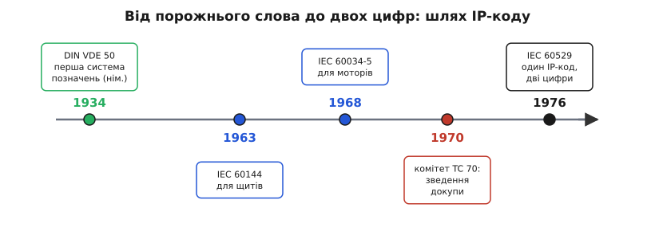

# 📜 Звідки взявся IP-код: історія двох цифр

У паспорті давача написано `IP67`, і ми навчилися читати цей рядок як список складених іспитів. Але звідки взялися саме ці літери, чому їх дві цифри, а не одна оцінка, і чому навіть виробники досі сперечаються, що означає «IP», — це окрема історія, і вона повчальна. Бо IP-код народився не з натхнення одного інженера, а з довгої боротьби проти одного дуже дорогого слова — слова, яке нічого не означає. Простежмо цю боротьбу від початку, бо в ній видно, **як узагалі народжується технічний стандарт**: не як хтось придумав гарну систему, а як спільнота роками виштовхує з мови розмиті слова й замінює їх тим, що можна виміряти.

## Слово, яке всіх підводило

Уяви ринок електротехніки початку XX століття. Моторів, вимикачів, розподільних щитів, реле — тисячі, від сотень виробників у десятках країн. І кожен пише у своєму каталозі те, що хоче почути покупець: «захищений від бризок», «пилонепроникний виконання», «водозахисний», *weatherproof* — «непіддатний негоді». Слова красиві. Проблема в тому, що вони порожні.

Бо що таке «водозахисний»? Захищений від краплі роси, яка впаде згори? Від дощу навскіс під вітром? Від струменя зі шланга, коли мийник зі щита змиває бруд? Від того, що щит на добу опиниться під водою в затопленому підвалі? Це чотири зовсім різні фізичні випробування, і виконання, яке блискуче тримає перше, може протекти на другому ж. Але в каталозі стоїть одне слово — *weatherproof*, — і воно однакове для всіх чотирьох. Покупець читає його й уявляє собі свій випадок; виробник писав його, думаючи про свій. Вони не збіглися — і мотор згорів у полі. Хто винен? Ніхто: слово було правдиве й для того, і для того. Воно просто нічого не означало точно.

> 🔧 **Навіщо це.** Ця сама пастка жива й сьогодні, тільки слова інші. Коли постачальник каже тобі «промислове виконання», «захищений корпус», «стійкий до вологи» — він не сказав нічого, що можна перевірити. Уся історія IP-коду — це історія того, як інженерна спільнота **відмовилася приймати такі слова в паспорті** й змусила виробника натомість назвати конкретний тест. Тому коли ти сам колись писатимеш специфікацію на свій виріб, згадай цю історію: пиши не «водозахисний», а `IP67` — бо тільки цифра має однакове значення для тебе й для того, хто її прочитає.

І ще одна тонкість, яку легко проґавити: розмите слово шкодить **обом** сторонам, не лише покупцеві. Чесний виробник, який справді зробив добрий герметичний корпус, у морі однакових «водозахисних» написів **нічим не відрізняється** від того, хто написав це слово абияк. Його інженерна праця невидима, бо мова не має чим її виміряти. Отже, у заміні слова на число зацікавлені не лише ті, хто купує, а й ті, хто робить якісно, — і саме тому стандарт зрештою пробився. Він дав чесному виробникові спосіб **довести** свою якість цифрою.

## Німецька відповідь: 1934 рік, перша спроба покласти цифру замість слова

Першими систему навели німці, і дата тут точна: листопад **1934 року**, стандарт **DIN VDE 50** — «Умовні позначення для видів захисту» (нім. *Kurzzeichen für Schutzarten* — «короткі позначення для видів захисту»). Німецьке слово *Schutzart* — «вид захисту» — і досі є рідною назвою всієї цієї системи в німецькій традиції; наш «IP-код» — її пізніший міжнародний нащадок.

Що зробив цей стандарт? Він узяв ту саму ідею, до якої ми прийшли в основній темі, — що захист треба розкласти на **окремі, незалежно вимірювані виміри**, — і вперше записав її як формальну систему коротких позначень. Замість слова «водозахисний» — умовний знак, за яким стоїть конкретна умова випробування. Це був злам: захист перестав бути прикметником у рекламі й став **класифікованою характеристикою**, яку можна поставити в таблицю поруч із напругою, струмом і потужністю.

Статус доказовості цієї дати — **усталено**: походження системи від німецького стандарту 1934 року фіксують і німецька технічна традиція, і історичні довідки міжнародного комітету. Але одразу застережмо від спокуси, яку ця дата створює: сказати «пилозахист винайшли німці» було б надто грубо. Ідея захисного корпусу стара, як сама електротехніка; вклад 1934 року — не в тому, що хтось уперше подумав захищати мотор від пилу, а в тому, що вперше **домовилися про спільну мову позначень** для цього захисту в межах однієї країни. Це важлива різниця, і ми до неї ще повернемося, бо саме нерозрізнення «мати ідею» й «домовитися про стандарт» породжує половину міфів про «хто що винайшов».

## Розповзання по стандартах: чому одної системи стало мало

Німецька система працювала — і тому почала розповзатися. Спершу її переймали інші національні стандарти, а далі, коли електротехніка стала глобальною, вона дісталася й до **міжнародних** документів Міжнародної електротехнічної комісії (англ. *International Electrotechnical Commission*, IEC — усесвітня організація, що узгоджує стандарти в електриці й електроніці). Але дісталася не одним документом, а — і в цьому весь корінь наступної проблеми — **кількома окремими**, бо різні технічні комітети відповідали за різне залізо.

Так з'явилися два ключові попередники, і варто назвати їх поіменно, бо саме їхнє співіснування зрештою й змусило зробити єдиний стандарт:

```
IEC 60144 (1963) — ступені захисту оболонок
                   для НИЗЬКОВОЛЬТНОЇ апаратури
                   (вимикачі, щити, розподільні пристрої)

IEC 60034-5 (1968) — ступені захисту оболонок
                     для ОБЕРТОВИХ машин
                     (електродвигуни, генератори)
```

Бачиш пастку? Те саме за суттю питання — «наскільки корпус пускає всередину воду й пил» — тепер описували **два різні стандарти**, кожен зі своїм формулюванням, для двох різних класів пристроїв. Мотор і щит стояли поруч в одній установці, обидва мали «ступінь захисту оболонки», але **паспорти їхні говорили різними мовами**. Це рівно та сама хвороба, з якої все починалося, тільки піднята на рівень вище: раніше різні виробники писали розмиті слова, тепер різні комітети писали несумісні системи. Мова знову роздрібнилася — і знову треба було зводити її в одне.

> 🔧 **Навіщо це.** Ця частина історії — не просто хронологія, а **урок про природу стандартів**, який тобі знадобиться постійно. Стандарти народжуються фрагментами, кожен під свою вузьку задачу, а потім хтось із болем зводить їх докупи. Ти зустрінеш це всюди: у протоколах зв'язку, у форматах файлів, у роз'ємах. Коли бачиш «уніфікований стандарт» — за ним майже завжди стоїть кладовище кількох попередніх, які колись описували те саме несумісно. IP-код — чистий приклад: перш ніж стати одним рядком у паспорті, він був щонайменше двома різними системами для мотора й для щита.

## 1970, комітет TC 70: зведення докупи

Розв'язку доручили окремому органу. У **1970 році** в IEC заснували технічний комітет **TC 70** — саме з тим завданням, щоб узяти два несумісні документи для щитів і моторів і **звести їх в один**, придатний уже для будь-якого електроустаткування, а не для окремого класу залізяччя. Це показова деталь: коли розбіжність стандартів болить достатньо, під її усунення створюють окрему постійну структуру — і донині за IP-кодом стоїть саме TC 70. Через кілька років праці, у **1976-му**, вона вийшла як перше видання стандарту **IEC 60529** — «Ступені захисту, забезпечувані оболонками» (пізніше в назву додали й «(IP Code)»). Саме цей документ узяв роздроблені формулювання для моторів і щитів і замінив їх **однією таблицею з двома незалежними цифрами** — тим самим IP-кодом, який ми розбирали.


*Сорок років шляху від слова до цифри. Німеччина 1934-го вперше замінює розмите слово системою позначень; ідея розповзається у два несумісні міжнародні стандарти — окремо для щитів (1963) і моторів (1968); комітет TC 70, заснований 1970-го, зводить їх докупи; IEC 60529 1976-го дає світові один IP-код із двома незалежними цифрами. Зелене — зародок, синє — роздрібнення, червоне — зведення.*

І тут — найцікавіша, майже кумедна деталь усієї історії. Стандарт, який мав нарешті дати всьому точні означення, **сам не пояснив, що означають його головні літери**. У першому виданні 1976 року «IP» стоять просто як «характеристичні літери» (англ. *characteristic letters*) — без жодної розшифровки. Уяви іронію: документ, створений заради того, щоб вигнати з паспорта невизначені слова, у власній назві лишив невизначені літери. Цифри — суворо означені, кожна прив'язана до конкретного тесту; а що таке саме «IP» — не сказано.

Це не недбалість, а показова річ. Комітетові було важливо не як **називається** система, а що вона **робить**: щоб перша цифра однозначно означала свій тест на тверде тіло, а друга — свій тест на воду. Назва — етикетка; працює механіка. І в цьому глибокий урок про стандарти взагалі: **сила стандарту не в його імені, а в точності його означень**. IP-код чудово виконує роботу вже піввіку саме тому, що цифри визначені бездоганно, — а те, що навколо самих літер досі плутанина, роботі не заважає ніскільки.

## Дві назви одного коду: International чи Ingress?

Порожнечу, яку лишило перше видання, згодом почали заповнювати — і заповнили **по-різному**, через що й дотепер існують дві розшифровки «IP». Ось як розійшлися шляхи.

Наступні видання самого міжнародного стандарту — **1989** і **1999 років** — уже глосують «IP» як *International Protection* («міжнародний захист») — і роблять це на обох мовних сторінках документа, англійській та французькій (IEC видає стандарти двомовно). Логіка зрозуміла: це **міжнародний** стандарт, тож «I» — від *International*.

Але паралельно живе **європейська** версія цього ж стандарту — **EN 60529** (EN — *European Norm*, європейська норма; це той самий текст, узятий у європейську систему стандартів). І в європейській традиції ті самі літери частіше читають як *Ingress Protection* — «захист від проникнення». Ця розшифровка ближча до суті: код і справді міряє, наскільки оболонка пускає всередину (*ingress* — те саме проникнення, з яким ми боролися в основній темі) воду й пил. Тому інженери-практики масово кажуть саме *Ingress Protection*, хоча формально в тексті IEC стоїть *International*.

```
одні й ті самі літери «IP»:

  IEC 60529  →  International Protection  («міжнародний захист»)
  EN  60529  →  Ingress Protection       («захист від проникнення»)

  код той самий, цифри ті самі, тести ті самі —
  розходиться лише РОЗШИФРОВКА двох літер
```

Хто ж має рацію? Обидва — і в цьому теж урок. Це не суперечка про факт (тести й цифри однакові до коми), а розбіжність **етикеток**, що виросли в різних інституціях. Тому статус тут чесно позначмо так: **усталено — з приміткою про подвійну назву**. Якщо тобі трапиться суперечка «правильно *International* чи *Ingress*», знай, що обидві розшифровки задокументовані, просто в різних документах: *International* — в оригінальному тексті IEC, *Ingress* — у європейському вжитку й у голові майже кожного інженера. Сперечатися немає про що; важлива, як завжди, механіка коду, а не назва.

> 🔧 **Навіщо це.** Практична порада з цієї плутанини одна, але корисна: **не суди про продукт за тим, як розшифрували «IP» в його паспорті.** Побачив *International Protection* — це не «гірший» чи «інший» стандарт, ніж *Ingress Protection*; це той самий IEC 60529, просто інша традиція назви. Дивись на **цифри й на дужки біля вісімки**, а не на слова навколо літер. Слова тут — якраз те, від чого весь стандарт нас відучував; іронічно, що вони лишилися саме в його імені.

## Фінська здогадка: а що, як «IP» — узагалі гра двох мов?

І є ще третя, найтонша версія походження — з тих, що позначають чесним словом «здогад», а не «факт». Її висунув **фінський національний комітет** IEC, і вона гарна саме своєю двомовністю. Здогад такий: можливо, «IP» від початку було задумане як **поєднання двох мов** робочих комітету — англійського *ingress* («проникнення») і французького *pénétration* («проникнення» ж, читається «пенетрасьйон»). Тобто «I» — з англійського слова, «P» — з французького, а разом вони кажуть одне й те саме поняття двома офіційними мовами організації.

```
фінська гіпотеза (здогад, НЕ доведено):

  I  ←  ingress       (англ.  «проникнення»)
  P  ←  pénétration   (фр.    «проникнення»)

  дві мови — одне поняття:
  захист від проникнення всередину
```

Гарно? Дуже. Правда? **Невідомо** — і саме так це й треба подавати. Це правдоподібна, елегантна, але **недоведена** гіпотеза: жоден протокол комітету 1976 року, наскільки відомо, прямо не каже «ми взяли I з англійської, а P з французької». Тому чесний статус тут — **правдоподібно, але не доведено**; це здогад національного комітету, а не задокументоване рішення авторів. Ми згадуємо його не тому, що він точно правильний, а тому, що він показує, як **навіть саме походження назви розчинилося в історії** — настільки комітетові було байдуже до літер і настільки важливі були цифри.

Помічаєш, до чого зводяться всі три версії? *International* каже «це для всього світу». *Ingress* каже «це про проникнення». Фінський здогад каже «це проникнення двома мовами одразу». Три різні відповіді на питання «що таке IP» — і **жодна не змінює ані на йоту, що робить код**. Сорок і більше років інженери всього світу користуються ним однаково, читаючи `IP67` як «пилонепроникний, витримує занурення на метр» — і те, звідки взялися дві літери попереду, для цієї роботи не важить нічого. Оце і є ознака по-справжньому вдалого стандарту: він працює **незалежно від того, як його назвати**.

## Що ця історія лишає нам у руках

Зберімо нитку, бо вона стосується не лише IP-коду. Почалося все з дорогої порожнечі — слова *weatherproof*, яке кожен розумів по-своєму й тому не розумів ніяк. Німці 1934-го вперше замінили таке слово системою позначень; ідея розповзлася по кількох несумісних стандартах для моторів і щитів; комітет TC 70, заснований 1970-го, звів їх докупи; IEC 60529 1976-го дав світові дві незалежні цифри замість жмені прикметників — і при цьому, з чарівною іронією, сам забув пояснити власні літери, лишивши нам аж три версії їх походження й жодної певної.

Практичний висновок з усього цього — той самий, що веде основну тему, тільки тепер підпертий історією. **Довіряй цифрі, не слову.** Уся ця столітня праця робилася заради одного: щоб у паспорті стояло не «водозахисний», а `IP67` — рядок, що означає однакове для того, хто його написав, і для того, хто прочитає. Коли колись писатимеш специфікацію на власний виріб, ти стоятимеш рівно в тій точці, з якої почалася ця історія: перед вибором між красивим порожнім словом і сухою перевірюваною цифрою. Історія IP-коду — це сто років аргументів на користь цифри.
