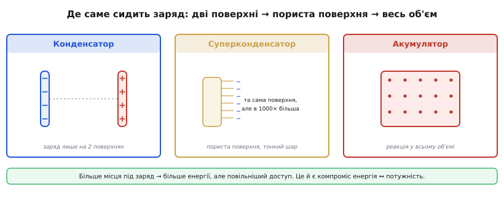
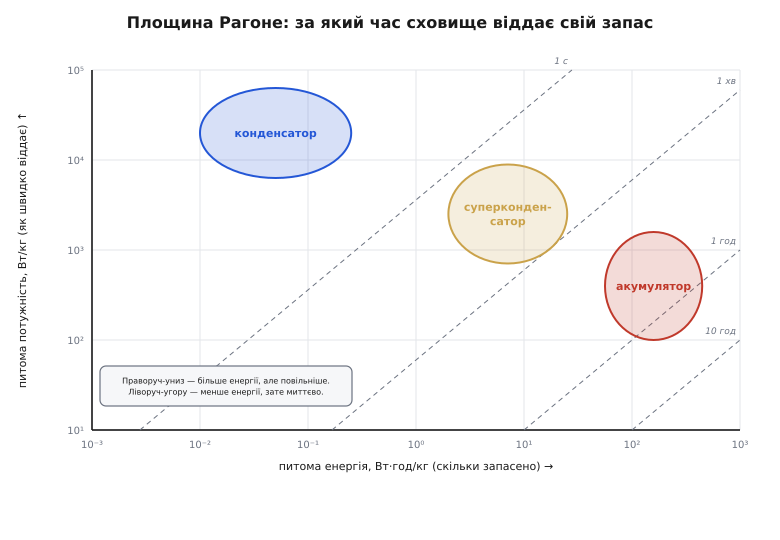
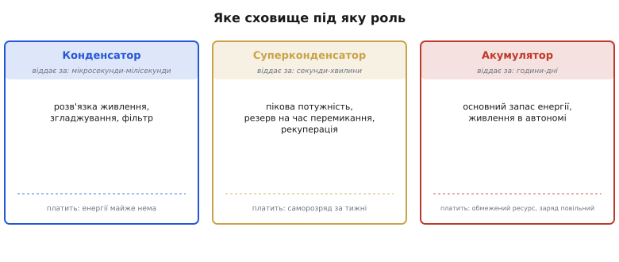

# Щільність енергії та потужності: конденсатор, суперконденсатор, акумулятор

Ми вже вміємо порівнювати акумулятори між собою — за напругою елемента, питомою енергією, кривою розряду, ресурсом, температурою й безпекою (про це йшлося, коли ми розбирали [хімії батарей](root:embedded/battery-chemistries)). Та в реальному пристрої акумулятор — не єдине місце, де живе заряд. Поряд з ним на платі майже завжди стоять конденсатори, а часом і суперконденсатор. І раптом виявляється, що порівнювати треба не «літій проти свинцю», а речі геть різної природи: **конденсатор, суперконденсатор і акумулятор** — на одному полі. Саме це порівняння й добудовує картину сховищ енергії до кінця.

Питання, яке тут вирішується, звучить просто: **коли ставити конденсатор, коли суперконденсатор, а коли акумулятор?** Відповідь не в тому, що «акумулятор кращий». Вона в тому, що ці три класи лежать на **протилежних кінцях одного компромісу** — між тим, *скільки* енергії сховище тримає, і тим, *як швидко* воно її віддає. Хто зрозумів цей компроміс, той більше ніколи не сплутає їхні ролі.

## Дві різні величини, які весь час плутають

Перше, що треба розчепити в голові остаточно, — це **енергія** і **потужність**. Інтуїція вже з'являлася, коли ми бачили різницю між «енергоємними» й «силовими» комірками. Тепер закріпімо її як основу всієї теми.

**Енергія** (вимірюємо у ват-годинах, Вт·год) — це повний запас: скільки роботи сховище здатне віддати від повного до порожнього. **Потужність** (вати, Вт) — це темп: скільки енергії воно віддає за секунду, тобто наскільки різкий струм здатне дати тут і зараз. Це незалежні осі. Можна мати велику бочку з вузьким краником (багато енергії, мала потужність) — і малий балон під тиском, що вистрілює все за мить (мало енергії, шалена потужність).

```
енергія  E [Вт·год]  — скільки всього запасено (об'єм бочки)
потужність P [Вт]    — як швидко віддається    (ширина краника)
час віддавання  t = E / P                       (за скільки спорожніє)
```

Остання формула — ключ до всієї теми, і ми будемо до неї повертатися. Час, за який сховище віддасть свій запас, — це просто енергія, поділена на потужність. Конденсатор віддає за мікросекунди, суперконденсатор — за секунди, акумулятор — за години. Один і той самий запас, але темп різниться на **мільйони разів**.

> 🔧 **Навіщо це.** Розчеплення цих осей рятує від найпоширенішої помилки живлення: брати ємніше там, де насправді бракує потужності. Якщо мікроконтролер на мить «просідає» під час радіопередачі — це дефіцит **потужності** в ту мілісекунду, і лікує його конденсатор поряд із чипом, а не більша батарея. Більша батарея додасть годин роботи, але не врятує від просадки за мілісекунду — бо її обмежує не запас, а внутрішній опір.

## Чому це взагалі компроміс: де сидить заряд

Звідки ж береться цей розрив на порядки? Чому не можна зробити сховище, яке і тримає багато, і віддає миттєво? Відповідь — у тому, **де фізично сидить заряд**, і вона варта того, щоб побачити її наочно.


*Конденсатор тримає заряд на двох гладких пластинах, розділених діелектриком; суперконденсатор — на тій самій за принципом поверхні, але розвиненій пористим вугіллям у тисячі разів; акумулятор запасає заряд хімічною реакцією у всьому об'ємі матеріалу. Більше місця під заряд означає більше енергії — але повільніший до нього доступ.*

У **конденсаторі** заряд лежить на двох провідних пластинах, розділених тонким ізолятором — [діелектриком](topic:hw-components/capacitor). Жодної хімії: просто надлишок електронів на одній обкладинці й нестача на іншій, що тримаються силою електричного поля. Доступ до цього заряду миттєвий — він уже на поверхні, бери й користуйся. Тому потужність велика. Але й енергії мало: на двох гладких поверхнях багато заряду не вмістиш. Енергія конденсатора задається коротким, але дуже промовистим виразом:

```
E = ½ · C · U²            (енергія конденсатора, у джоулях)
```

Тут `C` — ємність (фаради), `U` — напруга (вольти). Квадрат напруги — важлива деталь: подвоїш напругу — учетверо більше енергії. Та навіть так абсолютні числа крихітні, і ми зараз це порахуємо.

У **суперконденсаторі** принцип той самий — заряд тримається полем на межі електрода й розчину, без хімічної реакції, — але площу цієї межі роблять **жахливо великою**. Електрод роблять з пористого активованого вугілля, чия внутрішня поверхня в одному грамі сягає сотень-тисяч квадратних метрів. Тонесенький шар заряду, помножений на велетенську поверхню, дає ємності в тисячі разів більші за звичайний конденсатор. Тому й енергії [суперконденсатор](topic:hw-components/supercapacitor) тримає набагато більше — але доступ до заряду вже трохи повільніший (іонам треба зайти в пори), тож потужність хоч і велика, але вже не «конденсаторна».

В **акумуляторі** заряд не лежить на поверхні — він **захований у хімічних зв'язках у всьому об'ємі** активної речовини. Щоб його дістати, має пройти реакція: іони мандрують крізь електроліт, речовина електродів перетворюється. Це повільно (звідси скромна потужність) і впирається у внутрішній опір — саме тому під різким струмом напруга [просідає](topic:hw-power/battery-sag). Зате місця під заряд — увесь об'єм матеріалу, а не дві поверхні, тож енергії на грам у рази й десятки разів більше.

Звідси й випливає весь компроміс однією думкою: **що більше місця віддано під заряд (від двох поверхонь до цілого об'єму), то більше енергії — але то повільніший до нього доступ, а отже менша потужність.** Не можна виграти на обох осях одразу, бо вони борються за те саме — за те, як саме й де зберігається заряд.

## Площина Рагоне: усі троє на одному полі

Тепер, коли ясно *чому*, складімо всіх трьох на одну карту. Інженери для цього вже понад півстоліття користуються одним і тим самим графіком — його придумав термодинамік Девід Рагоне 1968 року для порівняння батарей електромобілів, і відтоді ним міряють будь-які сховища енергії. Історію цього графіка й людину за ним варто знати окремо: [звідки взялася площина Рагоне](root:embedded/energy-density-comparison/hist-ragone-plot.md) — інструмент пережив свою початкову задачу, бо описує фізику компромісу, а не моду.


*Обидві осі логарифмічні, бо класи різняться на порядки. Горизонталь — скільки енергії на кілограм, вертикаль — яку потужність на кілограм. Похилі пунктири — лінії сталого часу віддавання: де лежить пляма, за стільки вона й спорожніє. Конденсатор — ліворуч-угорі (мало енергії, миттєво), акумулятор — праворуч-унизу (багато енергії, повільно), суперконденсатор — посередині.*

Логарифм осей — не примха оформлення, а необхідність: різниця між класами не у відсотках, а в **тисячах разів**, і на лінійних осях батареї злиплися б у точку, а конденсатори полетіли б за край аркуша. Грубі орієнтири питомої енергії варто тримати в голові — саме порядок величини, не точне число:

```
електролітичний конденсатор:  ~0.01–0.3  Вт·год/кг
суперконденсатор:             ~5–10      Вт·год/кг   (буває 1–30)
літієвий акумулятор:          ~150–250   Вт·год/кг
```

Між конденсатором і суперконденсатором — приблизно в сто разів; між суперконденсатором і літієм — ще приблизно в двадцять-тридцять. А за потужністю порядок зворотний: конденсатор віддає десятки кіловатів на кілограм, суперконденсатор — одиниці, акумулятор — сотні ватів. Кожен виграє рівно те, що інший програє.

Найкорисніше на цій карті — **діагональні лінії сталого часу**. Згадаймо `t = E / P`: для кожного відношення енергії до потужності виходить свій час, і на логарифмічному полі точки однакового часу лягають на пряму. Тому площину можна читати так: знайди свою пляму — і одразу бачиш, **за який час** це сховище віддасть повний запас. Конденсатор сидить на лінії мікро- й мілісекунд, суперконденсатор — секунд і хвилин, акумулятор — годин. Це не дві окремі властивості (енергія й потужність), а **одна суть, побачена з двох боків**.

## Рахуємо реальний випадок: скільки протримає конденсатор

Абстракція стає зрозумілою на числах. Найчастіша інженерна задача з конденсатором — **утримати живлення на короткий провал** (англ. *hold-up*): мережа моргнула, або пристрій перемикає джерело, і треба, щоб мікроконтролер не перезавантажився ці кілька мілісекунд. Скільки енергії дасть конденсатор і чи вистачить її?

**Приклад (тримаємо 3.3 В при провалі живлення).** Маємо конденсатор 1000 мкФ, заряджений до 5 В. Навантаження — 100 мА. Скільки часу живлення протримається, поки напруга не впаде до 3.3 В, нижче яких стабілізатор уже не тягне?

:::tabs
```cpp
// Корисна енергія — лише та, що віддається ДО порогу:
// ΔE = ½·C·(U_поч² − U_поріг²)
float C = 1000e-6f;        // 1000 мкФ
float U0 = 5.0f, Umin = 3.3f;
float dE = 0.5f * C * (U0*U0 - Umin*Umin);   // = 0.5·1e-3·(25 − 10.89)
// dE ≈ 0.5 · 0.001 · 14.11 ≈ 7.06 мДж

float P = 3.3f * 0.100f;   // потужність навантаження ≈ 0.33 Вт
float t = dE / P;          // час утримання
// t ≈ 0.00706 / 0.33 ≈ 0.021 с  ≈ 21 мс
```
```python
# Корисна енергія — лише та, що віддається ДО порогу:
# ΔE = ½·C·(U_поч² − U_поріг²)
C = 1000e-6           # 1000 мкФ
U0, Umin = 5.0, 3.3
dE = 0.5 * C * (U0**2 - Umin**2)   # = 0.5·1e-3·(25 − 10.89)
# dE ≈ 0.5 · 0.001 · 14.11 ≈ 7.06 мДж

P = 3.3 * 0.100       # потужність навантаження ≈ 0.33 Вт
t = dE / P            # час утримання
# t ≈ 0.00706 / 0.33 ≈ 0.021 с  ≈ 21 мс
```
:::

Двадцять одна мілісекунда — і це з солідної на вигляд тисячі мікрофарад. Вистачить пережити коротке моргання мережі чи перемкнути джерело, але не більше. Зверніть увагу на дві речі. По-перше, працює лише **частина** запасу — від 5 до 3.3 В; усе, що нижче порогу, недосяжне (той самий квадрат напруги). По-друге, конденсатор тут блищить не енергією (її мізер), а тим, що віддав цю потужність **миттєво, без жодної просадки**. Це і є його роль на площині Рагоне — лівий верхній кут.

А тепер уявімо, що провал триває не мілісекунди, а **секунду-дві** — наприклад, поки система коректно завершить запис і збережеться. Конденсатором такої ємності тут і близько не обійтися: щоб дати секунду, знадобилися б фаради, а це вже фізично інший клас приладу. Саме тут на сцену виходить суперконденсатор.

**Приклад (резервне живлення на 2 секунди).** Той самий споживач 100 мА від 3.3 В, але треба протримати 2 секунди коректного завершення. Який суперконденсатор потрібен, якщо він заряджений до 4.0 В, а працювати можемо до 3.3 В?

:::tabs
```cpp
// Потрібна енергія: E = P · t
float P = 3.3f * 0.100f;          // ≈ 0.33 Вт
float t = 2.0f;                   // 2 секунди
float E_need = P * t;             // ≈ 0.66 Дж

// З ½·C·(U0² − Umin²) = E  виражаємо ємність:
float U0 = 4.0f, Umin = 3.3f;
float C = 2.0f * E_need / (U0*U0 - Umin*Umin);  // = 2·0.66 / (16 − 10.89)
// C ≈ 1.32 / 5.11 ≈ 0.26 Ф  →  беремо 0.33 Ф із запасом
```
```python
# Потрібна енергія: E = P · t
P = 3.3 * 0.100                   # ≈ 0.33 Вт
t = 2.0                           # 2 секунди
E_need = P * t                    # ≈ 0.66 Дж

# З ½·C·(U0² − Umin²) = E  виражаємо ємність:
U0, Umin = 4.0, 3.3
C = 2.0 * E_need / (U0**2 - Umin**2)  # = 2·0.66 / (16 − 10.89)
# C ≈ 1.32 / 5.11 ≈ 0.26 Ф  →  беремо 0.33 Ф із запасом
```
:::

Чверть фарада — це вже суперконденсатор, маленький циліндрик, але **в сотні разів** ємніший за наш «великий» конденсатор на 1000 мкФ. Він дає секунди там, де конденсатор давав мілісекунди, — рівно тому, що сидить на сусідній діагоналі часу. А якби треба було тримати **години** — не секунди, — жодна розумна ємність уже не врятує, і відповіддю стане акумулятор. Три задачі, три кінці компромісу.

> 🔧 **Навіщо це.** Ця арифметика — щоденний хліб під час проєктування вузла резервного живлення. Перш ніж ставити деталь, рахують `E = P·t` для свого провалу: мілісекунди → конденсатор, секунди → суперконденсатор, хвилини й більше → акумулятор. Поставити суперконденсатор там, де треба година, — викинути гроші й місце; поставити конденсатор там, де треба секунда, — отримати перезавантаження саме тоді, коли його найменше чекаєш.

## Не лише енергія: ресурс, саморозряд, заряд

Площина Рагоне показує два виміри, та для вибору важать ще три, які на ній не видно, — і саме вони часто перевертають рішення.

**Ресурс циклів.** Тут конденсатори й суперконденсатори б'ють акумулятор начисто. Бо в них немає хімічної реакції, що руйнує матеріал: заряд лише приходить і йде з поверхні. Суперконденсатор витримує **сотні тисяч, а то й мільйон** циклів заряд-розряд майже без втрати ємності, тоді як літієвий акумулятор рахує цикли **тисячами**, а далі помітно старіє (механізми цього старіння ми вже бачили, розбираючи батареї). Тому там, де пристрій циклює сховище десятки разів на день роками, суперконденсатор може пережити кілька поколінь батарей. *(Орієнтир порядку величини; точні числа залежать від типу й режиму.)*

**Саморозряд.** А ось тут перевага протилежна. Конденсатор і особливо суперконденсатор **«течуть»**: суперконденсатор втрачає помітну частину заряду — близько половини — за **тижні** (десятки днів), тоді як літієва батарея худне на одиниці відсотків **за місяць**. Тому суперконденсатор — поганий довгий накопичувач: зарядив і забув на місяць — повернувся до майже порожнього. Він добрий саме як **буфер на короткий час**, не як комора. *(Усталено; конкретна швидкість залежить від приладу й температури.)*

**Як швидко заряджається.** Конденсатор і суперконденсатор беруть заряд так само швидко, як і віддають, — секунди-хвилини, обмежені лише струмом джерела. Акумулятор заряджати треба **повільно й обережно**, у вузькому температурному вікні, бо це знову хімія (саме тому грамотний зарядний вузол стежить за струмом, напругою й температурою). Це теж вісь рішення: якщо систему треба «доливати» за секунди — наприклад, на короткій зупинці, — суперконденсатор виграє навіть там, де за енергією програв би батареї.

## Карта рішень: яке сховище під яку роль

Зведімо все в одну практичну картину — не «що краще», а **що під яку роль**.


*Конденсатор віддає за мікро- й мілісекунди — його місце там, де треба миттєвий заряд поряд із чипом, фільтрація й розв'язка живлення. Суперконденсатор віддає за секунди-хвилини — пікова потужність, резерв на час перемикання джерела, короткочасна рекуперація. Акумулятор віддає за години-дні — це основний запас енергії пристрою. Кожен платить своїм: конденсатор майже не тримає енергії, суперконденсатор тече за тижні, акумулятор має скінченний ресурс і заряджається повільно.*

Логіка проста, щойно розкладено осі. Потрібен **миттєвий струм на частку секунди** поряд із навантаженням (розв'язка живлення мікросхеми, згладжування, фільтр) → конденсатор: енергії нуль, зате потужність і швидкодія неперевершені. Потрібна **велика потужність на секунди-хвилини** або резерв на час, поки джерело перемикається, чи спіймати ривок енергії при гальмуванні → суперконденсатор: він закриває ту «діру» між конденсатором і батареєю, де першому бракує енергії, а другій — потужності та ресурсу. Потрібен **основний запас на години роботи** в автономному пристрої → акумулятор: тут його щільність енергії поза конкуренцією, а скромна потужність та ресурс — прийнятна плата.

І найсильніше рішення часто — **поєднати їх**. Акумулятор дає енергію на години, а паралельний суперконденсатор чи конденсатор приймає на себе різкі піки струму, яких хімія не любить: батарея живе довше (менше б'ємо її ривками), напруга не просідає на піках, а пристрій отримує і запас, і потужність одночасно. Три класи — не суперники за титул «найкращого», а **інструменти різного призначення**, які найкраще працюють разом, кожен на своєму кінці компромісу між енергією та потужністю.
