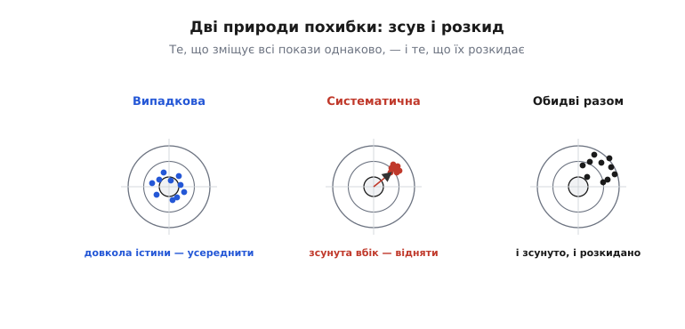
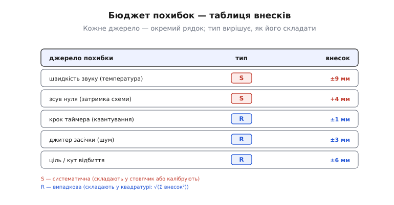
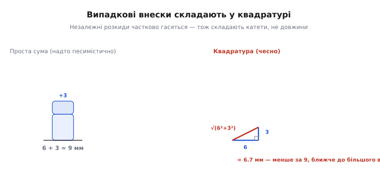
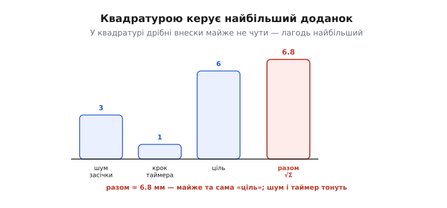

# Бюджет похибок далекоміра

Далекомір показав «1.42 м». Питання, яке вирішує, чи можна цьому числу довіряти: **наскільки воно правдиве?** Це 1.42 ± 1 мм — і тоді апарат може гальмувати за п'ять сантиметрів від стіни? Чи 1.42 ± 20 см — і та сама команда вріже його в стіну, бо насправді до неї було 1.22? Саме число без оцінки своєї похибки — напівправда; інженеру потрібне не «скільки», а «скільки **плюс-мінус скільки**».

Коли ми [розбирали способи виміру відстані](root:embedded/contactless-distance), похибки спливали поодинці: забута двійка у формулі, зсув нуля від затримки електроніки, розкид від шуму засічки, невидима для давача м'яка ціль. Кожну ми бачили окремо, як симптом. Тепер настав час звести їх докупи — не «звідки береться ця похибка», а **скільки їх усіх разом** і як перетворити купу окремих джерел на одне чесне число. Це і є **бюджет похибок** (англ. *error budget* — як кошторис: усі витрати в один стовпчик, щоб бачити підсумок).

## Навіщо рахувати, а не просто «робити точніше»

Спокуса проста: хочеш точніший далекомір — постав дорожчий таймер, швидший приймач, кращу оптику. Та це сліпе вдосконалення майже завжди марнує гроші не там. Бо точність системи визначає **не середній** її вузол, а **найгірший**: можна виміряти час із точністю до пікосекунди, але якщо швидкість звуку гуляє з температурою на три відсотки, ваш дорогий таймер міряє три відсотки брехні дуже точно.

> 🔧 **Навіщо це.** Бюджет похибок — це список, який каже, **куди вкладати зусилля**. Порахувавши всі внески й побачивши, що температура повітря дає 9 мм, а шум таймера — 1 мм, ви вже не чіпаєте таймер: він не вузьке місце. Натомість додаєте термометр і компенсуєте швидкість звуку — і та сама копійчана деталь зменшує похибку вдесятеро. Без бюджету ви вдосконалюєте навмання; з бюджетом — б'єте в найбільший доданок.

Є й друга причина, чесніша. Апарат, що приймає рішення за показом далекоміра — гальмувати, повертати, тримати висоту, — мусить **знати межі свого знання**. «1.42 ± 2 см» означає «безпечно підійти до 5 см»; «1.42 ± 30 см» — «тримайся метра й не ризикуй». Бюджет похибок і є тим документом, що перетворює сирий показ на **показ із довірчим коридором**, на який можна спертися в логіці керування.

## Дві природи похибки: зсув і розкид

Перш ніж щось складати, треба розрізнити, **що** ми складаємо. Усі похибки далекоміра діляться на два роди, і це не формальність, а ключ до всього подальшого: два роди **усуваються по-різному** й **складаються по-різному**.

**Систематична** похибка (грец. *systēma* — складене разом, тут: стале) зсуває **всі** покази в один бік однаково. Ваш давач щоразу показує на 4 мм більше, ніж є, — стабільно, повторювано. Така похибка має причину-зсув: затримку в схемі, неправильно враховану швидкість хвилі, кривий нуль. Її добра риса — **передбачуваність**: якщо вона стала, її можна **виміряти раз і відняти назавжди**. Це і є [калібрування](book:electronics/calibration).

**Випадкова** похибка розкидає покази навколо істини: то трохи більше, то трохи менше, без сталого напрямку. Її джерело — шум: теплове тремтіння в електроніці, дрібні коливання моменту засічки, мерехтіння відлуння. Відняти її не можна — у наступному вимірі вона буде іншою. Зате вона **гаситься усередненням**: десять вимірів, де помилки тягнуть у різні боки, частково компенсують одна одну, і середнє точніше за будь-який окремий показ.


*Дві природи похибки на мішені. **Випадкова** кладе постріли довкола яблучка — купа широка, але центрована; її лікує усереднення. **Систематична** кладе щільну купку, але збоку від центру — стрілець влучний, проте приціл збитий; її лікує віднімання сталого зсуву. Реальний далекомір страждає від обох разом (праворуч): покази і зсунуті, і розкидані.*

Ця сама картинка пояснює, чому плутати два роди — дорого. Усереднити систематичну похибку марно: скільки не міряй збитим прицілом, центр купки лишиться збоку. Калібрувати випадкову теж марно: сьогоднішній зсув завтра буде інакший, і ваша «поправка» стане новою помилкою. Тому перший крок будь-якого бюджету — **рознести кожне джерело за родом**: оце відніму, оце усередню.

## Рядки бюджету: звідки беруться міліметри

Складемо бюджет для конкретного випадку — ультразвукового далекоміра, що міряє відстань за часом польоту. Ми вже знаємо його формулу:

```
d = v · t / 2
```

де `v` — швидкість звуку, `t` — повний час туди-й-назад. Похибка кінцевого `d` збирається з похибок усього, що в цю формулу входить, плюс того, що в неї **не входить, а мало б** (як-от затримка електроніки, що додається до чесного `t`). Пройдімо джерела по черзі — і відразу чіпляймо кожному ярлик: **С** (систематична) чи **В** (випадкова).

**Швидкість звуку гуляє з температурою (С).** Звук не має однієї швидкості — вона залежить від температури повітря. Біля землі залежність майже лінійна:

```
v ≈ 331.3 + 0.606 · T        (м/с, T — температура повітря в °C)
```

Це усталений результат: при 0 °C звук іде ≈ 331 м/с, і кожен градус додає ≈ 0.6 м/с. Якщо ви «зашили» в прошивку v = 343 (значення для +20 °C), а апарат працює холодним ранком при +5 °C, справжня швидкість — лише ≈ 334 м/с, на 2.6 % менша. І весь ваш діапазон бреше на ці 2.6 %.

**Приклад (температура → міліметри на метрі).** Порахуймо, на скільки збреше показ на дистанції 1 м, якщо температура відхилилась від закладених +20 °C на ±15 °C:

```
v(20°C) = 331.3 + 0.606·20 = 343.4 м/с      (закладено в код)
v(5°C)  = 331.3 + 0.606·5  = 334.3 м/с      (насправді)
відносна похибка = (343.4 − 334.3) / 343.4 ≈ 0.0265  →  2.65 %
на дистанції 1000 мм це  ≈ 1000 · 0.0265   ≈ 27 мм
```

Майже три сантиметри на метрі — і це **систематична** похибка: при незмінній температурі вона стала, тож її прибирають, **вимірявши температуру й підставивши правильну v** замість константи. У бюджеті лишиться тільки **залишок** після компенсації — наскільки неточний ваш термометр; візьмемо для прикладу ±9 мм як консервативну оцінку залишку (термометр на ±5 °C плюс градієнт повітря вздовж променя).

**Зсув нуля від затримки схеми (С).** Між командою «шли імпульс» і реальним вильотом звуку, а потім між приходом відлуння й спрацюванням компаратора минає трохи часу — на розгойдування п'єзовипромінювача, на пороги електроніки. Цей зайвий час додається до чесного `t`, і давач щоразу показує на сталу добавку **далі**, ніж є. Це класичний зсув нуля: повторюваний, отже **систематичний**, отже виправний калібруванням по відомій відстані. Залишок після калібрування — скажімо, +4 мм.

**Крок таймера — квантування (В/обмежена).** Час ми міряємо не неперервно, а лічачи такти таймера; між двома сусідніми тактами давач «не бачить» різниці. Це **квантування** (лат. *quantum* — скільки): найдрібніший крок, нижче якого розрізнити неможливо. Він задає тверду нижню межу роздільності. На щастя для звуку вона мізерна: при тактовій 1 МГц один такт — це 1 мкс, а

```
Δd = v · Δt / 2 = 343 · 1×10⁻⁶ / 2 ≈ 0.00017 м ≈ 0.17 мм
```

тобто частка міліметра. Округлимо внесок до ±1 мм. Квантування — не зовсім випадкове (воно обмежене кроком), але в бюджеті його зручно складати разом із випадковими: воно так само дрібно «тремтить» навколо істини.

**Джитер засічки — шум часу (В).** Момент, коли відлуння перетне поріг компаратора, щоразу трохи плаває: відлуння то сильніше, то слабше, поріг ловить його то раніше, то пізніше, плюс електронний шум. Це **джитер** (англ. *jitter* — тремтіння) — чисто **випадкова** похибка часу, що прямо переходить у розкид відстані. Нехай ±3 мм.

**Ціль і кут відбиття (В, найгірший).** Найпідступніше джерело ми вже зустрічали: відлуння залежить від того, **що** і **під яким кутом** відбиває. М'якша ділянка, легкий нахил, шорсткість — і форма відлуння пливе, а з нею пливе й момент засічки. На некооперативній цілі це дає найбільший розкид; покладемо ±6 мм. Формально воно ближче до випадкового (від виміру до виміру міняється), хоча на нерухомій конкретній цілі частина його стає сталим зсувом — ще одна причина калібрувати **на тій поверхні, з якою працюватимеш**.


*Бюджет похибок як кошторис. Кожне джерело — окремий рядок із типом (С — систематична, В — випадкова) і величиною внеску. Тип вирішує долю рядка: систематичні (червоні) калібрують або складають у стовпчик, випадкові (сині) складають у квадратурі. Видно одразу, хто головний: температура серед систематичних, ціль серед випадкових.*

## Як скласти: чому квадратура, а не проста сума

Маємо стовпчик чисел. Перша думка — додати їх усі: 9 + 4 + 1 + 3 + 6 = 23 мм. Але це **неправильно** для випадкових внесків, і неправильно по суті.

Подумаймо, що означало б просто додати випадкові похибки. Це припускало б, що всі вони **одночасно** хибнуть у той самий бік на повну величину: цієї ж секунди і шум таймера тягне на +1, і джитер на +3, і ціль на +6 — усі максимальні й усі в один бік. Але вони **незалежні**: шум таймера нічого не знає про мерехтіння відлуння. Коли один тягне вгору, інший із рівним успіхом тягне вниз — і вони **частково гасяться**. Сумувати їх на повну — це готуватися до збігу, який майже ніколи не стається; вийде число чесне хіба раз на тисячу вимірів, а решту часу безпідставно лякливе.

Правильний спосіб складати незалежні випадкові внески — **у квадратурі** (корінь із суми квадратів, англ. *root sum of squares*, RSS): підносиш кожен до квадрата, додаєш, береш корінь.

```
σ_вип = √(σ₁² + σ₂² + … )
```

Геометрично це та сама теорема Піфагора: незалежні похибки — як перпендикулярні катети, а їхня сукупна дія — гіпотенуза, що **коротша за суму катетів**. Звідси й слово «квадратура»: складаємо площі квадратів, а не довжини сторін.


*Чому квадратура, а не проста сума. Проста сума двох незалежних розкидів (ліворуч, 6 + 3 = 9 мм) припускає, що обидва завжди б'ють у той самий бік на повну, — надто песимістично. Квадратура (праворуч) складає їх як катети прямокутного трикутника: гіпотенуза √(6² + 3²) ≈ 6.7 мм коротша за 9 і помітно ближча до більшого катета. Незалежні похибки частково гасяться — гіпотенуза це й відображає.*

**Приклад (квадратура трьох випадкових внесків).** Складімо наші випадкові рядки — крок таймера ±1, джитер ±3, ціль ±6 мм:

```
σ_вип = √(1² + 3² + 6²) = √(1 + 9 + 36) = √46 ≈ 6.8 мм
```

Проста сума дала б 1 + 3 + 6 = 10 мм. Квадратура — лише 6.8. І зверніть увагу на головне: результат **майже дорівнює найбільшому доданку** (6 мм). Доданки 1 і 3 додали разом якихось 0.8 мм — у квадратурі дрібні внески майже не чути.


*Квадратурою керує найбільший доданок. Три випадкові внески (ціль 6, джитер 3, таймер 1 мм) у квадратурі дають ≈ 6.8 мм — майже ту саму «ціль». Дрібні доданки тонуть: зменшити шум таймера вдвічі майже не зрушить підсумок, а от попрацювати з найбільшим внеском — зрушить одразу. Бюджет показує, де зусилля окупляться.*

Це і є практична мораль бюджету, виражена арифметикою: **дивись на найбільший доданок**. Поки ціль дає ±6 мм, полірувати таймер із ±1 до ±0.5 безглуздо — підсумок зрушить на соті частки міліметра. А от прикрити найбільший внесок (вибрати кращий поріг, додати кооперативну ціль, усереднити кілька пострілів саме на цьому джерелі) — і весь бюджет стискається.

А що з **систематичними**? Їх логіка інша. Що не скомпенсовано, те складають **лінійно й песимістично** (у стовпчик), бо систематичний зсув не «тремтить» і не гаситься — він просто є й тягне в свій бік щоразу. Але краще їх **не складати, а виправляти**: виміряти й відняти. У добре відкаліброваному далекомірі систематична частина зведена до залишків калібрування, і саме ці залишки йдуть у бюджет.

## Зібрати все в одне число

Тепер з'єднаймо обидві половини в підсумковий бюджет. Систематичні внески ми по змозі скомпенсували; те, що лишилось (залишок температурної компенсації ±9 мм і залишок калібрування нуля +4 мм), додаємо до квадратурної суми випадкових. Поширений у практиці підхід — дати дві окремі цифри: випадкову (як вона тремтить від виміру до виміру) і систематичну межу (наскільки результат може бути зсунутий стало), бо лікують їх по-різному. Якщо ж потрібне одне сумарне число «гірше за яке навряд буде», беруть консервативну оцінку:

```
σ_вип        = √(1² + 3² + 6²)        ≈ 6.8 мм      (випадкова, після усереднення спаде)
сума_сист    = 9 + 4                  = 13 мм       (залишкова систематична межа)
повна межа   ≈ сума_сист + 2·σ_вип    ≈ 13 + 14     ≈ 27 мм
```

Множник 2 перед випадковою частиною — це довірчий коридор: ±2σ накриває близько 95 % вимірів (для шуму, близького до нормального — тема [теплового та іншого шуму](root:embedded/noise-interference)). Тобто наш далекомір чесно каже: «показ ± ≈ 27 мм у найгіршому разі, причому ±13 з них — можливий сталий зсув, а ±14 — розкид, який усереднення ще зменшить».

Це число — не вирок, а **карта дій**. Видно, що найбільший випадковий внесок — ціль (6 мм), найбільший систематичний — температура (9 мм). Отже, два конкретні кроки дадуть найбільший виграш: компенсувати швидкість звуку точнішим термометром і приборкати залежність від цілі. Чіпати таймер чи джитер — марнувати час.

## Бюджет у прошивці: показ із похибкою

Бюджет не мусить лишатися на папері — його природне місце в коді поряд із самим виміром. Прошивка може віддавати не голий показ, а **показ разом з оцінкою його похибки**, щоб логіка керування бачила свій довірчий коридор. Ось як це виглядає для нашого ультразвукового далекоміра — з температурною компенсацією швидкості звуку й готовим бюджетом:

```c
#include <math.h>

typedef struct {
    float distance_mm;   // оцінка відстані
    float sigma_mm;      // випадкова невизначеність (1σ)
    float bias_mm;       // межа залишкової систематики
} Range;

// Швидкість звуку від температури: v = 331.3 + 0.606*T  (м/с, T у °C)
static float speed_of_sound(float temp_c) {
    return 331.3f + 0.606f * temp_c;
}

// t_us — виміряний повний час туди-й-назад, мкс; temp_c — температура повітря
Range range_from_tof(uint32_t t_us, float temp_c) {
    Range r;
    float v = speed_of_sound(temp_c);          // м/с — компенсуємо систематику
    float t = t_us * 1e-6f;                     // с
    r.distance_mm = v * t / 2.0f * 1000.0f;     // d = v*t/2, у мм

    // Випадкові внески (мм): таймер, джитер засічки, ціль — у квадратурі
    float s_timer  = 1.0f;
    float s_jitter = 3.0f;
    float s_target = 6.0f;
    r.sigma_mm = sqrtf(s_timer*s_timer + s_jitter*s_jitter + s_target*s_target);

    // Залишкова систематика (мм): неточність термометра + залишок калібрування нуля.
    // Температурний внесок масштабується з відстанню (це % від d).
    float temp_err_pct = 0.9f / 100.0f;         // ±0.9 % від неточності T
    float s_temp = r.distance_mm * temp_err_pct;
    float s_zero = 4.0f;
    r.bias_mm = s_temp + s_zero;                // систематику складаємо лінійно
    return r;
}
```

Зверніть увагу на два рішення, що прямо випливають з усього вище. По-перше, `speed_of_sound(temp_c)` — це **компенсація систематики в дії**: ми не зашиваємо константу 343, а щоразу беремо швидкість під реальну температуру, прибираючи найбільший систематичний внесок ще до формули. По-друге, дві оцінки похибки рознесені: `sigma_mm` (випадкова, у квадратурі) і `bias_mm` (систематична, лінійно) — бо керування поводитиметься з ними по-різному. Випадкову можна стиснути усередненням кількох пострілів; систематичну межу — ні, з нею просто живуть як із межею довіри.

> 🔧 **Навіщо це.** Функція, що повертає `{distance, sigma, bias}` замість голого `float`, — це бюджет, який працює під час польоту. Регулятор висоти, побачивши велику `sigma`, може стати обережнішим або більше усереднити; модуль уникнення перешкод закладе `bias` у запас безпеки до стіни. Давач, який **знає й повідомляє межі свого знання**, безпечніший за «точніший» давач, що мовчки видає одне число.

Як саме звести покази різних давачів — кожен зі своєю похибкою — в одну, ще точнішу оцінку, лишимо темі [фільтра Калмана](root:embedded/kalman-filter): там вага кожного виміру береться **обернено до його похибки**, тож бюджет, який ми тут навчилися рахувати, стає прямим входом у оптимальне поєднання. А якщо хочеться під капот — побачити, звідки взялася сама квадратура й чому внески множаться на «коефіцієнти чутливості» формули, — це окрема [математика поширення похибки](root:embedded/error-budget-ranging/math-error-propagation.md): закон, що з похибок входів дає похибку результату через частинні похідні. Сам же спосіб мислити вимір не числом, а числом-із-коридором народився у великій метрології XX століття й давно став стандартом — коротка [історія від «похибки» до «невизначеності»](root:embedded/error-budget-ranging/hist-gum-uncertainty.md) пояснює, чому інженери перестали казати «точне значення» і почали казати «значення плюс-мінус».

Підсумок простий і носимо його далі через увесь курс давачів: **немає виміру без похибки, і немає чесного виміру без бюджету**. Розклади джерела на рядки, познач кожен — систематичний чи випадковий, перші виправ калібруванням, другі склади в квадратурі, глянь на найбільший доданок — і ти знаєш не лише відстань, а й те, наскільки їй можна вірити, і куди вкласти наступну годину, щоб вірити більше.

---
