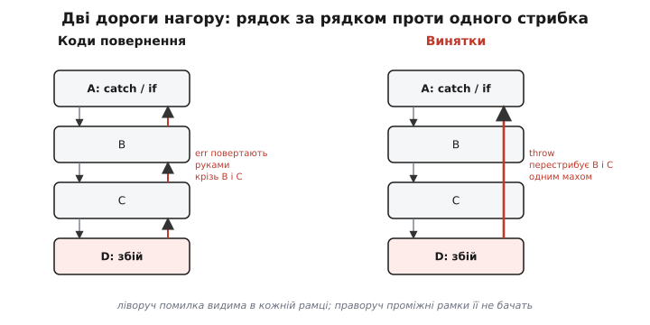
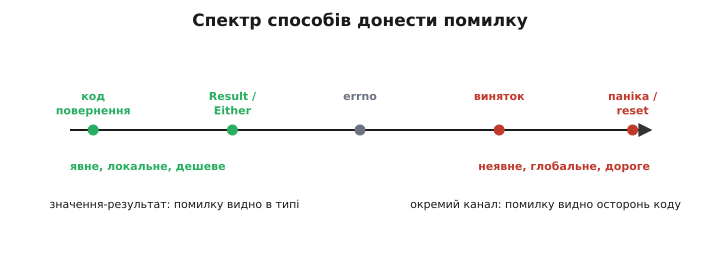
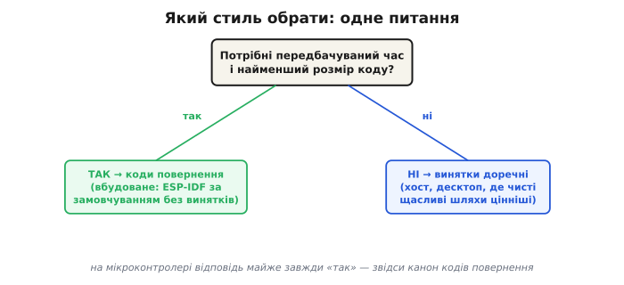

# Коди помилок проти винятків

Кожна функція, яка торкається реального світу, рано чи пізно зазнає невдачі: давач не відповів, файл зник, пам'яті забракло. Питання не в тому, чи помилка станеться, а в тому, **як вона дістанеться до того, хто здатен її обробити**. На це є два принципово різні відповіді, і вибір між ними формує весь вигляд коду — його швидкість, розмір і читабельність. Перший спосіб — **код помилки** (англ. *error code*, числова ознака результату): функція повертає звичайне значення, а викликач сам дивиться, добре воно чи зле. Другий — **виняток** (англ. *exception*, від латин. *exceptio* — «вилучення», тут: вихід зі звичайного шляху виконання): функція не повертає нічого, а «викидає» помилку, що сама летить угору стеком, доки хтось її не впіймає.

Різниця глибша, ніж синтаксис. Це різниця в тому, **де живе помилка** — у потоці звичайних значень чи в окремому, невидимому каналі керування.

## Код повернення: помилка тече разом із даними

У стилі кодів повернення помилка — це таке саме значення, як і будь-яке інше. Функція або віддає корисний результат, або віддає ознаку біди, і обидва йдуть тим самим шляхом — через `return`. У чистому C інакше й не буває: мова винятків не має взагалі, тож кожна бібліотечна функція повертає статус, а викликач **зобов'язаний його перевірити руками**. ESP-IDF будує на цьому весь свій інтерфейс: майже все повертає `esp_err_t`, де `ESP_OK` дорівнює нулю, а будь-яке інше значення — конкретна помилка.

Сила цього підходу — у **чесності**. Помилка стоїть прямо в типі результату: глянувши на сигнатуру `esp_err_t i2c_master_read(...)`, ви бачите чорним по білому, що ця операція може провалитися. Її не можна не помітити, читаючи код, — вона в кожному рядку, де є виклик. І коштує вона рівно стільки, скільки одне порівняння: перевірити, чи повернене значення дорівнює нулю. Жодної прихованої машинерії, жодної магії за лаштунками.

Слабкість — рівно зворотний бік тієї ж медалі. Помилку **легко проґавити**: компілятор у C не змусить вас глянути на повернене значення, тож рядок `i2c_master_read(...)` без перевірки скомпілюється мовчки й поїде далі на тому, чого немає. І ще: помилку доводиться нести нагору **руками, рамка за рамкою**. Якщо функція `A` кличе `B`, та кличе `C`, а збій стається в `C`, то код помилки треба явно повернути з `C`, перевірити в `B`, повернути з `B`, перевірити в `A` — на кожному щаблі. Проміжні функції, яким до цієї помилки байдуже, все одно мусять її проводжати. Звідси багатослівність: щасливий шлях (коли все добре) тоне в перевірках невдач.

> 🔧 **Навіщо це.** На мікроконтролері кожна периферійна операція ненадійна за природою — шина буває зайнята, давач відвалюється, тайм-аут спрацьовує. Код повернення робить цю ненадійність **видимою в типі**: ви фізично не можете покликати `i2c_master_read` і вдати, що вона не повертає `esp_err_t`. ESP-IDF навіть дає макроси, щоб перевірка не була нудною: `ESP_ERROR_CHECK(x)` падає одразу, коли результат не `ESP_OK`, а `ESP_RETURN_ON_ERROR(x)` тихо повертає помилку нагору. Те, що помилку треба тримати в руках, — не ваду, а спосіб не дати їй [замовкнути](topic:programming/error-handling).

## Виняток: помилка летить понад проміжними рамками

Виняток ламає саме цю логіку «рамка за рамкою». Коли в `C` стається біда, код пише `throw` — і помилка не повертається в `B`, а **перестрибує** і `B`, і `C`, летячи прямо до найближчого `try…catch`, хоч би де він був угорі стека. Проміжні функції про неї навіть не знають: їхній код пишеться так, ніби невдачі не існує.

Це дає головну перевагу винятків — **чисті щасливі шляхи**. Тіло функції містить лише корисну логіку, без жодної перевірки на кожному кроці; уся обробка помилок зібрана в одному місці — у блоці `catch`. Замість десятка `if (err != ESP_OK) return err;`, розкиданих по коду, маєш один блок, що ловить будь-яку біду з усього шматка. Код читається як опис того, **що має статися, коли все добре**, а не як перелік усього, що може зламатися.



*Один ланцюг викликів A→B→C→D у двох стилях. Ліворуч код помилки повертається нагору рядок за рядком: B і C мусять його провести, навіть якщо їм байдуже. Праворуч `throw` із D перестрибує B і C одним махом до `catch` у A — проміжні рамки помилку не бачать. Звідси і головна вигода винятків (чисті проміжні функції), і головна їх вада (невидимий потік керування).*

За цю чистоту платять **прихованим потоком керування**. Дивлячись на виклик `b()` усередині функції, ви не бачите, чи вилетить звідти виняток, що промине весь ваш код і вискочить нагору. Будь-який рядок стає **точкою потенційного виходу**, а які саме — не написано ніде. Те, що в кодах повернення стояло явно (`return err`), тут стає невидимим. Для великої програми на хості це часто прийнятна ціна за чистоту; на мікроконтролері, де треба точно знати кожен шлях виконання, невидимі гілки — серйозна вада.

## Чому ціна винятків інша

Окрім читабельності, у винятків є фізична ціна — і вона розподілена нерівно. Сучасні C++ винятки реалізовано за моделлю **zero-cost** (англ. «нульова вартість», від Itanium C++ ABI): доки виняток не кинуто, він **не коштує майже нічого**. Компілятор виносить усю машинерію розкрутки в окремі таблиці поза гарячим шляхом, тож щасливий шлях біжить так само швидко, як і без винятків. Назва, щоправда, лукава: «нуль» стосується лише часу виконання, але самі таблиці займають місце у Flash, і код програми стає більшим.

Уся ціна спалахує **в момент `throw`**. Коли виняток кинуто, починається **розкрутка стека** (англ. *stack unwinding*): середовище виконання йде стеком викликів назад від місця збою до місця `catch`, по дорозі коректно знищуючи всі локальні об'єкти кожної покинутої функції. Це не одне порівняння, а складна процедура з читанням тих самих таблиць — і вона **на порядки повільніша**, ніж просте повернення коду помилки. На пристрої, де реакція має вкластися в передбачуваний час, така раптова й змінна затримка — отрута: ти не знаєш наперед, скільки триватиме розкрутка, бо це залежить від глибини стека й кількості об'єктів на ньому.


*Куди подівся кошт. Коди повернення коштують одне порівняння — і коли все добре, і коли стався збій: вузькі рівні смуги. Винятки на щасливому шляху ще дешевші (zero-cost — майже нульова смуга), але `throw` запускає розкрутку стека, і смуга вартості злітає до краю. Коди розмазують маленьку ціну рівно; винятки переносять усю ціну на момент помилки.*

Є й третій кошт — **пам'ять**. Коли виняток летить, його об'єкт десь має жити; якщо купа порожня, ESP-IDF тримає на цей випадок аварійний резервний пул RAM. Плюс сам кинутий виняток з'їдає трохи додаткового стека (близько двохсот байтів) у момент розкрутки. На пристрої з лічених кілобайтів RAM кожен такий кілобайт — на рахунку.

> 🔧 **Навіщо це.** Саме через цю трійцю — більший Flash, непередбачуваний час розкрутки та зайвий RAM — у вбудованій розробці винятки зазвичай **вимкнені**. В ESP-IDF підтримка C++ винятків **вимкнена за замовчуванням**; увімкнути її можна окремою опцією в menuconfig (`CONFIG_COMPILER_CXX_EXCEPTIONS`), але рідко варто. Детермінованість і малий розмір коду переважують зручність чистих щасливих шляхів. Тому канон вбудованого C/C++ простий: функція повертає `esp_err_t`, викликач [перевіряє кожне повернення](topic:programming/error-handling).

## Той самий код у двох стилях

Візьмемо одну операцію — прочитати конфігурацію з NVS (англ. *non-volatile storage*, енергонезалежна пам'ять ESP32) — і запишемо її обома способами. Логіка одна: відкрити сховище, прочитати значення, закрити.

**Стиль кодів повернення (ESP-IDF, як є):**
```c
esp_err_t load_config(uint32_t *out_value) {
    nvs_handle_t h;
    esp_err_t err = nvs_open("cfg", NVS_READONLY, &h);
    if (err != ESP_OK) {
        return err;                       // не відкрилось — повертаємо як є
    }

    err = nvs_get_u32(h, "value", out_value);
    if (err != ESP_OK) {
        nvs_close(h);                     // ВАЖЛИВО: закрити навіть на помилці
        return err;
    }

    nvs_close(h);
    return ESP_OK;
}
```
Помилка видима в кожному рядку, ціна — два порівняння. Але впадає в око слабке місце: `nvs_close(h)` доводиться кликати **двічі** — на щасливому шляху й окремо в гілці помилки. Забудеш одне закриття — і дескриптор сховища тече. Щасливий шлях («відкрив, прочитав, закрив») загубився серед перевірок.

**Стиль винятків (C++, якби вони були ввімкнені):**
```cpp
uint32_t load_config() {
    NvsHandle h("cfg", NVS_READONLY);     // кине виняток, якщо не відкрилось
    return h.get_u32("value");            // кине виняток, якщо не прочиталось
}                                         // деструктор h закриє сховище САМ
```
Тіло — це чистий опис щасливого шляху, три рядки замість дванадцяти. Обробки помилок тут немає взагалі — її винесено нагору, до того, хто кликав `load_config`, у єдиний `catch`. Подвійного закриття теж немає: деструктор об'єкта `h` закриє сховище автоматично, **хоч би функція вийшла нормально, хоч би через виняток** — це ідіома RAII (англ. *resource acquisition is initialization*, «отримання ресурсу є ініціалізація»), де звільнення ресурсу прив'язане до знищення об'єкта, тож виходить воно за будь-яким шляхом.

Контраст чесний: версія з винятками **читабельніша** й безпечніша щодо ресурсів, версія з кодами — **прозоріша** й дешевша. Перша ховає, де саме може вилетіти помилка; друга кричить про це в кожному рядку, але тоне в багатослів'ї. Для коду на хості часто виграє перша; для прошивки, де ціна й передбачуваність вирішують, — друга.

## Спектр, а не двійка

Між «голим кодом повернення» і «повноцінним винятком» лежить ціла смуга проміжних способів донести помилку, і варто бачити її цілою.

На найтихішому кінці — **код повернення**: явний, локальний, дешевий, легко проґавити. Трохи далі — **тип-результат** `Result` чи `Either` (як у Rust): та сама ідея «помилка — це значення», але загорнута в тип, що **змушує** з помилкою щось зробити, перш ніж дістатися корисного значення. Це поєднує чесність кодів повернення з тим, що їх **не можна мовчки зігнорувати**. Ще далі — стиль **errno** (англ. *error number*, «номер помилки»): функція повертає лише «вдалося / ні», а подробицю кладе в окрему змінну збоку. Спосіб старий і підступний: errno **виставляється при невдачі, але не обнуляється при успіху**, тож перевіряти його треба зразу після виклику й тільки якщо повернене значення вже натякнуло на біду, — інакше прочитаєш стару помилку від попередньої операції. На гучному кінці — **виняток** і, за ним, [паніка з перезапуском](topic:programming/assert-panic), коли працювати далі взагалі небезпечно.



*Способи донести помилку, від найлокальнішого до найглобальнішого. Ліворуч — значення-результати (код повернення, Result/Either): помилку видно прямо в типі, ціна мала. Праворуч — окремі канали (виняток, паніка): помилку видно осторонь звичайного коду, ціна й «дальність стрибка» більші. errno стоїть посередині як гібрид: повертає лише «вдалося / ні», а подробицю кладе вбік. Вибір — не «коди чи винятки», а точка на цій смузі.*

## Коли що

Правило просте, якщо дивитися на головну вимогу. **Потрібен передбачуваний час і найменший розмір коду — бери коди повернення** (на мікроконтролері це майже завжди так). **Час і розмір не критичні, а цінніша чистота й безпека ресурсів — винятки доречні** (типово хост, десктоп, серверний код). Між ними, де хочеться чесності кодів без ризику їх проґавити, добре лягають типи-результати на кшталт `Result`.



*Який стиль обрати — одне кореневе питання. Якщо потрібні передбачуваний час і найменший код (вбудоване), відповідь — коди повернення; ESP-IDF за замовчуванням саме без винятків. Якщо ні (хост, десктоп), винятки доречні, бо чисті щасливі шляхи цінніші за дрібний кошт розкрутки. На мікроконтролері відповідь майже завжди «так» — звідси канон кодів повернення.*

Вибір стилю поширення помилки — це лише як **донести** збій до того, хто його обробить. Окреме й не менш важливе рішення — на якому **рівні гучності** взагалі реагувати: тихо повернути код, гучно зупинитися [assert'ом чи панікою](topic:programming/assert-panic), чи перевірити припущення наперед [захисним програмуванням](topic:programming/defensive-programming), щоб збій не стався взагалі. Стиль поширення й рівень реакції — дві різні осі одного питання: як зробити так, щоб жоден збій не їхав далі непоміченим.

---
