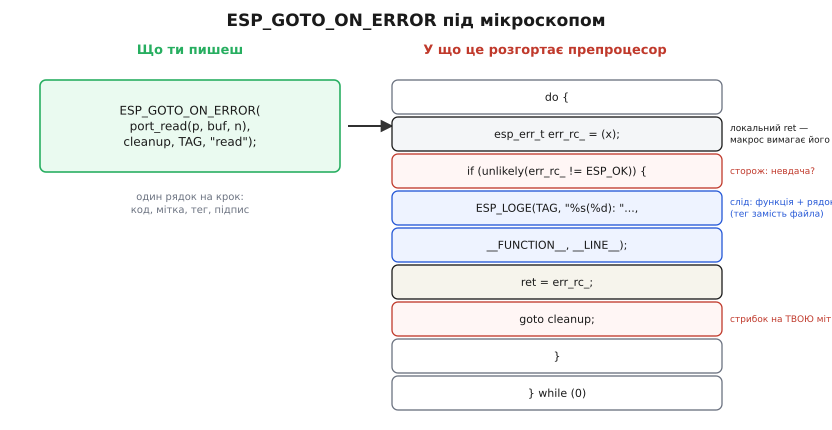
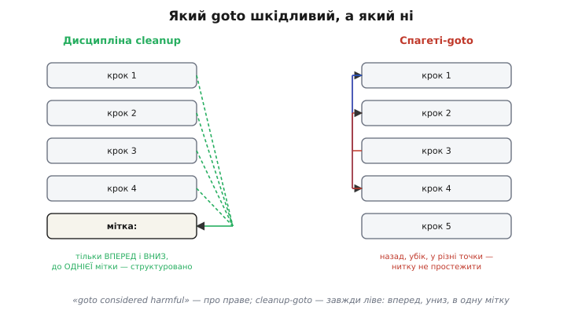

# ⚙️ Сходи cleanup і макроси ESP-IDF у живому коді

У [темі про патерни поширення](root:embedded/error-propagation-patterns) ми вже домовилися про головне: жодна гілка помилки не звільняє ресурси сама — усі стрибають до однієї мітки `cleanup` наприкінці функції, де звільнення зібране в одному місці й виконується у зворотному до захоплення порядку. Там само ми побачили, що ESP-IDF дає на цей патерн готовий макрос `ESP_GOTO_ON_ERROR`, який поєднує сторожа, лог і стрибок. Тепер розберемо це до кінця: **що саме розгортає препроцесор**, коли ти пишеш цей макрос; **як виглядає чесна функція на чотирьох взаємозалежних ресурсах**; і **чому `goto` тут — добра практика**, попри найвідоміший лист в історії програмування, що оголосив його шкідливим.

Це не повтор теми, а її дно. Тема дала каркас; цей розбір показує живе м'ясо — рядок у рядок, з пастками, об які б'ється кожен, хто пише так уперше.

### Задача

Уяви типову функцію ініціалізації вузла на мікроконтролері. Щоб запрацював, скажімо, логер на SD-картку, треба по черзі **захопити чотири ресурси, і кожен залежить від попереднього**:

1. **відкрити порт** шини (SPI під картку) — без нього нікуди;
2. **виділити буфер** під сектор — у динамічній пам'яті, бо на стек завеликий;
3. **примонтувати файл** на картці — поверх уже відкритого порту;
4. **захопити м'ютекс**, що боронить файл від інших задач, — поверх усього.

Будь-який крок може провалитися: порт зайнятий, пам'яті нема, картки нема, м'ютекс не створився. І ось ключове: якщо впав **третій** крок, треба прибрати за **двома** вже захопленими — і нічого більше. Якщо впав четвертий — за трьома. А ще звільняти треба **у зворотному порядку**: спершу відпустити м'ютекс, тоді відмонтувати файл, тоді віддати буфер, тоді закрити порт. Бо файл сидить на порту, а м'ютекс боронить файл — зняти основу раніше за надбудову означає смикнути килим з-під ніг тому, хто на ньому ще стоїть.

Наївний код, що чесно прибирає в кожній гілці помилки окремо, ми вже бачили в темі: звільнення двоїться, троїться, росте квадратично, і четвертий ресурс перетворює функцію на мінне поле, де один забутий `free` тече лише на тій рідкісній гілці, якої ніхто не тестував. Задача цього розбору — написати ту саму функцію **так, щоб забути звільнення було неможливо**, і зробити це двома способами: спершу руками, голим `goto`, щоб бачити кожну шестерню; потім макросом ESP-IDF, що ховає ту саму механіку під один рядок.

### Ідея

Уся ідея тримається на одному спостереженні, яке робить решту безпечною: **звільнення можна викликати на ресурсі, який не захоплений, — якщо це звільнення вміє безпечно нічого не робити з «порожнім» значенням.**

Звідси випливає весь патерн. Якщо на початку функції **всі вказівники й дескриптори обнулити**, а звільнення зробити **безпечним для нульового значення**, то мітка `cleanup` може звільняти **геть усе підряд** — і захоплене, і незахоплене. Незахоплене лежить нульовим, його звільнення — пустишка, нічого поганого не станеться. Захоплене звільниться по-справжньому. І тоді **байдуже, на якому кроці ми впали**: стрибок завжди веде в ту саму мітку, що чесно проходить по всіх ресурсах згори вниз і звільняє лише ті, які встигли стати ненульовими.

Це переносить тягар з «пам'ятай, що саме треба прибрати на цій конкретній гілці» (де людина помиляється) на «звільнення кожного ресурсу саме знає, чи його взяли» (де помиляється лише той, хто написав одне звільнення, — і один раз). Стандартна бібліотека C тут сама йде назустріч: **`free(NULL)` за стандартом — узаконена пустишка**, нічого не робить і не падає (це гарантує C, розділ про `<stdlib.h>`). Тож виділений буфер, який лишився `NULL`, безпечно проходить через `free` без жодної перевірки. Для решти ресурсів — порту, файла, м'ютекса — ми або покладаємося на таку саму властивість їхнього закриття, або ставимо коротку перевірку `if (handle) ...` перед ним.

Друга половина ідеї — **локальна змінна `ret`**. Сторож, що стрибає на `cleanup`, мусить кудись покласти код помилки, бо сам `return` буде вже після мітки, один на всі шляхи. Тому заводимо `esp_err_t ret = ESP_OK;` на початку, кожен збій пише в неї свій код перед стрибком, а єдиний `return ret;` наприкінці віддає його нагору. На щасливому шляху `ret` так і лишається `ESP_OK` — ми просто доходимо до мітки природним плином і повертаємо успіх. Мітка `cleanup` обслуговує **і збій, і успіх** однаковісінько: різниця лише в тому, що `ret` несе.

Отже, рецепт цілком: **(1)** усі ресурси оголосити й обнулити вгорі; **(2)** завести `ret = ESP_OK`; **(3)** кожен крок — захопити, перевірити сторожем, при невдачі покласти код у `ret` і `goto cleanup`; **(4)** під міткою звільнити всі ресурси у зворотному порядку, кожне звільнення безпечне для нульового значення; **(5)** `return ret`. Тепер напишімо це.

### Робочий код: чотири ресурси голим goto

Спершу — руками, без жодного макроса, щоб кожна шестерня була на видноті. Це справжній код під ESP-IDF: `esp_err_t` як тип помилки, реальні виклики відкриття порту, монтування, м'ютекса FreeRTOS.

```c
#include "esp_err.h"
#include "esp_log.h"
#include "freertos/FreeRTOS.h"
#include "freertos/semphr.h"
#include <stdlib.h>

static const char *TAG = "logger";

esp_err_t logger_open(logger_t *lg)
{
    // (1) ВСІ ресурси — оголосити й ОБНУЛИТИ. Це і робить cleanup безпечним:
    //     незахоплене лишиться нульовим, і його звільнення стане пустишкою.
    esp_err_t        ret  = ESP_OK;          // (2) локальний код для всіх гілок
    spi_port_t      *port = NULL;
    uint8_t         *buf  = NULL;
    sd_file_t       *file = NULL;
    SemaphoreHandle_t mtx = NULL;

    // (3) Захоплення по черзі; кожен крок — сторож, що при невдачі стрибає вниз.

    port = spi_port_open(SPI2_HOST);
    if (port == NULL) {                       // порт зайнятий або не налаштований
        ret = ESP_ERR_NOT_FOUND;
        ESP_LOGE(TAG, "spi_port_open failed");
        goto cleanup;                         // нічого ще не взято — cleanup пройде вхолосту
    }

    buf = malloc(SECTOR_SIZE);
    if (buf == NULL) {                        // купа вичерпана
        ret = ESP_ERR_NO_MEM;
        ESP_LOGE(TAG, "malloc(%d) failed", SECTOR_SIZE);
        goto cleanup;                         // звільнить лише port; buf і далі NULL
    }

    file = sd_fopen(port, "/log.bin");        // файл — ПОВЕРХ відкритого порту
    if (file == NULL) {
        ret = ESP_ERR_NOT_FOUND;
        ESP_LOGE(TAG, "sd_fopen failed");
        goto cleanup;                         // звільнить buf і port; file ще NULL
    }

    mtx = xSemaphoreCreateMutex();            // м'ютекс — боронить уже наявний файл
    if (mtx == NULL) {                        // нема пам'яті під об'єкт м'ютекса
        ret = ESP_ERR_NO_MEM;
        ESP_LOGE(TAG, "xSemaphoreCreateMutex failed");
        goto cleanup;                         // звільнить file, buf, port
    }

    // Дійшли сюди — усе захоплено. Віддаємо назовні й виходимо ЩАСЛИВО,
    // але через ТУ САМУ мітку: ret лишився ESP_OK, тож звільнення не буде.
    lg->port = port;
    lg->buf  = buf;
    lg->file = file;
    lg->mtx  = mtx;
    return ESP_OK;                            // власник переданий — НЕ чіпаємо cleanup

cleanup:
    // (4) Звільнення у ЗВОРОТНОМУ до захоплення порядку. Кожне безпечне для NULL,
    //     тож хоч на якому кроці впали — пройдемо всі, звільнимо лише взяте.
    if (mtx)  vSemaphoreDelete(mtx);          // останній узятий — перший звільнений
    if (file) sd_fclose(file);                // файл — раніше за порт, на якому він сидить
    free(buf);                                // free(NULL) безпечний — перевірка зайва
    if (port) spi_port_close(port);           // порт — в останню чергу, основа всього
    return ret;                               // (5) єдиний код помилки нагору
}
```

Зупинімося на тонкому місці, яке збиває з пантелику новачків: **щасливий шлях тут виходить через `return ESP_OK;` ДО мітки, а не через неї**. Це навмисно. Коли всі чотири ресурси захоплені й передані власникові (`lg`), ми **не хочемо** їх звільняти — навпаки, вони мусять жити далі, у структурі логера. Тому на повному успіху ми коротко повертаємо `ESP_OK`, обходячи `cleanup`. Мітка ж обслуговує **лише** провали (і той вироджений «успіх», коли функція нічого нікуди не передає). Це поширений варіант патерну: коли ресурси на успіху **переходять у власність** того, хто кликав, успішний вихід їх **не чіпає**.

Є й інший, теж законний, стиль: провести `ret` аж до мітки **завжди**, а звільняти під міткою лише те, що **не передали** назовні (для цього на успіху обнуляють локальні копії: `port = NULL; buf = NULL; ...`, щоб `cleanup` пройшов по них вхолосту). Обидва підходи дають той самий результат; перший читабельніший, коли успіх передає все, другий — коли під міткою є й спільна для успіху-й-збою робота (закрити тимчасовий файл, скинути прапорець). Бери той, що чесніше показує намір.

Тепер пройдімо очима всі п'ять гілок виходу й переконаймося, що **кожна звільняє рівно те, що треба, і нічого зайвого**:

- **Порт не відкрився** → `goto cleanup`, де `mtx`, `file`, `buf` усі `NULL`, а `port` теж `NULL`. Усі чотири звільнення — пустишки. Витоку нема, бо й брати не встигли.
- **Буфер не виділився** → `port` уже ненульовий, решта `NULL`. У `cleanup`: `mtx`, `file` — пустишки, `free(NULL)` — пустишка, `spi_port_close(port)` — **справжнє закриття**. Звільнили рівно порт.
- **Файл не відкрився** → `port` і `buf` ненульові. Звільнили буфер і порт, у правильному порядку.
- **М'ютекс не створився** → захоплені `port`, `buf`, `file`. Звільнили файл, буфер, порт — знизу вгору.
- **Усе вдалося** → вийшли через `return ESP_OK` до мітки; ресурси живуть у `lg`. `cleanup` не виконувався.

П'ять різних шляхів — і **жоден рядок звільнення не дубльований**. Додай п'ятий ресурс — допишеш один рядок захоплення зі своїм сторожем і один рядок звільнення в `cleanup`, і всі шляхи виходу одразу його врахують. Саме цього ми й домагалися.



*Один виклик `ESP_GOTO_ON_ERROR(port_read(...), cleanup, TAG, "read")` препроцесор розгортає в загорнуте у `do{}while(0)` тіло: оголошує локальний `err_rc_`, перевіряє його сторожем (`unlikely` підказує компілятору, що збій — рідкість), при невдачі друкує слід із `__FUNCTION__` і `__LINE__`, кладе код у твою змінну `ret` і стрибає на твою мітку `cleanup`. Тег у лозі стоїть замість імені файла — самого файла макрос не друкує.*

### Робочий код: те саме через макроси ESP-IDF

Ручний варіант показав усю механіку, але в ньому видно й набридливе повторення: на кожен крок — сторож, лог, запис у `ret`, стрибок. Чотири рядки рутини, де відрізняється лише виклик і підпис. Саме цю рутину ESP-IDF згортає у свої макроси з заголовка `esp_check.h`. Ось та сама функція, переписана ними:

```c
#include "esp_check.h"
#include "freertos/FreeRTOS.h"
#include "freertos/semphr.h"
#include <stdlib.h>

static const char *TAG = "logger";

esp_err_t logger_open(logger_t *lg)
{
    esp_err_t        ret  = ESP_OK;          // макроси GOTO вимагають саме цього імені — ret
    spi_port_t      *port = NULL;
    uint8_t         *buf  = NULL;
    sd_file_t       *file = NULL;
    SemaphoreHandle_t mtx = NULL;

    // ESP_GOTO_ON_FALSE(умова, код, мітка, тег, підпис):
    //   умова хибна → лог + ret = код + goto мітка.
    port = spi_port_open(SPI2_HOST);
    ESP_GOTO_ON_FALSE(port, ESP_ERR_NOT_FOUND, cleanup, TAG, "spi_port_open");

    buf = malloc(SECTOR_SIZE);
    ESP_GOTO_ON_FALSE(buf, ESP_ERR_NO_MEM, cleanup, TAG, "malloc %d", SECTOR_SIZE);

    file = sd_fopen(port, "/log.bin");
    ESP_GOTO_ON_FALSE(file, ESP_ERR_NOT_FOUND, cleanup, TAG, "sd_fopen");

    mtx = xSemaphoreCreateMutex();
    ESP_GOTO_ON_FALSE(mtx, ESP_ERR_NO_MEM, cleanup, TAG, "create mutex");

    lg->port = port; lg->buf = buf; lg->file = file; lg->mtx = mtx;
    return ESP_OK;                            // успіх передає власність — повз cleanup

cleanup:
    if (mtx)  vSemaphoreDelete(mtx);
    if (file) sd_fclose(file);
    free(buf);
    if (port) spi_port_close(port);
    return ret;
}
```

Тіло функції стало вдвічі коротшим, а наміри — прозорішими: кожен рядок читається як «захопи це; як не вийшло — на вихід із цим кодом». Але макрос — це не магія, і поки ти не знаєш, **у що** він розгортається, він небезпечний: помилка в одній із його прихованих вимог дасть невиразну ваду компіляції або, гірше, тиху ваду виконання. Тож розгорнімо його буквально.

**`ESP_GOTO_ON_ERROR(x, goto_tag, log_tag, format, ...)`** — для виклику, що повертає `esp_err_t`. Препроцесор (перевірено по `esp_check.h`, гілка без «мовчазного» прапорця) розгортає його так:

```c
do {
    esp_err_t err_rc_ = (x);                          // обчислити вираз РІВНО раз
    if (unlikely(err_rc_ != ESP_OK)) {                // сторож: збій?
        ESP_LOGE(log_tag, "%s(%d): " format,          // слід: функція + рядок + твій підпис
                 __FUNCTION__, __LINE__, ##__VA_ARGS__);
        ret = err_rc_;                                 // ← ПИШЕ У ЗМІННУ ret (твою!)
        goto goto_tag;                                 // ← СТРИБАЄ НА ТВОЮ мітку
    }
} while (0)
```

Кожна деталь тут навмисна, і кожну варто зрозуміти:

- **`do { ... } while (0)`** — класична обгортка макроса-«інструкції». Вона робить так, що макрос поводиться як один оператор: його можна писати з крапкою з комою, і він коректно ляже в `if (...) ESP_GOTO_ON_ERROR(...); else ...` без жодних сюрпризів із дужками. Без неї голий блок `{ ... }` зламав би таку конструкцію, а гола послідовність операторів — поготів. Це загальновідома ідіома C саме для багаторядкових макросів.
- **`esp_err_t err_rc_ = (x);`** — вираз `x` обчислюється **рівно один раз** і кладеться в локальну (приховану від тебе) змінну. Це критично: якби макрос двічі підставляв `x`, то виклик `ESP_GOTO_ON_ERROR(do_thing(), ...)` виконав би `do_thing()` двічі. Збереження в локальну змінну прибирає цю пастку повторного обчислення раз і назавжди.
- **`unlikely(...)`** — підказка компіляторові (через `__builtin_expect`), що ця гілка спрацьовує **рідко**. На щасливому шляху помилок нема, тож процесор не марнує передбачення переходів на гілку збою. Це і є та сама «безкоштовність на щасливому шляху», про яку ми казали в темі: макрос на успіху — це буквально одне порівняння з нулем плюс натяк «сюди майже ніколи».
- **`ESP_LOGE(log_tag, "%s(%d): " format, __FUNCTION__, __LINE__, ...)`** — ось що саме логує макрос. Формат починається з `"%s(%d): "`, куди підставляються **`__FUNCTION__`** (ім'я функції, де стався збій) і **`__LINE__`** (номер рядка), а далі йде **твій** підпис (`format` плюс його аргументи). Тег (`log_tag`) друкує сам `ESP_LOGE` своїм звичаєм — він стоїть на початку рядка лога. Зверни увагу на **важливу деталь**, яку часто переказують неточно: **імені файла макрос не друкує** — у рядку лога є тег, функція й номер рядка, але не шлях до файла. Тег фактично й заміняє файл: за усталеним звичаєм ESP-IDF один тег належить одному модулю-файлу, тож пара «тег + рядок» однозначно вказує на місце.
- **`ret = err_rc_;`** — ось чому функція **зобов'язана** мати локальну змінну саме з іменем `ret`. Макрос пише код помилки в неї буквально, без жодної гнучкості. Назвеш свою змінну `rc` чи `status` — і код просто не скомпілюється («`ret` undeclared»). Це не вада, а контракт: макрос навмисно жорсткий, щоб усі функції в кодовій базі виглядали однаково.
- **`goto goto_tag;`** — стрибок на мітку, чиє ім'я ти передав другим аргументом. Тобто мітка `cleanup` (чи як ти її назвеш) **мусить існувати** в тій самій функції, інакше — помилка компіляції «label used but not defined».

Поряд живе **`ESP_GOTO_ON_FALSE(a, err_code, goto_tag, log_tag, format, ...)`** — той самий патерн, але перевіряє не код, а **умову**. Він зручний саме для `malloc`/`open`, що повертають не `esp_err_t`, а вказівник (де «успіх» = «не `NULL`»), і для перевірки аргументів. Його розгортання простіше — без локального `err_rc_`, бо коду помилки нема, ти задаєш його сам:

```c
do {
    if (unlikely(!(a))) {                  // умова хибна?
        ESP_LOGE(log_tag, "%s(%d): " format, __FUNCTION__, __LINE__, ##__VA_ARGS__);
        ret = err_code;                    // код, ЯКИЙ ТИ ВКАЗАВ
        goto goto_tag;
    }
} while (0)
```

Саме тому у версії з макросами вище ми скрізь узяли `ESP_GOTO_ON_FALSE`: усі чотири захоплення повертають вказівник, і «вдалося» означає «не `NULL`».

Є й **`return`-родина** для функцій без ресурсів, де прибирати нічого й стрибати нікуди: **`ESP_RETURN_ON_ERROR(x, log_tag, format, ...)`** просто `return err_rc_;` замість стрибка, а **`ESP_RETURN_ON_FALSE(a, err_code, log_tag, format, ...)`** — `return err_code;`. Вони не вимагають ні `ret`, ні мітки — і саме їх ми бачили в темі на пласкій функції-драйвері без ресурсів. Вибір між родинами простий: **є що звільняти → `GOTO`-родина зі спільною міткою; нема → `RETURN`-родина**.

> 🔧 **Навіщо це.** Знати розгортання макроса — не академічна примха, а захист від трьох конкретних бід. Перша: забудеш оголосити `ret` або назвеш її інакше — і `GOTO`-макрос не скомпілюється з туманним «`ret` undeclared» десь усередині розкритого макроса, де його важко зчитати. Друга: забудеш мітку — «label used but not defined». Третя, найгірша, **тиха**: подумаєш, що `ESP_RETURN_ON_ERROR` сам прибере ресурси (він же «розумний макрос»!), а він просто `return` — і ресурс протече. Макрос розумний рівно настільки, наскільки ти розумієш, **що** він робить. Розгорни його подумки — і він стає прозорим інструментом, а не чорною скринькою, якій довіряєш на віру.

### Тихий реліз: прапорець CONFIG_COMPILER_OPTIMIZATION_CHECKS_SILENT

У темі ми кинули, що промовистість поширення **безкоштовна на щасливому шляху й вимикається, коли треба**. Ось як саме вона вимикається. У релізній збірці кожен рядок логування з'їдає байти Flash: і сам формат-рядок, і ім'я функції (`__FUNCTION__` — це теж рядок-літерал у пам'яті), і код виклику `ESP_LOGE`. На крихітному мікроконтролері сотні таких рядків по кількох драйверах складаються у відчутні кілобайти.

ESP-IDF дає прапорець конфігурації **`CONFIG_COMPILER_OPTIMIZATION_CHECKS_SILENT`**. Коли він увімкнений, ті самі макроси розгортаються **без логування взагалі** — лишається гола перевірка й стрибок (перевірено по `esp_check.h`, «мовчазна» гілка):

```c
// той самий ESP_GOTO_ON_ERROR, але з CONFIG_..._CHECKS_SILENT:
do {
    esp_err_t err_rc_ = (x);
    if (unlikely(err_rc_ != ESP_OK)) {
        ret = err_rc_;            // НІЯКОГО ESP_LOGE — рядки-літерали не потрапляють у Flash
        goto goto_tag;
    }
} while (0)
```

Логіка поведінки **не змінилася ні на йоту**: помилка так само поширюється нагору, ресурси так само прибираються. Зник лише слід у лозі. Тобто ти пишеш код один раз із промовистими макросами, а **рішення «лишати сліди чи ні» приймаєш одним прапорцем при збірці** — у відладному образі сліди є, у фінальному їх вирізано разом із кілобайтами рядків. Це і є та «безкоштовність»: на щасливому шляху макрос завжди лише порівняння з нулем, а ціну в пам'яті за повідомлення про збій ти платиш або не платиш свідомо, не переписуючи жодного рядка.

### ISR-версії: чому в перериванні інший лог

Окрема пастка чекає там, де ці макроси хочеться вжити **всередині оброблювача переривання** (ISR). Звичайний `ESP_LOGE` для цього **непридатний**: дорога функція логування бере блокування, форматує рядок, штовхає його в чергу — усе те, чого в ISR робити **не можна**, бо переривання має бути коротким і не сміє блокуватися (ту саму дисципліну «коротко в ISR, важке поза ISR» ми бачили в [роботі з перериваннями](book:programming/isr)). Викличеш звичайний макрос у перериванні — і в найкращому разі дістанеш зіпсований вивід, у гіршому — зависання чи паніку.

Тому ESP-IDF дублює всю родину **ISR-варіантами з суфіксом `_ISR`**: `ESP_RETURN_ON_ERROR_ISR`, `ESP_RETURN_ON_FALSE_ISR`, `ESP_GOTO_ON_ERROR_ISR`, `ESP_GOTO_ON_FALSE_ISR` (а ще `ESP_RETURN_VOID_ON_ERROR_ISR` і `ESP_RETURN_VOID_ON_FALSE_ISR` — для ISR, що повертають `void`). Розгортаються вони так само, з однією-єдиною заміною: замість `ESP_LOGE` — **`ESP_EARLY_LOGE`**:

```c
// ESP_GOTO_ON_ERROR_ISR — те саме тіло, але «ранній» лог, безпечний в ISR:
do {
    esp_err_t err_rc_ = (x);
    if (unlikely(err_rc_ != ESP_OK)) {
        ESP_EARLY_LOGE(log_tag, "%s(%d): " format,   // ← EARLY, не звичайний LOGE
                       __FUNCTION__, __LINE__, ##__VA_ARGS__);
        ret = err_rc_;
        goto goto_tag;
    }
} while (0)
```

`ESP_EARLY_LOGE` — це «ранній» логер: він пише напряму, синхронно, без черг і блокувань, минаючи звичайний механізм (його, до речі, використовують і на ранньому старті, **до** того, як підніметься повноцінне логування, — звідси й назва «early»). У звичайному коді його не беруть, бо він блокує, поки виштовхує символи; але в ISR саме ця прямота й рятує — він нічого не чекає. Правило просте й залізне: **код у перериванні → `_ISR`-варіант; код поза перериванням → звичайний.** Переплутаєш — дістанеш або тихо зіпсований лог, або заблоковане переривання.

### Чому goto тут — добра практика, а не гріх

Тепер прямо в очі найвідомішому заперечення. Кожен, хто бачить `goto` в C, згадує гасло «**goto considered harmful**» — і має рацію бути насторожі. Та варто знати, **звідки** воно й **проти чого** насправді спрямоване.

У березні 1968 року Едсґер Дейкстра (нідерландський інформатик) надіслав до журналу *Communications of the ACM* короткого листа. Сам він назвав його «A Case Against the Go To Statement» («Доказ проти оператора goto»), але редактор журналу — **Ніклаус Вірт** (швейцарець, згодом автор мови Pascal) — переназвав публікацію в «**Go To Statement Considered Harmful**», і саме під цим заголовком вона стала чи не найцитованішим текстом в історії програмування (це усталений історичний факт, підтверджений і самим Дейкстрою в пізніших згадках, і ретроспективами). Лист поклав початок **структурному програмуванню**.

Але проти **чого** він був? Прочитаймо суть, а не заголовок. Дейкстра виступав проти **довільного** `goto` — стрибка будь-куди, вперед і назад, усередину циклів і блоків, що плете «спагеті»: код, де потік керування стрибає так хаотично, що **неможливо, дивлячись на текст, сказати, як програма дійшла до даної точки**. Його точний аргумент був про це: безконтрольний `goto` руйнує відповідність між статичним текстом програми й динамічним станом її виконання — ти не можеш подумки відстежити, «де я й як я сюди потрапив». Ось що шкідливо.

А тепер подивися на наш `goto cleanup` цими очима. Він:

- **завжди вперед** — мітка стоїть наприкінці функції, жоден стрибок не йде назад;
- **завжди вниз, до однієї-єдиної мітки** — нема розгалуження «куди саме стрибнути», ціль одна на всю функцію;
- **ніколи не входить усередину блоку чи циклу** — лише виходить із поточного місця до спільного епілогу;
- **локальний** — не покидає функцію, не плутає кілька функцій між собою.

Це **протилежність** спагеті. Потік керування лишається цілком простежуваним: будь-який `goto cleanup` означає рівно одне — «припинити роботу й піти прибирати». Дивлячись на мітку, ти точно знаєш, **звідки** в неї приходять (з будь-якого сторожа вище) і **куди** вона веде (до `return`). Відповідність тексту й виконання, яку боронив Дейкстра, тут **не порушена** — навпаки, посилена: один вихід замість розкиданих по тілу `return` зі звільненням у кожному.



*Те, проти чого був лист Дейкстри, — праворуч: стрибки назад, убік, у різні точки, де нитку керування не простежити. Наш cleanup-goto — ліворуч: завжди вперед, завжди вниз, завжди до однієї мітки наприкінці функції. Структуру це не руйнує, а посилює — один вихід замість розкиданих звільнень.*

Більше того — у C це чи не **єдиний** чистий спосіб дати те, що C++ дає сам собою. У C++ працює **RAII** (англ. *Resource Acquisition Is Initialization*, «захоплення ресурсу — це ініціалізація»): ресурс загорнуто в об'єкт, чий **деструктор** викликається автоматично, щойно об'єкт виходить за межі видимості — на будь-якому шляху виходу, хоч через `return`, хоч через виняток. Програмістові C++ не треба ні мітки, ні `goto`: компілятор сам уплітає звільнення в кожен вихід. Ту саму ідіому RAII ми згадували в [розборі кодів проти винятків](root:embedded/error-codes-vs-exceptions/detail) як головну перевагу C++ у прибиранні ресурсів.

У C деструкторів нема. Нема механізму, що сам викликав би `free` на виході зі скоупа. Тому **`goto cleanup` — це RAII, зібраний руками**: ми вручну будуємо ту єдину точку, куди сходяться всі виходи й де відбувається звільнення, бо мова не зробить цього за нас. Дивлячись так, `goto cleanup` — не порушення структурного програмування, а **відновлення** його гарантії («один вхід, один вихід») у мові, що сама цю гарантію не дає. Лінукс-ядро, чи не найбільша й найперевіреніша кодова база на C, користується саме цим патерном повсюдно — і недарма.

### Складність і пастки

Патерн простий на вигляд, але об кожну з його тонкощів хтось та й розбив собі лоба. Пройдімо їх по черзі — усі реальні, усі з конкретним механізмом біди.

- **`ret` неініціалізований — мовчазний випадковий код.** Найпідступніша вада. Якщо оголосити `esp_err_t ret;` **без** `= ESP_OK` і піти щасливим шляхом аж до мітки (у стилі, де успіх теж проходить через `cleanup`), то `return ret;` поверне **сміття зі стека** — байти, що там випадково лежали. Функція то «спрацьовує», то «падає» залежно від того, що було в пам'яті, — і це не відтворюється під відладником. Лік один: **`ret` ініціалізуй `ESP_OK` одразу при оголошенні**. Тоді щасливий шлях природно несе успіх, а збій перезаписує його своїм кодом.

- **Мітка після `return` — стрибок у мертвий код або помилка компіляції.** Якщо помилково поставити безумовний `return` **перед** міткою `cleanup` так, що до мітки не лишається жодного шляху, окрім `goto`, компілятор у кращому разі попередить «label defined but not used» (якщо й `goto` десь загубився) або згенерує код, який ніколи не звільняє на успіху. Гірший варіант — мітка опинилася в недосяжному місці, і частина звільнень просто не виконується на тому шляху, де ти на них розраховував. Завжди перевіряй очима: **до мітки `cleanup` веде і кожен `goto`, і природний плин зі щасливого шляху** (або, якщо успіх іде повз неї через ранній `return`, — що цей ранній `return` справді передав власність усіх ресурсів).

- **Подвійне звільнення — звільнив, але не обнулив.** Класична біда, якщо ресурс звільняють **не** в `cleanup`, а десь у тілі (скажімо, тимчасовий буфер віддали раніше), і **забувають обнулити** вказівник. Тоді `cleanup` дійде до того ж `free(buf)` і звільнить уже звільнене — *double free*, що псує купу й валить програму непередбачувано, часто **далеко** від місця вади. Правило, що знімає це назавжди: **звільнив — одразу обнули** (`free(tmp); tmp = NULL;`). Тоді повторне звільнення в `cleanup` стане безпечною пустишкою (`free(NULL)`). Власне, уся безпека патерну й тримається на інваріанті «нульовий вказівник = не захоплено»; порушиш його — впаде.

- **Забутий `goto` на ранній гілці — тихий витік.** Дзеркало до головного: десь у тілі є рання перевірка, що при невдачі робить голий `return ret;` **замість** `goto cleanup;`, — і цей вихід **не прибирає** вже захоплене. Особливо легко проскакує, коли ранню перевірку дописали **пізніше**, вже після того, як вище захопили ресурс. Функція працює, тести зеленіють — а на тій рідкісній гілці тихо тече дескриптор. Лік дисциплінарний: **щойно у функції захоплено бодай один ресурс, усі подальші виходи — лише через `cleanup`**, жодного голого `return` нижче першого захоплення. (До першого захоплення голий `return` ще законний — прибирати нема чого, як у `port` найпершим кроком.)

- **`goto` через оголошення зі скоупом — пастка C++ і причепливих компіляторів C.** `goto`, що перестрибує через **ініціалізацію змінної**, у C++ — помилка компіляції, а в C дає змінну з невизначеним значенням після мітки. Тому всі ресурси оголошують **угорі, до першого `goto`** (як ми й зробили) — щоб жоден стрибок не перестрибував повз їхню ініціалізацію. Це ще одна причина «обнули все вгорі»: не лише задля безпечного `cleanup`, а й щоб не стрибати через оголошення.

- **Подвійне обчислення у наївному саморобному макросі.** Якщо хтось, надихнувшись, напише **власний** макрос-сторож і **забуде** заховати вираз у локальну змінну — `#define CHECK(x) if ((x) != ESP_OK) goto cleanup` — то виклик `CHECK(do_work())` підставить `do_work()` у `(x)` **двічі**: раз на перевірку, раз… ну, тут один раз, але варто вкласти макрос у щось хитріше — і подвійний виклик гарантовано вистрілить. ESP-IDF-макрос саме тому й кладе `x` у `err_rc_` **раз**. Мораль: пишеш свій макрос — **обчислюй вираз рівно один раз** і **загортай у `do{}while(0)`**, інакше відтворюєш помилки, від яких бібліотечні макроси давно застраховані.

- **Звільнення в неправильному порядку — звалив основу раніше за надбудову.** Якщо в `cleanup` написати звільнення **в тому ж** порядку, що й захоплення (порт → буфер → файл → м'ютекс), то закриєш порт, на якому ще сидить відкритий файл, перш ніж закриєш сам файл. Залежно від реалізації це або тихо зіпсує дані, або впаде при спробі дописати буфер на вже закритий порт. **Зворотний порядок не косметика, а вимога коректності** там, де ресурси залежать один від одного. Пиши `cleanup` знизу вгору відносно захоплення — і звіряй, що це справді протилежний порядок, а не «приблизно».

Зведімо. `goto cleanup` (і його обгортки `ESP_GOTO_ON_*`) дають у C те, чого мова не дає сама, — **гарантію, що за помилкою приберуть так само надійно, як за успіхом, і рівно один раз**. Уся конструкція тримається на трьох простих інваріантах, які треба берегти свідомо: **`ret` ініціалізована `ESP_OK`**; **незахоплене лежить `NULL`, а звільнення безпечне для `NULL`**; **після першого захоплення кожен вихід — лише через мітку, у зворотному порядку звільнення**. Дотримай їх — і чотири взаємозалежні ресурси прибираються самі собою за будь-якого збою. Порушиш бодай один — і дістанеш точнісінько ту ваду, від якої патерн мав урятувати: витік, подвійне звільнення або випадковий код помилки. А макроси ESP-IDF — це лише та сама ручна механіка, згорнута в один рядок і споряджена слідом у лозі; знаючи їхнє розгортання, ти володієш інструментом, а не довіряєш чорній скриньці.
