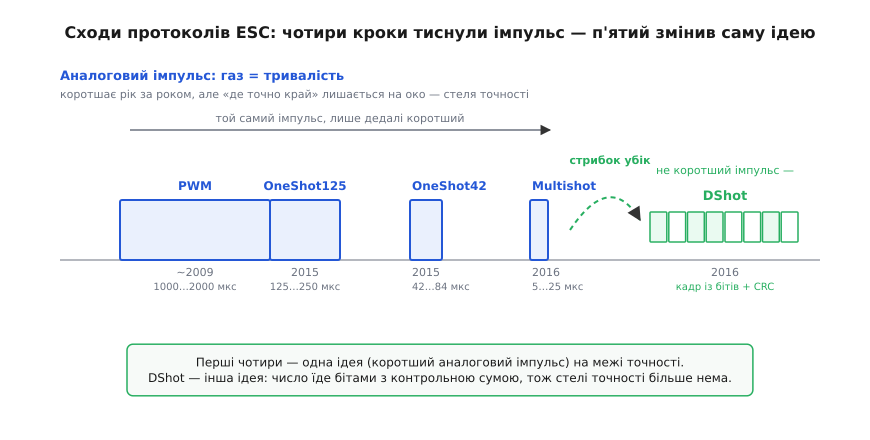

# 📜 Як спільнота гонщиків винайшла цифровий газ

У [самій темі](root:embedded/esc-bldc-driver) ми вже бачили дві мови, якими контролер говорить з регулятором: старий аналоговий PWM, де газ несе ширина імпульсу, і цифровий DShot, де газ їде кадром із бітів та контрольною сумою. Будову кадру ми розібрали. Лишилося найцікавіше питання, на яке схема не відповідає: **звідки взявся цей кадр?** Хто сів і вирішив, що газ треба слати не імпульсом, а числом? І чому це зробили не інженери великої компанії з відділом стандартів, а кілька людей, що ввечері після роботи паяли гоночні квадрокоптери й сварилися на форумах?

Це не дрібниця історії «для повноти». Те, **як** народився DShot, пояснює, **чому** він саме такий — з контрольною сумою, з відкритою специфікацією, з тим самим проводом для зворотного зв'язку. Винахід завжди несе на собі відбиток тих, хто його зробив, і тих проблем, які їх допекли. Тож розкрутімо цю історію від самого вузла — від того, що саме перестало влаштовувати людей десь у 2014–2015 роках.

## Що було до цифри: газ як довжина імпульсу

Щоб відчути проблему, треба згадати, з чим жили перші гонщики. Мова газу тоді була одна — той самий **класичний RC-імпульс**, який ми знаємо з [узгодження сигналів](root:embedded/output-mixing): контролер вистрілює короткий імпульс, і його **ширина** — від 1000 до 2000 мікросекунд — і є газ. Цю мову ESC не вигадав, а **успадкував** від радіокерованих моделей: так керували сервомашинками ще задовго до дронів, і коли з'явилися перші регулятори, вони навмисне «прикинулися» серво, щоб їх розумів будь-який наявний приймач. Зручно для сумісності — але родовий спадок ніс у собі дві вади, на які моделі літачка дивилися крізь пальці, а гоночний квадрокоптер дивитися не міг.

Перша вада — **повільність**. Кадр такого сигналу повторювався лише близько 50 разів на секунду, тобто газ оновлювався раз на 20 мілісекунд. Літачкові цього вистачало з головою: він великий, інертний, його ніхто не просить смикнутися за мить. А квадрокоптер — це принципово **нестійка** штука, яку тримає в повітрі лише швидке безперервне підрулювання. Чим частіше контролер встигає поправити газ кожного мотора, тим гостріше й чистіше летить апарат. Стеля в 50 поправок на секунду тиснула гонщиків згори, мов низька стеля кімнати.

Друга вада тонша, і саме вона зрештою все вирішила — сигнал був **аналоговий**. Газ жив у ширині імпульсу, а ширину доводиться **вимірювати**, і будь-яке вимірювання тривалості шумить. Кожен сантиметр дроту, кожна холодна пайка, кожна наводка від силових проводів поряд трохи спотворювали виміряну ширину — і ESC бачив газ із дрібною похибкою, яка ще й тремтіла від кадру до кадру. Це дрижання (англ. *jitter*) додавало моторам ледь чутного «бруду» в обертах.

> 🔧 **Навіщо це.** Саме ці дві вроджені вади — повільність і дрижання — і є та сверблячка, від якої чухалася ціла спільнота. Тримайте їх у голові: кожен наступний крок історії — це спроба позбутися спершу однієї, потім другої. DShot переміг тому, що зняв обидві разом, а не латав по черзі.

І була ще третя морока, дрібніша, але дратівлива щодня, — **калібрування**. Бо «1000 мікросекунд = стоп, 2000 = повний газ» — це лише домовленість, а кожен ESC розумів краї діапазону трохи по-своєму. Тож перед польотом регулятор доводилося **калібрувати**: вмикати на повному газі, щоб він «запам'ятав» верх, потім на нулі — щоб запам'ятав низ. Забув відкалібрувати після зміни апаратури — і мотори або не дають повної тяги, або стартують ривком. Аналоговій мові бракувало спільної точки відліку, і латали це руками щоразу.

## Перша спроба: зробити імпульс коротшим (OneShot)

Першими за вади взялися не виробники, а **аматорські розробники прошивок** — ті самі люди, що писали відкритий код для контролерів і регуляторів. І перша їхня думка була найприроднішою: якщо повільно, бо кадр довгий, — зробімо кадр **коротшим**.

Так близько 2015 року з'явився **OneShot125**. Ідею втілив **Фелікс Нісен** (нім. *Felix Niessen*) — німецький розробник, засновник марки **Flyduino** і її лінійки контролерів та регуляторів **KISS** (англ. *Keep It Super Simple* — «лиши все простим до краю»); його ім'я ще не раз промайне в цій історії. Назва промовиста: *one shot* — «один постріл». Замість того щоб слати імпульс за власним повільним розкладом, контролер вистрілював рівно **один** імпульс на кожен свій цикл керування — і той самий газ міг оновлюватися стільки разів на секунду, скільки контролер устигав думати.

Заразом імпульс **стиснули** ушестеро-увосьмеро: замість 1000–2000 мікросекунд OneShot125 укладав той самий газ у 125–250 мікросекунд (звідси й «125» у назві). Коротший імпульс — менше часу на кадр — швидше оновлення. Сверблячка повільності трохи попустила.

Та придивіться уважно, **що саме** змінилося. Імпульс став коротший і частіший — але газ і далі жив у **його ширині**. Це був той самий аналоговий принцип, лише стиснутий. А отже друга, тонша вада нікуди не поділася: ширину так само доводилося вимірювати, вона так само шуміла. Ба гірше — що коротший імпульс, то **дошкульніше** б'є по ньому той самий шум: на 1000 мікросекундах наводка в кілька мікросекунд — дрібниця, а на 125 мікросекундах та сама наводка — вже помітна частка газу. Розв'язавши повільність, OneShot непомітно **загострив** дрижання.

## Глухий кут: коротшати вже нікуди (OneShot42, Multishot)

Спільнота, проте, відчула смак — і пішла тим самим шляхом далі, наче під ухил. Якщо коротший імпульс — це швидше, то ще коротший — ще швидше, хіба ні?

З'явився **OneShot42** — той самий Flyduino/Фелікс Нісен стиснув кадр до 42–84 мікросекунд. Потім марка **RaceFlight** (інша гілка прошивок) випустила **Multishot** із імпульсом усього **5–25 мікросекунд** — майже вдесятеро коротшим за OneShot125, з оновленням до 32 тисяч разів на секунду. На папері — тріумф: швидкість, про яку на старому 50-герцовому PWM і мріяти не випадало.

Але саме тут стеля, від якої тікали, **впала на голову**. Бо всі ці протоколи лишалися тим самим аналоговим імпульсом, лише дедалі коротшим, — а отже несли в собі ту саму вроджену ваду, тепер уже в загостреній формі. Коли корисний імпульс — лише кілька мікросекунд, то наводка від силових проводів, дзвін на пайці, відбиття в кепському дроті стають **зіставними з самим сигналом**. Multishot славився тим, що на брудному залізі чи довгих проводах поводився капризно: формально найшвидший, а на практиці вимагав майже лабораторної чистоти монтажу, інакше мотори знову «брудніли». Спільнота вперлася в природну межу: **точність аналогового імпульсу скінченна**, і що сильніше тиснеш на швидкість, то ближче край.

*Сходи, що вели в глухий кут. Чотири перші кроки — PWM, OneShot125, OneShot42, Multishot — це **одна й та сама ідея**: газ як тривалість аналогового імпульсу, що лише дедалі коротшає. Швидкість росте — але точність аналогового вимірювання лишається скінченною, і Multishot уже шкребе цю стелю. DShot — не наступна сходинка, а **стрибок убік**: газ перестає бути тривалістю й стає числом із бітів із контрольною сумою. Стелі точності для нього більше нема.*

Ось у чому ключ цієї історії, і його легко проґавити: **проблема була не в довжині імпульсу, а в самій ідеї нести газ довжиною чогось.** Скільки той імпульс не коротшай, ти лишаєшся в полоні аналогового вимірювання з його шумом. Вийти можна було тільки **вбік** — відмовитися від імпульсу як носія взагалі. До цієї думки спільнота дозріла десь до середини 2016 року, перепробувавши всі способи стиснути імпульс і вперевшись у те, що далі вже нікуди.

## Поворот убік: а що, як слати не імпульс, а число?

Розв'язок, як часто буває, лежав поряд — у сусідній галузі того самого аматорського світу. Ті самі люди, що паяли дрони, чіпляли на них **адресні світлодіодні стрічки** — модні стрічки на чипах **WS2812**, де кожному світлодіодові колір задають не аналоговим рівнем, а **цифровим кадром із бітів**, що біжить по одному проводу. Одиниці й нулі там кодують не рівнем напруги, а **тривалістю високого рівня в кожному біті**: довгий високий — це «1», короткий — це «0». Один провід, чіткі біти, жодного аналогового вимірювання рівня.

І хтось поставив очевидне, заднім числом, питання: а чому газ ми женемо аналоговим імпульсом, коли поряд на тому самому залізі біти їздять чудово? Що, як слати ESC **не імпульс, ширину якого треба міряти, а число — послідовність бітів**, як по будь-якій цифровій шині?

Це і був той самий стрибок убік. Щойно газ стає числом із бітів, обидві вроджені вади аналогової мови **просто зникають**, а не послаблюються:

- Число або прочиталося правильно, або ні — проміжного «трохи спотвореного газу» немає. Дрижання ширини як поняття зникає: біт — це біт.
- Раз газ — це точне ціле в умовлених межах (як ми бачили в темі, 11 бітів = значення від 0 до 2047), то **спільна точка відліку вбудована в сам протокол**. Калібрувати краї руками більше нема потреби: «повний газ» — це конкретне число, однакове для всіх.
- А до кадру можна **дописати кілька бітів контрольної суми** (CRC), щоб ESC сам ловив спотворення в дорозі. Аналоговий імпульс такого не вміє в принципі: він не може «знати», що його ширину перекосив шум, — і мовчки везе хибний газ. Цифровий кадр носить у собі перевірку власної чесності.

Останнє — найважливіше і саме те, чого аналоговій мові бракувало від народження. **Контрольна сума зняла стелю точності**, в яку вперлися всі OneShot'и й Multishot. Бо тепер боротьба йшла не за те, щоб виміряти ширину дедалі точніше (програшна гонитва), а лише за те, щоб **відрізнити нуль від одиниці** — а це цифрова техніка робить надійно навіть на брудному залізі. Газ або доходить точним до останнього біта, або відкидається цілим кадром, і ESC лишається на попередньому значенні замість слухатися шуму.

> 🔧 **Навіщо це.** Запам'ятайте цей поворот як зразок інженерного мислення: коли вперлися в стелю, оптимізуючи щось (коротший імпульс), іноді виграш не в наступній сходинці, а в **зміні самої величини**, якою ви міряєте задачу. Газ перестав бути «тривалістю» й став «числом» — і вся гонитва за точністю виміру тривалості раптом утратила сенс. Це повторюється в інженерії знов і знов.

## Хто це зробив: відкритий винахід спільноти

Тепер про дійових осіб — бо це, мабуть, найприкметніша частина історії. У DShot **немає одного винахідника** й немає компанії-власника. Це колективний відкритий винахід кількох людей зі спільноти гонок від першої особи (англ. *FPV* — *first-person view*, керування з виду «очима дрона» через відеоокуляри), що зійшлися навколо відкритих прошивок. Імена варто назвати точно — без жодної національної міфології, лише за тим, що видно у відкритих записах розробки.

**Фелікс Нісен** (*Felix Niessen*) — той самий автор OneShot із Flyduino/KISS — і **закинув ідею** цифрового протоколу. У публічному обговоренні розробки прямо записано, що задум «закинув Фелікс, а також його раніше незалежно обмірковували в колі дописувачів Betaflight». Тобто думка визріла не в одній голові, а в спільноті майже водночас — класична ознака того, що час ідеї настав. Фелікс не лише запропонував, а й одразу дав **робочу прошивку** для свого регулятора KISS24A, щоб було на чому випробувати, і саме він описав перший робочий кадр: одинадцять бітів газу, біт запиту телеметрії, чотири біти контрольної суми — рівно та будова, яку ми розібрали в темі.

**Betaflight** — відкрита прошивка контролерів, на якій усе це зрослося. Її свого часу започаткував **Борис Б** (*Boris B*, повне ім'я в коді — *borisbstyle*) з Нідерландів, відгалузивши Betaflight від іншого відкритого проєкту, Cleanflight (а той своєю чергою заклав **Домінік Кліфтон**, *Dominic Clifton*, з Британії). Назва «Beta» — від того, що проєкт був майданчиком обкатати нове швидше за стабільні гілки; кращого місця для зухвалого нового протоколу годі й шукати. Сам Борис не писав першого коду DShot, але **звів усе докупи**: під його орудою зміну розглянули, довели до пуття й влили в прошивку.

А руками першу, ще «сиру», реалізацію в код Betaflight зробив дописувач під іменем **blckmn** (*Martin Budden*, Мартін Бадден). Восьмого жовтня 2016 року він відкрив зміну до Betaflight, чесно підписавши її «найперший **неперевірений** начерк лише **для обговорення**», — і там-таки віддав належне Феліксові як авторові ідеї. Десятьма днями пізніше, вісімнадцятого жовтня, Борис Б цю зміну влив. До листопада 2016-го про новий протокол уже говорили публічно як про щось робоче, а в наступне велике видання Betaflight (гілку 3.1) DShot увійшов як штатна можливість для широкого загалу.

> 📜 **Статус доказовості.** Дати й імена тут — **усталений факт**: вони лишилися в публічних записах розробки відкритих проєктів (обговорення зміни до Betaflight від 8 жовтня 2016, вливання 18 жовтня, порівняння протоколів від 31 серпня 2016, де DShot уже згадано як цифровий) і збігаються між кількома незалежними джерелами. Атрибуція ідеї — «закинув Фелікс Нісен, паралельно обмірковували дописувачі Betaflight» — теж зафіксована дослівно в самому обговоренні, а не реконструйована згодом.

Окрему ниточку треба згадати про **прошивку самих регуляторів**. Контролер може слати які завгодно гарні біти — та зрозуміти їх мусить мозок ESC. Тут ключову роль зіграла відкрита прошивка регуляторів **BLHeli** і її версія **BLHeli_S**, яку веде **Стеффен Скауг** (*Steffen Skaug*). Він додав до BLHeli_S розуміння DShot — і саме завдяки цьому регулятори **різних виробників**, що крутили цю спільну відкриту прошивку, заговорили новою цифровою мовою однаково. Так складається повна картина відкритого винаходу: ідея й кадр (Фелікс Нісен, KISS), реалізація на боці контролера (Мартін Бадден, Борис Б та інші дописувачі Betaflight), розуміння на боці регулятора (Стеффен Скауг, BLHeli_S). Жодна ланка не належить компанії; кожна — відкрита й доступна всім.

## Чому це зробили аматори, а не велика компанія

Лишилося питання, що крутиться в голові від самого початку: чому такий розумний і потрібний протокол народила **спільнота гонщиків-аматорів**, а не виробник із інженерним відділом? Адже регулятори обертів роблять і великі фірми не один десяток років.

Відповідь — у тому, як влаштовані стимули. Велика компанія, що продає регулятори, **не страждала** від наших двох вад так гостро. Її клієнт — найчастіше моделіст літачка чи вертольота, де 50-герцового PWM вистачає, а сумісність зі старою апаратурою цінніша за останній відсоток гостроти керування. Міняти усталений протокол — це ризик, витрати, несумісність зі своїм-таки старим товаром і чужими приймачами. Раціональний виробник тримається того, що працює й продається.

А спільнота гонок від першої особи опинилася рівно там, де ця стеля **боліла найдужче**. Гоночний квадрокоптер — це вершина вимог до швидкості й чистоти керування: тут кожен зайвий мілісекундний відсоток дрижання чути в польоті, а нестійка машина живе лише найгострішим підрулюванням. Ці люди були водночас і **користувачами**, яким нестерпно муляло, і **розробниками** відкритих прошивок, що могли самі полізти в код і все змінити. Збіг гострого болю з можливістю його вилікувати **власноруч** — ось формула, через яку винахід стався в гаражах і на форумах, а не в конструкторському бюро.

І відкритість тут не випадкова, а **вбудована в спосіб** народження. Якби DShot вигадала одна фірма, він був би її закритим перевагою-фішкою — несумісною з чужим залізом, замкненою на її товар. А що його зробила спільнота на відкритому коді, він одразу став **спільним надбанням**: специфікація відкрита, будь-який виробник міг її підтримати, регулятори різних марок заговорили нею однаково з першого дня. Те, що сьогодні DShot розуміє ледь не будь-який серйозний регулятор незалежно від марки, — пряме породження саме цього способу винаходу. Закритий протокол однієї компанії такого поширення майже певно не дістав би.

## Що з цього лишилося нам

Озирнімося на пройдений шлях — він короткий, але повчальний. Спершу газ був тривалістю успадкованого від моделізму імпульсу: сумісно, але повільно й дрижить. Спільнота гонщиків спробувала вилікувати повільність, **стискаючи** цей імпульс — OneShot125, OneShot42, Multishot, — і вперлася в природну стелю: аналогове вимірювання тривалості скінченно точне, і що коротший імпульс, то дошкульніший шум. Вихід знайшовся не в наступному стисканні, а в **повороті вбік**: газ перестав бути тривалістю чогось і став **числом із бітів** із контрольною сумою — за зразком сусідніх адресних світлодіодів. Так у 2016 році кілька людей зі спільноти FPV — Фелікс Нісен подав ідею й кадр, Мартін Бадден і Борис Б утілили її в Betaflight, Стеффен Скауг навчив їй регулятори через BLHeli_S — створили DShot, відкритий і нічийний.

Коли тепер у [самій темі](root:embedded/esc-bldc-driver) ви дивитеся на кадр DShot — одинадцять бітів газу, біт телеметрії, чотири біти контрольної суми — за кожним його шматком стоїть конкретний біль, який він гоїть. Контрольна сума — це пам'ять про дрижання, в яке вперлися всі OneShot'и. Газ як точне число — це кінець ручному калібруванню країв. А самий вибір бітового кадру замість імпульсу — це той стрибок убік, на який спромоглися саме ті, кого аналогова стеля муляла найдужче й хто водночас тримав у руках відкритий код, щоб її зламати. Протокол вийшов саме таким, бо такими були люди й проблеми, що його народили, — і в цьому весь сенс знати його історію, а не лише його будову.
