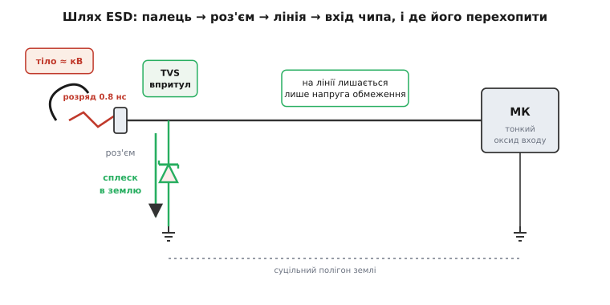
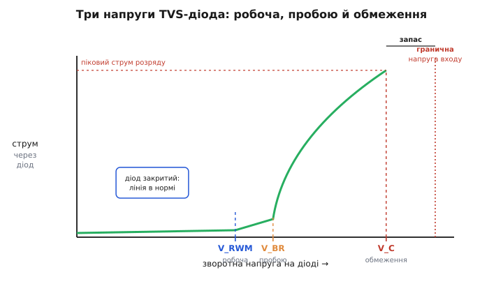
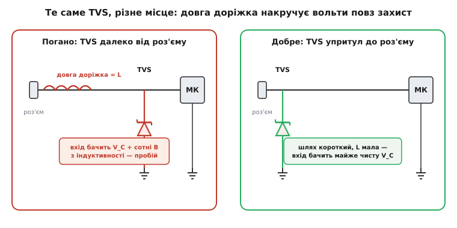

# ESD-захист у схемах

<preknowlist>
- [Заряд тіла](topic:physics/body-charge) — як людина, пройшовши по килиму, набирає на собі кілька кіловольтів статики й не відчуває цього, поки не торкнеться металу.
</preknowlist>

Ми вже навчили вхід плати тримати удар із кількох боків: [не пускати струм при переплутаній полярності](root:embedded/reverse-polarity), гасити викид від [індуктивного навантаження](root:embedded/inductive-clamp-design), зрізати повільну перенапругу [каскадом захисту](root:embedded/surge-protection-cascade). Усі ці загрози приходили туди, де ми їх чекали, — на провід живлення. Лишилася найшвидша, найвища за напругою й найпідступніша за місцем удару: **електростатичний розряд** (*ESD, electrostatic discharge*, від гр. *statikós* — «нерухомий»). Він б'є не лише по живленню, а по **будь-якому виводу, до якого може дотягтися палець чи штекер** — кнопці, роз'єму USB, контакту картки, сигнальній лінії. І робить це за частку наносекунди напругою в кілька кіловольтів.

Розберімо спершу, **чому** ESD потребує окремого захисту, хоча перенапругу ми вже вміємо гасити, а тоді — яким елементом і за яким правилом його ставити.

### Чому ESD — не «ще одна перенапруга»

Здавалося б: перенапруга є перенапруга, поставив діод на землю — і нехай зрізає будь-який сплеск. Але ESD відрізняється від усього, що ми гасили досі, трьома речами одночасно, і саме їх поєднання робить його окремою задачею.

Перше — **звідки він береться**. Тіло людини, пройшовши по килиму чи знявши светр, [набирає кілька кіловольтів](topic:physics/body-charge) статичного заряду — і не відчуває цього, бо енергії там мало, а сприймаємо ми лише іскру. Щойно палець наближається до металу, проміжок [пробивається](topic:physics/air-breakdown), і весь накопичений заряд зливається в плату за наносекунди. Це той самий механізм, що [псує оголену мікросхему на столі](topic:electronics/esd-damage); різниця в тому, що тут розряд приходить у вже зібраний, увімкнений пристрій — крізь роз'єм, якого торкнувся користувач.

> 🔧 **Навіщо це.** Це переносить ESD зі складального цеху в **поле**. Браслет і антистатичний мат рятують компонент, поки він у твоїх руках; але готовий прилад щодня беруть руками люди, що не носять браслетів. Тому захист від ESD має бути **вбудований у схему**, а не покладатися на дисципліну користувача. Пристрій, який гине від дотику до роз'єму, — це гарантійні повернення й репутація, а не «користувач сам винен».

Друге — **наскільки він швидкий і сильний**. Стандарт випробувань на стійкість, [IEC 61000-4-2](topic:electronics/esd-damage/comp-esd-gun.md), моделює саме розряд із пальця крізь метал: фронт імпульсу — близько **0.8 наносекунди**, а піковий струм росте лінійно з напругою, приблизно **3.75 ампера на кожен кіловольт**. Тобто розряд 8 кВ дає пік близько **30 ампер** — і весь він вкладається в одиниці наносекунд.

```
піковий струм ESD (IEC 61000-4-2, контактний розряд):
  I_пік ≈ 3.75 А/кВ × U
  U = 8 кВ → I_пік ≈ 30 А      за фронт ≈ 0.8 нс
```

Порівняймо це з повільною перенапругою з мережі, на яку розрахований [каскадний захист](root:embedded/surge-protection-cascade): там фронти — мікросекунди, а то й мілісекунди. ESD швидший у **тисячі разів**. А швидкість тут вирішує все, бо реакція захисту й паразитна індуктивність доріжок виміряні в тих самих наносекундах — на повільному сплеску ними можна було знехтувати, на ESD — ні. До цього ми ще повернемось, коли йтиметься про розведення.

Третє — **куди він б'є**. Перенапругу й переполюсування ми чекали на вході живлення, тож і захист ставили там. ESD приходить на будь-який **зовнішній контакт**: сигнальні піни роз'ємів, кнопки на корпусі, лінії USB і UART, контакти SD-картки, навіть антенний роз'єм. Це майже завжди **сигнальні** лінії, що ведуть просто у вразливі входи мікроконтролера — а саме [входи на тонкий оксид затвора](topic:electronics/esd-damage) гинуть від найменших розрядів. Тому ESD-захист — це переважно захист **сигналів**, а не живлення, і ставлять його не біля стабілізатора, а **просто біля роз'єму**.

Отже, ESD — це не «ще одна перенапруга», а окремий клас загрози: надшвидкий розряд із пальця, що б'є по сигнальних входах у полі. Звідси й вимоги до захисту: він має спрацьовувати за наносекунди, відводити десятки ампер, стояти впритул до роз'єму й при цьому **не заважати корисному сигналу** в нормальній роботі. Подивімось, який елемент усе це вміє.


*Розряд із пальця приходить на контакт роз'єму й мчить по сигнальній лінії до входу мікроконтролера. Без захисту весь струм іде в тонкий оксид входу й пробиває його. TVS-діод біля роз'єму перехоплює сплеск і зливає його на землю, лишаючи на лінії лише безпечну напругу обмеження.*

### TVS-діод: вентиль, що відкривається від перенапруги

Основний елемент захисту від ESD — **TVS-діод** (*transient-voltage-suppression diode*, від лат. *transiens* — «той, що минає»; «діод придушення перехідних перенапруг»). По суті це родич [діода Зенера](root:embedded/zener-schottky): такий самий зворотно ввімкнений напівпровідниковий перехід, що тримає напругу, доки вона нижча за певний поріг, і починає різко проводити, коли поріг перевищено. Але TVS — це Зенер, навмисне зроблений **великим і швидким**: із величезною площею переходу, щоб прийняти десятки ампер за наносекунди, не згорівши.

Працює він так. Діод ставлять **поперек захищуваної лінії — від сигналу на землю**, зворотно зміщеним. Доки на лінії нормальна робоча напруга, діод закритий: крізь нього тече лише мізерний струм витоку, і для сигналу він майже невидимий. Щойно прилітає ESD і напруга на лінії підскакує вище порога, діод **лавинно відкривається** і зливає весь струм розряду на землю — а напруга на лінії при цьому фіксується коло порога обмеження. Сплеск іде в землю, а не в мікроконтролер; на вході чипа лишається не кіловольти, а кілька вольтів понад робочу напругу.

Щоб користуватися TVS правильно, треба розрізняти **три його напруги** — їх плутають найчастіше, а вони геть різні.

```
V_RWM  — робоча (standoff): нижче неї діод ЗАКРИТИЙ, лінія в нормі
V_BR   — пробою (breakdown): тут діод починає проводити (зазвичай за 1 мА)
V_C    — обмеження (clamping): напруга на діоді на ПІКУ струму розряду
```

- **Робоча напруга V_RWM** (*reverse standoff voltage*) — стеля нормальної роботи. Нижче неї діод нічого не робить, тільки тихо тече кількома мікроамперами. Її беруть **трохи вищою за максимальну робочу напругу сигналу**, щоб діод не «підрізав» корисні рівні.
- **Напруга пробою V_BR** (*breakdown voltage*) — точка, де діод уже відчутно проводить (її міряють за умовним струмом, зазвичай 1 мА). Вона трохи вища за V_RWM.
- **Напруга обмеження V_C** (*clamping voltage*) — найважливіша. Це та напруга, до якої діод **реально зростає на піку струму розряду**. Вона помітно вища за V_BR, бо на десятках ампер дається взнаки власний опір переходу. Саме V_C побачить вхід мікроконтролера — і саме її треба тримати **нижчою за гранично допустиму напругу** цього входу.


*Зворотна гілка TVS-діода. До робочої напруги V_RWM струм майже нульовий — діод «прозорий». За напругою пробою V_BR струм круто злітає. На піку розряду напруга доходить до напруги обмеження V_C — це найбільше, що відчує захищуваний вхід. Запас між V_C і граничною напругою входу — і є запас надійності.*

> 🔧 **Навіщо це.** Уся придатність захисту вирішується одним ланцюжком нерівностей: V_RWM трохи вище робочого сигналу (щоб не заважати), а V_C нижче граничної напруги входу (щоб урятувати чип). Якщо переплутати V_BR із V_C і взяти діод «за порогом пробою», легко отримати V_C **вище** допустимого для входу — і захист пропустить удар. Тому з даташита беруть саме V_C на потрібному струмі, а не красиве мале число пробою з першого рядка.

### Правило вибору: затиснути між сигналом і граничною напругою входу

Тепер складемо все в просте робоче правило. TVS-діод придатний, якщо виконано дві умови одночасно:

```
V_RWM ≥ V_сигналу(макс)          ← діод не заважає нормальній роботі
V_C   ≤ V_вх(гранична)           ← діод рятує вхід на піку розряду
```

Перша умова знизу: робоча напруга діода має бути не нижчою за найвищу напругу, яку лінія законно приймає в роботі (з урахуванням допусків живлення). Інакше діод почне підтікати на робочих рівнях, гріючись і спотворюючи сигнал. Друга умова згори: напруга обмеження на піку струму має лишитися **під** гранично допустимою напругою входу, який ми бережемо. Між цими двома межами й має вкластися діод. Якщо вони не лишають місця — лінію треба захищати інакше (послідовний опір, інший рівень логіки), але для типових 3.3 В і 5 В місця вистачає з запасом.

Порахуймо на живому прикладі.

**Лінія UART 3.3 В іде на вхід мікроконтролера з гранично допустимою напругою на піні 4.0 В (живлення 3.3 В плюс 0.3 В за даташитом). Чи підійде TVS-діод із V_RWM = 3.6 В і напругою обмеження V_C = 9 В при піковому струмі ESD-розряду 8 кВ?**

```text
Сигнал на лінії         V_сигн   = 3.3 В
Гранична напруга входу  V_вх     = 4.0 В

Умова «не заважати»:    V_RWM = 3.6 В ≥ 3.3 В   ✓ (діод закритий у роботі)
Умова «врятувати вхід»: V_C   = 9.0 В ≤ 4.0 В   ✗ (9 В НАБАГАТО більше за 4.0 В)
```

Діод **не підходить**, хоч робоча напруга в нього бездоганна. Його напруга обмеження 9 В — це більш ніж удвічі понад те, що витримує пін: розряд буде зрізано до 9 В, але цих 9 В досить, щоб пробити вхід. Класична пастка: вибрали діод за робочою напругою, не глянувши на V_C. Потрібен **низьковольтний TVS** — спеціально зроблений для захисту логіки, із V_C близько 5–6 В при тому ж струмі. Лише тоді обидві умови сходяться, і вхід під захистом.

Зверни увагу на головний урок цього прикладу: захист визначає **не поріг пробою, а напруга обмеження на повному струмі**. Це число завжди є в даташиті TVS — для ESD-діодів його дають прямо для розряду 8 кВ за IEC 61000-4-2. Беруть саме його.

### Чому розташування вирішує не менше за сам діод

Тут ESD показує свій справжній характер — той, через який його не можна лікувати як повільну перенапругу. Згадаймо фронт розряду: **0.8 наносекунди**. За цей час струм злітає до десятків ампер. А будь-яка доріжка на платі — це маленька **котушка** з якоюсь індуктивністю, і на ній за законом самоіндукції падає напруга:

```
V_L = L · (dI/dt)
```

Підставмо числа ESD у відрізок доріжки між роз'ємом і TVS-діодом.

**Розряд 8 кВ дає пік ~30 А за фронт ~0.8 нс. Доріжка від роз'єму до діода завдовжки лише 1 см має індуктивність близько 8 нГн. Скільки напруги «накрутить» на ній сам струм розряду?**

```text
Швидкість струму   dI/dt = 30 А / 0.8 нс = 3.75 × 10¹⁰ А/с
Індуктивність      L     = 8 нГн = 8 × 10⁻⁹ Гн
Напруга на доріжці V_L   = L · dI/dt
                        = 8 × 10⁻⁹ × 3.75 × 10¹⁰
                        ≈ 300 В
```

Триста вольтів — **на самій доріжці**, ще до того, як струм дійшов до діода. Це означає страшну річ: навіть якщо TVS-діод ідеально зрізає напругу до 6 В, вхід мікроконтролера побачить ці 6 В **плюс** ту напругу, що накрутилася на індуктивності проводів між роз'ємом і захистом. Один зайвий сантиметр доріжки може звести нанівець найкращий діод.

> 🔧 **Навіщо це.** Звідси — головне практичне правило ESD-захисту, яке порушують найчастіше: TVS-діод ставлять **упритул до роз'єму**, першим на шляху сигналу, з найкоротшою й найширшою доріжкою на землю. Не «десь біля мікроконтролера», не «після фільтра», а **просто за контактом роз'єму**, поки розряд ще не встиг накрутити вольти на індуктивності доріжок. Земляний вивід діода ведуть найкоротшим шляхом до суцільного полігона землі. Чим коротший шлях розряду «контакт → діод → земля», тим менша індуктивність і тим ближча напруга на вході до чесної V_C. Гарний діод у поганому місці захищає гірше за посередній у правильному.


*Однаковий діод, різне місце. Ліворуч довга доріжка між роз'ємом і TVS перетворюється на індуктивність, на якій розряд накручує сотні вольтів — і вони доходять до входу попри діод. Праворуч TVS стоїть першим за контактом, шлях на землю короткий, індуктивність мала — вхід бачить майже чисту напругу обмеження.*

### Швидкі лінії: коли заважає сама ємність діода

Лишилася одна пастка, яка перетворює простий вибір на компроміс. Великий TVS-діод — це великий перехід, а великий перехід має помітну **паразитну ємність**: десятки пікофарад. Для повільної лінії (кнопка, UART на кілька мегабіт) ці пікофаради нічого не значать. Але для **швидкої** лінії — USB, HDMI, диференційної пари на гігабіти — вони стають важчою проблемою, ніж сам ESD.

Чому? Ємність, повішена з лінії на землю, для високочастотного сигналу — це шлях витоку. Вона **завалює круті фронти** сигналу, з'їдає амплітуду й спотворює форму так, що приймач уже не розрізняє біти. На лінії USB 3 навіть **один зайвий пікофарад** помітно псує [цілісність сигналу](root:embedded/signal-integrity); звичайний TVS на 30 пФ просто вб'є зв'язок. Виходить конфлікт: великий діод добре захищає, але псує сигнал; малий не псує сигнал, але слабший.

Розв'язок гарний і повчальний. У низькоємнісних TVS-діодах ставлять **звичайний швидкий діод послідовно** з робочим TVS — так, що для сигналу їхні ємності з'єднані послідовно (а послідовне з'єднання ємностей дає меншу сумарну), і лінія бачить уже частки пікофарада. При цьому для розряду шлях на землю лишається повноцінним. Так роблять спеціальні **низькоємнісні ESD-діоди** з ємністю 0.4–0.9 пФ — саме для USB, HDMI, Ethernet та інших швидких ліній. Принцип той самий «вентиль на землю», але загорнутий так, щоб сигнал його майже не відчував.

На практиці захист цілих швидких роз'ємів — це не окремі діоди на кожен контакт, а компактні **ESD-збірки** (масиви на кілька каналів в одному корпусі), де низька ємність і коротка внутрішня розводка вже закладені. Як влаштований такий клас приладів, скільки в ньому каналів, як його орієнтувати на платі й де типові граблі — у вставці-компоненті [ESD-збірки й діодні масиви](root:embedded/esd-protection-circuits/comp-tvs-array.md).

### Як це сходиться докупи

Складемо нитку. ESD — найшвидший і найвищий за напругою з усіх вхідних ударів, і єдиний, що б'є по сигнальних контактах у руках користувача, а не по живленню на столі. Тому його гасять окремим елементом — **TVS-діодом**, швидким зенероподібним вентилем, що зливає розряд на землю, тільки-но напруга перевищить поріг. Придатність діода вирішує не поріг пробою, а **напруга обмеження на повному струмі**: вона має лягти між робочим сигналом знизу й граничною напругою входу згори. Через наносекундний фронт розряду не менше за діод важить **розташування**: його ставлять упритул до роз'єму найкоротшим шляхом на землю, бо інакше індуктивність доріжок сама накрутить сотні вольтів повз захист. А на швидких лініях додається третій компроміс — **ємність** діода, яку приборкують низькоємнісними збірками.

Це робить ESD-захист логічним завершенням нашої лінії оборони входу. [Переполюсування](root:embedded/reverse-polarity) береже від неправильної постійної напруги, [клами](root:embedded/inductive-clamp-design) — від індуктивних викидів зсередини, [каскад](root:embedded/surge-protection-cascade) — від повільних мережевих сплесків, а TVS-діоди — від надшвидких розрядів зовні. Кожен елемент закриває свій клас загрози; разом вони роблять вхід пристрою таким, що його не вб'є ні переплутаний штекер, ні гроза в мережі, ні палець, що торкнувся роз'єму після килима. На вбудовані [захисні діоди самого чипа](topic:electronics/esd-damage) при цьому покладатися не варто — вони остання, найслабша лінія; справжній захист стоїть зовні, на платі, першим за роз'ємом.
