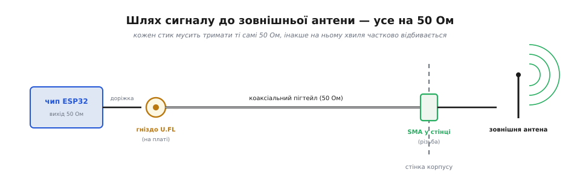

# 🔌 U.FL / IPEX: мініатюрний коаксіальний роз'єм для антени

Коли антену треба винести з [металевого корпусу](topic:physics/faraday-cage) назовні, сигнал від [радіомодуля](topic:programming/mcu-blocks) до зовнішнього штиря веде не доріжка, а **коаксіальний кабель** — і починається він із крихітного роз'єму на платі. Це і є U.FL: гніздо завбільшки з зернину, яке клацається згори. Розберімо клас — однаковий у всіх виробників, бо це фактичний стандарт, — щоб розуміти, де він допомагає, а де тихо з'їдає весь виграш від зовнішньої антени.

## Звідки взявся й чому такий малий

**U.FL** (від *ultra-fine coaxial* — надтонкий коаксіал) — серія мікрокоаксіальних роз'ємів японської Hirose (працюють до ~6 ГГц); той самий формат випускають інші фірми під своїми назвами — **IPEX** (або **IPX**) від Ipex, **AMC**, **MHF** тощо. Усі вони механічно й електрично сумісні з оригіналом, тому в побуті назви U.FL та IPEX уживають як синоніми. Сенс мініатюри простий: на платі модуля місця обмаль, а вивести 50-омну лінію назовні треба компактно — звідси роз'єм заввишки якихось 2–3 мм.

Головне, що про нього треба знати: це **коаксіальний** роз'єм, тобто центральна жила в кільці екрана. Уся радіотехніка передавання сигналу зроблена на коаксіалі саме тому, що екран замикає поле всередині кабелю — сигнал біжить між жилою й екраном, не випромінюючи врозтіч і не ловлячи завад дорогою. Антена має випромінювати; кабель до неї — навпаки, **не повинен**, інакше він сам стане паразитною антеною. Тому й гніздо, і кабель, і зовнішня антена тримають одну характеристику — **хвильовий опір 50 Ом**.

## Чому саме 50 Ом і чому це не можна порушувати

50 Ом — не випадкове число, а компроміс, на якому стоїть уся ВЧ-техніка: для коаксіального кабелю з типовим діелектриком приблизно тут сходяться мінімальне згасання сигналу й максимальна допустима потужність. Важливе для практики інше — **уся лінія мусить мати один опір від виходу чипа до антени**: вихід ESP32 узгоджено на 50 Ом, кабель 50-омний, антена 50-омна. Щойно десь опір розладнується (дешевий кабель не на 50 Ом, погано обтиснутий роз'єм, неправильна антена), частина хвилі **відбивається назад** від місця стрибка опору, як відлуння від стіни.

Цю відбиту частку міряють коефіцієнтом **КСХ** (коефіцієнт стійної хвилі, англ. *VSWR — voltage standing-wave ratio*). КСХ = 1.0 — ідеал, нічого не відбивається; КСХ = 2.0 — назад вертається близько 11% потужності, і це вже помітна втрата дальності. Відбита енергія не лише не доходить до антени — вона повертається в передавач і гріє його вихідний каскад.

```
Частка відбитої потужності = ((КСХ − 1) / (КСХ + 1))²

КСХ = 1.5  →  ((0.5)/(2.5))² = 0.04   → 4% назад   (добре)
КСХ = 2.0  →  ((1.0)/(3.0))² = 0.11   → 11% назад  (помітно)
КСХ = 3.0  →  ((2.0)/(4.0))² = 0.25   → 25% назад  (погано)
```

> 🔧 **Навіщо це.** Коли купуєш «перехідник U.FL — SMA» чи готову антену, дивись на заявлений КСХ/опір. 50 Ом і КСХ < 2 на робочій смузі 2.4 ГГц — мінімум; безіменний пігтейл без цих цифр може мати стрибок опору на самому роз'ємі й з'їсти більше, ніж дала зовнішня антена.

## Як підключають: гніздо, пігтейл, перехід на SMA

На платі стоїть **гніздо** (мама). На кабель обтиснуто **штекер** (тато), що **клацає** згори вертикальним натиском — без різьби, без засувки. Короткий кабель «гніздо U.FL з одного боку — щось зручне з іншого» називають **пігтейлом** (*pigtail*, «поросячий хвіст» — за виглядом). Найчастіший пігтейл виводить сигнал на повнорозмірний різьбовий роз'єм **SMA** (*SubMiniature version A*) у стінці корпусу, а вже до SMA прикручують зовнішню антену-штир. Логіка поділу проста: ніжний U.FL ховається всередині й майже не торкається після збирання, а грубий SMA винесений назовні витримує накручування антени руками.


*Шлях сигналу: 50-омний вихід чипа → доріжка → гніздо U.FL на платі → коаксіальний пігтейл → роз'єм SMA у стінці корпусу → зовнішня антена. Кожен стик мусить тримати ті самі 50 Ом, інакше на ньому хвиля частково відбивається.*

## Що всередині: чому він такий тендітний

Роз'єм складається з трьох частин, і кожна пояснює його характер. У центрі — **сигнальний штифт** (жила) завтовшки з волосину, навколо нього кільцем — **земляний контакт** (екран), а тримає все докупи пружне **защіпкове кільце**, що клацає на гнізді. З'єднання утримує не різьба й не байонет, а тертя цього пружного кільця — тому воно й розраховане на вертикальний натиск згори і на скромні зусилля. Звідси відразу два наслідки: бічне зусилля (потягнули кабель убік) розхитує пружину й псує контакт землі, а кожне роз'єднання трохи відпускає пружність — тому ресурс і обмежений десятками циклів.

Коаксіальна геометрія «жила в кільці екрана» тут не для краси: саме вона тримає **сталий хвильовий опір 50 Ом** прямо в тілі роз'єму. Якщо штифт перекосило або кільце землі відійшло, геометрія порушується локально — і на цьому міліметрі виникає стрибок опору, від якого відбивається хвиля. Тому механічне ушкодження роз'єму одразу видно як зростання КСХ: електрична й механічна цілість тут — те саме.

## Який кабель і яка зовнішня антена

Пігтейли роблять на тонкому коаксіалі — найпоширеніший **RG-178** (близько 1.8 мм) і ще тонший **RG-1.13/RG-1.37**. Тонкий кабель зручно гнути в тісному корпусі, але платиш **згасанням**: що тонший і довший провід, то більше dB губиться дорогою. На 2.4 ГГц RG-178 з'їдає орієнтовно 1.5–2 dB на метр — для коротких 10–20 см пігтейлів дрібниця (якихось −0.2…−0.4 dB), а от метровий тонкий кабель легко віддасть під −2 dB, тобто майже з'їсть приріст від зовнішньої антени. Тому пігтейл тримають **якомога коротшим**, а на довгі траси беруть товщий кабель.

> 🔧 **Навіщо це.** Вибираючи готовий пігтейл, дивись не лише на роз'єм, а й на марку та довжину кабелю. Короткий RG-178 — нормально; довгий безіменний «тонкий чорний дріт» може мати таке згасання, що зовнішня антена дасть нуль виграшу. Якщо траса довга — закладай товщий коаксіал від самого початку.

Зовнішні антени під SMA теж не однакові: простий **штир** (монополь) світить рівномірно навкруги в горизонті, **диполь** — схоже, але без потреби в землі плати, **спрямована** (патч, Yagi) збирає енергію у промінь. Який тип брати — залежить від того, де стоїть шлюз; але всі вони, як і кабель та роз'єм, мусять бути на 50 Ом, інакше виграш частково відіб'ється назад на стику.

## Найвразливіше місце — сам роз'єм

U.FL спроєктований на **обмежене число з'єднань** — виробники називають порядку 30 циклів, далі контакт зношується й КСХ повзе вгору. Це не роз'єм для щоденного перетикання; його клацнули раз під час збирання — і забули. Знімають його теж обережно: тягнути за кабель не можна (висмикнеш центральну жилу), піддівають рівно вгору за корпус штекера, краще спеціальним знімачем.

> 🔧 **Навіщо це.** Якщо прилад вимагає частого від'єднання антени, U.FL у стінку не виводять — туди ставлять SMA чи RP-SMA, а U.FL лишають внутрішнім стиком «плата — пігтейл», який чіпають раз. Так зношуваний ніжний роз'єм захований, а зовні — міцний різьбовий.

## Типові граблі класу

- **Тягнути за кабель.** Найшвидший спосіб убити гніздо — від'єднувати, смикаючи за провід. Центральна жила відривається або деформує контакт; КСХ зростає, дальність падає.
- **Багато перетикань.** Понад кілька десятків циклів — і пружний контакт слабшає. Для частого доступу клас не призначений.
- **Безіменний пігтейл не на 50 Ом.** Тонкий кабель із великим згасанням і стрибком опору на роз'ємі з'їдає виграш від зовнішньої антени ще до штиря — буває, що з ним гірше, ніж із рідною PCB-доріжкою.
- **Кабель-«антена».** Якщо екран кабелю поганий або роз'єм не дотиснутий, сам пігтейл починає випромінювати й ловити завади — лінія перестає бути «невидимою».
- **RP-SMA замість SMA.** На споживчому Wi-Fi-залізі поширений **RP-SMA** (*reverse-polarity*) з переставленими жилою й гніздом — механічно схожий, але з прямим SMA не з'єднується. Перевіряй полярність, купуючи антену чи перехідник.
