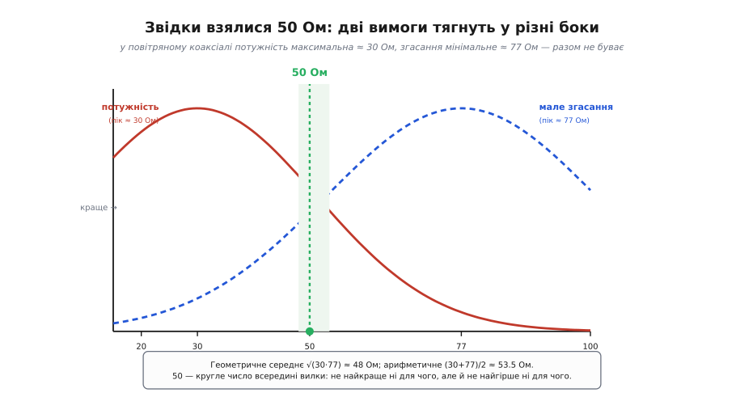
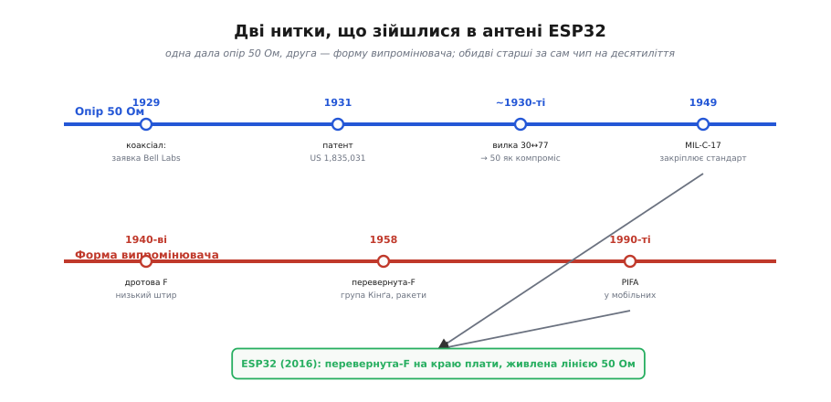

# 📜 Дві цифри, старші за сам чип: звідки взялися 50 Ом і форма антени

Коли ти дивишся на антенний край модуля WROOM — на мідний меандр і на тонку доріжку, що веде до нього, — ти дивишся на дві домовленості, кожна з яких старша за ESP32 на пів століття й більше. Одна каже, яким має бути **опір** тракту: рівно 50 Ом, не 48 і не 60. Друга каже, якою має бути **форма** випромінювача: не прямий штир, а зігнутий провідник із коротким замиканням на землю — перевернута буква F. Жодна з цих цифр не «випливає з фізики» однозначно; обидві — сліди конкретних людей, конкретних задач і конкретних компромісів. Розберімо, звідки вони взялися насправді — бо коли розумієш, *чому* саме 50 і *чому* саме F, перестаєш ставитися до них як до магічних чисел і починаєш бачити інженерне рішення, яке хтось колись ухвалив і за яке відповідав.

## Задача, якої в телефонії ще не було

Почнімо з коаксіала — бо саме він задав 50 Ом. У 1920-х телефонні компанії вперлися в стіну. Мідна пара, по якій тоді гнали розмови, добре тягне низькі частоти, але з ростом частоти починає нещадно **згасати** й **випромінювати** — енергія тікає в простір і в сусідні дроти (звідси перехресні наведення, коли в слухавці чути чужу розмову). А телефонним компаніям хотілося саме високих частот: що ширша смуга, то більше розмов можна впакувати в один кабель одночасно (це називають ущільненням каналів). Постала конкретна інженерна потреба: **лінія, яка веде дуже широку смугу частот на велику відстань, не випромінюючи назовні й мало згасаючи.**

Розв'язок придумали двоє інженерів компанії AT&T у її дослідному підрозділі — Bell Telephone Laboratories: **Ллойд Еспеншід (Lloyd Espenschied, 1889–1986)**, американець, народжений у Сент-Луїсі, штат Міссурі, і **Герман Ендрю Аффел (Herman Andrew Affel, 1893–1972)**, американський інженер-електрик, який прийшов у Bell Labs з Массачусетського технологічного інституту (MIT). Ідея, яку вони оформили, проста й красива: сховати «гарячий» провідник усередину другого, порожнього, трубчастого — так, щоб вони були **співвісні** (концентричні). Тоді все електромагнітне поле замкнене в проміжку між внутрішньою жилою і зовнішньою трубою; назовні не виходить нічого, і ззовні всередину — теж нічого. Кабель сам себе екранує. Це і є **коаксіальний** (від лат. *co-* — «спільно» + *axis* — «вісь»: спільновісний) кабель.

> 🔧 **Навіщо це.** Той самий принцип живе в U.FL-пігтейлі, яким ти виводиш антену з металевого корпусу: центральна жила несе сигнал, обплетення-екран замикає поле й не пускає всередину завад. Коли розумієш, що екран — це не «додатковий захист», а *друга обкладка лінії*, стає ясно, чому обірваний чи погано обтиснений екран убиває зв'язок: розкриваєш співвісну пару — і поле починає тікати назовні, як у звичайного дроту.

Заявку на патент вони подали **23 травня 1929 року**, а патент США № **1 835 031** під назвою «Concentric conducting system» (концентрична провідна система) видали **8 грудня 1931 року**, правовласник — American Telephone and Telegraph Company. *(Статус: усталено — дати й номер звірені за текстом самого патенту.)* Це той рідкісний випадок, коли винахід справді має чітких авторів і чітку дату: не легенда про «одну геніальну голову», а конкретна заявка двох інженерів однієї лабораторії. Тут доречно розрізняти рівні, бо їх часто плутають: **ідею** співвісної лінії висловлювали й раніше (математику концентричних провідників чіпав ще Олівер Гевісайд наприкінці XIX ст.), але **робочу широкосмугову систему передавання**, придатну для телефонної мережі, оформили саме Еспеншід і Аффел — і саме її запатентували. «Хто перший подумав» і «хто зробив працездатну систему» — це не те саме питання; чесна історія тримає їх окремо.

## Чому саме 50, а не будь-яке інше число

Тепер найцікавіше — і найчастіше перекручене. Побутує уявлення, ніби 50 Ом — якась фундаментальна стала природи. Це не так. 50 Ом — це **компроміс**, і щоб його побачити, треба спитати: а від чого взагалі залежить хвильовий опір коаксіала? Від геометрії — від відношення діаметрів зовнішньої труби (D) до внутрішньої жили (d) і від діелектрика між ними. Для повітряного (насправді — з тонкими діелектричними шайбами, а між ними повітря) коаксіала опір такий:

```
Z₀ = (138 / √εr) · log₁₀(D / d)

для повітря εr ≈ 1:
Z₀ ≈ 138 · log₁₀(D / d)
```

Отже, обираючи відношення D/d, інженер вільно обирає опір у широких межах. Постає питання: а яке відношення — «правильне»? І тут з'ясовується, що правильного немає, бо різні вимоги тягнуть у різні боки. У 1920-х у тій самій Bell Labs це промацали експериментально й отримали два числа, які варто запам'ятати.

**Перше: максимум потужності.** Якщо ти хочеш прогнати крізь кабель якнайбільше потужності, не пробивши діелектрик іскрою, оптимальне відношення D/d дає опір **близько 30 Ом**. Ширша жила краще тримає струм і не перегрівається.

**Друге: мінімум згасання.** Якщо ти хочеш, щоб сигнал якнайменше слабшав по дорозі, оптимум інший — опір **близько 77 Ом**. Тонша жила при ширшій трубі дає найменші втрати на активному опорі міді.

Ось у чому пастка: **30 Ом і 77 Ом — це різні кабелі.** Не можна одночасно мати максимальну потужність і мінімальне згасання; геометрія, яка добра для одного, погана для іншого. Треба вибирати, де саме сісти між цими двома полюсами.


*Повітряний коаксіал: одна вимога тягне опір до 30 Ом (максимум потужності), друга — до 77 Ом (мінімум згасання). Разом їх не задовольнити; 50 Ом — кругле число всередині вилки між середніми значеннями.*

Куди сісти? Природно — десь посередині. Але «посередині» можна рахувати по-різному, і обидва способи дають майже те саме:

```
геометричне середнє:  √(30 · 77) ≈ 48.1 Ом
арифметичне середнє:  (30 + 77) / 2 ≈ 53.5 Ом
```

Обидва числа юрмляться навколо 50. Тож 50 Ом обрали не тому, що воно оптимальне бодай для чогось конкретного — а саме тому, що воно **не найгірше ні для чого**: пристойно тримає потужність, пристойно мало згасає, і до того ж кругле — зручне в розрахунках і в довідниках. Це класичний інженерний компроміс: жертвуєш вершиною кожної окремої вимоги заради того, щоб не провалитися в жодній. *(Статус: усталено щодо чисел 30 і 77 Ом та самого факту компромісу — це стандартне пояснення в радіотехніці; конкретне «рівно 50» — інженерна домовленість, а не теорема.)*

> 🔧 **Навіщо це.** Ось чому вихідний каскад радіо ESP32, U.FL-роз'єм, коаксіальний пігтейл і зовнішня антена — усі на 50 Ом. Це не примха: щойно два стики мають різний опір, на межі між ними хвиля частково **відбивається** назад, і частина потужності не доходить до антени. Спільні 50 Ом уздовж усього тракту — це домовленість, яка тримає відбиття малим. Чому саме розбіжність опорів породжує відбиту хвилю — це окрема тема, [узгодження опорів](root:hw-analog/impedance-matching): коли джерело, лінія й навантаження мають однаковий хвильовий опір, уся енергія йде вперед; будь-який стрибок опору відбиває частину назад.

Треба чесно додати: історія 50 Ом має й другий бік, не лише «геометричне середнє». Для кабелів **з суцільним діелектриком** (не повітрям, а, скажімо, поліетиленом) картина зсувається, і там 50 Ом виходить ближчим до практичного оптимуму за міцністю й втратами водночас. Тобто кругле число вдало лягло одразу на кілька міркувань — і саме тому прижилося, а не лишилося одним із багатьох можливих. Історики техніки згадують і зовсім приземлені чинники: у ранніх повітряних лініях зручні розміри мідних трубок, що були під рукою, самі давали опір близько 50–60 Ом. Тобто «чому 50» — це не одна причина, а збіг кількох, який згодом закріпили як стандарт.

## Як компроміс став законом: MIL-C-17

Компроміс лишався б справою смаку кожного виробника, якби його не **закріпили**. Поки кожна лабораторія обирала опір на власний розсуд, кабель однієї фірми не стикувався з роз'ємом іншої без відбиттів і втрат — суцільна несумісність. Стандарт народжується там, де багатьом треба, щоб деталі різних виробників працювали разом; для радіочастотних кабелів таким рушієм стали військові.

Під час Другої світової й одразу по ній армія США замовляла коаксіал у величезних кількостях — для радарів, зв'язку, апаратури, — і їй потрібно було, щоб кабель від будь-якого підрядника мав **однакові, наперед задані** параметри. Так з'явилася військова специфікація **MIL-C-17** (пізніше — MIL-DTL-17), яка описує коаксіальні кабелі за жорсткими вимогами: опір, згасання, розміри, діелектрик. Саме через неї 50 Ом (і, для іншого класу задач, 75 Ом) із «зручного компромісу» перетворилися на **de facto стандарт** цілої галузі: щойно військові закупівлі пішли на 50 Ом, за ними підтяглася вся промисловість, бо робити «як усі» дешевше. *(Статус: усталено щодо ролі MIL-C-17 як закріплювача стандарту; конкретний рік першої редакції в різних джерелах подають то як кінець 1940-х, то ширше — «з 1940-х», тож точну дату лишаю як приблизну.)*

Звідси, до речі, і сусіднє число — **75 Ом**, яке ти зустрічаєш у телевізійному й відеокабелі. 75 близьке до опору мінімального згасання (77 Ом): там, де не треба гнати потужність, а треба лише якнайменше втратити слабкий сигнал на довгій лінії до антени на даху, обирають бік «мале згасання». Два стандарти — два різні компроміси однієї й тієї самої вилки 30↔77: радіо й вимірювання сіли на 50 (баланс потужності й втрат), відео — на 75 (мінімум втрат). ESP32, як радіопристрій, живе у світі 50 Ом.

## Друга нитка: чому антена — це буква F

Тепер друга домовленість — **форма**. Класична антена — прямий чвертьхвильовий штир над землею. Але штир стирчить, а на 2.4 ГГц він завдовжки близько 30 мм — забагато, щоб вертикально стирчати з крихітного модуля чи з корпусу приладу. Потрібен був спосіб узяти той самий резонансний провідник і **скласти його низько над поверхнею**, не втративши випромінювання. Ця потреба вперше гостро постала не в споживчій електроніці, а там, де будь-який виступ смертельний, — в **авіації й ракетній техніці**.

Уяви ракету або літак, що йде на великій швидкості. Будь-яка антена-штир, що стирчить із корпусу, — це аеродинамічний опір, вібрація, а на швидкостях — ще й нагрів і ризик зламу. Інженерам конче була потрібна антена **з низьким силуетом (low-profile)**: щоб лежала майже врівень із обшивкою, а випромінювала так само, як штир. Із цієї цілком практичної задачі й народилася потрібна форма.

Попередником була **дротова F-подібна антена**, що з'явилася ще в **1940-х**: прямий штир поклали набік, паралельно землі (це вже давало низький силует), а живлення підвели в проміжній точці. Проблема була в узгодженні: покладений набік провідник має незручний вхідний опір, який важко звести до 50 Ом.

Розв'язок дала **перевернута-F антена (inverted-F antenna, IFA)**. Її запропонувала **1958 року** дослідна група Гарвардського університету під керівництвом **Роналда Кінґа (Ronold Wyeth Percival King, 1905–2006)** — американського фізика, який півжиття присвятив теорії антен і був Гордон-Мак-Кеївським професором прикладної фізики в Гарварді. Робота вийшла як технічний меморандум корпорації Sandia (SCTM 436-58, листопад 1958), а згодом — статтею «Transmission-line missile antennas» у журналі *IRE Transactions on Antennas and Propagation* (січень 1960), співавтори — Кінґ, К. Гаррісон і Д. Дентон. Показова деталь, яка одразу видає походження форми: у самій назві статті стоїть слово **missile** — ракетна антена. Її й задумували як **дротову антену для телеметрії ракет** — тобто для передавання даних із ракети в польоті. *(Статус: усталено — авторство, дата 1958 і ракетне призначення звірені за первинним меморандумом Sandia й публікацією в IRE; ім'я й біографію Кінґа звірено окремо.)*

Хитрість перевернутої-F — у **третій точці**. У звичайного покладеного штиря (це форма «перевернута-L», ILA) є два кінці: живлення й вільний кінець. Кінґ із колегами додали **коротке замикання на землю** ще в одній точці — і провідник із перекладини та двох ніжок став схожий на перевернуту літеру F. Ця третя точка — не прикраса, а **важіль керування опором**: пересуваючи місце живлення між коротким замиканням і вільним кінцем, можна плавно підганяти вхідний опір антени під потрібні 50 Ом, **не змінюючи** її резонансної довжини. Раптом та сама низька форма стала й добре узгодженою — і в цьому вся суть винаходу.


*Дві незалежні лінії розвитку. Верхня дала опір 50 Ом, нижня — форму випромінювача. Обидві старші за ESP32 на десятиліття й сходяться в його антені: перевернута-F на краю плати, живлена лінією 50 Ом.*

## Від ракети до телефона — і до твого модуля

Далі перевернута-F зробила несподіваний стрибок — із військової й авіаційної техніки в кишеню кожного. Коли в 1990-х мобільні телефони почали стрімко зменшуватися, виробникам знадобилася саме така антена: **компактна, низька, притиснута до плати, з керованим узгодженням**. Дротову IFA «розплющили» в пласку — металеву пластинку над площиною землі з коротким замиканням-штирком і точкою живлення. Так народилася **пласка перевернута-F антена (planar inverted-F antenna, PIFA)** — і саме вона десятиліттями сиділа всередині мобільних телефонів, бо чудово ховається під корпусом і не потребує стирчати назовні. *(Статус: усталено щодо самого факту й напрямку еволюції IFA → PIFA та її панування в мобільних; точні перші зразки PIFA різні джерела датують по-різному в межах 1980–90-х, тож даю десятиліття, а не рік.)*

І ось коло замкнулося. Мідний меандр на краю модуля WROOM — це нащадок тієї самої ракетної антени Кінґа: чвертьхвильовий провідник, зігнутий і притиснутий до плати, з живленням у підібраній точці, налаштований так, щоб на вході дати ті самі 50 Ом, які колись вибрали в Bell Labs як «найменш поганий» компроміс. Дві незалежні нитки — опір коаксіала з 1929-го й форма антени з 1958-го — сходяться в одній крихітній деталі, на яку ти зазвичай не звертаєш уваги.

У цьому й полягає корисний урок історії техніки: **за круглими числами й звичними формами майже завжди стоїть не закон природи, а чийсь давній компроміс.** 50 Ом можна було зробити 60 Ом; антену можна було лишити штирем. Що обрали — обрали люди, під конкретні задачі свого часу: телефонним компаніям треба було гнати широку смугу без втрат, ракетникам — не стирчати назовні. Ми досі живемо в їхніх рішеннях щоразу, коли вмикаємо Wi-Fi. І коли наступного разу розводитимеш антену на власній платі й побачиш у документації «feed line 50 Ω» та «inverted-F» — ти знатимеш, чиї це рішення й чому вони саме такі.
