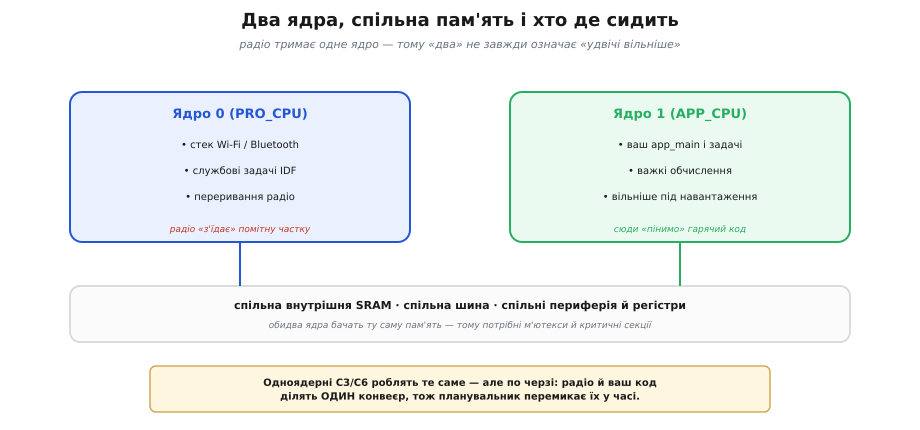
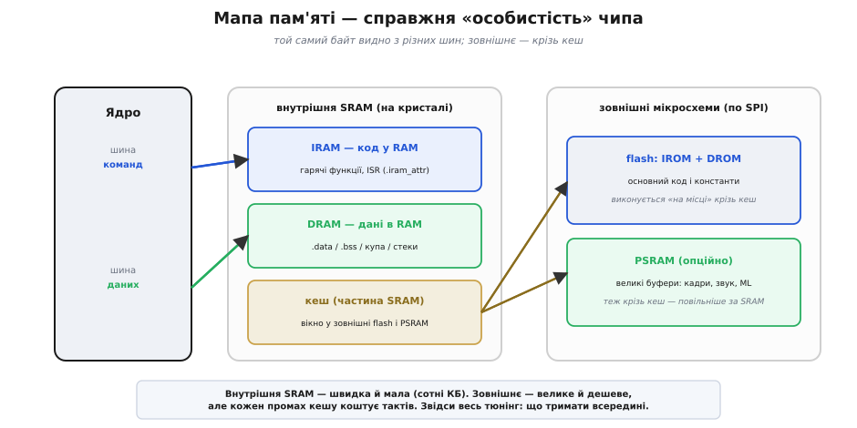
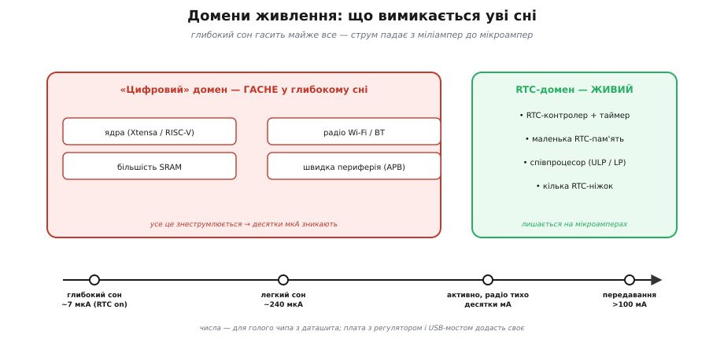
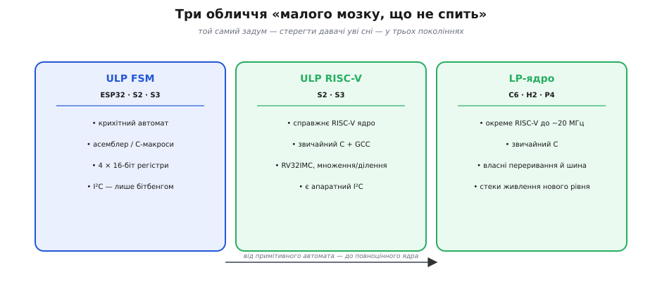

# Сімейство ESP32 зсередини: що насправді змінюється від чипа до чипа

У [базовому кроці](root:embedded/esp32-family) ми розібрали вибір усередині родини як задачу впізнавання: назвав потребу — і суфікс (S2, S3, C3, C6) майже сам себе вибрав. Того рівня досить, щоб купити правильний чіп і не помилитися. Але щойно ви почнете **писати під нього прошивку всерйоз** — упретеся в питання, на які «C — дешевий, S — потужний» уже не відповідає. Чому та сама програма на двоядерному ESP32 інколи гальмує так, ніби ядро одне? Куди дівається пам'ять, коли лінкер раптом каже «не влазить»? Чому одна плата в глибокому сні тягне 7 мкА, а зовні однакова — 2 мА? Чому давач можна опитувати уві сні на S3, але не на C3?

Усі ці питання мають одну спільну природу: вони про **внутрішню будову** чипа, а не про його ярлик. І тут родина розкладається не на п'ять маркетингових поличок, а на **чотири вісі справжніх інженерних рішень** — як влаштовані ядра, як влаштована пам'ять, як влаштоване живлення й сон, як влаштований зв'язок і периферія. Пройдімо кожну до дна: із виведенням чисел, граничними випадками й кодом, який справді збирається. Це той самий метод [мірки від задачі](root:embedded/esp32-vs-8bit), тільки тепер ми ліземо під капот, щоб мірка спиралася на механіку, а не на гасла.

> 🔧 **Навіщо це.** Різницю між чипами на рівні «дешевий/потужний» ховає компілятор — і це чудово для першого проєкту. Але коли проєкт упирається в стіну (бракує RAM під кадр, струм спокою вдесятеро більший за очікуваний, гарячий цикл не встигає), стіну ставить саме **внутрішня будова**, і полагодити її можна лише розуміючи механіку. Цей крок — про те, щоб ви бачили ці стіни **наперед**, ще на етапі вибору, а не впиралися в них у налагодженні.

## Вісь перша: скільки у вас ядер і що вони насправді роблять

Почнімо з найгучнішої цифри в специфікації — **кількості ядер**. Оригінальний ESP32 і S3 несуть по два ядра, S2 і C3 — по одному, C6 — одне «велике» плюс одне крихітне «мале» (до нього повернемося окремо). Здавалося б, усе ясно: два ядра — удвічі швидше. Насправді ця арифметика оманлива, і зрозуміти, **чому**, — значить зрозуміти половину того, як влаштована прошивка ESP32.

### Що таке «два ядра» тут насправді

Обидва ядра в ESP32 — рівноправні й **симетричні** (SMP, англ. *Symmetric MultiProcessing* — «симетрична багатопроцесорність»): однакова архітектура, однакова частота, і — ключове — вони **бачать ту саму пам'ять**. Одна й та сама внутрішня SRAM, та сама периферія, ті самі [регістри, спроєктовані у простір пам'яті](topic:programming/memory-mapped-io). Це не два окремі мікроконтролери в одному корпусі, а два виконавці за одним спільним столом.

Espressif історично дала ядрам імена, що видають їхнє задумане призначення: **PRO_CPU** (ядро 0, від *protocol* — «протокол») і **APP_CPU** (ядро 1, від *application* — «застосунок»). Задум був простий: одне ядро крутить стеки зв'язку (Wi-Fi, Bluetooth) і службові справи, друге лишається вам під застосунок. Але це лише **типовий розподіл за замовчуванням**, а не апаратний закон: технічно будь-яке ядро може робити будь-що. Розподіляє роботу між ними [операційна система реального часу під капотом](root:embedded/baremetal-vs-framework) — FreeRTOS, яку ESP-IDF вбудовує в кожен проєкт.


*Два ядра ділять одну SRAM, одну шину й одну периферію — це не два окремі МК, а два виконавці за спільним столом. За замовчуванням PRO_CPU (ядро 0) тримає стеки Wi-Fi/BT і службові переривання, APP_CPU (ядро 1) лишається під ваш застосунок. Одноядерні C3/C6 роблять те саме — але по черзі, ділячи один конвеєр у часі.*

### Чому радіо «з'їдає» ядро

Ось перша неочевидна річ, від якої залежить дуже багато. Стек Wi-Fi — це не «ввімкнув і забув»: це постійна, вимоглива до часу робота. Приймач мусить встигати обробляти пакети, відповідати на них у жорсткі часові вікна протоколу, тримати з'єднання живим, шифрувати й розшифровувати. Усе це **безперервно з'їдає** такти процесора — і не абиколи, а **саме тоді, коли треба**, бо радіопротокол не чекає.

На двоядерному чипі це має природний вихід: PRO_CPU бере на себе радіо, а APP_CPU лишається вам майже вільним. Ось звідки й береться справжня, а не паперова цінність другого ядра: не «удвічі більше обчислень», а **розв'язка** — ваш код перестає конкурувати з радіо за той самий конвеєр. Плавний рендер на дисплей, обробка звуку, керування в реальному часі — усе це почувається набагато спокійніше, коли радіо сидить на **окремому** ядрі й не перериває вашу гарячу петлю посеред кадру.

А тепер — гранична річ, яку багато хто відкриває болісно. На **одноядерному** C3 радіо й ваш застосунок ділять **один** конвеєр. Планувальник FreeRTOS перемикає їх у часі десятки й сотні разів на секунду, і формально все працює. Але коли радіо активне — качає великий файл, тримає щільний потік, — воно **відбирає помітну частку** тактів у вашого коду. Той самий алгоритм, що на APP_CPU оригінального ESP32 біг без запинки, на C3 під активним Wi-Fi може почати смикатися: не тому, що C3 «повільніший» за тактами, а тому, що його єдине ядро тепер **ділить час** із радіо, якого раніше не бачило.

> 🔧 **Навіщо це.** Це прямо змінює правило вибору з базового кроку. Якщо в задачі є **жорсткий реальний час поряд з активним радіо** — безперервний потік аудіо під Wi-Fi, стабільний рендер, точне керування моторами при відкритому TCP-з'єднанні, — двоядерний чіп (оригінал або S3) дає вам запас, якого одноядерний C3 конструктивно не має. І навпаки: якщо радіо працює **рідкими сплесками** (раз на хвилину відіслав пакет телеметрії й заснув), одного ядра C3 більш ніж досить, і платити за друге нема сенсу.

### Спільна пам'ять — сила і пастка водночас

Те, що обидва ядра бачать ту саму пам'ять, — величезна зручність: задача на одному ядрі кладе дані в буфер, задача на іншому їх забирає, без жодного копіювання. Але та сама спільність — це класична пастка **паралельності**. Якщо два ядра одночасно чіпають ту саму змінну — одне пише, друге читає на півдорозі, — ви отримаєте пошкоджені дані, і то не завжди, а **зрідка**, у найгірший момент. Це найпідступніший різновид помилок: він не відтворюється на вимогу.

Тому спільні дані між ядрами треба **захищати** — м'ютексом (англ. *mutual exclusion* — «взаємне виключення»: замок, який пускає до даних лише одного) або короткою критичною секцією, що на мить забороняє перемикання. Ось як це виглядає в коді ESP-IDF, коли лічильник ділять два ядра:

**Умова: два ядра нарощують спільний лічильник подій. Що додати, щоб не втратити інкременти?**

```c
#include "freertos/FreeRTOS.h"
#include "freertos/task.h"

static portMUX_TYPE lock = portMUX_INITIALIZER_UNLOCKED;
static volatile uint32_t events = 0;

// викликається з задач, що можуть жити на РІЗНИХ ядрах
static void on_event(void) {
    taskENTER_CRITICAL(&lock);   // на мить забороняємо перемикання/друге ядро
    events++;                    // тепер інкремент неподільний
    taskEXIT_CRITICAL(&lock);    // відпускаємо якнайшвидше
}
```

```
без замка:  events++  = читати → +1 → записати  (три кроки)
            друге ядро може влізти МІЖ кроками → один інкремент зникне

із замком:  спін-блокування тримає доступ рівно на три кроки
            висновок: критична секція має бути КОРОТКОЮ — усередині
            жодних затримок, вводу-виводу, log — лише сам інкремент
```

Тонкість, яку варто вкласти в голову раз і назавжди: на **одноядерному** C3 та сама помилка теж існує — бо переривання чи перемикання задачі може розрізати `events++` посередині. Тобто захист потрібен **не через друге ядро**, а через саму паралельність задач; друге ядро лише робить проблему частішою й підступнішою. Хто звик до цього на C3, той без сюрпризів переходить на двоядерний чіп. Глибше про ціну й вибір замка — в окремому кроці про [спінлок і м'ютекс](root:embedded/spinlock-mutex).

### Скільки насправді дає друге ядро: порахуймо

Спокуса думати «два ядра = ×2» надто сильна, тож зіб'ємо її числом. Хай ваш застосунок потребує роботи, яку одне ядро тягне на **70%** завантаження, а радіо в піку з'їдає **40%** одного ядра.

```
ОДНЕ ядро (C3):
  застосунок 70% + радіо 40% = 110% > 100%  → НЕ влазить
  планувальник муситиме комусь недодати часу → застосунок гальмує

ДВА ядра (ESP32):
  ядро 0: радіо 40%           → лишається 60% запасу
  ядро 1: застосунок 70%      → лишається 30% запасу
  обидва < 100% → усе встигає, ще й із запасом

висновок: виграш другого ядра — НЕ «вдвічі швидше»,
          а «сумарне навантаження 110% перестало бути перевантаженням»
```

Ось де справжня цінність: друге ядро рятує не там, де треба «швидше», а там, де **сума** робіт переростає одне ядро. Якщо ваша сума явно менша за 100% одного ядра (телеметрія раз на секунду), друге ядро простоюватиме — і платити за нього марно. Це знову той самий [перебір потужності](root:embedded/esp32-vs-8bit), лише в новому вимірі: зайве ядро — теж непотрібний запас.

## Вісь друга: мапа пам'яті — справжня «особистість» чипа

Якщо ядра — найгучніша цифра специфікації, то **пам'ять** — найважливіша для того, хто пише код. Саме об неї найчастіше розбиваються реальні проєкти: «камера не влазить», «лінкер каже overflow», «чому доступ до буфера такий повільний». І майже завжди корінь — у нерозумінні того, що всередині ESP32 **не одна пам'ять, а кілька різних**, кожна зі своїм характером, а той самий байт видно **з різних боків**.

### Три поверхи пам'яті

Уявімо пам'ять ESP32 як три поверхи за швидкістю й розміром.

**Внутрішня SRAM** (англ. *Static RAM* — «статична оперативна пам'ять») — на самому кристалі. Найшвидша, доступна за такти, але **мала**: 520 КБ на оригінальному ESP32, 512 КБ на S3, 320 КБ на S2, 400 КБ на C3, 512 КБ на C6. Це весь ваш «оперативний простір»: сюди лягають змінні, стеки задач, буфери, купа. Коли кажуть «на ESP32 обмаль RAM» — мають на увазі саме її.

**Зовнішня флеш-пам'ять** — окрема мікросхема на платі, з'єднана по SPI. Велика (типово 4–16 МБ) і дешева, але **повільна й нелетка**: тут живе ваша прошивка й сталі дані. Читати з неї байт-за-байтом на швидкості ядра неможливо — фізика SPI не дозволяє.

**Зовнішня PSRAM** (англ. *Pseudo-Static RAM* — «псевдостатична пам'ять», DRAM із вбудованим оновленням, що прикидається статичною) — необов'язкова додаткова мікросхема оперативної пам'яті, теж зовнішня. Її ставлять, коли внутрішньої SRAM катастрофічно бракує: буфери кадрів камери, звукові масиви, ваги нейромереж. Великі об'єми (2–8 МБ), але й вона повільніша за внутрішню SRAM.


*Той самий байт видно з різних шин. Внутрішня SRAM (на кристалі) ділиться на IRAM (код, що біжить із RAM) і DRAM (дані), а частина відведена під кеш. Зовнішні флеш і PSRAM під'єднані по SPI й видимі ядру лише крізь кеш — «вікно» обмеженого розміру. Внутрішнє швидке й мале; зовнішнє велике й повільне. Звідси весь тюнінг: що тримати всередині.*

### Фокус, на якому все тримається: виконання «на місці» крізь кеш

Тут виникає питання, від якого залежить розуміння всієї архітектури. Прошивка на S3 може важити **мегабайти** — куди більше за 512 КБ внутрішньої SRAM. Як ядро її виконує, якщо в RAM вона не влазить, а з повільної флеш байт-за-байтом читати не можна?

Відповідь — **кеш** і виконання «на місці» (англ. *XIP, eXecute In Place* — «виконувати там, де лежить»). Ядро не копіює всю прошивку в RAM. Замість цього між ядром і зовнішньою флеш стоїть **кеш** — швидкий буфер із шматка тієї самої внутрішньої SRAM. Коли ядру потрібна інструкція чи стала з флеш, кеш підтягує **цілий блок** навколо неї одним махом і тримає під рукою. Наступні звертання поблизу — а код здебільшого лінійний, тож так і буває — беруться з кешу за такти, ніби з внутрішньої SRAM. Промах (потрібного блоку в кеші нема) коштує похід у повільну флеш; влучення — майже безкоштовне.

Ось чому в мапі пам'яті ESP32 той самий фізичний вміст флеш видно **двічі**, під різними іменами: **IROM** (код у флеш, англ. *Instruction ROM*) і **DROM** (сталі у флеш, *Data ROM*). А код і дані, які ви навмисно тримаєте в швидкій внутрішній SRAM, звуться **IRAM** і **DRAM**. Це не різні мікросхеми — це різні **вікна** й різні шини до однієї й тієї ж пам'яті.

> 🔧 **Навіщо це.** Кеш пояснює найпідступніший клас «плаваючих» гальм на ESP32. Функція, викликана вперше чи після довгої паузи, **холодна**: її блок не в кеші, перший прохід іде через повільну флеш. Той самий код, викликаний у щільному циклі, **гарячий** і летить із кешу. Тому обробник переривання (ISR) чи найгарячішу петлю навмисно кладуть у IRAM атрибутом `IRAM_ATTR` — щоб вони **ніколи** не залежали від кешу й не спіткнулися об промах у критичну мить. Це вже не косметика, а різниця між «встигли обробити переривання» і «пропустили».

### Чому «512 КБ SRAM» — це майже завжди менше, ніж 512 КБ

Гранична річ, об яку спотикаються всі. У специфікації написано «512 КБ SRAM» — але вам як розробнику дістанеться **помітно менше**, і причин кілька, кожну варто розуміти.

По-перше, **кеш відкушує свій шмат** цієї ж SRAM: раз частина відведена під вікно у флеш і PSRAM, для ваших даних її вже нема. По-друге, **завантажувач і службові структури IDF** живуть у тій самій RAM. По-третє — і це найтонше — пам'ять **фрагментується** на різні регіони, і не кожен байт можна використати під що завгодно: буває, що DMA-контролер уміє працювати **лише з певними ділянками**, і буфер під нього мусить лягти саме туди.

```
S3: паспортні 512 КБ SRAM — куди вони діваються
  − кеш (вікно у флеш/PSRAM)          десятки КБ
  − завантажувач + службові дані IDF   десятки КБ
  − фрагментація на регіони            «дірки», що не злити в один шматок
  ───────────────────────────────────────────────
  ≈ вам лишається помітно менше, ніж 512 КБ суцільного простору

наслідок: malloc(200 КБ) може НЕ вдатися навіть коли «вільно» 300 КБ —
          бо ці 300 розкидані по регіонах, а суцільного блоку на 200 нема
```

Саме тому досвідчений розробник дивиться не на паспортне число, а на **найбільший суцільний вільний блок** — його в IDF показує `heap_caps_get_largest_free_block()`. Це той самий урок про [бюджет пам'яті мікроконтролера](root:embedded/memory-budget-mcu), тільки загострений архітектурою ESP32: пам'ять тут не однорідне озеро, а кілька ставків із протоками, і питання не «скільки всього», а «скільки в **потрібному** ставку суцільним шматком».

### Коли на сцену виходить PSRAM

Тепер зрозуміло, коли й навіщо ставлять PSRAM. Буфер одного кадру з камери роздільністю навіть скромні 320×240 у форматі два байти на піксель — це вже **150 КБ**; повнокольоровий VGA-кадр 640×480 — понад **600 КБ**, більше за всю внутрішню SRAM S3. Тримати такий буфер ніде, крім PSRAM. Так само з вагами нейромережі чи довгими звуковими масивами.

**Умова: буфер кадру 640×480×2 байти. Куди його покласти на S3 і чому не в звичайну купу?**

```c
#include "esp_heap_caps.h"

#define W 640
#define H 480
size_t frame_bytes = (size_t)W * H * 2;   // 614 400 байтів ≈ 600 КБ

// у внутрішню SRAM НЕ влізе (там усього ~512 КБ, ще й з дірками) →
// просимо саме зовнішню PSRAM прапорцем MALLOC_CAP_SPIRAM:
uint16_t *frame = heap_caps_malloc(frame_bytes, MALLOC_CAP_SPIRAM);
if (!frame) {                 // PSRAM може бути не розпаяна або вимкнена в конфігу
    ESP_LOGE("cam", "нема PSRAM під кадр");
    return;
}
// ... працюємо з кадром; доступ повільніший за SRAM, зате він узагалі можливий
heap_caps_free(frame);
```

```
внутрішня SRAM:  ~512 КБ — кадр 600 КБ НЕ влазить фізично
звичайний malloc: бере з внутрішньої SRAM → теж провал
heap_caps + SPIRAM: кладе в зовнішню PSRAM (МБ) → влазить

розплата: кожен доступ до PSRAM іде крізь кеш по SPI —
          повільніше за SRAM у рази; тому в PSRAM тримають ВЕЛИКІ,
          рідше чіпані буфери, а гарячі дрібні лічильники — у SRAM
```

І остання, суто практична засторога, що змикається з базовим кроком. **Наявність PSRAM визначає не чіп, а модуль.** Той самий кристал S3 продають і в модулі геть **без** PSRAM, і в модулі з 8 МБ. Ба більше, PSRAM буває різної швидкості — «quad» (чотири лінії) і вдвічі прудкіша «octal» (вісім ліній), — і це теж властивість модуля. Тож, обравши S3 під камеру, ви ще **не** обрали залізо: половина рішення — вибір **модуля** з правильною PSRAM, як ми й наголошували, розводячи [чіп, модуль і плату](topic:programming/esp32-architecture).

## Вісь третя: живлення й сон — де ховаються мікроампери

Третя вісь на папері невидима — у таблиці порівнянь її часто зводять до одного числа «струм у глибокому сні». Але для будь-якого пристрою на батарейці саме вона вирішує, проживе він тиждень чи рік. І щоб керувати нею, треба зрозуміти, що ESP32 всередині поділений на **домени живлення** — острови, які вимикаються **незалежно**.

### Домени живлення: чому не можна «трохи поспати»

Найдорожче в мікроконтролері — це **активні** ядра й **радіо**. Радіо в передаванні тягне понад 100 мА, ядро на повній частоті — десятки мА. Якщо тримати їх увімкненими, жодна батарейка надовго не стане. Тому весь фокус автономності — **вимикати їх, коли вони не потрібні**, і будити лише на роботу.

Але просто «зняти живлення з чипа» не годиться: тоді пропаде все — і час, і стан, і нічим буде прокинутися. Тож кристал ділять на два великі острови. Перший — **«цифровий» домен**: ядра, більшість SRAM, радіо, швидка периферія. Це все — велике й ненажерливе, і саме його гасять уві сні. Другий — крихітний **RTC-домен** (англ. *Real-Time Clock* — «годинник реального часу»): маленький лічильник часу, дещиця спеціальної RTC-пам'яті, кілька спеціальних ніжок і — на деяких чипах — крихітний співпроцесор. Цей острів живе на **мікроамперах** і саме він тримає пристрій «притомним» уві сні.


*Кристал поділений на острови, що вимикаються незалежно. У глибокому сні гасне весь «цифровий» домен — ядра, більшість SRAM, радіо, швидка периферія, — і десятки міліампер зникають. Живим на мікроамперах лишається крихітний RTC-домен: лічильник часу, маленька RTC-пам'ять, співпроцесор і кілька спеціальних ніжок. Числа — для голого чипа з даташита; плата додасть своє.*

### Сходинки сну: від повного ходу до майже-нуля

З цього поділу природно виростають кілька **режимів сну** — сходинок, на кожній з яких гасне дедалі більше. Розберімо їх від найдорожчої до найдешевшої, з приблизними числами для голого чипа (плата з регулятором і USB-мостом додасть своє — до цього ще повернемося).

**Активний режим.** Усе ввімкнено. Ядра рахують, радіо може передавати. Струм — від десятків міліампер (радіо мовчить) до понад сотні (передавання). Це робочий стан, у ньому пристрій робить свою справу.

**Легкий сон** (light sleep). Ядра **зупиняються**, тактування пригальмовує, радіо приспано — але вміст SRAM і стан периферії **зберігаються**. Прокидання майже миттєве й повертає в **ту саму точку** програми, ніби нічого й не було. Струм падає до сотень мікроампер (порядок 240 мкА для голого чипа). Годиться, коли треба часто прокидатися й реагувати швидко.

**Глибокий сон** (deep sleep). Гаситься весь цифровий домен: ядра, майже вся SRAM, радіо. Живим лишається тільки RTC-домен. Струм провалюється до **одиниць мікроампер** (порядок 7 мкА на оригінальному ESP32 з увімкненою RTC-пам'яттю; окремі чипи родини сягають ще менших значень). Але за це — **велика** ціна: прокидання не продовжує програму, а **перезапускає її з початку**, ніби після скидання. Уся звичайна SRAM стерта; пережити сон може лише те, що ви навмисно поклали в маленьку RTC-пам'ять.

```
активно, радіо мовчить   десятки мА     ядра + периферія живі
передавання по радіо      >100 мА        пік споживання
легкий сон                ~240 мкА       ядра стоять, стан ЦІЛИЙ, миттєве прокидання
глибокий сон (RTC on)     ~7 мкА         живий лише RTC, прокидання = РЕСТАРТ

розрив: між активним і глибоким сном — множник у ТИСЯЧІ разів
        саме тому автономність — це мистецтво якнайдовше СПАТИ
```

### Порахуймо автономність — і побачмо, що вирішує все

Тепер найголовніше: покажемо на числах, що строк життя на батарейці визначає **не** струм у роботі, а **частка часу уві сні** й струм **саме там**. Візьмімо давача, що прокидається раз на 10 хвилин, за 2 секунди міряє й відсилає пакет по Wi-Fi, і знову засинає в глибокий сон.

**Умова: цикл «10 хв сну + 2 с роботи», глибокий сон 10 мкА, робота 120 мА. Скільки протягне на 2000 мА·год?**

```
період циклу = 600 с сну + 2 с роботи = 602 с
частка роботи = 2 / 602 ≈ 0.33%

середній струм = (600·0.010 мА + 2·120 мА) / 602
              = (6 + 240) / 602
              = 246 / 602
              ≈ 0.41 мА

строк = 2000 мА·год / 0.41 мА ≈ 4880 год ≈ 200 діб ≈ 6.6 місяця
```

А тепер — граничний дослід, що б'є в саму суть. Хай через недбалість струм глибокого сну виявився не 10 мкА, а 2 мА (типова недбалість — про причину нижче):

```
середній струм = (600·2 мА + 2·120 мА) / 602 = (1200 + 240)/602 ≈ 2.39 мА
строк = 2000 / 2.39 ≈ 837 год ≈ 35 діб ≈ трохи більше місяця

висновок: струм СНУ виріс у 200 разів — і строк упав з 6.6 місяця
          до одного. При цьому струм РОБОТИ не змінився ні на мілі-
          ампер. Автономність вирішується уві сні, а не в роботі.
```

Ось чому ганитися за «економним у роботі» чипом здебільшого марно, а от **струм спокою** — питання життя і смерті пристрою. Це поглиблення того, що ми рахували в кроці про [цикл і середній струм](root:embedded/duty-cycle-current): формула та сама, але тепер видно, **звідки** береться домінантний доданок і чому саме сон править балом.

> 🔧 **Навіщо це.** Та зловісна цифра «2 мА замість 10 мкА» — не вигадка, а найчастіша реальна пастка. Її майже завжди дає **не чіп, а плата**: дешевий стабілізатор напруги з великим власним струмом спокою, USB↔UART міст, що не засинає, підтяжка, крізь яку тече струм, світлодіод живлення. Голий чіп чесно спить на мікроамперах — а обв'язка навколо нього тихо їсть міліампери. Тому [аудит струму спокою плати](root:embedded/sleep-current-audit) — обов'язковий крок для будь-якого батарейного пристрою, і робити його треба **на реальній платі**, а не за даташитом чипа.

## Вісь четверта: малий мозок, що не спить — співпроцесори

Ми щойно сказали: у глибокому сні гаситься все, крім RTC-домену. Але тоді постає гостре питання. Що робити давачу, який треба **опитувати уві сні** — скажімо, стежити за рівнем води чи чекати натискання, — але **не** будити щоразу ненажерливе головне ядро й радіо? Будити на кожен вимір — це вбити всю економію, заради якої й засинали.

Розв'язок елегантний: у RTC-домені, поряд із годинником, сидить **крихітний співпроцесор**, який лишається живим уві сні й уміє **сам** робити просту роботу — прочитати давач, порівняти з порогом — і будити велике ядро **лише коли справді треба**. Це і є ключ до по-справжньому довгої автономності. І саме тут родина ESP32 розкладається на три покоління однієї ідеї — це, мабуть, найтонша й найменш очевидна вісь відмінностей.


*Один задум — стерегти давачі уві сні, не будячи велике ядро, — у трьох поколіннях. ULP FSM (ESP32, S2, S3): крихітний автомат, дивна асемблерна мова, лише 4 регістри, I²C тільки бітбенгом. ULP RISC-V (S2, S3): справжнє маленьке RISC-V ядро, звичайний C і GCC, є апаратний I²C. LP-ядро (C6, H2, P4): повноцінне RISC-V ядро з власними перериваннями й ширшим доступом. Від примітивного автомата — до справжнього ядра.*

### Перше покоління: ULP FSM — розумний, але примхливий

Найстарший співпроцесор зветься **ULP** (англ. *Ultra-Low-Power* — «наднизьке споживання») і за будовою є **скінченним автоматом** (англ. *FSM, Finite-State Machine* — «машина скінченних станів»). Він стоїть на оригінальному ESP32, S2 і S3. Це не повноцінний процесор — це крихітна лічильна машинка з дуже обмеженим набором: близько трьох десятків команд, **лише чотири 16-бітні регістри**, жодного множення чи ділення. Програму для нього пишуть спеціальною **асемблерною** мовою (або через незручні C-макроси), і вона мусить уміститися разом із даними у 8 КБ повільної RTC-пам'яті.

Найболючіше обмеження ULP FSM — **немає апаратного I²C**. А більшість цифрових давачів говорять саме по [I²C](root:embedded/spi-vs-i2c). Тож щоб опитати такий давач уві сні, доводиться **вручну сіпати ніжки** за протоколом — так званий «бітбенг» (англ. *bit-banging* — «вибивання бітів»: емуляція шини програмним смиканням виводів, такт за тактом). Написати це на асемблері автомата з чотирьох регістрів — робота на любителя й джерело тонких помилок.

### Друге покоління: ULP RISC-V — той самий острів, звичайний код

Espressif почула біль і на S2 та S3 додала **другий** співпроцесор — уже справжнє маленьке [RISC-V](root:embedded/esp32-family/hist-riscv.md) ядро, теж у RTC-домені. Різниця — величезна для того, хто пише код. Тепер співпроцесор програмують **звичайною мовою C** звичайним компілятором GCC — тим самим інструментом, що й головне ядро. З'явилося множення й ділення. А головне — **є апаратний I²C**: опитати цифровий давач уві сні стало нормальною задачею, а не подвигом.

Ось у чому суть відмінності на прикладі однієї задачі:

```
Опитати I²C-давач уві сні, розбудити при перевищенні порога:

ULP FSM (ESP32):     писати I²C-бітбенг асемблером автомата,
                     жонглюючи 4 регістрами → десятки рядків, крихко

ULP RISC-V (S3):     звичайний C, апаратний драйвер I²C,
                     if (value > threshold) wake_main();  → читабельно

висновок: та сама економія струму, але поріг входу впав на порядок —
          ось справжня, «підкапотна» перевага S3 над оригіналом
```

Тонкість, яку легко проґавити й через яку легко купити не те: на S2 і S3 доступні **обидва** співпроцесори (і FSM, і RISC-V), але ви обираєте **один** під проєкт. А на **C3 співпроцесора немає взагалі** — жодного. Це прямий наслідок його ролі «найдешевшого мінімуму»: якщо задача вимагає опитувати давачі у глибокому сні, C3 **конструктивно не підходить**, хай яка приваблива його ціна. Ось приклад, коли внутрішня будова напряму рубає вибір, а базового ярлика «дешевий сучасний» для цього мало.

### Третє покоління: LP-ядро — співпроцесор дорослішає

На новіших RISC-V-чипах (C6, H2, P4) ідея зробила ще крок і перетворилася на **LP-ядро** (англ. *Low-Power core* — «ядро малого споживання»). Це вже не «співпроцесор при годиннику», а майже повноцінне друге RISC-V ядро, тільки повільніше (порядок 20 МГц) й ощадливіше. У нього — власний контролер переривань, ширший доступ до периферії, ба навіть окремий канал налагодження. По суті, C6 — це **два RISC-V ядра**: велике «високопродуктивне» (HP, до 160 МГц) для роботи й радіо, і мале «малопотужне» (LP) для сну й нагляду, зі своїми 16 КБ спеціальної LP-SRAM на додачу до 512 КБ головної.

Тут родовід замикається красиво. Пригадаймо, чому вся серія C пішла на [відкриту архітектуру RISC-V](root:embedded/esp32-family/hist-riscv.md): свобода й нульове роялті на мільярдних тиражах. Тепер видно ще один плід тієї ж свободи — **однорідність**. Коли й велике ядро, і мале — обидва RISC-V, зникає стіна між «звичайним» і «сплячим» кодом: та сама мова, той самий компілятор, ті самі звички. Старий ULP FSM був окремим дивним світом; LP-ядро C6 — це просто **ще одне ядро тієї ж родини команд**. Міграція на RISC-V, яку ми в історичній вставці подали як питання бізнесу й свободи, отут, у співпроцесорі, обертається прямою зручністю для розробника.

## Ще дві вісі, що часто вирішують: USB і зв'язок зблизька

Чотири головні вісі пройдено. Але дві менші так часто ставлять крапку у виборі, що варті окремого погляду зсередини — бо на рівні «є USB / нема USB» вони брешуть.

### USB: не всякий USB однаковий

У базовому кроці ми ставили галочку «вбудований USB» навпроти S2, S3, C3, C6. Але за одним словом «USB» ховаються **дві геть різні** речі, і плутанина між ними — часте джерело розчарувань.

Простіший варіант — **USB-Serial-JTAG**. Він стоїть на C3 і C6. Це вбудований міст, що дає дві корисні речі: пристрій видно як віртуальний COM-порт (прошити, дивитися лог) і як налагоджувальний канал JTAG. Величезна зручність: **не треба зовнішньої мікросхеми-моста** (того самого CP2102 чи CH340, що ми розбирали в кроці про [перетворювач USB↔UART](root:embedded/usb-uart-bridge)). Але він уміє **лише** це — прикидатися послідовним портом. Зробити з чипа USB-клавіатуру, флешку чи звукову карту він **не** може.

Потужніший варіант — **USB-OTG** (англ. *On-The-Go* — «на ходу», здатність бути і пристроєм, і хостом). Він стоїть на S2 і S3. Це повноцінний USB-контролер: чіп може прикидатися будь-яким класом пристроїв — клавіатурою чи мишею (HID), флешкою (MSC), послідовним портом (CDC), звуковою картою, — ба навіть **сам бути хостом** і керувати підключеною до нього USB-периферією.

```
USB-Serial-JTAG (C3, C6):  прошити + лог + JTAG, без зовнішнього моста
                            але лише «віртуальний COM» — і все

USB-OTG (S2, S3):          повний USB: HID / флешка / CDC / аудіо / хост
                            чіп стає будь-яким USB-пристроєм або сам хостом

оригінальний ESP32:        нативного USB НЕМА зовсім →
                            потрібен зовнішній міст USB↔UART на платі

висновок: «є USB» замало. Треба питати ЯКИЙ:
          робите USB-гаджет (клавіатуру, флешку) → лише S2/S3
          треба просто прошивати без зайвого чипа → досить C3/C6
```

І ключове про **оригінальний ESP32**: у нього нативного USB **немає взагалі**. Кожна плата на ньому несе окрему мікросхему-міст USB↔UART — тому на старих платах ESP32 ви й бачите поряд із чипом ще один дрібний корпус. Це, до речі, ще одна прихована перевага новіших чипів родини: вони економлять цю деталь і місце на платі.

> 🔧 **Навіщо це.** Ця відмінність напряму рубає вибір там, де базовий ярлик безсилий. Робите USB-гаджет — програмовану клавіатуру, апаратний ключ, звуковий інтерфейс, читач флешок — вам **конче** потрібен USB-OTG, тобто S2 або S3, і жоден C-чіп не підійде, хай який дешевий. А якщо USB потрібен лише щоб зручно прошивати й дивитися лог без зайвого моста на платі — досить простого USB-Serial-JTAG на C3, і платити за OTG нема сенсу.

### Зв'язок зблизька: чому C6 — це не «просто новіший»

Вісь зв'язку ми в базовому кроці назвали найважливішою для вибору. Тепер додамо глибини двом її пунктам, що найбільше впливають на реальні пристрої.

**Wi-Fi 6 на C6 — не про швидкість, а про сон.** Спокуса думати, що «Wi-Fi 6» означає «швидший інтернет». Для мікроконтролера це майже неважливо — він і так не качає гігабіти. Справжній подарунок Wi-Fi 6 для батарейного пристрою — механізм **TWT** (англ. *Target Wake Time* — «призначений час пробудження»). Домовившись із маршрутизатором, пристрій може **надовго** приспати радіо й прокидати приймач лише у **точно узгоджені** моменти, замість того щоб раз у раз прокидатися перевіряти, чи нема для нього пакета. Для давача, що місяцями живе на батарейці й лишається на зв'язку, це прямо продовжує строк життя — знову та сама тема сну, лише вже на рівні радіопротоколу.

**802.15.4 на C6 — окреме радіо, а не режим Wi-Fi.** Легко подумати, що підтримка Thread і Zigbee — це якась надбудова над Wi-Fi. Насправді [802.15.4](root:embedded/thread-matter-zigbee) — це **фізично інше радіо** на тому самому чипі, зі своєю модуляцією, заточене під **дрібні пакети й крихітне споживання** приземлених мереж розумного дому. C6 несе **обидва** радіо — і Wi-Fi, і 802.15.4 — і вміє працювати з ними майже одночасно, розділяючи в часі один антенний тракт. Саме тому C6 годиться на роль **прикордонного маршрутизатора** (border router): однією ногою в мережі Thread, другою — у Wi-Fi домашнього роутера, він зшиває ці два світи. Оце «два різні радіо в одному чипі» — і є справжня, підкапотна причина, чому під Matter/Thread беруть саме C6, а не «новіший ESP32 взагалі».

### Тонкість співіснування радіо: Bluetooth і Wi-Fi на одній антені

І остання гранична річ, що змикає вісь зв'язку з віссю ядер. Wi-Fi і Bluetooth (чи 802.15.4) на ESP32 ділять **один** радіотракт і, зазвичай, **одну** антену на 2.4 ГГц. Одночасно передавати в двох стандартах фізично неможливо — тож усередині працює **арбітр співіснування** (coexistence), який нарізає радіо між ними в часі: то вікно Wi-Fi, то вікно BLE.

Наслідок практичний: якщо ваш пристрій **водночас** тримає щільний потік по Wi-Fi і активний Bluetooth, вони **заважають одне одному** — не через погану схемотехніку, а тому, що ділять одну фізичну чергу до ефіру. Пропускна здатність кожного просідає, затримки плавають. Це та сама логіка «спільного ресурсу», що й [спільне ядро під радіо й застосунок](root:embedded/esp32-family): двоядерність рятує від конкуренції за **обчислення**, але за **ефір** обидва радіо все одно конкурують, і жодне друге ядро тут не поможе. Плануючи пристрій із насиченим одночасним Wi-Fi і BLE, це закладають у бюджет наперед.

## Зведімо чотири вісі: та сама родина, глибші відмінності

Пройшовши все зсередини, повернімося до того, з чого починали базовий крок, — до вибору. Тепер він спирається не на ярлики, а на механіку, і та сама таблиця родини читається зовсім інакше. За кожним рядком тепер стоїть **причина**.

| Чіп | Ядра (частота) | SRAM | Співпроцесор сну | USB | Радіо |
|---|---|---|---|---|---|
| **ESP32** | 2× Xtensa LX6 (240) | 520 КБ | ULP FSM | нема (зовн. міст) | Wi-Fi 4 + BT класич. + BLE |
| **S2** | 1× Xtensa LX7 (240) | 320 КБ | ULP FSM + RISC-V | USB-OTG | Wi-Fi 4 (без BT) |
| **S3** | 2× Xtensa LX7 (240) | 512 КБ | ULP FSM + RISC-V | USB-OTG | Wi-Fi 4 + BLE (+ PIE для AI) |
| **C3** | 1× RISC-V (160) | 400 КБ | **немає** | USB-Serial-JTAG | Wi-Fi 4 + BLE |
| **C6** | HP RISC-V (160) + LP RISC-V | 512 + 16 КБ | LP-ядро | USB-Serial-JTAG | Wi-Fi 6 + BLE + 802.15.4 |

Прочитаймо її новими очима. Другий стовпчик — це вже не «скільки ядер», а «чи буде ваш реальний час конкурувати з радіо за один конвеєр». Третій — не абстрактні кілобайти, а «скільки суцільного простору лишиться після кешу й службовиків, і чи доведеться виносити буфери в повільну PSRAM». Четвертий — прямий вирок: **опитувати давачі уві сні C3 не вміє взагалі**, а S3 робить це звичайним C. П'ятий USB — це «яким USB-пристроєм чіп може прикинутися», а не гола галочка. Шостий — «яке саме радіо й скільки їх фізично».

Про S3 варто окремо: його векторні інструкції **PIE** (англ. *Processor Instruction Extensions* — «розширення набору команд процесора») — це вісім 128-бітних регістрів, кожен з яких за один такт обробляє відразу кілька чисел. Ось звідки береться «AI-прискорення» з базового кроку: не магія, а **паралельна арифметика** над пачками даних, на яку спираються бібліотеки згорток і фільтрів. Тому саме S3 беруть під [інференс на пристрої](root:embedded/edge-inference) — не через «більше мегагерців», а через цю паралельну арифметику плюс запас RAM.

Найголовніший висновок обох кроків, одначе, лишається тим самим — і тепер він твердо стоїть на механіці, а не на обіцянці. **Уся родина — це той самий ESP32 за духом.** Той самий [набір команд під капотом компілятора](topic:programming/isa), та сама [анатомія мікроконтролера](topic:programming/mcu-blocks), той самий [memory-mapped доступ до периферії](topic:programming/memory-mapped-io), ті самі [домени живлення й режими сну](topic:programming/clock-power), той самий інструментарій. Ми пройшлися по чотирьох вісях відмінностей — але під ними лежить куди більший спільний фундамент. Тому стратегія з базового кроку не просто вціліла — вона **зміцніла**: вивчайте **ESP32 як платформу**, а конкретний суфікс міняйте, коли **конкретна** вісь — реальний час поряд з радіо, суцільний блок RAM, опитування давача уві сні, тип USB, друге радіо — вперто вкаже на нього. Тоді вибір буде не з переляку перед розмаїттям назв, а з ясного розуміння, **що саме** всередині вирішує вашу задачу.
