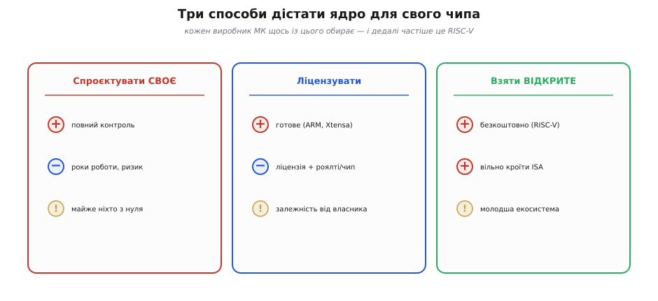
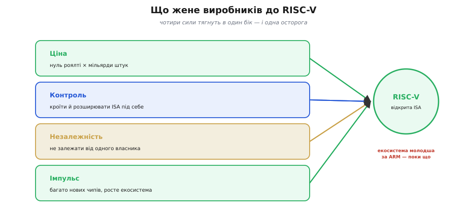
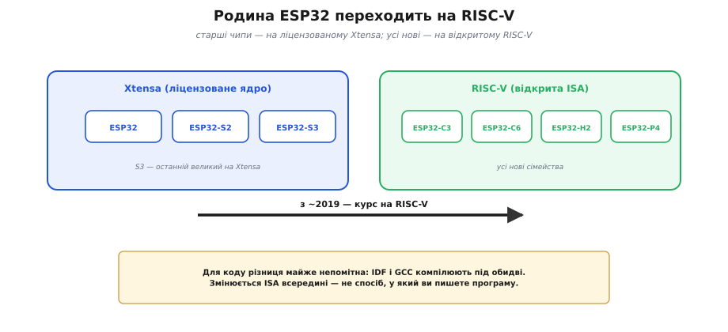

# 📜 Чому виробники МК мігрують на RISC-V

> Історична вставка про [**сімейство ESP32**](root:embedded/esp32-family). У цій родині одні чипи (S-серія) і другі (C-серія) — це не просто «слабші й сильніші»: усередині в них **різні системи команд**. Тут — чому так сталося і чому ціла галузь мікроконтролерів зараз тихо перебирається на **RISC-V**. Сам родовід RISC-V як [відкритої архітектури з Берклі](topic:hw-arch/isa) — окрема історія; ця ж розповідь — про **міграцію виробників**, її причини й ціну.

## Дивна літера в назвах: чому C3 інакший за S3

Якщо придивитися до родини ESP32, у назвах ховається підказка. **ESP32-S3** і **ESP32-C3** відрізняються не лише потужністю — у них **різні мозки**: S3 виконує систему команд **Xtensa**, а C3 — **RISC-V**. Це дивно: навіщо одній компанії пхати у свої чипи **дві різні** архітектури ядра, та ще й посеред лінійки переходити з однієї на другу?

Відповідь не технічна, а радше **економічна й стратегічна** — і вона пояснює не тільки химерію в назвах ESP32, а й один із найбільших зсувів у світі мікроконтролерів за останнє десятиліття. Щоб його зрозуміти, почнімо з простого питання: а звідки взагалі виробник чипа бере «мозок» для свого виробу?

## Три способи дістати ядро: своє, ліцензоване, відкрите

Коли компанія робить новий мікроконтролер, ядро-процесор у нього береться одним із трьох шляхів.

*Три дороги. Спроєктувати власну архітектуру — повний контроль, але роки роботи й величезний ризик, тож із нуля майже ніхто. Ліцензувати готову (ARM, Xtensa) — швидко й надійно, зате ліцензія плюс роялті за кожен чип і залежність від власника. Узяти відкриту (RISC-V) — безкоштовно й вільно кроїти, ціна — молодша екосистема.*

**Спроєктувати власну** систему команд — шлях гордих і небагатьох. Це повний контроль, але водночас роки інженерної праці, написання компіляторів, відлагоджувачів, документації з нуля — і ризик, що твоя архітектура не злетить. Дозволити собі таке можуть одиниці.

**Ліцензувати готову** — найпоширеніший досі шлях. Купуєш право використати перевірену архітектуру з готовою екосередою: переважно це **ARM** (спершу *Acorn RISC Machine*, згодом *Advanced RISC Machines* — британська архітектура, що сама виросла з тієї ж RISC-ідеї), рідше — **Xtensa** (фірмова назва від *extensible*, «розширюваний», бо ядро дозволяло докроювати інструкції під замовника) від Tensilica, нині у складі Cadence. Швидко, надійно, з купою інструментів. Та за це двічі платиш: **ліцензія** наперед — і **роялті** за **кожен** проданий чип. А ще ти прив'язаний до власника архітектури: його ціни, його правила, його дозволи.

**Узяти відкриту** — новий і дедалі популярніший шлях: **RISC-V** (від англ. *Reduced Instruction Set Computer*, «комп'ютер зі скороченим набором команд»; «V» — п'ята дослідна редакція цієї ідеї в Берклі), безкоштовна й відкрита [система команд](topic:hw-arch/isa), що народилася в каліфорнійському університеті. Жодних ліцензійних платежів, жодних роялті, та ще й свобода додавати власні інструкції. Плата інша — екосистема молодша за ARM-івську, що складалася десятиліттями.

## «Податок на ARM» і чому копійки вирішують

Серцевина всієї історії — гроші, і саме там, де їх, здавалося б, нема: у **роялті**. Ліцензований процесор бере невеличку плату з кожного проданого чипа — частку, яку у галузі напівжартома звуть **«податком на ARM»** (*ARM tax*). На одному чипі це дрібниця. Але мікроконтролери продають **мільярдами** штук, а коштує кожен **копійки**. І коли весь твій чип іде за півдолара, навіть маленьке роялті з'їдає помітний шмат прибутку, помножений на мільярди.

Ось чому в світі дешевої масової електроніки **копійки на одиницю вирішують усе** — та сама логіка, за якою [на масштабі важать саме копійки й мікроампери](root:embedded/esp32-vs-8bit). RISC-V прибирає цей рядок витрат **до нуля**: відкриту архітектуру можна використати, не платячи нікому за саму ISA. Для виробника, що цілиться в багатомільярдні тиражі, це не дрібниця, а пряма дорога до нижчої ціни — або вищого прибутку при тій самій ціні.

Щоб відчути масштаб, прикиньмо на пальцях. Хай роялті — лише кілька центів із чипа (точні ставки тримають у таємниці, тож візьмемо порядок величини). На одному чипі це ніщо. Але помножте кілька центів на **мільярд** проданих штук — і вийдуть десятки мільйонів, які щороку течуть власникові архітектури. Для компанії, що живе на тонкій маржі дешевих чипів, це різниця між прибутком і збитком. RISC-V обнуляє цей рядок — і саме тому навіть невелика на вигляд економія на одиниці перетворюється на **стратегічну** перевагу на масштабі.

## Не лише гроші: свобода кроїти ядро під себе

Якби річ була тільки в роялті, ARM могла б просто знизити ставки — і почасти так і робить. Але до RISC-V вабить не лише ціна.

*Що жене виробників: нульове роялті на тлі мільярдних тиражів, свобода кроїти й розширювати ядро під свою задачу, незалежність від єдиного власника архітектури й загальний імпульс — RISC-V уже в чималій частці нових проєктів. Осторога одна, але важлива: екосистема ще молодша за ARM.*

**Контроль.** Відкрита ISA дозволяє **розширювати** ядро власними інструкціями — під шифрування, обробку сигналу, машинне навчання. З ліцензованим ядром ти береш, що дають; з відкритим — кроїш під себе.

**Незалежність.** Прив'язка до єдиного постачальника архітектури — це ризик: зміняться його ціни, політика чи власник — і твоя дорожня карта в чужих руках. Це давній урок [історії 8051](root:embedded/esp32-vs-8bit/hist-8051.md): великі замовники завжди боялися залежати від одного джерела. RISC-V знімає цей страх на рівні самої архітектури — нею не володіє ніхто **і** володіють усі.

**Геополітика.** Коли архітектура нічия й відкрита, її не можна «заборонити» чи відрізати санкціями так, як ліцензовану. Для багатьох компаній і країн це окремий, дуже вагомий аргумент тих років.

## Шлях Espressif: від Xtensa до RISC-V

Тепер химерія в назвах ESP32 стає прозорою. Класичний **ESP32**, а за ним **ESP32-S2** і **ESP32-S3** збудовані на **Xtensa** — а це **ліцензоване** ядро, за яке Espressif так само платила власникові. Тобто компанія добре знала «податок» на своїй шкірі.

Чому ж тоді Espressif узагалі почала з Xtensa, а не з ARM чи одразу RISC-V? Бо Xtensa — ядро **конфігуроване**: його можна було підлаштувати під свої потреби ще тоді, коли RISC-V лише зароджувався і не мав ні зрілих інструментів, ні спільноти. Для молодої компанії, що робила дешеві Wi-Fi-чипи, це був тверезий вибір **свого часу**. Та з роками RISC-V дозрів — і дав те саме право кроїти ядро під себе, але вже **без** ліцензійного цінника. Тож подальший перехід став майже неминучим.

*Розкол родини. Старші ESP32, S2 і S3 — на ліцензованому Xtensa (S3 — останній великий чип на ньому). Усі нові сімейства — C3, C6, H2, високопродуктивний P4 — уже на відкритому RISC-V. Курс узято приблизно з 2019 року.*

Приблизно з **2019 року** Espressif узяла чіткий курс на RISC-V. Нові сімейства — дешевий **ESP32-C3**, бездротовий **C6** (Wi-Fi 6 + 802.15.4), **H2** під Thread/Zigbee, потужний **P4** без радіо — усі на RISC-V. **S3** лишився, по суті, останнім великим чипом компанії на Xtensa. Логіка та сама, що жене всю галузь: звільнитися від ліцензій і роялті, тримати власну дорожню карту у своїх руках, опертися на архітектуру, навколо якої збирається весь світ.

І зверніть увагу на тонкість, яку добре видно саме на прикладі Espressif: міграція **не означає «гірше»**. S3 із його Xtensa-ядром має, наприклад, векторні інструкції для прискорення нейромереж; а скромний C6 на одному RISC-V-ядрі на 160 МГц спокійно тягне захищені стеки на кшталт Matter. Архітектура ядра — це про **бізнес і свободу**, а не автоматично про продуктивність.

## Не лише Espressif: ціла галузь у русі

Espressif тут не одинак, а частина широкої хвилі. Одним із перших гучних кроків став **Western Digital**: виробник накопичувачів оголосив, що переведе мільярди своїх вбудованих контролерів на RISC-V, і навіть **відкрив** власне ядро спільноті. **Nvidia** тихо замінила свій давній службовий мікроконтролер усередині відеокарт на RISC-V-ядро — те саме «непомітне ядро в чужому чипі» [з історії 8051](root:embedded/esp32-vs-8bit/hist-8051.md), лише вже відкрите. За ними потягнулися численні виробники МК, додаючи RISC-V-лінійки поряд зі звичними ARM.

Чому всі разом? Бо на кожного тиснуть **ті самі** сили: нуль роялті на тлі шалених тиражів, свобода кроїти ядро під свою задачу, незалежність від єдиного власника й бажання не лишитися збоку від архітектури, навколо якої збирається весь світ. А кожен новий учасник робить екосистему трохи зрілішою — і тим підштовхує наступного. Це класичний маховик стандартизації, тільки цього разу він розкручується навколо архітектури, що **не належить нікому**.

## Що це коштує: молода екосистема й ризик фрагментації

Чесна історія не буває однобокою. У RISC-V є й ціна, і про неї варто сказати прямо. ARM збирала свою екосистему **десятиліттями**: відлагоджені компілятори, операційні системи, бібліотеки, мільйони інженерів, які її знають. RISC-V усе це надолужує — швидко, але **молодшою** спільнотою й коротшою історією перевірок.

Є й специфічний ризик — **фрагментація**. Свобода додавати власні розширення обертається тим, що різні RISC-V-чипи можуть підтримувати **різні** набори інструкцій, і код під один не конче піде на інший. Галузь це усвідомлює й бореться **профілями** (стандартними наборами розширень, як-от RVA23), щоб «відкрите» не означало «несумісне». Поки що інерція на боці RISC-V: за галузевими оцінками, лік уже випущених ядер сягає **понад двадцять мільярдів**, а в нових проєктах чипів його частка швидко зростає. Той самий маховик стандартизації, що колись розкрутив [історію 8051](root:embedded/esp32-vs-8bit/hist-8051.md), крутиться знову — тільки тепер навколо архітектури, що не належить нікому.

## Що це означає для тебе як розробника

Найважливіша новина — заспокійлива: для **тебе**, хто пише прошивку, ця підкилимна війна архітектур майже непомітна. Той самий фреймворк (IDF) і той самий компілятор (GCC) збирають твій код і під Xtensa, і під RISC-V; твоя програма мовою C виглядає **однаково**. Перемикаючись із ESP32-S3 на ESP32-C3, ти здебільшого навіть не помітиш, що під тобою змінилося ядро.

То навіщо це знати? Бо це пояснює **дві** практичні речі. По-перше, ту саму химерію в назвах родини: тепер зрозуміло, чому C-чипи й S-чипи влаштовані по-різному всередині й чому нові моделі — на RISC-V. По-друге — куди **дме вітер**: обираючи чіп надовго, варто знати, що галузь зміщується до відкритої архітектури, і нові сімейства, найімовірніше, будуть саме на ній. А коли захочеться зрозуміти, **звідки** взялася ця відкрита [ISA](topic:hw-arch/isa) й чому її роздали безкоштовно, — на тебе чекає окрема історія про Берклі. Тут же висновок простий: інколи найбільшу різницю в залізі робить не нова схемотехніка, а нова **модель власності** на ідею.
