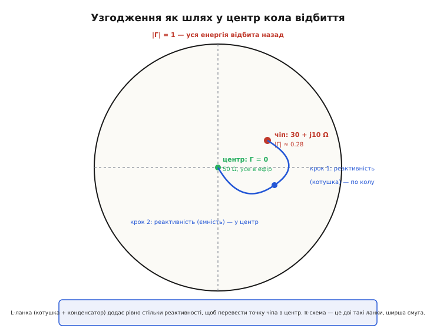
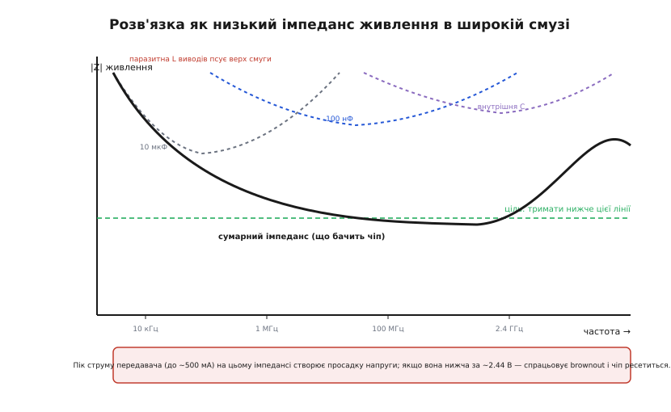
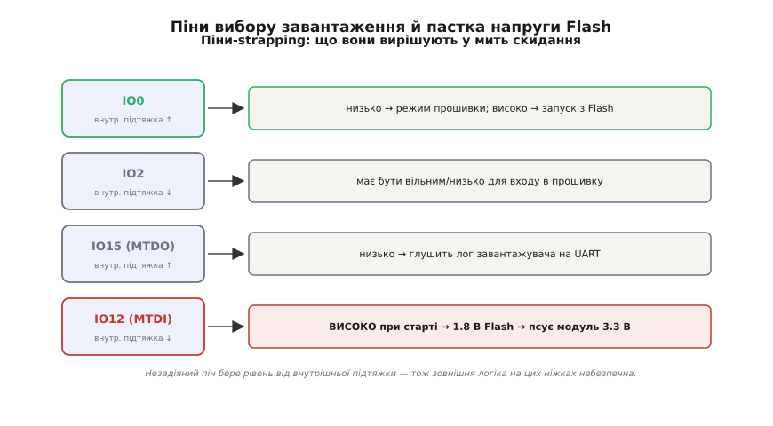

# 🔌 Модуль WROOM/WROVER: повна анатомія — від хвильового опору до пастки напруги Flash

У базовій версії ми з'ясували головне: голий кристал ESP32 не запускається на столі, бо навколо радіо на 2.4 ГГц треба зробити багато тонкої роботи — узгодити тракт до 50 Ω, накрити його екраном, винести антену в зону без міді, сертифікувати передавач. Модуль (від латинського *modulus* — «мірка, окрема одиниця») усе це вже містить готовим. Тут ми **не переказуємо** це, а розкриваємо механіку до дна: **звідки береться** формула хвильового опору, **як саме** π-схема «крутить» комплексний опір чіпа в чисті 50 Ω, **чому** три різні конденсатори по живленню, **як** один необережно підтягнутий пін може фізично спалити мікросхему Flash, і **чому** металева коробочка — не просто «щоб не фонило», а юридична умова виходу на ринок.

Мікроконтролер як [ядро, дві пам'яті й периферія](book:programming/mcu-blocks) ми вже розбирали; так само вже пройшли [антену ESP32 та її резонансну довжину](root:embedded/esp32-antenna). Ця стаття зшиває обидва боки — цифровий чіп і радіотракт — в одну фізичну картину того, що виробник модуля спаяв і налаштував замість тебе.

## Чому доріжка стає лінією передачі: виведення хвильового опору

У базовій статті ми взяли формулу Z₀ = √(L/C) як факт. Тепер побудуймо її на очах, бо без цього узгодження лишається магією.

Почнімо з питання, від якого все залежить: **чому на 2.4 ГГц звичайна доріжка перестає бути дротом?** На постійному струмі провідник передає напругу «весь одразу»: підняв потенціал на одному кінці — на другому він майже миттєво такий самий. Це працює, поки довжина провідника **набагато менша** за довжину хвилі сигналу. У базовій версії ми порахували, що на 2.4 ГГц хвиля в текстоліті FR4 — близько 69 мм, а чверть хвилі — близько 17 мм. Доріжка в кілька сантиметрів уже **порівнянна** з хвилею, і тоді напруга вздовж неї не однакова: у різних точках вона різна в один і той самий момент. Провідник стає **лінією передачі** (transmission line; *line* тут — «лінія, тракт»).

Щоб зрозуміти лінію, розріжмо її подумки на нескінченно короткі шматочки довжиною dx. Кожен такий шматочок — це не ідеальний дріт, а маленький вузол із двох реактивностей:

- **Погонна індуктивність L** (на одиницю довжини): навколо струму, що тече доріжкою, є магнітне поле; змінний струм — змінне поле — наведена проти-ЕРС. Шматочок доріжки поводиться як крихітна котушка.
- **Погонна ємність C** (на одиницю довжини): між сигнальною доріжкою і суцільним шаром землі під нею є електричне поле; це конденсатор. Шматочок «тримає» заряд відносно землі.

Тепер запишемо, що відбувається на одному шматочку dx, коли по ньому біжить швидкий фронт. Напруга падає вздовж шматочка через індуктивність (на котушці напруга дорівнює L помножити на швидкість зміни струму), а струм «витікає» вбік через ємність (у конденсатор тече струм, пропорційний швидкості зміни напруги):

```
спад напруги на шматочку:   ∂V/∂x = −L · ∂I/∂t
витік струму в ємність:     ∂I/∂x = −C · ∂V/∂t
```

Це — **телеграфні рівняння** (telegrapher's equations; назва — від телеграфних ліній XIX ст., де їх і вивели). Вони кажуть просту річ: зміна напруги вздовж лінії породжує зміну струму в часі, і навпаки. Розв'язок таких рівнянь — **хвиля**: збурення, що біжить уздовж лінії зі скінченною швидкістю. І от ключове — у цій хвилі напруга й струм **жорстко зв'язані одним коефіцієнтом**. Підставмо пробну хвилю, що біжить у один бік (усе залежить від комбінації x − v·t): тоді похідна по x і похідна по t відрізняються лише множником −1/v, і два рівняння дають:

```
V = (L · v) · I        (з першого рівняння)
I = (C · v) · V        (з другого рівняння)
```

Перемножмо їх — V·I з обох боків, скорочується — і дістанемо швидкість хвилі:

```
1 = L·C·v²   →   v = 1 / √(L·C)
```

а поділивши перше на друге, дістанемо відношення напруги до струму в біжучій хвилі:

```formula
V / I = √(L / C) ≡ Z₀
```

Ось воно. **Хвильовий опір Z₀ = √(L/C)** — це не «опір» у сенсі нагрівання (лінія без втрат нічого не гріє), а **відношення напруги до струму, яке сама хвиля змушена підтримувати** в кожній точці, поки біжить. Звідси видно те, що в базовій версії було просто заявлено: Z₀ **не залежить** ні від довжини лінії, ні від частоти — лише від геометрії (яка задає L і C). Ширина доріжки, товщина діелектрика під нею та його проникність ε — і Z₀ зафіксовано вздовж усієї лінії.

> 🔧 **Навіщо це.** Коли даташит модуля каже «доріжка від виводу RF до антени має бути 50-омною мікросмужкою», за цим стоїть саме √(L/C): виробник підібрав ширину доріжки під стек своєї плати так, щоб відношення напруги до струму в біжучій хвилі дорівнювало 50 Ω. Розводячи власну плату під голий чіп чи виносячи коаксіал від роз'єму, ти маєш утримати ту саму геометрію — інакше Z₀ попливе, і в тракті з'явиться відбиття ще до антени.

## Що фізично відбувається на кінці лінії: відбиття як вимога неперервності

Тепер — чому неузгодження **буквально** повертає потужність назад. Хвиля V/I = Z₀ добігла до кінця лінії, де сидить навантаження (антена) з опором Z_L. У самій точці стику мусять одночасно виконатися дві умови, і саме їхня несумісність породжує відбиту хвилю.

По-перше, **закон Ома на навантаженні**: у точці стику відношення повної напруги до повного струму дорівнює Z_L (це визначення навантаження). По-друге, **біжуча хвиля несе Z₀**: падаюча хвиля V₊/I₊ = Z₀. Якщо Z_L ≠ Z₀, ці дві вимоги суперечать одна одній — падаюча хвиля «не вміє» мати на кінці відношення Z_L. Природа розв'язує суперечку єдиним способом: породжує **відбиту хвилю** V₋, що біжить назад. Повна напруга в точці стику — сума падаючої і відбитої (V₊ + V₋), повний струм — їхня різниця (бо відбита біжить у протилежний бік: I₊ − V₋/Z₀). Вимога Z_L для суми дає:

```
Z_L = (V₊ + V₋) / (I₊ − V₋/Z₀) = (V₊ + V₋) / ((V₊ − V₋)/Z₀)
```

Позначмо коефіцієнт відбиття Γ = V₋/V₊ (грец. велика «гамма»; *reflection*, «відбиття»). Поділимо чисельник і знаменник на V₊ і розв'яжемо відносно Γ:

```
Z_L = Z₀ · (1 + Γ) / (1 − Γ)
```

а звідси — та сама формула, що в базовій версії була просто дана:

```
Γ = (Z_L − Z₀) / (Z_L + Z₀)
```

Тепер вона не з неба, а з вимоги, що на стику одночасно правдиві і закон Ома навантаження, і природа біжучої хвилі. Перевірмо крайні випадки, бо вони найкраще показують суть:

- **Z_L = Z₀ (узгоджено):** чисельник нуль, Γ = 0, відбитої хвилі нема. Лінія «не бачить» кінця — ніби вона нескінченна, уся енергія пішла в навантаження.
- **Z_L = ∞ (розрив, антена відірвана):** Γ = +1. Відбита хвиля дорівнює падаючій, напруга на кінці подвоюється, струм нуль — уся енергія повернулась.
- **Z_L = 0 (коротке замикання):** Γ = −1. Відбита хвиля в протифазі, напруга на кінці нуль, струм подвоюється — знову вся енергія назад, але з переверненою фазою.

Відбита **потужність** — це Γ², бо потужність пропорційна квадрату амплітуди. І ця потужність нікуди не дівається в ефір: вона повертається до вихідного каскаду (підсилювача потужності, PA) і там марно перетворюється на тепло. Це і є фізичний сенс фрази «неузгодження коштує дальності» — не метафора, а відсотки потужності, що не долетіли до антени.

**Родина мір неузгодження.** Інженери описують те саме відбиття кількома величинами; варто бачити зв'язок між ними, бо в даташитах трапляються всі три.

```
коефіцієнт відбиття:   Γ = (Z_L − Z₀)/(Z_L + Z₀)
коефіцієнт стійної хвилі (VSWR):  s = (1 + |Γ|)/(1 − |Γ|)
зворотні втрати (return loss):    RL = −20·log₁₀|Γ|   [дБ]
втрати на неузгодженні (mismatch loss): ML = −10·log₁₀(1 − |Γ|²)  [дБ]
```

VSWR (voltage standing wave ratio; «коефіцієнт стійної хвилі за напругою») — це відношення максимуму до мінімуму напруги вздовж лінії: падаюча й відбита хвилі складаються то в фазі, то в протифазі, утворюючи **стійну хвилю** з горбами й западинами. При ідеальному узгодженні s = 1 (нема западин, бо нема відбитої); при повному відбитті s → ∞. Return loss — просто те саме |Γ| у децибелах, зручне для читання (більше дБ = краще). Mismatch loss — скільки децибел потужності **не дійшло** до навантаження через відбиття.

**Worked example: скільки коштує «просто трохи неузгодження».**

Уяви, що мідь під антеною зсунула її імпеданс з 50 до 75 Ω — здавалося б, дрібниця.

```
Γ  = (75 − 50)/(75 + 50) = 25/125 = 0.20
s  = (1 + 0.20)/(1 − 0.20) = 1.20/0.80 = 1.5     → VSWR 1.5:1
RL = −20·log₁₀(0.20) = −20·(−0.699) ≈ 14 дБ
ML = −10·log₁₀(1 − 0.20²) = −10·log₁₀(0.96) ≈ 0.18 дБ
```

Тут відбилося лише Γ² = 4 % потужності, mismatch loss усього 0.18 дБ — це майже непомітно, VSWR 1.5:1 вважають цілком прийнятним. А тепер порівняй із базовим прикладом, де антена «поплила» до 100 Ω: там Γ = 0.333, відбилося 11 %, RL впав до 9.5 дБ. Різниця між «трохи» (75 Ω) і «помітно» (100 Ω) — не лінійна: відбиття зростає **квадратично** з відхиленням. А якби антена пішла в коротке замикання (Z_L → 0), Γ → −1, mismatch loss → ∞ — майже вся потужність назад. Ось чому виробник тримає VSWR тракту в межах 1.5:1–2:1 і чому один твій полігон землі під антеною зводить цю роботу нанівець.

## Як π-схема «крутить» опір: механіка узгодження

Ми дійшли до найтоншого місця. Вихід радіо ESP32 — **не 50 Ω**, і базова версія назвала цифру: приблизно (30 + j10) Ω для кристала в корпусі QFN 6×6 (для меншого корпусу 5×5 — приблизно (35 + j10) Ω; різниця — бо інша геометрія виводів). Літера j (уявна одиниця; електротехніки пишуть j, а не i, щоб не плутати зі струмом) означає **реактивну** складову: тут вона додатна, тобто **індуктивна** — вихід чіпа поводиться як 30 Ω активного опору послідовно з невеликою котушкою. Просто притулити до цього 50-омну антену — внести відбиття на самому старті тракту. Треба **трансформувати** (30 + j10) Ω у чисті 50 Ω на робочій частоті. Це робить **π-подібна схема** з двох конденсаторів і котушки між ними (CLC) — та сама, що модуль уже містить.

Як реактивність може перетворити один опір на інший, нічого не гріючи? Тут допомагає геометричний образ. Усі можливі навантаження зручно розмістити на площині коефіцієнта відбиття Γ: центр — ідеальні 50 Ω (Γ = 0), край одиничного кола — повне відбиття (|Γ| = 1). Кожне навантаження — точка. **Узгодити** означає перевести точку чіпа в центр.


*Точка чіпа (30 + j10) Ω лежить збоку від центру — це помірне відбиття |Γ| ≈ 0.28. Послідовна реактивність (котушка) рухає точку по одному сімейству кіл, паралельна (конденсатор на землю) — по іншому. L-ланка з двох таких кроків заводить точку рівно в центр (50 Ω, Γ = 0). π-схема — це дві L-ланки поспіль, вона робить те саме, але тримає узгодження в ширшій смузі частот.*

Ключ у тому, що **послідовний** елемент (котушка в розрив лінії) і **паралельний** елемент (конденсатор із лінії на землю) рухають точку по **різних** сімействах кіл — одне «крутить» у бік зміни реактивності, друге у бік зміни провідності. Чергуючи послідовний і паралельний кроки, можна з будь-якої точки прийти в центр. Найпростіший узгоджувач — **L-ланка** з двох елементів (один послідовний, один паралельний): рівно два кроки, рівно в центр. π-схема — це фактично дві L-ланки, з'єднані спільним вузлом; зайвий елемент дає ступінь свободи, якою жертвують на користь **ширшої смуги**: L-ланка узгоджує точно на одній частоті, а π тримає прийнятне узгодження в діапазоні (для ESP32 це вся смуга 2.4–2.4835 ГГц Wi-Fi/BLE).

За ширину смуги відповідає **добротність** (quality factor, Q; *quality*, «якість»). Груба, але корисна оцінка: щоб узгодити активний опір R_low з активним R_high однією L-ланкою, потрібна

```
Q = √(R_high / R_low − 1)
```

Для нашого випадку (умовно R_low ≈ 30 Ω активної частини чіпа, R_high = 50 Ω):

```
Q = √(50/30 − 1) = √(1.667 − 1) = √0.667 ≈ 0.82
```

Низька Q — добре: ланка виходить широкосмуговою (відносна смуга приблизно 1/Q), бо трансформувати треба всього в 1.67 раза. Якби чіп мав, скажімо, 5 Ω, знадобилась би Q ≈ 3, смуга звузилась би втричі, і одна L-ланка вже не витягла б усю смугу Wi-Fi — тому й ставлять π (двоступеневу) із проміжним віртуальним опором, щоб кожен крок мав малу Q. Повне виведення номіналів котушки й конденсаторів π-схеми з рівнянь для R і Q — окрема викладка; я виніс її в [математичну вставку про синтез узгоджувача](root:embedded/esp32-module/math-pi-match.md), бо тут головне — зрозуміти **механіку** (реактивність возить точку по колах у центр), а не саму арифметику номіналів.

> 🔧 **Навіщо це.** Саме цю π-схему модуль містить і **налаштував на заводі** під свою антену на векторному аналізаторі кіл — приладі, що прямо міряє Γ на кожній частоті. Ось чому в продукт ставлять модуль, а не голий чіп: підбір трьох номіналів CLC під конкретну геометрію плати — це вимірювальна робота, яку за тебе вже зробили. І ось чому її не можна відтворити «на око»: помилка в частках пікофарад зсуває точку повз центр, VSWR росте, дальність падає. Зіпсувати готове узгодження ти можеш лише ззовні — змінивши те, що бачить антена: мідь поруч, металевий корпус, руку користувача.

## Металевий екран: не «щоб не фонило», а закон і фізика щілин

Базова версія назвала три причини екрана й модуля — узгодження, PSRAM у WROVER, сертифікацію — і сказала, що екран «тримає випромінювання всередині». Розкриймо, **чому саме металева коробочка** і **чому це юридична вимога**, а не просто гігієна.

Почнімо з права, бо тут причина найсильніша. Будь-який навмисний передавач (intentional radiator — «навмисний випромінювач» у термінах американського регулятора FCC) треба сертифікувати. Але є спеціальний, дешевший шлях — **модульне схвалення** (modular approval): виробник модуля один раз проходить випроби радіо, дістає **FCC ID**, і кожен виріб, що ставить цей модуль без змін, **успадковує** дозвіл. Ключове: щоб модуль кваліфікувався на **повне** модульне схвалення (single modular approval), він за правилами регулятора мусить задовольняти перелік умов — і **власне екранування радіочастини** стоїть у цьому переліку прямо. Формулювання правила (47 CFR §15.212) буквально вимагає, щоб радіоелементи модуля мали **власний екран**; кварц і конденсатори підстроювання можуть бути й поза екраном, але сам радіотракт — під ним. Тобто металева коробочка — не забаганка інженера, а **умова, за якою твій виріб успадкує дозвіл**. Без екрана модуль опускається в «обмежене модульне схвалення» (limited modular approval), і тоді частину випроб доведеться проходити вже на рівні готового виробу — те, чого модуль якраз мав тебе позбавити.

Історію того, як узагалі виник цей режим «сертифікуй модуль один раз» і чому екрановані бляшані коробочки стали стандартом радіомодулів, я виніс в [окрему вставку](root:embedded/esp32-module/hist-shield-can.md) — вона пояснює, звідки взявся сам винахід «radio-in-a-can».

Тепер фізика: **чому металева коробочка тримає поле і де вона протікає.** Суцільна провідна оболонка навколо джерела змінного поля працює як [клітка Фарадея](book:physics/faraday-cage): змінне зовнішнє поле наводить у стінці струми, які створюють протиполе й гасять поле по той бік. Для екрана передавача це працює в обидва боки — і не пускає власне випромінювання назовні до сусідніх кіл. Але тут криється тонкість, важлива на 2.4 ГГц: екран не суцільний. У ньому є **щілини** — стик кришки з рамкою, вентиляційні отвори, зазор під виводи. І щілина в екрані поводиться як... **щілинна антена** (slot antenna). Правило жорстке: щілина випромінює тим краще, чим ближча її **довга сторона** до половини довжини хвилі. На 2.4 ГГц половина хвилі в повітрі — близько 61 мм; отже небезпечні щілини сантиметрового масштабу. Ось чому екран модуля припаяний до землі **частими** точками по периметру, а не кількома: між сусідніми точками пайки лишається коротка щілина (кілька міліметрів), яка на 2.4 ГГц випромінює мізерно. Порідшали б точки — з'явилася б довша щілина, і екран почав би «світити» саме на робочій частоті.

> 🔧 **Навіщо це.** Розуміння «щілина = антена» рятує на власній платі двічі. По-перше, не ріж додаткові отвори в зоні модуля й не лишай довгих незашитих швів у своєму власному екрані поряд. По-друге, це та сама фізика, що й з відступом під антеною: усе сантиметрового масштабу на 2.4 ГГц — потенційний випромінювач або приймач. Один довгий проріз у полігоні землі під платою може стати щілинною антеною й зіпсувати і випромінювання корисне, і ЕМС.

## Живлення: чому три конденсатори і де ховається BROWNOUT

Базова версія показала мінімальну обв'язку: 100 нФ + 10 мкФ по живленню, RC на EN, підтяжка IO0 — і назвала причину збоїв: пік струму радіо просаджує погано розв'язане живлення нижче порога, чіп ресетиться в BROWNOUT. Тепер розкриймо **чисельно**, чому саме такі номінали і чому їх кілька.

Корінь проблеми — **різкий, короткий сплеск струму** передавача. Коли ESP32 виходить в ефір, підсилювач потужності вмикається за мікросекунди й тягне пік до **~500 мА** (проти десятків мА у звичайному режимі). Джерело живлення (регулятор десь на платі) не встигає віддати цей струм миттєво — між ним і чіпом є індуктивність доріжок і власна повільність регулятора. Якби живлення тримали лише «здалеку», напруга на виводі чіпа просіла б на час сплеску. Тому поряд ставлять **місцевий запас заряду** — розв'язувальні конденсатори, які віддають струм миттєво, поки регулятор «прокидається».

Скільки просяде напруга — можна оцінити прямо. Конденсатор віддає заряд, і його напруга падає за ΔV = I·Δt/C. Нехай пік 500 мА триває, поки регулятор підхопить, умовно 5 мкс, а місцевий запас — лише 10 мкФ:

```
ΔV = I · Δt / C = (0.5 А · 5·10⁻⁶ с) / (10·10⁻⁶ Ф)
   = 2.5·10⁻⁶ / 10·10⁻⁶
   = 0.25 В
```

Просадка 0.25 В означає, що 3.3 В стануть ~3.05 В — ще терпимо. Але додай сюди падіння на індуктивності доріжки (на різкому фронті струму воно теж віднімається), тепле живлення від USB через довгий кабель, уже трохи занижені 3.2 В на вході — і легко провалитися до **порога brownout**. У ESP32 детектор пониженої напруги (brown-out detector; *brown-out*, «просідання», на противагу *black-out*, «повне зникнення») спрацьовує приблизно на **2.44 В** і робить скидання. І найпідступніше: скидання стається саме в мить виходу в ефір — тобто пристрій «падає рівно тоді, коли пробує щось передати», а на столі при налагодженні без передачі все ідеально. Це класична пастка, і причина reset у логах буде саме [`BROWNOUT`](book:programming/reset-causes).

Тепер — **чому не один великий конденсатор, а кілька різних.** Тут потрібен погляд на розв'язку як на **імпеданс живлення в широкій смузі частот**. Ідеальне живлення — це нульовий імпеданс: хоч який струм смикни, напруга не ворухнеться. Реальний конденсатор дає низький імпеданс лише в **своїй смузі**: на низьких частотах його опір великий (1/ωC), з ростом частоти падає — але не до нуля, бо в конденсатора є власна паразитна індуктивність виводів (ESL) і послідовний опір (ESR). Тому кожен конденсатор має «ванну» імпедансу: спад, мінімум на власному резонансі, потім знову зростання (уже індуктивне). Один номінал закриває одну смугу.


*Кожна ємність дає низький імпеданс лише у своїй смузі (пунктир — «ванни» окремих конденсаторів). Bulk 10 мкФ тримає низ (повільні коливання струму), 100 нФ — середину, дрібна внутрішня ємність корпусу — верх. Суцільна крива — сумарний імпеданс, що бачить чіп: разом вони тримають його під цільовою лінією до сотень мегагерц. Паразитна індуктивність виводів псує верх смуги — тому найдрібніший конденсатор ставлять найближче до виводу, з найкоротшими доріжками.*

Звідси й рецепт: **10 мкФ** (bulk) гасить повільні, «великі» коливання струму, коли радіо то вмикається, то ні; **100 нФ** прямо біля виводу живлення закриває середні-високі частоти сплеску; а зовсім високі бере на себе крихітна внутрішня ємність кристала й корпусу. Разом вони тримають імпеданс низьким у широкій смузі. Espressif у своїх рекомендаціях додає ще й вимогу на **пульсацію**: розмах пульсації живлення має бути менший за ~80 мВ у режимі Wi-Fi 11n (MCS7) і ~120 мВ у 11b — бо пульсація прямо псує спектр переданого сигналу (модулює несучу). Тобто розв'язка тут працює на дві мети одразу: не дати brownout **і** не забруднити передачу.

Практика написання прошивки, що переживає й діагностує brownout (як прочитати причину скидання, як обмежити пік струму радіо на старті, як зміряти профіль споживання при передачі), винесена в [окрему кодову вставку](root:embedded/esp32-module/proj-brownout-guard.md) — там реальний C для ESP-IDF, а не рецепти.

**Про EN окремо.** RC-ланка на виводі EN (підтяжка 10 кОм вгору + 1 мкФ на землю) — це не «розв'язка», а **затримка старту**. EN (enable, «дозвіл») вмикає чіп; якщо він підніметься до 3.3 В **раніше**, ніж стабілізується живлення, чіп спробує стартувати на недобудованій напрузі. RC дає EN піднятися **плавно й пізніше** живлення (стала часу τ = R·C = 10 кОм · 1 мкФ = 10 мс), тож на момент дозволу живлення вже чисте. Це межа між «стартує щоразу» і «іноді не запускається з холодного ввімкнення».

## Піни-strapping: як одна ніжка при старті вирішує режим — і як спалити Flash

Базова версія згадала strapping-піни як «вибір завантаження» одним рядком. Це місце заслуговує глибини, бо тут — і логіка старту, і найтихіша апаратна пастка модуля.

**Що таке strapping-пін.** У мить скидання, ще до того як твоя програма отримала контроль, апаратний завантажувач (ROM bootloader) **зчитує рівень** на кількох спеціальних GPIO і за ними вирішує, як стартувати: з Flash чи в режим прийому прошивки, яка напруга живлення Flash, чи виводити лог. Ці піни й звуться strapping (від *to strap*, «прив'язати, зафіксувати ремінцем» — рівень «прив'язують» до потрібного стану на час старту). Одразу після старту ті самі ніжки стають звичайними GPIO — але **мить скидання** їхній рівень визначає долю завантаження.

Кожен strapping-пін має **внутрішню підтяжку** (слабку, кілька десятків кОм), яка задає рівень за умовчанням, якщо ззовні нічого не під'єднано. І от чому це критично: якщо повісити на такий пін звичайну зовнішню логіку з невизначеним рівнем у мить старту, вона переб'є внутрішню підтяжку — і завантаження піде не так.


*Чотири піни, що вирішують старт. IO0 (внутр. підтяжка вгору) вибирає: низько — режим прошивки, високо — запуск із Flash. IO2 має бути вільним або низьким для входу в прошивку. IO15 (MTDO) при низькому глушить лог завантажувача на UART. IO12 (MTDI) — пастка: високий рівень при старті перемикає живлення Flash на 1.8 В, що псує модуль із Flash на 3.3 В.*

Пройдімо піни ESP32 по одному, бо кожен має свій сенс:

- **IO0 — головний вибір режиму.** Внутрішня підтяжка **вгору**, тож за умовчанням чіп стартує з Flash. Притиснеш IO0 до землі в мить скидання (кнопкою BOOT) — чіп зайде в **режим приймання прошивки** через UART. Саме цю ніжку смикає [інструмент прошивання esptool](root:embedded/esptool-workflow), коли автоматично вводить плату в режим завантаження.
- **IO2 — допоміжний для прошивки.** Внутрішня підтяжка **вниз**. У режимі прошивки має бути вільним або низьким; у звичайному старті (IO0 високий) — ігнорується. Тому вішати на IO2 світлодіод із підтяжкою вгору — погана ідея: заважає ввійти в прошивку.
- **IO15 (MTDO) — керує логом.** Внутрішня підтяжка **вгору**. Якщо притиснути його до землі при старті, завантажувач **не виводить** свій діагностичний лог на UART — інколи це роблять зумисне, щоб не засмічувати лінію, якою йде корисний трафік.
- **IO12 (MTDI) — напруга живлення Flash, і тут пастка.** Внутрішня підтяжка **вниз**. Цей пін при старті задає напругу вбудованого регулятора VDD_SDIO, від якого живиться мікросхема Flash: **низько → 3.3 В**, **високо → 1.8 В**. І ось де фізична небезпека: у модулях WROOM/WROVER мікросхема Flash розрахована на **3.3 В**. Якщо через зовнішню підтяжку вгору IO12 виявиться **високим** у мить старту, регулятор віддасть Flash **1.8 В** — і в кращому разі модуль просто не завантажиться, а в гіршому пристрій, налаштований на іншу напругу, працюватиме нестабільно або зазнає ушкодження. Тому на IO12 **не вішають зовнішню підтяжку вгору** й обережні з тим, що на ньому висить у мить скидання.

Тонкість, що рятує: у більшості готових модулів WROOM цю напругу Flash **зашивають назавжди в eFuse** (одноразові плавкі перемички в кристалі) ще на заводі, тож регулятор бере значення з eFuse, а не з піна, і пастка IO12 знешкоджена. Але покладатися на це наосліп не варто — на голому чипі чи на модулі без пропаленого eFuse рівень IO12 у мить старту вирішує все. Це — головна причина, чому даташит модуля має перелік «безпечних» і «обережних» пінів, і чому цей перелік читають **до** розведення, а не після.

> 🔧 **Навіщо це.** Пастка strapping — класична причина «плата, що не прошивається» і «модуль, що вмер після переробки схеми». Знаючи, що IO0/IO2/IO12/IO15 при старті вирішують долю завантаження, ти навмисне лишаєш їх «чистими» або вішаєш на них лише таке навантаження, що не б'є внутрішню підтяжку в мить скидання. Особливо IO12: одна необдумана підтяжка вгору — і Flash дістає 1.8 В.

## WROVER, PSRAM і ціна в пінах

Базова версія сказала, що WROVER додає PSRAM у той самий корпус ціною кількох GPIO. Розкриймо, **чому саме ті піни** й **як багато**.

PSRAM (pseudo-static RAM; «псевдостатична» — динамічна пам'ять із вбудованим оновленням, що зовні поводиться як статична) — це окрема мікросхема оперативної пам'яті поряд із кристалом ESP32, коли бортової [SRAM](book:programming/mcu-blocks) (у ESP32 її ~520 КБ) бракує: камера з кадровим буфером, великі мережеві буфери, графіка. Але PSRAM не безкоштовна в підключенні: вона висить на тій самій внутрішній шині SPI, що й Flash, і **займає виводи** кристала під свої лінії. У класичному WROVER це піни, зайняті під інтерфейс PSRAM (зокрема ті, що в WROOM були вільними GPIO), тож у WROVER **менше доступних GPIO**, ніж у WROOM того самого сімейства. Практично це означає: перш ніж вибрати WROVER заради пам'яті, звір **перелік доступних GPIO** з даташита — кількох звичних ніжок не буде, і план розведення під WROOM може не перенестися на WROVER без переробки.

Ще тонкість: частина модулів має PSRAM/Flash на **1.8 В**, і тоді той самий пін вибору напруги Flash (IO12/MTDI, який ми щойно розбирали) грає протилежну роль. Тому «яка напруга VDD_SDIO у цього модуля» — питання, на яке треба знати відповідь **до** того, як щось повісити на IO12.

## Напівотвори по краю: чому пайка ховається — і як це підводить

Базова версія назвала кастельовані виводи (castellated — англ. «зубчасті, як зубці на стіні замку», від латинського *castellum*, «замок») і попередила про холодну пайку під екраном. Додаймо механіку, бо тут причина відмов суто фізична.

Напівотвір — це металізований отвір, розрізаний навпіл по краю плати модуля: половина циліндра лишається зубцем на торці. Коли модуль ставлять на плату-носій, паста лягає на крайову площадку, а розплавлений припій за рахунок **капілярності** (змочування металу припоєм) підтягується вгору по ввігнутій металізації напівотвору й утворює галтель — красивий видимий меніск збоку. Це і є перевага castellated: **пайку видно з боку**, її можна оглянути й навіть перепаяти паяльником, не маючи гарячого повітря.

Але є друга група контактів, яку **не видно**: у багатьох модулів під низом, окрім крайових зубців, є ще й площадки (термальна земля, додаткові виводи), що паяються **під корпусом**, наосліп. І тут ховається класична підступна відмова. Якщо профіль оплавлення був неправильний (замало тепла, бо великий полігон землі під модулем «висмоктує» тепло швидше, ніж прогрівається паста), під корпусом утворюється **холодна пайка** — контакт нібито є, але механічно й електрично ненадійний. Зовні модуль припаяний ідеально (крайові галтелі блищать), а всередині земля або живлення тримаються на волосині. Проявляється це найгидкішим чином: **«то ловить, то ні»** — при легкому вигині плати чи зміні температури контакт розмикається, зв'язок пропадає, потім вертається. Шукати таке важко саме тому, що видима частина пайки бездоганна.

Причина, чому великий полігон землі під модулем заважає прогріву, — той самий тепловий опір, що і в тепловідведенні: мідь швидко розносить тепло вбік, тож площадці під модулем треба або більше часу/температури в профілі, або **теплові бар'єри** (thermal relief — «теплове полегшення»: підключення площадки до полігону тонкими перемичками, а не суцільно), щоб паста встигла оплавитися. Це вже питання розведення й монтажу власної плати, але корінь — фізичний: пайку, яку не видно, легко недогріти.

> 🔧 **Навіщо це.** «То ловить, то ні» після власного монтажу модуля — майже завжди прихована холодна пайка землі під корпусом, а не «поганий модуль». Знаючи, що крайові галтелі оманливі (вони чудові навіть коли низ не пропаяний), ти перевіряєш підозрілий модуль не оглядом збоку, а прогрівом/перепайкою або рентгеном, і закладаєш у власну плату теплові бар'єри під площадками, щоб профіль оплавлення прогрів і приховані контакти.

## Варіації класу й наскрізна ідея

Ми пройшли модуль до самого дна, і тепер варіації лінійки читаються як наслідки однієї ідеї, а не як список. **WROOM проти WROVER** — та сама коробочка, але WROVER додає PSRAM ціною пінів (розібрали чому). **Різні обсяги Flash** (4/8/16 МБ) — просто інша мікросхема Flash під екраном, електрично тотожна. **Антена — PCB-доріжка або роз'єм IPEX/U.FL**: у версії з роз'ємом [50-омний коаксіал](book:communications/transmission-lines) виносить точку випромінювання геть від плати — але вся наша теорія лишається чинною: коаксіал теж має тримати Z₀ = 50 Ω (√(L/C) для його геометрії), інакше дешевий пігтейл чи зайвий перехідник внесуть своє Γ, і тракт «просяде» точно за формулою відбиття. Фізику самих [антен](book:communications/antenna) розбирають окремо; сімейство антен ESP32 ми вже пройшли [кроком раніше](root:embedded/esp32-antenna).

Сама ідея модуля наскрізна для всієї лінійки — модулі під ESP32, S3, C3, C6, а також дрібні MINI-модулі: змінюється начинка (архітектура ядра, обсяг пам'яті, набір периферії), але **пакування й сенс лишаються ті самі**. Під екраном — узгоджений на заводі 50-омний тракт, налаштована π-схема, розв'язане живлення, кварц, Flash і, за потреби, PSRAM; назовні — крайові напівотвори й зона антени без міді. Усе, що модуль зробив за тебе, зводиться до однієї фрази: він перетворив найтоншу високочастотну й регуляторну роботу на **звичайний цифровий компонент, який лишається тільки не зіпсувати ззовні** — необдуманою міддю під антеною, поганою розв'язкою живлення, підтяжкою на strapping-піні чи недогрітою пайкою землі. Розуміти *що саме* він зробив — і є вся різниця між «поставив модуль і воно працює» та «поставив і не розумію, чому іноді ні».
