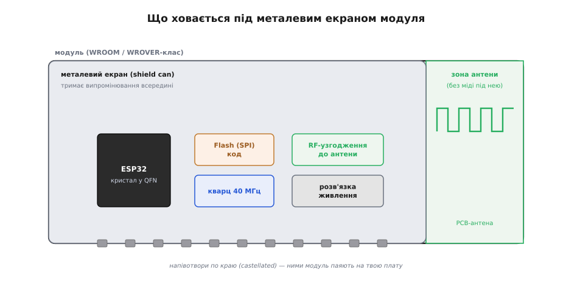
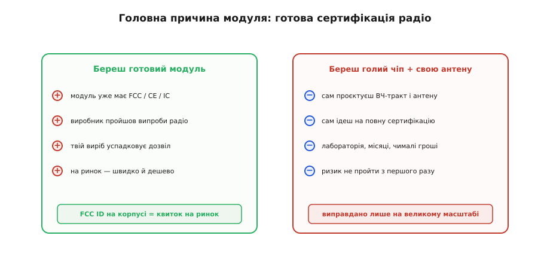

# 🔌 Модуль WROOM/WROVER-класу: чому чіп ховають під екран

> У мікроконтролера є [ядро, дві пам'яті й периферія](topic:programming/mcu-blocks); ця стаття — про **фізичне пакування**, у якому все це купують і паяють: про **модуль** WROOM-класу.

## Навіщо взагалі модуль

Сам кристал ESP32 не запрацює на столі: йому потрібні зовнішній **кварц**, мікросхема **Flash**, **антена** з узгодженням і ретельна **розв'язка живлення**. Спаяти голий QFN-кристал і правильно розвести навколо нього високочастотний тракт — складно й ризиковано. Тому в продуктах ставлять не чіп, а **модуль** (від латинського *modulus* — «мірка, окрема одиниця»; WROOM-клас і подібні): маленьку плату, де все це вже зібрано, налаштовано й **накрито металевим екраном**. Готовий модуль паяють на свою плату кількома десятками крайових площадок — і він просто працює.

Високочастотний тракт — найболючіше місце, і причина суто фізична. На постійному струмі чи на кілогерцах доріжка — це просто провідник: один кінець підняв напругу — другий майже миттєво за ним повторив. Але на **2.4 ГГц** довжина хвилі сигналу в платі — лічені сантиметри, і доріжка вже **порівнянна з хвилею**. Тоді провідник перестає бути «дротом» і стає **лінією передачі**: сигнал біжить по ній зі скінченною швидкістю, і в кожній точці напруга залежить від того, що відбувається на обох кінцях одночасно. Саме звідси — усі складнощі з узгодженням, екраном і зоною відступу під антеною, і кожна з них має фізичну першопричину, а не правило «бо так треба».


*Що ховається під екраном: кристал ESP32 (QFN), мікросхема Flash (саме тут фізично живе програмна пам'ять; у WROVER поряд — ще й PSRAM), кварц 40 МГц, RF-узгодження й розв'язка. Антена винесена на торець, і під нею зумисне нема міді — інакше вона «глухне».*

> 🔧 **Навіщо це.** У реальній embedded-розробці ти майже ніколи не розводиш RF самотужки — ставиш модуль і отримуєш налаштований тракт «з коробки». Але розуміти, *що саме* модуль за тебе зробив, потрібно, щоб не зіпсувати це власним розведенням: один полігон землі під антеною — і дальність падає вдвічі, хоча модуль ідеальний.

## Чому 2.4 ГГц вимагає узгодження: фізика тракту

**Звідки взагалі береться «опір» доріжки.** Будь-яка пара провідників — сигнальна доріжка над суцільним шаром землі — має **погонну ємність** (між доріжкою і землею) і **погонну індуктивність** (від магнітного поля навколо струму). Коли по такій лінії біжить швидкий фронт, він у кожен момент заряджає наступну ділянку ємності струмом, який тече через індуктивність. Відношення напруги до струму, яке встановлюється в цьому процесі, і є **хвильовий (характеристичний) опір** (characteristic impedance, Z₀; *impedance* — від латинського *impedire*, «перешкоджати»):

```
Z₀ = √(L / C)
```

де L і C — індуктивність і ємність **на одиницю довжини**. Зверни увагу: Z₀ не залежить ні від довжини доріжки, ні від частоти — лише від **геометрії** (ширина доріжки, товщина діелектрика, його ε) і матеріалу. Тому Z₀ доріжки задають один раз через ширину й стек плати — і він тримається вздовж усієї лінії.

**Чому саме 50 Ω.** Це історичний компроміс коаксіального кабелю: ~30 Ω дає мінімальні втрати на потужності, ~77 Ω — мінімальне затухання сигналу, і 50 Ω сидить між ними, заодно зручне для розрахунку розмірів. Уся RF-індустрія стандартизувалася на ньому, тому й антени, і роз'єми IPEX/U.FL, і вимірювальні прилади розраховані на **50 Ω** — і твій тракт мусить бути таким самим, щоб усе стикувалося.

**Що таке узгодження й чому без нього втрати.** Коли хвиля доходить до кінця лінії (до антени), вона «бачить» опір навантаження Z_L. Якщо Z_L = Z₀ — уся енергія віддається в антену, ніби лінія нескінченна. Якщо Z_L ≠ Z₀ — частина енергії **відбивається назад** до передавача, як луна. Частку відбитої амплітуди дає коефіцієнт відбиття:

```
Γ = (Z_L − Z₀) / (Z_L + Z₀)
```

Відбита потужність — це Γ², і вона **не вилітає в ефір**: вона марно гріє вихідний каскад і не дає дальності. Ось чому неузгоджений тракт «коштує дальності» — це не метафора, а буквально втрачені відсотки потужності, що повернулися назад.

**У чому пастка саме з ESP32.** Вихід радіо ESP32 — **не 50 Ω**. Він має комплексний опір приблизно **(30 + j10) Ω**: активна частина ~30 Ω плюс невелика індуктивна складова (звідси «+j»). Просто притулити до нього 50-омну антену — означає внести помітне відбиття на самому старті тракту. Тому між чіпом і антеною ставлять **узгоджувальну π-подібну схему** (CLC: конденсатор — котушка — конденсатор), яка плавно **трансформує (30 + j10) Ω у чисті 50 Ω**. Конденсатори й котушка тут — не фільтр і не розв'язка, а саме **трансформатор імпедансу**: вони додають рівно стільки реактивності, щоб «закрутити» комплексний опір чіпа в точку 50 Ω на робочій частоті.

> 🔧 **Навіщо це.** Саме цю π-схему модуль уже містить і **налаштував на заводі під свою антену**. Це головна причина, чому в продукт ставлять модуль, а не голий чіп: підбір номіналів CLC під конкретну геометрію плати робиться на дорогому приладі (векторному аналізаторі кіл) і за тебе вже зроблений. Зіпсувати це ти можеш лише ззовні — змінивши умови навколо антени (мідь, корпус, рука користувача поряд).

**Worked example: довжина хвилі, відступ і скільки коштує неузгодження.**

Спершу — масштаб задачі. На якій довжині доріжка перестає бути «дротом»?

```
f  = 2.4 ГГц = 2.4 · 10⁹ Гц
c  = 3 · 10⁸ м/с
λ₀ (у вакуумі) = c / f = (3·10⁸) / (2.4·10⁹) = 0.125 м = 125 мм
```

У платі хвиля коротша, бо діелектрик FR4 «сповільнює» її в √ε разів (ефективна ε_eff ≈ 3.3 для мікросмужки на FR4):

```
λ_pcb = λ₀ / √ε_eff = 125 / √3.3 ≈ 125 / 1.82 ≈ 69 мм
чверть хвилі (λ/4) ≈ 17 мм
```

Ось чому розведення стає критичним: уже доріжка чи виріз ~17 мм поводиться як **чвертьхвильовий** елемент — здатна перетворити коротке замикання на розрив і навпаки, тобто радикально змінити імпеданс, що його «бачить» антена. Дрібниці геометрії в кілька міліметрів на 2.4 ГГц — це вже відчутна частка хвилі.

Тепер — ціна неузгодження. Припустимо, через мідь під антеною її імпеданс «поплив» з 50 до 100 Ω:

```
Γ = (Z_L − Z₀)/(Z_L + Z₀) = (100 − 50)/(100 + 50) = 50/150 = 0.333
відбита потужність = Γ² = 0.333² ≈ 0.111  → 11 % назад
return loss = −20·log₁₀(0.333) ≈ 9.5 дБ
```

Тобто **11 % потужності** не пішло в ефір, а повернулося гріти каскад; **return loss** усього ~9.5 дБ (хороший тракт тримає 15–20 дБ і вище). У дальності це означає помітно слабший лінк, особливо на межі прийому. А якби антена «поплила» до коротшого замикання, відбиття сягнуло б майже одиниці — тобто майже вся потужність назад. Висновок: неузгодження на 2.4 ГГц — це не «трохи гірше», а втрата дальності в рази, і коштує вона буквально нічого, крім поваги до зони відступу.

## Три причини екрана й модуля

- **Антена й узгодження.** Тракт до антени має бути 50-омним, а вихід чіпа (30 + j10) Ω трансформований у ці 50 Ω π-схемою; помилка коштує дальності буквально у відбитих відсотках потужності. Модуль постачає це готовим і налаштованим. Фізику самих [антен](topic:communications/antenna) розбирають окремо.
- **PSRAM у WROVER.** Коли застосунку бракує [бортової SRAM](topic:programming/mcu-blocks) — камера, великі буфери, — модуль **WROVER-класу** додає в той самий корпус окрему мікросхему **PSRAM**. Ціна — кілька виводів зайнято під неї, тож частина GPIO стає недоступною.
- **Сертифікація радіо** — найголовніша. Будь-який передавач треба сертифікувати; готовий модуль уже має маркування **FCC / CE / IC**, і твій виріб **успадковує** дозвіл. А екран ще й тримає випромінювання всередині, помагаючи пройти випроби на електромагнітну сумісність (*EMC* — electromagnetic compatibility).


*Чому сертифікація вирішує вибір. Зліва — модуль із готовим FCC ID: швидко й дешево на ринок. Справа — голий чіп зі своєю антеною: повна сертифікація радіо власним коштом, місяцями, з ризиком не пройти. Для дрібних і середніх тиражів вибір очевидний.*

## Підключення на власній платі

Крайові **напівотвори** (castellated — англ. «зубчасті, як зубці на стіні замку», від латинського *castellum*, «замок») паяють на контактні площадки твоєї плати. Ключові виводи: **3V3 + GND** (з розв'язувальними конденсаторами поряд), **EN** (підтяжка вгору + RC для чистого старту), **IO0** та інші strapping-піни (вибір завантаження), **TXD/RXD** (прошивка й лог), решта — **GPIO**.

Найсуворіше правило розведення — **відступ під антеною** — випливає просто з фізики тракту: антена налаштована на свій імпеданс у припущенні, що під нею **порожнеча**. Мідь поруч (полігон землі, доріжка, металевий корпус) додає паразитну ємність на землю — а саме ємність входить у Z₀ і в резонанс антени. Зайва C **розладнує** антену з 50 Ω, з'являється відбиття Γ — і дальність падає рівно по тій формулі для Γ. Тому правило просте й непорушне: **жодної міді під зоною антени**, а сам модуль — краєм до краю плати, щоб антена «дивилася» в порожнечу. Запуск нічим не відрізняється від DevKit, лише USB-UART і живлення ти підводиш сам.

Типова мінімальна обв'язка навколо модуля виглядає так:

```
3V3 ──┬── 100 нФ ──┬── 10 мкФ ── GND     (розв'язка живлення, ближче до піна)
      └── модуль 3V3

3V3 ──[10 кОм]──┬── EN
                └── 1 мкФ ── GND          (RC: чистий, плавний старт)

IO0 ──[10 кОм]── 3V3   (підтяжка; натиск кнопки на GND = режим прошивки)
TXD/RXD ── USB-UART перетворювач
антена ── зона відступу: НЕ ллємо мідь під торцем модуля
```

> 🔧 **Навіщо це.** Це той самий «дев-кіт у мініатюрі», який ти переносиш у власний виріб. Дев-кіт уже містить USB-UART і регулятор; коли ставиш голий модуль, ці дві речі — твоя відповідальність, решта (RF, кварц, Flash) лишається в модулі. Розв'язка 100 нФ + 10 мкФ і RC на EN — це межа між «стартує щоразу» і «іноді падає в BROWNOUT».

## Типові граблі

- **Мідь під антеною** (полігон землі, доріжки, металевий корпус упритул) — додає паразитну ємність, розладнує антену з 50 Ω, росте відбиття, зв'язок різко слабне; поважай зону відступу.
- **WROVER з'їдає піни** під PSRAM — звір перелік доступних GPIO **до** розведення, бо кількох звичних ніжок не буде.
- **Паяння castellated** вимагає акуратності — площадки і на торці, і знизу; холодна пайка під екраном непомітна, а проявляється як «то ловить, то ні».
- **Забута підтяжка EN чи розв'язка** — нестабільний старт і просідання (причина reset = [`BROWNOUT`](topic:programming/reset-causes)): пік струму радіо під час передачі (до сотень мА) просаджує погано розв'язане живлення нижче порога — і чіп ресетиться саме коли намагається вийти в ефір.

## Варіації класу

WROOM (без PSRAM) проти WROVER (з PSRAM); різні обсяги Flash (4 / 8 / 16 МБ); варіант антени — **PCB-доріжка** або роз'єм **IPEX/U.FL** під зовнішню антену. Версія з роз'ємом зручна тим, що [50-омний коаксіал](topic:communications/transmission-lines) виносить точку випромінювання геть від плати — але та сама вимога 50 Ω лишається: дешевий неякісний пігтейл чи зайвий перехідник вносять своє відбиття. Сама ідея модуля наскрізна для всієї лінійки ESP32 (модулі під ESP32, S3, C3, C6, а також дрібні MINI-модулі) — змінюється начинка, а пакування й сенс лишаються ті самі: під екраном — налаштований 50-омний тракт, який тобі лишається тільки не зіпсувати ззовні.
