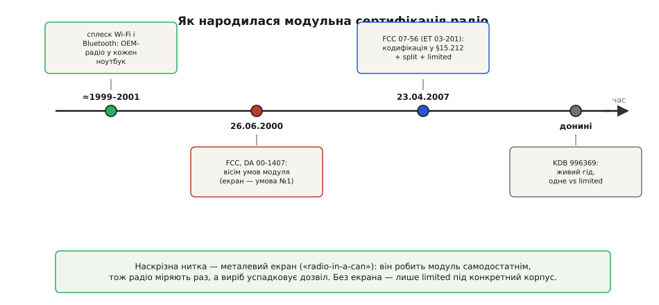

# 📜 Радіо в бляшанці: як народилося право сертифікувати передавач один раз

Уся зручність, з якої ми починали — «постав модуль, і твій виріб успадкує дозвіл» — насправді молодша за багатьох інженерів, що нею користуються. Ще на межі тисячоліть такого права просто не існувало. Кожен, хто вбудовував радіо у власний продукт, мусив сертифікувати цей передавач **наново**, навіть якщо всередині сиділа та сама, вже перевірена мікросхема. Металевий екран над чіпом — той самий «shield can», що ми бачили на розтині модуля — з простого засобу від завад перетворився на **юридичну умову**: рівно він дозволив регулятору сказати «цей радіоблок самодостатній, міряємо його раз». Ця вставка — про те, як і чому це сталося: що бентежило інженерів, хто це розплутував і чому саме бляшанка стала межею між «дешево на ринок» і «сертифікуй усе сам».

## Світ до модульного дозволу: та сама мікросхема — і знову вся процедура

Щоб відчути проблему, треба уявити регуляторну логіку **до** правил про модулі. У США будь-який навмисний випромінювач (intentional radiator) підлягає сертифікації за Частиною 15 правил Федеральної комісії зі зв'язку (Federal Communications Commission, FCC). Історично дозвіл видавали на **конкретний кінцевий пристрій**: ось цей приймач-передавач у цьому корпусі, з цією платою, цим живленням і цією антеною — виміряний і схвалений як єдине ціле.

Проблема тут не в прискіпливості, а в чесній фізиці. Випроби на випромінювання міряють не «чіп у вакуумі», а **всю систему разом**: скільки енергії витікає в ефір поза дозволеною смугою, скільки — кабелями й корпусом. Плата навколо чіпа, метал корпусу, довжина проводів, навіть блок живлення — усе це формує спектр перешкод. Тому з погляду регулятора той самий радіомодуль у **іншому** виробі — це, строго кажучи, **інша** система, яку ніхто не міряв. Звідси й вимога: новий пристрій — нова сертифікація.

Поки радіо було рідкістю — раціями, кількома моделями безпровідних телефонів — це нікого особливо не мучило. Виробників радіотехніки було небагато, кожен робив закінчений апарат і сам проходив випроби. Логіка «сертифікуй систему цілком» була природною, бо систему й справді робили від початку до кінця одні руки.

> 🔧 **Навіщо це.** Саме цей старий порядок пояснює, *чому* готовий модуль такий цінний. Успадкування дозволу — не подарунок і не формальність: це виняток, який довелося окремо винаходити й обґрунтовувати. Розуміючи, від якого тягаря він звільняє, легше збагнути, чому за нього тримаються всі вимоги — і передусім вимога екрана.

## Що зламало стару логіку: коли радіо полізло в кожен пристрій

Тиха рівновага «кожен робить закінчений апарат» протрималася до кінця 1990-х — і завалилася під натиском двох технологій, що раптом захотіли жити **всередині чужих виробів**.

Перша — Wi-Fi. Стандарт **IEEE 802.11b** ухвалили 16 вересня 1999 року (це добре задокументована дата, а не переказ), і того ж 1999-го Apple першою серед масових виробників поставила Wi-Fi у споживчий ноутбук — лінійку iBook, під власною маркою AirPort. За рік, у 2000-му, підтягнулася IBM зі своїми ThinkPad. Друга технологія — Bluetooth: специфікацію ядра версії 1.1 (Bluetooth Core 1.1) Bluetooth SIG опублікувала 22 лютого 2001 року, і саме вона стала першою по-справжньому робочою для масового ринку.

Придивімося, що це означало для сертифікації. Радіо переставало бути **самостійним апаратом** і ставало **компонентом**. Виробник ноутбука не проєктував Wi-Fi-тракт сам — він купував готову радіоплату (у ті часи часто у форматі карти Mini-PCI) в спеціалізованої компанії й **вставляв** її у свій пристрій. Але за старою логікою кожна модель ноутбука з цією картою — окрема система, отже окрема повна сертифікація радіо. Помножте на десятки моделей, на кожну ревізію корпусу, на кожного виробника, який купує ту саму карту — і ви отримаєте гори однакових вимірювань того самого передавача. Абсурд, який гальмував цілу молоду індустрію безпровідного зв'язку.

Тиск ішов з двох боків. Виробники радіоплат хотіли продавати **один** сертифікований компонент багатьом клієнтам, а не проходити випроби заново під кожного. Виробники кінцевих пристроїв хотіли **швидко** ставити чуже радіо, не грузнучи в радіочастотних вимірюваннях, у яких вони й не розумілися. А регулятор бачив потік по суті однакових заявок і мусив на кожну витрачати ресурс. Усім трьом сторонам був потрібен один і той самий вихід — і питання стояло руба: **за яких умов можна виміряти радіоблок раз і дозволити ставити його в різні вироби без повторної сертифікації?**

## Ключова думка: зробити радіо самодостатнім, а мірою самодостатності — екран

Уся суть модульного підходу тримається на одній думці, і варто побачити її народження на власні очі, бо з неї випливе все інше — і вимоги, і роль бляшанки.

Пригадаймо, *чому* той самий чіп в іншому виробі вважали іншою системою: бо плата, корпус і живлення навколо нього **впливали** на випромінювання. А тепер поставимо зустрічне питання: що, як зробити радіоблок таким, щоб оточення на нього майже **не впливало**? Тоді, вимірявши його раз, ми могли б чесно стверджувати, що в будь-якому наступному виробі він поведеться так само — і повторні виміри втратили б сенс.

Ось де метал над чіпом робить стрибок від електротехніки до права. У самій статті ми говорили про екран як засіб електромагнітної сумісності — він тримає високочастотне випромінювання всередині й не пускає чужі завади всередину. Але та сама властивість має друге, юридичне значення: екранований радіоблок **не залежить** від того, чи екранує його зверху корпус кінцевого пристрою. Він приносить свій захист із собою. А отже — він **самодостатній**: його спектр перешкод визначається ним самим, а не примхами чужої плати. Саме тому екран стає природною, фізично обґрунтованою **мірою** тієї самої самодостатності, яку регулятор мусив якось перевірити, перш ніж дозволити «міряти раз».

Друга опора тієї ж думки — незалежність від живлення й від вхідних сигналів. Якщо модуль має **власний стабілізатор живлення**, його поведінка не попливе від того, наскільки брудне живлення в чужому виробі. Якщо його інформаційні входи **буферизовані**, чужий сигнал не зможе «перекрутити» передавач у режим, де той порушить норми. Скласти все докупи — екран, власне живлення, буфери, узгоджену антену — і ми отримаємо радіоблок, який поводиться однаково будь-де. Такий блок і справді можна виміряти раз. Лишалося записати ці умови в правила.

> 🔧 **Навіщо це.** Це і є прихована відповідь на питання «а чому взагалі під екраном іще й стабілізатор, і буфери, а не самий лише чіп?». Кожен із цих елементів — не забаганка розробника модуля, а **умова успадкування дозволу**: рівно вони роблять радіоблок незалежним від твого виробу, тож дозвіл, виданий модулю, законно переходить на твій продукт.

## 26 червня 2000: вісім умов, і екран — перший у списку

Оформлення цієї думки в правило має точну дату. 26 червня 2000 року FCC випустила публічне повідомлення **DA 00-1407** — «Public Notice» Бюро технологій зв'язку, — яке вперше виклало умови й політику авторизації малопотужних «модулів-передавачів» за Частиною 15 (це первинний документ FCC, а не переказ третіх рук). Формулювання мети в ньому напрочуд відверте: правило мало **звільнити виробників від тягаря** отримувати нову авторизацію на той самий передавач щоразу, коли його ставлять у новий пристрій. Тобто регулятор прямо назвав ту саму проблему, яку ми щойно розібрали, — і запропонував із неї вихід.

Виходом стали **вісім умов**. Щоб FCC схвалила передавач Частини 15 саме як модуль, він мусив:

```
1. мати власне радіочастотне екранування (RF shielding) — щоб модуль
   НЕ покладався на екран того пристрою, у який його вставлять;
2. мати буферизовані входи модуляції/даних — щоб дотримати норм Частини 15
   за будь-якого типу вхідного сигналу;
3. мати власну стабілізацію живлення — щоб норми трималися незалежно
   від живлення у виробі-господарі;
4. відповідати вимогам до антени (постійно приєднана або через
   унікальний роз'єм-з'єднувач);
5. проходити випроби в самостійній (stand-alone) конфігурації,
   а не всередині іншого пристрою;
6. мати власне маркування FCC ID (а на корпусі виробу — напис,
   якщо ідентифікатор модуля ззовні не видно);
7. супроводжуватися інструкціями про застосовні вимоги правил;
8. відповідати вимогам щодо впливу радіочастот на людину (RF exposure).
```

Придивімося до порядку. Екран стоїть **першим** — і це не випадковість верстки. У поясненні до першої умови FCC прямо каже, навіщо він: щоб модуль **не мусив покладатися на екранування, яке дає пристрій**, у котрий його встановлять. Це слово в слово та думка про самодостатність, до якої ми дійшли міркуванням: бляшанка робить радіоблок незалежним від чужого корпусу — і тому дозволяє міряти його окремо. Умови 2 і 3 (буфери й власне живлення) — це та сама незалежність, тільки від сигналів і від живлення. Умови 4–8 замикають систему: своя антена, чесні окремі виміри, своє маркування, свої інструкції, безпека для людини.

Варто підкреслити доказовий статус: вісім умов — це **точний зміст первинного документа DA 00-1407**, а не пізніший переказ. Формат «публічного повідомлення», а не повноцінного правила, теж показовий — на той момент FCC радше **оголосила політику**, за якою розглядатиме заявки, ніж вписала норму в кодекс. Повне впорядкування в самі правила прийде пізніше.


*Коротка історія модульної сертифікації радіо. Наскрізна нитка — металевий екран: він робить радіоблок самодостатнім, тож його міряють раз, а виріб успадковує дозвіл; без екрана лишається тільки обмежене (limited) схвалення під конкретний корпус.*

## 2007: правило в кодексі, і поява «розділеного» та «обмеженого» модуля

Політику, оголошену 2000 року, треба було закріпити в самому кодексі — і зробити гнучкішою, бо життя підкинуло випадки, що не вміщалися у вісім жорстких умов. Це сталося в межах регуляторної справи **ET Docket No. 03-201**: другий підсумковий припис (Second Report and Order) **FCC 07-56** було випущено 23 квітня 2007 року (дати й номери звірені за первинними документами FCC). Саме він **кодифікував** вимоги DA 00-1407 — з певними змінами — у статтю **47 CFR §15.212** «Modular transmitters», тобто переніс їх із «оголошеної політики» у власне текст правил.

Найцікавіше — дві нові категорії, що народилися тоді ж, бо суцільний екран підходив не всім.

**Розділений модуль (split modular transmitter).** Інженери вказали на реальний випадок: буває, що радіоблок фізично поділений на дві частини — власне **радіочастотний передній край** (radio front end) з антеною і окремий **керівний вузол**, у якому живе програмна логіка роботи радіо. Вимагати суцільного екрана на все безглуздо — випромінює лише передній край. Тому для розділеного модуля правило зм'якшили: екрановано має бути **лише радіочастотний передній край**, а стик між частинами мусить бути **цифровим** із мінімальною амплітудою сигналу **150 мВ від піка до піка** (щоб цим стиком не пролазила аналогова «зараза», здатна змінити випромінювання). Дозвіл при цьому дійсний лише для тих частин, що схвалені **однією** заявкою разом.

**Обмежений модульний дозвіл (limited modular approval).** А що робити з радіоблоком, який із поважних причин **не виконує** якоїсь із восьми умов — наприклад, узагалі не має власного екрана? Викидати його з модульного режиму цілком було б надто грубо. Тому ввели проміжний, обережніший дозвіл. Формулювання §15.212 тут варте близького погляду: обмежений дозвіл «може бути наданий для одиночних або розділених модулів, що **не** відповідають усім наведеним вимогам, як-от екранування, мінімальна амплітуда сигналу, буферизовані входи модуляції/даних чи стабілізація живлення» — **за умови**, що виробник **іншими засобами** доведе: у тих умовах, за яких модуль реально працюватиме, він таки дотримується всіх застосовних вимог Частини 15.

Ось де проступає точний сенс екрана як межі. **Повний** (одиночний) модульний дозвіл, який дає найбільшу свободу — став свій радіоблок майже в будь-який виріб, — вимагає, щоб радіоблок був самодостатнім, а мірою тієї самодостатності є, серед іншого, **власний екран**. Радіоблок **без** екрана самодостатнім не вважається, бо його випромінювання залежить від чужого корпусу — тож найбільше, на що він може претендувати, це **обмежений** дозвіл, прив'язаний до конкретних умов застосування, які довели окремо. Бляшанка — це буквально різниця між «став куди завгодно» і «став лише туди, де ми окремо переконалися, що норми тримаються».

> 🔧 **Навіщо це.** Коли на модулі ESP32-класу написано, що він має **повне** модульне схвалення, за цим стоїть саме вибір на користь суцільного екрана: виробник свідомо накрив радіо бляшанкою, щоб ти міг ставити модуль у свої вироби **без** повторних доказів під кожен корпус. Дешевший радіоблок «без бляшанки» теоретично існує — але успадкувати його дозвіл так само вільно ти вже не зможеш.

## Жива практика: KDB 996369 і чому «одиночний» коштує дорожче за «обмежений»

Правило в кодексі — ще не вся історія: його треба **однаково тлумачити** на практиці, інакше кожна випробувальна лабораторія розумітиме умови по-своєму. Для цього FCC веде базу знань (Knowledge Database, KDB), а конкретно для модулів — публікацію **KDB 996369**. Це не разовий документ, а **живий гід**, який FCC періодично оновлює; він пояснює, як подавати заявки за §15.212, і саме на нього спираються акредитовані органи сертифікації (TCB) й лабораторії.

Практична межа, яку KDB 996369 підкреслює, — та сама, тільки в грошах і термінах. **Одиночне (повне) схвалення** дає найбільшу гнучкість: модуль можна вбудовувати в безліч різних виробів-господарів, і його дозвіл переходить на них. **Обмежене схвалення** означає, що модуль **не задовольняє** щонайменше однієї з восьми умов §15.212 — і тягне за собою додаткову тяганину: гід прямо роз'яснює, що модулі **без екрана** потребують окремих заявок на дозвільну зміну (класу II permissive change) під кожного **нового** господаря. Тобто економія на бляшанці обертається повторними подачами на кожен новий виріб — рівно тим тягарем, від якого модульний режим і мав звільнити. Гід уточнює й інші тонкощі — наприклад, що застереження про «професійний монтаж» (professional installation) не стосується звичайних модулів, зате може застосовуватися саме до обмежених схвалень.

Ідея виявилася настільки вдалою, що вийшла за межі США. Канадський регулятор ISED тримає **дзеркальний** механізм у своїх правилах — загальних вимогах RSS-Gen і процедурі RSP-100: там теж є повний і обмежений модульний дозвіл із дуже близькою логікою, а заявники нерідко покликаються одночасно і на канадські документи, і на §15.212. Це, до речі, причина, чому на модулях ESP32-класу поряд стоять і **FCC ID**, і канадський **IC**: два регулятори, той самий принцип «виміряй радіо раз».

## Що з усього цього лишилося в бляшанці над твоїм чіпом

Замкнімо нитку там, де почали — біля металевого квадратика на модулі. Тепер видно, що в ньому сходяться три ролі, і жодна не випадкова.

**Роль перша, електротехнічна:** екран тримає високочастотне випромінювання всередині й не пускає чужі завади всередину — те, з чого ми починали розмову про EMC. **Роль друга, історична:** саме цю властивість регулятор обрав **мірою самодостатності** радіоблока — бо екранований модуль не залежить від чужого корпусу, його й можна виміряти окремо. **Роль третя, юридична:** через це власний екран став **умовою повного модульного дозволу** — тією межею, за якою радіо міряють раз, а виріб успадковує дозвіл; без екрана лишається тільки обмежений режим із повторними подачами.

Тому коли ми в самій статті радимо «постав модуль і успадкуй сертифікацію», за цією порадою стоїть чверть століття регуляторної роботи: від абсурду «сертифікуй той самий чіп у кожному виробі заново», через сплеск Wi-Fi і Bluetooth, що зробив цей абсурд нестерпним, через відверте зізнання FCC у DA 00-1407, що виробників треба звільнити від цього тягаря, до точного правила §15.212, де бляшанка з простого шматка жерсті перетворилася на юридичну умову. Метал над чіпом — це матеріальний слід усієї цієї історії. Поважати зону відступу під антеною й не псувати те, що модуль зробив за тебе, — означає, серед іншого, поважати цей слід: адже дозвіл, який ти успадковуєш, тримається рівно на тому, що радіоблок і справді лишився самодостатнім.
