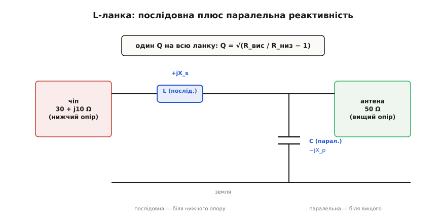
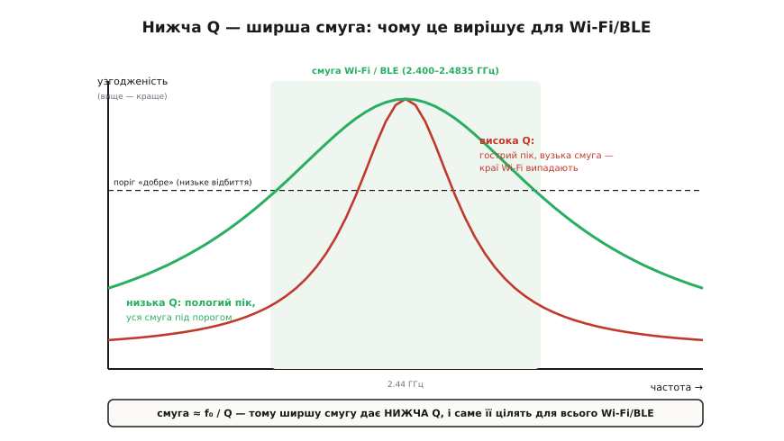
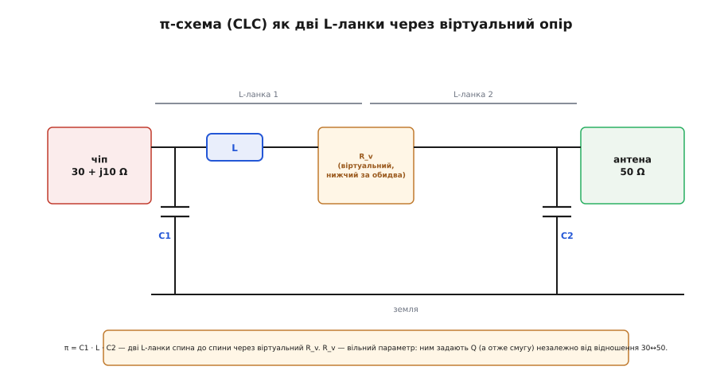

# 🧮 Звідки беруться номінали узгоджувача: виводимо CLC на пальцях

У самій темі ми прийняли на віру одне речення: між чіпом і антеною стоїть π-подібна схема з трьох деталей — конденсатор, котушка, конденсатор, — і вона трансформує (30 + j10) Ω виходу радіо в чисті 50 Ω. Прийняли, бо там ішлося про *чому* модуль ховає це під екран. Тепер настав час зазирнути всередину й **порахувати самі номінали**: скільки саме пікофарад і наногенрі, і головне — звідки ці числа беруться, крок за кроком, без жодної магії.

Мета вставки — не завчити три формули, а **побачити механізм**. Наприкінці ти зможеш узяти будь-який комплексний опір чіпа, будь-яку антену на 50 Ω і на папері за десять хвилин сказати: ось стільки-то пікофарад сюди, стільки-то наногенрі туди. А заразом зрозумієш дві речі, які майже завжди подають як аксіому: чому «нижча добротність — ширша смуга» і чому інженери ставлять саме π з трьох деталей, а не найпростішу L-ланку з двох.

> 🔧 **Навіщо це.** Модуль уже несе цю схему налаштованою — але щойно ти виносиш антену на роз'єм, кладеш чіп ESP32 голим на свою плату чи бачиш у чужій схемі «незрозумілі» 1 нГн і кілька пФ біля радіо, ці числа перестають бути шумом. Ти читаєш їх як речення: «тут трансформують такий-то опір у 50 Ω з такою-то смугою». Це різниця між «скопіював реферанс і молюся» та «розумію, що кожна деталь робить, і можу полагодити, коли поплило».

## Що взагалі означає «узгодити»: максимум потужності в антену

Почнімо з самої суті, бо на ній усе тримається. Ми вже спиралися на відбиття хвилі: якщо опір навантаження не дорівнює хвильовому опору лінії, частина потужності повертається назад і марно гріє каскад, а частку відбитої амплітуди задає коефіцієнт відбиття Γ = (Z_L − Z₀)/(Z_L + Z₀) — він нуль лише при точному збігу опорів. Це докладніше розібрано у [відбитті й КСХ](book:communications/vswr): чому неузгодження породжує стоячу хвилю, як міряють її коефіцієнт стоячої хвилі й скільки саме потужності втрачається. Це погляд з боку лінії передачі. Є другий, еквівалентний погляд — з боку джерела, — і він прямо веде до формул.

Уяви вихід радіо як джерело змінної напруги з власним внутрішнім опором. Питання: за якого опору навантаження джерело віддасть у нього **найбільше потужності**? Відповідь — класична теорема про узгодження навантаження: коли опір навантаження дорівнює внутрішньому опору джерела. Якщо навантаження замале — струм великий, але майже вся напруга падає всередині джерела; якщо завелике — напруга на навантаженні майже повна, але струм крихітний. Максимум добутку — рівно посередині, коли опори збігаються.

Але наш опір **комплексний**. Вихід чіпа — це 30 Ω активного опору плюс невелика індуктивність, яка на 2.4 ГГц дає реактивний опір близько +j10 Ω. Реактивність (від латинського *re-agere*, «діяти у відповідь») — це опір, який не гріється, а лише зсуває фазу між напругою й струмом: котушка й конденсатор запасають енергію й повертають її назад, а не перетворюють на тепло. Для комплексного джерела умова максимуму потужності трохи хитріша: навантаження має бути **комплексно спряженим** до джерела — та сама активна частина, але **протилежна за знаком реактивність**. Джерело каже +j10 (індуктивність) — навантаження мусить показати −j10 (ємність), щоб ці дві реактивності скомпенсувалися й лишилася чиста передача потужності.

Тобто узгоджувач має зробити дві речі водночас:

```
1) підняти активний опір з 30 Ω до 50 Ω        (трансформація R)
2) додати реактивність, що прибирає +j10 Ω чіпа  (компенсація X)
```

Обидві — самими лише котушками й конденсаторами, бо тільки вони на цих частотах не гріються. Резистор тут заборонений: він з'їв би ту саму потужність, яку ми намагаємося дотягти до антени. Ось чому узгоджувач — це виключно **реактивні** деталі, і ось чому їх треба принаймні дві: одна крутить опір, друга гасить реактивність. Звідси й народжується L-ланка.

## L-ланка: дві реактивності, і чому саме так

Найпростіший трансформатор опору з реактивностей — це **L-ланка** (названа так, бо на схемі два елементи стоять кутом, як літера «Г», у англійській традиції — «L»): одна реактивність **послідовно** з сигналом, друга **паралельно** на землю. Дві деталі, дві ролі. Розберімо, чому саме така пара перетворює один активний опір на інший, — це серце всієї математики.

Ключова ідея — **паралельна реактивність міняє видимий активний опір**. Ось чому. Візьми резистор R і почепи паралельно до нього конденсатор. З боку затискачів це вже не чистий R: тече і струм крізь резистор (у фазі з напругою), і струм крізь конденсатор (зсунутий на 90°). Сумарний струм більший і зсунутий за фазою. Якщо тепер перерахувати цю паралельну пару в **еквівалентну послідовну** (той самий опір на затискачах, але подати його як R_посл послідовно з реактивністю), активна частина R_посл вийде **меншою** за початкове R. Паралельна реактивність ніби «притискає» видимий активний опір униз. І навпаки: послідовна реактивність із наступним паралельним перерахунком піднімає видимий опір угору.

На цьому все й побудовано. Щоб підняти 30 Ω до 50 Ω, ми:

```
крок 1 — послідовна реактивність біля чіпа (нижчий опір);
крок 2 — паралельна реактивність біля антени (вищий опір).
```

Паралельний елемент на боці 50 Ω, якщо дивитися на нього «зсередини», притискає видимий опір донизу — і в парі з послідовним елементом рівняння сходяться рівно тоді, коли на затискачах чіпа бачиться потрібна активна частина. Напрямок жорсткий і його варто закарбувати: **послідовний елемент — завжди з боку меншого опору, паралельний — з боку більшого**. Переплутаєш боки — ланка крутитиме опір не туди.


*Два елементи, дві ролі. Послідовна реактивність (тут котушка, +jX_s) стоїть біля чіпа з нижчим опором; паралельна (тут конденсатор, −jX_p) — біля антени з вищим. Пара жорстко зв'язана: щойно задано відношення опорів 50↔30, добротність Q ланки визначена однозначно, вільних параметрів не лишається.*

Тепер випишемо самі значення. Домовмося поки що дивитися лише на активні опори — 30 Ω і 50 Ω, — а реактивність чіпа +j10 приберемо трохи згодом, вона тут ні на що принципове не впливає. Позначимо менший опір R_низ = 30 Ω, більший R_вис = 50 Ω. Уся арифметика тримається на одній безрозмірній величині — **добротності ланки Q**.

## Добротність Q: одна величина керує всім

Добротність (англ. quality factor, звідси й позначення Q) — поняття старше за будь-який Wi-Fi. Символ Q увів близько 1920 року інженер Кеннет Джонсон (K. S. Johnson) із інженерного відділу Western Electric, оцінюючи якість котушок індуктивності; що цікаво, він вибрав літеру Q не як скорочення від *quality*, а просто тому, що на той час усі зручніші літери вже були зайняті, — сам термін «quality factor» його колега В. Легг (V. E. Legg) прив'язав до цього Q лише згодом, і закріпився він десь після 1925 року. *(Статус: усталено за історією Bell/Western Electric.)* Суть Q проста: це відношення реактивного опору до активного — скільки енергії система ганяє туди-сюди без користі на кожну одиницю, яку вона реально віддає.

Для нашої L-ланки Q виражається через саме́ відношення опорів, і це головна формула всієї вставки:

```
Q = √(R_вис / R_низ − 1)
```

Звідки цей корінь — не з повітря, і варто побачити його народження, бо тоді формула перестане бути замовлянням. Візьмімо паралельну пару на боці вищого опору: резистор R_вис і паралельна реактивність з опором X_p. Перерахунок «паралельне → послідовне» для такої пари дає добре відоме співвідношення: видима послідовна активна частина R_посл пов'язана з R_вис через величину Q = R_вис / X_p так, що

```
R_посл = R_вис / (1 + Q²)
```

Ми хочемо, щоб ця видима активна частина дорівнювала якраз меншому опору, R_низ (тоді послідовний елемент лишиться тільки скомпенсувати реактивність, а активні частини вже зійдуться). Підставмо R_посл = R_низ і розв'яжімо відносно Q:

```
R_низ = R_вис / (1 + Q²)
1 + Q² = R_вис / R_низ
Q² = R_вис / R_низ − 1
Q = √(R_вис / R_низ − 1)
```

Ось і корінь. Він не вигаданий — він **випадає** з умови «видимий опір паралельної пари має дорівнювати меншому опору». Формула каже дуже конкретну річ: **для L-ланки добротність не вибирають — її диктує відношення опорів**. Хочеш підняти 30 до 50 — отримуєш рівно одне Q, і крапка. Двох деталей вистачає, щоб задати дві умови (активний опір і реактивність), але вільного вибору не лишається зовсім. Запам'ятаймо це — за хвилину саме звідси виросте потреба в третій деталі.

Порахуймо наше Q.

**Добротність L-ланки для (30 → 50) Ω.**

```
Q = √(R_вис / R_низ − 1)
  = √(50 / 30 − 1)
  = √(1.667 − 1)
  = √0.667
  ≈ 0.816
```

Зверни увагу на число: Q ≈ 0.82, **менше за одиницю**. Це дуже низька добротність, і причина — м'яке відношення опорів: 50/30 — це лише 1.67 раза, зовсім не круто. Ми ще повернемося до того, чому це число таке важливе; поки що просто тримай його в пальцях.

Маючи Q, обидві реактивності виходять миттєво. Послідовний елемент біля чіпа мусить мати реактивний опір

```
X_посл = Q · R_низ = 0.816 · 30 ≈ 24.5 Ω
```

а паралельний біля антени —

```
X_парал = R_вис / Q = 50 / 0.816 ≈ 61.2 Ω
```

Тепер треба вирішити, **яка деталь дає який знак реактивності**. Послідовний елемент ми зробимо котушкою (індуктивність дає +jX, і, до речі, вона заодно поглине +j10 самого чіпа — про це нижче), паралельний — конденсатором (ємність дає −jX на землю). Це і є класична L-ланка «послідовна котушка + паралельний конденсатор», яка водночас працює як фільтр нижніх частот. Переведімо опори в номінали на робочій частоті. Візьмімо центр смуги, f = 2.44 ГГц, тоді кутова частота ω = 2πf ≈ 1.533·10¹⁰ рад/с.

**Послідовна котушка (з реактивного опору в наногенрі).**

Для котушки X_L = ωL, звідси L = X_L / ω:

```
L = X_посл / ω = 24.5 / (1.533·10¹⁰)
  ≈ 1.60·10⁻⁹ Гн
  = 1.60 нГн
```

**Паралельний конденсатор (з реактивного опору в пікофаради).**

Для конденсатора X_C = 1/(ωC), звідси C = 1/(ω·X_C):

```
C = 1 / (ω · X_парал) = 1 / (1.533·10¹⁰ · 61.2)
  ≈ 1.07·10⁻¹² Ф
  = 1.07 пФ
```

Ось перші реальні числа: **котушка ~1.6 нГн і конденсатор ~1.1 пФ** перетворюють 30 Ω на 50 Ω на 2.44 ГГц. Це вже майже те, що стоїть у модулі, — лишилося врахувати реактивність чіпа й розкласти одну L-ланку на дві заради π. Але спершу — обіцяний зв'язок Q зі смугою, бо саме він пояснить, навіщо взагалі щось ускладнювати.

## Компенсація +j10 чіпа: безкоштовний бонус послідовної котушки

Перш ніж іти далі, закриймо борг — реактивність чіпа. Ми весь час рахували, ніби чіп це чистий резистор 30 Ω, а насправді він 30 + j10: усередині сидить +j10 Ω індуктивності. Це виявляється навіть зручним.

Наша послідовна котушка й так стоїть у розрив сигналу — з боку чіпа, послідовно з ним. А послідовні реактивності просто **додаються**. Тобто чіп уже дає +j10, і нам потрібно, щоб *сумарна* послідовна реактивність дорівнювала розрахованим +j24.5. Отже, зовнішня котушка мусить додати не всі 24.5, а лише різницю:

```
X_котушки(зовн.) = X_посл − X_чіпа = 24.5 − 10 = 14.5 Ω
L_зовн = 14.5 / (1.533·10¹⁰) ≈ 0.95 нГн
```

Реактивність чіпа не завада — вона **частина котушки, яку не треба паяти**. Замість 1.60 нГн ставимо ~0.95 нГн, а решту індуктивності безкоштовно дає сам кристал. Ось перша, дрібна, але показова причина, чому реальні номінали біля радіо такі крихітні: частину роботи вже виконують паразитні реактивності самого чіпа. Тримай цю думку — за мить вона розростеться до головного аргументу на користь π.

## Q і смуга: чому широка смуга любить низьку добротність

Тепер найважливіша ідея вставки, заради якої все й затівалося. Узгоджувач із котушки й конденсатора — це **резонансний контур**. Він налаштований віддавати максимум потужності на одній частоті; що далі від неї, то гірше узгодження й більше відбиття. Питання: **наскільки широко** навколо центру він тримає добре узгодження? Відповідь ховається в тому самому Q.

Інтуїція така. Q — це відношення запасеної реактивної енергії до розсіюваної активної за цикл. Високе Q означає, що контур накопичив багато реактивної енергії й віддає активну потроху: він «гострий», різко реагує на частоту, як важкий маятник із малим тертям — гойдається довго, але тільки на своїй частоті, збий її трохи — і резонанс пропав. Низьке Q — контур «в'ялий», багато тертя: гострого резонансу нема, зате він однаково нехотя працює в широкій смузі частот. Гострота піка й ширина смуги — це дві сторони одного числа.

Кількісно зв'язок гранично простий:

```
смуга ≈ f₀ / Q
```

де f₀ — центральна частота. Розшифруймо: **що менше Q, то ширша смуга**. Формула прямо каже, що смуга й добротність — обернені. Це не збіг і не інженерне правило-приблизно — це математичне тіло резонансу: гострота піка (Q) і його ширина (смуга) — одна величина, подана з двох боків.


*Узгодженість проти частоти для двох добротностей. Гострий червоний пік — висока Q: узгодження чудове точно в центрі, але краї смуги Wi-Fi/BLE вже випадають з-під порога. Пологий зелений — низька Q: пік нижчий, зате вся смуга 2.400–2.4835 ГГц лишається над порогом доброго узгодження. Ось чому для суцільної смуги цілять НИЖЧУ добротність.*

Прикладімо це до нашої задачі. Wi-Fi і BLE у діапазоні 2.4 ГГц займають смугу від 2.400 до 2.4835 ГГц — це 83.5 МГц навколо центру ~2.44 ГГц. *(Статус: усталено, план каналів ISM 2.4 ГГц.)* Яку добротність можна собі дозволити, щоб уся ця смуга лишилася добре узгодженою?

**Гранична добротність для смуги Wi-Fi/BLE.**

```
смуга потрібна = 83.5 МГц
f₀ ≈ 2441 МГц
Q_гранична ≈ f₀ / смуга = 2441 / 83.5 ≈ 29
```

Число дуже промовисте. Щоб покрити всю смугу Wi-Fi/BLE, добротність узгоджувача має бути десь **до ~30** — це стеля, вище якої пік стає надто гострим і краї смуги провисають. Тепер згадай наше Q для простої L-ланки: **0.82**. Воно в тридцять з гаком разів менше за граничне. Тобто одна L-ланка на перехід 30→50 має **колосальний запас смуги** — вона перекрила б не те що Wi-Fi, а діапазон у сотні разів ширший.

І тут мусимо бути чесними, бо це місце, де поверхові пояснення брешуть. Часто кажуть: «π ставлять, бо L-ланка не тягне всю смугу Wi-Fi». Для переходу 30→50 це **неправда** — L-ланка тут така широкосмугова, що смуга взагалі не проблема. М'яке відношення опорів (лише 1.67 раза) дало настільки низьке Q, що смуги вистачає з тисячократним запасом. Отже, справжня причина π — **інша**, і зв'язок Q↔смуга нам потрібен не щоб виправдати π, а щоб зрозуміти третю деталь із протилежного боку: π дає нам **право вибирати Q**, і ми скористаємося цим правом не заради ширшої смуги (її й так вдосталь), а заради зовсім інших вигід. Розберімо, чому одну L-ланку все-таки замінюють на π з трьох деталей.

## Від L до π: третя деталь купує свободу вибору Q

Пригадаймо тісний кут, у який нас загнала L-ланка: **Q жорстко заданий відношенням опорів**, вільного параметра нема. Для 30→50 це дало Q ≈ 0.82 — і ми були зобов'язані отримати саме таку смугу й саме такі номінали, без варіантів. А що, якби відношення опорів було не м'яке, а круте — скажімо, 5 Ω у 50 Ω? Тоді Q = √(50/5 − 1) = 3, і смуга звузилася б; при 2 Ω у 50 Ω вийшло б Q = √24 ≈ 4.9 — ще вужче. **Крутіший перепад опорів = вища добротність = вужча смуга.** Для L-ланки ти заручник цього зв'язку.

Ідея π — розірвати цей зашморг, увівши **проміжний віртуальний опір**. Замість того щоб одним стрибком іти 30 → 50, зробімо два кроки через якийсь проміжний опір R_v: спершу 30 → R_v, тоді R_v → 50. Кожен крок — своя маленька L-ланка. А тепер найтонше: R_v ми обираємо **самі**, і від нього залежить добротність усієї конструкції. Це той вільний параметр, якого так бракувало.

Куди ставити R_v — угору чи вниз? Якщо взяти R_v **нижчим за обидва кінці** (наприклад, 5 Ω, коли краї 30 і 50), обидві L-ланки виявляться однакового «напрямку»: у кожної паралельний конденсатор дивиться в бік вищого опору, і на схемі вони опиняються — один біля чіпа, другий біля антени, а котушки обох ланок зливаються в одну послідовну посередині. Малюнок «конденсатор — котушка — конденсатор» — це і є **π-схема** (названа за грецькою літерою π: дві вертикальні ніжки-конденсатори і поперечка-котушка згори нагадують її обрис). Тобто CLC — це буквально **дві L-ланки спина до спини через спільний віртуальний опір**.


*CLC розкладена на дві L-ланки. Перша веде від чіпа (30 + j10) до проміжного R_v, друга — від R_v до антени 50 Ω; котушки обох ланок зливаються в одну посередині, а два конденсатори C1 і C2 сідають на краях. Оскільки R_v можна обрати будь-яким (нижчим за обидва опори), з'являється вільний параметр — ним задають добротність, а отже смугу, незалежно від відношення 30↔50.*

Тепер добротність задає **найкрутіший з двох переходів** — від найвищого краю до віртуального опору:

```
Q_π ≈ √(R_макс / R_v − 1),   де R_макс = max(30, 50) = 50
```

Ключова відмінність від L-ланки: **R_v у нас під контролем**, тож і Q під контролем. Хочеш вужчу смугу й гострішу фільтрацію — бери R_v меншим (Q росте). Хочеш ширшу — бери R_v ближче до 50 (Q падає). Ланка з двох деталей такого важеля не мала: там Q був рабом відношення 50/30. Порахуймо конкретний приклад — візьмімо, скажімо, помірне Q_π = 3, типове для реальних 2.4-ГГц узгоджувачів.

**Віртуальний опір для заданої добротності π.**

```
Q_π = 3  (обрали самі)
R_макс = 50 Ω
Q_π² = R_макс / R_v − 1
R_v = R_макс / (Q_π² + 1) = 50 / (9 + 1) = 5.0 Ω
```

Отже, щоб отримати Q = 3, віртуальний опір усередині π має бути 5 Ω — справді нижчий за обидва кінці, як і задумано. Тепер рахуємо кожну L-ланку окремо, точно за тим самим рецептом, що вже освоїли.

**Ліва ланка (чіп 30 Ω ↔ R_v 5 Ω).** Тут вищий опір — 30 (чіп), нижчий — 5 (віртуальний):

```
Q1 = √(30 / 5 − 1) = √5 ≈ 2.236
конденсатор C1 біля чіпа:  X_C1 = R_чіп / Q1 = 30 / 2.236 ≈ 13.4 Ω
котушкова частина зліва:   X_L1 = Q1 · R_v = 2.236 · 5 ≈ 11.2 Ω
```

**Права ланка (R_v 5 Ω ↔ антена 50 Ω).** Тут вищий опір — 50 (антена), нижчий — 5:

```
Q2 = √(50 / 5 − 1) = √9 = 3.0
конденсатор C2 біля антени: X_C2 = R_ант / Q2 = 50 / 3 ≈ 16.7 Ω
котушкова частина справа:   X_L2 = Q2 · R_v = 3 · 5 = 15.0 Ω
```

Обидві котушкові частини стоять послідовно посередині й **додаються** в одну котушку:

```
X_L(усього) = X_L1 + X_L2 = 11.2 + 15.0 = 26.2 Ω
```

Лишилося перевести три реактивні опори в номінали на ω ≈ 1.533·10¹⁰ рад/с.

**Конденсатор біля чіпа C1.**

```
C1 = 1 / (ω · X_C1) = 1 / (1.533·10¹⁰ · 13.4)
   ≈ 4.86·10⁻¹² Ф ≈ 4.9 пФ
```

**Конденсатор біля антени C2.**

```
C2 = 1 / (ω · X_C2) = 1 / (1.533·10¹⁰ · 16.7)
   ≈ 3.91·10⁻¹² Ф ≈ 3.9 пФ
```

**Котушка L посередині.**

```
L = X_L(усього) / ω = 26.2 / (1.533·10¹⁰)
  ≈ 1.71·10⁻⁹ Гн ≈ 1.7 нГн
```

І, як завжди, віднімемо +j10 самого чіпа з послідовної котушки (вона в лінії з чіпом):

```
L_зовн = (26.2 − 10) / (1.533·10¹⁰) ≈ 1.06 нГн
```

Маємо повний набір для π з добротністю 3: **C1 ≈ 4.9 пФ · L ≈ 1.1 нГн · C2 ≈ 3.9 пФ**. Це вже цілком реалістичні номінали 0201-компонентів, які й побачиш у реферансі. А тепер — розплата за розуміння: навіщо це все, якщо L-ланка з двох деталей і так покривала смугу?

## Чому таки π: три справжні причини

Ми чесно показали, що заради *смуги* π на переході 30→50 не потрібен — L-ланки вистачало з тисячократним запасом. То навіщо індустрія (і сам Espressif у своїх рекомендаціях) наполягає на CLC з трьох деталей? Причин три, і жодна з них — не «ширша смуга».

**Перша: π вбирає паразитні ємності, а не воює з ними.** На 2.4 ГГц кожен вивід чіпа має власну паразитну ємність на землю (ємність корпусу QFN), і контактна площадка антени теж має свою. Ці паразити нікуди не подіти — вони фізично там є. У π два конденсатори C1 і C2 сидять якраз на землю з обох боків — рівно там, де живуть паразити. Тож паразитну ємність корпусу можна просто **зарахувати як частину C1**, а паразит площадки — як частину C2: ставиш трохи менший номінал, і сума дає потрібне значення. L-ланка має лише **один** паралельний конденсатор — тобто лише один бік, куди можна сховати паразит; другий паразит їй доводиться терпіти як похибку. Це та сама логіка, що з котушкою й +j10 чіпа, але доведена до системи: **π перетворює неминучі паразити зі шкідників на робочі частини схеми**. *(Статус: усталено, стандартний аргумент нотаток із застосування виробників радіо.)*

**Друга: π краще душить гармоніки передавача.** Вихід радіо — не чистий синус на 2.44 ГГц; у ньому є гармоніки на 4.88 ГГц (друга) і 7.32 ГГц (третя), які треба прибрати, інакше не пройдеш сертифікацію на випромінювання. CLC — це фільтр нижніх частот **третього** порядку (три реактивні елементи), і він давить гармоніки помітно крутіше, ніж L-ланка з її двома елементами (фільтр другого порядку). Мало того, кожен конденсатор має власний паразитний послідовний резонанс, і його можна навмисне підігнати так, щоб він давав додаткову яму загасання якраз на частоті гармоніки. Тобто той самий π, що узгоджує опір, **безкоштовно працює фільтром чистоти спектра** — дві функції в трьох деталях. *(Статус: усталено, стандартна практика 2.4-ГГц узгоджувачів.)*

**Третя: π дає свободу підігнати схему стандартними номіналами й компенсувати розкид плати.** Ланка з двох деталей жорстко прибиває Q до відношення опорів — а отже й самі номінали виходять «які вийшли», часто незручні (пригадай 1.07 пФ — такий точний номінал ще пошукати). π з вільним параметром R_v дозволяє **зсунути** розрахунок так, щоб він ліг на наявні значення ряду стандартних 0201-конденсаторів, і заразом лишає люфт, щоб компенсувати розкид самої плати — товщину діелектрика, довжину доріжок, ту саму паразитну ємність, що гуляє від партії до партії. Саме тому Espressif у рекомендаціях з проєктування прямо пише, що номінали CLC «залежать від конкретної антени й розведення плати» й підбираються на приладі: π — це не одна намертво задана трійка, а **сімейство рішень з важелем**, яким виробник ловить точні 50 Ω під свою фізичну реалізацію. *(Статус: усталено за офіційними рекомендаціями Espressif із апаратного проєктування — CLC-структура, номінали під конкретну антену/плату.)*

> 🔧 **Навіщо це.** Оце і є повна відповідь на питання з теми — «чому три деталі, а не дві». Не заради смуги (її й L-ланка мала вдосталь), а заради **керованості**: два конденсатори проковтують неминучі паразити з обох боків, третій порядок фільтра чистить спектр під сертифікацію, а вільний R_v дає підігнати все під реальну плату стандартними номіналами. Модуль зробив цей підбір на векторному аналізаторі раз і накрив екраном — щоб ти отримав уже зловлені 50 Ω. Розуміючи механізм, ти не зіпсуєш його ззовні й прочитаєш будь-яку чужу схему узгодження як відкриту книгу.

## Складімо все докупи

Пройдений шлях був неочевидний, тож звемо нитку в одне. Узгодження — це доставити в антену максимум потужності, а для комплексного джерела це означає дві дії: підняти активний опір 30 → 50 і скомпенсувати реактивність +j10. Обидві — тільки котушками й конденсаторами, бо резистор з'їв би потужність. Дві реактивності дають L-ланку; її добротність не вибирають — її диктує відношення опорів за формулою Q = √(R_вис/R_низ − 1), і для м'якого переходу 30→50 виходить крихітне Q ≈ 0.82, тобто величезна смуга. Зв'язок смуга ≈ f₀/Q показує: низька добротність — широка смуга, і навпаки. Але саме тому смуга для нас не проблема — проблема в тому, що L-ланка жорстка й має лише один паралельний елемент. Третя деталь перетворює L на π через віртуальний опір R_v, який ми обираємо самі: він повертає нам право задавати Q, а два його конденсатори вбирають паразити з обох боків, чистять гармоніки й дають підігнати схему під реальну плату. Числа для помірного Q = 3 виходять цілком «реферансні»: C1 ≈ 4.9 пФ, L ≈ 1.1 нГн, C2 ≈ 3.9 пФ.

І тепер, коли в наступній схемі побачиш біля виводу радіо ESP32 три невеликі деталі — конденсатор, котушку, конденсатор із номіналами в одиниці пікофарад і наногенрі, — ти прочитаєш їх не як загадку, а як речення, яке щойно вивів сам: «тут трансформують 30 + j10 у 50 Ω, з такою-то добротністю, вбираючи паразити й фільтруючи гармоніки». Це та сама π-схема, що ховається під екраном модуля, — лише тепер ти знаєш, звідки взявся кожен її піко- і наногенрі.
