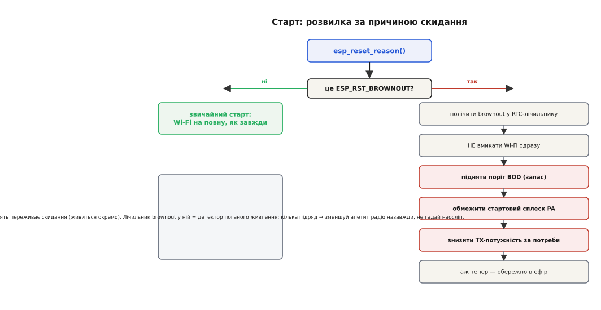
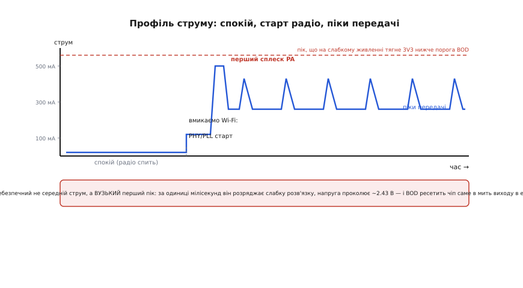

# ⚙️ Сторож brownout: реальний C для ESP-IDF

**Задача.** Модуль ти спаяв ідеально: тракт узгоджений, антена дивиться в порожнечу, розв'язка на місці. Пристрій стартує, підключається до Wi-Fi, працює тижнями — а потім у полі, живлений від дешевого повербанка через півметровий кабель, він раптом починає **перезавантажуватися по колу**. У логу — одне слово: `Brownout detector was triggered`. І далі знову старт, знову Wi-Fi, знову скидання. Класична спіраль смерті.

Ми вже знаємо загальну фізику цього явища: [brown-out — це часткове просідання живлення, «сіра зона», де чіп ще ввімкнений, але вже рахує неправильно, і BOD рубає його, щоб він не псував дані](root:embedded/power-fail-safety) — тут досить пам'ятати, що brown-out (часткове просідання) небезпечніший за повне зникнення живлення, а brown-out detector (BOD) — внутрішній компаратор, що заганяє чіп у скидання, щойно напруга проколює поріг униз. Ми також знаємо, звідки береться сам сплеск струму: [пік передавача під час виходу в ефір сягає сотень мА і просаджує погано розв'язане живлення](book:programming/reset-causes) — причина reset тоді читається як `BROWNOUT`.

Тут ми не переказуємо це вдруге. Тут ми **пишемо код**, який із цим живе: як на старті дізнатися, що попередній скид був саме brownout; як прочитати й переставити поріг детектора; як не наламати дров у самому обробнику brownout; і — головне для ESP32 — як **зміряти профіль пікового струму** під час передачі, щоб приборкати той перший сплеск підсилювача потужності (power amplifier, PA), поки він не вбив пристрій. Усе — реальний ESP-IDF на C, який компілюється й лягає у твою прошивку.

## Ідея: brownout — це не «збій», а сигнал, який треба прочитати й запам'ятати

Перше, що роблять неправильно, — ставляться до brownout як до випадкового збою: «ну перезавантажилось, буває». Але brownout **детермінований**. Він стається не будь-коли, а в цілком конкретну мить — коли пристрій просить у живлення більше струму, ніж те здатне дати без просідання. І майже завжди ця мить — **вихід радіо в ефір**: увімкнення Wi-Fi/BLE піднімає струм зі спокійних десятків мА до пікових сотень за одиниці мілісекунд.

Звідси — стрижнева ідея всієї цієї статті: пристрій має **пам'ятати**, що його вбив brownout, і на наступному старті поводитися **інакше** — обережніше з радіо, — а не бадьоро повторювати той самий фатальний сплеск. Тобто brownout — це вхідний сигнал у логіку старту, так само як прапорці здоров'я — вхідний сигнал у машину станів польоту. Прочитав причину скиду → якщо brownout → не жени радіо на повну, а спершу вгамуй апетит.

Розгорнімо це в код по шарах: спершу читання причини, тоді детектор та його поріг, тоді безпечна поведінка в самому обробнику, і нарешті — вимірювання того піку, заради якого все й затіяне.

## Крок 1: прочитати причину останнього скиду

ESP-IDF тримає причину останнього скидання й віддає її однією функцією:

```c
#include "esp_system.h"

esp_reset_reason_t esp_reset_reason(void);
```

Повертає вона один зі значень переліку `esp_reset_reason_t`. Нас цікавить жменя з них — решту наводжу, щоб ти впізнав їх у чужому коді:

```c
typedef enum {
    ESP_RST_UNKNOWN,    // причину визначити не вдалося
    ESP_RST_POWERON,    // подача живлення (холодний старт)
    ESP_RST_EXT,        // зовнішній пін скидання (не для класичного ESP32)
    ESP_RST_SW,         // програмний скид через esp_restart()
    ESP_RST_PANIC,      // виняток / паніка (напр. LoadProhibited)
    ESP_RST_INT_WDT,    // сторожовий таймер переривань
    ESP_RST_TASK_WDT,   // сторожовий таймер задач
    ESP_RST_WDT,        // інший сторожовий таймер
    ESP_RST_DEEPSLEEP,  // вихід із глибокого сну
    ESP_RST_BROWNOUT,   // brownout (апаратний АБО програмний — див. нижче)
    ESP_RST_SDIO,       // скид через SDIO
    // …ESP_RST_USB, ESP_RST_JTAG, ESP_RST_EFUSE, ESP_RST_PWR_GLITCH, ESP_RST_CPU_LOCKUP
} esp_reset_reason_t;
```

Найпростіший корисний код — на самому початку `app_main()`, **до** будь-якої ініціалізації радіо:

```c
#include "esp_log.h"
#include "esp_system.h"

static const char *TAG = "boot";

void app_main(void)
{
    esp_reset_reason_t reason = esp_reset_reason();

    switch (reason) {
    case ESP_RST_POWERON:   ESP_LOGI(TAG, "холодний старт"); break;
    case ESP_RST_SW:        ESP_LOGI(TAG, "програмний рестарт"); break;
    case ESP_RST_PANIC:     ESP_LOGW(TAG, "після паніки — глянь core dump"); break;
    case ESP_RST_TASK_WDT:  ESP_LOGW(TAG, "завис таск — сторож скинув"); break;
    case ESP_RST_BROWNOUT:  ESP_LOGE(TAG, "BROWNOUT — живлення просіло!"); break;
    default:                ESP_LOGI(TAG, "скид, причина = %d", (int)reason);
    }

    // …далі — ініціалізація, і лише потім Wi-Fi
}
```

Це вже цінно: у логу видно **чому** пристрій щойно стартував, і `BROWNOUT` серед причин одразу вказує на живлення, а не на баг у коді. Але просто надрукувати мало. Треба на цю причину **зреагувати** — і для цього спершу зрозуміти, що саме ховається за єдиним значенням `ESP_RST_BROWNOUT`.

### Чому одне значення, а скидів насправді два

Тут криється тонкість, через яку люди місяцями шукають «плаваючий баг». `ESP_RST_BROWNOUT` віддається **двома різними шляхами**, і корисно розуміти обидва, бо від конфігурації прошивки залежить, який спрацює.

Шлях перший, **чисто апаратний**. Якщо детектор налаштований одразу ресетити чіп (`reset_enabled = true`), то при просіданні спрацьовує апаратний скид, і кремній сам виставляє причину `SYS_BROWN_OUT`. На наступному старті ESP-IDF читає цей регістр причини й повертає `ESP_RST_BROWNOUT`. Процесор тут не виконує **жодної** інструкції — реакція суто залізна, миттєва.

Шлях другий, **через переривання** (це варіант за замовчуванням у сучасному IDF). Детектор не ресетить чіп сам, а піднімає **переривання**. Крихітний обробник у пам'яті IRAM реагує: зупиняє друге ядро, лишає «підказку» (hint) про причину й викликає перезапуск. Формально це виглядає як програмний скид (`CORE_SW`), але завдяки підказці IDF розуміє справжню причину й теж повертає `ESP_RST_BROWNOUT`.

Звідки ця підказка переживає скид? Її кладуть у **RTC-пам'ять** — точніше, в один регістр RTC-домену (`RTC_CNTL_STORE6_REG`). RTC-домен живиться окремо й **не скидається** разом із рештою чіпа, тому записане в нього переживає і скид, і навіть глибокий сон. Це — ключова властивість, якою ми скористаємося далі, щоб **рахувати** brownout-и між перезавантаженнями.

> 🔧 **Навіщо це.** Розуміти два шляхи треба, коли поведінка «плаває» між збірками. Хтось увімкнув швидкий апаратний скид заради надійності — і твій акуратний обробник, що мав щось зберегти, **ніколи не викликається**, бо чіп рубиться залізом до єдиної інструкції. Або навпаки: обробник є, але він робить щось довге (пише в лог, чекає мьютекс) — і не встигає, бо напруга летить далі вниз. Знаючи, який шлях активний, ти не шукаєш примар, а дивишся один пункт конфігурації.


*Причина скиду — перша розвилка в `app_main()`. Звичайний скид → Wi-Fi на повну, як завжди. `ESP_RST_BROWNOUT` → окрема гілка: полічити подію в RTC-лічильнику (він переживає скид), не вмикати радіо одразу, підняти поріг детектора, приборкати стартовий сплеск PA й за потреби знизити TX-потужність — і лише тоді обережно вийти в ефір. Червоні кроки — саме ті, що зменшують апетит радіо.*

## Крок 2: полічити brownout-и, які переживають скид

Один brownout — це, може, випадкова просадка (сусід увімкнув чайник на тій самій розетці USB-хаба). А от **три поспіль** — це вже діагноз: живлення систематично не тягне. Тож замість того, щоб реагувати на кожну подію однаково, полічимо їх — і ескалюємо поведінку, коли рахунок росте.

Лічильник має пережити скид, тому кладемо його не у звичайну змінну (яка обнулиться), а в RTC-пам'ять. В ESP-IDF це робиться атрибутом `RTC_NOINIT_ATTR` — змінна лягає в RTC-домен і **не занулюється** при старті (на відміну від звичайних глобальних, які стартовий код чистить):

```c
#include "esp_attr.h"

// Живе в RTC-домені: переживає скид і глибокий сон, стартовим кодом НЕ зануляється.
RTC_NOINIT_ATTR static uint32_t s_brownout_count;
RTC_NOINIT_ATTR static uint32_t s_rtc_magic;   // ознака «пам'ять уже наша»

#define RTC_MAGIC 0xB0D0C0DEu   // будь-яке впізнаване число
```

Чому потрібне `s_rtc_magic`? Бо `RTC_NOINIT_ATTR` **не ініціалізує** пам'ять — а після подачі живлення (холодного старту) в ній лежить сміття. Тобто ми не можемо просто вірити `s_brownout_count` — спершу мусимо переконатися, що це **наш** лічильник, а не випадкові біти. Магічне число й вирішує це: якщо воно на місці — пам'ять уже наша й лічильнику можна вірити; якщо ні — це перший старт, пам'ять треба ініціалізувати:

```c
static void brownout_bookkeeping(esp_reset_reason_t reason)
{
    if (s_rtc_magic != RTC_MAGIC) {
        // Холодний старт (подали живлення) або сміття в RTC — ініціалізуємо.
        s_rtc_magic = RTC_MAGIC;
        s_brownout_count = 0;
        return;
    }
    // Пам'ять наша й достовірна. Якщо це був brownout — рахуємо.
    if (reason == ESP_RST_BROWNOUT) {
        s_brownout_count++;
        ESP_LOGE(TAG, "brownout #%u поспіль", (unsigned)s_brownout_count);
    } else if (reason == ESP_RST_POWERON) {
        // Живлення передумали й дали чисто — рахунок скидаємо.
        s_brownout_count = 0;
    }
    // Інші причини (панік, watchdog) рахунок brownout не чіпають.
}
```

Тонкість — **де скидати лічильник**. Скидати його при кожному `POWERON` розумно: якщо людина від'єднала й під'єднала живлення заново, це «свіжий старт», історія просадок неактуальна. А от при програмному скиді (`ESP_RST_SW`) чи паніці лічильник **не чіпаємо** — пристрій міг рестартувати сам себе з іншої причини, а проблема з живленням нікуди не поділася.

Тепер `s_brownout_count` — це наш простий, але чесний детектор поганого живлення. Далі ми на нього обіпремося, вирішуючи, **наскільки агресивно** приборкувати радіо.

## Крок 3: поріг детектора — прочитати, зрозуміти, переставити

Поріг BOD на класичному ESP32 обирають **при збірці прошивки**, а не «на льоту». Це пункт `menuconfig`:

```
Component config → ESP System Settings → Brownout Detector →
    Hardware brownout detect & reset            [*]
    Brownout voltage level  (2.43V +/- 0.05)  --->
```

У `sdkconfig` це два ключі: `CONFIG_ESP_BROWNOUT_DET` (увімкнено чи ні) та `CONFIG_ESP_BROWNOUT_DET_LVL_SEL_x` (рівень). Рівнів на класичному ESP32 вісім, і ось **точна** таблиця з офіційного Kconfig (значення — оцінка, з розкидом ±0.05 В через варіацію внутрішнього опорного джерела):

```
рівень 0 → 2.43 В   (за замовчуванням)
рівень 1 → 2.48 В
рівень 2 → 2.58 В
рівень 3 → 2.62 В
рівень 4 → 2.67 В
рівень 5 → 2.70 В
рівень 6 → 2.77 В
рівень 7 → 2.80 В
```

Зверни увагу: на класичному ESP32 більший номер = **вищий** поріг (детектор спрацьовує раніше, за менш глибокої просадки). На інших чипах сімейства (S2, S3) нумерація може йти **навпаки** — там більший номер часто означає нижчий поріг. Тому число рівня без чипа нічого не значить; завжди звіряй саме напругу, а не номер.

**Як вибрати поріг.** Логіка та сама, що для будь-якого BOD: поріг має лежати **нижче** мінімальної робочої напруги (щоб детектор не рубав справний пристрій при кожній легкій просадці), але **вище** тієї напруги, за якої логіка вже починає брехати. ESP32 офіційно працює від 3.0 до 3.6 В, і вже нижче ~2.3 В радіочастина стає ненадійною. Тож заводський рівень 0 (2.43 В) — це «підлога»: щойно 3V3 просіло аж до 2.43 В, ми рубаємо, не чекаючи гіршого.

І тут — головна пастка **діагностики**. Якщо пристрій ресетиться від brownout при кожному вмиканні Wi-Fi, спокуса очевидна: **знизити** поріг, щоб «не спрацьовувало». Але 2.43 В — уже майже дно робочого діапазону; знижувати нікуди. Спрацьовування BOD — це не хвороба, а **симптом**: живлення реально просідає до дна. Правильна реакція — не глушити датчик, а **лікувати живлення** (товща розв'язка, коротший кабель, притлумлений сплеск PA — про це нижче). Поріг чіпають в **інший** бік і з іншою метою: іноді його навпаки **піднімають** (скажімо, на рівень 3–4), щоб рубати **раніше** — до того, як напруга впаде так низько, що встигне пошкодити запис у Flash.

> 🔧 **Навіщо це.** Піднятий поріг рятує **цілісність Flash**. Якщо brownout ловить чіп посеред запису сторінки у флеш-пам'ять, туди може піти напівзаписане сміття, яке потім не відрізниш від справжніх даних. Спіймавши просадку раніше (за вищого порога), ти зупиняєш чіп із більшим запасом напруги — доти, доки логіка ще коректна, — і не ризикуєш зіпсувати збережене. Ось чому «поріг вище» — це не «менш чутливо», а «рубаю, поки ще безпечно».

**Прочитати чинний поріг у коді.** Оскільки поріг заданий у збірці, найчистіше — просто вивести його з макроса конфігурації, зіставивши з таблицею:

```c
// Перевести номер рівня класичного ESP32 у напругу (мВ) за офіційною таблицею.
static int brownout_threshold_mv(void)
{
#if   CONFIG_ESP_BROWNOUT_DET_LVL_SEL_0
    return 2430;
#elif CONFIG_ESP_BROWNOUT_DET_LVL_SEL_1
    return 2480;
#elif CONFIG_ESP_BROWNOUT_DET_LVL_SEL_2
    return 2580;
#elif CONFIG_ESP_BROWNOUT_DET_LVL_SEL_3
    return 2620;
#elif CONFIG_ESP_BROWNOUT_DET_LVL_SEL_4
    return 2670;
#elif CONFIG_ESP_BROWNOUT_DET_LVL_SEL_5
    return 2700;
#elif CONFIG_ESP_BROWNOUT_DET_LVL_SEL_6
    return 2770;
#elif CONFIG_ESP_BROWNOUT_DET_LVL_SEL_7
    return 2800;
#else
    return -1;   // детектор вимкнено
#endif
}
```

Це не «зчитування регістра», а свідоме віддзеркалення налаштування в рантайм — саме те, що треба, щоб лог і рішення спиралися на **фактичний** поріг збірки, а не на здогад.

## Крок 4: обробник brownout — і три способи його зламати

ESP-IDF уже має власний обробник brownout, і повчально глянути, **як його написано**, бо кожен його рядок — це урок, що можна й чого не можна робити в цей момент. Ось він (спрощено, з IDF):

```c
IRAM_ATTR static void rtc_brownout_isr_handler(void *arg)
{
    brownout_ll_intr_clear();               // 1. зняти прапорець переривання

    esp_cpu_stall(other_core_id);           // 2. зупинити друге ядро

    esp_reset_reason_set_hint(ESP_RST_BROWNOUT);  // 3. лишити підказку в RTC

    ESP_DRAM_LOGI(TAG, "Brownout detector was triggered\r\n\r\n");  // 4. друк із DRAM

    esp_restart_noos();                     // 5. негайний перезапуск
}
```

Придивімося до трьох речей, які легко зробити не так, якби ти писав такий обробник сам.

**Пастка перша: логування у brownout-ISR.** Найтиповіша спокуса — вставити в обробник звичайний `ESP_LOGE(TAG, "...")`, щоб «зберегти більше інформації». Це вб'є систему в мить, коли їй і так зле. Чому? Бо brownout стається **саме тому, що впала напруга**, і в цей момент конфігурація детектора вже **вимкнула живлення Flash** (`flash_power_down = true`). Звичайний `ESP_LOGx` читає рядок формату **з Flash** — а Flash щойно знеструмлено. Спроба звернутися до нього зависне або впаде. Тому IDF друкує через `ESP_DRAM_LOGI` — варіант, що тримає рядок у **DRAM** (оперативці), не торкаючись Flash; у старіших версіях та сама роль у `esp_rom_printf`, який друкує функцією з ROM. Обидва не залежать від Flash — і тому безпечні. Урок: **у brownout-обробнику — жодного коду, що читає Flash**: ні звичайного логування, ні констант із флеша, ні виклику функцій, не позначених `IRAM_ATTR`.

**Пастка друга: обробник не в IRAM.** Уся функція позначена `IRAM_ATTR` — вона лежить у внутрішній пам'яті інструкцій, а не у Flash. З тієї самої причини: код обробника мусить виконуватися, коли Flash недоступний. Якби функцію лишили у Flash (без `IRAM_ATTR`), процесор не зміг би її навіть **прочитати**, щоб виконати. Це стосується й усього, що обробник викликає: кожна викликана функція теж має бути в IRAM.

**Пастка третя: довгі дії замість негайного скиду.** Обробник не намагається нічого «врятувати» — він зупиняє друге ядро (щоб те не наробило шкоди спотвореними обчисленнями), лишає підказку й **негайно** перезапускає чіп через `esp_restart_noos()` (варіант restart без участі планувальника — його теж можна кликати з переривання). Спокуса «дозаписати стан у brownout-обробнику» хибна: напруга **вже** нижча за поріг, тобто вже в сірій зоні, і кожна зайва мілісекунда — ризик спотворити той самий запис. Рятувати стан треба **раніше** — окремим, вищим порогом-попередженням, поки напруга ще коректна, — а не в обробнику самого дна. (Саме цей «другий рубіж» — попередження до brownout — [ми розбирали як окрему лінію оборони](root:embedded/power-fail-safety); там досить пам'ятати, що є два пороги: ранній «попередження» для рятування стану й пізній «підлога» BOD, нижче якого просто рубимо.)

Практичний висновок: **свій** обробник brownout писати майже ніколи не треба — вбудований зроблений правильно. Твоя робота — на **наступному** старті прочитати `esp_reset_reason()`, і **там**, у нормальних умовах (Flash живий, напруга в нормі), спокійно зробити все, що хотілося: записати в лог, полічити подію, змінити поведінку радіо.

## Крок 5: приборкати радіо після brownout

Тепер зберімо реакцію докупи. Ми знаємо причину скиду й рахунок brownout-ів. Лишилося перекласти це в дві дії над радіо: **обмежити стартовий сплеск** і, якщо треба, **знизити потужність передачі**.

**Знизити TX-потужність.** Пік струму PA прямо залежить від того, з якою потужністю передавач жене сигнал в антену. Менша потужність — менший пік — менша просадка. В ESP-IDF потужність задають так:

```c
#include "esp_wifi.h"

esp_err_t esp_wifi_set_max_tx_power(int8_t power);   // одиниця — 0.25 dBm
esp_err_t esp_wifi_get_max_tx_power(int8_t *power);
```

Одиниця — **чверть децибела** (0.25 dBm), тож значення 78 означає 78 × 0.25 = 19.5 dBm. Діапазон — приблизно [8, 84], тобто від 2 до 20 dBm. Два **гострі кути** цього API, на яких спотикаються:

По-перше, **порядок викликів**. І `set`, і `get` працюють **лише після** `esp_wifi_start()`. Викличеш до старту — дістанеш `ESP_ERR_WIFI_NOT_STARTED` і потужність не зміниться. Тому знижувати її треба в потрібний момент послідовності ініціалізації, а не «десь на початку».

По-друге, значення **квантується** таблицею, і фактична потужність — не завжди рівно та, що просив. Драйвер округлює запит до найближчого дозволеного рівня зі своєї сітки (наприклад, запит 60 дасть рівно 15 dBm, а будь-що в діапазоні 60…65 — теж 15 dBm). Тому після `set` корисно зробити `get` і **вивести фактичне** значення — щоб у логу було, що реально стоїть, а не що ти хотів.

```c
static void wifi_apply_power_policy(uint32_t brownout_count)
{
    // Що більше brownout-ів поспіль, то скромніший апетит радіо.
    int8_t want;                 // одиниця — 0.25 dBm
    if (brownout_count == 0)      want = 78;  // 19.5 dBm — повна
    else if (brownout_count < 3)  want = 52;  // 13 dBm  — помірна
    else                          want = 34;  // 8.5 dBm — обережна

    esp_err_t err = esp_wifi_set_max_tx_power(want);   // ТІЛЬКИ після esp_wifi_start()
    if (err != ESP_OK) {
        ESP_LOGW(TAG, "set_tx_power: %s", esp_err_to_name(err));
        return;
    }
    int8_t actual = 0;
    esp_wifi_get_max_tx_power(&actual);                 // округлене драйвером
    ESP_LOGI(TAG, "TX-потужність: хотів %.2f, стоїть %.2f dBm",
             want * 0.25, actual * 0.25);
}
```

**Обмежити стартовий сплеск (inrush) PA.** Перший пік — найлютіший: у мить, коли PHY-шар піднімає підсилювач і калібрується, струм стрибає найвище. ESP-IDF дозволяє **не бити на повну одразу**, а ввести живлення радіо м'якше — через параметри Wi-Fi-ініціалізації. Ключове — **не** тримати максимальну заявлену потужність у PHY, поки вона не потрібна: чим нижча стеля потужності на момент старту радіо, тим менший стартовий сплеск. Практично це означає: не викликати `esp_wifi_set_max_tx_power(78)` **до** того, як лінк устоявся; підняти потужність можна пізніше, коли вже підключилися й розв'язка «відхекалася» після першого піку.

Загальний порядок безпечного старту радіо після brownout виглядає так:

```c
void app_main(void)
{
    esp_reset_reason_t reason = esp_reset_reason();
    brownout_bookkeeping(reason);                 // полічити (крок 2)
    ESP_LOGI(TAG, "поріг BOD ≈ %d мВ", brownout_threshold_mv());  // (крок 3)

    // …ініціалізація NVS, netif, event loop…

    wifi_init_config_t cfg = WIFI_INIT_CONFIG_DEFAULT();
    ESP_ERROR_CHECK(esp_wifi_init(&cfg));
    ESP_ERROR_CHECK(esp_wifi_set_mode(WIFI_MODE_STA));

    // Стартуємо радіо СКРОМНО, щоб приборкати перший сплеск PA:
    ESP_ERROR_CHECK(esp_wifi_start());            // тепер set/get_tx_power дозволені
    wifi_apply_power_policy(s_brownout_count);     // (крок 5)

    ESP_ERROR_CHECK(esp_wifi_connect());          // аж тепер — у ефір
}
```

Ця послідовність і є та «окрема гілка обережності», що на схемі вела від `ESP_RST_BROWNOUT`: полічили → порахували поріг → стартували радіо стримано → лише потім під'єдналися.

## Крок 6: зміряти той самий пік струму

Уся стратегія вище спирається на невидиме число — **пік струму під час передачі**. Поки ти його не зміряв, ти лікуєш наосліп: може, проблема зовсім не в PA, а, скажімо, у стартовому струмі якоїсь периферії. Тож навчімося цей пік **бачити**.

Ключова складність — пік **вузький і швидкий**. Він триває одиниці мілісекунд, а може й менше. Звичайний мультиметр його **не побачить взагалі**: він усереднює за десяті частки секунди й покаже спокійний середній струм — тоді як миттєвий пік у кілька разів вищий. Це головна пастка вимірювання, і саме через неї «у мене ж лише 80 мА середнього» уживається з brownout: середнє мале, а пік — ні.

Є два практичні підходи, і вони доповнюють один одного.

**Підхід А: осцилограф на шунті.** Ставимо між живленням і модулем малий струмовимірювальний резистор (шунт), скажімо 0.1 Ω, і дивимося осцилографом падіння напруги на ньому. Струм — це напруга поділити на опір; вузький пік стане видно як гострий сплеск. Це найчесніший спосіб побачити **форму** піку в часі — його висоту, тривалість, і те, як він корелює з моментом виходу в ефір. Тонкощі самого вимірювання (вибір шунта, смуга щупа, тригер по сплеску) — це вже [окреме ремесло вимірювання профілю струму спеціальними приладами](root:embedded/current-profiler-tools); тут досить знати, що прилад мусить мати достатню **смугу** й **швидкість**, щоб не «згладити» вузький пік у нікуди.

**Підхід Б: сам чіп як осцилограф.** У ESP32 є вбудований АЦП, і його можна **синхронізувати** з подіями радіо, щоб зловити просадку зсередини, без зовнішнього приладу. Ідея: під час вмикання Wi-Fi швидко-швидко міряти саму напругу 3V3 і ловити її **мінімум** — те найглибше значення, до якого вона провалюється в мить піку. Якщо цей мінімум близький до порога BOD — ось твоє пояснення скидів.

```c
#include "esp_adc/adc_oneshot.h"

// Ловимо МІНІМУМ напруги живлення протягом вікна вимірювання.
// (3V3 подано на пін АЦП через дільник — АЦП ESP32 не бачить понад ~3.1 В напряму.)
static int measure_vdd_min_mv(adc_oneshot_unit_handle_t adc, adc_channel_t ch,
                              int window_ms, int divider_num, int divider_den)
{
    int min_raw = 1 << 30;
    int64_t t_end = esp_timer_get_time() + (int64_t)window_ms * 1000;
    while (esp_timer_get_time() < t_end) {
        int raw = 0;
        if (adc_oneshot_read(adc, ch, &raw) == ESP_OK && raw < min_raw) {
            min_raw = raw;
        }
        // без затримки: беремо якомога густіше, щоб не проґавити вузький провал
    }
    // raw → мВ на піні (для 12-біт і опори ~3.3 В шкала ≈ 3300/4095 мВ на відлік),
    // тоді назад через дільник до реальної 3V3:
    int mv_pin = (min_raw * 3300) / 4095;
    return mv_pin * divider_den / divider_num;
}
```

І застосування — обгорнути ним саме той момент, де ми підозрюємо пік: увімкнення радіо.

```c
    int before = measure_vdd_min_mv(adc, ch, 5, DIV_NUM, DIV_DEN);   // спокій
    esp_wifi_start();
    esp_wifi_connect();
    int during = measure_vdd_min_mv(adc, ch, 300, DIV_NUM, DIV_DEN); // під час старту радіо

    ESP_LOGI(TAG, "3V3: спокій %d мВ, провал при старті радіо %d мВ (поріг BOD ≈ %d мВ)",
             before, during, brownout_threshold_mv());
    if (during < brownout_threshold_mv() + 150) {
        ESP_LOGW(TAG, "провал майже дістає порога — живлення на межі, тре товщу розв'язку");
    }
```

Цей самий підхід — «сам чіп міряє свою напругу під навантаженням» — споріднений із загальним [вимірюванням споживання зсередини прошивки](root:embedded/measure-consumption): там ідея та сама (АЦП + шунт або дільник + синхронізація з подіями), лише мета — середній струм, а тут — **найгірший миттєвий провал**. Тримай у голові межу методу: вбудований АЦП не миттєвий, і дуже гострий пік (частки мілісекунди) він теж може «недобачити». Тому підхід Б добрий як **дешевий сторож у полі** («напруга на межі — попереди»), а точну **форму** піку однаково знімають осцилографом.


*Що ловимо. Ліворуч — спокій, радіо спить, струм — десятки мА. Далі — сходинка: PHY піднімає радіо. Одразу за нею — вузький високий перший сплеск PA (до ~500 мА за одиниці мілісекунд), тоді серія піків самої передачі коло помірнішого рівня. Пунктир — той струм, що на слабкому живленні просаджує 3V3 нижче порога BOD. Небезпечний не середній рівень, а саме гострий перший пік: мультиметр його не бачить, а BOD — бачить.*

## Складність і пастки: підсумок

Зберімо докупи те, на чому провалюються, — з механізмом кожної пастки, а не просто списком.

**Слабке USB-живлення — корінь більшості brownout.** Дешевий повербанк чи порт ноутбука тримає 5 В лише до якогось струму, а далі **просідає**. Пік PA цей поріг пробиває — 5 В падає, за ним падає й 3V3 після регулятора, і BOD рубає. Симптом однозначний: **від доброго блока живлення пристрій працює, від абияк — ресетиться по колу**. Лікування — не глушити BOD, а дати живленню запас: якісне джерело, коротший і товщий кабель (щоб менше падало на його опорі), товща розв'язка біля модуля.

**Логування у brownout-обробнику вбиває.** Звичайний `ESP_LOGx` читає рядок з Flash, а Flash у мить brownout уже знеструмлено (`flash_power_down`). Тому вбудований обробник друкує через `ESP_DRAM_LOGI`/`esp_rom_printf` і весь лежить у IRAM. Правило: **свій обробник brownout не пиши** — а якщо вже пишеш, жодного Flash: ні логів, ні констант звідти, ні не-IRAM-функцій. Усе цінне роби на **наступному** старті, коли Flash живий.

**Розв'язка вирішує форму піку.** Пік PA — швидкий, тож його «гасить» не об'ємний конденсатор десь на платі, а саме **керамічна розв'язка впритул до виводу живлення модуля**: вона віддає заряд миттєво й не дає напрузі провалитися за той короткий сплеск. Тонка або далеко посаджена розв'язка = глибокий провал = brownout навіть від пристойного джерела. Об'ємний конденсатор (десятки-сотні мкФ) допомагає на **повільніших** просадках; на швидкому піку працює саме близька кераміка.

**Поріг чіпають в правильний бік і з правильною метою.** Знижувати поріг «щоб не спрацьовувало» безглуздо — заводські 2.43 В уже майже дно, і спрацьовування означає реальну просадку до дна. Іноді поріг навпаки **піднімають** — щоб рубати **раніше** й не дати brownout спіймати чіп посеред запису у Flash. У кожному разі поріг — це не регулятор гучності симптому, а рішення про те, з яким запасом напруги ти зупиняєш чіп.

**Мультиметр бреже про пік.** Він усереднює й покаже спокійний середній струм, тоді як винний — вузький миттєвий пік у кілька разів вищий. Тому «в мене ж лише 80 мА» і brownout уживаються без суперечності. Дивитися треба **форму в часі** — осцилографом на шунті або вбудованим АЦП, що ловить мінімум напруги в мить старту радіо.

**Апаратний і програмний шлях brownout — різні.** За замовчуванням спрацьовує обробник-переривання (виглядає як `CORE_SW`, але підказка в RTC робить із нього `ESP_RST_BROWNOUT`); якщо ж увімкнено прямий апаратний скид, чіп рубиться залізом до єдиної інструкції, і твій обробник ніколи не викликається. Плаває поведінка між збірками — дивись цей один пункт конфігурації, а не шукай примар у коді.

Складіть це разом — і спіраль смерті з початку статті розкладається на прості кроки: прочитати `esp_reset_reason()`, полічити подію в RTC-пам'яті, приборкати перший сплеск PA й потужність передачі, зміряти реальний провал напруги — і, найголовніше, лікувати живлення, а не глушити датчик, що чесно кричить про його слабкість.
