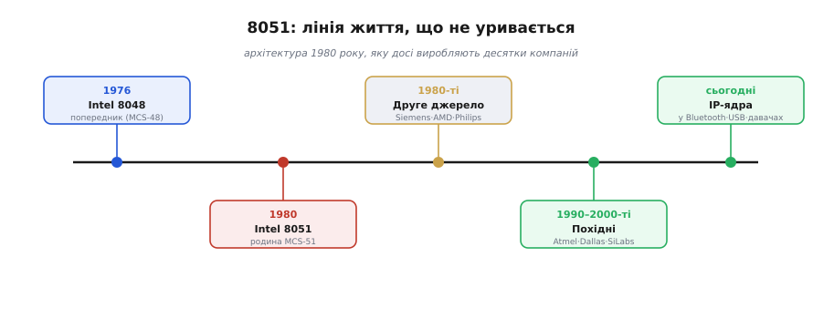
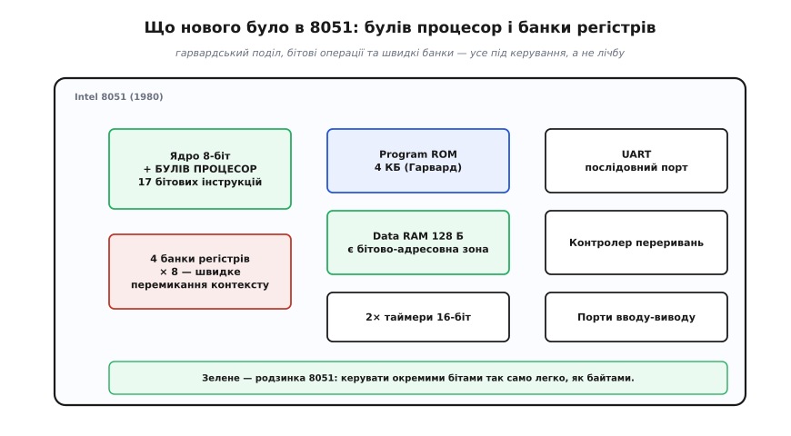
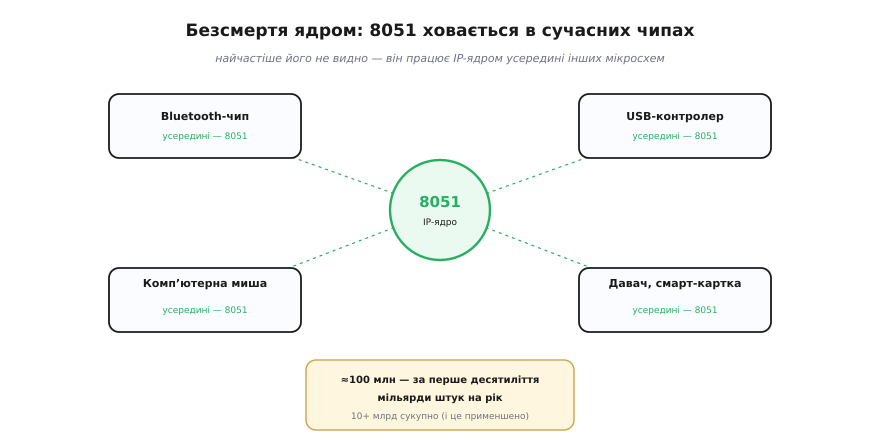

# 📜 Intel 8051: архітектура 1980 року, яка досі всюди

> Коли могутній ESP32 ставлять поряд із «простим 8-бітним МК», найвідоміший представник того «простого» табору — **Intel 8051** — старший за більшість сьогоднішніх інженерів, а живе й тиражується досі, мільярдами штук на рік. Це історія про те, як скромна архітектура пережила власних творців.

## Чип, старший за своїх користувачів

Уявіть деталь, спроєктовану 1980 року — коли ще не було ні смартфонів, ні USB, ні навіть більшості сучасних мов програмування, — яка дотепер сидить усередині вашої мишки, бездротових навушників, флешки й банківської картки. Це **Intel 8051**. За оцінками, його та сумісних із ним випустили **десятки мільярдів** штук; самого лише оригіналу Intel продала близько **100 мільйонів** за перше десятиліття, а потім лік пішов на мільярди щороку.

*Лінія життя 8051: попередник 8048 (1976), сам 8051 (1980), хвиля «другого джерела» у 80-х, похідні від Atmel, Dallas і Silicon Labs у 90–2000-х — і сьогодення, де 8051 здебільшого працює прихованим ядром усередині інших чипів.*

Як архітектура, ровесниця дискових телефонів, стала фактично безсмертною? Відповідь не в геніальності однієї цифри в даташиті, а в кількох тверезих інженерних рішеннях і в одній стратегії, що випередила час.

## Перед 8051: уроки 8048

8051 з'явився не на порожньому місці. Йому передував **Intel 8048** (родина *MCS-48*, 1976) — один із перших однокристальних мікроконтролерів, що сам по собі вже був помітним: саме 8048 сидів у **клавіатурі першого IBM PC**, перетворюючи натискання на коди. Але 8048 був тіснуватий: мало пам'яті, обмежений набір команд, незручний для дедалі складніших задач керування.

Сам 8048 був важливою віхою — він довів, що цілий керівний комп'ютер справді вміщується в один корпус і коштує прийнятно. Та апетити інженерів росли швидше за його можливості: бракувало пам'яті під складніші програми, зручних команд для арифметики й логіки, гнучкішого послідовного зв'язку. 8048 показав, **що** взагалі можливо; лишалося зробити це по-дорослому — і саме цим став 8051.

Наприкінці 1970-х Intel захотіла наступника — потужнішого, та все ще дешевого й однокристального. Питання стояло так: що саме треба додати, щоб мікроконтролер зручно **керував** реальним світом — вмикав реле, опитував давачі, говорив по послідовній лінії, — а не просто рахував? Відповідь на це питання й визначила обличчя 8051.

## Архітектура за вікенд: Джон Уортон і команда

Набір команд (*instruction set*) і архітектуру 8051 пов'язують передусім з ім'ям **Джона Уортона** (*John H. Wharton*), інженера Intel. За переказами, що ходять у галузі (зокрема з усних історій ветеранів Intel), поштовх був майже анекдотичним: наприкінці 1977 року Уортона попросили накидати архітектуру, що виправила б вади 8048, — і базову пропозицію він приніс уже за кілька днів, попрацювавши над нею вихідні. Історія колоритна, тож переказують її охоче; ми наводимо її саме як **переказ**, а не задокументований факт до хвилини.

Важливіше інше, і тут варто бути чесними щодо авторства: **архітектура — це праця команди**. Уортон сформував систему команд і ключові ідеї, але перетворити пропозицію на робочий кремній — задати логіку, розвести периферію, налагодити виробництво — це робота цілого колективу інженерів Intel протягом 1978–1980 років. «Одну людину, що винайшла 8051» шукати не варто: був архітектор системи команд і була команда, що її втілила. Саме таке розрізнення — «придумати ідею» проти «зробити робочий пристрій» — корисно тримати в голові щоразу, коли історія техніки спокушає звести все до одного героя.

## Булів процесор: керувати бітами, а не лише байтами

Що ж зробило 8051 таким придатним саме до **керування**? Найоригінальніша риса — **булів процесор** (*Boolean processor*, *bit processor*): окремий набір аж **сімнадцяти** інструкцій, що працюють не з байтами, а з **окремими бітами**. Можна було взяти один біт, перевірити його, виконати над ним логічне І чи АБО з іншим бітом, встановити чи скинути — прямо, однією командою.

*Анатомія 8051. Гарвардський поділ (програма у ROM окремо від даних у RAM), два 16-бітні таймери, UART, контролер переривань — і родзинка: булів процесор разом із бітово-адресовною зоною RAM, що дають керувати окремими лініями так само просто, як числами.*

Чому це таке велике діло? Бо **керування — це здебільшого про окремі біти**: ця кнопка натиснута? цей вихід на реле — увімкнути; цей прапорець помилки — звести. На звичайному процесорі кожна така дрібниця коштує кількох команд (прочитати байт, накласти маску, записати назад — той самий [read-modify-write](root:hw-arch/memory-mapped-io)). А 8051 робив це **однією** інструкцією над бітом. Для логіки керування — лічильників, світлофорів, верстатів, побутової техніки — це була точно та зручність, якої бракувало. Звідси й конвенція **бітово-адресовної пам'яті** (*bit-addressable*), що дожила в духовних нащадках 8051 досі.

Щоб відчути різницю — дрібний приклад. Уявіть умову «вмикай насос, лише якщо бак **не** порожній **і** немає аварії». На 8051 це майже дослівний рядок над бітами: взяти прапорець «бак не порожній», накласти логічне І з інверсією прапорця «аварія» й результат покласти прямо на біт виходу насоса — кілька бітових команд, що читаються як сама умова. Без булевого процесора ту саму логіку довелося б збирати з масок і зсувів над цілими байтами. А керування — це сотні таких дрібних умов, тож зручність складалася у відчутно простіший і коротший код.

## Чотири банки регістрів і пам'ять на чипі

Друга вдала риса — **чотири банки робочих регістрів** по вісім у кожному, між якими можна було **миттєво перемикатися**. Коли спрацьовувало переривання, обробник міг перемкнутися на власний банк замість того, щоб довго зберігати й відновлювати регістри в пам'яті. Для системи реального часу, де кожна мікросекунда відгуку на подію важить, це був відчутний виграш — і знову прицільно «під керування».

Решта складалася в знайому [анатомію мікроконтролера](root:hw-arch/mcu-blocks), тільки в скромних числах тієї епохи: **гарвардський поділ** (програма окремо від даних), **4 КБ** програмного ROM, аж **128 байтів** RAM, два 16-бітні **таймери**, **UART** для послідовного зв'язку й контролер переривань. За мірками сьогодення — мізер (в ESP32 самої лише RAM ~520 КБ). Але для задач, на які 8051 ставили, цього вистачало — і вистачає досі.

## SFR: регістри з іменами, що пережили архітектуру

Одна конвенція 8051 заслуговує окремої згадки, бо ви зустрічаєте її щодня, навіть не підозрюючи про її вік. 8051 популяризував **регістри спеціальних функцій** (*special function registers*, **SFR**): периферію — порти, таймери, UART, прапорці — поклали на ту саму карту пам'яті, що й дані, і дали кожному регістру **ім'я**. Хочеш керувати першим портом — пишеш у `P1`; налаштувати таймер — у `TCON` та `TMOD`; послідовний порт — у `SCON`. Це рівно той самий [**memory-mapped IO**](root:hw-arch/memory-mapped-io), лише з людськими назвами замість голих адрес.

Ідея виявилася такою вдалою, що пережила саму архітектуру: відкрийте даташит будь-якого сучасного МК — і побачите ту саму таблицю іменованих регістрів периферії. 8051 не винайшов memory-mapped IO, але задав **стиль**, у якому його досі описують і програмують. Коли ви звертаєтесь до регістра ESP32 за іменем, ви, по суті, говорите діалектом, що його унормував 8051 сорок років тому.

## Софт: асемблер, а потім C на крихітному ядрі

Залізо — лише половина історії; друга половина — **чим його програмували**. Перші роки 8051 жив на **асемблері**: пам'яті було так мало (кілобайти ROM, сотні байтів RAM), що кожен байт рахували вручну, а компілятор здавався розкішшю, якої чіп не потягне. Ціле покоління інженерів вивчило систему команд 8051 напам'ять — і ця спільнота сама стала частиною його сили.

Перелом настав, коли **C** зробився практичним навіть на такому крихітному ядрі. Тут не обійти компанію **Keil** із її компілятором **C51**: він навчився чавити код C у щільний 8051-машинний код так, що писати стало можна мовою високого рівня, не вилазячи за межі кількох кілобайтів. Поріг входу різко впав — і той самий маховик популярності розкрутився ще дужче. Урок не застарів: **екосистема інструментів** важить для долі чипа не менше за його транзистори.

## Камінь спотикання — масочне ROM, і порятунок EPROM

Був у ранніх мікроконтролерів і болючий клопіт, який варто згадати, бо він пояснює одну важливу для розробника річ. Програму в дешевий 8051 «зашивали» на заводі — **масочним ROM** (*mask ROM*): візерунок коду буквально вкарбовували у фотошаблон при виготовленні чипа. Дешево у великому тиражі, але смертельно незручно під час розробки: будь-яка зміна коду означала **новий фотошаблон**, тижні очікування й величезний мінімальний тираж. Помилився в програмі — викидай партію.

Рятунком стала версія **8751** — той самий 8051, але з **EPROM** замість масочного ROM: пам'яттю, яку можна було стерти ультрафіолетом крізь віконце в корпусі та запрограмувати наново. Дорожче за штуку — зате розробник міг **ітерувати**: прошив, перевірив, стер, виправив. Цей поділ «дешеве незмінне для тиражу проти перепрограмовного для розробки» тягнеться прямою лінією до сьогоднішнього Flash у вашому ESP32, який поєднав обидві чесноти. Згодом з'явилася й варіація **8052** з удвічі більшими ROM і RAM — еволюція в межах тієї самої ідеї.

## Як 8051 став стандартом: ліцензії й «друге джерело»

А тепер — головна причина безсмертя, і вона не технічна, а **стратегічна**. У ті часи великі замовники не хотіли залежати від **одного** постачальника чипа: якщо в Intel пожежа, страйк чи просто підняли ціну — твоє виробництво стає. Тому вимагали **«друге джерело»** (*second source*) — щоб той самий чип легально виробляв і хтось іще.

Intel пішла на це й **ліцензувала** 8051 іншим виробникам — серед них **Siemens** (Німеччина), **AMD**, **Fujitsu** (Японія), **Philips** (Нідерланди), **OKI**. І сталося дещо більше за просте підстрахування поставок: 8051 із продукту однієї компанії перетворився на **галузевий стандарт**. Що більше виробників його випускали, то більше інженерів його вчили; що більше інженерів уміли з ним працювати, то охочіше нові виробники його брали. Закрутився маховик, який сам себе розкручував.

Це урок, який згодом по-своєму повторять і AVR, і ARM: **відкритість і доступність здатні перемогти технічну довершеність**. 8051 не був найшвидшим чи найелегантнішим навіть для свого часу — зате він був **скрізь**, його знали всі, а інструменти й приклади до нього лежали під рукою. Та сама логіка згодом винесе нагору й ліцензовані ядра ARM.

Чому Intel узагалі віддала свій чип конкурентам? Бо в ту епоху **«друге джерело» було нормою ринку**, ба навіть умовою великих контрактів: армія, автопром, промисловість просто не купували компонента, який можна взяти лише в одного постачальника, — надто ризиковано. Поділившись 8051, Intel не стільки втратила, скільки **виростила ринок**, на якому її власна частка все одно лишалася величезною. Парадокс, але саме готовність роздати архітектуру зробила її ціннішою для всіх — рідкісний випадок, коли «відкрити» вигідніше, ніж «замкнути».

## Безсмертя ядром: 8051 всередині інших чипів

Минули десятиліття, Intel давно перейшла на інше — а 8051 не вмер. Його випускають **понад двадцять** незалежних виробників: **Atmel** (тепер у складі Microchip; пам'ятна серія AT89), **Infineon** (колишній Siemens), **Maxim/Dallas**, **NXP** (колишній Philips), **Nuvoton**, **STMicroelectronics**, **Silicon Labs** (колишній Cygnal), **Texas Instruments** та інші.

Але найцікавіше — **де** він тепер живе. Дуже часто 8051 уже не окремий чип, а **IP-ядро** (*intellectual property core*): готовий, перевірений десятиліттями шматочок логіки, який вкладають **усередину** інших, більших мікросхем. У Bluetooth-чипі, USB-контролері, давачі, смарт-картці нерідко тихо працює саме 8051 — як службовий мозок, якого ви не бачите.

*Сьогоднішнє життя 8051 — здебільшого невидиме: він керує всередині Bluetooth-чипів, USB-контролерів, мишей, давачів і смарт-карток як готове IP-ядро. Звідси й астрономічні сукупні тиражі.*

Чому інженер мікросхеми обирає сорокарічну архітектуру для нового чипа? Саме **тому**, що вона стара: вона **до кінця вивчена**, передбачувана, без сюрпризів, із готовими інструментами й безліччю людей, які вміють під неї писати. Для службової логіки всередині великого чипа це рівно те, що треба, — і жодних мегагерців понад потрібне.

Окрема — і дуже людська — причина довговічності: **8051 став чипом, на якому світ учився**. Десятиліттями це був стандартний мікроконтролер університетських курсів і перших саморобних проєктів; мільйони інженерів написали свою першу програму для заліза саме під нього. А коли в 1990-х **Atmel** випустила серію **AT89** із **Flash**-пам'яттю — перепрошивай скільки хочеш, без ультрафіолету й заводських масок, — поріг впав остаточно: дешева плата з 8051, яку студент міг програмувати вдома. Кожне таке покоління ставало наступною хвилею інженерів, що тягли знайому архітектуру в нові продукти. А живе те, чим уміють думати.

Варто згадати й технічний бік цього відродження. Оригінальний 8051 був **повільний на такт**: одна машинна операція забирала аж **дванадцять** періодів кварцу, тож на 12 МГц він давав лише близько мільйона операцій за секунду. Пізніші виробники це виправили, не чіпаючи систему команд: **Dallas** зробила «швидкі» 8051 із чотиритактовим циклом, а **Silicon Labs** (колишній Cygnal) — конвеєрні ядра, що виконують інструкцію мало не за **один** такт. Та сама архітектура — але вже вдесятеро більше роботи за такт. Це жива ілюстрація простого правила: **мегагерці брешуть**. Оригінал і однотактовий клон на однаковій частоті різняться за реальною швидкістю в рази, бо роблять різну роботу за такт (про чесне порівняння — у [математичній вставці](root:embedded/esp32-vs-8bit/math-benchmarks.md) до цієї теми). Сучасні 8051 додали ще й те, чого 1980 року не було: вбудовані АЦП, більше пам'яті, **Flash** замість масочного ROM, — лишивши незмінним саме те, що зробило архітектуру стандартом.

Принагідно: 8051 переміг не тому, що був поза конкуренцією технічно. Поряд змагалися **Zilog Z8**, згодом **Motorola 68HC11**, а трохи пізніше — **Microchip PIC**; у кожного були свої переваги. Та саме 8051 виграв перегони за **стандартизацію** — і причина та сама: широке ліцензування й величезна спільнота переважили будь-яку окрему технічну ваду.

## Що 8051 каже про вибір чипа сьогодні

Питання «ESP32 проти простого 8-бітного МК» історія 8051 освітлює як найдовший можливий доказ однієї тези: **«потужніший» не означає «кращий»**. 8051 не виграв ні в швидкості, ні в пам'яті — він виграв у простоті, передбачуваності, ціні та, найбільше, в **екосистемі**. І саме завдяки цьому пережив покоління «крутіших» чипів, що давно зникли.

Для нас тут і практичний гачок: коли наступного разу обиратимете чіп, згадайте 8051. Інколи найрозумніший вибір — не найновіша й найпотужніша крихта, а нудна, дешева, всіма знана архітектура, під яку є готові інструменти й тонни прикладів. ESP32 чудовий там, де треба його сила; а там, де задача — клацнути парою реле й моргнути світлодіодом, духовний нащадок 8051 і досі поза конкуренцією. Уся майстерність — чесно зважити, що **справді** потрібно цій задачі.
