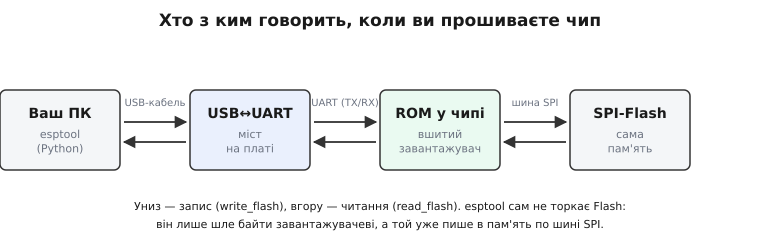
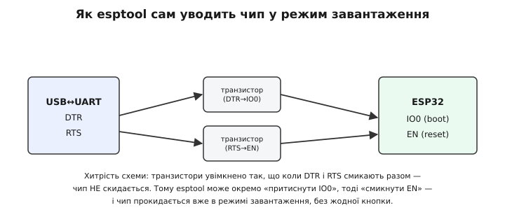
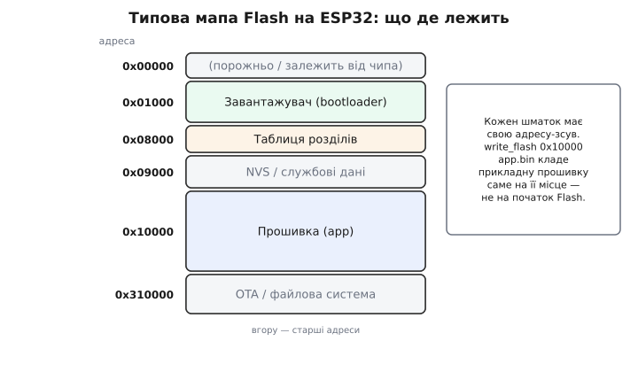
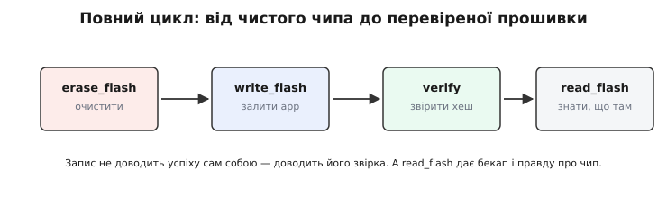

# esptool: прошивання й читання Flash

Коли ви тиснете «Upload» в Arduino чи кажете `idf.py flash`, за тією однією дією тихо працює маленька програма на ім'я **esptool**. Досі ми бачили [механізм заливання збоку](book:programming/flashing): дріт, режим прошивки, чіп, що пише сам себе. Тепер настав час узяти цей механізм **у руки** — бо рано чи пізно «Upload» перестане бути чарівною кнопкою. Прошивка не залилася, плата не відповідає, треба зробити бекап чужого пристрою або стерти його начисто — і ось ви вже мусите говорити з чипом **напряму**, без посередництва середовища. Інструмент для цієї прямої розмови на чипах Espressif один, офіційний, і ним варто володіти вільно.

Назва каже все: **esptool** — «знаряддя для ESP». Це консольна програма (написана мовою Python), яку Espressif дає безкоштовно; саме її ховають під кнопками всі середовища. Навчившись кликати її самотужки, ви перестаєте залежати від чужих обгорток: те саме залізо слухається вас прямо, а ви бачите кожен крок — що залилося, куди й чи звірилося.

### Що насправді робить esptool

Найперше треба розвіяти поширену хибу. esptool **не пише** у Flash-пам'ять. Він фізично її не торкає — між програмою на ПК і мікросхемою пам'яті стоїть кілька ланок, і esptool керує лише найближчою з них.

Ланцюг такий. Ваш ПК з'єднано з платою по USB. На платі (або в самому новому чипі) сидить [перетворювач USB↔UART](book:communications/async-serial), що обертає USB на простий послідовний потік байтів. Цей потік приходить у чіп — і його приймає **завантажувач у ПЗП** (англ. *ROM bootloader*): крихітна, намертво вшита на заводі програма, яку неможливо ні стерти, ні зіпсувати. Саме вона, отримавши від esptool команду «запиши ось ці байти за такою адресою», бере й пише їх у Flash по внутрішній шині SPI. Тобто esptool лише **диктує**, а руками працює незнищенний помічник усередині чипа.


*Чотири ланки між вашою командою і пам'яттю. esptool на ПК шле байти по USB; перетворювач обертає їх на UART; вшитий у ПЗП завантажувач приймає їх і вже сам пише у Flash по шині SPI. Стрілки двобічні: тим самим ланцюгом, але в зворотний бік, читають уміст назад. Ключова думка: esptool не торкає Flash — він керує помічником, що це робить.*

Чому це не педантизм, а суть? Бо саме звідси випливає та заспокійлива правда, яку варто закарбувати: **зробити з ESP32 «цеглину» звичайною помилкою в коді майже неможливо**. Хоч би яку зламану прошивку ви залили, помічник у ПЗП лишається на місці — а отже, новий, виправлений образ можна залити будь-коли. Цеглиною чіп стає хіба від зіпсованих [запобіжників eFuse](root:embedded/tpm-trustzone) чи фізичного ушкодження, а не від поганого коду. Тримайте цю думку як страхувальну сітку: експериментувати з прошивкою безпечно.

> 🔧 **Навіщо це.** Коли «Upload» у середовищі мовчки падає, ви безпорадні — не видно ні чому, ні де. Виклик esptool вручну показує **кожен** крок: чи знайшовся порт, чи відповів чіп, на якій швидкості, що залилося, чи звірилося. Половина «нерозв'язних» проблем заливання діагностується за одну хвилину просто тим, що ви бачите сирий вивід інструмента замість крутілки прогресу.

### Режим завантаження: коли чіп слухає, а не біжить

Аби помічник у ПЗП узагалі слухав esptool, чіп має бути в особливому стані — **режимі завантаження** (англ. *download mode*). Бо звичайно, ввімкнувшись, ESP32 **виконує** вашу прошивку з Flash і нікого не слухає. Прийняти нову прошивку він може лише тоді, коли при старті вибере не «бігти код», а «чекати на байти».

Вибір цей робить одна ніжка — **IO0** (вона ж BOOT). Логіка проста й жорстка: у мить скидання чіп дивиться на її рівень. IO0 на землі (низький) → «хтось хоче мене прошити, переходжу в режим завантаження». IO0 високий (як він і є за замовчуванням, бо має внутрішню підтяжку вгору) → «прошивай не треба, біжу код з Flash». Ось чому на платах є кнопка **BOOT**: вона притискає IO0 до землі. Класичний ручний ритуал входу в режим завантаження: **тримаєш BOOT, тиснеш і відпускаєш RESET (EN), відпускаєш BOOT** — у мить скидання IO0 був унизу, чіп завмер у чеканні.

Тут вступає той самий принцип, що ми бачили [у виборі режиму на старті взагалі](book:programming/bootloader): кілька ніжок, які чіп зчитує лише в момент скидання, задають його подальшу поведінку. IO0 — найважливіша з цих **стрепувальних** ніжок ([англ. *strapping*, «прив'язка»](book:programming/bootloader/comp-strapping.md)).

### Авто-скидання: чому кнопку тиснути не доводиться

Якби той танець із двома кнопками доводилося робити щоразу, прошивка була б мукою. Але ви ж тиснете «Upload» — і чіп сам входить у режим завантаження. Як? Маленькою, але дотепною схемою **авто-скидання** на платі.

Перетворювач USB↔UART має, окрім ліній даних, дві службові лінії-сигнали — **DTR** і **RTS**. На платі їх хитро заведено на дві ніжки чипа: одну на **IO0** (boot), другу на **EN** (reset). Тепер esptool може програмно, без жодних рук, «притиснути IO0» і «смикнути EN» у правильному порядку — і чіп прокидається вже в режимі завантаження.

Чому ж тут потрібні **два транзистори**, а не пряме з'єднання? Через підступну дрібницю. Драйвери USB-портів на старті часто **смикають обидві** службові лінії водночас. Якби DTR і RTS були заведені прямо, таке одночасне смикання при кожному під'єднанні скидало б чіп або кидало б його в режим завантаження сам собою. Схему з двох транзисторів зібрано саме так, щоб **одночасний** сигнал на обох лініях чіп **не скидав** — а скидання й вибір режиму відбувалися лише від правильної, рознесеної в часі послідовності, яку шле esptool.


*Як esptool уводить чіп у режим завантаження без кнопок. Службові лінії DTR і RTS перетворювача заведено через два транзистори на ніжки IO0 (boot) та EN (reset). Транзистори ввімкнено так, що одночасне смикання обох ліній чіп НЕ скидає — спрацьовує лише правильна послідовність від esptool. Тому «Upload» працює сам, а руками кнопки тиснути не треба.*

> 🔧 **Навіщо це.** Розуміння цієї схеми рятує в реальних граблях. Деякі дешеві плати чи інші перетворювачі авто-скидання **не мають** (або мають криве) — і esptool не може ввести чіп у режим завантаження сам. Симптом — помилка `Failed to connect`. Знаючи механізм, ви відразу робите ручний ритуал BOOT+RESET замість того, щоб годинами міняти кабелі. А ще — коли ваша прошивка сама смикає IO0 чи EN, ви розумієте, чому це може зривати під'єднання.

### Чотири команди, якими ви житимете

esptool уміє багато, та щоденно ви користуєтесь жменею команд. Виклик завжди має той самий кістяк: `esptool` (у старіших версіях — `esptool.py`; назву [нещодавно скоротили](root:embedded/esptool-workflow/hist-esptool-evolution.md), стара ще працює), далі спільні ключі, далі команда зі своїми доводами. Найкорисніші спільні ключі — `-p` (порт, до якого під'єднано плату: на Windows `COM5`, на Linux `/dev/ttyUSB0`) і `-b` (швидкість у бодах; вищу беруть, щоб лити швидше).

**flash_id — найперша команда, яку треба знати.** Вона нічого не змінює, лише питає чіп: хто ти і яка в тебе Flash. Це ваш «пінг»: якщо `flash_id` відповів — зв'язок є, можна працювати; якщо ні — проблема в дроті, порті чи режимі завантаження, і нема сенсу йти далі.

**бажаний підпис-умова: перевірити зв'язок із платою на порту COM5**
```
esptool -p COM5 flash_id
```
```
Detecting chip type... ESP32
Chip is ESP32-D0WD-V3 (revision v3.0)
Crystal is 40MHz
MAC: 24:6f:28:aa:bb:cc
Manufacturer: 5e
Device: 4016
Detected flash size: 4MB
```
Висновок: чіп відповів, це ESP32 з 4 МБ Flash. Зв'язок надійний — далі можна лити чи читати.

**write_flash — залити байти за адресою.** Серце інструмента. Доводи — пари «адреса, файл»: куди і що покласти. Адреса критична, бо Flash — не один суцільний файл, а карта з ділянками (про неї нижче). Ось чому повна прошивка ESP32 — це **три** файли за трьома адресами:

**бажаний підпис-умова: залити завантажувач, таблицю розділів і прошивку**
```
esptool -p COM5 -b 460800 write_flash \
  0x1000  bootloader.bin \
  0x8000  partitions.bin \
  0x10000 app.bin
```
Висновок: три шматки лягли кожен на своє місце. (Середовище зазвичай складає цю команду за вас — але тепер ви бачите, що саме воно робить.)

**read_flash — вичитати вміст назад.** Дзеркало `write_flash`: бере з чипа ділянку й кладе у файл на ПК. Доводи — адреса, розмір, ім'я файлу.

**бажаний підпис-умова: зняти повний образ 4-мегабайтної Flash у файл**
```
esptool -p COM5 -b 460800 read_flash 0 0x400000 backup.bin
```
Висновок: у `backup.bin` лежить точна копія всього, що було в чипі, — байт у байт.

**erase_flash — стерти все начисто.** Іноді треба чистий аркуш: позбутися старих [даних у NVS](root:embedded/choosing-memory), реліктів попередньої прошивки чи просто почати з нуля. `esptool -p COM5 erase_flash` обнуляє всю Flash. Команда рішуча й безповоротна — стерте не повернути, тож перед нею добре зробити `read_flash`.

### Чому адреса, а не просто «файл»

Спинімося на тому, що бентежить найбільше: навіщо ці загадкові `0x1000`, `0x8000`, `0x10000`. Відповідь у тому, що Flash на ESP32 — **не** один файл, а **карта** з кількома мешканцями, і кожен має жити на своїй, наперед домовленій адресі-зсуві. Завантажувач шукає таблицю розділів за **фіксованою** адресою; та таблиця каже, де лежить прошивка; тож якщо покласти щось не туди — завантажувач просто не знайде потрібного й чіп не стартує.

Типова мапа на класичному ESP32 виглядає так:


*Типове розташування мешканців Flash. На зсуві 0x1000 — завантажувач; на 0x8000 — таблиця розділів (карта решти); далі службові дані (NVS) і на 0x10000 — сама прикладна прошивка; вище — місце під OTA чи файлову систему. Кожна команда write_flash кладе свій шматок саме на його адресу, а не «на початок». Ось чому адреса в команді обов'язкова.*

Один підступ варто знати наперед, бо на ньому спотикаються: **адреса завантажувача залежить від чипа**. На класичному ESP32 це `0x1000`, а на новіших ESP32-S3 і ESP32-C3 — `0x0` (нуль). Сплутаєте — завантажувач опиниться не там, і чіп мовчатиме. На щастя, ці адреси за вас підставляє середовище збірки; знати їх треба тоді, коли ллєте файли вручну. (Звідки взялися саме такі числа і чому інструмент так змінювався — у [короткій історії esptool](root:embedded/esptool-workflow/hist-esptool-evolution.md).)

### Stub: чому заливання швидке

Ще одна тиха деталь, варта пояснення, бо прояснює дивний рядок у виводі. Той незнищенний завантажувач у ПЗП — надійний, але **повільний** і обмежений: його зашили на заводі раз і назавжди, без жодних хитрощів пришвидшення. Лити крізь нього велику прошивку було б довго.

esptool вирішує це елегантно. Найперше він заливає в **оперативну** пам'ять чипа (не у Flash!) маленьку власну програмку — **stub** (англ. *stub*, «заглушка», «корінець»). Це тимчасовий, спритніший помічник, що вміє приймати дані великими порціями й на високій швидкості. Далі вся справжня робота йде вже **крізь нього**, а не крізь повільний ПЗП. Тому-то у виводі мелькає рядок на кшталт `Uploading stub...` / `Running stub...` — це esptool щойно поставив собі швидкого посередника. Stub живе лише в ОЗП і зникає з вимкненням; Flash він не чіпає. (Зрідка, для діагностики чи екзотичного заліза, його вимикають ключем `--no-stub` — тоді все йде повільним ПЗП.)

### Цикл довіри: залив — звір — за потреби вичитай

Тепер зведімо все в робочу звичку — бо найважливіше не окремі команди, а **порядок**, що дає впевненість. Новачок думає: «залив — значить готово». Інженер знає: **заливання не доводить успіху саме собою**. Дроти шумлять, контакт буває кепський, байт міг перевернутися дорогою. Доводить успіх **звірка**.

На щастя, esptool звіряє сам. Після `write_flash` він рахує контрольний відбиток (хеш) залитого й порівнює з тим, що в чипі, друкуючи `Hash of data verified.` Цей рядок — і є доказ. Нема його (чи натомість помилка) — заливання провалилося, хоч би скільки відсотків накрутив прогрес. Тож привчіться **читати** вивід до кінця, а не лише дивитися на крутілку.


*Робочий цикл, що дає впевненість. За потреби стерти начисто (erase_flash) → залити прошивку (write_flash) → переконатися в рядку «Hash of data verified» → а read_flash дає бекап і правду про те, що реально в чипі. Заливання без звірки — надія, а не факт; звірка перетворює надію на впевненість.*

> 🔧 **Навіщо це.** read_flash — ваш рятівник у двох щоденних ситуаціях. Перша: **бекап** перед тим, як заливати щось у чужий чи цінний пристрій, — щоб завжди мати дорогу назад. Друга: **правда** про чіп, коли він поводиться дивно, — вичитавши вміст і глянувши в нього, ви бачите, що там **насправді** залито, а не що ви **думаєте**, що залили. Це різниця між здогадом і знанням.

Звідси й остання, об'єднавча думка. Усе, що ви навчилися робити в цьому модулі, — [писати прошивку](root:embedded/baremetal-vs-framework), [вибирати чіп](root:embedded/mcu-selection), [відлагоджувати її](root:embedded/jtag-swd-tools), — спирається на тиху здатність **покласти байти у Flash і дістати їх назад**. esptool — той місток між вашим кодом на ПК і живим кремнієм на столі. Опанувавши його прямо, без обгорток, ви володієте чипом цілком: можете залити, стерти, зчитати, перевірити — і завжди знаєте, що відбувається насправді.
