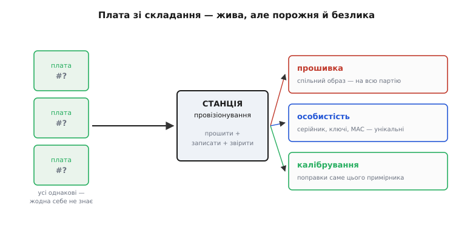
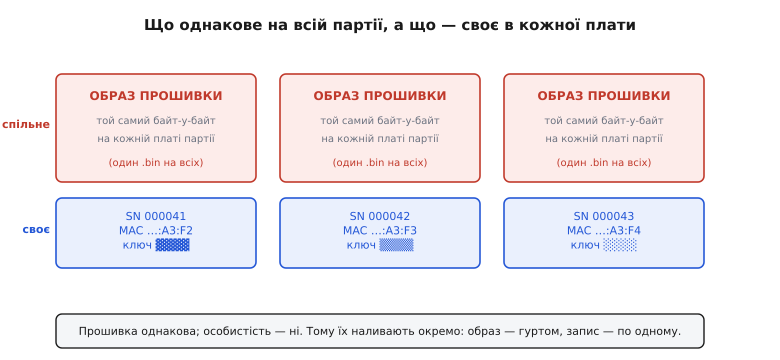
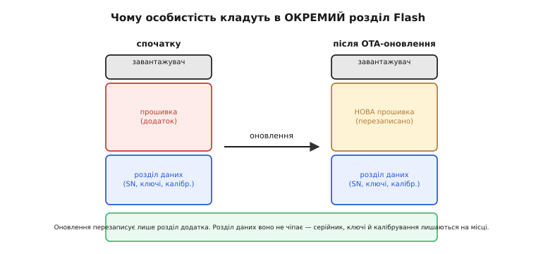
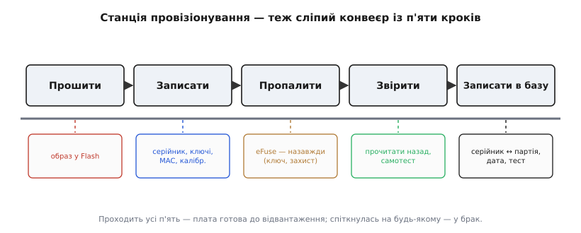

# Заводське прошивання й провізіонування

Ми щойно навчилися робити [плату придатною до складання](root:embedded/dfm-basics): панель, репери, симетрія тепла — і сліпий конвеєр повертає партію однакових, електрично живих плат. Але візьми в руки одну з них — і одразу видно, що вона ще не виріб. У ній порожній Flash: жодного байта прошивки. Вона не знає, хто вона: серійного номера немає, ключів немає, MAC-адреси немає. І вона ще не змірялась зі світом: калібрувальних поправок для свого давача в ній теж немає. Плата жива, але **порожня й безлика** — тисяча однакових болванок, які поки що вміють лише споживати струм.

Останній крок від болванки до виробу — залити в кожну плату те, чого їй бракує: **прошивку, особистість і калібрування**. Зробити це для однієї плати на столі — дрібниця: під'єднав програматор, натиснув «залити», вписав серійник рукою. Але ми говоримо не про одну плату, а про **партію**. І тут повторюється рівно той самий вододіл, що й у DFM: те, що легко зробити розумною рукою для однієї, стає задачею для сліпого конвеєра, коли їх тисяча. Наливання прошивки й даних у кожну плату серії — це і є **заводське провізіонування** (англ. *provisioning*, від лат. *providere* — «завбачити, спорядити наперед»): спорядити виріб усім, з чим він поїде до замовника, — не рукою по одній платі, а станцією, що робить це однаково й повторювано над усіма.

*Плата зі складання жива, але не знає ні коду, ні себе. Станція провізіонування наливає в кожну три різні за природою речі: прошивку (однакову на всю партію), особистість (унікальну для кожного примірника) і калібрування (поправки саме цього екземпляра). Розрізнити ці три — половина розуміння теми.*

## Не плутати з провізіонуванням у полі

Слово «провізіонування» вже траплялось нам — і зовсім в іншому місці. Коли ми вчили пристрій [уперше знайомитися з домашньою мережею](root:embedded/device-provisioning), він теж «провізіонувався»: користувач через SoftAP чи BLE передавав йому назву й пароль Wi-Fi. Легко змішати ці два, бо слово одне, — а речі різні за часом, місцем і тим, хто це робить.

Провізіонування **в полі** робить **користувач після продажу**, у себе вдома, і кладе в пристрій **свої дані** — до якої саме мережі під'єднатися. Ці дані наперед невідомі: виробник не знає, як зветься Wi-Fi у сусіда. Провізіонування **на заводі** робить **виробник до продажу**, на конвеєрі, і кладе в пристрій **дані самого пристрою** — прошивку, серійний номер, ключі, калібрування. Ці дані виробник знає й контролює повністю. Одне готує пристрій **бути собою**; друге — згодом **влитися в чуже оточення**. Далі мова лише про перше — заводське.

## Три різні речі в одну плату

Ключ до всієї теми — побачити, що «залити прошивку» насправді розпадається на **три наливання різної природи**, і плутати їх коштує дорого. Розгляньмо кожне окремо, бо в кожного свій закон.

**Прошивка — спільна.** Образ коду (*firmware image* — той самий `.bin`) на всій партії **однаковий байт-у-байт**. Тисяча плат отримує одну й ту саму прошивку. Це найлегша частина: один файл, тиражований гуртом. Саме тому, до речі, ми в DFM так дбали про [страпи ревізії](root:embedded/dfm-basics) — щоб один образ підходив усім ревізіям плати, а не тримати десяток різних `.bin` і плутати їх на заводі.

**Особистість — унікальна.** А от **хто ця конкретна плата** — річ протилежна: у кожної своя. Серійний номер `000041`, `000042`, `000043`… MAC-адреса, унікальна на весь світ. Криптографічні ключі й сертифікат, якими саме ця плата доводитиме серверу, що вона справжня. Двох однакових особистостей бути не може — інакше два вироби в мережі виявляться одним, і все розсиплеться. Це найтонша частина: те, що **мусить відрізнятися** в кожному примірнику партії.

**Калібрування — унікальне за значенням.** Кожен давач трохи інший через розкид виробництва: цей акселерометр показує 0.02 g на нерухомому столі, сусідній — 0.05 g. Поправки, що виправляють саме цей примірник давача, теж лягають у плату на заводі. За природою це ближче до особистості (своє в кожної плати), а виникає з окремого [обряду калібрування](root:embedded/calibration-procedure), який ми вже розбирали.

*Один образ прошивки лягає на кожну плату незмінним. А запис особистості — серійник, MAC, ключ — у кожної свій. Тому наливають їх окремими діями: образ можна лити гуртом однаковим, а запис доводиться формувати по одному для кожної плати.*

> 🔧 **Навіщо це.** Якби все було однакове, провізіонування зводилося б до «залий один файл у тисячу плат» — і не варте було б окремої розмови. Уся складність теми росте з того, що частина даних **мусить відрізнятися** в кожному примірнику. Це змінює конструкцію станції: вона не просто копіює образ, а для кожної плати ще й **добуває унікальний запис, зашиває його й перевіряє, що зашився правильно**. Переплутав два серійники місцями — і в базі назавжди бреше, який виріб де.

## Як прошивка потрапляє в плату на конвеєрі

Почнімо з найлегшого — образу коду. На столі ми заливаємо його [прямо в чип по одному дроту](root:embedded/esptool-workflow) через режим прошивки. На конвеєрі ідея та сама, змінюється лише те, **як дотягнутися** до чипа, коли він уже впаяний у плату й ти не тримаєш його в руці.

Найпряміший спосіб — **прошити чип ще до того, як його впаяли**. Виробник чипів (або окрема фірма) заливає образ у пам'ять партії мікросхем на **груповому програматорі** (*gang programmer* — «груповий», бо шиє багато корпусів за раз), і на конвеєр уже їдуть заповнені чипи. Плата зі складання виходить одразу з прошивкою. Просто й швидко, але негнучко: змінив образ — треба перепрограмовувати склад чипів, а не перешити готові плати.

Гнучкіший і найпоширеніший у малій серії спосіб — **прошити чип уже впаяним, прямо на платі** (*in-circuit programming*, «прошивання в схемі»). Тут у гру входить те, про що ми думали ще в DFM, коли лишали [доступні голкам контрольні точки](root:embedded/dfm-basics): станція притискає до плати підпружинені голки, дотягується ними до виводів прошивання — і заливає образ так само, як програматор на столі. Дотягтися можна двома дорогами, і обидві нам уже знайомі:

- через [**завантажувач**, зашитий у чип](book:programming/bootloader): плату на мить уводять у режим прошивки, і байти течуть у Flash по UART чи USB — тим самим шляхом, що й [esptool на столі](root:embedded/esptool-workflow);
- через [**JTAG чи SWD**](root:embedded/jtag-swd-tools) — окремий апаратний канал прямо в нутро процесора, яким можна писати Flash навіть тоді, коли жодної прошивки в чипі ще немає.

Різниця між ними — та сама, що ми вже проводили, коли [вивчали ці канали](root:embedded/jtag-swd-tools): завантажувач простіший і потребує менше ліній, зате сам мусить уже бути в чипі; JTAG/SWD не залежить від жодного коду в пам'яті й тому бере навіть чистий, «свіжий з фабрики» кристал. На заводі часто саме тому й обирають JTAG/SWD для найпершого заливання: чип приходить порожній, і завантажувача в ньому ще нема.

> 🔧 **Навіщо це.** Ось де окупається кожна контрольна точка, яку ти завбачливо вивів на плату під час розводки. Немає доступного голці майданчика на лінії SWD або на кнопці режиму прошивки — і станція фізично не має за що вхопитися, щоб залити образ. Плату доводиться шити «на весу» через тимчасові дротики, а це вже не конвеєр, а знову розумна рука. Провізіонування закладають **ще в розводці**, лишаючи станції за що зачепитися, — так само, як виготовність.

## Де живе особистість, щоб пережити оновлення прошивки

Тепер найтонше питання архітектури, і воно не про залізо, а про **розкладку пам'яті**. Куди покласти серійний номер, ключі й калібрування?

Спокуслива відповідь — «зашити просто в код». Але вона хибна, і причину видно, щойно згадаєш, що прошивку колись **оновлюватимуть**. Виріб у полі отримає нову версію [через OTA](root:embedded/ota-server) — і якщо особистість лежала всередині образу прошивки, оновлення **перезапише її разом зі старим кодом**. Виріб прокинеться з новою прошивкою й **без свого серійника, без ключів, без калібрування** — тобто мертвий для сервера й безликий. Одне оновлення — і вся партія втратила пам'ять про те, хто вона.

Тому особистість кладуть в **окремий розділ Flash**, фізично відділений від образу прошивки. Пам'ять чипа ділять на області (*partitions* — «розділи»): окремо завантажувач, окремо додаток (образ прошивки), і окремо — **розділ даних** під усе пер-юнітне: серійник, ключі, калібрування. [Оновлення торкається лише розділу додатка](book:programming/flashing) — воно нічого не знає про розділ даних і не чіпає його. Нова прошивка стартує, читає той самий незайманий розділ даних — і знаходить свою особистість на місці.

*Ліворуч — початкова карта пам'яті: завантажувач, прошивка-додаток, окремий розділ даних. Праворуч — після оновлення: перезаписано лише розділ додатка, розділ даних оновлення не торкнулося. Саме тому особистість переживає будь-яку кількість оновлень: вона живе не в коді, а в розділі, який код не переписує.*

> 🔧 **Навіщо це.** Це те правило, за порушення якого платять уже в полі, коли партія давно продана. Поклав серійник чи калібрування всередину образу — і перше ж OTA стирає їх на всьому парку пристроїв разом. Виправити це віддалено вже нічим: даних немає, а нових узяти нізвідки. Тому розділ даних відокремлюють від коду **на самому початку**, коли тільки розкладають пам'ять, — і провізіонування пише саме в нього.

## Особистість: серійний номер і MAC

Найпростіша частина особистості — **серійний номер**: просто число, унікальне в межах твого виробництва, яке росте від плати до плати. Станція бере наступне вільне число з лічильника, зашиває його в розділ даних і одразу записує в **базу даних** пару «серійник ↔ ця плата». Ця база — окрема тиха цінність провізіонування, до неї повернемось.

Цікавіша — **MAC-адреса** (англ. *Media Access Control address* — «адреса керування доступом до середовища»), бо вона мусить бути унікальна не в межах твого заводу, а **на весь світ**: два пристрої з однаковим MAC в одній мережі конфліктують непоправно. Як гарантувати світову унікальність, коли виробників тисячі й вони не змовляються? Відповідь — [проста й давня схема з централізованим реєстром](root:embedded/factory-provisioning/hist-mac-address.md), яку варто знати, бо на ній стоїть уся Ethernet- і Wi-Fi-адресація.

MAC — це 48 біт, розбитих навпіл. Старші 24 біти — **OUI** (англ. *Organizationally Unique Identifier* — «організаційно унікальний ідентифікатор»): блок, який виробник **купує в IEEE** (світового реєстратора), і він закріплений за ним одним. Молодші 24 біти виробник роздає своїм пристроям **як хоче**, аби не повторювались, — це близько 16.7 мільйона (2²⁴) адрес на один куплений блок. Схема працює, бо світова унікальність зводиться до двох простіших: IEEE стежить, щоб OUI не перетнулися між виробниками, а кожен виробник сам стежить, щоб не повторити молодші біти в межах свого блоку. (Це усталений факт, закріплений у стандартах IEEE.)

На щастя, для чипів курсу цей клопіт часто вже знято за тебе. Espressif купила свій OUI в IEEE й **пропалює унікальну базову MAC-адресу в кожен ESP32 ще на власній фабриці** — вона лежить у незмінному апаратному записі (eFuse) прямо в кристалі, а адреси для Wi-Fi і Bluetooth чип виводить із неї, додаючи одиницю до останнього байта. (Це підтверджено документацією Espressif.) Тобто твоя плата на ESP32 приходить зі складання вже з легальною світовою MAC-адресою, і провізіонувати її окремо не треба. Свій MAC доводиться зашивати лише тоді, коли або чип не має заводського (простіші мікроконтролери), або ти хочеш свій фірмовий OUI, — тоді власну адресу з купленого блоку пропалюють на станції в окремий запис чипа.

## Секретна особистість: ключі й корінь довіри

Серійник і MAC — відкриті: їх можна прочитати, підмінити, підробити. Але щойно виріб має говорити із сервером у полі, постає гостріше питання: **як сервер відрізнить справжній пристрій від підробки чи зловмисника, що вдає твій виріб?** Відповідь — кожна плата носить у собі **секрет**, якого нема ні в кого іншого: приватний криптографічний ключ і **сертифікат** (*certificate* — підписане посвідчення, що цей ключ належить саме цьому виробу). Пред'явити правильний секрет може лише той, у кого він є, — отже, лише справжня плата.

І тут провізіонування торкається безпеки в найчутливішій точці. Секретний ключ **народжується й лягає в плату на заводі** — і завод при цьому мусить бути **довіреним оточенням**: місцем, де ключ можна створити й зашити так, щоб він не витік назовні. Це та сама ідея, з якою ми зустрічалися, коли будували [апаратний корінь довіри](root:embedded/tpm-trustzone): секрет має жити там, звідки його не можна ні прочитати, ні скопіювати.

Куди ж класти секрет, щоб його не вичитали? У звичайному розділі даних йому не місце — звідти його дістане будь-хто, хто зчитає Flash. Тому ключі зашивають у спеціальні **однобічні апаратні комірки — eFuse** (*electronic fuse* — «електронна перепалка»): біти, які пропалюються фізично й **лише раз**, після чого їх не можна ні змінити, ні (для секретних) навіть прочитати ззовні. На ESP32 саме так лягає ключ шифрування Flash: станція пропалює 256-бітний ключ AES у захищений eFuse-блок, і відтоді сам чип шифрує й дешифрує свій Flash цим ключем, а програмно дістати ключ уже не можна — комірка «глуха» назовні. (Це підтверджено документацією Espressif.) Туди ж лягає й відбиток [захищеного завантаження (secure boot)](book:programming/firmware-secure-boot), яким чип перевіряє, що вантажить лише справжню прошивку.

> 🔧 **Навіщо це.** «Пропалюється лише раз» — не деталь, а закон, за яким на станції немає права на помилку. Пропалив eFuse — назад не відкотиш: зіпсував біт, зашив не той ключ, увімкнув захист зарано — і плата або мертва, або назавжди зачинена. Тому пропалювання eFuse на конвеєрі роблять **в останню чергу і тільки звіривши все інше**: спершу переконатися, що прошивка залилась, запис особистості записався й прочитався правильно, самотест зелений, — і лише тоді робити необоротний крок. Порядок кроків станції — не примха, а страховка від необоротної помилки на тисячі плат.

## Станція провізіонування — теж сліпий конвеєр

Зберімо все докупи. Станція провізіонування — це, за духом, така сама сліпа станція, як чотири станції складання з DFM: до неї заходить порожня плата, з неї виходить готова, і вона робить над кожною **однакову послідовність кроків без жодної розумної руки**. Тільки кроки тут не механічні, а інформаційні.

*Станція проводить кожну плату тими самими п'ятьма кроками. Необоротне пропалювання eFuse стоїть аж третім — після заливання й запису, які ще можна переробити, і перед звіркою, яка ловить брак. Останній крок — запис у базу — робить кожну плату відстежуваною назавжди.*

Порядок кроків не випадковий, кожен спирається на попередній:

**Прошити образ** у Flash — спільний `.bin` на всю партію, [через SWD або завантажувач](root:embedded/jtag-swd-tools).

**Записати особистість** у розділ даних — узяти наступний серійник із лічильника, потрібні поправки [калібрування](root:embedded/calibration-procedure), за потреби згенерувати ключ, — і зашити цей запис у відведений розділ.

**Пропалити eFuse** — необоротний крок (ключ шифрування, secure boot). Стоїть після оборотних навмисне: усе, що можна переробити, вже зроблено, лишилось те, що переробити не можна.

**Звірити** — прочитати назад те, що зашив, і дати платі виконати самотест: чи стартувала прошивка, чи бачить вона свій серійник, чи відповідають давачі. Це вже майже [тест-джиг](root:embedded/test-jig-design) — і недарма: на практиці станція провізіонування й тестовий стенд часто **одне й те саме пристосування** з тими самими підпружиненими голками. Спершу залили й зашили — тут же й перевірили, не знімаючи плати.

**Записати в базу** — зберегти в базі даних, що серійник такий-то зійшов з конвеєра тоді-то, з такої партії, з такими результатами тесту. Це **відстежуваність** (*traceability*): коли за пів року повернеться виріб `000042` з дефектом, ти по базі піднімеш, коли й з якої партії він вийшов, чи проходив тест, — і зрозумієш, чи це поодинокий випадок, чи хвороба всієї партії.

Як саме плата **читає свою особистість на старті** — і як переконується, що розділ даних не порожній і не побитий, — має власну ланку. Розберімо це кодом: [структура запису провізіонування, магічне число, версія, контрольна сума й перевірка «а чи взагалі ця плата провізіонована»](root:embedded/factory-provisioning/proj-provision-record.md) винесені окремо з робочим C, щоб не роздмухувати тут головну нитку. Суть, яку тримаємо в голові: прошивка на старті **не вірить**, що особистість на місці, а щоразу **перевіряє** — і поводиться по-різному, якщо запис є або якщо його немає.

## Куди далі

Отже, останній крок від болванки до виробу — не магія, а ще один сліпий конвеєр: станція наливає в кожну плату **прошивку** (спільну на всіх), **особистість** (унікальну — серійник, MAC, ключі, і то так, щоб вона пережила майбутні оновлення в окремому розділі) і **калібрування** (поправки саме цього примірника), а тоді **звіряє й записує в базу**, роблячи кожну плату відстежуваною. Ключова думка, яку варто винести: провізіонування — це не «залив прошивку», а обряд надання виробу власної особистості, і найтонше в ньому — те, що частина даних **мусить бути унікальною** й **пережити оновлення коду**.

Ми кілька разів упирались у те, що станція мусить не лише залити й зашити, а й **переконатися, що плата справді працює**, — притиснути голки до контрольних точок і зміряти, чи все живе. Це вже окреме пристосування зі своєю конструкцією й своєю логікою — [тест-джиг](root:embedded/test-jig-design), яким ми й займемося далі: як побудувати стенд, що за секунди каже про кожну плату партії «жива» чи «в брак» — і робить це так само сліпо й повторювано, як усе на конвеєрі.
