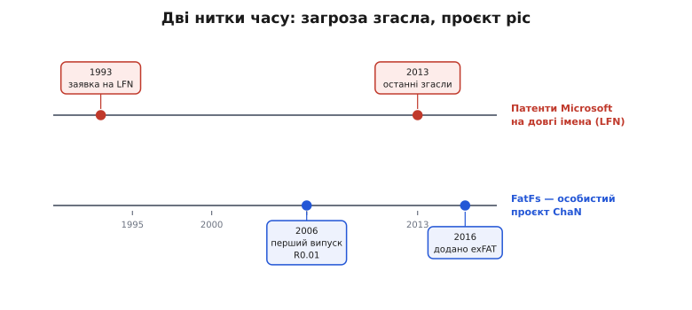

# 📜 ChaN і FatFs: як одна людина дала всім дрібним системам файли

Коли в [попередньому розборі](root:embedded/fatfs-integration) ми вмонтовували FatFs у прошивку — писали diskio, монтували том, ловили момент скидання кешу, — за лаштунками весь час був код, який ми приймали як даність. Він просто є, він перевірений, він влазить у будь-який чип. Та хтось же його **написав** — і не корпорація з відділом файлових систем, а одна людина, на власному сайті, у вільний час. Це історія про те, як модуль, що його сьогодні носять усередині мільярди пристроїв, виявився **особистим проєктом** японського інженера-аматора — і чому світ дрібних систем спокійно поклався на одну людину там, де великі компанії наймають команди.

Історія тут важлива не заради дат. Вона пояснює **дивну тишу** навколо FatFs: чому в нього немає корпоративного власника, немає платних версій «Pro», немає юридичних застережень дрібним шрифтом — і чому ви можете покласти його у комерційний продукт, нікого не питаючи. Усе це не випадковість, а наслідок конкретних рішень конкретної людини. Тож почнімо з неї.

## Хто такий ChaN

За FatFs стоїть інженер, відомий під псевдонімом **ChaN** (チャン). Він майже не показує справжнього імені — у мережі живе саме «ChaN з ELM», — тож і ми чесно скажемо: **публічно особа відома під псевдонімом**; за матеріалами його ж сайту й вільних енциклопедій це інженер вбудованих систем із Японії. Це не корпорація і не стартап, а одна людина, що десятиліттями веде особистий технічний сайт **ELM** (`elm-chan.org`) — розсип проєктів, написаних, як він сам це подає, інженерами для інженерів: саморобні програматори, аудіоплеєри на крихітних чипах, бібліотеки, статті. FatFs — найвідоміший серед них, але далеко не єдиний.

> 🔧 **Навіщо це.** Те, що автор — приватна особа, а не фірма, прямо впливає на ваш проєкт. Немає вендора, який завтра «закриє» бібліотеку, перепродасть її чи зробить платною; немає ризику, що умови ліцензії раптом зміняться під новим власником. Натомість є один сайт, з якого роками беруть еталонний код, і дуже передбачувана, скупа на сюрпризи поведінка. Для прошивки, яку ви закладаєте на десятиліття, ця передбачуваність вартує більше, ніж гучне ім'я.

Чому взагалі **одна** людина взялася за те, на що великі системи відряджають команди? Бо задача, попри страшну репутацію, **скінченна**. Формат FAT давній і добре задокументований; його не треба винаходити — треба ретельно, без помилок, **відтворити** в компактному коді. Це праця радше на акуратність і дисципліну, ніж на дослідницький прорив. А ще — та сама межа «логіка / залізо», на якій ми будували [тестовність прошивки](root:embedded/firmware-testing): ChaN свідомо відрізав від модуля **все** залізо, лишивши тонкий шов diskio. Завдяки цьому одна людина могла довести до пуття **формат**, а нескінченну різноманітність носіїв віддати тим, хто з тим залізом працює. Розумне обмеження обсягу — ось що зробило поодиноку працю взагалі можливою.

## Лютий 2006-го: модуль виходить у світ

FatFs відкрито доступний **з 2006 року**. Тут варто бути точним, бо в обігу гуляють дві дати. Сам автор у списку версій датує **перший випуск, R0.01, 29 квітня 2006 року** — це найраніша позначена дата в його ж changelog. Часто кажуть і ширше — «з початку 2006-го», «з лютого 2006-го»; це узгоджується з тим, що проєкт з'явився саме того року, але **документально засвідчена** найрання точка — це квітневий R0.01.

> Статус доказовості: дата R0.01 (29.04.2006) — **підтверджено** прямо в офіційному списку версій FatFs на `elm-chan.org`. Формулювання «з початку/лютого 2006» — **правдоподібне й сумісне** з цим, але точну позначку дає саме квітневий перший випуск.

Від того дня модуль ріс маленькими, обережними кроками — R0.02, R0.03 і далі, рік за роком, без гучних «мажорних» стрибків і без зламів сумісності на рівному місці. Саме ця **повільна, акуратна тяглість** і виплекала довіру: коли бібліотеку п'ятнадцять років веде та сама рука в тому самому дусі, інтегратори перестають боятися, що завтрашнє оновлення зруйнує їхню збірку.


*Дві нитки часу поряд. Угорі — патентна історія довгих імен (LFN): заявка Microsoft 1993 року, останні патенти згасають 2013-го. Унизу — життя FatFs: перший випуск R0.01 у 2006-му, підтримка exFAT у 2016-му. Загроза, що колись нависала над довгими іменами у FAT, тихо розчинилася приблизно тоді, коли модуль уже став стандартом.*

## Ліцензія на одне речення: чому FatFs можна класти в комерцію

Найдивніше у FatFs — не код, а **умови**, на яких його віддають. Це не GPL із її вимогою відкривати власну прошивку, не «безкоштовно для некомерційного», не тримісячний пробний період. Ліцензія FatFs — коротка, у дусі **BSD**, і вкладається фактично в одну змістовну вимогу. Ось її серце дослівно, з шапки вихідного коду (переклад наш, з технічним збереженням):

```
Copyright (C) 20xx, ChaN, усі права застережено.

FatFs — програмне забезпечення з відкритим кодом. Поширення й використання
FatFs у вихідній чи двійковій формі, зі змінами або без, дозволено за умови,
що виконано таку вимогу:

1. Поширюючи вихідний код, треба зберегти наведене вище повідомлення
   про авторські права, цю умову й застереження нижче.

Це ПЗ надається власником авторських прав «ЯК Є», і будь-які гарантії щодо
нього ВИКЛЮЧАЮТЬСЯ. Власник прав і дописувачі НЕ НЕСУТЬ відповідальності
за будь-яку шкоду, спричинену використанням цього ПЗ.
```

Прочитаймо це інженерним оком, бо саме звідси випливає вся свобода. Вимога **рівно одна**: при поширенні **вихідного коду** збережіть текст про авторство й застереження. Усе. Немає вимоги відкривати **свій** код; немає заборони на **комерцію**; немає роялті. Якщо ви постачаєте лише прошивку у двійковому вигляді (а так роблять майже всі вбудовані продукти) — формально на вас не лягає навіть та єдина умова про вихідні тексти. Тобто FatFs можна взяти, вкомпонувати в комерційний прилад, продати — і нічого нікому не винні. Сам автор формулює дух так: це вільне ПЗ, відкрите для навчання, досліджень і розробки, і ви можете використовувати, змінювати й поширювати його **для будь-якої мети без обмежень, під власну відповідальність**.

> 🔧 **Навіщо це.** Ліцензія — не юридична формальність наприкінці, а **перше**, на що дивиться інженер, обираючи бібліотеку у продукт. GPL у прошивці означала б обов'язок відкрити власний код — для комерційного приладу це часто неприйнятно. BSD-дух FatFs знімає це питання повністю: інтегруйте й продавайте. Саме ця ліцензія — а не лише технічні чесноти — зробила FatFs стандартом: вендори чипів спокійно кладуть його у свої SDK, а ви — у свій виріб, не наражаючись на юридичний клопіт. Єдине, що варто зробити чесно й завжди: **зберегти повідомлення про авторство** у вихідних текстах, які поширюєте.

Зверніть увагу й на застереження «ЯК Є»: жодних гарантій. Для аматорського проєкту це не відмовка, а тверезість — одна людина не може юридично відповідати за роботу свого коду в чужому кардіостимуляторі. Тому в критичних системах FatFs усе одно ретельно тестують під свою задачу; ліцензія прямо нагадує, що відповідальність — на тому, хто застосовує.

## Від FAT12 до exFAT — і Petit FatFs для зовсім крихітних

Технічно FatFs не застиг у 2006-му. Він пройшов усю родину FAT: спершу **FAT12 і FAT16** (формати ще дискет і дрібних карток), далі **FAT32** (великі томи), а у версії **R0.12 (12 квітня 2016 року)** додав підтримку **exFAT** — наступника FAT для карток на десятки й сотні гігабайтів, де старого FAT32 уже тісно. Пізніше, у **R0.14 (14 жовтня 2019-го)**, дійшла черга й до 64-бітної адресації секторів та таблиць розділів GUID — те саме `LBA_t`, на яке ми натрапляли в сигнатурі `disk_read`. Тобто той самий шов diskio, що ми писали, з роками лише розширювали, не ламаючи.

Та найвиразніше інженерну ощадливість ChaN показує **окремий** проєкт — **Petit FatFs** («дрібний FatFs»). Це навмисно обрізана версія для чипів, де навіть скромні 2–10 кБ ОЗП повного FatFs — недозволена розкіш. Скільки коштує Petit? Робоча область — **близько 44 байтів** ОЗП (саме байтів, не кілобайтів) плюс трохи стека, а код — лічені **кілобайти**. За це доводиться платити обмеженнями: один том, один відкритий файл за раз, читання потоком, а запис — із суттєвими обмеженнями (не можна, скажімо, вільно створювати чи нарощувати файли). Petit націлений на зовсім малечу — чипи з ОЗП **менше 512 байтів**, дрібні AVR і PIC, тісні завантажувачі в boot-ROM.

Сама поява Petit FatFs — це маленький урок інженерного мислення. Замість роздувати один модуль перемикачами «на всі випадки» ChaN зробив **другий, окремий** інструмент під радикально інший бюджет пам'яті. Це та сама думка, що веде нас крізь увесь курс: **за все треба платити пам'яттю**, тож інструмент має точно відповідати бюджету чипа, а не намагатися бути всім одразу.

## Окрема історія: патенти Microsoft на довгі імена

Тут варто розплутати юридичний вузол, який довго лякав усіх, хто торкався FAT, — і про який ми коротко згадали, [вмикаючи довгі імена в ffconf.h](root:embedded/fatfs-integration). FAT у первісному вигляді знав лише короткі імена формату **8.3** (`LOG_0001.CSV`). Довгі імена (англ. *Long File Name*, **LFN**) — як-от `вимірювання-2026.csv` — додала Microsoft у Windows 95 хитрим прийомом: довге ім'я ховається в додаткових записах каталогу поряд зі звичним коротким. І саме на цей **механізм співіснування** довгих і коротких імен Microsoft отримала патенти.

Розберімо факти по кісточках, бо тут легко наплутати.

- **Що запатентували.** Серцевина — спосіб тримати **спільний простір імен** для довгих і коротких назв в одному каталозі FAT. У США це родина патентів, серед них **US 5 579 517**, **US 5 745 902**, **US 5 758 352** і **US 6 286 013**, усі з пріоритетом **1 квітня 1993 року**.
- **Чи були спроби їх скасувати.** Так. Публічна патентна фундація (*Public Patent Foundation*) 2004 року подала до патентного відомства США докази проти патенту '517 з посиланнями на ранішні роботи; відомство спершу **відхилило** його претензії, але 2006-го після перегляду визнало рішення Microsoft «новим і неочевидним» і патент **поновило**. У Європі ж німецький Федеральний патентний суд 2013 року **визнав недійсною** німецьку частину спорідненого патенту EP0618540; після відкликання апеляції це рішення стало остаточним **28 жовтня 2015 року**.
- **Чим це скінчилося для розробника.** Головне: **усі ті американські LFN-патенти вже згасли** — за єдиним 20-річним строком від пріоритету 1993 року їхній час вийшов **близько 2013-го** (наприклад, для US 6 286 013 розрахункова дата завершення — **1 квітня 2013 року**). Простими словами: юридичної перепони, через яку колись вагалися вмикати довгі імена у FAT, **більше немає**.

> Статус доказовості: пріоритет 1993-04-01 і згасання американських LFN-патентів **близько 2013 року** — **підтверджено** (Google Patents для US 6 286 013; огляд патентів FAT у Вікіпедії, де всі чотири позначені як «expired since 2013»). Перебіг із Public Patent Foundation (відхилення 2004 → поновлення 2006) і остаточність німецького рішення 28.10.2015 — **підтверджено** статтею про довгі імена у Вікіпедії. Конкретні дати завершення кожного окремого патенту до дня різняться між джерелами — але **спільний висновок однозначний**: до середини 2010-х усі вони згасли.

Тож практичний підсумок для нашого ffconf.h саме той, що ми вже зробили: вмикати LFN сьогодні можна **без юридичного остраху** — лишилася тільки технічна ціна в пам'яті (таблиці перекодування символів і роздутий код), про яку ми й говорили. Патент відлякував колись; нині відлякує **байт**.

І щоб не плутати: **exFAT — окрема історія, не плутайте її з LFN.** Тут патенти Microsoft чинні й сьогодні, тож автоматичної «свободи через згасання», як із довгими іменами, немає. Але 2019 року Microsoft **опублікувала специфікацію exFAT** і віддала відповідні патенти під захист спільноти **Open Invention Network** (оголошено 28 серпня 2019-го) — саме після цього exFAT увійшов у ядро Linux. Для вас, користувача FatFs, із цього випливає просте розрізнення: код самого FatFs лишається під своєю вільною BSD-подібною ліцензією, а ось **формат** exFAT — це вже патентна територія Microsoft, відкрита для відкритих реалізацій, але влаштована інакше, ніж давно згаслі LFN-патенти. *(Статус доказовості: публікація специфікації exFAT і передача патентів до OIN 28.08.2019 — **підтверджено** оголошенням Open Invention Network та повідомленнями того ж дня.)*

## Що з цього винести

Якщо стиснути цю історію в одну думку, вона така: **FatFs — рідкісний приклад того, як акуратність однієї людини стала надійним фундаментом для цілої галузі.** Не корпорація з гарантіями, не консорціум зі стандартом — приватний інженер під псевдонімом, який від 2006 року веде свій модуль у тому самому скупому, передбачуваному дусі й роздає його під ліцензію, що не заважає нікому, навіть тим, хто на ньому заробляє.

Для нас, коли ми наступного разу напишемо `f_open`, із цього випливає три дуже земні речі. По-перше, можна **спокійно класти FatFs у комерційний продукт** — ліцензія цього не забороняє, треба лише зберегти повідомлення про авторство у вихідних текстах, які поширюєте. По-друге, **довгих імен більше не варто боятися юридично** — старі патенти Microsoft на LFN згасли, лишилася тільки ціна в пам'яті, якою ми керуємо через ffconf.h. І по-третє, якщо чип геть крихітний, є **окремий інструмент під його бюджет** — Petit FatFs, бо й тут діє наскрізне правило курсу: інструмент має точно лягати на бюджет пам'яті, а не намагатися бути всім одразу. Перевірений роками код, чесна ліцензія й тверезий вибір під розмір чипа — ось що ховається за непримітним рядком `#include "ff.h"`.
