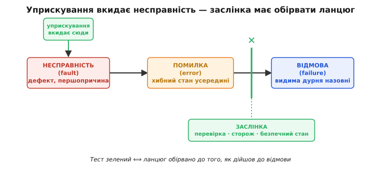
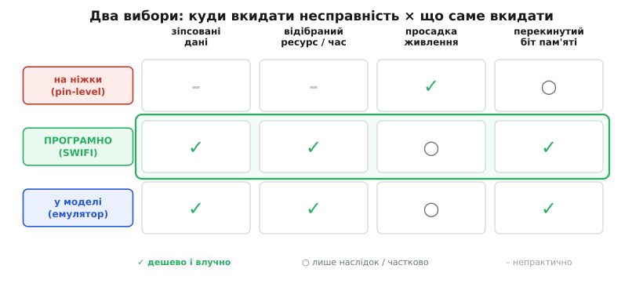
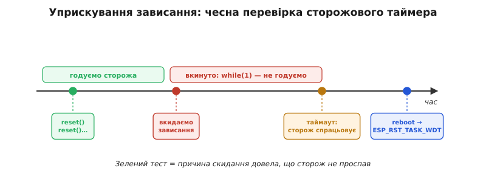

# Тестування відмовостійкості: fault injection

Коли ми будували [піраміду тестів прошивки](root:embedded/firmware-testing), мокам дісталась окрема похвала: вони вміють **наказати** давачеві повернути дурню — `−999`, таймаут, обрив — і так перевірити шлях помилки, який у полі не виманиш на замовлення. Це вже половина потрібної звички. Друга половина — питання, яке мок наодинці не закриває: а що, як поламається не давач за швом, а **щось усередині самої системи**? Просяде живлення посеред запису у Flash. Застрягне задача й не віддасть процесор. Космічна частинка перекине біт у комірці пам'яті. На такі біди мок безсилий — вони не приходять через інтерфейс, який можна підмінити.

І ось у чому пастка. На кожну таку біду в добрій прошивці є **код-рятувальник**: обробник [просадки живлення](topic:programming/brownout), [сторожовий таймер](topic:programming/watchdog), що перезапустить завислий пристрій, перевірка контрольної суми, що зловить зіпсований кадр. Цей код — найважливіший у системі, бо саме він стоїть між дрібним збоєм і катастрофою. І він же — **найменш випробуваний**, бо спрацьовує найрідше: місяцями лежить без діла й оживає в найгіршу мить — коли вже щось пішло не так. Код, який ніколи не бігав, — це не захист, а **здогад про захист**. А [посмертний аналіз](root:embedded/core-dump) розповість, що рятувальник не спрацював, лише **після** того, як пристрій уже впав у полі.

Вихід один: не чекати на справжню біду, а **влаштувати її навмисне** — у себе на столі, під контролем — і подивитися, чи рятувальник прокинувся. Цю техніку звуть **уприскуванням відмов** (англ. *fault injection* — буквально «впорскування несправності»): ти сам, навмисне, вносиш у працюючу систему збій і спостерігаєш, чи вона його переживе. Не «чи працює, коли все добре» — це перевіряють звичайні тести. А **«чи виживає, коли стало погано»**.

## Три слова, які легко сплутати: несправність, помилка, відмова

Щоб говорити про відмовостійкість точно, треба спершу розчепити три поняття, які в побуті звучать як синоніми, а в інженерії означають **різні ланки одного ланцюга**. Цей поділ устоявся в класичній праці Авіжієніса й колег про надійність обчислень, і він — не педантизм, а сама суть того, що ми робитимемо.

- **Несправність** (англ. *fault*) — першопричина, дефект: перекинутий біт, обірваний дріт, помилка в рядку коду, просадка напруги. Несправність може **дрімати** скільки завгодно, нікому не шкодячи.
- **Помилка** (англ. *error*) — несправність, що **прокинулась**: внутрішній стан системи став хибним. Перекинутий біт перетворив число `100` на `228`; покажчик став `NULL`. Стан уже неправильний, але назовні це ще могло не вилізти.
- **Відмова** (англ. *failure*) — помилка **дійшла до виходу**: пристрій зробив видиму дурню. Видав хибний вимір, смикнув не той вихід, завис, перезавантажився.

Ланцюг завжди той самий: **несправність → помилка → відмова**. І тут — головна думка всієї теми. Відмовостійка система **рве цей ланцюг** десь посередині: ловить помилку, поки та не доросла до відмови. Перевірка контрольної суми ловить зіпсований кадр (несправність уже є, помилку зловлено — відмови нема). Сторожовий таймер перезапускає завислу задачу (помилка є, але замість відмови — контрольоване відновлення).

Тепер видно, чим саме займається fault injection: ти **вкидаєш несправність** на одному кінці ланцюга й дивишся, **де він обірветься**. Обірвався на «помилці», не дійшовши до «відмови», — рятувальник спрацював, тест зелений. Доповз до видимої відмови — у захисті діра, і ти знайшов її **в себе на столі**, а не у клієнта.


*Уприскування вносить несправність на лівому кінці ланцюга. Без захисту вона дозріває в хибний стан (помилку) і доростає до видимої відмови. Відмовостійка система ставить «заслінку» — перевірку, сторож, безпечний стан — що обриває ланцюг раніше. Тест відповідає на одне питання: чи спрацювала заслінка, чи несправність дійшла до кінця.*

> 🔧 **Навіщо це.** Ці три слова — не словник заради словника, а **карта, куди ставити заслінку**. Перш ніж писати рятувальник, спитай: на якій ланці я рву ланцюг? Ловлю несправність на вході (перевірка даних), чи помилку в стані (контроль цілісності), чи гашу відмову на виході (безпечний стан, перезапуск)? А fault injection потім **доводить**, що заслінка справді стоїть там, де ти думаєш, і справді тримає.

## Два питання: куди вкидати і що саме

Будь-яке уприскування зводиться до двох рішень — **куди** внести несправність і **що** саме внести.

**Куди.** Історично є три рівні. Найстаріший — **на ніжки заліза** (англ. *pin-level*): фізично притиснути вивід до землі чи живлення, навести перешкоду, на мить обірвати напругу. Реалістично до краю, але потрібен стенд і жива плата, а вкинути можна лише грубе. Найгнучкіший і найходовіший у прошивці — **програмний** (англ. *software-implemented fault injection*, SWIFI): сам код, у потрібну мить, псує змінну, регістр, значення, що повертає функція. Дешево, точно, повторювано — і саме на ньому ми зосередимось. Третій — **у моделі** на симуляторі чи [емуляторі](root:embedded/firmware-testing/proj-emulators.md): псуємо стан віртуального чипа ще до того, як приїхало справжнє залізо.

**Що.** Тут вибір диктує сама природа бід, на які ми готуємо рятувальників. Корисно тримати в голові коротку решітку типових несправностей — кожна відповідає реальному фізичному лиху:


*Два незалежні вибори. Рядки — рівень уприскування: на ніжки (реалістично, але грубо й треба стенд), програмно (дешево, точно, повторювано), у моделі (ще до заліза). Стовпці — клас несправності: зіпсовані дані, відібраний ресурс чи час, просадка живлення, перекинутий біт пам'яті. Програмний рівень бере на себе майже всю решітку — тому з нього й починають.*

Пройдімо по класах несправностей із робочим кодом — бо саме код показує, як дешево це коштує насправді.

### Зіпсовані дані: продовження ідеї мока

Найпростіше уприскування — пряме продовження того, що моки вже робили зі швом. Тоді ми підміняли **зовнішнє** джерело; тепер псуємо значення **всередині** — там, де його неможливо підмінити інтерфейсом. Прийом той самий: точку вкидання ховають за прапорцем компіляції, щоб у бойовій збірці її просто не існувало.

**Приклад (вкинути зіпсований вимір, щоб перевірити обмежувач).** Хай прошивка читає температуру й керує нагрівачем. Десь стоїть рятувальник: якщо вимір поза фізично можливим діапазоном — це збій давача, нагрівач негайно вимкнути. Як переконатися, що цей рятувальник справді тримає? Вкинути неможливий вимір просто в потоці даних:

```c
int16_t read_temperature(void) {
    int16_t t = adc_to_celsius(adc_read());

#ifdef FAULT_INJECTION
    // вкидаємо несправність: давач «здурів» і віддає неможливе значення
    if (fault_active(FAULT_SENSOR_INSANE))
        t = 850;                    // 850 °C — фізично неможливо для цієї системи
#endif

    return t;
}
```

А тест уже перевіряє не вимір, а **реакцію** на нього — чи обірвався ланцюг до відмови:

```c
fault_enable(FAULT_SENSOR_INSANE);   // озброюємо несправність
control_step();                       // один такт логіки керування
assert(heater_is_off());              // заслінка спрацювала: нагрівач вимкнено
assert(error_flag(ERR_SENSOR));       // і збій зафіксовано, а не проґавлено мовчки
```

Зверни увагу: ми не чекали, поки давач справді згорить. Ми **наказали** системі повірити, що він згорів, — і впевнились, що нагрівач не піде врознос. Той самий клас — зіпсувати кадр на шині перед перевіркою контрольної суми, підмінити значення, що повертає функція, хибним кодом помилки. Скрізь питання одне: чи зловить це заслінка нижче за течією.

### Відібраний ресурс і застрягла задача: перевірка сторожа

Найковарніша біда вбудованої системи — не хибне число, а **зупинка**: задача увійшла в нескінченний цикл, заклинила на занятому м'ютексі, потонула в обробнику переривання й не віддає процесор. Видимої «помилки в даних» нема — система просто **завмерла**. Саме на це ставлять [сторожовий таймер](topic:programming/watchdog): періодично його «годують», а перестали годувати — за кілька секунд він перезавантажить пристрій. Але звідки впевненість, що сторож налаштований правильно, увімкнений на потрібних задачах і справді перезапустить, а не промовчить? Перевірити можна лише одним способом — **навмисне застрягти**.

**Приклад (вкинути зависання, щоб перевірити сторожа).** На ESP-IDF задачу стереже Task Watchdog Timer. Вкидаємо несправність — нескінченний цикл, що перестає годувати сторожа:

```c
void worker_task(void *arg) {
    esp_task_wdt_add(NULL);              // підписали задачу під сторожа

    for (;;) {
        esp_task_wdt_reset();            // «я жива» — годуємо сторожа

#ifdef FAULT_INJECTION
        if (fault_active(FAULT_TASK_HANG)) {
            // вкидаємо несправність: задача застрягла й більше не годує сторожа
            while (1) { /* нічого — імітуємо заклинення */ }
        }
#endif
        do_work();
        vTaskDelay(pdMS_TO_TICKS(100));
    }
}
```

Очікуваний результат — **не** мовчазне зависання, а контрольований перезапуск: за `CONFIG_ESP_TASK_WDT_TIMEOUT_S` секунд сторож спрацює, а з `CONFIG_ESP_TASK_WDT_PANIC` це призведе до паніки й скидання. Після перезавантаження прошивка читає [причину скидання](topic:programming/reset-causes) й бачить `ESP_RST_TASK_WDT` — доказ, що сторож не проспав. Якби тест показав, що пристрій просто завис **навіки** і ніхто його не перезапустив, — ти знайшов би діру в захисті, не виходячи з-за столу. Так само вкидають **нестачу пам'яті** (хай `malloc` поверне `NULL`) чи **переповнення черги** — і дивляться, чи код це переживе, а не впаде слідом.


*Доки задача годує сторожа, усе тихо. Вкинута несправність — `while(1)` — обриває годування; за `CONFIG_ESP_TASK_WDT_TIMEOUT_S` секунд сторож спрацьовує й перезапускає пристрій, а прочитана після старту причина скидання `ESP_RST_TASK_WDT` доводить, що захист не проспав. Без уприскування цей шлях ніколи б не пробігся до справжньої біди в полі.*

> 🔧 **Навіщо це.** Сторожовий таймер — це парашут, який ти пакуєш раз і сподіваєшся ніколи не смикати. Уприскування зависання — це **стрибок із висоти на землю в спорядженні з парашутом-дублером**: єдиний чесний спосіб дізнатися, чи розкриється основний, поки ціна помилки — лише невдалий тест, а не розбитий пристрій. Без цього ти не знаєш, чи захищений, — ти **сподіваєшся**, що захищений.

### Просадка живлення: найгірший момент для запису

Окремий і дуже підступний клас — збій **живлення**. Напруга на мить просіла (хтось смикнув роз'єм, увімкнувся потужний двигун поряд) — і якщо це сталося посеред запису у Flash, дані можуть лишитися наполовину записаними, а файлова система чи конфіг — зіпсованими. На це ставлять детектор просадки ([brown-out](topic:programming/brownout)) і обережні схеми запису. Перевірити їх по-справжньому важко: треба вкинути просадку **точно** в небезпечне вікно. Грубо це роблять на залізі — програмованим джерелом, що роняє напругу на задані мілісекунди. Програмно ж імітують **наслідок**: уривають операцію запису на півдорозі й перевіряють, чи система при наступному старті побачить недописаний стан і відкотиться до справного.

Цей клас найкраще лягає на **верхні шари піраміди** — на справжнє залізо, бо саму фізику просадки мок не відтворить. А наслідок недопису — на хості: розрив транзакції посеред запису перевіряється звичайним тестом без жодної плати.

### Перекинутий біт: коли винна не програма

Найекзотичніша на вигляд, але цілком реальна біда — **перекинутий біт** у пам'яті чи регістрі (англ. *single-event upset*, поодинокий збій від частинки): космічна частинка чи фоновий розпад змінює `0` на `1`. Програма бездоганна, а біт у комірці — вже не той. Для більшості побутових пристроїв це рідкість, якою нехтують; для авіоніки, космосу, медтехніки — розрахунковий ризик, проти якого ставлять [надлишковість](topic:programming/redundancy) і коди корекції. Уприскування тут — єдиний практичний спосіб перевірити захист, бо чекати справжньої частинки можна роками:

```c
#ifdef FAULT_INJECTION
// вкидаємо несправність: перекидаємо один біт у слові пам'яті
void inject_bitflip(volatile uint32_t *addr, uint8_t bit) {
    *addr ^= (1u << bit);            // XOR з маскою одного біта
}
#endif
```

Перекинеш біт у захищеній кодом корекції ділянці — перевіриш, чи код виправив його тихо. Перекинеш у критичній змінній без захисту — побачиш, чи перекинутий покажчик призведе до [апаратного винятку](topic:programming/hardfault), і чи система гідно з нього вийде. У звичайному споживчому пристрої цей клас зазвичай лишають осторонь; згадуємо його, бо він найчистіше показує суть прийому — **внести дефект, проти якого природа не дає чекати**.

## Де це місце в піраміді тестів

Уприскування — не окрема нова піраміда, а **новий клас вмісту** в уже знайомій. Дешеві несправності — зіпсовані дані, обірвані транзакції, хибні коди повернення — лягають у **основу**: звичайні хост-тести, що бігають за секунди на кожну зміну. Несправності, які живуть лише в залізі, — справжня просадка напруги, реальний тайминг спрацювання сторожа, наведена перешкода на ніжку — лишаються **на вершині**, у нечисленних апаратних прогонах. Принцип той самий, що й завжди: масу перевірок роби внизу, нагору винось тільки те, чого інакше не відтворити.

Звідси й практичне правило, **куди не лізти**. Якщо несправність можна вкинути програмно й перевірити на хості — туди їй і дорога; тягти таке на стенд марно. На залізо виносимо лише те, де важить сама фізика: чи справді чип переживе напругу нижче порога, чи встигне детектор просадки, чи не зіб'ється тайминг під реальним навантаженням.

## Дисципліна: як не вистрелити собі в ногу

Сила прийому — у точках вкидання, розсіяних по коду. Вона ж і небезпека: точка, що випадково лишилась активною в бойовій збірці, — це **вбудований саботаж**. Тому правила прості й непорушні.

**Уприскування існує лише в тестовій збірці.** Усі точки — під прапорцем компіляції (`FAULT_INJECTION`), якого в релізі немає; тоді препроцесор просто викидає їх, і в бойовому образі їх **фізично нема**. Жодного «вимкну прапорцем у рантаймі» — лишений у коді, він рано чи пізно ввімкнеться сам.

**Озброюй по одній.** Вкидаєш несправності по черзі, не пачкою: тоді видно, **яка саме** заслінка спрацювала чи не спрацювала. Десяток одночасних несправностей дасть кашу, з якої причини не вичитати.

**Перевіряй відновлення, а не падіння.** Дешева помилка — переплутати ціль. Мета тесту — **не** побачити, що пристрій упав (упасти він і так уміє), а побачити, що він упав **гідно**: зловив помилку, зафіксував її, перейшов у безпечний стан, перезапустився й повернувся до роботи. Тест зелений тоді, коли ланцюг обірвано до видимої відмови, — а не коли «ну, перезавантажилось якось».

**Автоматизуй.** Як і решта тестів, уприскування розкриває силу, коли біжить **саме**, на кожну зміну, у [безперервній інтеграції](root:embedded/firmware-testing). Інакше рятувальники тихо гниють: код навколо змінюється, хтось ненароком вимикає сторожа чи ламає обробник — і ти дізнаєшся про це не з червоного тесту, а з [посмертного дампа](root:embedded/core-dump) клієнтового пристрою.

Звідки взагалі береться список несправностей, які варто вкидати? Не зі стелі. Його дає систематичний розбір «що в цій системі може поламатися й до чого це призведе» — і кожна знайдена в такому розборі загроза стає кандидатом на уприскування. Інженерна історія прийому — від грубого замикання ніжок у 1970-х до сучасних стандартів безпеки, що **вимагають** fault injection, і до «мавпи хаосу», що ламає бойові сервери навмисне, — варта окремої розповіді: [від замикання ніжок до мавпи хаосу](root:embedded/fault-injection-testing/hist-fault-injection.md).

## З чого почати на практиці

Якщо винести з теми одну дію — то ось вона: **візьми один рятувальник і доведи, що він працює**. Не весь захист одразу — один. Найкраще той, чия мовчазна відмова найдорожча: сторож, що мусить перезапустити завислу систему, чи перевірка, що мусить зловити зіпсований кадр. Постав одну точку вкидання під прапорцем, напиши один тест, що озброює несправність і перевіряє **відновлення**, — і ти вперше дізнаєшся, а не припустиш, чи тримає твоя заслінка.

Бо вся ця тема — про різницю між **сподіванням** і **знанням**. Звичайні тести доводять, що прошивка робить правильне, коли все гаразд. Уприскування доводить рідкісніше й цінніше — що вона робить правильне, **коли все пішло не так**. А оскільки керована машина рано чи пізно стикається з «не так» неминуче — просяде живлення, здуріє давач, застрягне задача, — то єдиний код, якому справді можна довіряти в ту мить, це той, який ти вже **зламав навмисне** й бачив, як він вистояв. Решта — лише добре написаний здогад.

---

Уприскування доводить, що рятувальники тримають; але **які саме** заслінки й де ставити — це вже про саму [відмовостійку обробку помилок](topic:programming/error-handling): безпечні стани, відкат, надлишковість. Fault injection і error handling — дві половини одного: одне будує захист, друге доводить, що він не з паперу.
