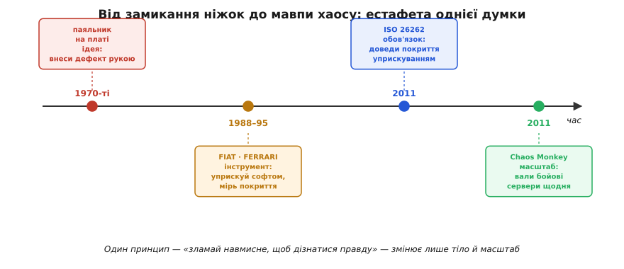

# 📜 Від замикання ніжок до мавпи хаосу

У [самій темі](root:embedded/fault-injection-testing) ми дійшли до думки, що звучить майже як виклик здоровому глузду: щоб **довіряти** коду-рятувальникові, його треба спершу **зламати навмисне** й побачити, як він вистоює. Ламати справне навмисне — інстинктивно це здається диверсією, а не інженерією. І ось що цікаво: ця сама думка не впала готовою з неба. Вона **народжувалася** довго, болісно, у кількох несхожих світах поспіль — від лабораторій, де перевіряли бортові комп'ютери для космосу, до серверних залів стримінгу, що крутить кіно мільйонам. Щоразу хтось мусив спершу подолати той самий внутрішній опір — «навіщо псувати те, що працює?» — і щоразу відповідь виявлялася однаковою: бо інакше ти не знаєш правди, ти лише сподіваєшся.

Ця історія варта розповіді не датами, а **поворотами думки**. Бо за чотири з гаком десятиліття той самий принцип — «внеси біду сам, поки ціна помилки мала» — переродився тричі: з удару паяльником по платі він став рядком коду, потім — **вимогою стандарту**, від якого залежить, чи поїде автомобіль, а наприкінці повернувся в зовсім інший масштаб як модна дисципліна з грайливою назвою «інженерія хаосу». Простежмо цей шлях так, щоб було видно не лише **що** сталося, а **чому** на кожному кроці інакше було не можна.

## 1970-ті: коли несправність вносили паяльником

Почнімо з найгрубішого — і саме тому найчеснішого — кінця. У 1970-х комп'ютер, від якого залежали життя — бортова машина літака, керування реактором, апаратура для космічного польоту, — будували **відмовостійким** фізично: дублювали блоки, ставили мажоритарне голосування трьох однакових обчислювачів, додавали схеми, що мали зловити збій заліза. Але виникало те саме питання, що мучить нас і сьогодні: **звідки знати, що ця надлишковість справді спрацює**, коли блок справді відмовить? Чекати справжньої відмови дорогого блоку, щоб перевірити дублера, — божевілля.

Відповідь тодішніх інженерів була прямою до буквальності. Якщо ти боїшся, що відмовить дріт, — **відмов його сам**. Перші досліди з уприскування відмов не мали в собі нічого, окрім **замикання з'єднань просто на платі** й спостереження, що зробить система (англ. *bridging faults* — несправності-перемички: два сусідні провідники, які мали жити окремо, навмисне з'єднують). Беруть живий блок, притискають вивід мікросхеми до сусіднього чи до землі — і дивляться: чи помітив це сторожовий вузол, чи перемкнулося голосування на справний канал, чи система пішла врознос. Це і є **уприскування на ніжки** (англ. *pin-level fault injection*) у найпервиннішому вигляді — буквально руками, дротом і щупом.

Зупинімось на цьому образі, бо в ньому вже сидить **уся суть** прийому, до якого ми дійшли в темі через код. Інженер 1970-х не мав ні препроцесорних прапорців, ні мокувань — у нього був паяльник і плата. Але робив він **рівно те саме**, що ми робимо `#ifdef FAULT_INJECTION`: вносив у працюючу систему контрольований дефект і питав, чи обірветься ланцюг до видимої відмови. Різниця лише в інструменті, не в думці. Тому, коли ми кажемо «програмне уприскування — продовження ідеї мока», варто пам'ятати, що сама **ідея** старша за будь-який софт: вона з епохи, коли несправність вносили рукою.

Швидко стало ясно, що руки й паяльник — погано **повторюваний** і небезпечний інструмент: легко спалити дорогий блок, важко влучити в потрібну мить, неможливо повторити дослід точно. Тож техніку почали **механізувати**. З'явилися спеціальні пристрої-уприскувачі, що самі замикали потрібні виводи за програмою; пізніше — стенди, що **бомбардували ділянку плати важким випромінюванням** (англ. *heavy-ion radiation*), щоб зімітувати те, проти чого, власне, і будувалася частина захисту: перекинутий частинкою біт. Оцінку схем виявлення помилок через уприскування важкими іонами доповідали, наприклад, на 19-му Міжнародному симпозіумі з відмовостійких обчислень (FTCS-19) 1989 року; а до загального вжитку увійшли пін-рівневі уприскувачі на кшталт системи **RIFLE**, доведеної до робочого стану на початку 1990-х. *(Статус: усталено — рання історія fault injection як апаратної техніки 1970-х і її механізація добре задокументовані в оглядах надійності обчислень.)*

> 🔧 **Навіщо це.** Тримай цей образ паяльника як **компас** для всієї теми. Коли в коді ти пишеш точку вкидання, ти не вигадуєш новацію — ти переносиш у програмний світ жест, якому півстоліття: «зламай навмисне, поки можеш собі дозволити». Зрозумівши, що пін-рівневе уприскування було першим і досі лишається найреалістичнішим (бо чіпає **справжню фізику**), ти бачиш, чому в [піраміді тестів](root:embedded/fault-injection-testing) воно живе на самій вершині — рідкісне, дороге, але незамінне там, де важить саме залізо.

## Чому фізичне уприскування вперлося в стіну

Апаратне уприскування мало вроджену ваду, і саме вона штовхнула історію далі. Притиснути можна лише **те, до чого дістанешся щупом**, — зовнішні виводи мікросхеми. А найцікавіше з погляду надійності відбувається **всередині** чипа: у регістрах процесора, у комірках пам'яті, у проміжних значеннях обчислення, до яких ніяким дротом не дотягтися. Що більшою й щільнішою ставала інтеграція, то більша частка системи опинялася **за межами досяжності** паяльника.

Додаймо до цього інші біди фізичного підходу, і картина стане ясною. Бомбардування іонами вимагало прискорювача — апаратури рівня наукового інституту, не доступної кожній лабораторії. Притискання виводів псувало дорогі зразки. А головне — кожен дослід було **важко повторити** точно: влучити несправністю в той самий такт, у те саме місце програми двічі поспіль майже неможливо, а без повторюваності немає й науки. Виходив парадокс: техніка, покликана **довести** надійність числом, сама була ненадійною й невідтворною.

Назрівав очевидний наступний крок, і його підказала сама природа цифрової машини. Адже **наслідок** будь-якої апаратної несправності — це завжди зрештою **зіпсований біт у пам'яті чи регістрі**. Перекинула частинка біт — у комірці не те число. Замкнув щуп лінію даних — у регістр потрапило сміття. А якщо так, то навіщо взагалі **фізично** добиратися до того біта? Чому не **зіпсувати його програмно** — самою ж машиною, командою запису? Біт, перекинутий важким іоном, і той самий біт, перекинутий рядком коду `*addr ^= (1u << bit)`, для решти системи **нерозрізненні**. Ця проста, але неочевидна думка й відкрила цілу нову епоху.

## 1988–1990: FIAT і народження SWIFI

Епоху цю відкрили в **Університеті Карнеґі — Меллона** (англ. *Carnegie Mellon University*, Піттсбург, США), у середовищі, що десятиліттями було одним зі світових осередків досліджень надійності обчислень. Група інженерів — **Джеймс Бартон** (*James H. Barton*), **Ед Чек** (*Ed W. Czeck*), **Зейрі Сеґалл** (*Zary Z. Segall*) і **Деніел Сіверек** (*Daniel P. Siewiorek*) — побудувала систему з красномовною назвою **FIAT** (англ. *Fault Injection based Automated Testing* — «автоматизоване тестування на основі уприскування відмов»).

Що саме зробила FIAT — і чому це поворот, а не просто ще один інструмент. Замість щупа на ніжці FIAT уприскувала несправності **прямо в образ програми в пам'яті**: псувала біти і в **коді**, і в **даних** працюючого застосунку, а потім стежила, як система на це реагує. Дослід полягав у тому, щоб **вичерпно** прогнати кілька типів несправностей — варіацій перекинутих бітів пам'яті — по різних місцях образу й зібрати **статистику**: скільки несправностей система зловила, скільки проґавила, з якою затримкою спрацював захист. Це вже не «спробуймо й подивимось», а **вимірювання покриття** числом — рівно те, заради чого уприскування й існує.

Свою роботу група представила на **18-му Міжнародному симпозіумі з відмовостійких обчислень** (FTCS-18) у **Токіо 1988 року**, а розгорнуту версію — статтею «Fault injection experiments using FIAT» у журналі **IEEE Transactions on Computers** (том 39, № 4, травень 1990, с. 575–582). Паралельно та сама лінія робіт лягла в технічний звіт для NASA: Чек, Сеґалл і Сіверек, «Predeployment validation of fault-tolerant systems through software-implemented fault insertion», **NASA CR-4244**, червень 1989 — сама назва («передрозгортальна перевірка відмовостійких систем через **програмне** внесення несправностей») промовисто фіксує суть переходу. *(Статус: усталено — авторство, назви публікацій, том і сторінки IEEE TC та номер звіту NASA звірені за бібліографічними базами IEEE та NTRS.)*

Саме тут народився термін, яким ми користуємось у темі, навіть не задумуючись про його вік. Коли виявилося, що несправності можна вносити **самим софтом** і що це придатне не лише для перевірки заліза, а й для оцінки **програмних** систем, увесь цей клас прийомів дістав спільну назву — **SWIFI** (англ. *Software-Implemented Fault Injection* — уприскування відмов, реалізоване програмно). Наш `#ifdef FAULT_INJECTION` зі вкинутим хибним виміром температури — прямий нащадок FIAT: та сама ідея псувати стан **зсередини**, лише прикладена не до космічного бортового комп'ютера, а до прошивки нагрівача.

> 🔧 **Навіщо це.** Варто чітко розрізняти **три речі**, які легко злити в одне. Апаратне уприскування 1970-х — це **ідея** (внеси дефект сам). FIAT — це перший зрілий **інструмент**, що переніс ідею в програмний світ і додав їй **число** (статистику покриття). А SWIFI — це **назва цілого класу** таких інструментів. Коли ти ставиш одну точку вкидання в прошивці, ти не «винаходиш FIAT» — ти користуєшся **дисципліною**, яку FIAT започаткувала: міряти надійність експериментом, а не вірою.

## 1995: FERRARI робить уприскування дешевим

FIAT довела, що SWIFI працює, але лишила відкритим практичне питання: **як** уприскувати гнучко, не переписуючи й не перекомпільовуючи систему під кожен дослід? Відповідь прийшла з **Університету Техасу в Остіні** (англ. *University of Texas at Austin*, США). 1995 року **Ґанеш Канаваті** (*Ganesh A. Kanawati*), **Надія Канаваті** (*Nasser A. Kanawati*) і **Джейкоб Абрагам** (*Jacob A. Abraham*) опублікували в **IEEE Transactions on Computers** (том 44, № 2, лютий 1995) систему **FERRARI** (англ. *Fault and ERRor Automatic Real-time Injection* — автоматичне уприскування несправностей і помилок у реальному часі). *(Статус: усталено — авторство, журнал, том і рік звірені за базами IEEE/ACM.)*

Ключова новація FERRARI ховається в одному слові — **пастка** (англ. *trap*, програмна пастка / переривання налагодження). Замість того щоб **вшивати** точки вкидання в сам код наперед, FERRARI використовувала **апарат налагодження**, уже наявний у процесорі: ставила пастку на потрібну адресу чи команду, і коли виконання туди доходило — пастка спрацьовувала, керування на мить переходило до уприскувача, той псував потрібний регістр, біт пам'яті чи значення, після чого програма бігла далі, **не знаючи**, що в неї щось підмінили. Так система імітувала і **тимчасові** збої (перекинувся біт — і зник), і **сталі** несправності (зіпсоване значення тримається), причому над **довільною** програмою, яку навіть не треба було готувати до досліду.

Чому це важливий крок, видно з порівняння з нашим власним кодом у темі. Наш підхід — **вшиті** точки під `#ifdef` — простий, прозорий і дисциплінований, але вимагає **наперед** вирішити, де саме псувати, і **перекомпілювати** збірку. Trap-підхід FERRARI — гнучкіший: точку вкидання можна поставити куди завгодно **ззовні**, не чіпаючи вихідний код. Це два полюси одного компромісу, між якими SWIFI-інструменти балансують і досі: **вшити** (прозоро, але жорстко) чи **перехопити пасткою** (гнучко, але складніше й залежить від апарата налагодження). Знаючи обидва, ти краще розумієш, **чому** в прошивці ми обрали простіший, вшитий шлях: він не потребує спецзаліза й чесно видно в коді, де саме стоїть диверсія.

На цьому етапі — десь середина 1990-х — уприскування відмов перестало бути екзотикою кількох лабораторій і стало **визнаним науковим методом** перевірки відмовостійкості: з власними інструментами, метриками покриття, школою. Лишалося зробити останній крок, який перетворює метод із «доброї практики» на **обов'язок**.

## 2011: ISO 26262 робить уприскування обов'язком

Цей крок зробила не наукова стаття, а **стандарт**. 2011 року вийшла перша редакція **ISO 26262** — міжнародного стандарту функційної безпеки доро́жніх транспортних засобів (англ. *Road vehicles — Functional safety*). Це той звід правил, за яким сьогодні розробляють електроніку й прошивки для автомобілів: гальмівні системи, керування двигуном, подушки безпеки, помічники водія. Логіка стандарту проста й сувора: що тяжчі наслідки відмови для життя людини, то суворіші вимоги до того, як цю систему перевіряли.

І ось що тут важливо для нашої теми. ISO 26262 не просто **дозволяє** уприскування відмов — він **прямо рекомендує** його як метод перевірки, причому аж до **рівня окремого юніта** коду. Стандарт описує fault injection буквально так: «внесення довільних несправностей — наприклад, **псуванням значень змінних**, **внесенням мутацій у код** або **псуванням значень регістрів процесора**». Упізнаєш? Це **дослівно** ті самі три прийоми, які ми проходили в темі: зіпсувати дані (`t = 850`), перекинути біт чи мутувати поведінку, зіпсувати регістр. Те, що для інженерів Карнеґі — Меллона 1988 року було переднім краєм досліджень, через двадцять із гаком років стало **рядком вимоги** в стандарті, без виконання якого автомобільну систему просто не сертифікують. *(Статус: усталено — формулювання щодо псування змінних, мутації коду й регістрів процесора відповідає тексту таблиць ISO 26262 для рівня юніт- та інтеграційного тестування, частина 6 (ПЗ) і частина 5 (залізо).)*

Навіщо стандартові так наполягати? Через поняття, заради якого все й робиться, — **діагностичне покриття** (англ. *diagnostic coverage*, DC): яку **частку** можливих несправностей твій захист справді ловить. Сертифікація вимагає це покриття **довести числом**. А єдиний чесний спосіб виміряти, чи ловить заслінка несправність, — **вкинути цю несправність і подивитись**. Замкнулося те саме коло, що й у 1970-х: хочеш довіряти захистові — зламай систему навмисне. Тільки тепер це не ініціатива сміливого інженера, а **закон галузі**: рятувальник, чию роботу не підтверджено уприскуванням, з погляду ISO 26262 наче й не існує.

> 🔧 **Навіщо це.** Тут історія сходиться з твоєю практикою впритул. Коли в темі ми писали «озброюй несправності по одній і перевіряй **відновлення**, а не падіння» — це не абстрактна охайність, а **дослівно** те, чого вимагає функційна безпека для оцінки діагностичного покриття. Якщо колись робитимеш прошивку для авто, медтехніки чи промавтоматики, ці самі точки вкидання з `#ifdef FAULT_INJECTION` стануть не доброю звичкою, а **доказовим матеріалом для сертифікації**. Звідки, до речі, береться сам список несправностей, які варто вкидати, — це окрема дисципліна систематичного [аналізу видів і наслідків відмов](root:embedded/fault-injection-testing): спершу розбираєш, що може поламатися, потім кожну загрозу вкидаєш і перевіряєш заслінку.

## 2011: та сама думка валить бойові сервери

А тепер — найкрасивіший поворот усієї історії. Того **самого 2011 року**, коли автомобільний світ закріплював уприскування у строгому стандарті, в зовсім іншому всесвіті — у хмарних серверах стримінгової компанії **Netflix** — та сама первісна думка спалахнула наново, незалежно, під грайливою назвою й у масштабі, про який інженери 1970-х і мріяти не могли.

Передісторія така. Netflix саме переїжджав зі своїх дата-центрів у **хмару** (Amazon Web Services) — на тисячі віртуальних серверів, що можуть будь-якої миті зникнути не з твоєї волі: хмарний провайдер має право погасити машину, і це **нормальна** поведінка хмари, а не аварія. Стара інженерна звичка — «будуймо так, ніби збоїв не буває, а як трапиться, розберемось» — у такому середовищі ставала смертельною: на тисячах ненадійних машин щось ламається **постійно**, і система мусила це переживати не зрідка, а **завжди**. Як змусити цілу інженерну культуру **по-справжньому** будувати на стійкість, а не на словах?

Відповідь, яку дали в Netflix (її ключовим інженером називають **Ґреґа Орзелла**, *Greg Orzell*), була зухвало проста й пряма, як замикання щупа в 1970-х: **не чекати, поки сервери впадуть самі, а навмисне валити їх постійно — у бойовому середовищі, серед білого дня**. Інструмент назвали **Chaos Monkey** («мавпа хаосу») — за образом дикої мавпи, яку запустили в серверну залу, і вона смикає й висмикує дроти навмання. Мавпа щодня випадково **вимикає бойові машини**, на яких просто зараз працюють живі глядачі. Якщо падіння однієї машини здатне зашкодити перегляду — отже, система **недостатньо стійка**, і це треба полагодити **зараз**, а не дізнатися про це під час справжньої масової аварії о третій ночі.

Філософія тут — буква в букву наша. Намір був **перейти від моделі розробки, що припускала відсутність збоїв, до моделі, де збої вважаються неминучими** й змушують розробника закладати стійкість як **обов'язок, а не вибір**. Порівняй це з висновком нашої теми — «єдиний код, якому можна довіряти, це той, який ти вже зламав навмисне й бачив, як він вистояв». Та сама думка, лише замість одного рятувальника в прошивці — ціла розподілена система зі сотень служб; замість `#ifdef` — жива мавпа, що рве з'єднання щодня.

Публічно про свій «загін мавп» (англ. *Simian Army*, «мавп'яче військо» — родина інструментів, де Chaos Monkey був першим) Netflix оголосив **19 липня 2011 року** дописом у власному технічному блозі; код Chaos Monkey згодом виклали у відкритий доступ (2012 рік, ліцензія Apache 2.0). А з цієї практики виросла ціла нова дисципліна з гучною назвою — **інженерія хаосу** (англ. *chaos engineering*): навмисне внесення збоїв у бойові розподілені системи, щоб **експериментально** довести їхню стійкість, а не сподіватися на неї. *(Статус: усталено щодо року, інструмента, публічного оголошення й відкриття коду. Авторство тоншне: Ґреґа Орзелла усталено називають ключовим інженером Chaos Monkey, а формування дисципліни хаос-інженерії пов'язують також із Нору Джонс (Nora Jones) і Кейсі Розенталем (Casey Rosenthal); сам допис у блозі від 19.07.2011 підписали керівники хмарної інфраструктури Netflix Юрій Ізраїлевський (Yury Izrailevsky) та Аріель Цейтлін (Ariel Tseitlin) — тобто «оголосив» і «придумав» тут різні люди, що типово для колективних інженерних історій.)*

## Один принцип, чотири маски

Зведімо тепер нитку докупи, бо в ній — урок, ширший за саму техніку. Перед нами **один-єдиний принцип**, що прожив понад сорок років і вдягав чотири дуже несхожі маски:

```
1970-ті   паяльник на платі     → ідея: внеси дефект сам, рукою
1988–95   FIAT, FERRARI         → інструмент: внеси дефект софтом, виміряй покриття
2011      ISO 26262             → обов'язок: доведи покриття уприскуванням або не сертифікуєшся
2011      Chaos Monkey          → масштаб: вали бойові сервери щодня, будуй стійкість як норму
```


*Один принцип проживає понад сорок років, міняючи лише тіло й масштаб. Спершу несправність вносять рукою на платі; потім — софтом зсередини, з виміром покриття (FIAT, FERRARI); далі стандарт функційної безпеки робить це обов'язком сертифікації; того ж року хмарна «мавпа хаосу» переносить ту саму думку на тисячі бойових серверів. Інструмент щоразу новий — думка незмінна.*

Що тут найповчальніше. По-перше, **великі ідеї не помирають, а змінюють тіло**. Принцип «зламай навмисне, щоб дізнатися правду» лишився **дослівно** той самий — змінювалися тільки інструмент (паяльник → код → пастка → хмарна мавпа) і масштаб (один дріт → один регістр → ціла система). Коли ти пишеш точку вкидання в прошивці, ти стоїш у цьому ж ряду — між інженером Карнеґі — Меллона й «мавпою хаосу».

По-друге — і це найважливіше для тебе як інженера — **спротив цій ідеї щоразу був той самий, і щоразу його доводилося долати наново**. «Навіщо псувати те, що працює?» питали в 1970-х, питали перед першим SWIFI, питають і сьогодні, коли пропонуєш валити бойовий сервер навмисне. Відповідь не змінилася за пів століття: **бо непротестований рятувальник — це не захист, а здогад про захист**. І немає різниці, чи це сторож у твоїй прошивці, чи мажоритарне голосування в бортовому комп'ютері, чи тисяча хмарних машин Netflix — довіряти можна лише тому, що ти **вже бачив зламаним і вцілілим**.

І по-третє, тонше. Ця історія — добра пересторога проти міфу про **єдиного винахідника**. Уприскування відмов не «придумав» ніхто один: ідея жила в апаратурі 1970-х іще безіменною; FIAT і FERRARI дали їй інструмент і назву (SWIFI); ISO 26262 — статус закону; а Chaos Monkey — друге, незалежне народження в хмарну епоху, причому навіть там «придумав» (Орзелл та колеги) і «оголосив» (Ізраїлевський, Цейтлін) — різні люди. Як і в більшості інженерних історій, тут не герой-одинак, а **естафета думки** через десятиліття й галузі. Тож, ставлячи свій скромний `#ifdef FAULT_INJECTION`, ти не повторюєш чийсь винахід — ти **береш естафету**, якій уже за пів століття, і несеш її далі тим самим жестом, що й усі до тебе: ламаєш навмисне, поки ціна помилки — лише червоний тест, а не біда в полі.
