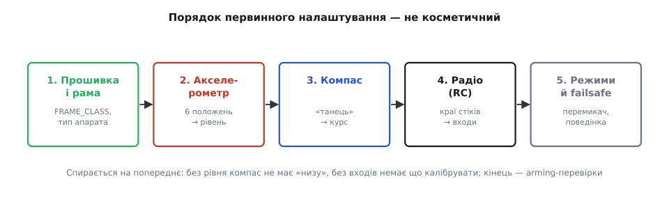
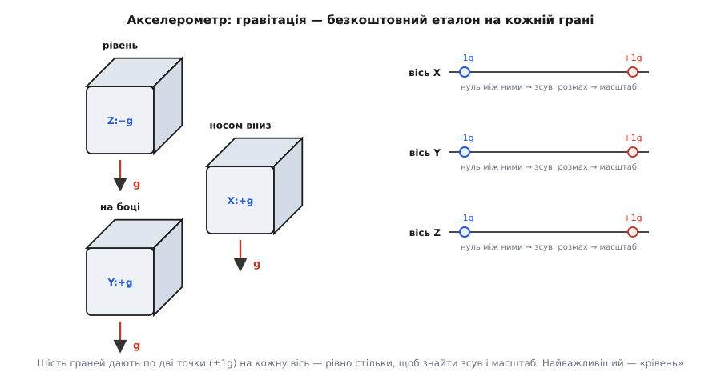
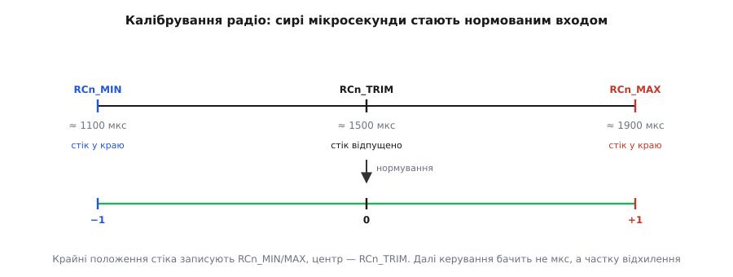

# Первинне налаштування: калібрування давачів і радіо

Ми вже знаємо, з чого складається бортовий мозок, і знаємо, як людина з ним говорить — через [параметри й наземну станцію](topic:sys-dron/params-gcs). Але між «залив прошивку» і «апарат готовий злетіти» лежить робота, яку не зробить за тебе ні код, ні автотюнінг: узяти свіжозібраний апарат і **привчити прошивку до цього конкретного заліза**. Плата щойно з коробки не знає, де в неї «низ», куди показує ніс компаса й що означає крайнє положення твого стіка. Первинне налаштування — це ритуал, яким ти цю незнану плату перетворюєш на апарат, що чесно бачить світ і слухає пульт.

Слово «калібрування» ми вже розбирали як окрему дисципліну — [зміряти сталу похибку давача проти еталона й записати поправку](root:embedded/calibration-procedure). Тут та сама наука, але вже **в польовому вигляді**: не на лабораторному стенді з гирями, а в гаражі, за десять хвилин, майстрами-помічниками наземної станції. Тому цей крок не переказує теорію калібрування — він показує, **як вона лягає на автопілот**: які давачі, у якому порядку, чим тут править за еталон і куди все зрештою осідає.

А осідає воно, як ми пам'ятаємо, у **параметри**. Кожне калібрування, хоч би яким живим виглядав процес — крутиш апарат вісімками, качаєш стіки, — закінчується тим, що станція записує кілька чисел у незалежну пам'ять плати. Тож усе це налаштування можна прочитати одним поглядом на файл `.param`: за значеннями `INS_ACC*OFFS_*`, `COMPASS_OFS_*`, `RC1_MIN`/`RC1_MAX` видно, що і як налаштовано. Калібрування — це процес, а його результат — числа.

## Порядок, який не можна тасувати

Найперше, що варто зрозуміти: кроки первинного налаштування йдуть **у певному порядку не для краси**. Кожен спирається на попередній, і переставиш — дістанеш або безглузді числа, або апарат, що просто відмовиться «зброїтися».


*Первинне налаштування — це послідовність, де кожен крок спирається на попередній. Спершу кажемо прошивці, **який** це апарат (рама), тоді даємо їй «низ» (акселерометр), тоді чесний курс (компас), тоді входи від пульта (радіо), і насамкінець — режими й поведінку в біді (failsafe). Переставиш — не буде на що спертися.*

Чому саме так. Поки прошивка не знає **типу апарата** (`FRAME_CLASS`, `FRAME_TYPE`), вона не знає навіть, скільки в нього моторів і як їх змішувати — [узгодження сигналів керування](root:embedded/output-mixing) залежить від рами. Поки не відкалібровано **акселерометр**, у апарата немає поняття «горизонт»: без вектора «вниз» немає відліку, від якого міряти крен і тангаж, а отже, і калібрувати компас нема відносно чого. Поки не налаштовано **компас**, оцінювач курсу отримує брехливий північ. Поки не відкалібровано **радіо**, керування не знає, яке число зі стіка вважати «повний газ», а яке — «нуль». І лише коли давачі й входи чесні, має сенс задавати **режими польоту й failsafe** — бо всі вони спираються на те, що апарат правильно себе відчуває.

> 🔧 **Навіщо це.** Коли береш чужий чи власний апарат, що «дивно поводиться», проходь цей ланцюг **згори вниз**. Немає горизонту — винен акселерометр; тягне вбік і плутає курс — компас; смикається на нейтральному стіку — радіо. Порядок налаштування — це водночас і порядок діагностики: перша ланка, що бреше, отруює все нижче.

## Крок нульовий: рама, орієнтація плати, вібрація

Перш ніж калібрувати бодай щось, треба сказати прошивці два факти про залізо, без яких усі виміри поїдуть.

Перший — **тип рами**. Це вже знайомі нам параметри: `FRAME_CLASS` обирає клас (квадро, гекса, окто), `FRAME_TYPE` — розкладку моторів (X, plus, H). Ми бачили в темі параметрів, як [одна прошивка стає різними апаратами](topic:sys-dron/params-gcs) зміною цих чисел; тут це перше, що ти виставляєш, бо від нього залежить усе змішування.

Другий, підступніший — **як плату фізично прикручено**. Виробник не знає, яким боком ти поставиш контролер: стрілка на корпусі може дивитися вперед, назад, убік, а сама плата — лежати догори дригом на нижній деці. Прошивка мусить це знати, інакше «вперед» для неї буде твоїм «вліво». За це відповідає параметр `AHRS_ORIENTATION`: він каже, як осі давача повернуті відносно осей апарата. Виставив його неправильно — і апарат, ледь злетівши, різко хитнеться не туди, бо його уявлення про власну орієнтацію обернуте відносно дійсності.

І третій факт, який не задають числом, а забезпечують **механічно**, — вібрація. Акселерометр і гіроскоп ([разом вони IMU](topic:hw-sensing/imu)) — це давачі прискорення, а працюючі мотори трясуть раму сотнями коливань на секунду. Якщо ця тряска доходить до плати, вона тоне в «бруді»: [шум забиває корисний сигнал](topic:hw-sensing/imu-vibration-isolation), оцінювач починає «бачити» неіснуючі ривки. Тому серйозні контролери ставлять на **м'яку розв'язку** — і як саме підібрати демпфер, ми розбирали окремо в темі [матеріалів для кріплення IMU](root:embedded/imu-mounting-materials). Калібрування чистого сигналу не врятує: воно прибирає **сталу** похибку, а вібрація — це шум, окрема війна. Тож перш ніж калібрувати IMU, спитай себе, чи не потоне його вимір у тряску.

## Акселерометр: гравітація як безкоштовний еталон

Тепер найголовніший давач — акселерометр, бо саме він дає апарату відчуття «де низ». І тут природа підкидає розкішний подарунок: **у нас уже є ідеальний еталон, і він скрізь**. Це сила тяжіння.

Пригадаймо суть [двоточкового калібрування](root:embedded/calibration-procedure): щоб знайти зсув і масштаб осі давача, треба подати їй **дві відомі величини** й зняти, які сирі числа вона на них видає. Для акселерометра відома величина дається сама собою. Коли апарат лежить нерухомо, кожна вісь відчуває проєкцію тяжіння, і якщо поставити апарат так, щоб вісь дивилася точно вниз, вона побачить рівно **+1g**; переверни — побачить **−1g**. Гравітація стала, всюдисуща й точна — кращого польового еталона не вигадати.


*Гравітація править за еталон на кожній грані. Поставивши апарат на кожну з шести сторін, ми даємо кожній осі по два відліки — коли вона дивиться вгору (−1g) і вниз (+1g). Це рівно дві точки на вісь: нуль між ними — це зсув, розмах від −1g до +1g — це масштаб. Найважливіше положення — «рівень»: саме воно задає, що прошивка вважатиме горизонтом.*

Звідси й знайомий кожному дрономайстру ритуал: наземна станція просить поставити апарат **у шість положень** — рівно, на лівий бік, на правий бік, носом униз, носом угору й на спину, — і на кожному просить завмерти й натиснути кнопку. Це не примха: шість граней дають кожній із трьох осей по два виміри (вгору й униз), а два виміри — це рівно стільки, скільки треба, щоб розв'язати зсув і масштаб осі. Прошивка збирає всі точки й розв'язує їх разом — знаходить зсув і масштаб кожної осі так, щоб на всіх шести положеннях вимір найкраще збігався з тим, що диктує гравітація.

Порядок положень тут не критичний — головне **завмерти** на кожному, бо будь-який рух додає паразитне прискорення поверх тяжіння й псує точку. А от одне положення критичне за суттю — **«рівень»**: саме воно задає, який нахил прошивка вважатиме горизонтальним у польоті. Помилишся на кілька градусів на цьому кроці — і апарат літатиме з постійним «завалом», намагаючись висіти під кутом, який вважає рівним.

Числа, які з цього виходять, — знову параметри. Зсуви осей лягають у `INS_ACCOFFS_X/Y/Z` (та `INS_ACC2OFFS_*` для другого IMU, якщо він є), масштаби — в `INS_ACCSCAL_*`. Тобто «шість положень» — це процес, а `.param` наприкінці містить кілька чисел, у яких і живе відкаліброване відчуття горизонту.

Механіку цих обчислень — як зі шести знятих векторів прошивка розв'язує зсув і масштаб і чому найгірше калібрується вісь, що ніколи не дивилася точно вниз, — винесено в окремий [код-проєкт калібрування акселерометра](root:embedded/fc-setup-calibration/proj-accel-cal.md), щоб не дробити тут наскрізну думку.

> 🔧 **Навіщо це.** Акселерометр можна відкалібрувати «спрощено» — лише рівень, одним положенням (`Simple Accel Cal` для великих апаратів, що їх не покрутиш у руках). Це прибирає головний зсув, але не масштаб і не перекоси осей, тож для дрібного апарата, який легко перевернути, роби повне шестипозиційне: п'ять зайвих поворотів дають помітно чесніший горизонт, а платиш за них парою хвилин раз на життя апарата.

## Компас: приборкати власне залізо апарата

Акселерометр дав нам «низ». Тепер потрібен «північ» — а це вже компас (магнітометр), і з ним усе значно підступніше, бо еталон тут слабкий, а перешкоди — сильні й сидять на самому апараті.

Магнітне поле Землі, за яким компас шукає північ, украй слабке. А поряд із давачем — акумулятор, що віддає десятки ампер, силові дроти, сталеві гвинтики, самі мотори з постійними магнітами. Усе це створює біля плати магнітні збурення, часто **сильніші** за поле Землі. І що найгірше — ці збурення їдуть разом з апаратом, тож просто «відійти від заліза» не вийде. Компас довелося б викинути, якби ці спотворення не мали двох дуже зручних властивостей.

Спотворення бувають двох родів, і термінологію тут дало саме залізо. **Тверде залізо** (англ. *hard iron* — «магнітно тверде», тобто здатне лишатися намагніченим) — це постійні магніти й намагнічені деталі поряд із давачем. Вони додають до кожного виміру **сталий вектор**, однаковий хоч куди поверни апарат, — компас ніби завжди тягне в один бік. **М'яке залізо** (англ. *soft iron* — «магнітно м'яке», що намагнічується лише в чужому полі) — це феромагнітні деталі, які самі магнітів не мають, але **викривлюють** поле Землі поблизу, і викривлення залежить від того, як апарат повернутий. Ці два поняття прийшли просто з магнетизму матеріалів: тверде тримає намагніченість, м'яке — ні. Хто, коли й якими формулами навчився чистити компас від того й того, розказано в [історії компасного «танцю»](root:embedded/fc-setup-calibration/hist-compass-dance.md).

Ключ до їх приборкання — в геометрії вимірів. Уяви, що ти повертаєш апарат в усі боки й наносиш кожен вимір компаса точкою в тривимірному просторі. Якби перешкод не було, всі точки лягли б на **сферу з центром у нулі** — бо поле Землі має сталу величину, лише напрям крутиться разом з апаратом. Тверде залізо **зсуває** цю сферу з центру (додало сталий вектор). М'яке залізо **розтягує** її в еліпсоїд (у різних напрямках спотворення різне). Отут і криється спосіб: якщо виміряти цю зсунуту, витягнуту фігуру, можна знайти поправку, що поверне її назад до правильної сфери в центрі.

Тому калібрування компаса вимагає того самого дивного ритуалу — **«танцю»**: береш апарат і повертаєш його в усі можливі боки, часто вісімками, щоб давач «намалював» точками якнайбільше різних напрямків. Наземна станція збирає хмару цих точок і підганяє під неї фігуру — знаходить, наскільки й куди сфера зсунута (тверде залізо) і як витягнута (м'яке). Поправки лягають у параметри: зсуви — в `COMPASS_OFS_X/Y/Z`, множники м'якого заліза — в `COMPASS_DIA_*` і `COMPASS_ODI_*`. Що ретельніше «натанцюєш» усі напрямки, то точніша підгонка й то чесніший курс у польоті.

Є й другий бік. Оскільки перешкода створюється струмом самого апарата, вона **міняється з газом**: чим більше моторам струму, тим сильніший «магнітний вихлоп». Тому серйозні збірки роблять ще й **компенсацію від струму** (`COMPASS_MOT_*`) — вимірюють, як зсув поля залежить від споживаного струму, і віднімають цю добавку в реальному часі. Без неї компас, вивірений на землі при нулі газу, поплив би в польоті під навантаженням.

> 🔧 **Навіщо це.** Якщо апарат у польоті повільно «крутиться» довкола себе, тягне вбік у режимах утримання позиції чи то злітає, то падає курсом — перший підозрюваний завжди компас: або погано натанцьоване калібрування, або сильна перешкода поряд із давачем. Тому магнітометр і виносять на щоглу подалі від силових дротів — фізично відсунути давач від джерела перешкоди часто дієвіше, ніж будь-яка математика калібрування.

## Радіо: навчити прошивку твоєму пульту

Давачі дали апарату чесне відчуття себе. Лишилося навчити його **слухати тебе** — а це калібрування радіоканалу (RC). Тут еталоном служить не природа, а твоя власна рука: прошивка має дізнатися, які саме числа приходять від передавача, коли ти відхиляєш стік до краю й коли відпускаєш його в центр.

Річ у тім, що [канал керування](topic:sys-dron/rc-link) передає кожну вісь як число — історично тривалість імпульсу в **мікросекундах** (класично від ≈1000 до ≈2000 мкс), а в сучасних цифрових протоколах — рівнозначний код. Але приймач і передавач кожного виробника мають свій розкид: у одного повний хід стіка дає 1090…1920, у іншого 1100…1880, центр може стояти не рівно посередині. Прошивка сама цього знати не може. Тому калібрування RC простісіньке за суттю: станція каже «поводи всіма стіками до самих країв», ти качаєш газ, крен, тангаж, рискання від упору до упору — а прошивка запам'ятовує **найменше й найбільше** число, що прийшло на кожному каналі, і **центр**, куди стік повертається сам.


*Що робить калібрування радіо. Крайні положення стіка задають `RCn_MIN` і `RCn_MAX` — межі сирого сигналу; відпущений стік дає `RCn_TRIM` — центр. Далі прошивка нормує сире число в частку відхилення від −1 до +1, і керування працює вже з нею, не знаючи про мікросекунди. Так один і той самий код однаково поводиться з будь-яким передавачем.*

Числа знову осідають у параметри — по три на канал: `RC1_MIN`, `RC1_MAX`, `RC1_TRIM` для першого, і так далі. Навіщо ця нормалізація? Щоб **відв'язати керування від конкретного заліза передавача**. Контур стабілізації не хоче знати, що «повний крен управо» — це 1874 мкс саме на твоєму пульті; він хоче бачити чисту частку: −1, 0, +1. Калібрування RC — це перекладач між сирими числами твого передавача й нормованим входом, який очікує керування. Замінив передавач — перекалібруй, і весь код нижче лишиться тим самим.

**Worked-приклад. Як прошивка перекладає сирий імпульс у нормований вхід.** Припустімо, калібрування записало для каналу крену межі й центр, і тепер приходить сире число з приймача:

```cpp
// збережене з калібрування RC (у мкс), лежить у RC1_MIN/TRIM/MAX
const uint16_t rc_min  = 1095;   // стік у лівий упор
const uint16_t rc_trim = 1502;   // стік відпущено (центр)
const uint16_t rc_max  = 1918;   // стік у правий упор

// нормувати сирий імпульс у частку відхилення від центру: [-1 .. +1]
float rc_normalize(uint16_t pwm)
{
    if (pwm >= rc_trim)
        return (float)(pwm - rc_trim) / (rc_max - rc_trim);   // права половина
    else
        return (float)(pwm - rc_trim) / (rc_trim - rc_min);   // ліва половина
}

// приклад: приймач віддав 1710 мкс
// pwm >= trim → (1710 − 1502) / (1918 − 1502) = 208 / 416 = 0.50
// керування бачить +0.50 — рівно півкрена вправо, хоч який передавач
```

Зверни увагу, чому половини рахуються **окремо**: центр рідко стоїть точно посередині між краями, тож якби ми ділили на весь розмах, відпущений стік давав би не рівний нуль, а невеликий зсув. Розбивши на ліву й праву частини від `TRIM`, ми гарантуємо, що центр — це чистий нуль, а кожен упор — рівно ±1, навіть коли пульт несиметричний.

І окремий, критично важливий крок радіоналаштування — призначити **перемикач режимів** і **перевірити реверси**. Прошивка має знати, який канал (звичайно тумблер на пульті) перемикає режими польоту, і що кожна вісь рухається в **правильний** бік: нахилив стік праворуч — модель у симуляторі станції нахилилась праворуч, а не навпаки. Переплутаний реверс — класична причина перевороту одразу після зльоту, тому цей бік перевіряють **до** будь-якого запуску моторів.

## Куди все веде: arming-перевірки

Ми пройшли ланцюг — рама, акселерометр, компас, радіо — і на кожному кроці числа осідали в параметри. Лишається запитати: а що станеться, якщо якийсь крок пропустити? Відповідь і робить усе налаштування осмисленим: апарат **просто не дасть себе «зброїти»**.

Перед тим як увімкнути мотори, прошивка проганяє [набір перевірок готовності](topic:sys-dron/arming-checks): чи відкалібровані акселерометр і компас, чи розумний рівень вібрації, чи спіймано супутники, чи не суперечать параметри. Якщо давач не калібрований — його поправок просто немає в пам'яті, перевірка це бачить і **блокує зброєння**. Це і є та причина, чому первинне налаштування не можна «якось потім»: воно не косметичне вдосконалення, а перепустка до зльоту. Апарат, що знає про себе, що він не калібрований, безпечніший за апарат, упевнений у брехливих показаннях, — тому він радше не полетить узагалі.

> 🔧 **Навіщо це.** Коли станція перед зльотом лається «compass not calibrated» чи «accel calibration needed», це не прискіпування, а останній бар'єр, що ловить пропущений крок налаштування. Не обходь ці перевірки параметром «дозволити все» — краще повернутися й доробити калібрування. Саме на цьому бар'єрі система ловить те, що людина забула.

## Підсумок кроку

Первинне налаштування — це те, чого не зробить за тебе ні код, ні автотюнінг: **привчити прошивку до конкретного заліза**. Порядок тут залізний, бо кожен крок спирається на попередній. Спершу кажемо, який це апарат (`FRAME_CLASS`), як прикручено плату (`AHRS_ORIENTATION`) і чи не потоне IMU у вібрації. Тоді калібруємо **акселерометр** — шість положень, де за еталон править сама гравітація (±1g на кожну вісь), і найважливіше з них «рівень», бо воно задає горизонт. Тоді **компас** — «танець» у всі боки, щоб виміряти й прибрати перешкоди власного заліза апарата (тверде залізо зсуває сферу вимірів, м'яке — розтягує). Тоді **радіо** — качаємо стіки до країв, щоб прошивка вивчила межі твого передавача й нормувала їх у чистий вхід від −1 до +1, плюс перемикач режимів і реверси. І щоразу, хоч би яким живим виглядав процес, результат — це кілька чисел у параметрах: `INS_ACC*OFFS_*`, `COMPASS_OFS_*`, `RC1_MIN/MAX/TRIM`. А замикають усе [arming-перевірки](topic:sys-dron/arming-checks), що не пустять у політ апарат із пропущеним кроком. Зробив цей ланцюг чесно раз — і далі система працює з правдивим відчуттям себе й твого пульта, не здогадуючись щоразу заново.
