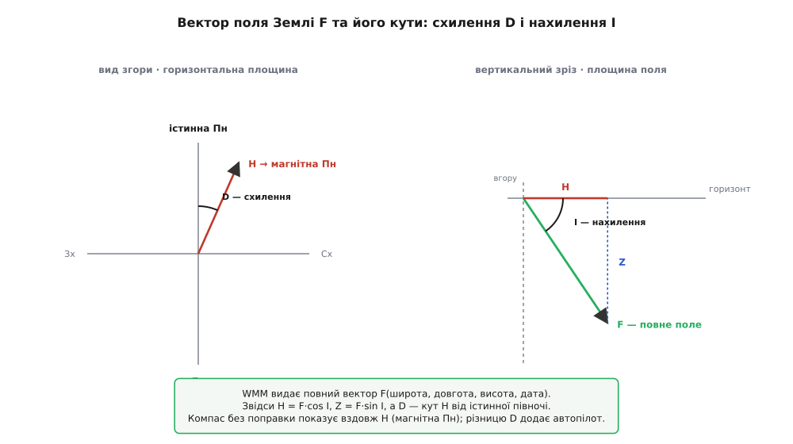
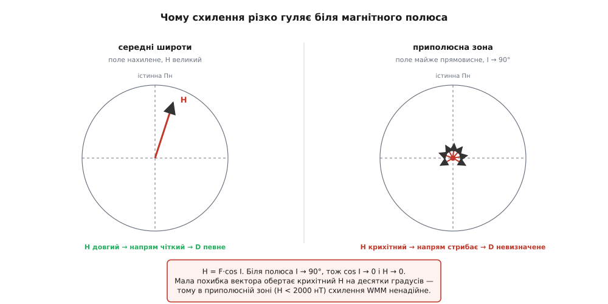

# 🧮 Всесвітня магнітна модель: звідки автопілот знає, куди насправді північ

У самій темі ми домовилися, що компас дає апарату «північ», і чесно приборкали дві біди давача — тверде й м'яке залізо власного корпусу. Але там ми мовчки припустили, що коли перешкоди прибрано, стрілка показує **на північ**. Це напівправда. Навіть ідеально відкалібрований магнітометр, винесений на щоглу подалі від будь-якого заліза, у польоті над Києвом дивитиметься не на ту північ, куди летить апарат за GPS. Він дивиться на **магнітну** північ, а карта, супутники й твій план місії живуть у **географічній**. Різниця між ними — кут, який доводиться знати з точністю до градуса, бо на кількох кілометрах маршруту він перетворюється на промах у сотні метрів.

Звідки автопілот бере цей кут, не маючи ні атласу, ні доступу до інтернету, — і чому в одних місцях планети він крихітний, а в інших стрибає так, що компасу взагалі не можна вірити, — це і є математика цієї вставки. За нею стоїть **Всесвітня магнітна модель** (англ. *World Magnetic Model*, WMM) — компактний опис усього магнітного поля Землі, який уміщається в пару кілобайтів прошивки й повертає вектор поля в будь-якій точці за координатами й датою. Розберемо її від першопричини: чому поле взагалі має «неправильний» напрям, як його описати числами, і як прошивка з цих чисел робить дві корисні речі — поправку курсу й перевірку, що компас не бреше.

## Означення: схилення й нахилення — два кути одного вектора

Почнімо строго, бо тут легко сплутати три різні речі. У кожній точці над Землею магнітне поле — це **вектор** `F`: у нього є величина (десятки мікротесла) і напрям у просторі. Щоб говорити про цей напрям осмислено, його розкладають у місцевій системі відліку, прив'язаній до горизонту й до істинної, географічної півночі. Стандарт геомагнетизму бере три осі: **X** — на істинну північ, **Y** — на схід, **Z** — прямовисно вниз (до центра Землі). Це та сама «північ-схід-вниз», North-East-Down, у якій живе вся навігація апарата.

У цій системі повний вектор `F` описують не трьома проєкціями (хоч і ними можна), а двома кутами й довжиною — так наочніше:

```
F  — повна величина поля (нТл або мкТл)
H  — горизонтальна проєкція F (лежить у площині горизонту)
Z  — вертикальна проєкція F (уздовж «вниз»)

D  (declination, схилення)  — кут H від істинної півночі, у горизонтальній площині
I  (inclination, нахилення) — кут F від горизонталі, «пірнання» поля в землю
```

**Схилення** `D` (лат. *declinatio* — відхилення) — це кут між напрямом на істинну північ і напрямом, куди дивиться горизонтальна частина поля. Саме вздовж `H` встановлюється стрілка компаса; отже, `D` — це рівно та похибка, з якою компас показує «північ». На захід від нуль-меридіана схилення в Європі здебільшого невелике (для більшої частини України — одиниці градусів на схід), а є місця, де воно сягає десятків градусів.

**Нахилення** `I` (лат. *inclinatio* — нахил) — кут, під яким увесь вектор `F` встромляється в землю. Біля магнітного екватора поле майже горизонтальне (`I ≈ 0`), а над магнітним полюсом стає прямовисним (`I ≈ 90°`) — там воно вже не має горизонтального напряму взагалі, і компас безпорадний. Нахилення для навігації курсу пряме значення має рідше, але, як побачимо далі, воно — золотий ключ до **перевірки**, чи чесний магнітометр.

Ці три величини (`F`, `D`, `I`) повністю задають вектор поля, а прості проєкції випливають з них тригонометрією:

```
H = F · cos I          (горизонтальна складова)
Z = F · sin I          (вертикальна складова)
X = H · cos D          (складова на північ)
Y = H · sin D          (складова на схід)
```


*Один вектор поля — два кути. Схилення D живе в горизонтальній площині (наскільки магнітна північ відхилена від істинної); нахилення I — у вертикальній (наскільки поле пірнає в землю). Модель WMM видає повний вектор F за координатами й датою, а з нього кути й проєкції рахуються тригонометрією.*

> 🔧 **Навіщо це.** Апарату потрібне лише `D` — щоб перевести магнітний курс, який дає компас, у справжній, за яким летіти на точку. Але щоб порахувати `D` у конкретній точці, треба знати весь вектор `F`, а не тільки цей один кут. Тому модель усередині оперує повним полем, а `D` віддає як похідну. Це не марнотратство: той самий повний вектор одразу дає й `I` з `F`, а на них тримається перевірка справності компаса, до якої ми дійдемо.

## Інтуїція: чому поле взагалі «дивиться не туди»

Перш ніж описувати поле числами, варто зрозуміти, **чому** магнітна північ узагалі не збігається з географічною — інакше вся модель виглядатиме як таблиця випадкових поправок. Причина фізична й проста.

Ми вже бачили в темі про [поле Землі](topic:ph-electromagnetism/earth-magnetic-field), що планета поводиться приблизно як величезний магніт-диполь, породжений струмами в рідкому залізному ядрі. Ключове слово — **приблизно**. По-перше, вісь цього диполя **не збігається** з віссю обертання Землі: вона нахилена приблизно на 9.4° (це підтверджене сучасне значення нахилу геомагнітного диполя до осі обертання; воно повільно змінюється рік у рік). Уже сам цей нахил означає, що «магнітна вісь» дивиться не туди, куди географічна, — і в більшості точок планети стрілка, вирівняна вздовж поля, показує вбік від справжньої півночі.

По-друге — і це робить схилення таким примхливим — Земля **не** ідеальний диполь. Ядро неоднорідне, потоки заліза складні, у корі є намагнічені породи. Реальне поле — це диполь плюс безліч дрібніших «горбів» і «ям», розкиданих по планеті. Тому схилення не описується однією формулою «нахил на 9.4°»: у сусідніх регіонах воно різне, місцями змінюється швидко, і карта ізоліній схилення (їх звуть **ізогонами**) в'ється хитромудрими лініями, а не рівними меридіанами.

І по-третє, поле **живе в часі**. Струми в ядрі повільно перебудовуються — це називають **віковою варіацією** (англ. *secular variation*). Магнітні полюси відчутно мігрують: північний магнітний полюс за останні десятиліття пробіг тисячі кілометрів через Арктику. Тому схилення в даній точці цьогоріч і за десять років — різні числа. Ось чому модель мусить брати на вхід не лише **де** (широта, довгота, висота), а й **коли** (дата): без дати вона дала б застаріле поле.

Складімо ці три факти. Поле «дивиться не туди», бо (1) магнітна вісь нахилена до географічної, (2) поле не чистий диполь, а горбиста поверхня з місцевими аномаліями, і (3) усе це повільно дрейфує. Модель геомагнетизму — це спосіб ущільнити ці три обставини в набір чисел, з яких у будь-якій точці й на будь-яку дату можна відновити повний вектор поля.

## Формальний апарат: сферичні гармоніки потенціалу

Тепер головне питання вставки: **як** описати ціле поле Землі — величину й напрям у кожній точці простору — компактним набором чисел? Наївний шлях — таблиця виміряних значень на густій сітці — дав би десятки мегабайтів і все одно не вмів би інтерполювати між вузлами фізично коректно. Математика геомагнетизму йде елегантнішим шляхом, і він спирається рівно на ту ідею, яку ми вже виводили для електричного поля.

Згадаймо міст, який ми будували у вставці про [градієнт](root:embedded/field-and-potential/math-gradient.md): поле можна не задавати вектором у кожній точці, а вивести з **скалярної** функції — потенціалу — беручи його найкрутіший спад. Там ми писали `E = −∇V`: векторне поле народжується з однієї скалярної карти висот. Магнітне поле Землі поза джерелами (а ми, стоячи на поверхні, перебуваємо **над** струмами ядра, у порожньому від струмів просторі) підкоряється тій самій логіці: там немає струмів, тож поле теж має **скалярний магнітний потенціал** `V`, і

```
B = −∇V
```

Це не аналогія, а той самий математичний факт: у області без джерел і електричне, і магнітне поле безвихрові, і кожне виражається як мінус градієнт свого потенціалу. Тому вся задача «описати поле Землі» зводиться до простішої «описати одну скалярну функцію `V` над сферою».

А скалярну функцію на сфері є природний спосіб розкласти — у **сферичні гармоніки** (англ. *spherical harmonics*). Ідея та сама, що й у розкладу сигналу на синуси-косинуси (ряд Фур'є), тільки не на прямій, а на поверхні кулі: будь-яку гладку функцію на сфері можна подати як суму «стоячих хвиль» дедалі дрібнішого візерунка. Найгрубіша хвиля (диполь) описує основний нахил поля; наступні, тонші, — великі регіональні аномалії; ще тонші — дрібніші горби. Потенціал поля Землі записують так:

```
              R   ⎧ nmax  n  ⎛ R ⎞ⁿ⁺¹                                              ⎫
V(r,θ,λ,t) =  ─ · ⎨  Σ    Σ  ⎜ ─ ⎟    · [ gₙᵐ(t)·cos(mλ) + hₙᵐ(t)·sin(mλ) ] · Pₙᵐ(cosθ) ⎬
                  ⎩ n=1  m=0 ⎝ r ⎠                                                 ⎭

r  — відстань від центра Землі (звідси й залежність від висоти)
θ  — доповнення широти (полярний кут), λ — довгота
R  — опорний радіус Землі (стала нормування)
Pₙᵐ — приєднані функції Лежандра (той самий «візерунок хвилі» за широтою)
gₙᵐ, hₙᵐ — коефіцієнти Ґауса: власне числа, що задають поле
```

Не лякаймося подвійної суми — розберімо, що в ній справді працює. Функції `Pₙᵐ(cosθ)·cos(mλ)` та `·sin(mλ)` — це і є ті «стоячі хвилі» на сфері: індекс `n` (степінь) каже, наскільки дрібний візерунок за широтою, `m` (порядок) — за довготою. Множник `(R/r)ⁿ⁺¹` описує, як кожна гармоніка **згасає з висотою** — тонші (більше `n`) згасають швидше, тому далеко від Землі лишається майже чистий диполь. А `θ` і `λ` — це просто широта й довгота точки. Уся **фізика конкретної планети** сидить у коефіцієнтах `gₙᵐ` і `hₙᵐ` — їх називають **коефіцієнтами Ґауса** (за Карлом Фрідріхом Ґаусом, який у 1830-х перший так розклав поле Землі; це усталений історичний факт). Знаєш коефіцієнти — знаєш усе поле: підставив координати точки, обчислив суму, узяв градієнт — маєш вектор `F`, а з нього `D` та `I`.

Скільки ж тих коефіцієнтів? Тут криється причина, чому модель така компактна. Суму обривають на скінченному степені: WMM бере `nmax = 12`. Це дає **168** коефіцієнтів Ґауса на саме поле (і стільки ж на швидкість їхньої зміни в часі — про це нижче). Сто шістдесят вісім чисел описують усе магнітне поле планети з точністю, достатньою для навігації, — ось чому «карта схилень» уміщається в кілобайти. Обрив на дванадцятому степені означає, що модель бачить поле з роздільністю приблизно кілька тисяч кілометрів: великий диполь і головні аномалії ловить, а дрібні місцеві магнітні особливості (рудні поклади, локальні аномалії кори) — уже ні. Для курсу апарата цього досить; там, де треба тонше, беруть моделі вищого степеня.

Часову залежність вбудовано просто. Кожен коефіцієнт лінійно повзе з роком:

```
gₙᵐ(t) = gₙᵐ(t₀) + ġₙᵐ · (t − t₀)
```

де `t₀` — опорна епоха моделі, а `ġₙᵐ` — та сама **вікова варіація**, швидкість дрейфу коефіцієнта (нТл/рік). Тому WMM випускають на п'ятирічний строк: наприклад, покоління **WMM2025** має опорну епоху 2025.0, несе коефіцієнти й швидкості їхньої зміни, і його вважають дійсним до кінця 2029 року (це покоління випустили спільно Британська геологічна служба та американський NOAA-NCEI наприкінці 2024-го — підтверджений факт). Через п'ять років лінійна екстраполяція вже відходить від реальності, і модель оновлюють свіжими вимірами супутників.

> 🔧 **Навіщо це.** Уся ця машинерія на борту згортається у скромну функцію: подаєш широту, довготу, висоту й дату — отримуєш вектор поля. Прошивці не треба возити атлас ізогон: вона везе 168 чисел і формулу. Коли автопілот, спіймавши супутники, миттю знає схилення для своєї точки, — це рівно обчислення цієї суми з зашитими коефіцієнтами. Компактність не косметична: у мікроконтролера лічені кілобайти flash на таку розкіш, і сферичні гармоніки — те, що робить задачу здійсненною взагалі.

## Чому схилення різко гуляє біля полюсів

Тепер повернімося до обіцяної загадки: чому в одних місцях схилення — сумирний кут, а в приполюсних широтах воно стрибає так, що моделі там взагалі не можна вірити. Відповідь не в моделі, а в самій **геометрії** визначення `D`, і вона видно прямо з формул, які ми щойно виписали.

Схилення — це кут **горизонтальної** складової `H`. А `H = F · cos I`. Що відбувається з `H`, коли ми наближаємось до магнітного полюса? Нахилення `I` там прямує до 90° (поле стає прямовисним, встромляється в землю майже вертикально), а `cos 90° = 0`. Отже, `H → 0`: горизонтальна проєкція поля стискається до нуля. А `D` — це напрям вектора, що майже зник. Напрям майже нульового вектора **невизначений**: коли `H` крихітний, будь-яка мізерна похибка в компонентах повертає його на десятки градусів. Математично на самому полюсі, де `H = 0`, схилення просто **не існує** — немає горизонтального «куди».


*Схилення гине разом з горизонтальною складовою. Оскільки H = F·cos I, а біля полюса I → 90°, горизонтальна проєкція стискається до нуля. Напрям майже нульового вектора хитається від найменшої похибки — тому в приполюсній зоні схилення WMM ненадійне, і про це модель прямо попереджає.*

Ось те саме в числах, щоб відчути крутість ефекту.

**Приклад. Як та сама похибка вектора обертає схилення на середній широті й біля полюса.** Візьмімо повне поле `F = 55000 нТл` (типова величина) і уявімо сталу похибку в горизонтальних компонентах поля — скажімо, `δ = 200 нТл` (похибка моделі плюс місцева аномалія). Порахуймо, на скільки ця похибка зрушить схилення у двох точках.

```cpp
// Похибка напряму горизонтального вектора ≈ δ / H  (радіан),
// бо зсув δ поперек вектора довжиною H повертає його на кут δ/H.

const float F   = 55000.0f;   // повне поле, нТл
const float dxy = 200.0f;     // похибка горизонтальних компонент, нТл

// (а) середня широта: нахилення помірне, I = 60°
float I_mid = 60.0f * 3.14159f/180.0f;
float H_mid = F * cosf(I_mid);              // = 55000 · 0.500 = 27500 нТл
float dD_mid = (dxy / H_mid) * 180.0f/3.14159f;
//            = (200 / 27500) · 57.3 = 0.42°   — дрібниця, тонемо в шумі

// (б) приполюсна зона: поле майже прямовисне, I = 88°
float I_pol = 88.0f * 3.14159f/180.0f;
float H_pol = F * cosf(I_pol);              // = 55000 · 0.0349 = 1920 нТл
float dD_pol = (dxy / H_pol) * 180.0f/3.14159f;
//            = (200 / 1920) · 57.3 = 5.97°   — та сама похибка, у 14 разів більший промах
```

Та сама абсолютна похибка поля — `200 нТл` — на середній широті ворушить схилення менш ніж на пів градуса, а біля полюса, де `H` упав з 27500 до 1920 нТл, вона роздуває його майже на 6°. Різниця рівно у стільки разів, у скільки стиснулась `H`: `27500 / 1920 ≈ 14`. Ближче до полюса `cos I` ще менший, `H` ще крихітніший, і промах вибухає — саме тому геомагнітні служби окреслюють навколо магнітних полюсів **«зони затемнення»** (англ. *blackout zones*): це області, де горизонтальна напруженість `H < 2000 нТл`, схилення моделі ненадійне, а компасом користуватися не можна; є ще й буферна «зона обережності» при `2000 ≤ H < 6000 нТл`. Модель WMM у цих зонах прямо видає попередження.

Причина, отже, не в тому, що модель «гірше знає» полюси, — коефіцієнти там не гірші. Причина суто геометрична: **схилення — це напрям горизонтальної складової, а вона біля полюса зникає, і напрям зникомого вектора не має сенсу**. Це той самий тип поганої зумовленості, що ми зустрічали, коли [вісь акселерометра не бачила своїх упорів](root:embedded/fc-setup-calibration/proj-accel-cal.md): там масштаб рахувався як «велике поділити на майже нуль» і роздував шум; тут схилення рахується як «напрям майже нульового вектора» й роздуває похибку так само. Щоразу, коли корисне число дістають діленням на величину, що прямує до нуля, задача стає крихкою — універсальний урок, не лише про компас.

## Де в темі працює: COMPASS_AUTODEC і перевірка узгодженості

Тепер зведімо всю цю математику до двох конкретних речей, які прошивка автопілота робить із моделлю поля. Обидві — прямо в темі первинного налаштування, обидві спираються на те, що апарат уміє за координатами відновити очікуваний вектор `F`.

**Перше — автоматичне схилення.** Компас, навіть ідеально відкалібрований від твердого й м'якого заліза, показує курс відносно **магнітної** півночі. Щоб перевести його в істинний курс (за яким летіти на точку маршруту), треба додати місцеве схилення `D`. Раніше пілот вписував його руками, звіряючись із картою ізогон для свого регіону. ArduPilot це автоматизує параметром `COMPASS_AUTODEC`: коли він увімкнений (`= 1`, і так стоїть за замовчуванням), прошивка, щойно [GNSS-приймач](root:embedded/gnss-receiver-integration) дає тривимірну прив'язку, бере координати апарата й обчислює схилення для цієї точки — і далі підмішує його в оцінку курсу.

Тут криється практичний компроміс, який варто розуміти. Возити на борту повні сферичні гармоніки з обчисленням суми — задача посильна, але ArduPilot історично пішов ще дешевшим шляхом: замість щоразу рахувати ряд, він тримає у flash **готову таблицю** значень схилення на сітці широт-довгот (заздалегідь порахованих із моделі поля) і бере проміжні точки **білінійною інтерполяцією** між чотирма вузлами. Ця таблиця, стиснена, займає близько 1.6 КБ і дає схилення з точністю приблизно ±0.5° — цілком досить для курсу апарата. Так виглядає ядро вибірки:

```cpp
// Ідея AP_Declination: за координатами GNSS дістати схилення з таблиці у flash.
// Таблиця SAMPLE_DEC[lat][lon] заздалегідь порахована з моделі поля Землі
// на сітці з кроком у кілька градусів; проміжне — білінійна інтерполяція.

float get_declination_deg(float lat_deg, float lon_deg)
{
    // 1) знайти клітину сітки, у яку впала точка
    float flat = (lat_deg - SAMPLE_LAT_MIN) / SAMPLE_STEP;   // дробовий індекс за широтою
    float flon = (lon_deg - SAMPLE_LON_MIN) / SAMPLE_STEP;   // …за довготою
    int   ilat = (int)flat,  ilon = (int)flon;
    float tlat = flat - ilat, tlon = flon - ilon;            // частки всередині клітини [0..1]

    // 2) чотири кутові вузли клітини (значення з таблиці у flash)
    float d00 = table_lookup(ilat,     ilon);
    float d10 = table_lookup(ilat + 1, ilon);
    float d01 = table_lookup(ilat,     ilon + 1);
    float d11 = table_lookup(ilat + 1, ilon + 1);

    // 3) білінійна інтерполяція: спершу за довготою, тоді за широтою
    float d0 = d00 + (d01 - d00) * tlon;    // нижній край клітини
    float d1 = d10 + (d11 - d10) * tlon;    // верхній край
    return  d0 + (d1 - d0) * tlat;          // схилення в точці, градуси
}
```

Зверни увагу, чому інтерполяція саме **білінійна**, а не «взяти найближчий вузол». Схилення міняється з місцем плавно (поза приполюсними зонами), тож між вузлами сітки його добре наближає лінійне змішування — спершу вздовж однієї осі, тоді вздовж другої. Найближчий вузол дав би сходинки в кілька градусів на межах клітин; білінійне змішування ці сходинки згладжує й тримає похибку в межах половини градуса. Це та сама арифметика, що ми бачили в калібруванні акселерометра як «пряма через дві точки», лише застосована двічі — по широті й по довготі.

І чому це варто мати **автоматичним**. Параметр, вписаний руками, застаріває мовчки: пілот виставив схилення для свого міста й забув, а полетів за сто кілометрів, де воно вже інше на градус-два. Прив'язка до GNSS-координат прибирає цю пастку — схилення завжди відповідає точці, де апарат **зараз**, і, що важливо для далеких перельотів, ArduPilot оновлює його **дорогою**, у міру того як апарат зміщується по карті. Одне число автопілот бере з неба — буквально, зі супутникової прив'язки, — і воно завжди свіже.

**Друге — перевірка узгодженості.** Ось де стає в пригоді те, що модель віддає не лише схилення, а **весь вектор**. У ArduPilot бібліотека `AP_Declination` має ширшу функцію, ніж просто схилення:

```cpp
// За координатами повертає ТРИ величини очікуваного поля Землі:
//   intensity_gauss — очікувану напруженість F,
//   declination_deg — очікуване схилення D,
//   inclination_deg — очікуване нахилення I.
bool AP_Declination::get_mag_field_ef(float lat_deg, float lon_deg,
                                      float &intensity_gauss,
                                      float &declination_deg,
                                      float &inclination_deg);
```

Навіщо апарату знати очікувані `F` та `I`, якщо для курсу досить `D`? Щоб **упіймати брехливий компас до зльоту**. Логіка проста й потужна: модель каже, якою мусить бути величина поля й під яким кутом воно має пірнати в землю в цій точці. Магнітометр після калібрування міряє своє поле. Якщо виміряна **напруженість** помітно відрізняється від очікуваної `F` — щось не так: або поряд сильна перешкода, яку калібрування не прибрало, або сам давач збився. Якщо виміряне **нахилення** (кут виміряного вектора до горизонту, коли апарат стоїть рівно) не збігається з очікуваним `I` — теж тривога: калібрування могло «підігнати» довжину вектора, але хибно повернути його напрям.

**Приклад. Перевірка магнітометра за модулем і нахиленням.** Апарат стоїть на точці, де модель дає `F = 0.50 гаус` і `I = 66°`. Прошивка бере відкалібрований вектор магнітометра й порівнює:

```cpp
// очікуване з моделі (за координатами GNSS):
const float F_expect = 0.50f;    // гаус
const float I_expect = 66.0f;    // градуси

// виміряне магнітометром (уже відкалібрований вектор поля, гаус):
vec3_t m = compass_field_calibrated();     // {mx, my, mz} у системі апарата, рівень

float F_meas = sqrtf(m.x*m.x + m.y*m.y + m.z*m.z);   // виміряна напруженість
float H_meas = sqrtf(m.x*m.x + m.y*m.y);             // горизонтальна складова
float I_meas = atan2f(m.z, H_meas) * 180.0f/3.14159f; // виміряне нахилення

// узгодженість — обидві величини мусять збігтися з моделлю в межах допуску:
bool field_ok = fabsf(F_meas - F_expect) < 0.15f * F_expect;   // напруженість ±15%
bool incl_ok  = fabsf(I_meas - I_expect) < 15.0f;              // нахилення ±15°

if (!field_ok || !incl_ok) {
    // компас не узгоджений з очікуваним полем Землі — не пускати в політ
    arming_deny("compass field inconsistent with WMM");
}
```

Це і є та перевірка, яку станція показує написом на кшталт «compass inconsistent» серед [arming-перевірок](topic:sys-dron/arming-checks). Її сила в тому, що вона **незалежна** від калібрування: калібрування підганяє давач сам до себе (виправляє тверде й м'яке залізо), а модель дає **зовнішній** еталон — яким поле мусить бути за фізикою в цій точці планети. Тому вона ловить те, чого калібрування не бачить: сильну близьку перешкоду, що з'явилась після калібрування, переплутану орієнтацію давача, зіпсовану підгонку. І що показово — величину поля з нахиленням автопілот справді калібрує ще й **у польоті**: піднявшись, апарат уточнює `I` за моделлю, бо на землі поряд із залізом рами вектор трохи спотворений, а в повітрі, коли масштаб і напрям звірено з очікуваним `F` та `I`, оцінювач курсу отримує чесніший компас.

> 🔧 **Навіщо це.** Оці дві функції моделі — поправка й перевірка — і роблять компас на автопілоті чесним інструментом, а не декоративною стрілкою. Поправка (`COMPASS_AUTODEC`) знімає систематичний зсув між магнітною й істинною північчю, різний у кожній точці. Перевірка (`get_mag_field_ef`) дає незалежний еталон, з яким звіряють виміряне поле, і ловить приховану перешкоду до зльоту. Обидві безкоштовні в сенсі заліза — вони живуть у тих самих 168 коефіцієнтах (чи 1.6 КБ таблиці) прошивки, — і обидві вимагають лише одного зовнішнього факту: де апарат перебуває, який дають супутники.

## Підсумок

Компас показує на магнітну північ, а не на географічну, з трьох фізичних причин: вісь магнітного диполя Землі нахилена до осі обертання (нині ≈9.4°), реальне поле не чистий диполь, а горбиста поверхня з регіональними аномаліями, і все це повільно дрейфує в часі. Різницю між магнітною й істинною північчю в даній точці називають **схиленням** `D`; кут, під яким поле пірнає в землю, — **нахиленням** `I`; разом із повною величиною `F` вони задають вектор поля, а прості проєкції `H`, `Z`, `X`, `Y` випливають з них тригонометрією.

Щоб знати цей вектор у будь-якій точці й на будь-яку дату, геомагнетизм описує поле не таблицею вимірів, а **скалярним потенціалом**, з якого поле дістають як `B = −∇V` — точнісінько так, як електричне поле з потенціалу через градієнт. Потенціал розкладають у **сферичні гармоніки**, і вся фізика планети сидить у скінченному наборі **коефіцієнтів Ґауса**: WMM бере степінь 12, тобто 168 чисел на поле плюс стільки ж на швидкість їхнього дрейфу, і саме тому «карта схилень» уміщається в кілобайти прошивки, а модель тримають дійсною п'ять років.

Біля магнітних полюсів схилення стає ненадійним не через слабкість моделі, а через геометрію: `H = F·cos I`, і коли `I → 90°`, горизонтальна складова стискається до нуля, а напрям зникомого вектора хитається від найменшої похибки — той самий тип поганої зумовленості, що псує вісь акселерометра без заміряних упорів. Тому навколо полюсів окреслюють зони затемнення (`H < 2000 нТл`), де компасу вірити не можна.

На борту вся ця математика працює двома конкретними способами. `COMPASS_AUTODEC` бере схилення за координатами GNSS (в ArduPilot — білінійною інтерполяцією по стисненій таблиці, ±0.5°) і оновлює його дорогою, знімаючи систематичний зсув курсу без ручного вписування. А функція, що віддає очікувані `F`, `D`, `I` за координатами, дає **незалежний еталон** для перевірки: виміряну напруженість і нахилення звіряють з тим, якими вони мусять бути за моделлю, і розбіжність блокує зброєння — ловлячи приховану перешкоду чи збитий давач ще до зльоту. Одне зовнішнє число — де апарат перебуває — і 168 коефіцієнтів у пам'яті перетворюють компас із приблизної стрілки на прилад, що знає, куди насправді північ, і вміє впіймати себе на брехні.
