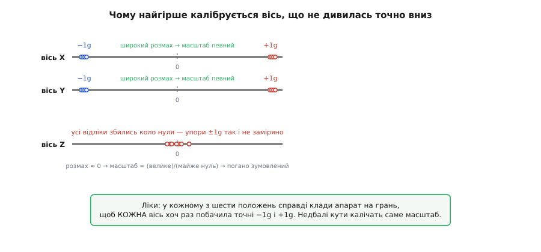

# ⚙️ Код калібрування акселерометра: із шести векторів — зсув і масштаб кожної осі

У самій темі ми домовилися про суть: гравітація править за безкоштовний еталон, шість положень дають кожній осі по два відліки (вгору й униз), а два відліки — рівно стільки, скільки треба, щоб знайти зсув і масштаб осі. Там ми лишили відкритим **як**: як зі шести знятих векторів прошивка справді розв'язує ці числа й чому одна вісь щоразу виходить гірше за інші. Пройдемо це кодом — від збору відліків до пастки, що не дає застосувати напівзаписані коефіцієнти.

Це не блок-схема для звіту. Це той шар, який крутиться в реальному автопілоті: цикл, що чекає, поки оператор поставить апарат на грань і завмре, усереднювач, що топить шум давача, розв'язувач, що з усередненого вектора добуває зсув і масштаб, і — найпідступніше — мітка, яка гарантує, що в польоті ніколи не спрацює половина калібрування. Загальний двоточковий калібрувальний автомат ми вже [розібрали кодом на прикладі одного давача](root:embedded/calibration-procedure/proj-cal-coeffs.md) — там FSM, усереднення, запис у flash із `magic` і CRC. Тут не переписуємо ту машинерію, а показуємо, що в ній **специфічно акселерометрового**: три осі одразу, гравітація замість гир, і геометрія, від якої одна вісь калібрується гірше.

## Задача

Сформулюймо точно, чим має керувати прошивка. Акселерометр — тривісний: кожне читання дає **вектор** із трьох сирих чисел (по осях X, Y, Z), уже переведених у м/с² трактом давача, але ще з **сталою похибкою** кожної осі. Ця похибка двоскладова, як ми й розкладали в темі калібрування: **зсув** (англ. *offset*, bias) — вісь показує не нуль, коли має показувати нуль, — і **масштаб** (англ. *scale*, gain) — розмах між «повний плюс» і «повний мінус» не той, що має бути. Мета калібрування — знайти для кожної осі ці два числа так, щоб виправлений вектор на нерухомому апараті мав довжину рівно 1g (9.80665 м/с²), хоч куди апарат поверни.

Що є під рукою:

- **сирий вектор давача** — функція, що повертає черговий `{ax, ay, az}` у м/с², уже без нашого втручання (тракт IMU й фільтр — окрема історія);
- **рішення оператора** — він ставить апарат на кожну з шести граней і на кожній тисне «зняти»; прошивка не знає наперед, коли й у якому порядку;
- **відома величина еталона** — 1g, та сама на кожній грані, лише напрям крутиться разом з апаратом;
- **параметри** — куди наприкінці лягають `INS_ACCOFFS_X/Y/Z` (зсуви, м/с²) і `INS_ACCSCAL_X/Y/Z` (масштаби, безрозмірні).

Завдання: провести апарат від «акселерометр некалібрований» до «шість коефіцієнтів лежать у параметрах і застосовуються в кожному читанні» — і за будь-якої негаразди (оператор смикнув апарат під час зняття, поставив недбало, живлення пропало посеред запису) не отруїти ні наявне калібрування, ні політ. По ходу прошивка мусить:

- усереднити **багато** відліків на кожній грані, а не вірити поодинокому — інакше шум давача осяде прямо в зсув і масштаб;
- відкинути грань, знятту в русі: якщо під час усереднення вектор «дрижить», прискорення руху додалося до тяжіння й точку зіпсовано;
- з шести усереднених векторів розв'язати шість чисел — трьома окремими парами (найпростіший шлях) або спільною підгонкою (точніше);
- перевірити результат на здоровий глузд (масштаб близький до 1, зсув менший за g) і лише тоді записати з міткою й контрольною сумою;
- ніколи не застосувати півзаписаний набір — на старті підняти коефіцієнти, а якщо мітка не збіглась, чесно вважати себе некаліброваним.

Звучить як купа перевірок. Але ядро компактне: збирач векторів, розв'язувач на кілька рядків і той самий захисний ритуал запису, що й у загальному калібруванні.

## Ідея: два відліки на вісь — це два рівняння

Пригадаймо геометрію з теми. Постав апарат так, щоб вісь Z дивилася точно вгору — вона відчуває **−1g** (тяжіння тягне «в мінус» осі). Переверни на спину — Z дивиться вниз, відчуває **+1g**. Ці два положення дали осі Z дві відомі точки: сире число `raw_up`, що відповідає істинним −1g, і `raw_down`, що відповідає +1g. Далі — чиста двоточкова арифметика, яку ми вже виводили: пряма через дві відомі точки.

Модель осі проста: справжнє прискорення `a` пов'язане із сирим числом `raw` зсувом `o` і масштабом `s`:

```
a = (raw − o) · s
```

Тобто спершу віднімаємо зсув (зсуваємо нуль на місце), тоді множимо на масштаб (розтягуємо розмах до правильного). Підставмо дві відомі точки осі Z:

```
−g = (raw_up   − o) · s      (вісь дивиться вгору)
+g = (raw_down − o) · s      (вісь дивиться вниз)
```

Два рівняння, два невідомі — розв'язується в лоба. Додай їх — і `s` скоротиться, лишивши зсув:

```
−g + g = (raw_up + raw_down − 2o) · s
0 = (raw_up + raw_down − 2o) · s
o = (raw_up + raw_down) / 2
```

Зсув — це просто **середина** двох відліків: точка, симетрична між «повний плюс» і «повний мінус», де істинне прискорення нуль. Красиво й очікувано. Тепер відніми рівняння, щоб дістати масштаб:

```
+g − (−g) = (raw_down − raw_up) · s
2g = (raw_down − raw_up) · s
s = 2g / (raw_down − raw_up)
```

Масштаб — це **скільки істинного розмаху (2g) припадає на одиницю сирого розмаху** (`raw_down − raw_up`). Якщо давач ідеальний, `raw_down − raw_up` уже дорівнює 2g і масштаб виходить 1; реально він трохи більший чи менший за одиницю (ArduPilot затискає його в 0.8…1.2 — за межами явно щось не так із зняттям).

> 🔧 **Навіщо це.** Оці дві формули — `o = (raw_up+raw_down)/2` і `s = 2g/(raw_down−raw_up)` — і є вся суть калібрування осі. Усе інше в коді (усереднення, автомат, мітка) обслуговує їх: постачає чесні `raw_up`/`raw_down` і безпечно зберігає результат. Зрозумів ці два рядки — зрозумів, що станція насправді робить за десять секунд «шести положень».

Осей три, тож формул теж три — по парі на X, Y, Z. Але тут криється підступ, до якого ми повернемось: щоб застосувати цю пару до осі, ця вісь мусила **побачити обидва свої упори** — і вгору, і вниз. Дві осі це зроблять природно, а от третя за всі шість положень може так і не глянути точно вниз. Спершу — код збору й простого розв'язку, потім розберемо цю пастку.

## Код: збір шести векторів

Спершу структура, що тримає стан калібрування, і збирач одного положення. Оператор поставив апарат на грань, завмер, натиснув — прошивка усереднює потік векторів і заразом стежить, щоб апарат не рухався.

```cpp
#include <stdint.h>
#include <math.h>

#define GRAVITY_MSS   9.80665f     // еталон: величина тяжіння, м/с²
#define ACC_SAMPLES   400          // скільки відліків усереднюємо на грань (~кілька секунд @ сотні Гц)
#define ACC_MOVE_TOL  0.35f        // поріг «апарат рухається», м/с²

typedef struct { float x, y, z; } vec3_t;

// сирий вектор акселерометра, м/с² (уже з тракту IMU, ще некалібрований)
extern vec3_t accel_read_raw(void);

// Усереднити ACC_SAMPLES відліків на одній грані.
// Повертає true й кладе середнє в *out, якщо апарат був нерухомий;
// false — якщо під час зняття вектор «дрижав» (рух зіпсував би точку).
static bool accel_capture_face(vec3_t *out)
{
    vec3_t sum = {0, 0, 0};
    vec3_t vmin = { +1e9f, +1e9f, +1e9f };
    vec3_t vmax = { -1e9f, -1e9f, -1e9f };

    for (int i = 0; i < ACC_SAMPLES; i++) {
        vec3_t s = accel_read_raw();
        sum.x += s.x;  sum.y += s.y;  sum.z += s.z;
        // заразом стежимо за розкидом — це детектор руху
        if (s.x < vmin.x) vmin.x = s.x;   if (s.x > vmax.x) vmax.x = s.x;
        if (s.y < vmin.y) vmin.y = s.y;   if (s.y > vmax.y) vmax.y = s.y;
        if (s.z < vmin.z) vmin.z = s.z;   if (s.z > vmax.z) vmax.z = s.z;
        delay_one_sample();            // чекаємо наступний відлік давача
    }

    // якщо хоч по одній осі розкид більший за поріг — апарат рухався, точка бита
    if ((vmax.x - vmin.x) > ACC_MOVE_TOL ||
        (vmax.y - vmin.y) > ACC_MOVE_TOL ||
        (vmax.z - vmin.z) > ACC_MOVE_TOL) {
        return false;
    }

    out->x = sum.x / ACC_SAMPLES;
    out->y = sum.y / ACC_SAMPLES;
    out->z = sum.z / ACC_SAMPLES;
    return true;
}
```

Зверни увагу на детектор руху. Ми не міряємо «швидкість» апарата — це акселерометр, він швидкості не знає. Ми міряємо **розкид** сирого вектора за час зняття: якщо апарат справді лежить, усі 400 відліків майже однакові (дрижить лише шум, десяті долі м/с²), і `max − min` малий. Смикнеш апарат — і в потоці з'явиться сплеск прискорення, розкид вистрибне за поріг, і функція чесно відмовляє: краще перезняти грань, ніж усереднити тяжіння разом з паразитним ривком. Це та сама вимога «завмерти», що станція показує написом, тільки на боці коду.

Тепер зовнішній цикл: провести оператора крізь шість граней і зібрати шість векторів.

```cpp
// шість положень у фіксованому порядку — рушій знатиме, який вектор до якого належить
enum { FACE_LEVEL, FACE_LEFT, FACE_RIGHT, FACE_NOSEDOWN, FACE_NOSEUP, FACE_BACK, N_FACES };

static const char *face_prompt[N_FACES] = {
    "рівно (Z вгору)", "на лівий бік", "на правий бік",
    "носом униз",      "носом угору",  "на спину (Z вниз)"
};

// Зібрати всі шість усереднених векторів. samples[i] — грань i.
static bool accel_collect_six(vec3_t samples[N_FACES])
{
    for (int f = 0; f < N_FACES; f++) {
        gcs_prompt(face_prompt[f]);       // «поставте апарат …» на станцію
        wait_operator_click();            // оператор поставив і натиснув «зняти»

        // перезнімаємо доти, доки грань не знято нерухомо
        while (!accel_capture_face(&samples[f])) {
            gcs_prompt("апарат рухався — завмріть і натисніть ще раз");
            wait_operator_click();
        }
    }
    return true;
}
```

Порядок граней тут фіксований не з примусу фізики — рушію байдуже, спершу «рівно» чи спершу «на спину». Фіксуємо, щоб код **знав**, який зі шести зібраних векторів на яку грань: коли пізніше треба взяти «Z дивилась угору» і «Z дивилась униз», ми беремо `samples[FACE_LEVEL]` і `samples[FACE_BACK]` за іменами, а не вгадуємо. Оператор ставить у зручному йому порядку — але станція просить грані одну за одною саме в цьому.

## Код: простий розв'язок — окремо по осях

Найпростіший шлях — рівно той, що ми вивели: для кожної осі взяти те положення, де вона дивилась **угору** (бачить −1g), і те, де **вниз** (бачить +1g), і застосувати дві формули. За фіксованого порядку граней ці пари відомі наперед.

```cpp
typedef struct {
    vec3_t offset;   // зсув осей, м/с²   → INS_ACCOFFS_X/Y/Z
    vec3_t scale;    // масштаб осей       → INS_ACCSCAL_X/Y/Z
} accel_cal_t;

// Розв'язати одну вісь із двох відліків: коли вона дивилась угору (−1g) і вниз (+1g).
// raw_up  — сире число цієї осі в положенні, де вісь угору;
// raw_down — сире число цієї осі в положенні, де вісь униз.
static void solve_axis(float raw_up, float raw_down, float *offset, float *scale)
{
    *offset = (raw_up + raw_down) * 0.5f;                 // середина → зсув
    *scale  = (2.0f * GRAVITY_MSS) / (raw_down - raw_up); // 2g / розмах → масштаб
}

// Простий (окремо по осях) розв'язок із шести зібраних векторів.
static bool accel_solve_simple(const vec3_t s[N_FACES], accel_cal_t *cal)
{
    // Яка вісь у якому положенні дивиться вгору/вниз (за нашим порядком граней):
    //   X: носом униз → X угору (−1g);  носом угору → X вниз (+1g)
    //   Y: на лівий бік → Y угору;       на правий бік → Y вниз
    //   Z: рівно        → Z угору;       на спину       → Z вниз
    solve_axis(s[FACE_NOSEDOWN].x, s[FACE_NOSEUP].x,  &cal->offset.x, &cal->scale.x);
    solve_axis(s[FACE_LEFT].y,     s[FACE_RIGHT].y,   &cal->offset.y, &cal->scale.y);
    solve_axis(s[FACE_LEVEL].z,    s[FACE_BACK].z,    &cal->offset.z, &cal->scale.z);

    // здоровий глузд: масштаб має бути близький до 1, зсув — менший за g
    for (int k = 0; k < 3; k++) {
        float sc = (&cal->scale.x)[k];
        float of = (&cal->offset.x)[k];
        if (sc < 0.8f || sc > 1.2f)          return false;   // розмах не той — грань знято криво
        if (fabsf(of) > GRAVITY_MSS)         return false;   // зсув завеликий — щось не так
    }
    return true;
}
```

Оце і є найпростіший, «шкільний» варіант — той, що прямо реалізує виведені формули. Він чесно дає зсув і масштаб кожної осі, і для акуратно знятих шести положень цього цілком досить. Три пастки в ньому вже видно: він бере **лише по два** з шести положень на вісь (решта чотири вектори для цієї осі просто не використані), він **нічого не знає про перекоси** осей одна відносно одної, і — головне — він мовчки припускає, що в положенні «носом униз» вісь X дивилась **точно** вгору. А якщо оператор нахилив апарат на кілька градусів, вісь X у тому положенні бачила не рівно −1g, а трохи менше — і ця недбалість поповзла прямо в масштаб. До цього повернемось у пастках.

> 🔧 **Навіщо це.** Такий per-axis розв'язок — те, що робить «Simple Accel Cal» для великих апаратів, які не покрутиш у руках: одне-два положення, груба поправка зсуву, масштаб лишається одиницею. Для дрібного апарата, який легко перевернути на всі шість граней, є сенс у повнішому розв'язку — він використає **всі** зняті вектори й вирівняє перекоси, а не лише два упори на вісь.

## Ідея повніше: спільна підгонка сфери

Простий розв'язок викидає інформацію: на кожну вісь бере два вектори з шести, решту ігнорує. А кожен зі знятих векторів несе спільне обмеження — **на нерухомому апараті виправлений вектор має довжину рівно 1g**, хоч куди він показує. Це геометрія: якщо нанести всі виправлені вектори точками, вони мусять лягти на **сферу радіуса 1g з центром у нулі**. Некалібрований давач дає натомість зсунуту (через зсуви) і трохи витягнуту (через різні масштаби й перекоси) фігуру — еліпсоїд. Знайти калібрування — це знайти поправку, що поверне еліпсоїд назад у правильну сферу.

Формально шукаємо шість чисел (три зсуви, три масштаби) так, щоб для кожного зі знятих векторів `sᵢ` виправлена довжина якнайкраще дорівнювала g:

```
для кожного i:   ‖ M · (sᵢ − o) ‖  ≈  g

похибка точки:   εᵢ = g − ‖ M · (sᵢ − o) ‖
мінімізуємо:     Σ εᵢ²   (сума квадратів по всіх шести й більше положеннях)
```

де `o` — вектор зсувів, а `M` — діагональна матриця масштабів (по одному на вісь). Це вже не пряма арифметика: невідомі сидять **під нормою вектора**, тож рівняння нелінійне. Розв'язують його **методом Ґауса–Ньютона** — ітеративно: береш поточну здогадку (наприклад, зсуви нуль, масштаби одиниця), лінеаризуєш похибку навколо неї, робиш крок, що зменшує суму квадратів, і повторюєш, доки не зійдеться. Кілька ітерацій — і шість чисел знайдено так, що **всі** вектори враховані разом, а не парами.

Саме цей алгоритм крутиться в ArduPilot. Модель там трохи багатша, ніж наша діагональна: у режимі «axis-aligned ellipsoid» — ті самі шість параметрів (три зсуви + три масштаби, мінімум шість положень), а в режимі повного еліпсоїда — дев'ять (додаються **позаосьові** члени матриці `M`, що ловлять перекіс осей одна відносно одної, мінімум вісім положень). Виправлення застосовується як `corrected = M·(raw + offset)`, а невязка кожної ітерації — рівно `g − ‖M·(sample + offset)‖`. Гаусс-ньютонівський розв'язувач для цієї задачі ArduPilot узяв із роботи Рольфа Шмідта (Rolfe Schmidt), який детально розписав підгонку сфери під відліки давача — це підтверджений факт, посилання на його блог лишилося в коментарях коду інерціального давача. Саме виведення нормальних рівнянь і крок Ґауса–Ньютона — окрема математика, яку загальний [калібрувальний код](root:embedded/calibration-procedure/proj-cal-coeffs.md) розбирає на прикладі одного давача; тут нам важить сам механізм.

```cpp
// Каркас спільної підгонки (Ґаус–Ньютон) — суть, без матричної кухні.
// Мінімізуємо Σ (g − ‖M·(sᵢ − o)‖)² за 6 параметрами: o.{x,y,z}, s.{x,y,z}.
static bool accel_solve_ellipsoid(const vec3_t s[N_FACES], int n, accel_cal_t *cal)
{
    // старт: зсуви нуль, масштаби одиниця
    cal->offset = (vec3_t){0, 0, 0};
    cal->scale  = (vec3_t){1, 1, 1};

    for (int iter = 0; iter < 20; iter++) {
        // 1) для кожного вектора порахувати невязку εᵢ = g − ‖M·(sᵢ − o)‖
        // 2) зібрати якобіан ∂εᵢ/∂(параметри)
        // 3) розв'язати нормальні рівняння JᵀJ·Δp = −Jᵀε (6×6)
        // 4) оновити параметри: p += Δp
        float delta = gauss_newton_step(s, n, cal);   // повертає норму кроку
        if (delta < 1e-6f) break;                     // зійшлося
    }

    // та сама перевірка здорового глузду, що й у простому розв'язку
    for (int k = 0; k < 3; k++) {
        float sc = (&cal->scale.x)[k], of = (&cal->offset.x)[k];
        if (sc < 0.8f || sc > 1.2f || fabsf(of) > GRAVITY_MSS) return false;
    }
    return true;
}
```

Матричну кухню (`gauss_newton_step`) тут згорнуто в один виклик — саме виведення нормальних рівнянь і якобіана належить темі про метод найменших квадратів, а не цьому коду. Важлива ідея: спільна підгонка **використовує всі зняті вектори одразу** й тому стійкіша до недбалості в окремому положенні — похибку однієї грані «розмиває» серед решти, тоді як простий per-axis розв'язок віддав би її цілком у масштаб.

## Куди осідають числа

Хоч простий, хоч спільний розв'язок — на виході ті самі шість чисел, і всі вони лягають у параметри. Зсуви осей — у `INS_ACCOFFS_X/Y/Z` (одиниці м/с², ArduPilot тримає їх у діапазоні −3.5…3.5), масштаби — у `INS_ACCSCAL_X/Y/Z` (безрозмірні, 0.8…1.2). Якщо на платі два IMU, другий отримує дзеркальний набір `INS_ACC2OFFS_*` / `INS_ACC2SCAL_*`, і калібрується так само, зі своїх сирих векторів.

```cpp
// Розкласти пораховані коефіцієнти в параметри автопілота.
static void accel_cal_to_params(const accel_cal_t *cal)
{
    param_set_float("INS_ACCOFFS_X", cal->offset.x);
    param_set_float("INS_ACCOFFS_Y", cal->offset.y);
    param_set_float("INS_ACCOFFS_Z", cal->offset.z);
    param_set_float("INS_ACCSCAL_X", cal->scale.x);
    param_set_float("INS_ACCSCAL_Y", cal->scale.y);
    param_set_float("INS_ACCSCAL_Z", cal->scale.z);
}

// А в робочому циклі кожен сирий вектор проганяється крізь ці числа:
static vec3_t accel_apply(vec3_t raw, const accel_cal_t *cal)
{
    return (vec3_t){
        (raw.x - cal->offset.x) * cal->scale.x,
        (raw.y - cal->offset.y) * cal->scale.y,
        (raw.z - cal->offset.z) * cal->scale.z,
    };
}
```

Оце `accel_apply` — та сама модель `a = (raw − o)·s`, з якої ми почали, лише застосована до трьох осей одразу й у кожному читанні польоту. Уся довга процедура «шести положень» існує тільки заради того, щоб ці шість чисел були чесні: далі апарат мовчки множить на них тисячі разів на секунду й дістає правдивий вектор тяжіння, з якого оцінювач бере крен і тангаж.

## Пастка перша: чому найгірше калібрується вісь, що не дивилась точно вниз

Тепер обіцяне. Розв'язок осі спирається на її розмах — знаменник `raw_down − raw_up`. Масштаб є `2g / (raw_down − raw_up)`: **ділення на розмах**. І тут ховається біда: якщо вісь за все калібрування так і не побачила своїх упорів — не глянула ані точно вгору, ані точно вниз, — її розмах виходить малий, а ділення на малий розмах роздуває будь-яку крихітну похибку відліку в велику похибку масштабу.


*Чому одна вісь виходить гірше. Дві осі природно бачать точні −1g і +1g на своїх гранях — широкий, добре заміряний розмах, і масштаб виходить певний. Третя за всі шість положень може лишатись близько нуля (мала проєкція тяжіння на неї), її упори так і не заміряно, і масштаб рахується як «велике поділити на майже нуль» — погано зумовлена задача, що роздуває шум.*

Уяви: оператор акуратно поставив апарат на чотири бічні грані й на «рівно», але покласти його на спину полінувався або зробив це недбало, під кутом. Тоді осі X і Y кожна побачила по два хороші упори (носом униз/угору, на боки), а вісь Z — лише «рівно» (−1g чисто) і криву «спину», де вона дивилась не точно вниз, а під кутом. У тому кривому положенні Z відчула не +1g, а трохи менше — і її заміряний розмах вийшов **вужчий за справжні 2g**. Формула чесно порахує масштаб більший, ніж треба, щоб «дотягнути» цей вужчий розмах до 2g, — і в польоті вертикальна вісь систематично **перебільшуватиме** прискорення. Найважливіша для висоти вісь — і найкрихкіша до недбалості останнього положення.

Ось той самий підступ у числах:

**Приклад. Крива «спина» роздуває масштаб осі Z.** Хай ідеальний давач у чистих положеннях дав би по осі Z рівно −9.80 і +9.80 м/с². Оператор зняв «рівно» чисто (−9.80), а «спину» — нахиливши апарат на 8° від вертикалі:

```cpp
// «спина» під кутом 8°: вісь Z бачить не +g, а g·cos(8°)
// cos(8°) = 0.9903
float raw_up   = -9.80f;              // «рівно» — знято чисто
float raw_down =  9.80f * 0.9903f;    // = 9.705 — «спина» під кутом, розмах вужчий

// зсув майже не постраждав (похибка майже симетрична коло центру):
float offset = (raw_up + raw_down) * 0.5f;          // = (−9.80 + 9.705)/2 = −0.048
// а масштаб роздувся, бо знаменник менший за справжні 2g:
float scale  = (2.0f * 9.80665f) / (raw_down - raw_up);
//            = 19.6133 / (9.705 − (−9.80)) = 19.6133 / 19.505 = 1.0056
```

Масштаб вийшов 1.0056 замість чесної одиниці — вісь Z тепер завищує будь-яке вертикальне прискорення на пів відсотка. Зсув майже не зачепило (−0.048 замість нуля), бо нахил майже симетрично вкоротив розмах з обох країв. Мораль у геометрії, а не в коді: **вісь, чиї упори заміряно погано, псує саме масштаб**, і найчастіше це вертикальна вісь, бо «на спину» — найнезручніше й найчастіше знехтуване положення. Спільна підгонка сфери тут трохи рятує (бо задіює й бічні грані, де Z теж дає ненульову проєкцію), але фізику не обдуриш: недбале останнє положення калічить результат.

> 🔧 **Навіщо це.** Якщо після калібрування апарат у польоті «плаває» по висоті або оцінювач скаржиться на вертикальне прискорення — перше, що перевіряють, це чи чесно знято положення «на спину» й «рівно». Перекалібрувати, акуратно поклавши апарат точно на кожну грань, часто дешевше за будь-яке копирсання в параметрах. Геометрія зняття важить більше за математику розв'язку.

## Пастка друга: мітка проти півзаписаного калібрування

Друга пастка небезпечніша за криву вісь, бо тиха. Уяви: розв'язок відпрацював, `accel_cal_to_params` пише шість чисел у незалежну пам'ять — і рівно між записом `INS_ACCOFFS_Z` і `INS_ACCSCAL_X` пропадає живлення. У пам'яті лишається **гібрид**: три нові зсуви, старий масштаб X, а решта — сміття. На старті прошивка підніме цей гібрид, не знаючи, що він недописаний, і почне множити сирі вектори на несумісні числа — тихо, без помилки, з абсолютно брехливим горизонтом. Апарат буде впевнений у собі й неправий; це найгірший стан для того, що вміє літати.

Захист — **мітка й перевірка**, той самий прийом, що ми детально розібрали в [загальному калібрувальному коді](root:embedded/calibration-procedure/proj-cal-coeffs.md) з `magic` і CRC. Специфіка тут у порядку: спершу порахуй і перевір **усі** шість чисел у пам'яті-чернетці, і лише переконавшись, що набір повний і осмислений, **одним записом** переклади його в параметри з міткою «повний». Півзаписаний набір не повинен існувати навіть на мить у ролі «чинного».

```cpp
#define ACCEL_CAL_MAGIC  0xACCE1CA1u   // мітка «тут повний, осмислений набір»

typedef struct {
    uint32_t   magic;     // ACCEL_CAL_MAGIC ⟺ набір повний і пройшов перевірки
    accel_cal_t cal;      // шість чисел
    uint32_t   crc;       // контрольна сума полів вище
} accel_cal_store_t;

// Записати калібрування безпечно: спершу перевірки, тоді атомарний запис із міткою.
static bool accel_cal_commit(const accel_cal_t *cal)
{
    // 1) остаточна перевірка: усі шість чисел у розумних межах
    for (int k = 0; k < 3; k++) {
        float sc = (&cal->scale.x)[k], of = (&cal->offset.x)[k];
        if (!isfinite(sc) || !isfinite(of)) return false;   // NaN/inf — розв'язок не зійшовся
        if (sc < 0.8f || sc > 1.2f)         return false;
        if (fabsf(of) > GRAVITY_MSS)        return false;
    }

    // 2) зібрати повний запис із міткою й CRC — у пам'яті, ще не в параметрах
    accel_cal_store_t rec;
    rec.magic = ACCEL_CAL_MAGIC;
    rec.cal   = *cal;
    rec.crc   = crc32(&rec, offsetof(accel_cal_store_t, crc));

    // 3) атомарний запис: або весь запис ляже, або старий лишиться цілим
    //    (подвійний банк / журнал NVS — деталі в загальному калібрувальному коді)
    return nvs_write_atomic(&rec, sizeof(rec));
}

// На старті: підняти калібрування лише якщо мітка й CRC збіглись.
static bool accel_cal_load(accel_cal_t *out)
{
    accel_cal_store_t rec;
    if (!nvs_read(&rec, sizeof(rec)))                       return false;
    if (rec.magic != ACCEL_CAL_MAGIC)                       return false;  // не наш / недописаний
    if (rec.crc != crc32(&rec, offsetof(accel_cal_store_t, crc))) return false;  // побитий
    *out = rec.cal;
    return true;                                            // лише тут набір вважається чинним
}
```

Логіка мітки проста, але залізна: `accel_cal_commit` виставляє `magic` **лише** після того, як усі шість чисел пройшли перевірку, а `crc` рахується по всьому запису — тож будь-яка недописана чи побита копія на старті провалить або перевірку мітки, або CRC. `accel_cal_load` повертає `true` тільки коли обидві збіглись; інакше апарат чесно вважає себе некаліброваним — і саме тут спрацьовує останній бар'єр, [arming-перевірки](topic:sys-dron/arming-checks): немає чинного калібрування — не буде й дозволу зброїтися. Апарат, що знає про свою некаліброваність, не полетить; апарат, що застосував півзаписаний гібрид, полетів би — і це рівно те, чого мітка не дає статися.

Зверни увагу на `isfinite` у перевірці: якщо Ґаус–Ньютон не зійшовся (виродилась геометрія, усі точки збились у грудку), розв'язок може дати `NaN` чи `inf`. Ці значення підступні — порівняння `sc < 0.8f` для `NaN` дає `false`, тож без явної перевірки на скінченність зіпсований масштаб міг би прослизнути крізь діапазонний фільтр. Тому спершу відсіюємо не-числа, і лише тоді — межі.

> 🔧 **Навіщо це.** Мітка й CRC — це різниця між приладом, що десять років не втрачає калібрування, і приладом, що після невдалого запису тихо літає з брехливим горизонтом. Правило універсальне: **набір коефіцієнтів або весь чинний, або весь відсутній — ніколи наполовину.** Виставляй мітку останньою дією, рахуй CRC по всьому запису, і на старті вір лише тому, що обидві перевірки пройшло. Це той самий принцип, що рятує калібрування будь-якого давача, не лише акселерометра.

## Складність і пастки — підсумком

Пройшли шлях від «гравітація — еталон» до робочого коду. Ядро виявилось коротким: збирач векторів із детектором руху, дві формули на вісь (`o = (raw_up+raw_down)/2`, `s = 2g/(raw_down−raw_up)`) або спільна підгонка сфери Ґаусом–Ньютоном, розкладання у `INS_ACCOFFS_*`/`INS_ACCSCAL_*` і захисний запис із міткою. Пастки, які й відрізняють робочий код від навчального:

- **Рух під час зняття.** Смикнув апарат — паразитне прискорення сіло в точку. Ліки — детектор розкиду й відмова перезняти, а не сліпе усереднення.
- **Крива вісь.** Масштаб є ділення на розмах; вісь, чиї упори ±1g заміряно недбало (найчастіше вертикальна, бо «на спину» незручно), дає малий розмах і роздутий масштаб. Ліки геометричні — акуратно класти апарат точно на кожну грань; спільна підгонка пом'якшує, але не скасовує.
- **Простий проти спільного розв'язку.** Per-axis бере два вектори з шести й ігнорує перекоси — швидко, грубо, годиться для «Simple Accel Cal». Спільна підгонка задіює всі вектори й вирівнює осі — точніше, ціною ітеративної математики.
- **NaN з незбіжного розв'язку.** Виродилась геометрія — Ґаус–Ньютон видасть не-число, що прослизне крізь наївний діапазонний фільтр. Ліки — явна перевірка `isfinite` **перед** межами.
- **Півзаписаний набір.** Провал живлення посеред запису лишив би гібрид старих і нових чисел. Ліки — мітка `magic` виставляється останньою, CRC по всьому запису, атомарний запис, і на старті довіра лише повному набору.

Спільна нитка всіх пасток одна: калібрування — не «порахувати формулу», а **чесно постачити їй дані й безпечно зберегти результат**. Формула на два рядки; усе інше в коді стереже, щоб у ці два рядки зайшли правдиві числа, а вийшли — коефіцієнти, яким апарат може довірити свій горизонт.
