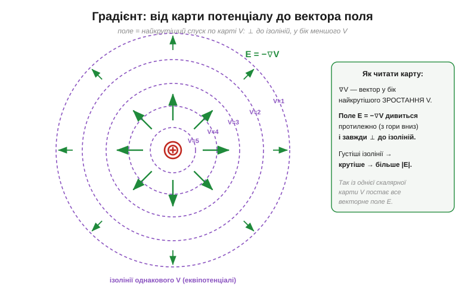

# 🧮 Градієнт: із карти потенціалу — у вектор поля

> Є чудовий образ: [потенціал](topic:ph-electromagnetism/electric-potential) — це **висота** на карті, а [поле](topic:ph-electromagnetism/electric-field) — **найкрутіший спуск** з неї. В одному вимірі це просто E = −ΔV/Δx. Та простір тривимірний, а потенціал — ціла карта V(x, y, z). Як із цієї **скалярної** карти дістати **векторне** поле в кожній точці — куди й як круто воно дивиться? Інструмент зветься **градієнт**.

### Нахил уздовж однієї осі — частинна похідна

Уздовж однієї осі «крутість» — це **похідна** (нахил): наскільки швидко V змінюється з координатою. Але V залежить від трьох координат. «Нахил уздовж x», коли y та z тримаємо нерухомими, звуть **частинною похідною** й пишуть зі стилізованим «d» — ∂V/∂x. Так само ∂V/∂y і ∂V/∂z. Три нахили — по одному на кожну вісь.

### Градієнт — вектор із цих нахилів

Складемо ці три нахили в один вектор — це й є **градієнт** (*gradient*, ∇V, «набла V»):

```
∇V = ( ∂V/∂x ,  ∂V/∂y ,  ∂V/∂z )
```

У нього є дуже наочний зміст: градієнт указує в бік **найшвидшого ЗРОСТАННЯ** V (найкрутіший підйом угору схилом), а його довжина дорівнює тій максимальній крутості. Це не випадковий набір чисел, а стрілка «куди вгору й як круто».

### Поле — це мінус градієнт

Тепер головне для нас. Поле дивиться **вниз** схилом, а не вгору, тому перед градієнтом ставлять мінус:

```
E = −∇V
```


*Карта потенціалу точкового заряду: ізолінії (фіолетові) — кільця однакового V, густіші біля центру. Градієнт ∇V указує вгору схилом (до більшого V), а поле E = −∇V — протилежно, з гори вниз, і завжди ⊥ до ізоліній; де ізолінії густіші, там схил крутіший і |E| більше.*

Це і є точна, кількісна версія «найкрутішого спуску». Знак мінус лише розвертає стрілку: додатний заряд скочується туди, де V менше.

### Чому E завжди ⊥ до еквіпотенціалей

Звідси випливає й сама геометрія [ліній поля](topic:ph-electromagnetism/electric-field). Рухаючись **уздовж** ізолінії, V не змінюється — нахил вздовж неї нульовий. Отже, вся зміна V відбувається **поперек** ізоліній, і градієнт (а з ним і поле) дивиться строго **перпендикулярно** до них. Саме тому лінії поля впираються в провідник під прямим кутом: поверхня провідника — еквіпотенціаль.

**Приклад (повертаємо поле точкового заряду).** Візьмімо [карту потенціалу точкового заряду](topic:ph-electromagnetism/electric-potential) V = k·Q/r. Тут потенціал залежить лише від відстані r, тож градієнт радіальний, а його величина — це нахил V по r:

```
|∇V| = |d/dr (k·Q/r)| = k·Q/r²
E = −∇V  →  |E| = k·Q/r²,  напрямлене радіально від заряду
```

І ось воно — [поле точкового заряду](topic:ph-electromagnetism/electric-field) E = kQ/r² — уже **не** як окрема формула, а як **схил** потенціалу kQ/r. Дві мови, одне явище.

### Де це працює в курсі

Градієнт — це той «місток» між картою висот і полем нахилів: програми електростатики майже завжди рахують спершу **скалярний** потенціал V по всьому простору (одне число в точці — легше), а тоді беруть −∇V, щоб дістати векторне E. І повертається він щоразу, коли постане питання «куди найкрутіше». До речі, той самий −∇ — серце [градієнтного спуску](topic:sf-ml/gradient-descent) в машинному навчанні: нейромережа «скочується» вниз по карті похибки точнісінько так, як заряд по карті потенціалу. Один математичний образ — від електростатики до навчання на борту.
