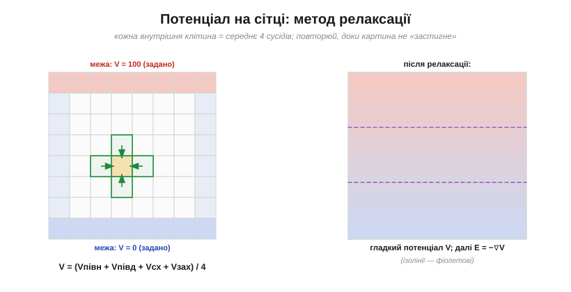

# ⚙️ Потенціал на сітці: метод релаксації для рівняння Лапласа

> Серйозні інструменти спершу рахують [скалярний потенціал](book:physics/electric-potential) V по всьому простору, а вже потім беруть його нахил, щоб дістати поле. Але як той потенціал обчислити, коли акуратної формули немає — геометрія крива, електродів кілька? Напрочуд простим прийомом: **усереднюй сусідів, доки картина не застигне**. Це метод релаксації.

### Задача

Маємо область простору, на межах якої потенціал **заданий**: скажімо, два електроди з відомими напругами й порожнеча між ними. Треба знайти V у кожній точці всередині. У області **без зарядів** потенціал підкоряється рівнянню Лапласа (∇²V = 0). Аналітично його розв'язують лише для простих форм (куля, площина); для довільної геометрії — лише чисельно, на сітці.

### Ідея: потенціал — це середнє сусідів

Ключ — гарна властивість рівняння Лапласа: у області без зарядів потенціал у точці дорівнює **середньому** потенціалу довкола неї. Жодна точка не «стирчить» над сусідами й не «провалюється» під них. Розбивши область на квадратну сітку, цю властивість записують геть просто: кожна внутрішня клітина = **середнє своїх чотирьох сусідів** (зверху, знизу, ліворуч, праворуч).


*Метод релаксації. Ліворуч: на сітці фіксують потенціал на межах (тут верх = 100, низ = 0), а кожну внутрішню клітину раз по раз заміняють середнім її чотирьох сусідів. Праворуч: після багатьох проходів картина «застигає» — виходить гладкий потенціал V, з якого далі беруть поле E = −∇V (див. [вставку про градієнт](root:embedded/field-and-potential/math-gradient.md)).*

Звідси й рецепт: зафіксуй межі, а тоді **знову й знову** проходь по всіх внутрішніх клітинах, заміняючи кожну середнім сусідів. Сітка поступово «розслабляється» (relaxes) до правильного розв'язку.

### Реалізація

Один прохід — це подвійний цикл по внутрішніх клітинах; сітка цілком лежить у пам'яті, а маска `fixed` позначає клітини, яких не чіпаємо (межі та електроди із заданою напругою).

```c
#define NX 32   /* ширина сітки */
#define NY 32   /* висота сітки */

/* Релаксація потенціалу на сітці V[y][x] методом Гаусса–Зейделя.
   fixed[y][x] != 0 — клітина зафіксована (межа чи електрод), її не рухаємо.
   Повертає число зроблених проходів (max_iter, якщо не збіглося). */
int relax(float V[NY][NX], const unsigned char fixed[NY][NX],
          float eps, int max_iter)
{
    for (int iter = 1; iter <= max_iter; ++iter) {
        float delta = 0.0f;                  /* найбільша зміна за прохід */
        for (int y = 1; y < NY - 1; ++y) {
            for (int x = 1; x < NX - 1; ++x) {
                if (fixed[y][x])             /* задані клітини не чіпаємо */
                    continue;
                float avg = 0.25f * (V[y-1][x] + V[y+1][x] +
                                     V[y][x-1] + V[y][x+1]);
                float d = avg - V[y][x];
                if (d < 0.0f)
                    d = -d;                  /* |зміна| */
                if (d > delta)
                    delta = d;
                V[y][x] = avg;               /* пишемо на місці — Гаусс–Зейдель */
            }
        }
        if (delta < eps)                     /* картина застигла — виходимо */
            return iter;
    }
    return max_iter;                         /* ліміт проходів вичерпано */
}
```

Дрібниця з великим наслідком: якщо брати сусідів зі **старої** копії сітки (окремий буфер) — це метод Якобі; якщо одразу писати в ту саму сітку (як вище) — це Гаусс–Зейдель, і він збігається приблизно вдвічі швидше.

### Чому це працює

У «застиглому» стані кожна внутрішня точка вже дорівнює середньому сусідів — а це і є дискретна форма ∇²V = 0. Тобто релаксація шукає саме той розподіл, де потенціал ніде не «горбатиться» без причини, — єдиний, що його допускає фізика порожнечі. А коли V знайдено, поле беруть кінцевими різницями: E ≈ −(різниця V між сусідніми клітинами)/(крок сітки).

### Складність і пастки на МК

- **Пам'ять.** Треба тримати всю сітку: N клітин × число. Дрібна сітка (для точності) може не влізти в маленький мікроконтролер — беруть грубшу або переходять на цілочисельну (fixed-point) арифметику.
- **Збіжність повільна.** Базова релаксація потребує багато проходів (тим більше, чим дрібніша сітка). Гаусс–Зейдель пришвидшує вдвічі, а **надрелаксація** (SOR: домножуй поправку на ω ≈ 1.5–1.9) — у рази. Без цього на МК можна чекати дуже довго.
- **Не затирай межі.** Після кожного проходу межові клітини мусять лишатися заданими — інакше розв'язок «попливе».
- **Завжди став поріг ε і ліміт ітерацій**, бо інакше цикл ризикує не завершитися ніколи.

### Де ще це трапляється

Те саме «усереднюй, доки не застигне» описує дифузію тепла (∇²T = 0), розмиття зображення й згладжування сіток у графіці. Один невибагливий патерн — а працює всюди, де величина мусить дорівнювати середньому свого околу.
