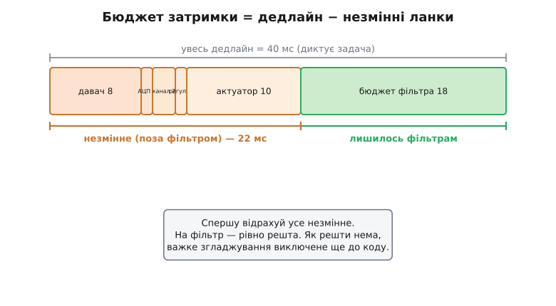
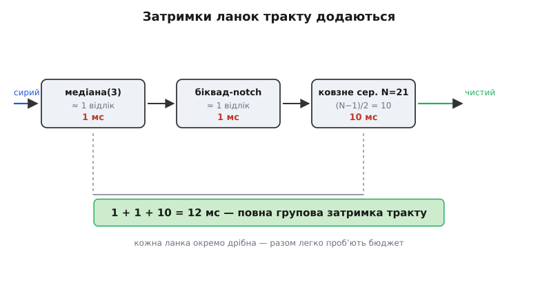
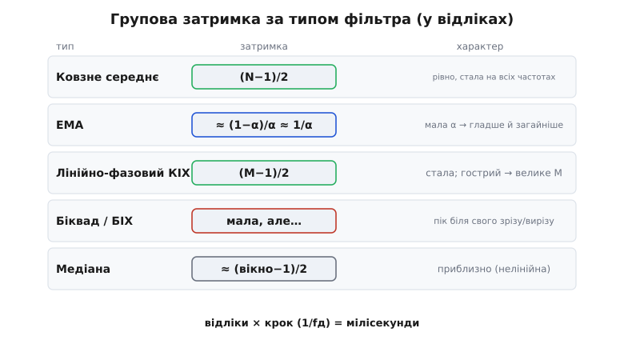
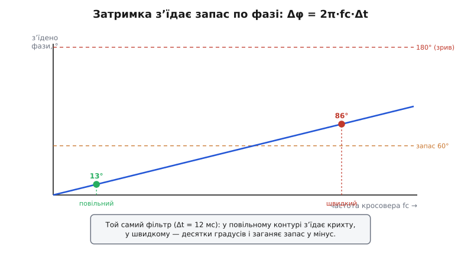

# Бюджет затримки фільтра

Дотепер затримку фільтра ми зважували по **одному фільтру за раз**. [Закон згладжування-затримки](topic:algorithms/smoothing-vs-lag) сказав, що за чистоту платять часом і що силу фільтра обмежує допустиме запізнення. [Запас стійкості](root:embedded/loop-stability) пояснив, *чому* це запізнення таке небезпечне в контурі: зайва затримка з'їдає запас по фазі й розгойдує систему. А [специфікація фільтра](root:embedded/filter-specification) навіть навчила рахувати затримку наперед — груповою затримкою, ще не написавши коду.

Та в реальному пристрої сигнал ніколи не проходить **один** фільтр. Він проходить **ланцюг**: давач, дріт, АЦП, медіана проти викидів, біквад проти мережі, згладжувач проти шуму, можливо канал зв'язку, далі регулятор і нарешті виконавчий орган. Кожна ланка щось затримує. І питання, яке вирішує цей крок, — не «скільки затримує **цей** фільтр», а «скільки затримки **назбирується по всьому шляху** і чи влазить вона в час, який нам дано».

Це і є **бюджет затримки** (англ. *latency budget* — кошторис запізнення): спершу чесно назвати, **скільки часу** в нас усього є від події до реакції, тоді **відняти** все, що з'їдають ланки, на які ми не впливаємо, — і лише **залишок** віддати фільтрові. Не «який фільтр найкращий», а «який фільтр **влазить** у те, що лишилося». Хто ставить фільтр, не склавши цей кошторис, рано чи пізно отримує тиху, гладку — і безнадійно запізнілу систему.

## Звідки взагалі береться дедлайн

Перш ніж щось ділити, треба знати **скільки всього**. Бюджет затримки завжди починається з одного числа — **дедлайну** (англ. *deadline* — крайній строк): найбільшого запізнення, яке система ще терпить, лишаючись справною. Це число не вигадують — його **диктує задача**, і джерел у нього зазвичай три.

**Перше джерело — контур керування.** Якщо величина годує регулятор (кут із [IMU](topic:electronics/imu) у стабілізації, температура в нагрівачі, напруга в перетворювачі), то дедлайн диктує **запас по фазі**. Затримка фільтра — це чисте фазове відставання в петлі, а воно [прямо віднімається від запасу](root:embedded/loop-stability) на частоті кросовера. Перевищили дедлайн — запас пішов у мінус, контур задзвенів. Тут дедлайн найжорсткіший і найважливіший.

**Друге джерело — свіжість для рішення.** Якщо величина йде не в петлю, а в **разове рішення** (далекомір каже «гальмуй», детектор каже «ось ціль»), дедлайн диктує те, **наскільки пізно** ще не запізно зреагувати. Робот на 1 м/с, що мусить спинитися за 20 см до перешкоди, дає цілком конкретну стелю на весь тракт «побачив → загальмував».

**Третє джерело — поєднання давачів.** Коли кілька потоків зливають докупи ([комплементарний фільтр](topic:algorithms/complementary-filter), [Калман](topic:algorithms/kalman-filter)), кожен має прийти **синхронно**: якщо акселерометр відстає на 5 мс, а гіроскоп — на 50, оцінювач складає речі з **різних моментів часу** й видає хибу навіть із бездоганних давачів. Тут дедлайн — це допустиме **розходження** затримок між каналами, не лише їхня абсолютна величина.

> 🔧 **Навіщо це.** Найперше, що зробіть перед будь-яким фільтром, — **назвіть дедлайн числом** і запишіть його поряд із кодом. Не «має бути швидко», а «бюджет 40 мс, бо контур крену має запас по фазі лише на цій затримці». Поки дедлайн не названо, ви не фільтр налаштовуєте, а вгадуєте; назвавши його, ви перетворюєте всю подальшу роботу на просте віднімання.

## Бюджет — це віднімання

Маючи дедлайн, бюджет складають як касовий: є дохід (увесь дедлайн), є обов'язкові витрати (ланки, яких не уникнути), і є **залишок** — те, що можна витратити на фільтр. Уся арифметика — одне віднімання.

Витрати поділяються на дві купи. **Незмінні** — те, на що ви фільтром не впливаєте: затримка самого давача, перетворення в АЦП, передача каналом, такт обчислень регулятора, інерція виконавчого органу. **Змінні** — те, чим ви керуєте: сила й кількість фільтрів у тракті. Бюджет каже: спершу вирахуй усе незмінне, а на фільтр лишається **рівно решта**.


*Бюджет затримки — це віднімання. Уся смуга — дедлайн, що його диктує задача. Від нього відраховують незмінні витрати (давач, АЦП, канал, такт регулятора, виконавчий орган) — на них фільтр не впливає. Те, що лишилось (зелене), — бюджет, який можна віддати фільтрам. Якщо незмінне вже з'їло весь дедлайн, на фільтр не лишається нічого — і це теж відповідь.*

Подивимось на цю арифметику в дії. Хай контур стабілізації дає дедлайн 40 мс (за цей час фаза петлі ще лишає прийнятний запас). Випишімо, що з нього з'їдають незмінні ланки:

```
дедлайн (з запасу по фазі):           40 мс
− затримка давача (IMU, внутр. фільтр): 8 мс
− перетворення АЦП + DMA:              1 мс
− канал до регулятора (SPI, буфер):    2 мс
− такт обчислень регулятора:           1 мс
− відгук виконавчого органу (мотор):  10 мс
─────────────────────────────────────────
лишилось на ВЕСЬ цифровий фільтр:     18 мс
```

Вісімнадцять мілісекунд — оце і є **бюджет фільтра**, і жодне «хочу чистіше» не може його перевищити. Половину дедлайну з'їли речі, яких ми навіть не торкаємось, — і це типово, а не виняток. Найчастіша помилка новачка — дивитися лише на свій фільтр, наче решта тракту безплатна; кошторис змушує побачити **весь** шлях.

> 🔧 **Навіщо це.** Перш ніж питати «яке вікно взяти», спитайте «скільки мені **лишилось** після незмінних ланок». Часто виявляється, що давач і мотор уже з'їли стільки, що на фільтр є якихось кілька мілісекунд — і тоді важке згладжування виключене **до** будь-яких експериментів. Кошторис рятує від тижня налаштування фільтра, який у принципі не міг влізти.

## Затримки додаються

Тепер ключове, чим цей крок відрізняється від усього попереднього. Коли фільтрів у тракті **кілька** — а так буває майже завжди, бо [різні біди давача лікують різними ланками](root:embedded/fir-vs-iir), — їхні затримки **просто додаються**. Послідовно поставлені лінійні ланки зсувають сигнал у часі **по черзі**, тож загальна групова затримка тракту — це **сума** групових затримок усіх ланок.

Це звучить очевидно, але саме тут ховається найтихіша пастка проєктування. Кожна ланка окремо виглядає невинно: медіана(3) — «та це ж лише один відлік», біквад — «частки відліку», згладжувач — «ну хай 10 відліків». А складені докупи, ці «невинні» затримки несподівано пробивають бюджет — бо ніхто не дивився на **суму**.


*Затримки складаються по черзі. Сигнал проходить медіану, біквад і згладжувач один за одним, і кожна ланка зсуває його в часі. Повна групова затримка тракту — арифметична сума затримок усіх ланок. Кожна окремо здається дрібною; разом вони легко пробивають бюджет — тому рахувати треба не ланку, а весь ланцюг.*

Покажемо складання на числах. Той самий тракт давача на 1 кГц (крок 1 мс): медіана(3) проти рідких збоїв шини, біквад-notch проти наводки 50 Гц, ковзне середнє вікном 21 проти дрібного шуму. Складемо групові затримки:

```
крок дискретизації:  1 мс  (fд = 1 кГц)

медіана(3):          ≈ 1 відлік        →  1 мс   (мусить побачити сусіда викиду)
біквад-notch 50 Гц:  ≈ 1 відлік        →  1 мс   (мала, але біля 50 Гц помітна)
ковзне середнє N=21: (21−1)/2 = 10     → 10 мс
─────────────────────────────────────────────────
сума групової затримки тракту:          12 мс
```

Дванадцять мілісекунд — і це **вкладається** в наш бюджет 18 мс, але із запасом лише 6 мс. Якби ми, не рахуючи, взяли «для чистоти» вікно 41 замість 21, лише ця ланка дала б 20 мс — і весь тракт пробив би бюджет, ще не порахувавши інших. Складати треба **до** того, як вибирати силу, а не виявляти перевищення на готовому пристрої по дзвону мотора.

Один важливий нюанс про додавання. Чесно додаються затримки **лінійних** ланок (ковзне середнє, EMA, біквад, КІХ). [Медіана](topic:algorithms/median-filter) — нелінійна, її «групова затримка» — поняття приблизне (вона не зсуває сигнал однаково на всіх частотах), але на практиці її рахують як ≈ (вікно−1)/2 відліку, і для оцінки бюджета цього досить. Головне — **не забути** її в сумі: дуже легко полічити лінійні ланки й проґавити медіану, бо вона «просто вибиває викиди».

## Скільки затримує кожен тип

Щоб складати тракт, треба знати затримку кожної цеглинки. Зведімо це в одну довідку — групова затримка для всіх типів, із якими ми вже знайомі. Усі числа — у **відліках**; у мілісекунди їх переводить множення на крок дискретизації (1/fд).


*Групова затримка за типом фільтра, у відліках. Ковзне середнє — рівно (N−1)/2. EMA — приблизно (1−α)/α, тобто ≈ 1/α для малих α. Лінійно-фазовий КІХ — рівно (M−1)/2, де M — кількість відводів. Біквад/БІХ — мала на більшості частот, але різко зростає біля свого зрізу чи вирізу. Медіана — приблизно (вікно−1)/2, нелінійна. Помножте відліки на крок 1/fд — і матимете мілісекунди.*

Розберімо кожен рядок, бо за формулами стоять різні характери.

**Ковзне середнє: рівно (N−1)/2 відліку.** Найчесніший і найпередбачуваніший випадок — центр ваги рівного вікна лежить точно посередині, тож вихід відстає рівно на пів-вікна. Подвоїли вікно — подвоїли затримку, лінійно й без сюрпризів. Саме за цю передбачуваність [ковзне середнє](topic:algorithms/moving-average) і люблять там, де затримку треба знати точно.

**EMA: приблизно (1−α)/α відліку.** [Експоненційне середнє](topic:algorithms/ema) не має скінченного вікна, тож його затримку рахують як групову затримку на низьких частотах — вона дорівнює (1−α)/α відліку, а для типових малих α це майже 1/α. Тобто α=0.1 дає затримку близько 9 відліків, α=0.2 — близько 4. Це та сама стала часу τ≈1/α, лише названа мовою затримки: менша α — гладкіше й загайніше, одне число описує обидва боки компромісу.

**Лінійно-фазовий КІХ: рівно (M−1)/2 відліку**, де M — кількість відводів. Це настільки ж тверде число, як у ковзного середнього (бо ковзне середнє і є найпростіший КІХ), і воно **стале на всіх частотах** — саме тому лінійна фаза [не спотворює форму](root:embedded/fir-vs-iir): усі частоти зсуваються однаково. Розплата за це — для гострого фільтра M велике (сотні відводів), а отже й затримка велика: [гострий notch на КІХ — це сотні відліків запізнення](root:embedded/fir-vs-iir). Стала затримка КІХ — це геометричний факт симетрії його коефіцієнтів, перевірений у будь-якому курсі цифрової обробки.

**Біквад (БІХ): мала на більшості частот — але підступна біля зрізу.** Ось де довідка вимагає обережності. [БІХ](topic:algorithms/iir-filter) загалом затримує менше за КІХ тієї самої гостроти — за це його й беруть у тісну петлю. Але його затримка **не стала**: вона мала далеко від зрізу й **різко зростає піком** саме біля частоти зрізу чи вирізу. Тому notch-біквад на 50 Гц майже не затримує корисний сигнал на 5 Гц — а от компоненти близько 50 Гц він зсуває помітно. Для бюджета беруть затримку на **робочій смузі** сигналу, не біля вирізу; це чесніша оцінка, ніж одне «середнє» число.

**Медіана: приблизно (вікно−1)/2 відліку.** Як уже мовлено, число наближене, бо медіана нелінійна, але для кошторису його досить: медіана(3) ≈ 1 відлік, медіана(5) ≈ 2. Дешева ланка й за затримкою теж.

> 🔧 **Навіщо це.** Тримайте цю довідку перед очима, складаючи тракт. Дві формули покривають дев'ять десятих випадків: **(N−1)/2** для всього з рівним вікном (ковзне середнє, КІХ) і **≈1/α** для EMA. Біквад — особливий: не вірте його «малій затримці» наосліп, перевірте її саме на частотах вашого сигналу, бо біля зрізу вона стрибає. Одна неврахована ланка — і весь кошторис бреше.

## Зворотна задача: скільки фільтра влазить

Тепер найкорисніше. Досі ми **складали** готовий тракт і дивились, чи влазить. Та частіше задача стоїть навпаки: бюджет відомий, незмінні ланки відомі — **яку силу фільтра можна собі дозволити?** Це проста зворотна задача: лишок бюджета прирівняти до групової затримки й розв'язати щодо вікна чи α.

Так специфікація з [попереднього кроку](root:embedded/filter-specification) замикається з реальністю: там ми називали бажану крутість і глибину придушення, а тут бюджет каже, **чи дозволяє затримка** взагалі стільки відводів. Буває, що специфікація просить порядок, чия затримка не влазить у дедлайн, — і тоді доводиться або послаблювати специфікацію, або міняти сімейство, або піднімати частоту дискретизації.

**Скільки відліків можна усереднити.** Бюджет фільтра — 18 мс (з кошторису вище), із них медіана(3) і біквад уже з'їли 2 мс. На ковзне середнє лишається 16 мс; крок 1 мс. Знайдімо найбільше вікно:

```c
// зворотна задача: яке вікно ковзного середнього влазить у залишок бюджета?
float budget_ms   = 18.0f;   // бюджет на весь цифровий фільтр
float spent_ms    = 2.0f;    // медіана(3) + біквад уже витратили
float dt_ms       = 1.0f;    // крок дискретизації (1/fд)

float left_ms     = budget_ms - spent_ms;      // 16 мс лишилось ковзному середньому
float left_samp   = left_ms / dt_ms;           // 16 відліків групової затримки
int   N_max       = (int)(2.0f * left_samp + 1.0f);   // (N−1)/2 ≤ left → N ≤ 2·left+1
// N_max = 33: ширше вікно вже пробʼє бюджет
```

Тридцять три відліки — стеля, і це число ми знаємо **до** будь-якого коду фільтрації, з самого віднімання. Якщо тридцять три відліки не дають потрібної чистоти (шум спадає лише як √N), — це чесний сигнал, що задачу простим усередненням у цьому бюджеті не розв'язати, і час по [хитріші засоби](topic:algorithms/smoothing-vs-lag): частіша вибірка, частотний фільтр чи передбачення.

**Яку α можна взяти для EMA.** Та сама логіка для EMA. Хай давач довкілля, бюджет на згладжування — 200 мс, крок 10 мс (опитування 100 Гц):

```c
// зворотна задача для EMA: найменша α (найсильніше згладжування), що влазить
float budget_ms = 200.0f;
float dt_ms     = 10.0f;
float left_samp = budget_ms / dt_ms;     // 20 відліків групової затримки дозволено
float alpha_min = 1.0f / (left_samp + 1.0f);   // (1−α)/α ≤ 20 → α ≥ 1/21 ≈ 0.048
// беремо α ≈ 0.05: сильніше згладжувати бюджет не дозволяє
```

Менша α дала б гладкіше, але вже виповзла б за 200 мс. Зворотна задача завжди впирається в ту саму стіну: бюджет ставить **жорстку межу** силі фільтра, і всередині неї ви вибираєте найкращу чистоту, яку дозволено, — а не найбільшу, яку хочеться.

> 🔧 **Навіщо це.** Звикніть рахувати фільтр **від бюджета вниз**, а не від чистоти вгору. Спершу — скільки відліків (чи яка α) влазить у залишок; тоді — чи вистачає цього проти вашого шуму. Якщо вистачає — чудово, беріть найслабше з достатнього. Якщо ні — не нарощуйте силу за межу бюджета (це посадить фільтр-шкідник), а додавайте **інформацію**: частіше опитуйте, ставте крутіший частотний фільтр чи переходьте до оцінювача з моделлю.

## Затримка — це з'їдений запас по фазі

Лишилось пов'язати кошторис із [запасом стійкості](root:embedded/loop-stability), бо саме там затримка фільтра карає найболючіше. Коли величина годує контур, групова затримка фільтра — не просто «запізнення показу». Це **чисте фазове відставання**, що додається до петлі й **віднімається від запасу по фазі** рівно на частоті кросовера.

Згадаймо механізм. Затримка стала **в секундах**, але в **градусах** фази вона тим більша, чим вища частота: Δφ = 2π·fc·Δt, де fc — частота кросовера. Тобто та сама затримка фільтра з'їдає більше запасу в **швидкому** контурі (висока fc) і менше — у повільному. Ось чому фільтр, безневинний у термостаті, стає вбивцею в контурі крену дрона: там частота кросовера в сотні разів вища, і ті самі мілісекунди обертаються десятками градусів утраченого запасу.

**Скільки запасу з'їдає фільтр.** Контур крену з частотою кросовера fc = 20 Гц. Скільки запасу по фазі забере ковзне середнє з груповою затримкою 12 мс?

```
Δφ = 2π · fc · Δt = 2π · 20 · 0.012
   = 2π · 0.24 рад
   ≈ 1.51 рад
   ≈ 86°  з'їденого запасу по фазі
```

Вісімдесят шість градусів! Якщо контур мав типовий запас 60°, цей фільтр не просто його з'їв — він **загнав запас глибоко в мінус**, і система гарантовано задзвенить. Те саме число 12 мс, що виглядало невинно в кошторисі затримки, у мові фази обертається вироком для швидкого контуру. Ось чому бюджет затримки для контуру керування рахують **не в мілісекундах саме по собі**, а через те, **скільки градусів** запасу вони коштують на робочій частоті.


*Та сама затримка — різна ціна. Групова затримка фільтра, стала в мілісекундах, у градусах фази зростає з частотою кросовера: Δφ = 2π·fc·Δt. У повільному контурі (мала fc) фільтр з'їдає крихту запасу; у швидкому (велика fc) — ті самі мілісекунди з'їдають десятки градусів і заганяють запас у мінус. Тому дедлайн фільтра для контуру міряють не в часі, а в з'їденому запасі по фазі.*

Звідси й правильний спосіб ставити дедлайн для керування. Не «фільтр має бути швидшим за стільки-то мілісекунд», а «фільтр сміє з'їсти не більше стількох градусів запасу». Маючи частоту кросовера й допустиму втрату запасу (скажімо, готові віддати 15° із наявних 60°), дедлайн затримки виводять зворотно — і вже від нього будують увесь кошторис:

```
дозволено зʼїсти:   Δφ = 15° = 0.262 рад
частота кросовера:  fc = 20 Гц
дедлайн затримки:   Δt = Δφ / (2π·fc) = 0.262 / (2π·20) ≈ 2.1 мс
```

Лише дві мілісекунди на **весь** цифровий фільтр у такому швидкому контурі! Це повністю виключає важке згладжування й лишає хіба легку медіану та зовсім дешеву EMA — рівно той висновок, до якого ми дійшли [рецептом для IMU в керуванні](root:embedded/choosing-a-filter): свіжість понад чистоту. Тепер цей рецепт перестав бути порадою на око — він **порахований** із запасу по фазі.

> 🔧 **Навіщо це.** Для фільтра в контурі керування ставте дедлайн **у градусах запасу**, не в мілісекундах. Дізнайтеся частоту кросовера контуру, вирішіть, скільки запасу готові віддати фільтрові, і переведіть це у дозволену затримку через Δt = Δφ/(2π·fc). У швидкому контурі це число виходить таким мізерним, що рятує вас від спокуси «трохи згладити»: ви наперед бачите, що навіть невеликий фільтр з'їсть половину запасу, — і не садите його.

## Уся думка — один кошторис

Зведімо весь крок в одну послідовність, бо це не набір прийомів, а єдина процедура думки.

Спершу — **назви дедлайн** числом, із правильного джерела: контур (через запас по фазі), свіжість рішення чи синхронність поєднання. Тоді — **відніми незмінне**: давач, АЦП, канал, такт регулятора, виконавчий орган; на фільтр лишається залишок. Далі — якщо фільтрів кілька, **склади їхні затримки**, бо вони додаються, і жодну ланку (надто медіану) не загуби. І нарешті — розв'яжи **зворотну задачу**: яку силу фільтра дозволяє залишок, і чи вистачає цього проти твого шуму. Для контуру всі ці мілісекунди ще раз переклади **в градуси запасу по фазі**, бо там карає саме фаза.

```
1. дедлайн          ← задача (контур / свіжість / синхронність)
2. − незмінні ланки ← давач, АЦП, канал, регулятор, актуатор
3. = бюджет фільтра ← залишок
4. склади тракт     ← Σ групових затримок усіх ланок ≤ бюджет
5. зворотна задача  ← найбільше N (чи найменша α), що влазить
6. для контуру      ← переведи в Δφ = 2π·fc·Δt; влазить у запас?
```

Якщо на якомусь кроці число не сходиться — бюджет пробито, — відповідь **не** в тому, щоб зажмуритись і поставити фільтр усе одно. Відповідь — змінити **вхідні дані** кошторису: послабити специфікацію (ширший перехід, менше придушення), підняти частоту дискретизації (затримка в мілісекундах падає за того самого N), прибрати зайву ланку з тракту, узяти швидший давач чи коротший канал — або свідомо зробити контур повільнішим, опустивши частоту кросовера. Кожен із цих важелів — окреме число в кошторисі, і кожне ви смикаєте усвідомлено.

І остання, найважливіша думка. Бюджет затримки не дає вам кращого фільтра — він дає вам **чесність**. Він змушує назвати весь шлях сигналу, а не милуватися однією ланкою; побачити суму, а не доданки; визнати наперед, що половину дедлайну з'їли речі поза фільтром. Гладкий вихід, як ми [знаємо](topic:algorithms/smoothing-vs-lag), оманливий — він не показує, що відстав. Кошторис — це і є той інструмент, що показує відставання **числом, до того** як воно стане дзвоном мотора чи проґавленою перешкодою. Фільтр, який влазить у бюджет, майже завжди кращий за «найчистіший» фільтр, що в нього не влазить, — бо вчасна правда корисніша за запізнілу досконалість.
