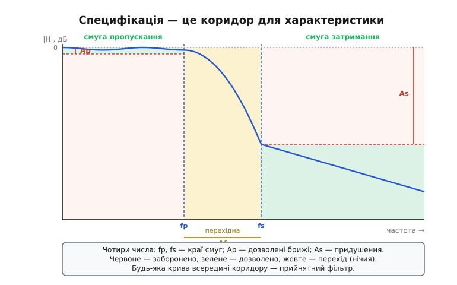
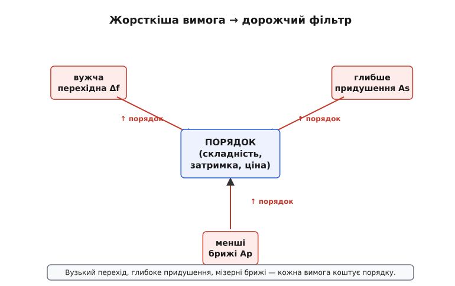
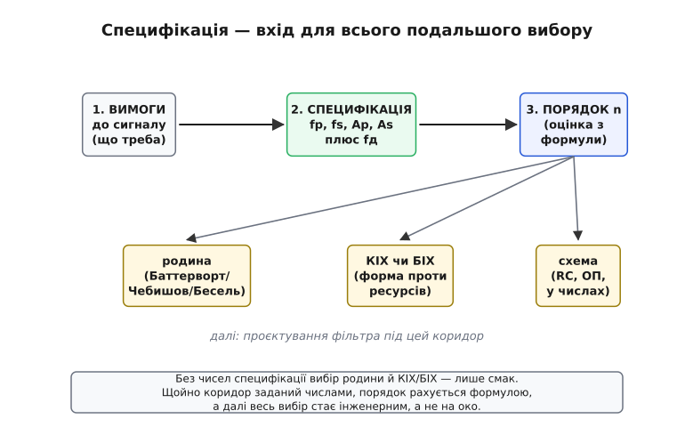

# Специфікація фільтра

Дотепер ми вибирали фільтри **словами**. Діагностуй шум і візьми медіану чи EMA. Потрібен крутий зріз — бери Чебишова, терпи брижі; важлива форма імпульсу — бери Бесселя. Форма сигналу свята — [КІХ із лінійною фазою](root:embedded/fir-vs-iir); тиснуть ресурси за гострого фільтра — БІХ-біквад. Усе це правильно й корисно, але всі ці поради лишаються **якісними**: «крутіше», «рівніше», «дешевше». А коли доходить до того, щоб **порахувати** конкретний фільтр — який порядок, які номінали резисторів, скільки відводів, — слова вже не годяться. Інструмент проєктування не розуміє «крутіше»; він розуміє лише числа.

Цей крок — про те, як перекласти розпливчасте бажання на точну **специфікацію** (лат. *specificatio* — докладний перелік), мову, якою фільтр замовляють так само однозначно, як деталь у токаря за кресленням. Виявиться, що для будь-якого фільтра достатньо **чотирьох-п'яти чисел**, і щойно ви їх назвали, усе подальше — порядок, родина, схема — випливає майже автоматично. А головне: ці числа змушують вас наперед чесно зізнатися, **чим ви готові пожертвувати**, — той самий компроміс, про який ми говорили весь час, тепер записаний цифрами, а не відчуттям.

## Чому «крутіше» — це не специфікація

Уявіть, що ви кажете колезі: «зроби мені фільтр, що добре прибирає високі частоти». Він має повне право спитати у відповідь десяток питань. До якої частоти пропускати? З якої — давити? Наскільки сильно давити — у два рази чи в тисячу? Чи можна, щоб у пропусканні сигнал трохи «гуляв» по рівню, чи має бути рівно? Як швидко переходити від «пропускаю» до «давлю» — за октаву чи за кілька герців? І поки на ці питання немає **чисел**, замовлення не виконати: під «добре прибирає» ховається і дешевенька RC-ланка, і фільтр двадцятого порядку — між ними тисячократна різниця в ціні й складності.

Ось у цьому й суть переходу до специфікації. Якісна порада звужує **тип** інструмента, але не задає його **розмір**. А [родини фільтрів](root:embedded/filter-families) ми вже навчилися розрізняти саме як розподіл одного «бюджета» між рівністю, крутістю й формою — отже, наступний крок очевидний: треба назвати, **скільки** того бюджета й **куди** ми його кладемо. Специфікація — це і є числовий запис цього розподілу.

> 🔧 **Навіщо це.** Будь-який серйозний інструмент проєктування фільтрів — від функції `firpm` у MATLAB чи `scipy.signal` до онлайн-калькуляторів активних фільтрів — на вході просить **рівно ці числа**, а не слова. Навчившись формулювати специфікацію, ви відмикаєте весь цей інструментарій: ваша робота — чесно назвати вимоги, а нудний розрахунок порядку й коефіцієнтів машина зробить сама. Інженер, який уміє ставити специфікацію, вартий більше за того, хто вміє лише крутити повзунки навмання.

## Коридор, у який має влізти крива

Найкорисніший спосіб уявити специфікацію — не як список побажань, а як **коридор** для частотної характеристики фільтра. Згадаймо, що характеристика — це крива, яка кожній частоті ставить у відповідність коефіцієнт пропускання |H| (скільки сигналу цієї частоти проходить). Специфікація малює навколо цієї кривої заборонені й дозволені зони. Будь-який фільтр, чия крива вкладається в дозволений коридор, — прийнятний; який вилазить — ні. Проєктування зводиться до того, щоб знайти **найдешевший** фільтр, чия крива ще влазить.


*Специфікація як коридор для характеристики. Червоні зони — заборонено: у смузі пропускання крива не сміє впасти нижче дозволеного рівня брижів, у смузі затримання — піднятися вище стелі придушення. Зелене — дозволено, жовте — нічия (перехідна смуга, де поведінка не нормована). Будь-яка крива всередині коридору — прийнятний фільтр; завдання — знайти найдешевший такий.*

Цей коридор задають кілька ділянок осі частот і кілька рівнів по вертикалі. Розберімо їх по черзі — і виявиться, що кожна відповідає одному простому, життєвому питанню.

**Смуга пропускання** (англ. *passband*) — діапазон частот, які фільтр має пропустити цілими. Це ваш корисний сигнал: усе, що ви хочете зберегти. Питання, на яке вона відповідає: «що мені **потрібно**?» Для фільтра низьких частот це смуга від нуля до якоїсь верхньої межі; усе, що в ній, проходить майже без втрат.

**Смуга затримання** (англ. *stopband*) — діапазон частот, які фільтр має **прибити**. Це завада, шум, те, від чого ви позбуваєтесь. Питання: «що мені **заважає**?» Усе, що сюди потрапило, на виході має бути ослаблене до прийнятно малого.

**Перехідна смуга** (англ. *transition band*) — проміжок між кінцем пропускання й початком затримання. Це найважливіша і найчастіше недооцінена частина специфікації, тож спинімося на ній окремо нижче. Поки що головне: жодний реальний фільтр не вміє обрізати миттєво, тому між «пропускаю» і «давлю» завжди є смуга, де він **переходить** від одного до іншого. У цій смузі поведінка не нормована — нам там байдуже, бо корисного сигналу там немає, а завади ще немає теж.

Бачите красу? Три ділянки осі частот — і кожна відповідає на побутове питання: що берегти, що вбити, де можна не церемонитися. Лишилося додати, **наскільки** добре берегти й вбивати, — а це вже вертикальні рівні коридору.

## Скільки берегти, скільки вбивати: брижі та придушення

Коридор має не лише горизонтальні межі (частоти), а й вертикальні (рівні |H|). І тут вступає величина, яку ми вже знаємо й любимо, — **децибел**.

> Децибел (дБ) — логарифмічна міра відношення двох амплітуд: різниця в дБ = 20·log₁₀(відношення). Логарифм стискає величезні діапазони в зручні числа: −20 дБ — це послаблення в 10 разів, −40 дБ — у 100, −60 дБ — у 1000. Зручність у тому, що каскад фільтрів просто **додає** децибели. Чому саме 20·log і звідки взялася ця одиниця — [Децибели](root:hw-analog/decibels).

**Брижі смуги пропускання** Ap (англ. *passband ripple*) — наскільки крива може **гуляти** в межах смуги пропускання, виражено в децибелах. В ідеалі фільтр у пропусканні мав би давати рівно одиницю (0 дБ) на всіх частотах. Але, як ми бачили з Чебишовим, дозвіл трохи похитатися — наприклад, у межах 0.5 дБ — це валюта, якою купують крутість зрізу. Ap і є цей дозволений розкид: «погоджуюся, що в смузі сигнал гулятиме не більш ніж на стільки-то децибелів».

Що означає Ap у звичних разах? Переведемо через той самий закон децибела:

```
Ap = 1 дБ   →  крива гуляє від  0 дБ до −1 дБ
                нижня межа: 10^(−1/20) ≈ 0.891  →  спад до ~89% (розкид ~11%)
Ap = 0.5 дБ →  10^(−0.5/20) ≈ 0.944           →  спад до ~94% (розкид ~6%)
Ap = 0.1 дБ →  10^(−0.1/20) ≈ 0.989           →  спад до ~99% (майже рівно)
```

Чим менший Ap, тим рівніша смуга — і тим дорожчий фільтр. Для звичайного давача 1 дБ нікого не образить; для вимірювального тракту, де крива фільтра прямо спотворює виміряний спектр, беруть 0.1 дБ або й менше.

**Придушення смуги затримання** As (англ. *stopband attenuation*) — наскільки **глибоко** треба прибити частоти затримання, теж у децибелах. Це стеля коридору в смузі затримання: вище неї крива заходити не сміє. Питання: «наскільки тиха має стати завада, щоб вона мені більше не шкодила?»

```
As = 20 дБ  →  завада ослаблена в 10 разів    (часто замало)
As = 40 дБ  →  у 100 разів                     (типова робоча планка)
As = 60 дБ  →  у 1000 разів                     (серйозне придушення)
As = 80 дБ  →  у 10000 разів                    (дуже жорстко, дорого)
```

Скільки треба As — диктує не естетика, а **арифметика вашого сигналу**. Якщо завада вдесятеро більша за корисний сигнал, а вам треба, щоб її залишок був удесятеро **меншим** за корисне, то загалом її треба прибити в сто разів — отже, As = 40 дБ, не менше. Специфікація змушує цю прикидку зробити **чесно й наперед**, а не виявити запізно, що 20 дБ не вистачило.

> 🔧 **Навіщо це.** Перш ніж писати As навмання, порахуйте його з реальних амплітуд. Зміряйте (чи прикиньте з даташита) амплітуду завади й мінімальну амплітуду корисного сигналу, і визначте, яким має стати залишок завади, щоб він не заважав рішенню. Відношення «початкова завада / припустимий залишок» у децибелах — і є ваш As. Це п'ятихвилинна прикидка, що рятує від фільтра, який «начебто стоїть», а сміття все одно пролазить.

## Перехідна смуга — найдорожче число

Тепер до серця специфікації. З усіх чисел саме **ширина перехідної смуги** найдужче б'є по складності фільтра — і саме її найчастіше задають надто жадібно, а потім дивуються, чому фільтр вийшов монструозний.

Згадаймо, звідки беруться родини: [той самий порядок n](root:embedded/filter-families) можна розподілити по-різному, але **крутість** зрізу в принципі обмежена порядком — n ланок дають близько 20·n децибелів на декаду. А перехідна смуга — це і є той проміжок, за який характеристика мусить впасти від рівня пропускання (скажімо, −1 дБ) аж до рівня затримання (скажімо, −60 дБ). Тобто за ширину перехідної смуги Δf фільтр має **накопичити весь перепад** As + Ap децибелів. Чим вужча Δf і чим більший перепад — тим крутіший потрібен схил, а отже, тим вищий порядок.

Покажемо це на прикидці, щоб «дорого» стало числом.

**Скільки порядку коштує вузький перехід.** Хочемо ФНЧ: пропускання до 1 кГц, затримання від 1.2 кГц, придушення As = 60 дБ. Перехідна смуга — лише 200 Гц. Прикиньмо потрібну крутість і порядок дуже грубо, через «20·n дБ/декаду»:

```
перепад, який треба набрати:     ≈ 60 дБ
ширина переходу:                 1000 → 1200 Гц
це частка декади:                log10(1200/1000) = log10(1.2) ≈ 0.079 декади
потрібна крутість:               60 дБ / 0.079 ≈ 760 дБ/декаду
порядок (груба оцінка):          n ≈ 760 / 20 ≈ 38   (!)
```

Тридцять восьмий порядок — це чудовисько: десятки ланок, гори обчислень, велика затримка. А тепер **розширмо перехід** удесятеро, до 1000 Гц (затримання від 2 кГц):

```
ширина переходу:                 1000 → 2000 Гц
частка декади:                   log10(2) ≈ 0.301 декади
потрібна крутість:               60 дБ / 0.301 ≈ 200 дБ/декаду
порядок (груба оцінка):          n ≈ 200 / 20 ≈ 10
```

Те саме придушення, та сама смуга пропускання — а порядок упав із ~38 до ~10, лише тому, що ми не пожадували перехідної смуги. (Це навмисно дуже груба оцінка «на серветці»; точні формули порядку для Баттерворта й Чебишова дають менші числа, але **співвідношення** саме таке — порядок шалено чутливий до ширини переходу. Точний вивід — нижче.)

> 🔧 **Навіщо це.** Перш ніж замовляти вузький перехід, спитайте себе: а він мені справді потрібен так близько? Часто між корисною смугою й завадою є природний зазор, і якщо чесно ним скористатися — поставити край затримання не впритул, а там, де завада реально починається, — порядок фільтра падає в рази. Найдешевший спосіб здешевити фільтр — **не** оптимізувати схему, а **послабити перехідну смугу** до того, що задача насправді дозволяє.

Чому це той самий компроміс, що й завжди, видно з простого спостереження: усі три «строгі» вимоги — вужчий перехід, глибше придушення, менші брижі — тиснуть на одну й ту саму ціну, **порядок**.


*Кожна жорсткіша вимога коштує порядку. Хочете вужчу перехідну смугу Δf — підіймається порядок. Хочете глибше придушення As — підіймається порядок. Хочете рівнішу смугу (менші брижі Ap) — знову порядок. А порядок — це складність, затримка й ціна. Тому специфікацію не «вигадують найкращою», а домовляються до **найслабшої**, що ще розв'язує задачу.*

Це прямий нащадок «бюджета фільтра» з родин, лише тепер видно ще й **третю** вісь — абсолютну складність. Родини розподіляли фіксований порядок між трьома чеснотами; специфікація ж каже, **який порядок узагалі знадобиться**, щоб ці чесноти дотягнути до заданих чисел. Жорсткіша специфікація — вищий порядок — дорожчий фільтр. Тому грамотний інженер ставить специфікацію **якомога слабшу**, що ще розв'язує задачу, а не «з запасом про всяк випадок»: кожен зайвий децибел придушення й кожен зекономлений герц переходу ви оплатите складністю.

## П'яте число: частота дискретизації

Усе сказане стосується будь-якого фільтра — і аналогового, і цифрового. Але для **цифрового** фільтра (а на мікроконтролері він майже завжди цифровий) до коридору додається ще одне, зовнішнє на вигляд, але насправді вирішальне число — **частота дискретизації** fд (англ. *sampling rate*): скільки відліків за секунду ви берете з сигналу.

Чому вона раптом частина специфікації фільтра? Бо в цифровому світі є жорстка стеля частот — **половина** частоти дискретизації, її звуть частотою Найквіста. Вище неї цифровий сигнал просто не існує: усе, що там було, **складається** вниз, у робочий діапазон, і прикидається низькими частотами.

> Будь-яку частоту вище половини fд оцифрування **відбиває** («складає») у діапазон нижче неї, і відрізнити її від справжньої низької вже неможливо — це аліасинг (англ. *alias* — несправжнє ім'я). Тому корисний і нормований діапазон цифрового фільтра — лише від 0 до fд/2; усі краї смуг живуть усередині нього. [Найквіст і аліасинг](root:com-signal/nyquist-aliasing).

Звідси два практичні наслідки, без яких цифрова специфікація неповна. По-перше, **усі ваші частоти — fp, fs — мають лежати нижче fд/2**, інакше вони безглузді. По-друге, що тонше: те, **наскільки близько** край затримання fs підходить до стелі fд/2, прямо визначає ширину перехідної смуги, а отже — як ми щойно бачили — порядок фільтра. Піднявши частоту дискретизації, ви відсуваєте стелю Найквіста вище, даєте перехідній смузі більше місця — і фільтр **здешевлюється**. Це несподіваний, але потужний важіль: інколи дешевше оцифровувати швидше, ніж будувати крутіший фільтр.

```
fд = 4 кГц   →  стеля Найквіста = 2 кГц
                край затримання fs = 1.2 кГц лишає до стелі лише 800 Гц
fд = 8 кГц   →  стеля Найквіста = 4 кГц
                той самий fs = 1.2 кГц лишає до стелі аж 2800 Гц — простору вдвічі більше
```

> 🔧 **Навіщо це.** Коли цифровий фільтр виходить надто важким, не кидайтеся одразу нарощувати порядок — спершу гляньте, чи не можна **підняти частоту дискретизації**. Кожне подвоєння fд відсуває стелю Найквіста вище й дає перехідній смузі більше місця, опускаючи потрібний порядок. Зайві відліки коштують трохи такту АЦП і пам'яті буфера — часто це дешевше, ніж фільтр удвічі вищого порядку з його затримкою. Цей самий зв'язок ще гостріше постане, коли ми проєктуватимемо антиаліасний фільтр, де стеля Найквіста — головний герой.

## Чотири числа й готова специфікація

Зведімо все докупи. Щоб однозначно замовити фільтр низьких частот, досить назвати:

```
fp   — край смуги пропускання   (до якої частоти берегти)
fs   — край смуги затримання    (з якої частоти давити)
Ap   — брижі смуги пропускання  (дозволений розкид у пропусканні, дБ)
As   — придушення затримання    (потрібна глибина придушення, дБ)
fд   — частота дискретизації    (для цифрового фільтра)
```

П'ять чисел — і фільтр визначено настільки, що далі його можна **порахувати без жодного слова**. Зверніть увагу, чого тут **немає**: немає ні слова «Баттерворт», ні «КІХ», ні порядку. Це навмисно. Специфікація описує **бажаний результат** — який коридор треба вкласти, — а **чим** його вкласти (яка родина, яке сімейство, який порядок) — це вже відповідь, яку дає розрахунок, а не вхідні дані. Спочатку чесно назви, чого хочеш; тоді вибери, чим це зробити.

**Повна специфікація на конкретний випадок.** Знімаємо звук із мікрофона на мікроконтролері: корисна мова — до 3.4 кГц (телефонна смуга), вище — лише шипіння й завади, які треба прибити в тисячу разів, а оцифровуємо на 16 кГц. Запишімо специфікацію цілком:

```
тип:   фільтр низьких частот
fp  =  3.4 кГц          (мову бережемо цілою)
fs  =  4.0 кГц          (з 4 кГц і вище — давимо)
Ap  =  0.5 дБ           (мова майже не спотворюється за рівнем)
As  =  60 дБ            (шум прибито в 1000 разів)
fд  =  16 кГц           (стеля Найквіста = 8 кГц, простору вдосталь)
перехідна смуга = 600 Гц
```

Усе. Цю табличку можна віддати інструментові — чи людині — і отримати конкретний фільтр, який або вкладеться в коридор, або чесно скаже «за таких чисел потрібен порядок N, ось ціна». Жодних «крутіше» й «на око». А якщо фільтр вийшов задорогий — ви точно знаєте, **який важіль** смикнути: розширити перехід (підняти fs), послабити придушення (зменшити As), допустити більші брижі (збільшити Ap) чи підняти fд. Кожен важіль — окреме число, і кожне ви свідомо обрали.

> 🔧 **Навіщо це.** Заведіть звичку записувати специфікацію фільтра **до** того, як писати код чи паяти схему, — хоч би й у коментарі над функцією. По-перше, це змушує назвати компроміси числами, поки не пізно. По-друге, через півроку (чи інший інженер) гляне на ці п'ять чисел і **одразу** зрозуміє, що фільтр має робити й чому він саме такий, — замість гадати за магічними коефіцієнтами. Специфікація — це і документація, і технічне завдання водночас.

Записати її прямо в код — теж природно: специфікацію зручно тримати не в коментарі, а **структурою даних**, поряд із функцією, що перевіряє готову характеристику на відповідність коридору. Як оформити специфікацію C-структурою й написати перевірку «крива в масці чи ні» — окремий [практикум коду](root:embedded/filter-specification/proj-spec-struct.md): там специфікація стає не папірцем, а живим об'єктом, який можна підставити в тест прошивки.

## Інші форми коридору

Дотепер ми малювали коридор для фільтра низьких частот, бо він найнаочніший. Але та сама ідея — заборонені й дозволені зони по частоті — однаково описує **будь-який** [тип фільтра](root:com-signal/band-filters); змінюється лише форма коридору, а словник той самий: смуга пропускання, смуга затримання, перехід, Ap, As.

- **Фільтр високих частот** (ФВЧ) — дзеркало ФНЧ: затримання внизу, пропускання вгорі. Тепер fs **менша** за fp, а перехід веде знизу вгору.
- **Смуговий фільтр** (пропускає смугу посередині) має **дві** перехідні смуги й **дві** смуги затримання — знизу й зверху від корисної смуги. Чисел більше (два краї пропускання, два краї затримання), але кожне — з того самого набору понять.
- **Загороджувальний фільтр** (notch — вирізає вузьку смугу, як [наводку 50 Гц](root:embedded/fir-vs-iir)) — навпаки: пропускання з обох боків, вузьке затримання посередині. Тут ключовими стають ширина вирізу й глибина придушення на самій частоті завади.

В усіх випадках логіка незмінна: назвіть, **які частоти берегти** (смуги пропускання), **які вбити** (смуги затримання), **як глибоко** (As), **як рівно** (Ap) і **скільки місця** лишаєте на переходи. Опанувавши коридор для ФНЧ, ви вмієте ставити специфікацію для будь-якого фільтра — міняється картинка, не метод.

## Від специфікації до вибору, який ми вже вміємо

Лишилося поставити цей крок на своє місце в нитці, яку ми ведемо. Специфікація — це не ще один спосіб **вибрати** фільтр поряд із родинами й КІХ/БІХ. Це **вхід**, з якого ті вибори тепер роблять не на око, а за числами.


*Місце специфікації в нитці. Спочатку — вимоги до сигналу (що берегти, що вбити). Їх записують специфікацією: п'ять чисел. З неї формулою рахують потрібний порядок n. І вже маючи числа й порядок, роблять вибори, яких ми навчилися раніше: яка родина (Баттерворт/Чебишов/Бесель), КІХ чи БІХ, яка схема. Без чисел ці вибори — лише смак; із числами — інженерія.*

Прослідкуймо ланцюжок, бо в ньому сходиться весь модуль. Спершу — **вимоги** до сигналу: що берегти, що заважає. Їх записують **специфікацією** — п'ятьма числами коридору. З коридору **формулою** рахують потрібний порядок n (точні формули для Баттерворта й Чебишова — у [математичній вставці](root:embedded/filter-specification/math-order-formula.md); саме вони перетворюють «вужче й глибше → дорожче» з гасла на конкретне число ланок). А вже маючи числа та оцінку порядку, повертаються до **вибору, який ми вже опанували**:

- **родину** обирають за тим, що в коридорі найважливіше: рівна смуга — [Баттерворт](root:embedded/filter-families), крутий перехід за малий порядок ціною брижів — Чебишов, чиста форма імпульсу — Бесель. Тепер цей вибір спирається на конкретні Ap і Δf, а не на відчуття.
- **КІХ чи БІХ** вирішують за [вже знайомими питаннями](root:embedded/fir-vs-iir) — форма проти ресурсів, — але тепер «гострий фільтр» перестав бути словом: ви бачите з порядку, скільки відводів попросить КІХ і скільки біквадів — БІХ, і чи влізе це у ваш чип і вашу [затримку](root:embedded/loop-stability).
- **схему** (RC-ланки, активний фільтр на ОП, числа в процесорі) добирають уже під конкретні порядок і родину.

Ось чому специфікація — стрижень, а не ще одна гілка. Усі попередні кроки давали **інтуїцію вибору**; цей дає **числа**, що роблять вибір однозначним і передаваним машині. Без специфікації «Баттерворт четвертого порядку» — це здогад; зі специфікацією це **відповідь** на чітко поставлене питання, яку можна перевірити: вкладається крива в коридор чи ні.

І природне продовження вже на порозі. Маючи коридор і порядок, наступний крок — власне **порахувати** фільтр: розкласти бажану характеристику на конкретні коефіцієнти. Для КІХ це окрема техніка проєктування, до якої ми переходимо далі; а найважливіший окремий випадок специфікації — коли смуга затримання мусить дотягтися рівно до стелі Найквіста, щоб не пустити аліаси в АЦП, — стане темою антиаліасного фільтра. Обидва кроки беруть на вхід рівно те, що ми навчилися писати тут: чотири-п'ять чисел, що окреслюють коридор, у який має влізти крива.
