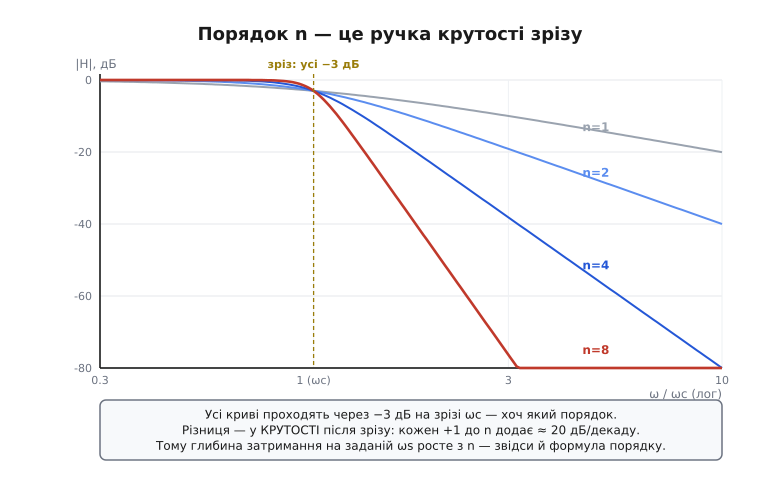
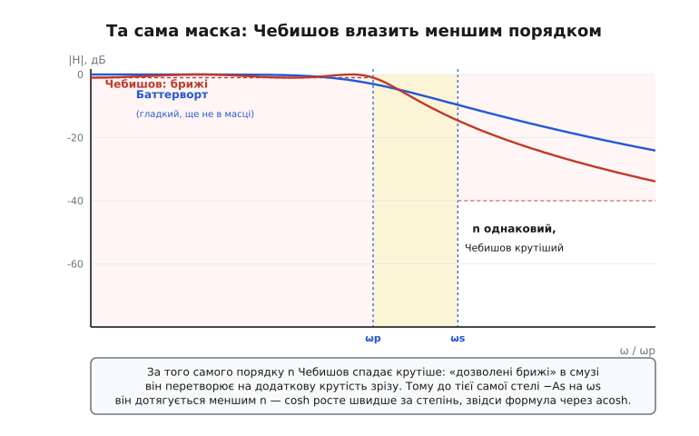
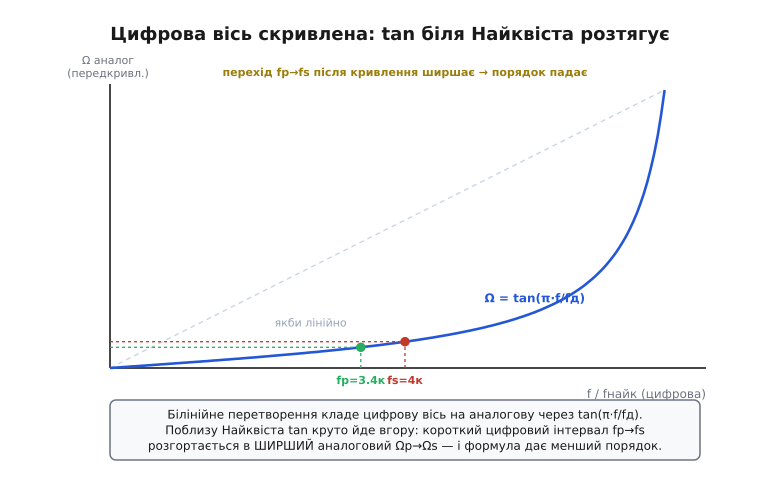

# 🧮 Формула порядку: від коридору до числа ланок

У самому кроці ми навчилися малювати **коридор** специфікації — fp, fs, Ap, As — і навіть прикинули «на серветці», що вузький перехід коштує дорого: для ФНЧ із переходом 1 → 1.2 кГц груба оцінка дала жахливий ~38-й порядок. Але оцінка «60 дБ поділити на частку декади, поділити на 20» — це лише натяк. Вона тримається на гаслі «20·n дБ на декаду», яке саме по собі наближене (асимптота, а не вся крива), і однакове для всіх родин — отже, не вміє пояснити, **чому** Чебишов за ту саму маску виходить у рази дешевшим. Інструмент проєктування ніякими гаслами не користується: він підставляє числа коридору в **точну формулу порядку** й видає ціле n. Ось цю формулу ми тут і виведемо — не візьмемо готовою, а збудуємо з означення самого фільтра, щоб кожен її символ був зрозумілий, а не магічний.

Мета не в тому, щоб вивчити формулу напам'ять (її пам'ятає будь-який калькулятор). Мета — **бачити крізь неї**: розуміти, який важіль специфікації за який множник у ній відповідає, чому acosh у Чебишова творить диво, і — найпрактичніше для нас — як правильно підставити цифрові частоти, щоб формула, придумана для аналогових кіл, дала чесний порядок цифрового фільтра на мікроконтролері.

> 🔧 **Навіщо це.** Коли `scipy.signal.buttord` чи `cheb1ord` повертає вам «порядок 9», корисно розуміти, **звідки** взялася дев'ятка, — бо тоді ви бачите, що смикнути, якщо дев'ятка завелика. Формула прямо показує: послабиш перехід (зменшиш fs/fp) — n падає різко (воно в знаменнику під логарифмом); послабиш придушення As — падає повільно (воно під логарифмом у чисельнику). Без формули ви крутите повзунки навмання; з нею — знаєте наперед, який повзунок дасть найбільший виграш за найменшу поступку.

## Що взагалі означає «порядок»

Перш ніж виводити формулу для порядку, домовмося, що це за число. **Порядок** (англ. *order*) фільтра — це степінь многочлена в знаменнику його передавальної функції, або, простіше й фізичніше, **скільки незалежних накопичувачів енергії** має фільтр: скільки конденсаторів та котушок в аналоговому колі, скільки затриманих відліків у цифровому. Один RC-ланцюжок — порядок 1. Два каскади RC або один LC-контур — порядок 2. І так далі.

Чому саме це число всім керує? Бо кожен накопичувач додає характеристиці один «поверх» спаду. Згадаймо з [родин фільтрів](root:embedded/filter-families), що далеко за зрізом будь-який фільтр спадає по прямій у лог-лог осях, і нахил тієї прямої — рівно **20·n децибелів на декаду**: один порядок — 20 дБ/дек, два — 40, вісім — 160. Порядок — це і є крутість, виражена цілим числом ланок. Тому «порахувати фільтр» наполовину означає «порахувати його порядок»: щойно ви знаєте n, ви знаєте, скільки біквадів ставити в БІХ, скільки відводів просити в КІХ, скільки операційних підсилювачів паяти в активному фільтрі.


*Порядок як ручка крутості. Усі криві Баттерворта проходять через одну точку — −3 дБ на зрізі ωc, хоч який порядок. Різниця — у тому, **як круто** вони падають далі: кожен доданий порядок додає ще ≈ 20 дБ/декаду нахилу. Тому на заданій частоті затримання ωs вища крива (більший n) сидить глибше. Формула порядку — це просто питання «який найменший n опустить криву на ωs нижче за стелю −As».*

Ось так задача й переформульовується в одне речення, яке вже піддається алгебрі: **знайти найменший цілий n, за якого характеристика на краю затримання fs впаде нижче за −As, не порушивши брижів Ap у смузі пропускання.** Усе виведення нижче — це акуратний запис цього речення для двох конкретних форм характеристики: Баттерворта й Чебишова.

## Баттерворт: вивід від |H|²

Почнімо з Баттерворта, бо його характеристика — найпростіша з можливих і тому найпрозоріша. Її означують так: **квадрат** модуля коефіцієнта передачі (квадрат — бо так зникає корінь і формули стають охайними; фізично |H|² — це у скільки разів проходить **потужність**) дорівнює

```
            1
|H(ω)|² = ───────────
          1 + (ω/ωc)^(2n)
```

Прочитаймо її, перш ніж щось рахувати, — у ній уже все видно. На дуже низькій частоті (ω ≪ ωc) дріб (ω/ωc) майже нуль, тож знаменник ≈ 1, і |H|² ≈ 1: сигнал проходить цілим. Рівно на зрізі (ω = ωc) маємо (ω/ωc) = 1, отже |H|² = 1/(1+1) = 1/2 — потужність падає вдвічі, а це і є знамениті −3 дБ (бо 10·log₁₀(1/2) ≈ −3.01). На високій частоті (ω ≫ ωc) одиниця в знаменнику стає нехтовною проти (ω/ωc)^(2n), тож |H|² ≈ (ωc/ω)^(2n) — степенева пряма, та сама асимптота 20·n дБ/декаду. Одна формула, а в ній і смуга, і зріз, і нахил.

> Чому її звуть «гранично рівною» (англ. *maximally flat*): біля нуля частоти перші 2n−1 похідних цієї функції дорівнюють нулю, тож крива тримається біля одиниці якнайдовше, без жодного брижа. Це й відрізняє Баттерворт від Чебишова — він **не** торгує рівністю смуги, а саме її береже. Деталі форми — у [родинах фільтрів](root:embedded/filter-families).

Тепер запишімо обидві вимоги коридору як нерівності на цю функцію. У децибелах ослаблення (тобто −10·log₁₀|H|²) на якійсь частоті — це наскільки крива впала нижче нуля. Дві вимоги такі:

```
край пропускання fp:  ослаблення ≤ Ap   (у смузі гуляємо не глибше Ap)
край затримання  fs:  ослаблення ≥ As   (за fs давимо щонайменше на As)
```

Підставимо означення |H|² в означення ослаблення A(ω) = −10·log₁₀|H|² = 10·log₁₀(1 + (ω/ωc)^(2n)) і перепишемо обидві умови. На fp ослаблення має дорівнювати рівно Ap (беремо межу — гірший дозволений випадок), на fs — рівно As:

```
на fp:  10·log₁₀(1 + (ωp/ωc)^(2n)) = Ap
на fs:  10·log₁₀(1 + (ωs/ωc)^(2n)) = As
```

Розв'яжімо кожну відносно степеня. Поділимо на 10, піднесемо 10 до степеня обох боків, віднімемо одиницю:

```
(ωp/ωc)^(2n) = 10^(Ap/10) − 1     ← позначимо εp²
(ωs/ωc)^(2n) = 10^(As/10) − 1     ← позначимо εs²
```

Ось і з'явилися дві величини, що проходитимуть крізь усе виведення: **εp² = 10^(Ap/10) − 1** і **εs² = 10^(As/10) − 1**. Це просто брижі й придушення, перекладені з децибелів у «рази по потужності». Тепер хитрість, що прибирає невідому ωc, яку ми не знаємо й знати не хочемо: **поділимо** друге рівняння на перше. Невідома ωc у лівій частині скоротиться сама:

```
(ωs/ωc)^(2n)     (ωs)^(2n)     εs²
───────────  =  ───────  =  ─────
(ωp/ωc)^(2n)     (ωp)^(2n)     εp²
```

Лишилося дістати n зі степеня. Беремо логарифм обох боків (основа байдужа, візьмемо десятковий) і ділимо:

```
2n · log₁₀(ωs/ωp) = log₁₀(εs²/εp²)

         log₁₀( (10^(As/10) − 1) / (10^(Ap/10) − 1) )
n  ≥  ─────────────────────────────────────────────────
                    2 · log₁₀(ωs/ωp)
```

Це і є **формула порядку Баттерворта** — та сама, що в брифі кроку. Знак «≥», а не «=», бо реальний порядок мусить бути **цілим**, тож беруть найближче ціле вгору (стеля, англ. *ceiling*): якщо формула дала 4.2, ставлять 5. Дрібний «надлишок» порядку означає лише, що готовий фільтр перевиконає специфікацію з невеликим запасом — це нормально й навіть добре.

Зупинімося й прочитаймо формулу як інженери, бо тепер кожен її шматок має сенс. У **чисельнику** — відношення придушень: чим глибше треба давити (більший As) проти дозволених брижів (Ap), тим більший n, але під логарифмом, тож зростання **повільне** — подвоїти глибину придушення коштує лише сталого доданку до n. У **знаменнику** — той самий log відношення частот fs/fp, що й у нашій «серветковій» прикидці, але тепер чесний, без гасла «20 дБ/декаду». І саме він — головний важіль: коли fs підповзає до fp (вузький перехід), відношення fs/fp прямує до одиниці, його логарифм — до нуля, а ділення на майже-нуль жене n у небо. Ось математична причина того, що ми бачили в кроці на пальцях: **порядок шалено чутливий до ширини переходу**, бо ширина сидить у знаменнику під логарифмом.

## Чебишов: та сама ідея, інша «лінійка»

Тепер найцікавіше — чому Чебишов за ту саму маску дає менший порядок. Відповідь схована в одній заміні: там, де Баттерворт використовує степінь (ω/ωc)^(2n), Чебишов ставить **многочлен Чебишова** Tₙ. Його характеристика:

```
            1
|H(ω)|² = ───────────────
          1 + ε² · Tₙ²(ω/ωp)
```

де ε² = 10^(Ap/10) − 1 — той самий «бриж», що й вище (тут він задає **висоту брижів** у смузі, бо Чебишов рівність смуги якраз і проміняв на крутість). Уся магія — у поведінці Tₙ, многочлена, який має дві зовсім різні особи по два боки від ωp.

Многочлен Чебишова Tₙ(x) означують напрочуд гарно — через косинус і його гіперболічного брата:

```
Tₙ(x) = cos(n · arccos x)      для |x| ≤ 1   (у смузі пропускання)
Tₙ(x) = cosh(n · arccosh x)    для |x| > 1   (у смузі затримання)
```

> Многочлени названо на честь **Пафнутія Львовича Чебишова** (1821–1894), російського математика, засновника петербурзької математичної школи; він увів їх у 1850-х, розв'язуючи зовсім іншу задачу — про найкраще наближення функцій многочленом із найменшим максимальним відхиленням (так звана мінімаксна, або рівнохвильова, властивість). Застосування цих многочленів до проєктування фільтрів з'явилося значно пізніше, уже в радіотехніці XX століття, — класичний приклад того, як чиста математика наперед заготовляє інструмент, а інженери знаходять йому застосунок через десятиліття. *(Усталений факт; ідея многочленів — Чебишова, фільтр на їх основі — колективна праця пізніших інженерів.)*

Прочитаймо ці дві особи, бо саме в них корінь усього. У **смузі пропускання** (|x| ≤ 1) Tₙ — це cos(n·arccos x), тобто косинус, що метляється між −1 і +1 рівно n разів. Підставлене в |H|², це дає характеристику, що **рівномірно гойдається** між 0 дБ і −Ap — ті самі знамениті брижі Чебишова. А в **смузі затримання** (x > 1) косинус перетворюється на **гіперболічний косинус** cosh(n·arccosh x), який уже не гойдається, а **вибухово росте**. І в цьому вся справа: щойно ми вийшли за смугу, Tₙ перестає бути обмеженим коливанням і починає рости як cosh — тобто майже **експоненційно** по своєму аргументу. Степінь (ω/ωc)^(2n) у Баттерворта росте швидко, але cosh росте **ще швидше**, бо cosh(z) ≈ ½·eᶻ для великих z. Тому за той самий порядок n Чебишов опускає криву в затриманні значно нижче — або, дивлячись з іншого боку, дотягується до тієї самої стелі −As за **менший** n.


*Чому Чебишов виграє. Обидві криві — одного порядку на одній масці. Баттерворт (синій) гладкий у смузі, але до краю затримання ωs ще не встиг впасти під стелю −As. Чебишов (червоний) платить брижами в смузі пропускання — зате той «зекономлений» на рівності бюджет іде в крутість, і на ωs він уже глибоко під стелею. Та сама маска — менший порядок: cosh у затриманні росте швидше за степінь.*

Тепер вивід порядку — дослівно той самий хід, що для Баттерворта, лише з cosh замість степеня. Дві умови коридору:

```
на fp:  ε² · Tₙ²(ωp/ωp) ≤ 10^(Ap/10) − 1   ← виконано тотожно: Tₙ(1)=1, отже ε²·1 = ε²
на fs:  ε² · Tₙ²(ωs/ωp) ≥ 10^(As/10) − 1
```

Перша умова на краю смуги виконується **сама собою**: Tₙ(1) = cos(n·arccos 1) = cos(0) = 1, тож там ослаблення рівно Ap за побудовою — Чебишов «упирається» в межу брижів якраз на ωp. Лишається друга. У ній x = ωs/ωp > 1, тож Tₙ = cosh(n·arccosh(ωs/ωp)). Підставимо, поділимо на ε² = 10^(Ap/10) − 1, візьмемо корінь:

```
cosh( n · arccosh(ωs/ωp) )  ≥  √( (10^(As/10) − 1) / (10^(Ap/10) − 1) )
```

Праворуч — рівно той самий корінь із відношення придушень, що й у Баттерворта (бо вимога до глибини та сама!). Лишається «зняти» cosh з лівого боку. Обернена до гіперболічного косинуса функція — **арккосинус гіперболічний** arccosh (його ще пишуть acosh або cosh⁻¹): за означенням, якщо cosh(z) = y, то z = arccosh(y). Застосуємо arccosh до обох боків і поділимо на arccosh(ωs/ωp):

```
        arccosh( √( (10^(As/10) − 1) / (10^(Ap/10) − 1) ) )
n  ≥  ───────────────────────────────────────────────────────
                    arccosh( ωs / ωp )
```

Порівняйте дві формули поряд — вони **дзеркальні**, відрізняються однією заміною функції:

```
Баттерворт:   n ≥ log₁₀(εs²/εp²) / ( 2 · log₁₀(ωs/ωp) )
Чебишов:      n ≥ arccosh(√(εs²/εp²)) / arccosh(ωs/ωp)
```

І ось де народжується виграш Чебишова, тепер уже строго. У знаменнику Баттерворт ділить на log(ωs/ωp), а Чебишов — на arccosh(ωs/ωp). Коли перехід вузький (ωs/ωp близьке до 1), **arccosh росте від одиниці значно швидше за log**: для аргументу 1.18 логарифм дає лише ≈ 0.071, а arccosh — аж ≈ 0.586, у вісім із гаком разів більше. А більший знаменник — менший n. Інакше кажучи, та сама властивість cosh (швидкий ріст за межами смуги), що дала Чебишову крутий зріз, в оберненому вигляді (arccosh у знаменнику) і ріже потрібний порядок. Це не два різні факти, а один і той самий, побачений з двох боків.

> 🔧 **Навіщо це.** Звідси практичне правило великого пальця: за однакової маски **Чебишов зазвичай дає вдвічі-втричі менший порядок, ніж Баттерворт** — і тим більший виграш, чим вужчий перехід. Тому коли специфікація вимагає крутого зрізу, а ресурси МК тиснуть, перше, що пробують, — це Чебишов (чи навіть еліптичний фільтр, де брижі дозволені **з обох** боків і порядок ще менший). Платня — брижі в смузі й гірша [форма імпульсу](root:embedded/filter-families); якщо форма сигналу свята, виграш у порядку доводиться віддати назад і брати Баттерворт чи Бесель. Формула дає вам точну «ціну» цього вибору в числі ланок, ще до того, як ви напишете бодай рядок коду.

## Числа на нашій специфікації

Тепер найкорисніше — проженімо крізь обидві формули **ту саму** специфікацію, що ми склали в кроці, і подивімося, що скаже точна математика проти нашої серветки. Нагадаю числа: телефонна смуга мови, fp = 3.4 кГц, fs = 4 кГц, брижі Ap = 0.5 дБ, придушення As = 60 дБ.

Спершу порахуймо два «цеглинки», спільні для обох формул, — відношення придушень у разах:

```
εp² = 10^(Ap/10) − 1 = 10^(0.05)  − 1 = 1.1220 − 1 = 0.1220
εs² = 10^(As/10) − 1 = 10^(6.0)   − 1 = 1 000 000 − 1 = 999 999

відношення εs²/εp² = 999 999 / 0.1220 ≈ 8.20 · 10⁶
корінь із нього      √(8.20·10⁶)      ≈ 2862.8
```

Тепер відношення частот. Поки залишимося в **аналоговому** трактуванні (нижче побачимо, що для цифри його треба підправити): fs/fp = 4000/3400 = 1.1765.

**Порядок Баттерворта на нашій специфікації.**

```
чисельник:   log₁₀(εs²/εp²) = log₁₀(8.20·10⁶) ≈ 6.914
знаменник:   2 · log₁₀(1.1765) = 2 · 0.07058 = 0.14116

n ≥ 6.914 / 0.14116 ≈ 48.98   →   n = 49
```

**Порядок Чебишова на тій самій специфікації.**

```
чисельник:   arccosh(2862.8) ≈ 8.653
знаменник:   arccosh(1.1765) ≈ 0.5857

n ≥ 8.653 / 0.5857 ≈ 14.77   →   n = 15
```

Зупинімося над цими числами — вони повчальні. По-перше, Чебишов (15) проти Баттерворта (49) — **більш ніж утричі** менший порядок за абсолютно ту саму маску. Це наочна ціна рівності смуги: Баттерворту, щоб бути гладким, потрібно 49 ланок там, де Чебишов обходиться п'ятнадцятьма, бо брижам він дозволив працювати на крутість. По-друге, порівняймо з нашою «серветкою». У кроці груба оцінка для **іншого** прикладу (перехід 1 → 1.2 кГц) дала ~38, а для розширеного (1 → 2 кГц) ~10. Для **цієї** специфікації та сама серветкова арифметика «As поділити на частку декади, поділити на 20» дала б:

```
частка декади:   log₁₀(4000/3400) = 0.0706 декади
крутість:        60 дБ / 0.0706 ≈ 850 дБ/декаду
серветка:        n ≈ 850 / 20 ≈ 42
```

Серветка пророкує ~42. Точна формула Баттерворта дає 49 — тобто серветка **занизила**, і помітно. Чому? Бо гасло «20·n дБ/декаду» — це **асимптота**, нахил далеко за зрізом; а тут край затримання fs = 4 кГц зовсім близько до краю пропускання fp = 3.4 кГц, фільтр там ще не вийшов на асимптоту, реальний спад полого, тож насправді ланок треба більше. Серветка добра, щоб **відчути** масштаб («десятки, не одиниці»), але для замовлення фільтра годиться лише точна формула. А Чебишов (15) показує те, чого серветка взагалі не вміє побачити: вона однакова для всіх родин і тому сліпа до того, що вибір родини змінює порядок у рази.

## П'яте число повертається: нормування до Найквіста

Усе виведене вище — про **аналоговий** фільтр, де частота ω пробігає від нуля до нескінченності. Але на мікроконтролері фільтр майже завжди **цифровий**, а в цифровому світі, як ми бачили в кроці, є жорстка стеля — частота Найквіста fд/2, вище якої частот просто не існує. І це не косметична деталь: якщо бездумно підставити в аналогову формулу цифрові частоти, відповідь буде **неправильна**. Розберімо, чому, і як підставляти чесно.

Перша, проста половина — **нормування**. Цифровий фільтр не знає абсолютних герців; він знає лише частку від частоти дискретизації. Тому всі частоти специфікації переводять у безрозмірну величину, поділивши на стелю Найквіста fд/2 (так роблять, зокрема, функції `scipy.signal`, де частота 1.0 означає рівно Найквіст):

```
fд = 16 кГц  →  стеля Найквіста fд/2 = 8 кГц

wp = fp / (fд/2) = 3.4 / 8 = 0.425   (частка Найквіста)
ws = fs / (fд/2) = 4.0 / 8 = 0.500   (рівно половина від стелі Найквіста)
```

Само по собі нормування **не змінює** відношення fs/fp (поділили чисельник і знаменник на те саме 8), тож якби ним і обмежитися, формула дала б ті самі 49 і 15. Але є друга, тонша половина, і вона якраз усе й вирішує.

Цифровий фільтр будують не в порожнечі — його дістають з аналогового прототипу через [білінійне перетворення](book:algorithms/band-filters/math-type-transformations.md) (англ. *bilinear transform*), яке відображає всю нескінченну аналогову вісь частот у скінченний відрізок від 0 до Найквіста. А таке стиснення нескінченності у відрізок не може бути рівномірним: воно **нелінійно кривить** вісь частот за законом тангенса. Зв'язок між цифровою частотою f і відповідною їй аналоговою Ω, яку треба підставляти у формулу, такий:

```
Ω = tan( π · f / fд )
```

> Білінійне перетворення — стандартний місток «аналог → цифра»: воно бере готовий аналоговий фільтр (з усією багатою теорією Баттерворта й Чебишова) і перетворює на цифрові коефіцієнти, гарантовано зберігаючи стійкість. Платня — оце скривлення осі частот (англ. *frequency warping*), яке тим сильніше, чим ближче до Найквіста. Як саме воно діє на полюси й коефіцієнти — у вставці [про перетворення типів](book:algorithms/band-filters/math-type-transformations.md).

Чому це міняє порядок? Бо в нашій специфікації край затримання fs = 4 кГц сидить **рівно на півдорозі до Найквіста** (ws = 0.5), а саме там тангенс уже помітно «розтягує» вісь. Перерахуймо відношення частот не як просте fs/fp, а як відношення **передкривлених** частот:

```
Ωp = tan(π · 3400 / 16000) = tan(0.6676) ≈ 0.788    (множник 2/T однаковий —
Ωs = tan(π · 4000 / 16000) = tan(0.7854) = 1.000      у відношенні скоротиться)

передкривлене відношення  Ωs/Ωp = 1.000 / 0.788 ≈ 1.268
```

Дивіться: сире відношення було 1.1765, а **передкривлене — 1.268**, помітно більше. А більше відношення частот у знаменнику формули — це **менший** порядок. Перерахуймо обидві родини з чесним цифровим відношенням 1.268:

```
Баттерворт:  n ≥ 6.914 / (2 · log₁₀(1.268)) = 6.914 / 0.2065 ≈ 33.5  →  n = 34
Чебишов:     n ≥ 8.653 / arccosh(1.268)     = 8.653 / 0.7167 ≈ 12.1  →  n = 13
```

Цифрове трактування опустило Баттерворт із 49 до **34**, а Чебишов із 15 до **13**. Це не похибка й не вільність — це чесніша відповідь: оскільки край затримання лежить близько до Найквіста, скривлення осі грає нам на руку й здешевлює фільтр. Якби ми наївно підставили сирі герци, замовили б фільтр **вищого** порядку, ніж насправді треба, — заплатили б зайвими ланками за власну неуважність до Найквіста.


*Чому цифровий порядок інший. Білінійне перетворення кладе цифрову вісь (горизонталь) на аналогову (вертикаль) через tan(π·f/fд). Поблизу Найквіста тангенс круто здіймається, тож короткий цифровий проміжок fp → fs розгортається у **ширший** аналоговий Ωp → Ωs. Ширший перехід у знаменнику формули — менший порядок. Тому наш фільтр цифровим виходить дешевшим (n=34/13), ніж за наївного аналогового підрахунку (n=49/15).*

> 🔧 **Навіщо це.** Практичний висновок подвійний. Перше: для цифрового фільтра завжди **передкривлюйте краї смуг** перед підстановкою у формулу (або, простіше, віддайте нормовані частоти готовій функції `buttord`/`cheb1ord` — вона зробить це за вас). Друге, важливіше для системного рішення: тепер видно строго те, що в кроці було лише обіцянкою, — **частота дискретизації прямо керує порядком**. Піднявши fд, ви відсуваєте Найквіст, край затримання fs опиняється далі від стелі, скривлення осі слабшає, відношення частот наближається до сирого, і фільтр **дорожчає**; опустивши fд (наблизивши fs до Найквіста), ви здешевлюєте фільтр коштом меншого запасу від аліасингу. П'яте число специфікації — не довідка, а **повноцінний важіль** в одному рівнянні з рештою чотирьох.

## Що з усього цього лишається в руках

Зведімо нитку. Ми взяли коридор специфікації — п'ять чисел кроку — і перетворили їх на **одне ціле число** n, що визначає всю подальшу складність фільтра. Дорогою стало видно те, чого якісні поради й серветкова прикидка показати не могли.

Порядок народжується з простого питання «який найменший n опустить криву на fs нижче за −As, не зачепивши Ap». Записане для гранично рівної характеристики Баттерворта, це питання дає формулу з логарифмами; для брижастого Чебишова — ту саму за будовою формулу, але з arccosh, і саме заміна log → arccosh у знаменнику пояснює, **чому** Чебишов за однакову маску дешевший у рази (на нашій специфікації — 15 проти 49 ланок). Чисельник в обох — повільний (під логарифмом / arccosh), тож глибина придушення коштує мало; знаменник — це відношення частот, і він головний важіль, бо вузький перехід жене n у небо. А для цифрового фільтра відношення частот треба брати **передкривленим** тангенсом, бо інакше формула збреше: на нашій специфікації чесна цифрова відповідь — 34 і 13, дешевше за наївні 49 і 15, бо край затримання близький до Найквіста.

Тепер «вужче й глибше — дорожче» з гасла кроку стало конкретним числом ланок, яке можна назвати ще до паяння й до коду. Маючи це n і родину, наступний крок нитки — власне **розкласти** бажану характеристику на коефіцієнти: для КІХ це окрема техніка проєктування, до якої курс переходить далі, для БІХ — каскад біквадів із того самого аналогового прототипу. А коли край затримання мусить упиратися рівно в Найквіст, щоб не пустити аліаси в АЦП, та сама арифметика порядку стане серцем антиаліасного фільтра. Усюди на вхід іде те, що ми навчилися тут перетворювати на число: коридор із п'яти чисел — і формула, що каже, скільки він коштує.
