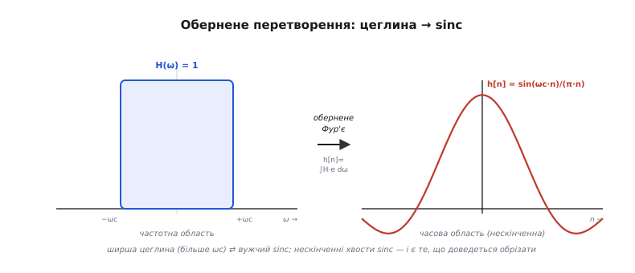
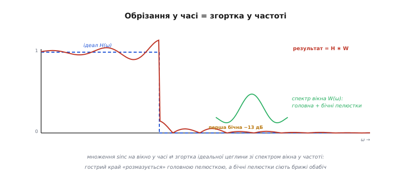
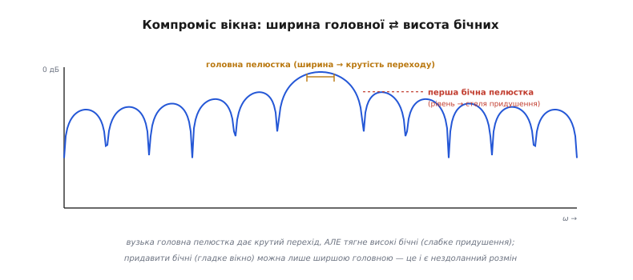

# 🧮 Чому метод вікон узагалі працює: від цеглини до Кайзера

У самому кроці метод вікон виглядав майже як рецепт: візьми ідеальний sinc, помнож на гладке вікно — і брижі стихнуть. Ми навіть назвали магічні числа: перестриб ~8.95%, стеля прямокутного вікна ~21 дБ, β Кайзера під 60 дБ ≈ 5.65, оцінка довжини за Гаррісом. Але кожне з цих чисел ми взяли **на віру**. Звідки в Ґіббса береться саме 8.95, а не 5 чи 15? Чому ця стеля **не** опускається від довшого фільтра, хоча здоровий глузд кричить, що більше відводів — точніше? Чому формула β Кайзера має три гілки з дивними коефіцієнтами 0.5842 і 0.1102, а в формулі порядку стоїть саме 2.285? І найголовніше — чому взагалі гладке вікно лікує брижі, а різкий обрив ні?

Тут ми розберемо це до дна. Не запам'ятаємо формули, а **виведемо** їх із двох речей, які насправді керують усім: з пари «прямокутник ⇄ sinc» і з однієї теореми про те, що множення в часі обертається згорткою в частоті. Щойно ці дві ідеї стануть на місце, кожне магічне число з кроку зробиться неминучим наслідком, а не довідкою. І тоді ви читатимете `scipy.signal.firwin` чи `kaiserord` не як чорну скриньку, а як акуратний запис того, що самі вмієте вивести.

> 🔧 **Навіщо це.** Коли калькулятор фільтрів видає вам β = 5.65 і N = 73, корисно бачити, **який важіль що дає**: чому β тягне за собою і придушення, і ширину переходу одночасно, чому довжина б'ється тільки об перехід, а не об глибину. Без цього ви крутите повзунки навмання й дивуєтеся, чому фільтр то задовгий, то слабкий. З цим — наперед знаєте, котрий повзунок дасть найбільший виграш за найменшу поступку, ще до першого рядка коду.

## Перша цеглина: що таке «ідеальний» фільтр як функція

Перш ніж щось обрізати, домовмося строго, **що** ми обрізаємо. У кроці ми сказали словами: ідеальний ФНЧ пропускає все до зрізу з коефіцієнтом 1, а вище — рівно 0. Запишімо це як функцію частоти. Цифровий фільтр живе на безрозмірній частоті ω (радіани на відлік), і вона пробігає від −π до +π — це весь доступний світ частот, бо вище [стелі Найквіста](root:com-signal/nyquist-aliasing) частот просто немає, а від'ємні ω — це та сама фізична частота, лише з іншим знаком фази. Бажана частотна характеристика ідеального ФНЧ на цьому відрізку — буквально прямокутник:

```
          ⎧ 1,   |ω| ≤ ωc     (смуга пропускання)
H_ід(ω) = ⎨
          ⎩ 0,   ωc < |ω| ≤ π  (смуга затримання)
```

Це і є «цеглина» з кроку, але тепер у вигляді, з яким можна рахувати. Зверніть увагу: вона симетрична відносно нуля (однакова для +ω і −ω) і дорівнює одиниці на симетричному відрізку шириною 2ωc. Запам'ятаймо цю ширину — за мить вона визначить, який саме sinc вийде.

> 🔧 **Навіщо це.** Уся подальша математика — це чесна відповідь на питання «який скінченний набір коефіцієнтів найкраще вдає оцю функцію». Прямокутник — найжорсткіша мета, яку тільки можна поставити: розрив від 1 до 0 за нульову ширину. Саме нескінченна крутість цієї стіни й породжує всі труднощі — будь-яка реальна, фізично здійсненна характеристика мусить десь цю стіну згладити. Тримаймо це в голові: ми не «псуємо ідеал недосконалістю», ми платимо неминучу ціну за те, що ідеал нескінченно крутий.

## Чому прямокутник у частоті стає sinc у часі

Тепер головний міст усієї теми. Коефіцієнти КІХ-фільтра — це його [імпульсна характеристика](root:com-signal/fir-filter) h[n], а зв'язок між характеристикою в часі h[n] і характеристикою в частоті H(ω) дає [перетворення Фур'є](root:math-analysis/fourier-idea). Щоб дістати коефіцієнти з бажаної H_ід(ω), треба зробити **обернене** перетворення — проінтегрувати прямокутник:

```
        1   ⌠ π
h[n] = ─── ⎮   H_ід(ω) · e^(jωn) dω
       2π  ⌡ −π
```

Не лякаймося інтеграла — він тут зовсім ручний, бо H_ід(ω) дорівнює одиниці лише на відрізку [−ωc, ωc], а поза ним нуль. Отже, усе інтегрування зводиться до цього відрізка, де підінтегральне — просто e^(jωn):

```
        1   ⌠ ωc                1    e^(jωn)  |ωc      1    e^(jωcn) − e^(−jωcn)
h[n] = ─── ⎮    e^(jωn) dω  =  ─── · ───────  |    =  ─── · ────────────────────
       2π  ⌡ −ωc               2π      jn     |−ωc    2π            jn
```

А той дріб із двома комплексними експонентами — це переодягнений синус: за формулою Ейлера (e^(jx) − e^(−jx)) / (2j) = sin(x). Підставимо й причешемо:

```
        1    2j·sin(ωc·n)     sin(ωc·n)
h[n] = ─── · ──────────── =  ──────────
       2π         jn            π·n
```

Ось воно — те саме `h[n] = sin(ωc·n)/(π·n)`, що ми взяли готовим у кроці, тепер виведене з одного інтеграла:

```
         sin(ωc · n)
h[n] = ───────────────       ← це і є sinc
            π · n
```


*Пара, на якій тримається весь метод. Зліва — бажана характеристика H(ω): прямокутник, одиниця на ширині 2ωc. Обернене перетворення Фур'є (інтеграл усередині) перетворює цей прямокутник на функцію sinc у часі — справа. Ширша цеглина (більше ωc) стискає sinc вужче, вища стіна те саме. А головне — хвости sinc тягнуться обабіч **нескінченно**: саме їх ми й змушені будемо обрізати, бо КІХ має скінченну довжину.*

Тут варто на мить зупинитися й оцінити, що сталося. Прямокутник — найпростіша фігура на світі — у дзеркалі Фур'є обертається на нескінченно довгий хвилястий sinc. Це не випадковість і не вада: різкий **край** в одній області завжди породжує нескінченний **хвіст** в іншій. Гострота у частоті (вертикальна стіна) і нескінченність у часі (хвости) — дві сторони однієї монети. Саме тому ідеал недосяжний для КІХ: щоб мати скінченну довжину, ми мусимо ці хвости десь обрубати, а обрубаний хвіст — це вже не зовсім прямокутник у частоті. Питання лише в тому, **наскільки** не прямокутник. Відповідь на нього й дає вся решта вставки.

> Чому центральний відвід `h[0]` не ділиться на нуль, хоч у формулі `n` стоїть у знаменнику: у точці n = 0 і чисельник sin(ωc·0) = 0, тобто маємо 0/0 — невизначеність, а не ділення на нуль. Її значення — це границя sin(ωc·n)/(π·n) при n → 0, а вона дорівнює ωc/π (бо sin(x) ≈ x для малих x). Тому в коді кроку центральний відвід беруть окремою гілкою `ideal(0) = ωc/π`. Це не «латка», а справжнє значення sinc у нулі — найвищий відвід фільтра.

## Обрізати = згорнути: звідки беруться брижі

Тепер найважливіша ідея вставки — та, що пояснює **геть усе** про вікна. Обрізати нескінченний sinc до M+1 відліків означає помножити його на прямокутне вікно w[n], яке дорівнює одиниці на наших відводах і нулю поза ними:

```
h_реал[n] = h_ід[n] · w[n]      (множення у часі, відлік за відліком)
```

Питання: що ця операція робить із частотною характеристикою? Адже нас цікавить не самий h[n], а те, як виглядатиме крива H(ω) готового фільтра. І тут вступає одна з найкрасивіших теорем усієї обробки сигналів: **множення в одній області — це згортка в іншій**. Якщо в часі ми перемножили дві функції, то в частоті їхні спектри **згортаються**:

```
h_ід[n] · w[n]   ⟺   H_ід(ω) ∗ W(ω)
   (множення)         (згортка)
```

Чому так — інтуїтивно? Згортка з якоюсь функцією — це «розмазування» по її формі: кожну точку оригіналу замінюють на маленьку копію розмазувача, а тоді все додають. Множення на вікно в часі обмежує сигнал у вікні; у дзеркалі Фур'є це обертається тим, що кожну гостру деталь бажаної характеристики **розмазують** спектром вікна. (Строге доведення цієї теореми — у [book-статті про витік](root:com-signal/windowing-leakage); нам тут досить самого факту й того, що з нього випливає.)

Отже, характеристика реального фільтра — це не ідеальна цеглина, а цеглина, **згорнута зі спектром вікна** W(ω). І ось де народжуються брижі.


*Звідки беруться брижі — одним малюнком. Множення sinc на вікно в часі дорівнює згортці ідеальної цеглини (пунктир) зі спектром вікна W(ω) (зелене). Спектр будь-якого вікна має **головну пелюстку** (горб посередині) і **бічні пелюстки** (затухаючі хвилі обабіч). Згортка з головною пелюсткою «розмазує» вертикальну стіну в похилий перехід; згортка з бічними пелюстками сіє брижі обабіч стрибка. Результат (червона крива) — розмита, хвиляста стіна замість гострої цеглини.*

Розгляньмо це уважніше, бо тут — корінь усіх компромісів теми. Спектр прямокутного вікна — це окрема відома функція, **ядро Діріхле** (на честь Йоганна Петера Ґустава Лежена Діріхле, німецького математика першої половини XIX століття; усталений факт):

```
        sin(ω·(M+1)/2)
W(ω) = ─────────────────       ← спектр прямокутного вікна, ядро Діріхле
          sin(ω/2)
```

Це знову sinc-подібна штука: високий горб посередині (головна пелюстка) і затухаючі хвилі обабіч (бічні пелюстки). Коли таку функцію згорнути з ідеальною цеглиною, стається дві речі. По-перше, гострий стрибок від 1 до 0 «розмазується» по ширині головної пелюстки — це і є **перехідна смуга** фільтра. По-друге, бічні пелюстки ядра, проходячи згорткою через стрибок, лишають по собі **затухаючі коливання** обабіч — це й є брижі Ґіббса, і в смузі пропускання, і в смузі затримання.

Тепер видно, чому грубий обрив дає саме такі неприємні брижі: бічні пелюстки прямокутного вікна **великі**. Найвища, найперша бічна пелюстка ядра Діріхле сидить лише на **−13 дБ** нижче головної (усталений факт; це з аналізу самого ядра). А оскільки придушення фільтра впирається саме в рівень найвищої бічної пелюстки, прямокутне вікно й дає стелю всього близько 21 дБ. Звідки береться різниця між −13 дБ бічної пелюстки й ~21 дБ стелі придушення — за мить, у виведенні самого числа Ґіббса.

> 🔧 **Навіщо це.** Це найважливіша зміна оптики в усій темі: фільтр визначає **не** сам sinc і **не** саме вікно окремо, а **спектр вікна, згорнутий із ціллю**. Тому вибір вікна — це насправді вибір форми його спектра: яка в нього головна пелюстка (вона стане шириною переходу) і які бічні (вони стануть брижами й визначать придушення). Усе проєктування методом вікон — це підбір спектра-розмазувача з потрібною головною й достатньо малими бічними. Решта вставки — про те, як ці дві властивості неминуче торгуються одна з одною.

## Звідки рівно 8.95%: число Ґіббса

Розберімо тепер найвпертіший факт кроку — перестриб рівно ~8.95%, що **не зменшується** від подовження фільтра. Обидві половини цього твердження мають точне пояснення.

Перестриб — це наскільки реальна крива «вистрибує» над одиницею (і провалюється під нуль) поряд зі стрибком. Згортка цеглини з ядром Діріхле — це, за означенням згортки, **накопичена площа** ядра від краю до поточної точки. А накопичена площа sinc-подібної функції описується спеціальною функцією — **інтегральним синусом** Si(x) = ∫₀ˣ (sin t)/t dt. Перестриб виникає тому, що Si(x) не лізе монотонно до своєї границі π/2, а спершу **перескакує** її — і максимум цього перескоку припадає на x = π:

```
Si(π) = ∫₀^π (sin t)/t dt ≈ 1.8519        а границя Si(∞) = π/2 ≈ 1.5708
```

Перевищення — це і є перестриб. Виразимо його як частку від повної висоти стрибка. Повний стрибок ідеальної цеглини відповідає повному розмаху Si від −π/2 до +π/2, тобто π. А перескок над верхньою межею — це Si(π) − π/2. Поділимо одне на друге:

```
         Si(π) − π/2     1.8519 − 1.5708     0.2811
частка = ───────────── = ─────────────── = ──────── ≈ 0.0895
              π                π             3.1416
```

Ось вони, ваші **8.95%** — точніше, стала Вілбрагама–Ґіббса 0.089490… Це чисте число з інтеграла, що не залежить ні від чого: ні від довжини фільтра, ні від частоти зрізу, ні від частоти дискретизації. Воно сидить у самій формі ядра Діріхле й вилазить щоразу, коли ви згортаєте розрив із sinc-подібним розмазувачем.

> Маленька, але важлива історична поправка до кроку. Явище зазвичай звуть «Ґіббсовим» — і справді, Джозайя Віллард Ґіббс (американський фізик) описав його 1899 року. Та насправді перестриб на ~9% знайшов на півстоліття раніше, 1848 року, англійський математик **Генрі Вілбрагам**; його працю просто проґавили й перевідкрили вже за Ґіббса. А сам термін «явище Ґіббса» ввів 1906 року Максім Бохер, даючи строгий аналіз. Тому чесніша назва — **явище Вілбрагама–Ґіббса**, а стала 0.089490… носить обидва імені. *(Усталений факт; пріоритет Вілбрагама задокументований.)*

Тепер друга половина — чому перестриб **не меншає** від довшого фільтра. Подивіться на ядро Діріхле: коли M росте, головна пелюстка **вужчає** (множник (M+1)/2 у синусі стискає її), тож перехід стає крутішим — і це добре. Але **висота** бічних пелюсток відносно головної від M **не залежить** — це властивість форми sinc, а не масштабу. Отже, перестриб лише тісніше тулиться до стрибка (вужчає за частотою), але його **амплітуда** лишається тими самими 8.95%. Подовження фільтра стискає брижі вздовж осі, не приплющуючи їх. Ось чому в кроці ми наполягали: стелю Ґіббса лікують **не** довжиною, а **вікном** — бо тільки зміна форми вікна змінює відносну висоту бічних пелюсток.

Лишилося пов'язати 8.95% перестрибу зі ~21 дБ придушення, як обіцяно. Перша бічна пелюстка результату (перший «провал» брижів у смузі затримання) має приблизно ту саму відносну величину, що й перестриб, — близько 0.09 від висоти стрибка. У децибелах це:

```
20 · log₁₀(0.09) ≈ 20 · (−1.046) ≈ −20.9 дБ  ≈  −21 дБ
```

Ось чому стеля прямокутного вікна — саме ~21 дБ. Не «приблизно», не «емпірично» — це 20·log₁₀ від частки Ґіббса. Усе число впало з одного інтеграла Si(π).

## Нездоланний розмін: головна пелюстка проти бічних

Тепер найглибше місце теми — **чому** взагалі не можна мати все одразу: і крутий перехід, і глибоке придушення, за ту саму довжину. У кроці ми називали це розміном «глибше придушення коштує ширшого переходу» й приймали на віру. Тепер видно його причину, і вона залізна.

Ми щойно встановили: ширина переходу = ширина **головної** пелюстки спектра вікна, а придушення = рівень **бічних** пелюсток. Отже, ідеальне вікно мало б одночасно вузьку головну пелюстку (крутий перехід) і низькі бічні (глибоке придушення). Біда в тому, що ці дві вимоги **суперечать** одна одній на рівні самого перетворення Фур'є.


*Корінь усіх компромісів вікна. Спектр вікна в децибелах: висока головна пелюстка посередині, затухаючі бічні обабіч. Ширина головної пелюстки стає крутістю переходу фільтра; рівень першої бічної — стелею придушення. Вузька головна (крутий перехід) неминуче тягне **високі** бічні (слабке придушення), і навпаки: придавити бічні можна лише гладшим вікном, у якого головна пелюстка **ширша**. Дві ручки на одному коромислі — потягнеш за одну, друга піде вгору.*

Чому суперечать? Бо вони обидві ростуть з однієї властивості — **гладкості** вікна на краях. Прямокутне вікно обривається на краю різко (від 1 до 0 за один відлік) — це найгостріший можливий край, тож його спектр має найвужчу головну пелюстку (найкрутіший перехід), але різкий край сіє великі бічні пелюстки (−13 дБ, кепське придушення). Щоб придавити бічні, треба прибрати різкий край — зробити, щоб вікно плавно сходило нанівець (як Геммінга чи Блекмана). Але плавне сходження «розмазане» в часі ширше, а ширший сигнал у часі дає **вужчий** спектр… ні, навпаки: плавніший спад робить **ширшу** головну пелюстку. Це фундаментальний зворотний зв'язок перетворення Фур'є: не можна одночасно стиснути функцію і в часі (короткий різкий край), і в частоті (вузька головна пелюстка з малими хвостами). Чим гладший край вікна — тим нижчі бічні пелюстки (краще придушення), але тим ширша головна (полегший перехід).

Звідси й уся «шкала вікон» із кроку, тепер уже з причиною. Прямокутне: найгостріший край → найвужча головна (найкрутіший перехід) і найвищі бічні (~21 дБ). [Геммінга](root:com-signal/windowing-leakage): помірно гладке → ширша головна, бічні аж ~53 дБ. Блекмана: ще гладше → ще ширша головна, бічні ~74 дБ. Кожне вікно — це інша точка на одному коромислі: що нижче опускаєш бічні (краще придушення), то ширшою стає головна (полегший перехід, отже більше відводів за ту саму крутість). Не існує вікна, яке має і те, і те — бо це означало б порушити зворотний зв'язок Фур'є.

> 🔧 **Навіщо це.** Ось чому в кроці ми казали: вікно визначає **придушення**, а довжина — **крутість**. Тепер видно механізм. Вибір вікна задає форму спектра-розмазувача (рівень бічних = придушення), і цей рівень від довжини не залежить. А довжина стискає весь спектр уздовж осі (вужчить головну = крутіший перехід), не чіпаючи відносної висоти бічних. Дві незалежні ручки саме тому, що одна керує **формою** спектра, друга — його **масштабом**. Зрозумівши це, ви ніколи не намагатиметеся виправити слабке придушення довжиною (марно) чи полегшити перехід зміною вікна на тихіше (зробите гірше).

## Кайзер: вікно, що майже розв'язує суперечку

Тепер ми готові оцінити, у чому **геній** вікна Кайзера, а не просто прийняти його формули. Усі готові вікна — Геммінга, Блекмана — це фіксовані точки на коромислі: хтось колись підібрав їхні коефіцієнти під певний компроміс, і змінити його не можна. Джеймс Фредерік Кайзер (американський інженер, 1929–2020; докторат у MIT 1959, далі 25 років у Bell Labs у Мюррей-Гілл) поставив питання інакше: яке вікно за заданої довжини **найкраще** концентрує енергію в головній пелюстці — тобто лишає якнайменше в бічних? (Кайзер опублікував це 1966 і 1974 років; усталений факт.)

Точна відповідь на це питання вже існувала — це так звані видовжені сфероїдальні хвильові функції (за роботами Слепяна, Ландау й Поллака в Bell Labs), але вони страшні в обчисленні. Кайзерів хід генія: він знайшов **майже** оптимальне вікно, яке рахується однією доступною формулою — через **модифіковану функцію Бесселя першого роду нульового порядку** I₀. Ось вона:

```
        I₀( β · √(1 − (2n/M)²) )
w[n] = ──────────────────────────,     n = −M/2 … +M/2
              I₀( β )
```

Не лякаймося I₀ — це теж лише сума, яку легко порахувати в коді. Модифікована функція Бесселя нульового порядку означується нескінченним рядом, що швидко збігається:

```
         ∞   ⎛ (x/2)^k ⎞²        (x/2)²   (x/2)⁴   (x/2)⁶
I₀(x) =  Σ   ⎜ ─────── ⎟  = 1 + ────── + ────── + ────── + …
        k=0  ⎝   k!    ⎠          (1!)²    (2!)²    (3!)²
```

На практиці її сумують доти, доки черговий доданок не стане мізерним (десятка членів вистачає для float). Прочитаймо саму форму вікна, бо в ній уся ідея. Аргумент кореня √(1 − (2n/M)²) — це півколо: у центрі (n = 0) він дорівнює 1, а на краях (n = ±M/2) спадає до 0. Отже, у центрі вікно дорівнює I₀(β)/I₀(β) = 1, а на самих краях — I₀(0)/I₀(β) = 1/I₀(β), тобто маленькому, але **не нульовому** значенню. Між ними I₀ роздуває горб тим пухкішим, чим більший β. Усе вікно — це один параметр β, що плавно «надуває» гладкість країв.

> 🔧 **Навіщо це.** I₀ виглядає екзотично, але в прошивці це десяток рядків: цикл, що додає члени ряду, доки вони не стануть нехтовними. Тому Кайзерове вікно реально рахують прямо на мікроконтролері в `init()`, якщо параметри фільтра треба міняти на льоту, — а не лише на ПК. Уся «екзотика» Бесселя зводиться до однієї маленької допоміжної функції `bessel_i0(x)`, яку пишуть раз і забувають.

## Звідки β: одна ручка на весь компроміс

Тепер — серце Кайзерового підходу. Параметр β і є та сама ручка коромисла: малий β — вікно майже прямокутне (вузька головна, високі бічні, слабке придушення), великий β — вікно дуже гладке (широка головна, низькі бічні, глибоке придушення). Кайзер **виміряв** цей зв'язок чисельно: для кожного β порахував, яке придушення As дає відповідне вікно, — і підігнав під ці точки просту формулу, що рахує β навпаки, із бажаного As. Ось чому в ній «магічні» коефіцієнти: це **числа підгонки** під виміряну криву «β ↔ As», а не виведені сталі.

```
As ≤ 21 дБ        →  β = 0                                  (= прямокутне вікно)
21 < As ≤ 50 дБ   →  β = 0.5842·(As − 21)^0.4 + 0.07886·(As − 21)
As > 50 дБ        →  β = 0.1102·(As − 8.7)
```

Прочитаймо кожну гілку — вони не випадкові, у них є логіка. **Нижче 21 дБ** β = 0: бо 21 дБ — це і є стеля прямокутного вікна (наша щойно виведена частка Ґіббса!), отже, якщо вам досить 21 дБ, нема чого й гладити краї — беріть прямокутник, він дає найвужчу головну. **Вище 50 дБ** формула стає чистою прямою β = 0.1102·(As − 8.7): у цій зоні зв'язок «β ↔ придушення» виходить майже лінійним, тож і підгонка лінійна. Нахил 0.1102 каже, скільки β треба додати на кожен зайвий децибел придушення, а зсув 8.7 — це поправка, що вирівнює пряму під реальні дані (грубо: «безкоштовні» децибели, які дає навіть кволе вікно). **Між 21 і 50 дБ** зв'язок викривлений, тож проста пряма не годиться — туди вставлено доданок зі степенем 0.4, що згинає криву під виміряні точки в перехідній зоні. Три гілки — це просто три ділянки однієї виміряної кривої, кожна зі своєю найпростішою достатньою апроксимацією.

**Бета під 60 дБ — звідки 5.65.** Перевіримо число з кроку. Наше придушення As = 60 дБ > 50, тож третя гілка:

```
β = 0.1102 · (60 − 8.7) = 0.1102 · 51.3 = 5.65326…  ≈  5.65
```

Сходиться з кроком до сотої. Тепер це не магічна стала, а 0.1102, помножене на (наше придушення мінус поправка 8.7).

> 🔧 **Навіщо це.** Ось чому Кайзер — ваше вікно за замовчуванням, коли ви знаєте число As: ви не вибираєте з фіксованого меню (Геммінга? Блекмана?), а рахуєте β рівно під потрібне придушення — ні більше, ні менше. Геммінга з його ~53 дБ для задачі на 60 дБ **не вистачить** (завада пролізе), а Блекмана з ~74 дБ — це зайві 14 дБ, за які ви переплачуєте ширшим переходом і відводами. Кайзер влучає в ціль: найгладше рівно настільки, наскільки треба, і ні на йоту гладше.

## Скільки відводів: формула порядку й число 2.285

Лишилася друга ручка — **довжина**. Геній Кайзера на цьому не спинився: разом із β він дав формулу, що рахує потрібну довжину фільтра напряму з придушення й ширини переходу. Це та сама формула, на яку натякав крок (де ми обходилися грубою прикидкою Гарріса):

```
        As − 8
M  ≈  ─────────────       (M — порядок; число відводів N = M + 1)
       2.285 · Δω
```

де Δω — ширина переходу в **радіанах** (нормована: Δω = 2π·Δf/fд), а As — придушення в децибелах. Розберімо, чому формула саме така й звідки 2.285.

Будова формули неминуча з усього, що ми вже вивели. У **чисельнику** — придушення As: що глибше треба давити, то гладше вікно (більший β), а гладше вікно має ширшу головну пелюстку, тож, аби втримати ту саму крутість переходу, треба більше відводів. Поправка −8 — це знову «безкоштовні» децибели, що даються вже за нульової додаткової довжини (та сама ідея, що 8.7 у формулі β; невелика різниця між 8 і 8.7 — від того, що одна формула підганялася під довжину, а друга під β). У **знаменнику** — ширина переходу Δω: вужчий перехід вимагає вужчої головної пелюстки, а вужча головна — це довший фільтр (масштаб спектра обернений до довжини). Тому Δω стоїть у знаменнику: вдвічі вужчий перехід — вдвічі більше відводів. А **2.285** — це коефіцієнт підгонки, що зв'язує децибели придушення з потрібним числом радіан-відводів; Кайзер дістав його з тих самих чисельних експериментів, що й коефіцієнти β. (У первісній праці Кайзера в чисельнику стояло 7.95, а не 8; пізніші реалізації — зокрема `kaiserord` у MATLAB і `scipy` — заокруглили до 8, бо різниця в межах точності підгонки. Усталений факт.)

**Порядок під нашу телефонну смугу.** Доведемо число до кінця на специфікації з кроку: мова до fp = 3.4 кГц, затримання від fs = 4.0 кГц, As = 60 дБ, дискретизація fд = 16 кГц. Спершу переведімо ширину переходу в радіани:

```
Δf = fs − fp = 4000 − 3400 = 600 Гц
Δω = 2π · Δf / fд = 2π · 600 / 16000 = 2π · 0.0375 = 0.23562 рад
```

Тепер сама формула:

```
       As − 8        60 − 8         52
M  ≈  ───────── = ─────────────── = ──────── ≈ 96.6   →   M = 97   (N = 98 відводів)
      2.285·Δω    2.285 · 0.23562   0.53839
```

Зупинімося над цим числом, бо воно повчальне. Кайзерова формула дала **~98 відводів**, тоді як груба прикидка Гарріса в кроці (N ≈ As/(22·Δf/fд)) для тих самих чисел дала ~73. Розбіжність не помилка — це два різні інструменти: Гаррісова формула навмисно оптимістична («на серветці»), а Кайзерова чесніша й трохи консервативніша, бо враховує реальну форму свого вікна. Обидві кажуть одне: фільтр коштуватиме **близько сотні відводів** — десятки, не одиниці й не тисячі. Точне число дасть калькулятор; формула дає масштаб і, головне, **важелі**.

І от вони, важелі, тепер строго видні в одному рівнянні. Хочете дешевший фільтр — дивіться на формулу: послабте придушення (менший As у чисельнику) — M падає **повільно** (лінійно, та ще й з відніманням 8); або розширте перехід (більший Δω у знаменнику) — M падає **швидко** (обернено пропорційно). Висновок той самий, що в кроці, але тепер доведений: **головний важіль здешевлення — ширина переходу**, бо вона в знаменнику. Один зайвий децибел придушення коштує крихти відводів; удвічі вужчий перехід — подвоєння всього фільтра.

> 🔧 **Навіщо це.** Ось чому функції `kaiserord` (MATLAB) і `scipy.signal.kaiserord` приймають на вхід рівно вашу специфікацію — придушення й краї смуг — і повертають пару (β, N). Усередині вони роблять буквально те, що ми тут вивели: рахують β за трибічною формулою й N за формулою порядку. Знаючи це, ви читаєте їхній результат свідомо: якщо N завеликий, формула прямо каже, що тиснути (перехід, не придушення), а якщо β дає завузький перехід — що додати. Калькулятор перестає бути оракулом і стає арифметикою, яку ви контролюєте.

## Що з усього цього лишається в руках

Зведімо нитку. Ми взяли метод вікон, який у кроці виглядав рецептом, і розклали його до двох першопричин. Перша — **пара Фур'є «прямокутник ⇄ sinc»**: ідеальна цеглина в частоті обертається нескінченним sinc у часі, виведеним з одного оберненого інтеграла; а нескінченність хвостів sinc — це й є та причина, чому ідеал недосяжний для скінченного КІХ. Друга — **теорема «множення в часі = згортка в частоті»**: обрізання sinc вікном дорівнює згортці бажаної цеглини зі спектром вікна, тож реальна крива — це завжди цеглина, розмазана головною пелюсткою й покраплена бічними.

З цих двох ідей упало геть усе, що в кроці було магією. Брижі ~8.95% — це частка Вілбрагама–Ґіббса з інтеграла Si(π), і вона не меншає від довжини, бо подовження стискає бічні пелюстки вздовж осі, не приплющуючи їх; стеля ~21 дБ — це 20·log₁₀ від цієї частки. Розмін «придушення проти крутості» — це нездоланний зворотний зв'язок Фур'є між гладкістю краю вікна (рівень бічних) і шириною головної пелюстки. Вікно Кайзера майже розв'язує цю суперечку, концентруючи енергію в головній пелюстці через функцію Бесселя I₀, а його β і формула порядку — це підгонки під чисельно виміряну поведінку цього вікна, де кожен «магічний» коефіцієнт (0.1102, 8.7, 2.285) має своє місце: нахил, безкоштовні децибели, зв'язок дБ із відводами.

А назад до самого проєктування це повертається так. Тепер, коли калькулятор видає вам β = 5.65 і ~сотню відводів, ви бачите крізь ці числа: β — це 0.1102·(As − 8.7), довжина — це придушення поділити на ширину переходу з коефіцієнтом 2.285, а форма готової кривої — це цеглина, згорнута зі спектром Кайзерового вікна. Те, що в кроці було «довірся інструменту», стало «розумію інструмент». А коли наступний крок нитки — [бюджет затримки фільтра](root:embedded/filter-latency-budget) — спитає, скільки коштує ця сотня відводів у мілісекундах, ви вже знатимете, звідки взялася сотня й який важіль її скоротить, не зламавши специфікації. Те саме знадобиться, коли затримання муситиме впертися рівно в [стелю Найквіста](root:com-signal/nyquist-aliasing) для [антиаліасного фільтра](root:embedded/antialiasing-filter-design): уся ця математика працюватиме там під найжорсткішою вимогою, але працюватиме за тими самими двома першопричинами, які ми тут довели.
