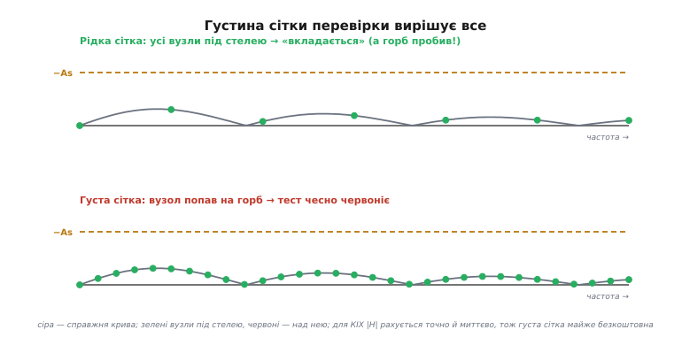

# ⚙️ Робочий модуль: завіконений sinc від коефіцієнтів до перевірки

У статті ми вже бачили [десяток рядків методу вікон](root:embedded/fir-design): ідеальний sinc, помножений на вікно Геммінга, з нормуванням на одиничне підсилення по DC. Цього досить, щоб **зрозуміти** метод. Але між «зрозуміти» й «покласти в прошивку безпілотника» лежить прірва, і вся вона зіткана з дрібниць. Що, як треба не Геммінга, а Кайзера під рівно задане As? Звідки взяти функцію Бесселя на голому Cortex-M0 без бібліотеки? Хто **доведе**, що згенерована крива справді влізла в коридор, — а не «наче влізла на графіку»? І нарешті: куди подіти готовий масив — рахувати щоразу в `init()` чи зашити константою? — і чому необережне застосування цього масиву тихо переповнить акумулятор і видасть сміття замість фільтра?

Цей практикум — про ту прірву. Ми зберемо **один цілісний модуль** проєктування КІХ-ФНЧ: він приймає специфікацію й вибір вікна, повертає масив `b[]`, нормований по DC, і поряд несе функцію-суддю, що сама перевіряє готову характеристику на відповідність масці. Усе на чистому C, без жодної зовнішньої бібліотеки, так, щоб скомпілювалося і на ПК, і на найслабшому мікроконтролері. А наприкінці — дві пастки, що коштують найбільше нервів: де зберігати коефіцієнти й чому акумулятор переповнюється навіть тоді, коли кожен окремий доданок «маленький».

> 🔧 **Навіщо це.** Готовий модуль, який ви розумієте до останнього рядка, вартий десяти викликів `scipy.signal.firwin`, що повертають масив-чорну-скриньку. У полі вам доведеться **перепроєктувати** фільтр під змінену частоту дискретизації, ужати його під такти, перевірити після зміни компілятора — і тоді цей код буде вашим, а не чужим. А функція-суддя перетворить «фільтр начебто правильний» на «фільтр **доведено** в масці» — і це різниця між спокійним сном і викликом о третій ночі.

## Задача

Сформулюймо точно, що має робити модуль. На вхід — та сама специфікація, що з [кроку про замовлення фільтра](root:embedded/filter-specification): краї смуг `fp`, `fs`, дозволені брижі `Ap`, потрібне придушення `As`, частота дискретизації `fд`. Плюс одне рішення: яким **вікном** обрізати. На вихід — масив коефіцієнтів `b[0..M]`, готовий до [згортки](book:algorithms/fir-filter), з гарантованою властивістю: на постійному струмі (нульова частота) підсилення рівно 1.0, ні на йоту більше.

Це перша половина. Друга, не менш важлива: **перевірити** те, що вийшло. Спроєктувати фільтр і повірити на слово — те саме, що написати функцію й жодного разу її не запустити. Нам потрібна друга функція, яка візьме готовий масив `b[]`, побудує його реальну частотну характеристику й чесно скаже: вкладається крива в коридор специфікації чи десь вилазить — і якщо вилазить, то **де** і **на скільки**.

Здавалося б, дрібниця — sinc та цикл. Але придивімося, скільки гострих кутів ховається навіть у цьому простому модулі:

- Геммінга — це дві константи; **Кайзер** — це функція Бесселя нульового порядку, якої немає в стандартному `math.h`. Її доведеться написати самотужки.
- Нормування по DC мусить бути **по справжній** сумі ваг, а не по якійсь приблизній формулі, — інакше підсилення попливе.
- Характеристику КІХ можна порахувати **точно й аналітично** прямо з коефіцієнтів (бо для КІХ це звичайне дискретне перетворення Фур'є вектора `b[]`), і це чесніше, ніж ганяти крізь фільтр синуси.
- Сітка частот, на якій ми перевіряємо, **сліпа між вузлами** — і якщо викид характеристики припаде в проміжок, перевірка збреше.
- Готовий масив можна зберегти двома способами, і вибір між ними — це вибір між гнучкістю й мертвою надійністю.
- А застосування масиву в [згортці](book:algorithms/fir-filter) на цілочисловому МК ховає тиху смерть: **переповнення акумулятора**, коли сума добутків вилазить за розрядність, хоч кожен доданок «маленький».

Розберемо все по черзі — спершу генерацію, тоді перевірку, тоді зберігання й застосування.

## Ідея

Уся генерація — це три дії поспіль, і ми вже бачили їх у статті; тут лише доводимо до повноти. **Перша:** взяти M+1 точок ідеального нескінченного sinc навколо центру, де центральний відлік — це окремий випадок (границя `0/0`, що дорівнює `wc/π`). **Друга:** помножити кожен відлік на відповідне значення вікна — і саме тут Геммінга й Кайзер розходяться. **Третя:** просумувати всі ваги й поділити на цю суму — щоб підсилення по DC стало рівно 1.

Чому нормуємо саме по сумі? Бо підсилення фільтра на нульовій частоті — це за визначенням сума всіх його коефіцієнтів. Постійний сигнал (DC) — це той самий рівень на всіх входах згортки; на виході він помножиться на `b[0]+b[1]+…+b[M]`. Хочемо, щоб постійний рівень проходив незмінним (фільтр низьких частот **мусить** пропускати DC недоторканим) — отже, ця сума має дорівнювати 1. Найпростіший спосіб цього добитися: порахувати фактичну суму й поділити на неї весь масив. Не наближено, не «приблизно так і буде» — а точно, по тій сумі, що реально склалася з конкретного вікна й конкретної довжини.

Тепер про вікно. Геммінга — це готова формула з двох констант, обчислюється миттєво. А **вікно Кайзера** заслуговує окремого слова, бо саме воно робить модуль по-справжньому корисним. Згадаймо зі статті: Кайзер дав вікно з **ручкою** β, якою плавно крутиш компроміс «придушення проти крутості», і формулу, що за бажаним As одразу дає потрібне β. Лишилося питання, яке стаття обійшла: а як **обчислити** саме вікно? Його формула така:

```
            I₀( β · √(1 − (2n/M − 1)²) )
   w[n]  =  ───────────────────────────────
                      I₀( β )

   де  n = 0 … M  (номер відводу),
       β          (параметр форми зі специфікації),
       I₀(x)      — модифікована функція Бесселя першого роду, нульового порядку
```

Уся «екзотика» тут — це `I₀`, **модифікована функція Бесселя** (на честь німецького астронома Фрідріха Бесселя, який увів ці функції в задачах руху планет). Звучить страшно, та насправді це лише сума ряду, що дуже швидко збігається, і написати її самому — десяток рядків. Чому саме Бессель? Бо Кайзер шукав вікно, що якнайкраще концентрує енергію в головній пелюстці, наблизивши важкі для обчислення видовжені сфероїдальні функції (англ. *prolate spheroidal*) — і виявив, що `I₀` дає чудове, дешеве наближення. Деталі цього виведення — у [математичній вставці про метод вікон](root:embedded/fir-design/math-window-method.md); нам же потрібно одне: вміти порахувати `I₀(x)` у коді.

`I₀(x)` рахують прямим підсумовуванням ряду, але не «в лоб» через факторіали (вони миттю переповнюються), а через **відношення сусідніх доданків** — кожен наступний доданок дістають із попереднього множенням на простий множник. Ряд збігається так швидко, що для будь-якого розумного β десятка-двох доданків з головою:

```
                 ∞                        2k
   I₀(x)  =  Σ  [ (x/2)^k / k! ]   =   Σ ( t_k ),   де t_0 = 1,
                k=0

                            ( x / 2 )²
   а кожен наступний:  t_k = t_{k−1} · ─────────      (відношення доданків)
                                          k²
```

Це і є ключ до дешевого Кайзера на МК: жодних факторіалів, жодних степенів — лише множення в циклі, поки доданок не стане мізерним.

А перевірка характеристики стоїть на іншій простій думці. Характеристика КІХ-фільтра — це **перетворення Фур'є його коефіцієнтів**; інакше й бути не може, бо коефіцієнти і є імпульсна характеристика, а характеристика частот — це її спектр. Тож щоб дізнатися |H| на будь-якій частоті, не треба ганяти крізь фільтр синуси й чекати усталення (як ми робили для [біквада в перевірці маски](root:embedded/filter-specification/proj-spec-struct.md), бо БІХ має нескінченну пам'ять). Для КІХ усе чесніше: підставляємо частоту прямо у формулу [дискретного перетворення Фур'є](book:math/dft) вектора `b[]` й дістаємо точне комплексне H, а з нього — модуль. Ніякого перехідного процесу, ніякого наближення — точне аналітичне значення. Лишається пройтися по сітці частот і на кожній спитати: «ти в коридорі для своєї смуги?»

## Робочий C: генерація завіконеного sinc

Почнемо з вибору вікна й функції Бесселя. Тримаємося того самого правила ясності, що й у [структурі специфікації](root:embedded/filter-specification/proj-spec-struct.md): одиниці — в іменах, жодних голих чисел розсипом.

```c
#include <stdint.h>
#include <stdbool.h>
#include <stddef.h>
#include <math.h>      // sinf, cosf, sqrtf, powf, log10f, fabsf

#ifndef M_PI
#define M_PI 3.14159265358979323846
#endif

// Який вікном обрізати ідеальний sinc.
typedef enum {
    WIN_HAMMING,    // фіксоване ~53 дБ — робочий стандарт
    WIN_KAISER      // налаштовне через beta — точно під задане As
} WindowKind;

// ── Модифікована функція Бесселя I0(x) рядом (відношення доданків) ──────────
// Без факторіалів і степенів: кожен доданок із попереднього. Збігається
// блискавично; 30 доданків покривають будь-яке розумне beta з запасом.
static double bessel_i0(double x)
{
    double term = 1.0;          // t_0 = 1
    double sum  = 1.0;          // часткова сума ряду
    double half_x_sq = (x * 0.5) * (x * 0.5);   // (x/2)^2 — спільний множник
    for (int k = 1; k < 30; ++k) {
        term *= half_x_sq / ((double)k * (double)k);   // t_k = t_{k-1}·(x/2)²/k²
        sum  += term;
        if (term < sum * 1e-12) break;     // доданок мізерний — далі марно
    }
    return sum;
}
```

Зверніть увагу на дві дрібниці, що несуть вагу. По-перше, `bessel_i0` рахує в `double`, а не `float`, хоч решта модуля може жити у `float`: проєктування ганяють **один раз**, точність тут безкоштовна, а `I₀` при великому β набирає чималі значення, де зайві біти `double` бережуть від втрати точності в знаменнику `I₀(β)`. По-друге, вихід із циклу по `term < sum·1e-12`: ми не крутимо всі 30 ітерацій наосліп, а спиняємось, щойно доданок перестав щось додавати. Це і швидко, і самоналаштовно під будь-яке β.

Тепер сама генерація. Функція бере специфікацію, число відводів `N`, вибір вікна й (для Кайзера) `beta`, і заповнює переданий масив `b[]`:

```c
// Згенерувати КІХ-ФНЧ методом вікон у b[0..N-1].
//   fc        — центр переходу, Гц:  (fp + fs)/2  (ставимо «цеглину» посередині)
//   fs_sample — частота дискретизації, Гц
//   N         — число відводів (краще НЕПАРНЕ → точний центральний відвід, чиста симетрія)
//   win, beta — вікно й (для Кайзера) його параметр форми
// Повертає false, якщо аргументи безглузді (N<1 або fc поза (0, fs/2)).
bool firwin_lpf(float *b, int N,
                float fc, float fs_sample,
                WindowKind win, float beta)
{
    if (N < 1 || fc <= 0.0f || fc >= 0.5f * fs_sample) return false;

    const int    M  = N - 1;                              // порядок
    const double wc = 2.0 * M_PI * (double)fc / fs_sample; // норм. частота зрізу
    const double i0_beta = (win == WIN_KAISER) ? bessel_i0((double)beta) : 1.0;

    double sum = 0.0;            // фактична сума ваг — для нормування по DC

    for (int k = 0; k <= M; ++k) {
        int    n = k - M / 2;                       // зсув від центру, симетрично
        double ideal;

        // 1) ідеальний sinc із чесною границею sin(0)/0 = wc/π у центрі
        if (n == 0)  ideal = wc / M_PI;
        else         ideal = sin(wc * n) / (M_PI * n);

        // 2) значення вікна для цього відводу
        double w;
        if (win == WIN_HAMMING) {
            // дві канонічні константи Геммінга
            w = 0.54 - 0.46 * cos(2.0 * M_PI * (double)k / (double)M);
        } else {  // WIN_KAISER
            // ratio = 2k/M − 1 ∈ [−1, +1]; під коренем — 1 − ratio²
            double ratio = 2.0 * (double)k / (double)M - 1.0;
            double arg   = beta * sqrt(1.0 - ratio * ratio);
            w = bessel_i0(arg) / i0_beta;
        }

        double tap = ideal * w;     // 3) завіконений відвід
        b[k] = (float)tap;
        sum += tap;                 // копимо суму у double — точніше
    }

    // 4) нормування по DC: сума ваг = 1  ⇒  підсилення на нульовій частоті = 1.0
    if (sum == 0.0) return false;   // патологія (напр. fc≈0) — не ділимо на нуль
    float inv = (float)(1.0 / sum);
    for (int k = 0; k <= M; ++k)
        b[k] *= inv;

    return true;
}
```

Прокрутимо логіку нормування руками на маленькому прикладі, бо саме там новачки роблять тиху помилку — нормують «на око» або забувають зовсім.

**Чому ділимо саме на суму.** Хай після кроків 1–3 склалися (умовно) три ваги в центрі фільтра: `0.20, 0.46, 0.20`, а решта дрібні, і вся сума вийшла `sum = 1.08`. Подамо на вхід постійний рівень `x = 1.0` (це і є DC). [Згортка](book:algorithms/fir-filter) дасть на виході:

```
y_DC = Σ b[k]·1.0 = sum = 1.08      // підсилення по DC = 1.08, а не 1!
```

Фільтр **підсилив** постійну складову на 8% — і так само на 8% поїде вся смуга пропускання, бо нормування зачіпає всі частоти однаково. Око цього не помітить (форма крива правильна), а сигнал тихо роздується. Лік — поділити кожен `b[k]` на `1.08`:

```
inv = 1.0 / 1.08 ≈ 0.9259
b'[центр] = 0.46 · 0.9259 ≈ 0.4259
нова сума = 1.08 · 0.9259 = 1.000      // тепер підсилення по DC рівно 1.0
```

Ось і вся магія нормування: не формула, а чесний поділ на ту суму, що реально склалася. Тому ми й копимо `sum` під час генерації, а не вгадуємо її наперед.

> 🔧 **Навіщо це.** Завжди нормуйте по **фактичній** сумі, порахованій у тому ж циклі, а не за табличним коефіцієнтом «для Геммінга довжини N». Щойно ви поміняли вікно, довжину чи β — табличний коефіцієнт збреше, а фактична сума завжди правдива. Один зайвий `double sum` у циклі коштує нічого, а боронить від цілого класу помилок «фільтр тихо масштабує сигнал», які проявляються аж тоді, коли щось переповнюється нижче по тракту.

А ось як цей модуль викликають — з тією самою телефонною специфікацією, що проходить через увесь крок. Тут видно, як специфікація перетворюється на (N, β) перед генерацією:

```c
#define FS_SAMPLE   16000.0f
#define FP          3400.0f      // край пропускання (мова)
#define FS_STOP     4000.0f      // край затримання
#define AS_DB       60.0f        // потрібне придушення

void design_demo(void)
{
    const float fc = 0.5f * (FP + FS_STOP);          // центр переходу = 3700 Гц

    // β під As за формулою Кайзера (третя гілка, бо As > 50 дБ) — як у статті
    const float beta = 0.1102f * (AS_DB - 8.7f);     // ≈ 5.65

    // Оцінка довжини за Кайзером (точніша за прикидку Гарріса):
    //   N ≈ (As − 8) / (2.285 · Δω) + 1,   Δω — ширина переходу в радіанах
    const float dw = 2.0f * (float)M_PI * (FS_STOP - FP) / FS_SAMPLE;  // ≈ 0.2356
    int N = (int)ceilf((AS_DB - 8.0f) / (2.285f * dw)) + 1;           // ≈ 98
    if ((N & 1) == 0) N += 1;                          // зробимо непарним → точний центр

    static float b[129];                              // з запасом під N
    if (firwin_lpf(b, N, fc, FS_SAMPLE, WIN_KAISER, beta)) {
        // b[] готовий: нормований по DC, лінійно-фазовий КІХ-ФНЧ
    }
}
```

Тут варто спинитися на оцінці довжини, бо вона **точніша** за грубу прикидку Гарріса зі статті. Кайзерова формула `N ≈ (As − 8)/(2.285·Δω) + 1` дає для нашого випадку:

```
Δω = 2π·(4000−3400)/16000 = 2π·0.0375 ≈ 0.2356  радіан
N  ≈ (60 − 8) / (2.285 · 0.2356) + 1
   = 52 / 0.5384 + 1  ≈  96.6 + 1  ≈  98  →  99 (непарне)
```

Цікаво порівняти: прикидка Гарріса в статті дала ~73 відводи, а точніша Кайзерова — ~99. Розбіжність не помилка: правило Гарріса свідомо грубе («на серветці»), коефіцієнт 22 в ньому усереднений; Кайзерова формула враховує, що ми тиснемо аж на 60 дБ, і чесно вимагає довшого фільтра. Бери Гарріса для миттєвої прикидки ціни, а Кайзера — коли пора різати масив у прошивку. І завжди перевіряй результат — до чого ми й переходимо.

## Робочий C: перевірка характеристики проти маски

Тепер суддя. На відміну від [перевірки біквада синусами](root:embedded/filter-specification/proj-spec-struct.md), для КІХ ми порахуємо характеристику **аналітично** — прямим обходом дискретного перетворення Фур'є по коефіцієнтах. Це і точніше (немає перехідного процесу), і прозоріше: формула одна, прямо з означення.

Характеристика КІХ на нормованій частоті ω — це сума коефіцієнтів, кожен зі своїм фазовим повертом:

```
            M
   H(ω)  =  Σ  b[k] · e^(−j·ω·k)        (комплексне число)
           k=0

   а нам потрібен його МОДУЛЬ:
   |H(ω)|  =  √( Re² + Im² ),   де
   Re = Σ b[k]·cos(ω·k),   Im = − Σ b[k]·sin(ω·k)
```

Це звичайнісіньке [ДПФ](book:math/dft), обчислене в одній точці ω. Ось функція, що рахує |H| на заданій частоті в герцах:

```c
// |H(f)| для КІХ із коефіцієнтами b[0..N-1] — точно, через ДПФ в одній точці.
// Жодного фільтрування й усталення: для КІХ характеристика = спектр коефіцієнтів.
static float fir_mag_at(const float *b, int N, float f, float fs_sample)
{
    const double w = 2.0 * M_PI * (double)f / fs_sample;   // норм. частота, рад
    double re = 0.0, im = 0.0;
    for (int k = 0; k < N; ++k) {
        re += (double)b[k] * cos(w * k);
        im -= (double)b[k] * sin(w * k);
    }
    return (float)sqrt(re * re + im * im);     // модуль |H| у разах
}
```

Тепер — обхід сітки частот із класифікацією за смугами. Логіка маски дзеркальна до тієї, що ми вже розібрали в [структурі специфікації](root:embedded/filter-specification/proj-spec-struct.md): у пропусканні крива не сміє **впасти** нижче `−Ap`, у затриманні — **піднятися** вище `−As`, у переході не перевіряємо нічого. Переклад між разами й децибелами — той самий закон [децибела](book:electronics/decibels) (коефіцієнт **20**, бо амплітуда, не потужність):

```c
typedef struct {
    float fp, fs;          // краї смуг, Гц
    float Ap_dB, As_dB;    // дозволені брижі / потрібне придушення, дБ (додатні)
    float fs_sample;       // частота дискретизації, Гц
} FilterSpec;

typedef struct {
    bool  pass;
    float worst_margin_dB; // мінімальний запас до маски (>0 запас, <0 виліз)
    float worst_freq;      // частота найгіршого запасу
} MaskResult;

// дБ амплітуди ↔ рази, із захистом log10(0)
static float lin_to_db(float mag) {
    float m = fabsf(mag);
    if (m < 1e-12f) m = 1e-12f;          // −240 дБ ≈ «практично нуль»
    return 20.0f * log10f(m);
}

// Перевірити коефіцієнти b[0..N-1] проти маски на сітці freq[0..ng-1].
MaskResult fir_check_mask(const float *b, int N, const FilterSpec *s,
                          const float *freq, int ng)
{
    MaskResult r = { .pass = true, .worst_margin_dB = 1e9f, .worst_freq = 0.0f };

    const float pass_floor_dB = -s->Ap_dB;   // підлога пропускання, напр. −1 дБ
    const float stop_ceil_dB  = -s->As_dB;   // стеля затримання,   напр. −60 дБ
    const float nyquist       = 0.5f * s->fs_sample;

    for (int i = 0; i < ng; ++i) {
        float f = freq[i];
        if (f > nyquist) continue;            // вище Найквіста частот нема

        float db = lin_to_db(fir_mag_at(b, N, f, s->fs_sample));

        if (f <= s->fp) {                     // ── ПРОПУСКАННЯ: не нижче підлоги
            float margin = db - pass_floor_dB;
            if (margin < r.worst_margin_dB) { r.worst_margin_dB = margin; r.worst_freq = f; }
            if (db < pass_floor_dB) r.pass = false;

        } else if (f >= s->fs) {              // ── ЗАТРИМАННЯ: не вище стелі
            float margin = stop_ceil_dB - db;
            if (margin < r.worst_margin_dB) { r.worst_margin_dB = margin; r.worst_freq = f; }
            if (db > stop_ceil_dB) r.pass = false;
        }
        // інакше — перехідна смуга (fp < f < fs): не нормована, пропуск
    }
    return r;
}
```

Серце тут — `fir_mag_at`: для КІХ характеристика дістається **точно** з коефіцієнтів, без жодного наближення. Це найприємніша властивість скінченного фільтра: його спектр — це просто перетворення Фур'є короткого вектора `b[]`, і ми можемо обчислити його в будь-якій точці без симуляції. Дзеркальна симетрія двох робочих гілок маски — та сама, що й завжди: у пропусканні небезпека знизу (`db < підлога`), у затриманні згори (`db > стеля`). Переплутати знак — найтихіша помилка, бо `<` замість `>` чудово компілюється й мовчить.

А ось і зведення всього докупи — спроєктували й одразу довели, що крива в масці. Це природний юніт-тест у дусі [пірамідального тестування прошивки](root:embedded/firmware-testing): дано специфікацію — згенерували `b[]` — звірили з коридором.

```c
int test_design_meets_mask(void)
{
    FilterSpec spec = {
        .fp = 3400.0f, .fs = 4000.0f,
        .Ap_dB = 1.0f, .As_dB = 60.0f,
        .fs_sample = 16000.0f,
    };
    const float fc   = 0.5f * (spec.fp + spec.fs);
    const float beta = 0.1102f * (spec.As_dB - 8.7f);          // ≈ 5.65
    const float dw   = 2.0f*(float)M_PI*(spec.fs - spec.fp)/spec.fs_sample;
    int N = (int)ceilf((spec.As_dB - 8.0f) / (2.285f * dw)) + 1;
    if ((N & 1) == 0) N += 1;

    static float b[129];
    if (!firwin_lpf(b, N, fc, spec.fs_sample, WIN_KAISER, beta)) return 1;

    // Сітка ГУСТА біля країв і по всьому затриманню — інакше прогавимо викид (нижче).
    float freq[400];
    int ng = 0;
    for (float f = 50.0f; f < 0.5f*spec.fs_sample; f += 20.0f)   // рівномірно густо
        if (ng < 400) freq[ng++] = f;

    MaskResult r = fir_check_mask(b, N, &spec, freq, ng);
    if (!r.pass) {
        printf("ПРОВАЛ: виліз із маски на %.2f дБ при %.0f Гц (N=%d)\n",
               -r.worst_margin_dB, r.worst_freq, N);
        return 1;
    }
    if (r.worst_margin_dB < 1.0f)
        printf("УВАГА: запас лише %.2f дБ при %.0f Гц — фільтр на межі\n",
               r.worst_margin_dB, r.worst_freq);
    printf("OK: N=%d, крива в масці (запас %.2f дБ)\n", N, r.worst_margin_dB);
    return 0;
}
```

Тепер проєктування замкнулося в чесний цикл: порахували → перевірили → якщо виліз, підкрутили β або N і повторили. Не «здається, влізло», а доведено машиною — і той самий код біжить на хості за мить і переноситься на чип без єдиної зміни.

> 🔧 **Навіщо це.** Тримайте генерацію й перевірку **поряд, в одному модулі**, і ганяйте перевірку на кожен коміт. Тоді будь-яка зміна — інша частота дискретизації, ужата довжина, перехід `double`→`float` — або лишає тест зеленим, або миттю червонить його з точним «на скільки дБ і де». Це перетворює проєктування фільтра з мистецтва, доступного жерцям DSP, на звичайну інженерію з регресійним захистом.

## Куди подіти коефіцієнти: const у прошивці проти розрахунку в init()

Модуль готовий. Постає практичне питання, на якому ламають списи: фільтр у прошивці — це масив `b[]`, але **звідки** він там береться в робочому пристрої? Два шляхи, і вибір не косметичний.

**Шлях перший — порахувати один раз у `init()`.** Кладемо `firwin_lpf` у прошивку, при старті системи викликаємо його, він заповнює `b[]` у ОЗП, далі фільтр працює. Виглядає природно — увесь код в одному місці.

**Шлях другий — порахувати на ПК під час розробки, а в прошивку зашити готовий масив `const`.** Ганяємо `firwin_lpf` (чи `scipy`) на робочому столі, друкуємо отриманий масив і вставляємо його в код константою:

```c
// Згенеровано firwin_lpf: ФНЧ, fp=3400 fs=4000 As=60 fд=16000, Кайзер β=5.65, N=99.
// Підсилення по DC нормоване до 1.0. НЕ редагувати руками — перегенерувати.
static const float B_LPF[99] = {
    -0.000018f, 0.000041f, 0.000087f, /* … ще 93 числа … */ 0.000087f,
     0.000041f, -0.000018f,
};
```

Який кращий? Для **переважної більшості** вбудованих задач — **другий, const**, і ось ланцюжок чому.

Розрахунок у `init()` тягне в прошивку важку математику, яка більше ніколи не знадобиться: `sin`, `cos`, `sqrt`, а для Кайзера ще й `bessel_i0` з її циклом. На малому МК це **кілобайти** коду заради дій, що виконуються раз за все життя пристрою — чистий податок на флеш і на час старту. Зашитий `const` цього коду не потребує зовсім: масив лягає у флеш готовим, генератор лишається на ПК.

Далі — **детермінованість**. Зашитий масив однаковий **завжди**: ви бачите ті самі числа в коді, перевірили їх раз нашою функцією-суддею — і вони не зміняться ні від версії компілятора, ні від його прапорів оптимізації, ні від того, як саме ваш `float`-sin округлив на цьому залізі. Розрахунок у `init()` дає характеристику, що **залежить від того, як порахувалося на чипі**: інша реалізація `sinf` у newlib проти ПК — і коефіцієнти трішки інші, а отже, й перевірена на ПК крива вже не та, що поїхала в поле.

І третє — **флеш дешевший за ризик**. Масив на 99 коефіцієнтів `float` — це 396 байтів флешу, копійки. Заради економії цих копійок тягти в прошивку повний апарат проєктування й погодитися, що крива тепер залежить від рантайму, — поганий розмін.

Коли тоді **варто** рахувати в `init()`? Рівно в одному випадку: коли параметри фільтра **невідомі на час компіляції** й мають вибиратися на льоту — наприклад, частота зрізу залежить від поточного режиму, від конфігурації, від калібрування, прочитаного з EEPROM. Тоді вибору немає: рахуй на старті (або при зміні режиму). Але навіть тут краще тримати **скінченний набір** заздалегідь порахованих `const`-масивів і перемикатися між ними, ніж рахувати з нуля, — якщо режимів небагато.

> 🔧 **Навіщо це.** Правило-замовчування: **рахуй на ПК, клади const у флеш**. Прошивка стає меншою, старт швидшим, а характеристика — біт-у-біт тією, що ви перевірили суддею. Лишай розрахунок у `init()` тільки тоді, коли параметри справді не відомі до запуску; і навіть тоді спершу спитай себе, чи не звести все до кількох наперед порахованих наборів. Зайвий апарат проєктування в прошивці — це код, що може зламатися, заради гнучкості, якої вам, найпевніше, не треба.

## Пастка застосування: переповнення акумулятора

Лишилася найпідступніша пастка, і вона **не** в проєктуванні, а в **застосуванні** готового `b[]`. Стаття згадала [згортку](book:algorithms/fir-filter) як просту річ: «помножив відліки на ваги й просумував». На `float` так і є. А от на цілочисловому МК без FPU (дешеві Cortex-M0, старі AVR) ця невинна сума ховає тиху смерть.

Подивімося, що таке застосування КІХ у фіксованій комі. Коефіцієнти `b[]` — дробові числа близько ±0.5, тож їх зберігають масштабованими цілими: множать на `2^15 = 32768` і округлюють (формат [Q15](book:programming/fixed-point)). Відліки з 12-бітного АЦП — теж цілі. Згортка стає сумою добутків двох цілих:

```c
// НЕБЕЗПЕЧНО НА МК: акумулятор замалий
int16_t b_q15[N];     // коефіцієнти у Q15: b[k]·32768, округлені
int16_t x[N];         // відліки (напр. з 12-бітного АЦП)

int16_t fir_step_BROKEN(const int16_t *b_q15, const int16_t *x, int N)
{
    int16_t acc = 0;                       // ← ПОМИЛКА: 16 біт замало!
    for (int k = 0; k < N; ++k)
        acc += (int16_t)((b_q15[k] * x[k]) >> 15);   // і добуток теж переповнюється
    return acc;
}
```

Тут **два** переповнення накладаються одне на одне, і обидва тихі.

**Перше — добуток.** `b_q15[k]` і `x[k]` — обидва 16-бітні. Їхній добуток може сягати `32767 × 32767 ≈ 10⁹`, а це **32 біти**. Якщо компілятор порахує його в 16 бітах (а він порахує, якщо ви не змусили його інакше), старші біти просто відрубаються — добуток перетворюється на випадкове число. Сам зсув `>> 15` теж має бути 32-бітним, інакше зсуваєте вже зіпсоване.

**Друге, головне — сума.** Навіть якщо кожен доданок ви акуратно звузили назад до розумного діапазону, **сума N таких доданків** виходить за 16 біт. У цьому й уся підступність, через яку пастку так легко проґавити: кожен окремий доданок «маленький», ніщо не кричить про переповнення — а сума 99 «маленьких» чисел спокійно вилазить за `±32767`. Уявіть найгірший випадок: усі відліки на максимумі й того самого знаку, що й ваги. Сума добутків набіжить далеко за межу `int16_t`, акумулятор **обгорнеться** через нуль — і фільтр замість плавної кривої видасть стрибок з плюса в мінус. На звуці це тріск; на сигналі давача це викид, що зведе з розуму регулятор нижче по тракту.

Лік прямий: **акумулюй із запасом розрядності**. Сума добутків Q15-чисел мусить копитися у **32-бітному** (а на довгих фільтрах і 64-бітному) акумуляторі, і лише наприкінці результат масштабують назад і зводять у вихідний тип:

```c
// ПРАВИЛЬНО: 32-бітний (за потреби 64-бітний) акумулятор + насичення на виході
int16_t fir_step_OK(const int16_t *b_q15, const int16_t *x, int N)
{
    int64_t acc = 0;                              // широкий акумулятор
    for (int k = 0; k < N; ++k)
        acc += (int32_t)b_q15[k] * (int32_t)x[k]; // добуток у 32 біт, копимо в 64

    acc >>= 15;                                   // масштаб назад із Q15 — ОДИН раз, у кінці

    // НАСИЧЕННЯ замість обгортання: краще «уперлось у стелю», ніж стрибок через нуль
    if (acc >  32767) acc =  32767;
    if (acc < -32768) acc = -32768;
    return (int16_t)acc;
}
```

Три речі тут несуть вагу. По-перше, `(int32_t)b_q15[k] * (int32_t)x[k]` — приведення **до множення**: змушуємо компілятор рахувати добуток у 32 бітах, а не в 16; без цих приведень помилка лишається, хоч `acc` і широкий. По-друге, `acc` 64-бітний: 32 біти добутку плюс `log₂(N)` бітів на суму N доданків; для 99 відводів треба ще ~7 бітів, 32-бітного акумулятора **впритул** вистачає лише за обережного масштабування, а 64-бітний знімає питання назавжди ціною кількох тактів. По-третє, масштаб `>> 15` робимо **один раз наприкінці**, а не в циклі: зсувати кожен доданок — це втрачати молодші біти на кожному кроці й накопичувати похибку округлення; копи повну точність, ріж раз. І нарешті — [насичення](book:programming/saturating-arithmetic) замість мовчазного обгортання: якщо результат усе ж вилазить, хай **упреться** в межу (звук стане тихо спотвореним), а не **стрибне** з максимуму в мінімум (різкий тріск, викид). Перше неприємне, друге — катастрофа для всього, що стоїть за фільтром.

> 🔧 **Навіщо це.** Найкоротше правило фіксованої коми у згортці: **акумулятор удвічі ширший за добуток, масштаб — один раз у кінці, на виході — насичення.** Це той клас помилок, що тиждень не проявляється, бо за тихих сигналів сума не доходить до межі, а тоді гучний транзієнт раз переповнює акумулятор — і ви ловите «випадковий» тріск, якого не можете відтворити. Знаючи механізм, ви його не напишете; а DSP-ядра (`__SMLAL` на Cortex-M4, MAC на AVR) саме тому й мають апаратний широкий акумулятор — залізо знає про цю пастку краще за початківця.

## Складність і пастки

Зведімо гострі кути всього модуля — кожен реальний, кожен дає код, що компілюється й тихо бреше.

- **Парність N і центральний відвід.** Беріть N **непарним**. Тоді M парний, `M/2` ціле, і є точний центральний відвід `n = 0` — той самий, де sinc дорівнює `wc/π`, найбільший і симетрично оточений рештою. За парного N центру «між відліками» немає, симетрія трохи інша (фільтр типу II), і ФВЧ/смугороз так узагалі не зробиш через нуль на Найквісті. Для ФНЧ парне N працює, але непарне — простіше й безпечніше; якщо оцінка дала парне, додайте один (як у коді).

- **Границя sin(0)/0 у центрі.** Якщо забути окрему гілку `n == 0`, формула `sin(wc·n)/(π·n)` дасть `0.0/0.0 = NaN` рівно в центрі — і весь масив отруїться, бо нормування ділитиме на суму з NaN. Підступність у тім, що промах саме в **найбільшому** відводі. Завжди підставляйте границю `wc/π` явно.

- **Нормування по фактичній сумі, не по таблиці.** Спокуса взяти готовий коефіцієнт нормування «для Геммінга» з довідника. Не треба: поміняли вікно, β чи довжину — і коефіцієнт збрехав. Копіть `sum` у тому ж циклі й діліть на неї. Зайвий `double` коштує нічого, а правда завжди свіжа.

- **`float` проти `double` в генерації.** Проєктування ганяють раз — рахуйте проміжне (sinc, вікно, суму, особливо `bessel_i0`) у `double`. Особливо суму для нормування: складати сотню дрібних `float` означає втрачати молодші біти, і нормування трохи попливе. Кінцевий масив можна звузити до `float` (фільтр у прошивці однаково там живе) — але **рахуйте** широко.

- **Сітка перевірки сліпа між вузлами.** `fir_check_mask` бачить лише ті частоти, що ви дали. Якщо в затриманні є вузький викид між вузлами — а він буває, це нормальні «горби» між нулями характеристики, — перевірка прогавить його й рапортує «вкладається». Лік той самий, що й завжди: **густа** сітка (сотні точок коштують мікросекунди на хості) плюс згущення біля країв смуг, де маска найтісніша. Для відповідальних випадків — перевіряти ще й із невеликим запасом до стелі. Ніколи не вірте рідкій сітці.

  
  *Чому густина сітки перевірки вирішує все. Сіра крива — справжня характеристика КІХ у смузі затримання з типовим «горбом» між нулями. Рідкі вузли (зверху) лягли повз горб — усі під стелею, перевірка каже «вкладається», хоч горб її пробив. Густа сітка (знизу) ловить горб і чесно червонить тест. Для КІХ це особливо просто: `fir_mag_at` рахує |H| точно й миттєво в будь-якій точці, тож густа сітка майже безкоштовна.*

- **Коефіцієнт 20, не 10, у дБ.** `lin_to_db` рахує `20·log10`, бо |H| — амплітуда, не потужність. Поставите 10 — усі запаси й порушення поїдуть рівно вдвічі, фільтр «пройде» удвічі легше, ніж насправді. Класична тиха помилка; тримайте перекладач в одному місці.

- **Захист log10 від нуля.** Глибоко в затриманні |H| у `float` може округлитися до нуля, а `log10f(0)` — це `−∞`, що отруїть `worst_margin`. `fabsf` + відсікання `1e-12f` перетворюють це на чесні «−240 дБ». NaN у порівняннях поводиться підступно (`NaN < x` завжди хибне), тож порушення може **не зарахуватися** — відсікайте нуль.

- **Кайзерова β й границі гілок формули.** Формула β зі статті має три гілки за As (≤21, 21…50, >50 дБ). На стику 50 дБ гілки злегка не сходяться — це нормально для емпіричної апроксимації, але не плутайте, **яку** гілку брати: для типових As > 50 дБ це третя, `0.1102·(As − 8.7)`. Помилка тут дасть не той β, а отже, не те придушення — і фільтр або не дотисне завади, або з'їсть зайві відводи.

- **Ширина переходу Δω у формулі N — у радіанах, не в герцах.** Кайзерова оцінка `N ≈ (As−8)/(2.285·Δω)+1` вимагає Δω **нормованою** (`2π·Δf/fд`), а не сирою в герцах. Підставите герци — і N вийде безглуздо великим або малим. Це найчастіша арифметична помилка в усьому проєктуванні: переплутати фізичну частоту з нормованою. Тримайте в коді `dw` явно як `2π·(fs−fp)/fд` і не змішуйте з герцовими `fp`, `fs`.

- **Переповнення акумулятора в застосуванні (головне).** Розібране вище: на цілочисловому МК добуток Q15-чисел — 32 біти, сума N добутків — ще ширша. Акумулюй у 64 (мінімум 32) бітах, масштабуй раз у кінці, на виході — [насичення](book:programming/saturating-arithmetic), не обгортання. Кожен доданок «маленький», тому пастку легко проґавити — а вона валить фільтр тріском на гучному транзієнті.

Підсумок думки короткий. Метод вікон у статті — десять рядків ідеї; робочий модуль — ті самі десять рядків плюс усе, що відрізняє навчальний приклад від коду в полі. Кайзер замість фіксованого Геммінга — і з'являється власна функція Бесселя. Перевірка замість віри — і з'являється точне ДПФ по коефіцієнтах із суддею-маскою. Зберігання — і з'являється правило «const у флеш, не розрахунок на старті». Застосування — і з'являється найтихіша пастка модуля, переповнення акумулятора. Кожна з цих дрібниць — не формальність, а рівно те місце, де фільтр замість роботи тихо бреше. Назвавши їх усі, ви дістаєте модуль, якому можна довірити сигнал давача в контурі, що сам себе стабілізує, — а не «начебто правильний масив чисел».
