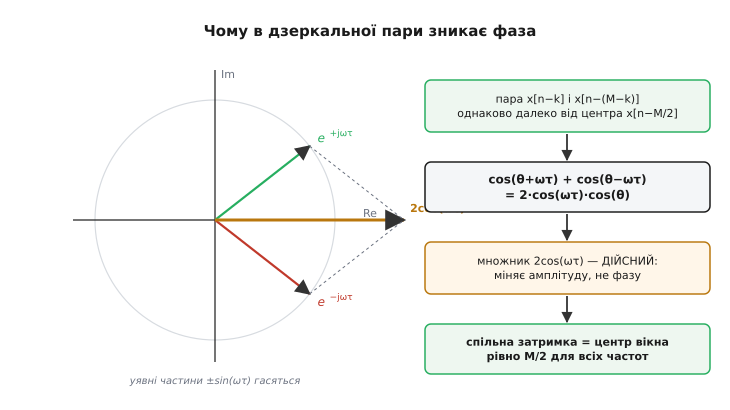
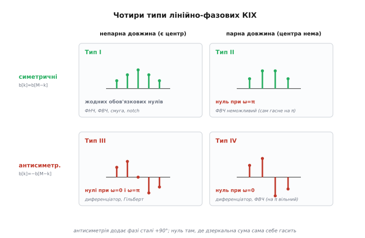

# 🧮 Чому симетрія відводів дає рівно лінійну фазу

> У самій темі ми вже бачили головну ідею: симетричний [КІХ](book:algorithms/fir-filter) із коефіцієнтами `b[k] = b[M−k]` зсуває всі частоти на однаковий час і тому не псує форму сигналу. Там це показано в загальних рисах — на одній парі доданків. Тут доведемо це **до кінця й строго**: що (анти)симетрія відводів — не просто зручна властивість, а **необхідна й достатня** умова строго лінійної фази. Розберемо обидва випадки — симетричний і антисиметричний, — усі **чотири типи** лінійно-фазових КІХ із їхніми вимушеними нулями, і нарешті доведемо, чому [БІХ](book:algorithms/iir-filter) із його нескінченним однобічним хвостом такої фази мати не може **в принципі**. Апарат простий: сума за відводами, формула Ойлера, дві шкільні тотожності для косинусів та синусів — і жодного LaTeX, лише алгебра на очах.

### Що саме ми доводимо: точне означення лінійної фази

Перш ніж щось доводити, треба гостро сформулювати, **що** саме ми хочемо. «Лінійна фаза» звучить як властивість графіка, але за нею стоїть точна вимога до того, як фільтр діє на кожну синусоїду.

Візьмімо частотну характеристику фільтра — комплексне число `H(ω)` на кожній частоті `ω`. Будь-яке комплексне число розкладається на **модуль** і **фазу**:

```
 H(ω) = |H(ω)| · e^(jφ(ω))
```

Модуль `|H(ω)|` каже, у скільки разів фільтр послаблює синусоїду частоти `ω`; фаза `φ(ω)` — на який кут він її зсуває. Із послабленням усе гаразд, ми для того й фільтруємо. Уся інтрига — у фазі.

**Строго лінійна фаза** означає, що `φ(ω)` — це пряма лінія через початок координат:

```
 φ(ω) = −α · ω          (α — стала, та сама для всіх ω)
```

Чому саме така форма береже форму сигналу — ми вже бачили: зсув синусоїди в часі на `τ` секунд додає їй фазу `−ω·τ`, тож фаза, пропорційна частоті, означає **однаковий часовий зсув** `τ = α` для всіх частот. Це і є стала **групова затримка** `τ = −dφ/dω = α`. Усі частоти запізнюються на той самий час — форма доходить ціла.

Але тут ховається тонкість, яку легко проґавити й через яку виведення часто виходить неповним. Пряма `φ(ω) = −α·ω` проходить **точно через нуль**: за `ω = 0` фаза теж нуль. А буває ще й **узагальнено лінійна фаза** — коли пряма має той самий нахил, але зсунута на сталу:

```
 φ(ω) = β − α · ω       (β — стала фазова добавка)
```

Групова затримка `−dφ/dω = α` тут **така сама** — стала, форма так само ціла (доданок `β` — це просто спільний фазовий поворот усіх частот, він не розповзає їх у часі). Ця добавка `β` виявиться критичною: саме вона відрізнить симетричні фільтри від антисиметричних. Для симетричних `β = 0` (строго лінійна фаза), для антисиметричних `β = ±π/2` (узагальнено лінійна). Тримаймо це в голові — до нього ми прийдемо самі.

> 🔧 **Навіщо це.** Розрізнення «строго» (`β=0`) і «узагальнено» (`β=±π/2`) — не педантизм. Диференціатор і перетворювач Гільберта — це саме антисиметричні КІХ із `β=+π/2`; без цієї сталої 90° вони б не працювали. Тобто зрозуміти, звідки береться `β`, — це зрозуміти, чому ці два корисні фільтри взагалі можливі й чому їх не зробити симетричними.

### Достатність, симетричний випадок: групуємо дзеркальні пари

Тепер — власне доведення, і почнемо з боку **достатності**: покажемо, що якщо коефіцієнти симетричні, то фаза гарантовано лінійна. Візьмемо КІХ довжиною `N` відводів, тобто **порядку** `M = N−1` (найбільша затримка у формулі — `x[n−M]`). Його вихід:

```
             M
 y[n] =      Σ   b[k] · x[n−k]
            k=0
```

Щоб дістати частотну характеристику, подамо на вхід чисту комплексну синусоїду `x[n] = e^(jωn)` — універсальний спосіб «зважити» фільтр на частоті `ω`. Тоді `x[n−k] = e^(jω(n−k)) = e^(jωn) · e^(−jωk)`, і множник `e^(jωn)` виноситься за суму:

```
                        M
 y[n] = e^(jωn) ·       Σ   b[k] · e^(−jωk)
                       k=0
```

Уся сума праворуч і є частотна характеристика — те, на що помножилася вхідна синусоїда:

```
             M
 H(ω) =      Σ   b[k] · e^(−jωk)
            k=0
```

Тепер — ключовий хід. Замість підсумовувати доданки поспіль, згрупуймо їх **дзеркальними парами**: доданок `k` з доданком `M−k`. Це має сенс саме тому, що в симетричного фільтра в них **однаковий коефіцієнт**: `b[k] = b[M−k]`. Пара дає:

```
 b[k]·e^(−jωk) + b[M−k]·e^(−jω(M−k))
   = b[k] · ( e^(−jωk) + e^(−jω(M−k)) )        бо b[k] = b[M−k]
```

Винесімо з дужок спільний множник `e^(−jωM/2)` — фазу **центра** фільтра. Показники в дужках стануть симетричними навколо нуля:

```
 e^(−jωk) + e^(−jω(M−k))
   = e^(−jωM/2) · ( e^(−jω(k−M/2)) + e^(−jω(M/2−k)) )
   = e^(−jωM/2) · ( e^(+jω(M/2−k)) + e^(−jω(M/2−k)) )
```

Позначмо `τ = M/2 − k` — це «плече» пари, її відстань від центра. У дужках лишилося `e^(+jωτ) + e^(−jωτ)`, а це рівно **формула Ойлера** для косинуса:

```
 e^(+jωτ) + e^(−jωτ) = 2·cos(ωτ)
```

Отже кожна дзеркальна пара зводиться до:

```
 b[k] · e^(−jωM/2) · 2·cos( ω·(M/2 − k) )
```

Ось де сталося диво, заради якого все й затівалося. Множник `2·cos(ω·(M/2−k))` — **чисто дійсний**: у ньому немає уявної частини, а отже немає й фази. Уся фаза пари сидить в одному-єдиному спільному множнику `e^(−jωM/2)` — і він **однаковий для всіх пар**, бо `M/2` від `k` не залежить. Косинус може бути додатним чи від'ємним — але дійсне число має фазу або `0` (коли додатне), або `π` (коли від'ємне); ні те, ні те не залежить від `ω` неперервно, тобто **групову затримку** (нахил фази) не міняє. Знак косинуса дасть про себе знати пізніше, коли ми говоритимемо про нулі, — а поки що важливо: пара нічого не додає до нахилу фази.


*Геометрія причини. Два відліки дзеркальної пари стоять однаково далеко від центра вікна, тож для синусоїди дають вектори e^(+jωτ) і e^(−jωτ) — дзеркальні відносно дійсної осі. Їхні уявні частини (+sin і −sin) точно гасяться, і сума лягає на дійсну вісь як 2cos(ωτ). Дійсний множник міняє лише амплітуду, а всю фазу забирає спільний центр вікна — звідси однакова затримка M/2 для всіх частот.*

### Складаємо все: одна дійсна амплітуда й одна спільна затримка

Тепер просумуймо внески всіх пар. Спільний множник `e^(−jωM/2)` виноситься за всю суму, бо він у кожної пари той самий:

```
 H(ω) = e^(−jωM/2) · A(ω),   де   A(ω) = Σ  b[k]·2·cos( ω·(M/2 − k) )
                                       пари
```

(Якщо `N` непарне, у фільтра є **центральний** відвід `k = M/2`; він сам собі дзеркальний, стоїть точно в центрі, тож дає одиничний доданок `b[M/2]·e^(−jωM/2)` — той самий множник `e^(−jωM/2)`, помножений на дійсне `b[M/2]`. Він теж лягає в `A(ω)`, просто без множника 2.)

Дивимося на результат. `A(ω)` — **сума дійсних косинусів із дійсними вагами**, отже сама **дійсна функція** частоти (її звуть **амплітудною характеристикою**, англ. *amplitude response* — на відміну від модуля `|H|`, вона може бути й від'ємною). А `e^(−jωM/2)` — це рівно лінійна фаза з нахилом `α = M/2`. Тобто:

```
 H(ω) = A(ω) · e^(−jωM/2)
        \___/   \_______/
      амплітуда   лінійна фаза, нахил M/2
```

Фаза `H(ω)` — це фаза `e^(−jωM/2)`, тобто `φ(ω) = −(M/2)·ω`, **пряма через нуль**. А `A(ω)`, будучи дійсною, у фазу нічого не додає, крім хіба стрибків на `π` там, де вона змінює знак (про них — далі, у розділі про нулі). Групова затримка `−dφ/dω = M/2` — **стала**, однакова для всіх частот. Достатність доведена: симетрія відводів → строго лінійна фаза → спільна групова затримка рівно `M/2` відліків.

Зверніть увагу, як природно випала **величина** затримки: `M/2` — це геометричний центр вікна, його «центр ваги». Симетрична імпульсна характеристика має центр, і саме на цей центр запізнюється весь сигнал. Ніякої магії — чиста геометрія дзеркала.

> 🔧 **Навіщо це.** Формула затримки `M/2` — це не абстракція, а число, яке ви щодня закладаєте в бюджет [затримки фільтра](root:embedded/filter-latency-budget). КІХ на `N = 401` відвід — це `M/2 = 200` відліків запізнення, і на частоті 1 кГц це рівно 200 мс. У контурі керування така затримка [підриває стійкість петлі](root:embedded/loop-stability) швидше, ніж будь-яка користь від фільтра встигає проявитися. Тому, проєктуючи лінійно-фазовий КІХ, ви завжди платите половиною його довжини — і це виведення каже точно, скільки саме.

### Антисиметричний випадок: звідки береться стала 90°

А що, як коефіцієнти не симетричні, а **антисиметричні** — дзеркальні з протилежним знаком: `b[k] = −b[M−k]`? Пройдемо той самий шлях і побачимо, де він розійдеться.

Пара тепер дає **різницю** експонент, бо коефіцієнти протилежні:

```
 b[k]·e^(−jωk) + b[M−k]·e^(−jω(M−k))
   = b[k] · ( e^(−jωk) − e^(−jω(M−k)) )           бо b[M−k] = −b[k]
   = b[k] · e^(−jωM/2) · ( e^(+jωτ) − e^(−jωτ) )   τ = M/2 − k
```

І тут вступає **інша** формула Ойлера — для синуса:

```
 e^(+jωτ) − e^(−jωτ) = 2j·sin(ωτ)
```

З'явилося `j`! Пара зводиться до:

```
 b[k] · e^(−jωM/2) · 2j·sin(ωτ) = 2·b[k]·sin(ωτ) · j·e^(−jωM/2)
```

Множник `2·b[k]·sin(ωτ)` — знову дійсний (сама амплітуда), а от попереду тепер стоїть `j·e^(−jωM/2)`. Що таке `j` у показнику фази? Це `e^(+jπ/2)` — поворот на **+90°**. Тобто:

```
 j·e^(−jωM/2) = e^(+jπ/2) · e^(−jωM/2) = e^(j(π/2 − ωM/2))
```

Просумувавши всі пари, дістаємо:

```
 H(ω) = j · e^(−jωM/2) · A(ω) = A(ω) · e^(j(π/2 − ωM/2))
```

де `A(ω) = Σ 2·b[k]·sin(ω·(M/2−k))` — знову дійсна амплітуда (тепер із синусів). Фаза вийшла:

```
 φ(ω) = π/2 − (M/2)·ω          (β = +π/2, α = M/2)
```

Ось воно — та сама **узагальнено лінійна фаза** `φ = β − α·ω`, яку ми передбачили на початку, з добавкою `β = +π/2`. Нахил той самий, `M/2`, тож **групова затримка стала**, форма так само не розповзається. Але вся характеристика ще й **повернута на 90°** — бо синус зсунутий відносно косинуса на чверть періоду. Це не дефект: саме цей поворот на 90° робить антисиметричний КІХ **диференціатором** чи **перетворювачем Гільберта** — операціями, суть яких і є зсув фази на чверть оберту. Симетричний фільтр цього дати не може: у нього `β = 0`.

Помітьте, як одна-єдина зміна знака в умові — `+` на `−` у `b[k] = ±b[M−k]` — перемкнула нас із косинуса на синус, а звідти витягла множник `j` і разом з ним сталі 90°. Уся різниця між двома сімействами лінійно-фазових фільтрів сидить в одному знаку.

### Необхідність: чому нічого, крім (анти)симетрії, не годиться

Досі ми показували достатність: симетрія → лінійна фаза. Але тема обіцяла більше — що (анти)симетрія **необхідна**: без неї строго лінійної фази не буває. Доведемо й це, бо саме тут твердження стає повним і сильним. Логіка обернена: припустимо, що фаза лінійна, і **виведемо** звідси умову на коефіцієнти.

Хай фаза узагальнено лінійна: `H(ω) = A(ω)·e^(j(β − αω))` з дійсною `A(ω)`. Розпишемо це через саму суму коефіцієнтів. З одного боку — означення:

```
              M
 H(ω) =       Σ   b[k]·e^(−jωk)
             k=0
```

З іншого — припущення `H(ω) = A(ω)·e^(jβ)·e^(−jαω)`. Прирівняймо й помножмо обидві сторони на `e^(jαω)`, щоб зібрати все навколо центра `α`:

```
              M
 e^(jαω) ·    Σ   b[k]·e^(−jωk) = A(ω)·e^(jβ)
             k=0
              M
              Σ   b[k]·e^(−jω(k−α)) = A(ω)·e^(jβ)
             k=0
```

Права частина `A(ω)·e^(jβ)` має **сталу фазу** `β` — вона не крутиться з `ω` (весь оберт від `ω` ми щойно винесли множником `e^(jαω)`). Тепер ключове спостереження. Візьмімо цю рівність на частоті `ω` і на частоті `−ω`. Оскільки коефіцієнти `b[k]` **дійсні**, ліва частина на `−ω` — це комплексно-спряжена до лівої на `+ω`:

```
 L(−ω) = Σ b[k]·e^(+jω(k−α)) = conj( L(ω) )
```

Права ж частина `A(ω)·e^(jβ)`: амплітуда `A(ω)` для дійсних коефіцієнтів **парна** (`A(−ω) = A(ω)`), тож `R(−ω) = A(ω)·e^(jβ)`, тимчасом як спряжена до `R(ω)` дає `A(ω)·e^(−jβ)`. Прирівнявши `R(−ω) = conj(R(ω))`, дістаємо `e^(jβ) = e^(−jβ)`, тобто `e^(2jβ) = 1`. Розв'язки:

```
 2β = 0  або  2β = ±2π  →  β = 0, π   (тоді A·e^(jβ) = ±A — дійсне)
 2β = ±π                 →  β = ±π/2  (тоді A·e^(jβ) = ±jA — чисто уявне)
```

Інших значень `β`, за яких фаза може бути строго стала, **немає**. Уся права частина мусить бути або **чисто дійсною** (`β = 0` чи `π`), або **чисто уявною** (`β = ±π/2`). Розберімо перший випадок — він дасть симетрію.

**Права частина дійсна** (`β = 0`). Тоді й ліва мусить бути дійсною за всіх `ω`, тобто дорівнювати своїй спряженій:

```
 Σ b[k]·e^(−jω(k−α)) = Σ b[k]·e^(+jω(k−α))     для всіх ω
```

У правій сумі зробімо заміну індексу `k → M−k` (просто перенумерування тих самих доданків):

```
 Σ b[k]·e^(−jω(k−α)) = Σ b[M−k]·e^(+jω(M−k−α))     для всіх ω
```

Щоб дві суми експонент збігалися **за всіх** `ω`, мусять збігтися показники при однакових коефіцієнтах. Показник ліворуч `−(k−α)`, показник відповідного доданка праворуч `+(M−k−α)`. Прирівняймо їх (з протилежним знаком, бо ліворуч `e^(−…)`, праворуч `e^(+…)` — щоб це був **той самий** доданок ряду):

```
 −(k − α) = −(M − k − α)
  k − α = M − k − α
  2k = M
  ... тобто дзеркальним доданкам k і M−k відповідає одна експонента лише коли α = M/2
```

Підставмо `α = M/2` назад: показники стають `−ω(k − M/2)` ліворуч і `+ω(M−k−M/2) = +ω(M/2−k) = −ω(k−M/2)` праворуч — **однакові**. А раз експоненти при доданках `k` і `M−k` однакові, то рівність сум за всіх `ω` вимагає рівності самих коефіцієнтів:

```
 b[k] = b[M−k]         ← СИМЕТРІЯ, і центр α = M/2
```

Ось і необхідність: із самого припущення про дійсну сталу фазу **випало** і те, що затримка мусить бути рівно `M/2`, і те, що коефіцієнти мусять бути дзеркально рівні. Не ми це нав'язали — цього вимагає лінійність фази.

**Права частина чисто уявна** (`β = ±π/2`). Той самий хід, але тепер ліва сума мусить дорівнювати **мінус** своїй спряженій (чисто уявне число `z` задовольняє `z = −conj(z)`). Повторивши викладку, знову дістаємо `α = M/2`, а рівність із протилежним знаком дає:

```
 b[k] = −b[M−k]        ← АНТИСИМЕТРІЯ, і центр α = M/2
```

Отже вичерпний підсумок. Строго лінійна фаза можлива **тоді й лише тоді**, коли коефіцієнти або симетричні (`β=0`), або антисиметричні (`β=±π/2`) відносно центра `M/2`. Жодна інша розкладка відводів лінійної фази не дасть — ми це не припустили, а **вивели** з означення. Достатність і необхідність зійшлися: (анти)симетрія `b[k] = ±b[M−k]` — **критерій** лінійної фази, повний і точний.

### Чотири типи: два знаки симетрії × дві парності довжини

Ми маємо два знаки симетрії (симетрія / антисиметрія) і дві можливості для довжини `N` (парна / непарна). Їхній добуток дає рівно **чотири** канонічні типи лінійно-фазових КІХ. Це не довільна класифікація «для порядку»: у кожного типу — свій набір частот, де амплітуда `A(ω)` **вимушено** обертається на нуль, і ці нулі диктують, який фільтр таким типом узагалі можна побудувати, а який — ні.


*Дві осі — знак симетрії й парність довжини — дають чотири типи. Тип I (симетричний, непарна довжина) не має жодного вимушеного нуля й тому найгнучкіший. Тип II (симетричний, парна) сам гасне при ω=π, тож ФВЧ ним не зробити. Тип III (антисиметричний, непарна) занулюється і на 0, і на π. Тип IV (антисиметричний, парна) — лише на 0. Нулі беруться не з примхи, а з того, чи виживає центральний доданок і чи не гасить дзеркальна сума саму себе на краю смуги.*

Розберімо, **звідки** береться кожен нуль — це і є суть, а не таблиця для заучування. Дивитися треба на два краї осі частот: `ω = 0` (стала складова, постійний струм) і `ω = π` (найвища частота, «через відлік»), бо саме там косинуси й синуси в `A(ω)` беруть свої особливі значення `cos/ sin` від `0` та кратних `π`.

**Тип I — симетричний, непарна довжина `N` (парний порядок `M`).** Центр `M/2` — ціле число, тож є **справжній центральний відвід** `b[M/2]`. Амплітуда — сума косинусів `A(ω) = b[M/2] + Σ 2b[k]·cos(ω(M/2−k))`. За `ω = 0` косинуси дорівнюють 1, сума вільна бути якою завгодно; за `ω = π` аргументи `π(M/2−k)` — цілі кратні `π`, косинуси дають `±1`, але сума знову ні до чого не змушена. **Жодного вимушеного нуля.** Тому Тип I — найуніверсальніший: ним роблять і ФНЧ, і ФВЧ, і смуговий, і [notch](book:algorithms/band-filters). Це «робоча конячка» лінійно-фазового проєктування.

**Тип II — симетричний, парна довжина `N` (непарний порядок `M`).** Тепер `M/2` — **напівціле** (напр. 3.5), центрального відводу **немає**: усі відводи розбиваються на дзеркальні пари без залишку. Плечі пар `M/2−k` — теж напівцілі. За `ω = π` аргумент косинуса `π·(напівціле)` — це `π/2` плюс кратне `π`, а `cos` від таких кутів **точно нуль**. Кожен косинус у сумі занулюється → `A(π) = 0` **завжди**, хоч би які були коефіцієнти. Наслідок практичний і невблаганний: **Типом II не можна зробити ФВЧ** — на найвищій частоті, яку саме й має пропускати верхній фільтр, він сам себе гасить. Хочете лінійно-фазовий ФВЧ парної довжини — доведеться брати непарну (Тип I).

**Тип III — антисиметричний, непарна довжина `N`.** Антисиметрія `b[k] = −b[M−k]` має жорсткий наслідок для центра: центральний відвід `b[M/2]` мусить дорівнювати **сам собі з мінусом** (`b[M/2] = −b[M/2]`), а це можливо лише якщо він **нуль**. Амплітуда тут — сума синусів `A(ω) = Σ 2b[k]·sin(ω(M/2−k))`. За `ω = 0` кожен `sin(0) = 0` → `A(0) = 0`. За `ω = π` аргументи `π·(ціле)` (бо `M/2−k` цілі для непарної довжини) → `sin` знову нуль → `A(π) = 0`. **Обидва краї занулені завжди.** Тому Тип III не годиться ні для ФНЧ (гасне на 0), ні для ФВЧ (гасне на π) — зате ідеальний для **диференціатора** й **перетворювача Гільберта**, яким і треба нуль на постійному струмі та поворот фази на 90°.

**Тип IV — антисиметричний, парна довжина `N`.** Центрального відводу немає (як у Типі II), плечі напівцілі. Амплітуда — сума синусів. За `ω = 0` кожен `sin(0) = 0` → `A(0) = 0` **завжди**. За `ω = π` аргумент `π·(напівціле)` дає `sin(±π/2) = ±1` — синуси **не** занулюються, сума вільна. Отже **вимушений нуль лише на постійному струмі**, а на найвищій частоті фільтр живий. Тому Тип IV — теж диференціатор чи Гільберт, але, на відміну від Типу III, **може бути ще й ФВЧ** (пропускає `ω=π`).

Складімо це в компактну карту вимушених нулів — вона й є практичний висновок усього розділу:

```
 тип    симетрія        довжина    центр M/2    нуль ω=0   нуль ω=π   типова роль
 I      b[k]=+b[M−k]     непарна    ціле         —          —          ФНЧ/ВЧ/смуга/notch
 II     b[k]=+b[M−k]     парна      напівціле    —          так        ФВЧ НЕможливий
 III    b[k]=−b[M−k]     непарна    ціле=0       так        так        диференціатор, Гільберт
 IV     b[k]=−b[M−k]     парна      напівціле    так        —          диференціатор, ФВЧ
```

Логіка всієї таблиці — з двох простих причин, які варто мати в голові замість зубріння. По-перше, **антисиметрія завжди тягне нуль на `ω=0`**: сума синусів на нульовій частоті — це сума нулів (`sin 0 = 0`). По-друге, **парна довжина завжди тягне особливу поведінку на `ω=π`**: напівцілі плечі перетворюють `cos` на нуль (гасне Тип II), а `sin` — на `±1` (виживає Тип IV). Симетрія + непарна довжина (Тип I) не має жодної з цих пасток — тому вона й найвільніша.

> 🔧 **Навіщо це.** Ця таблиця рятує від тихого провалу ще на етапі проєктування. Замовили лінійно-фазовий ФВЧ, а автопроєктувальник видав фільтр **парної** довжини — і фільтр мовчки гасить корисну верхню частоту (Тип II, нуль на `π`). Або взяли парну довжину для диференціатора — і втратили роботу на `ω=π` там, де вона потрібна. Правило просте: **потрібен ФВЧ — бери непарну довжину**; **робиш диференціатор чи Гільберт — бери антисиметрію** (Тип III чи IV залежно від того, чи важлива тобі верхня частота). Знання чотирьох типів — це знання, який фільтр фізично можна побудувати, а який приречений сам себе занулити.

### Чому БІХ не може мати строго лінійну фазу

Лишилося замкнути коло — довести, чому [БІХ](book:algorithms/iir-filter) цього трюку не повторить **ніколи**, хоч би як старалися його коефіцієнти. У самій темі ми дали коротку відповідь: нескінченний однобічний хвіст не буває симетричним. Тепер бачимо, чому це саме так, — бо весь наш доказ спирався на **існування дзеркала**.

Кожен крок достатності потребував, щоб доданок `k` мав пару `M−k` з **однаковим** (чи протилежним) коефіцієнтом. Це передбачає скінченну, обмежену з обох боків імпульсну характеристику: є перший відвід `b[0]`, є останній `b[M]`, є центр `M/2`, відносно якого дзеркалити. Уся геометрія лінійної фази — це геометрія **скінченного вікна з центром ваги**.

А тепер згадаймо, чим є БІХ. Через зворотний зв'язок його імпульсна характеристика **нескінченна**: вона тягнеться геометричним хвостом `r^n`, який спадає, але **ніколи не обривається**. І цей хвіст **однобічний** — він починається в момент `n=0` (фільтр каузальний, не бачить майбутнього) і йде в нескінченність праворуч. У такої характеристики:

- **немає останнього відводу** — нема з чим дзеркалити перший;
- **немає центра** — центр скінченного вікна `M/2` для нескінченного ряду не визначений (де середина в променя, що не має кінця?);
- **хвіст однобічний** — уся «маса» характеристики зсунута в один бік, тоді як симетрія вимагає рівних плечей обабіч центра.

Спробуймо уявити зворотне: щоб БІХ мав симетричну характеристику, спадний хвіст `r^n` мусив би мати дзеркальне продовження **вліво** — зростальний хвіст, що приходить із мінус-нескінченності. Але це означало б **некаузальний** фільтр, який реагує на подію до того, як вона сталася, — фізично неможливий у реальному часі. Каузальність (реакція лише після входу) і симетрія (рівні плечі навколо центра) для нескінченного хвоста **взаємовиключні**: маючи одне, втрачаєш друге.

Звідси остаточний висновок, тепер уже строгий, а не на віру: **каузальний рекурсивний фільтр у принципі не може мати симетричну імпульсну характеристику, а отже й строго лінійну фазу**. Це не недоробка конкретних БІХ, яку можна виправити хитрішими коефіцієнтами, — це заборонено самою наявністю зворотного зв'язку, тим самим одним доданком `y[n−k]`, що дав БІХ нескінченний хвіст, гостроту й ризик нестійкості. Той самий структурний вибір — пускати вихід назад — забирає можливість зберегти форму.

І це рівно те, що ми обіцяли на початку: лінійна фаза — **виняткова прерогатива КІХ**. Не «зазвичай краще у КІХ», а математично — строго лінійна фаза існує **лише** у фільтрів зі скінченною симетричною характеристикою, тобто лише у КІХ. БІХ платить за свою ефективність кривою фазою, і жоден дизайн цю плату не скасує.

> 🔧 **Навіщо це.** Коли комусь у проєкті потрібна ідеально ціла форма — фронти ЕКГ, точний час події, незіпсована хвиля, — не витрачайте днів на пошук «правильного» БІХ із рівною фазою: його не існує, і це не питання майстерності, а теорема. Беріть симетричний КІХ і платіть за форму затримкою `M/2`. І навпаки: якщо десь пропонують БІХ як «лінійно-фазовий» — це або наближення в вузькій смузі, або офлайн-обробка з проходом уперед-назад (яка вже не працює в реальному часі). У реальному часі вибір однозначний: строга лінійна фаза = КІХ, і крапка.
