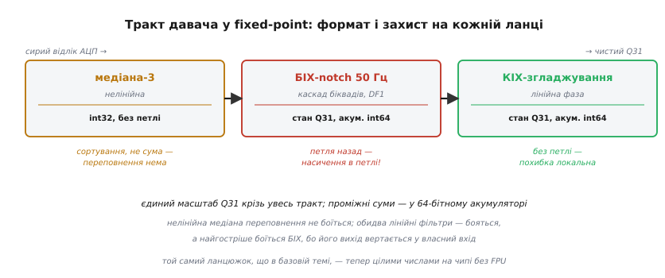
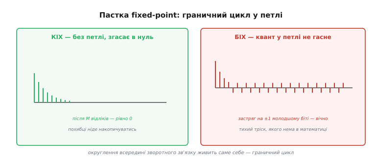

# ⚙️ Каскад біквадів і весь тракт у Q31

**Задача.** У базовій темі ми зібрали тракт із трьох ланок — нелінійна медіана проти викидів, гострий БІХ-notch проти мережевих 50 Гц, лінійно-фазовий КІХ для чистого згладжування — і побачили, що кожна ланка найкраща саме у своїй ролі. Але там усе жило в дробових числах, зручних на папері й на ПК. Тепер спустімося на реальне залізо: **дешевий мікроконтролер без апаратного блока дробових чисел** (без FPU) — 8-бітний AVR або простий Cortex-M0, де кожен `float` емулюється сотнею тактів, а весь тракт мусить порахуватися до приходу наступного відліку. Треба перекласти ці три ланки на **цілу арифметику Q31** так, щоб фільтр не повз, не дзвенів і не вибухав.

Здавалося б, механічна робота: заміни `float` на `int32_t`, коефіцієнти на цілі — і готово. Насправді саме тут гине більшість «правильних» фільтрів. Проміжна сума тихо переповнюється й перекидається з плюса в мінус; округлення в петлі зворотного зв'язку застряє незгасним трiском; невдало обрана форма біквада зсуває полюси так, що гострий notch розповзається в кашу. Кожну з цих пасток ми пройдемо з конкретним кодом і побачимо **чому** вона виникає — бо без «чому» ці кілька рядків захисту виглядають забобоном, а вони рятівні.

Домовимося про формат наперед. Беремо [Q31](book:algorithms/fixed-point-implementation) — дріб із діапазону [−1, 1) кодуємо 32-бітним цілим зі знаком, множник масштабу 2³¹. Q31 (а не Q15) саме тому, що БІХ-notch гострий, а гострі рекурсивні фільтри вимогливі до точності коефіцієнтів: 15 біт дробу їм замало, полюс «поїде». Весь тракт від входу АЦП до виходу тримаємо в **одному** масштабі Q31 — щойно десь загубиш узгодження, коефіцієнти зсунуться в мільярди разів, і шукати це доведеться годинами.


*Той самий ланцюжок, що в базовій темі, — тепер цілими числами на чипі без FPU. Медіана лише сортує, тож переповнення не боїться. Обидва лінійні фільтри складають добутки — і бояться, а найгостріше боїться БІХ, бо його вихід вертається у власний вхід і одне «загорнуте» значення підживлює наступне. Проміжні суми кожної лінійної ланки копляться в 64-бітному акумуляторі; єдиний масштаб Q31 проходить крізь увесь тракт.*

## Ідея: чому знову каскад — і чому в цілих він обов'язковий

У [проєкті біквад-каскаду](book:algorithms/iir-filter/proj-biquad-c.md) ми вже розібрали, чому БІХ високого порядку **ніколи** не пишуть однією довгою формулою: корені знаменника (полюси) надзвичайно чутливі до коефіцієнтів, і найменше округлення зрушує їх із місця, аж поки фільтр, що мав згасати, не почне розгойдуватися. Тому фільтр розбивають на ланки 2-го порядку — **біквади** (*bi-quadratic*), кожна лише з двома полюсами, які стоять далеко й до округлення майже байдужі. Такий ланцюжок ланок називають **SOS** (*second-order sections*, «секції другого порядку») — саме в такому вигляді БІХ віддають усі серйозні інструменти: `scipy.signal` з `output='sos'`, майстер CubeMX, таблиці CMSIS-DSP.

У дробових числах це порада на користь стійкості. У **цілій** арифметиці вона перетворюється на залізну необхідність. Ось чому: квантування коефіцієнта — це і є те саме округлення, від якого полюси розповзаються, тільки тепер воно неминуче, бо інакше число просто не влізе в 32 біти. Візьмімо гострий фільтр 6-го порядку однією формулою: його знаменник — многочлен 6-го степеня, а корені такого многочлена реагують на дрібну зміну коефіцієнта з величезним підсиленням. Заокруглили п'ять коефіцієнтів під Q31 — і трійка пар полюсів стрибнула так, що характеристика невпізнанна, а найближча до одиничного кола пара могла й вискочити за нього в розгін. Розбивши той самий фільтр на три біквади, ми **розв'язуємо полюси між собою**: кожна пара живе у своїй квадратній ланці, чий знаменник має лише два корені, майже нечутливі до дрібних змін. Те, що в `float` було запобіжником, у Q31 стає єдиним способом узагалі зберегти задуману характеристику.

> 🔧 **Навіщо це.** У fixed-point каскад біквадів — не стильова вподоба, а умова виживання гострого БІХ. Пряма форма високого порядку, стерпна в `float`, у Q31 майже гарантовано розповзеться від квантування коефіцієнтів. Правило просте: **БІХ будь-якого порядку вище другого на чипі без FPU беремо тільки як SOS** — ланцюжок біквадів, кожен зі своїми п'ятьма коефіцієнтами.

## Одна ланка: біквад у Q31 з акумулятором int64

Тепер найважливіше — сам біквад у цілих. Форму беремо **пряму форму I** (*Direct Form I*), і за хвилину побачимо, чому саме її, а не ощадливішу. Спершу — код, тоді розбір кожного захисного прийому.

Один біквад рахує ту саму формулу, що й у дробовому варіанті:

```
y[n] = b₀·x[n] + b₁·x[n−1] + b₂·x[n−2]  −  a₁·y[n−1] − a₂·y[n−2]
```

Але кожне множення тут — це Q31 × Q31, а добуток двох Q31-чисел має масштаб Q62 (множники масштабу перемножуються: 2³¹ · 2³¹ = 2⁶²). П'ять таких добутків треба скласти без втрати жодного біта — отже, акумулятор мусить бути **64-бітним**. Ось ланка:

```c
#include <stdint.h>

// Один біквад у Q31, пряма форма I.
// Коефіцієнти вже в Q31 (дріб × 2^31), a1,a2 — УЖЕ зі знаком «−» у формулі.
typedef struct {
    int32_t b0, b1, b2;     // пряма гілка (входи)
    int32_t a1, a2;         // зворотна гілка (виходи)
    int32_t x1, x2;         // x[n-1], x[n-2]  — попередні входи
    int32_t y1, y2;         // y[n-1], y[n-2]  — попередні виходи
} biquad_q31_t;

// затиск 64-бітного значення у діапазон int32_t: НАСИЧЕННЯ, не загортання
static inline int32_t sat32(int64_t v) {
    if (v >  INT32_MAX) return INT32_MAX;
    if (v <  INT32_MIN) return INT32_MIN;
    return (int32_t)v;
}

int32_t biquad_q31_step(biquad_q31_t *s, int32_t x) {
    // acc у форматі Q62: множення Q31×Q31 без округлення, копимо в 64 біти
    int64_t acc  = (int64_t)s->b0 * x;
    acc         += (int64_t)s->b1 * s->x1;
    acc         += (int64_t)s->b2 * s->x2;
    acc         -= (int64_t)s->a1 * s->y1;
    acc         -= (int64_t)s->a2 * s->y2;

    // Q62 → Q31: зсув на 31 з округленням (додаємо половину молодшого розряду)
    acc = (acc + (1LL << 30)) >> 31;

    int32_t y = sat32(acc);          // звужуємо в 32 біти з насиченням

    // зсуваємо лінії затримки на один такт
    s->x2 = s->x1;  s->x1 = x;
    s->y2 = s->y1;  s->y1 = y;
    return y;
}
```

Розберімо, що тут працює й **чому**.

**Акумулятор — 64 біти, і це не перестраховка.** Кожен доданок `(int64_t)b0 * x` — це добуток двох 32-бітних чисел, до 63 біт завширшки. Складаємо п'ять таких — і навіть якщо кожен уміщається в 62 біти масштабу Q62, їхня сума може заповнити старший біт. Приведи цю суму до вузького типу зарано — і вона перекинеться. Тому копимо все в `int64_t` і звужуємо **лише наприкінці**, після зсуву. Це та сама наука ширшого акумулятора з базової теми, тільки числа більші: там 16-бітні відліки коплять у 64 бітах, тут 32-бітні — так само в 64, бо добуток удвічі ширший.

**Зсув `>> 31` повертає кому на місце.** Добуток Q31×Q31 сидить у Q62 — це «подвійний масштаб». Щоб результат знову став Q31, ділимо на 2³¹, тобто зсуваємо праворуч на 31. Додавання `(1LL << 30)` перед зсувом — це додати половину молодшого розряду, тобто **округлити**, а не просто відкинути хвіст. У КІХ різниця мізерна, а от у БІХ систематичне відкидання накопичується в петлі й дає невелике зміщення — тому тут округлюємо свідомо.

**Насичення на записі, а не загортання.** Функція `sat32` — серце надійності. Якщо після зсуву значення все ж вийшло за межі int32 (гучний сигнал, різкий фронт), наївне приведення `(int32_t)acc` **загорнуло** б число: трохи більше за максимум — і воно стрибнуло б до мінімуму, бо старші біти просто відкидаються. Для сигналу це катастрофа: на місці легкого перевищення вискакує дикий стрибок з плюса в мінус. Насичення натомість **впирає** значення в межу й лишає там. Гірше мати трохи «зрізану» вершину, ніж викид на всю шкалу.

Чому насичення особливо критичне саме тут, у БІХ? Бо вихід `y` вертається у власний вхід через `y1, y2`. Одне загорнуте значення підживить наступний крок, той — ще наступний, і замість фільтра ми дістанемо генератор шуму, що сам себе розганяє. У КІХ переповнення лишилося б локальним — зіпсувало б один відлік і забулося; у БІХ воно **самопідтримне**. Тому в біквадах насичують результат кожної ланки, а не лише фінальний вихід усього тракту.

## Каскад: ланцюжок SOS

Каскад — це масив ланок, крізь який відлік проходить одна по одній: вихід попередньої стає входом наступної. Нічого нового порівняно з дробовим варіантом, крім типів:

```c
#include <stddef.h>

typedef struct {
    biquad_q31_t *stage;    // масив ланок (SOS)
    size_t        n;        // скільки їх
} sos_chain_t;

int32_t sos_step(sos_chain_t *c, int32_t x) {
    int32_t v = x;
    for (size_t i = 0; i < c->n; ++i)
        v = biquad_q31_step(&c->stage[i], v);   // вихід однієї → вхід наступної
    return v;
}

void sos_reset(sos_chain_t *c) {
    for (size_t i = 0; i < c->n; ++i)
        c->stage[i].x1 = c->stage[i].x2 = c->stage[i].y1 = c->stage[i].y2 = 0;
}
```

Коефіцієнти кожної ланки ви не рахуєте руками — їх видає інструмент проєктування за специфікацією (тип фільтра, частоти, частота дискретизації). Для notch на 50 Гц при частоті відліків 1 кГц це зазвичай **один** біквад (пара полюсів під кутом 50/1000 кола, притиснута до одиничного кола, і пара нулів рівно на 50 Гц). Заповнюємо ланку цілими коефіцієнтами:

```c
// Notch 50 Гц @ 1 кГц — один біквад. Числа з інструмента, переведені в Q31.
// Q31: коеф = round(дріб * 2^31). Приклад ілюстративний.
static biquad_q31_t notch50[1] = {
    { .b0 =  2113929216,   // ≈ 0.9843
      .b1 = -3390779392,   // ≈ -1.5791   (=  b0 * (-2cos(2π·50/1000)) )
      .b2 =  2113929216,   // ≈ 0.9843
      .a1 = -3390779392,   // ≈ -1.5791   у формулі з відніманням
      .a2 =  2080374784 }, // ≈ 0.9687
};
static sos_chain_t notch = { .stage = notch50, .n = 1 };
```

Тут причаїлася перша тонкість Q31, повз яку легко пройти: коефіцієнти БІХ **не вміщаються** в діапазон [−1, 1). Погляньте на `b1` і `a1` — це приблизно −1.58, а Q31 кодує лише [−1, 1). Як же вони зберігаються? Це і є та проблема, до якої ми зараз перейдемо; поки що зверніть увагу, що наївний запис таких коефіцієнтів у Q31 переповниться, і саме тому справжні бібліотеки роблять зайвий крок — масштабування коефіцієнтів.

## Коефіцієнти більші за одиницю: postShift

Ось у чому річ. Коефіцієнти чисельника й знаменника біквада (особливо `a1`, `b1`) регулярно виходять за [−1, 1) — типово до ±2. А Q31 за визначенням кодує тільки [−1, 1): найбільше додатне ціле 2³¹−1 відповідає дробу ≈ 0.9999. Число 1.58 в Q31 просто не існує — воно переповнить `int32_t`.

Рішення, яке застосовує [CMSIS-DSP](book:algorithms/fixed-point-implementation), елегантне: **поділити всі коефіцієнти ланки на 2ᵏ**, щоб вони влізли в [−1, 1), а після підсумовування домножити результат назад — зсувом уліво на ті самі `k` біт. Це число `k` називають **postShift** («зсув на виході»). Якщо найбільший за модулем коефіцієнт ланки менший за 2 — досить `k = 1` (ділимо на 2); якщо менший за 4 — `k = 2`, і так далі.

```c
typedef struct {
    int32_t b0, b1, b2, a1, a2;   // коефіцієнти, ПОДІЛЕНІ на 2^postShift → влазять у [-1,1)
    int32_t x1, x2, y1, y2;
    int      postShift;           // на стільки біт домножити суму назад
} biquad_q31_ps_t;

int32_t biquad_q31_ps_step(biquad_q31_ps_t *s, int32_t x) {
    int64_t acc  = (int64_t)s->b0 * x;
    acc         += (int64_t)s->b1 * s->x1;
    acc         += (int64_t)s->b2 * s->x2;
    acc         -= (int64_t)s->a1 * s->y1;
    acc         -= (int64_t)s->a2 * s->y2;

    // Q62 → Q31, а тоді домножити на 2^postShift (повертаємо поділені коефіцієнти):
    // разом це зсув праворуч на (31 - postShift).
    int sh = 31 - s->postShift;
    acc = (acc + (1LL << (sh - 1))) >> sh;

    int32_t y = sat32(acc);
    s->x2 = s->x1;  s->x1 = x;
    s->y2 = s->y1;  s->y1 = y;
    return y;
}
```

Погляньте, як гарно зсуви злилися в один. Ми мали поділити коефіцієнти на 2ᵏ при зберіганні (щоб влізли), а суму домножити на 2ᵏ (щоб відновити масштаб). Домноження на 2ᵏ — це зсув уліво на `k`; повернення Q62→Q31 — зсув управо на 31. Разом виходить один зсув управо на `31 − postShift`. Жодного зайвого такту: уся «магія» — в одній зміні числа зсуву. Саме так це й записано в CMSIS-DSP, де `postShift` — окремий параметр структури біквада поряд із коефіцієнтами.

> 🔧 **Навіщо це.** Не намагайтеся втиснути коефіцієнт 1.58 у Q31 — він там не поміститься. Інструмент проєктування підкаже потрібний `postShift` (або ви візьмете `k = ceil(log₂(max|коеф|))`); поділіть коефіцієнти на 2ᵏ, збережіть цілими, а суму наприкінці зсуньте на `31 − k` замість 31. Це одне число рятує від найбанальнішого переповнення — коефіцієнтів, що не влізли в масштаб.

## Пастка проміжної суми: гардбіти й діапазон входу

Тепер найпідступніше переповнення — не коефіцієнтів, а самої **проміжної суми**. Навіть коли всі коефіцієнти акуратно поділені й влазять, сума п'яти добутків може перевищити те, що вміщається в акумулятор із запасом на відновлення масштабу. Розберімо чому — на точних числах CMSIS-DSP.

Акумулятор у нас 64-бітний, а результат кожного множення Q31×Q31 має формат Q62. Порахуймо запас. Число у форматі 2.62 (два біти цілої частини, включно зі знаком, і 62 дробових) означає, що на ціле лишається обмаль. Документація ARM формулює це прямо: 64-бітний акумулятор «підтримує повну точність проміжних добутків, але дає лише **один гардбіт**» (guard bit — запасний біт на переповнення). Один-єдиний. Складаємо п'ять доданків, і кожен може майже заповнити діапазон — сума легко зжере цей один гардбіт, після чого акумулятор переповнюється й, за словами тієї самої документації, «загортається, а не затискається».

Це важлива й неочевидна деталь: **насичення `sat32` на виході не рятує від переповнення всередині акумулятора**. Воно затискає фінальні 32 біти, але якщо 64-бітна сума вже перекинулася на середині додавання, `sat32` дістане вже зіпсоване число й слухняно «затисне» сміття. Захист на виході — не там, де рана.

Як же з цим борються? Не розширенням акумулятора (64 біт — це вже стеля звичайного цілого типу), а **обмеженням розмаху входу**. Логіка така: якщо гарантувати, що всі проміжні величини достатньо малі, одного гардбіта вистачить. ARM дає конкретне правило для свого Q31-біквада: вхідний сигнал має бути **масштабований на 2 біти вниз** і лежати в діапазоні [−0.25, +0.25). Два зарезервовані старші біти — це і є запас на ріст суми в петлі; притиснувши вхід у чверть шкали, ми лишаємо біквадові простір рости, не переповнюючись.

```c
// Перед каскадом БІХ у Q31: віддати ланкам 2 біти запасу (вхід у [-0.25, 0.25)).
static inline int32_t headroom_in(int32_t x)  { return x >> 2; }   // /4
// Після каскаду: відновити повний масштаб.
static inline int32_t headroom_out(int32_t y) { return sat32((int64_t)y << 2); }  // ×4, із насиченням
```

Тут видно чесний розмін fixed-point: ми жертвуємо двома бітами точності (вхід тепер має лише 30 значущих біт замість 32) заради того, щоб петля БІХ не переповнилася. Для 24-бітного АЦП це геть непомітно; для 12-бітного — тим паче. Зате гострий notch рахується надійно. Це та сама думка, що й «широкий акумулятор» у базовій темі, лише з іншого боку: коли розширити акумулятор уже нікуди, звужують сигнал.

> 🔧 **Навіщо це.** Q31-біквад CMSIS-DSP переповнюється тихо (загортанням, не насиченням), бо в його 2.62-акумуляторі лише один гардбіт. Тому перед каскадом БІХ **зсуньте вхід на 2 біти вниз** (у [−0.25, 0.25)), а після — на 2 біти вгору з насиченням. Ці два біти запасу — різниця між надійним фільтром і випадковими дикими стрибками, які потім не відтвориш. І пам'ятайте: насичення на виході не ловить переповнення всередині акумулятора — запас треба закласти **наперед**.

## Чому пряма форма I, а не транспонована II

Ми весь час беремо пряму форму I — з окремою пам'яттю під два минулі входи й два минулі виходи (чотири комірки стану на ланку). Існує ощадливіша **транспонована пряма форма II** (*Direct Form II Transposed*, DF2T): вона тримає лише **дві** комірки стану на ланку й у дробових числах вважається кращою. Чому ж у Q31 ми свідомо беремо «дорожчу» форму?

Відповідь — у тому, **що зберігає стан**. У прямій формі I стан — це реальні минулі входи й виходи, звичайні відліки сигналу; вони лежать у тому самому діапазоні, що й дані, тож вузького Q31 їм досить. У транспонованій формі II стан — це **часткові суми** проміжних обчислень; вони можуть мати куди більший розмах, ніж самі відліки, бо накопичують внесок коефіцієнтів. Щоб зберегти такі часткові суми без переповнення, потрібен ширший динамічний діапазон, ніж дає Q31.


*Та сама передавальна функція, різна внутрішня механіка. Пряма форма I має ОДНУ точку підсумовування: усі п'ять добутків складаються за раз у широкий акумулятор, тож стан лишається у вузькому діапазоні даних і безпечний у Q31. Транспонована форма II ощадливіша на пам'ять (дві комірки замість чотирьох), та її стан несе часткові суми з великим розмахом, які в Q31 переповнюються, — тому в CMSIS-DSP вона існує лише для float.*

Це не наша здогадка, а рішення розробників CMSIS-DSP: у їхній бібліотеці біквад прямої форми I має версії Q15 і Q31 (цілі), а транспонована форма II — **тільки float**. Формулювання документації однозначне: пряма форма I «числово надійніша для цілих типів даних, тому підтримує Q15 і Q31», тоді як транспонована форма II через вимогу до розмаху стану лишена цілочислових версій. Ще один аргумент на користь прямої форми I: у неї **одна** точка підсумовування — усі добутки зливаються в один акумулятор за раз, і насичувати треба одне місце; у транспонованій формі суми розкидані, стежити за переповненням складніше.

Тут доречно застерегти й від **звичайної** (нетранспонованої) прямої форми II. Вона канонічна щодо затримки — ділить лінії затримки між полюсною й нульовою частинами, економлячи пам'ять, — але саме це поєднання робить її стан ще вразливішим: сигнал спершу проходить полюси (підсилення), накопичуючись у вузлі, а тоді нулі (послаблення), тож проміжна величина роздувається найбільше. У цілій арифметиці це найгірший вибір. Тому практичне правило однозначне: **у fixed-point — тільки пряма форма I**; обидві форми II лишіть для float, де широкий діапазон дається задарма.

> 🔧 **Навіщо це.** Спокуса взяти транспоновану форму II заради економії двох комірок стану в Q31 обертається переповненнями, бо її стан несе роздуті часткові суми. У цілій арифметиці беріть **пряму форму I** — її стан це звичайні відліки у вузькому діапазоні, одна точка підсумовування, легке насичення. CMSIS-DSP не дарма дає Q31 лише для прямої форми I. Форми II — привілей float.

## Граничні цикли й боротьба з ними: дизеринг і збереження хвоста

Є в БІХ на цілих ще одна недуга, тонша за переповнення, — **граничні цикли** (*limit cycles*). Уявіть, що сигнал стих: на вхід ідуть самі нулі, і фільтр мав би плавно згаснути в нуль. У дробових числах він так і робить. А в цілих — може **застрягти** в крихітному незгасному коливанні на рівні одного-двох молодших бітів, наче тихенько бринить, хоча математично давно мав замовкнути.

Чому це стається? Через округлення в петлі зворотного зв'язку. Коли вихід згасає й доходить до одного молодшого біта, округлення на кроці Q62→Q31 може щоразу повертати те саме крихітне значення замість нуля: `y1` живить наступний крок, той округлюється назад у той самий `y1`, і петля замикається на незгасному «зубчику». Це не вибух-нестабільність — амплітуда мізерна, — але для точних вимірювань цей паразитний трiск зайвий, а на слух в аудіо він буває чутним як тихий тон на тиші.


*КІХ без петлі згасає рівно в нуль: після скінченного вікна відліків похибці ніде накопичуватись. БІХ через округлення всередині зворотного зв'язку може застрягти на ±1 молодшому біті — граничний цикл. Округлення в петлі живить саме себе; це не вибух, а тихий трiск на рівні молодшого розряду, якого в ідеальній математиці немає.*

Проти граничних циклів є два практичні прийоми, і обидва варті коду.

**Перший — дизеринг** (*dither*, «тремтіння»): підмішати до сигналу перед квантуванням крихітний псевдовипадковий шум амплітудою близько молодшого біта. Ідея контрінтуїтивна — ми навмисне додаємо шум, щоб позбутися шуму, — але вона працює. Детермінований граничний цикл виникає тому, що округлення щоразу помиляється **однаково** (систематично), і петля замикається на сталому значенні. Додавши трохи випадковості, ми **розбиваємо цю систематичність**: тепер округлення то в один бік, то в інший, і замість застряглого тону дістаємо тихий рівний шум, який вухо й статистика сприймають набагато терпиміше, ніж чистий паразитний тон. Це той самий прийом, яким у графіці розмивають смуги на градієнтах.

```c
// Простенький генератор псевдовипадкових чисел (xorshift32) — швидкий, без ділень.
static uint32_t rng_state = 0x1234567u;
static inline int32_t dither_lsb(void) {
    uint32_t r = rng_state;
    r ^= r << 13;  r ^= r >> 17;  r ^= r << 5;
    rng_state = r;
    // ±1 молодший біт: беремо два біти й центруємо в діапазон [-1, +1]
    return (int32_t)(r & 3u) - 1;      // {-1, 0, 1, 2} → зсунуте, вистачить для розбиття циклу
}

int32_t biquad_q31_dither_step(biquad_q31_ps_t *s, int32_t x) {
    int64_t acc  = (int64_t)s->b0 * x;
    acc         += (int64_t)s->b1 * s->x1;
    acc         += (int64_t)s->b2 * s->x2;
    acc         -= (int64_t)s->a1 * s->y1;
    acc         -= (int64_t)s->a2 * s->y2;

    int sh = 31 - s->postShift;
    acc = (acc + (1LL << (sh - 1))) >> sh;
    acc += dither_lsb();               // ← підмішуємо ±1 LSB перед звуженням

    int32_t y = sat32(acc);
    s->x2 = s->x1;  s->x1 = x;
    s->y2 = s->y1;  s->y1 = y;
    return y;
}
```

**Другий прийом — збереження хвоста** (*fraction saving*, його ще звуть формуванням шуму, *error feedback*): замість викидати відкинуті при зсуві молодші біти, ми їх **запам'ятовуємо** й додаємо назад перед наступним квантуванням. Це детермінований, точніший спосіб — не додає жодного шуму, а натомість слідкує, щоб систематична похибка округлення в середньому дорівнювала нулю: те, що недодали цього разу, додасться наступного. Граничний цикл гине, бо петлі більше нема на чому застрягти — накопичена похибка рано чи пізно «проштовхує» вихід за поріг у нуль.

```c
typedef struct {
    biquad_q31_ps_t bq;
    int64_t err;              // збережений «хвіст» — відкинуті молодші біти
} biquad_ef_t;

int32_t biquad_q31_ef_step(biquad_ef_t *s, int32_t x) {
    biquad_q31_ps_t *b = &s->bq;
    int64_t acc  = (int64_t)b->b0 * x;
    acc         += (int64_t)b->b1 * b->x1;
    acc         += (int64_t)b->b2 * b->x2;
    acc         -= (int64_t)b->a1 * b->y1;
    acc         -= (int64_t)b->a2 * b->y2;

    int sh = 31 - b->postShift;
    acc += s->err;                       // ← повертаємо збережений хвіст минулого кроку
    int64_t rounded = (acc + (1LL << (sh - 1))) >> sh;
    s->err = acc - (rounded << sh);      // ← запам'ятовуємо новий хвіст (що відкинули)

    int32_t y = sat32(rounded);
    b->x2 = b->x1;  b->x1 = x;
    b->y2 = b->y1;  b->y1 = y;
    return y;
}
```

Який із двох брати? Дизеринг простіший і замінює тон на нешкідливий шум — годиться для аудіо, де важлива суб'єктивна якість. Збереження хвоста точніше й нічого не додає до сигналу — краще для вимірювань, де кожен молодший біт на рахунку. Для більшості давачів достатньо просто **дати коефіцієнтам більше біт** (Q31 замість Q15 — уже великий крок) і округлювати, а не відкидати; граничні цикли Q31-фільтра часто настільки дрібні, що губляться в шумі АЦП. Ці два прийоми тримайте в запасі на випадок, коли тиша **справді** мусить бути тишею.

> 🔧 **Навіщо це.** Якщо ваш Q31-БІХ на тиші тихенько бринить (застряг граничний цикл) — не міняйте фільтр, а розбийте систематичність округлення. Простий шлях — **дизеринг**: підмішати ±1 молодший біт псевдовипадкового шуму перед звуженням (тон стає нешкідливим рівним шумом). Точний шлях — **збереження хвоста**: не викидати відкинуті біти, а додавати їх назад наступного кроку (похибка усереднюється в нуль). Обидва коштують кількох рядків; для вимірювань беріть друге, для аудіо — перше.

## Нелінійна ланка: медіана в цілих

Перед лінійними фільтрами в базовому тракті стоїть [медіана](book:algorithms/median-filter) — вона вибиває поодинокі викиди (спайки від контакту, від наводки), з якими лінійні фільтри не впораються: усереднювати спайк — значить розмазати його, а не прибрати. У fixed-point медіана — **найспокійніша** ланка, і ось чому: вона не складає добутків, а лише **порівнює й переставляє** відліки. Ніяких множень, ніякого росту суми — отже, **переповнення тут неможливе в принципі**. Медіана-3 (по трьох відліках) — це буквально кілька порівнянь:

```c
// Медіана трьох цілих: жодного множення, отже жодного переповнення.
static inline int32_t median3(int32_t a, int32_t b, int32_t c) {
    // сортувальна мережа з трьох порівнянь-обмінів; лишається середнє
    if (a > b) { int32_t t = a; a = b; b = t; }
    if (b > c) { int32_t t = b; b = c; c = t; }
    if (a > b) { int32_t t = a; a = b; b = t; }
    return b;                 // b тепер — середнє за величиною
}

typedef struct { int32_t w0, w1, w2; } med3_t;   // вікно з трьох відліків

int32_t med3_step(med3_t *m, int32_t x) {
    m->w0 = m->w1;  m->w1 = m->w2;  m->w2 = x;    // зсуваємо вікно
    return median3(m->w0, m->w1, m->w2);
}
```

Зверніть увагу, як медіана підтверджує урок базової теми про нелінійність: вона **не** належить ні до КІХ, ні до БІХ, бо не є зваженою сумою — вона сортує. Саме тому вона й ловить викиди, недосяжні для лінійних фільтрів, і саме тому в цілій арифметиці вона безпроблемна: там, де нема множення й накопичення, нема й переповнення. Єдине, за чим стежити, — медіана вносить невелику затримку (для вікна 3 — один відлік) і на різких, але **справжніх** фронтах може їх трохи притупити; тому вікно беруть найкоротше, що прибирає ваші викиди.

## Весь тракт разом

Тепер зберемо три ланки в єдиний конвеєр — той самий, що в базовій темі, тільки цілком у Q31. Порядок принциповий: **спершу медіана** (вибити викиди, поки вони не отруїли рекурсію БІХ), **тоді БІХ-notch** (гостро зрізати 50 Гц), **наостанок КІХ** (м'яко згладити, не псуючи форму). Перед БІХ віддаємо два біти запасу, після — відновлюємо масштаб.

```c
#include <stdint.h>
#include <stddef.h>

typedef struct {
    med3_t       med;         // 1) нелінійна медіана проти викидів
    sos_chain_t  notch;       // 2) БІХ-notch 50 Гц (каскад біквадів, DF1, Q31)
    // 3) КІХ-згладжування (Q31) — коефіцієнти й кільцевий буфер
    const int32_t *fir_b;     // коефіцієнти КІХ у Q31
    int32_t       *fir_x;     // кільцевий буфер минулих входів
    size_t         fir_len;
    size_t         fir_pos;
} pipeline_t;

// один крок КІХ у Q31: MAC у 64-бітному акумуляторі, зсув, насичення
static int32_t fir_q31_step(pipeline_t *p, int32_t x) {
    p->fir_x[p->fir_pos] = x;
    int64_t acc = 0;
    size_t idx = p->fir_pos;
    for (size_t k = 0; k < p->fir_len; ++k) {
        acc += (int64_t)p->fir_b[k] * p->fir_x[idx];   // Q31×Q31 → Q62
        idx = (idx == 0) ? p->fir_len - 1 : idx - 1;   // йдемо назад по буферу
    }
    p->fir_pos = (p->fir_pos + 1) % p->fir_len;
    acc = (acc + (1LL << 30)) >> 31;                   // Q62 → Q31 з округленням
    return sat32(acc);
}

// повний тракт: сирий відлік АЦП (Q31) → чистий відлік (Q31)
int32_t pipeline_step(pipeline_t *p, int32_t raw) {
    int32_t s = med3_step(&p->med, raw);      // 1) прибрати викиди (нелінійно)
    s = headroom_in(s);                       //    2 біти запасу перед БІХ
    s = sos_step(&p->notch, s);               // 2) гострий notch 50 Гц (БІХ)
    s = headroom_out(s);                      //    відновити масштаб
    s = fir_q31_step(p, s);                   // 3) м'яке згладжування (КІХ)
    return s;
}
```

Погляньте, як ролі ланок віддзеркалюють їхню природу в цілій арифметиці. Медіана безпечна й іде першою — прибирає спайки, поки вони не встигли отруїти петлю БІХ (спайк, поданий у рекурсію, дзвенів би довго). БІХ гострий, дешевий за пам'яттю (один біквад проти сотень відводів КІХ), але вимагає всіх засторог — запасу входу, насичення в петлі, округлення; тому його огортаємо `headroom_in`/`headroom_out`. КІХ безпечний, як медіана, — без петлі його похибка локальна, переповнення не накопичується; він іде останнім і дає чисту лінійну фазу, не зсуваючи форму. Три ланки — три різні характери, і код кожної рівно такий обережний, якою небезпечною є сама ланка.

Числа тракту варто прикинути наперед. Медіана-3 — три порівняння. Notch — один біквад, п'ять множень-додавань. КІХ згладжування — стільки MAC-ів, скільки відводів (скажімо, 15–31 для м'якого фільтра). Разом на відлік — кілька десятків цілих множень; на 1 кГц це десятки тисяч множень за секунду, що навіть 8-бітний AVR тягне без напруги. Той самий тракт на `float` без FPU коштував би в десятки разів більше й міг би не вкластися в період відліку — а це, як ми знаємо, тихо руйнує саму якість фільтрації через загублені відліки.

## Перевірка на залізі: подати імпульс

Наостанок — те, без чого весь код лишається обіцянкою. Перш ніж довірити тракту реальні дані, переконайтеся, що БІХ-частина **згасає**. Найнадійніший тест — подати одиничний імпульс і подивитися на хвіст: у стійкого фільтра вихід прямує до нуля, у нестійкого наростає або дзвенить без кінця.

```c
// Повертає 1, якщо хвіст БІХ згас (фільтр стійкий), інакше 0.
int sos_is_stable(sos_chain_t *c) {
    sos_reset(c);
    int32_t out = sos_step(c, (int32_t)(1LL << 28));   // невеликий імпульс (із запасом)
    int64_t peak = out < 0 ? -(int64_t)out : out;
    for (int n = 1; n < 2000; ++n) {
        out = sos_step(c, 0);                           // далі — нулі
        int64_t m = out < 0 ? -(int64_t)out : out;
        if (m > peak) peak = m;
        if (m > (1LL << 30)) { sos_reset(c); return 0; }  // розганяється
    }
    sos_reset(c);
    return (out > -1024 && out < 1024);                 // хвіст справді осів
}
```

Цей тест ловить найгірше: каскад, що розганяється через переплутані знаки коефіцієнтів `a`, помилку в порядку ланок чи квантування, яке зіпхнуло полюс за одиничне коло. Проганяйте його **на самому залізі**, а не лише на ПК: у цілій арифметиці фільтр буває стійким у `float` на комп'ютері й нестійким у Q31 на чипі — саме там, де квантування коефіцієнтів найгрубіше, нестабільність і любить ховатися. Зверніть увагу й на поріг «хвіст осів»: у Q31 він не строго нуль, а кілька молодших бітів, бо саме граничний цикл може лишити крихітний незгасний залишок, який ми обговорювали вище, — і це нормально, якщо він справді дрібний.

## Складність і пастки — стисло

Зберемо всі граблі в один перелік, щоб було до чого повернутися.

**Знак коефіцієнтів `a`.** Найчастіша причина «дивної» поведінки щойно перенесеного фільтра. Формула біквада існує у двох записах — із **відніманням** зворотних доданків (як у нас: `− a1·y1 − a2·y2`) і з **додаванням**. Інструменти віддають `a1, a2` під «свій» запис; `scipy` записує знаменник із додаванням, тож у нашу форму з відніманням його `a1, a2` переходять зі **зміною знака**. Переплутаєте — полюси стануть не там, у гіршому разі фільтр піде в розгін.

**Переповнення проміжної суми.** Головна fixed-point-пастка. 64-бітний акумулятор Q31-біквада має лише один гардбіт, тому насичення на виході **не рятує** — сума перекидається всередині. Захист закладають наперед: `postShift` для коефіцієнтів понад одиницю плюс два біти запасу на вході ([−0.25, 0.25)).

**Форма фільтра.** У Q31 — **тільки пряма форма I**: її стан це вузькі відліки, одна точка підсумовування. Обидві форми II (звичайна й транспонована) тримають у стані роздуті часткові суми й у цілих переповнюються — тому CMSIS-DSP дає Q31 лише для форми I.

**Квантування коефіцієнтів прямої форми високого порядку.** Пряма форма високого порядку в Q31 майже гарантовано розповзається: корені знаменника надчутливі до округлення коефіцієнтів. Ліки — каскад біквадів (SOS), де кожна пара полюсів у своїй квадратній ланці нечутлива до дрібних змін.

**Граничні цикли.** Округлення в петлі зворотного зв'язку може лишити незгасний трiск на рівні молодшого біта. Ліки: достатня розрядність (Q31), округлення замість відкидання, а за потреби — дизеринг (розбити систематичність шумом) чи збереження хвоста (усереднити похибку в нуль).

**Стан на ввімкненні й один стан на канал.** Обнуляйте стан кожної ланки на старті й після будь-якого розриву потоку (зміна режиму, перепідключення давача) — інакше кидок на перших відліках, а в петлі БІХ він довго відлунює. І заводьте **окремий** стан на кожен канал: спільний стан на три осі гіроскопа змішає канали в химерну кашу.

**Порядок ланок.** У цілій арифметиці порядок біквадів у каскаді впливає на переповнення: одна послідовність вилітає за діапазон на проміжній сумі, інша — ні. Інструменти, що дають SOS, зазвичай уже впорядковують ланки й розкидають підсилення між ними; не переставляйте навмання й не зливайте все підсилення в одну ланку.

Пройшовши всі ці пункти — каскад біквадів прямої форми I, `postShift` і запас входу, насичення в петлі, чистий стан, перевірка імпульсом на залізі, а за потреби дизеринг проти граничних циклів — ви отримаєте той самий тракт із базової теми (медіана → БІХ-notch → КІХ), що дає гострий виріз 50 Гц і чисту форму за кілька десятків цілих множень на відлік і роками працює навіть на копійчаному чипі без FPU, не дзвенячи й не розганяючись.
