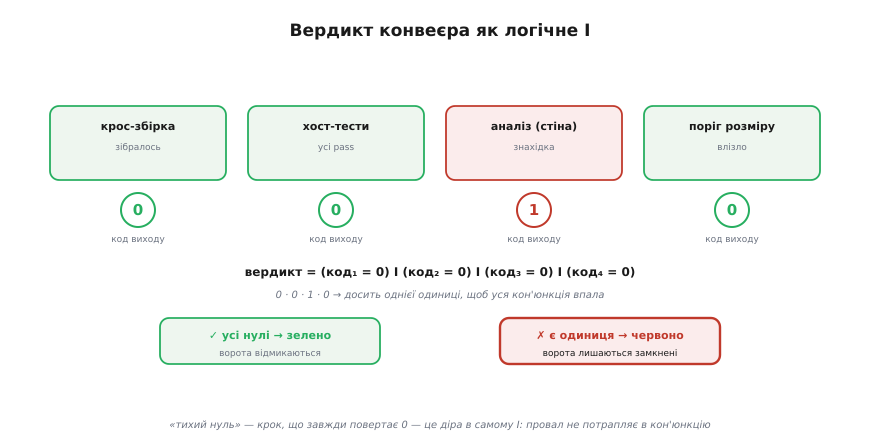
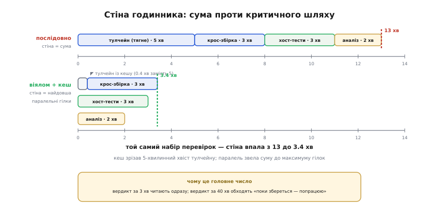
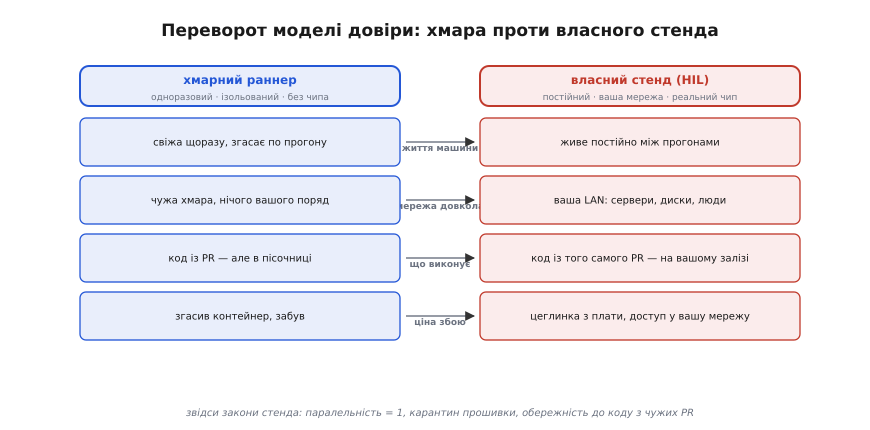

# CI для прошивки поглиблено: алгебра вердикту, час зворотного зв'язку й дотягування до заліза

<preknowlist>
- [Компіляція](topic:sf-lang/compilation) — як текст програми стає машинним кодом під конкретний процесор і які стадії проходить кожен файл; без цього не зрозуміти, чому «зібралося під ціль» — сильний доказ.
- [Лінкування](topic:sf-lang/linking) — як об'єктні файли зшиваються в один образ, що таке символи й чому «забув реалізувати функцію» ловиться саме тут.
- [Образ прошивки](topic:sf-lang/firmware-image) — що всередині `.elf`, які секції (.text/.data/.bss) і чому образ під МК на сервері зібрати можна, а виконати ні.
- [Статичний аналіз](topic:sf-release/static-analysis) — перевірка коду без запуску: що ловить компілятор у суворому режимі й що додає окремий аналізатор як стіна.
</preknowlist>

Базова частина цієї теми дала каркас: CI — це невтомний робот, який на кожну зміну сам збирає прошивку й ганяє перевірки, а захист гілки робить його воротарем спільної гілки. Ми побачили два розриви, що ускладнюють прошивку проти звичайної програми (чужа архітектура й відсутність чипа на сервері), матрицю збірок і межу, за якою хмара сліпне й потрібне залізо. Цього досить, щоб завести конвеєр і почати ним користуватися.

Тут ми розберемо ту саму машину **зсередини** — не «що вона робить», а **як і чому саме так**, до самого дна кожного механізму. Чому вердикт «зелено/червоно» — це насправді одна логічна операція над числами, і де в ній ховається діра, крізь яку провал просочується непоміченим. Чому «зібралося під ціль» — набагато сильніший доказ, ніж здається, і що саме перевіряє успішна крос-збірка. Чому головний продукт конвеєра — не вердикт, а **час** до нього, і як цей час рахується над графом етапів. Чому два незалежно зелені запити на злиття можуть разом зламати `main` — і яка машинерія це лікує. І нарешті — що стається з **моделлю довіри**, коли конвеєр дотягується до реального чипа, і чому це переворот, а не просто «ще один раннер». Скрізь, де базова версія сказала «так є», ця відповість «ось чому і ось де межа».

## Вердикт як логічне І над кодами виходу

Почнімо з речі, яку базова версія назвала мимохідь — «ненуль валить крок», — і докопаймося, **чому** саме на цьому тримається геть усе, і що з цього випливає.

Кожна станція конвеєра — це, зрештою, запуск однієї команди в оболонці: `make`, `ceedling test:all`, `cppcheck`, ваш `sizecheck`. І кожна така команда, завершившись, лишає по собі рівно одне число — **код виходу** (англ. *exit code*, або *exit status*): ціле від 0 до 255. Ця угода — не вигадка CI, вона старша за нього на десятиліття й тягнеться від самого Unix: **0 означає успіх, будь-яке ненульове значення — різновид невдачі**. Логіка угоди проста й глибока. Успіх — один: програма зробила те, що мала. А невдач — багато різних (не той аргумент, не знайдено файл, поділ на нуль, сигнал обірвав), тож для них лишили весь діапазон від 1 до 255, а для єдиного успіху — одне-єдине значення 0. Наш `sizecheck` із базового прикладу саме цим і користується: `return 0` — влізло, `return 1` — пробито бюджет, `return 2` — не розібрав вхід. Три різні числа для трьох різних результатів, і лише одне з них — «усе гаразд».

Тепер ключове питання: конвеєр — це багато таких команд. Як із багатьох окремих чисел народжується **один** вердикт «зелено» чи «червоно»? Відповідь — одна логічна операція, і варто назвати її точно.

> 🔧 **Навіщо це.** Поки ви думаєте про вердикт як про щось, що конвеєр «вирішує» на власний розсуд, ви не можете передбачити, коли він збреше. Щойно ви бачите, що вердикт — це **механічна кон'юнкція** кодів виходу, ви точно знаєте два правила на все життя: (1) щоб додати перевірку — досить зробити команду, що повертає ненуль на провал; (2) щоб перевірка була справжньою — її ненуль мусить **дійти** до кон'юнкції, а не загубитися дорогою. Уся діагностика «чому зелено, коли має бути червоно» зводиться до пошуку місця, де друге правило порушено.

**Успіх усього прогону — це кон'юнкція успіхів кожного етапу.** Формально: якщо станцій `n`, і код виходу `i`-ї станції — `cᵢ`, то

```
вердикт «зелено»  ⟺  (c₁ = 0) І (c₂ = 0) І … І (cₙ = 0)
```

Логічне І (кон'юнкція) має властивість, яка тут і є всім сенсом воріт: **воно хибне, щойно хибний бодай один доданок**. Дев'ять зелених і одна червона станція дають червоний вердикт — не «на 90% зелений», а просто червоний. Це не суворість заради суворості, це сама природа операції: `X І 0 = 0` незалежно від `X`. Одна провалена перевірка отруює весь прогін, як одна крапля чорнила — склянку води.


*Кожен етап лишає одне число — код виходу (0 — гаразд, ≠0 — провал). Вердикт зводить їх однією операцією: зелено ⟺ кожен код нуль. Це логічне І, тож досить однієї одиниці, щоб уся кон'юнкція впала. «Тихий нуль» — крок, що завжди повертає 0, — це діра в самому І: провал не потрапляє в добуток, і ворота лишаються відчинені.*

Звідси випливає найпідступніша вада CI взагалі — і тепер ми можемо назвати її точно, а не як «десь загубився код виходу». **Тихий нуль**: станція, яка насправді провалилася, але повернула 0. У термінах кон'юнкції це означає, що її доданок — не справжній `cᵢ`, а константа `0` замість, можливо, `1`. Вона **випадає з І**, і кон'юнкція рахується так, ніби цієї перевірки й не було. Ворота відчинені, а ви певні, що вони стережуть.

Базова частина показала один окремий випадок цієї вади — трубу `make test | tee log.txt`, де код виходу бачить останній у трубі (`tee`, завжди 0), а не `make test`. Тепер видно, що це не поодинокий трюк, а **цілий клас**: усюди, де між справжнім результатом і вердиктом стоїть щось, що ковтає ненуль. Розберімо цей клас до кінця, бо кожна його форма коштувала комусь дня.

**Форма перша — труба.** В оболонці код виходу конвеєра команд `A | B | C` за замовчуванням — це код **останньої** команди, `C`. Якщо `A` впала, а `C` (скажімо, `tee`, `grep`, `sort`) відпрацювала — увесь конвеєр «успішний». Ліки — режим `pipefail`: `set -o pipefail` каже оболонці брати за код виходу **найлівіший ненуль** у трубі. Тонкість, яку варто знати саме про GitHub Actions: коли ви пишете крок `run:` **без** явного `shell:`, раннер запускає bash із прапорцем `-e` (обірватися на першій помилці), але **без** `-o pipefail`. А коли ви пишете `shell: bash` явно — раннер додає вже `-eo pipefail`. Тобто дві на вигляд однакові збірки поводяться по-різному залежно від того, чи вказали ви оболонку. Тому надійне правило: у кроках, де є труба, або ставте `shell: bash` явно, або починайте скрипт із `set -o pipefail` вручну.

**Форма друга — проковтнутий код у скрипті.** Багаторядковий `run:` — це скрипт, і в ньому легко втратити код виходу проміжної команди:

```bash
# ПАСТКА: код виходу тесту загублено
run: |
  ceedling test:all          # якщо тут провал — його ще видно (-e обірве)
  echo "тести відпрацювали"   # …але варто дописати рядок ПІСЛЯ — і -e рятує лише
                              # доти, доки остання команда не має власного 0
```

Небезпека загострюється, коли останній рядок скрипту — щось службове (запис логу, `echo`, копіювання артефакту), що завжди повертає 0: без `-e` код виходу кроку — це код **останнього** рядка, і провал тесту вище зникає. У GitHub Actions `-e` за замовчуванням це прикриває, але покладатися на замовчування, яке залежить від того, назвали ви оболонку чи ні, — крихко. Явність тут дешевша за годину пошуку.

**Форма третя — саморобна перевірка, що забула повернути ненуль.** Найтихіша. Ви пишете власний скрипт-воротар — на C, на Python, на bash — який щось міряє й **друкує** «FAIL», але завершується з `return 0` / `sys.exit(0)` / просто доходить до кінця. На екрані — грізне «FAIL», у кон'юнкції — тихий нуль. Саме тому наш `sizecheck` навмисно закінчується `return fail;`, де `fail` — `1` при пробитому бюджеті: він **кричить у код виходу**, а не лише в текст. Друковане «FAIL» — для людини; ненульовий код — для конвеєра. Плутати ці два канали — значить писати перевірку, яка виглядає як стіна, а є вітриною.

Із цього всього — одне залізне правило перевірки перевірок, яке базова версія лише згадала, а тут воно набуває повного сенсу: **станцію, якої ви ніколи не бачили червоною, вважайте несправною, доки не доведете протилежне**. Внесіть навмисний регрес — зламайте компіляцію, додайте ворнінг, роздміть бінар понад бюджет, зробіть тест, що падає, — і **переконайтеся, що конвеєр почервонів**. Ви не тестуєте свій код; ви тестуєте **саму кон'юнкцію** — чи справді код виходу цієї станції в неї входить. Доки ви не бачили станцію червоною, ви не знаєте, чи вона доданок у вердикті, чи випала в тихий нуль.

## Що насправді доводить успішна крос-збірка

Базова версія сказала: на сервері прошивку доводиться крос-компілювати, бо сервер — x86, а ціль — Arm; і що «сама успішна крос-збірка вже є перевіркою». Обидва твердження правдиві, але за ними ховається механіка, варта того, щоб її розкрити: **що саме** значить «збирати під іншу архітектуру» й **чому** проходження цього кроку ловить так багато бід ще до єдиного тесту.

Спершу — точна мова. У світі крос-компіляції розрізняють **три** машини, а не дві, і плутанина між ними — джерело половини загадкових помилок збірки:

```
build   — машина, на якій ЗАПУСКАЄТЬСЯ сам компілятор (тут: раннер x86)
host    — машина, на якій ВИКОНУВАТИМЕТЬСЯ зібрана програма
target  — для чого генерується код (для звичайної програми host = target;
          для прошивки target — це Cortex-M чи RISC-V)
```

Для хостового тесту логіки `build = host = target = x86`: сервер збирає під себе й на собі ж виконує. Для прошивки `build = x86`, а `host = target = Cortex-M`: збираємо на x86 код, що житиме й крутитиметься на Arm. Саме розбіжність `build ≠ host` і є «крос»; звідси й потрійне ім'я тулчейну `arm-none-eabi-gcc` — воно кодує ціль: **arm** (архітектура), **none** (жодної операційної системи — голе залізо), **eabi** (угода двійкового інтерфейсу застосунку, за якою розкладаються аргументи, стек і типи). Компілятор — програма для `build`, але кожне його рішення підпорядковане `target`.

> 🔧 **Навіщо це.** Розрізняти build / host / target — не академічна забаганка. Коли збірка падає з `cannot execute binary file`, це майже завжди означає, що щось сплутало ролі: спробувало **запустити** на build те, що зібрано під target (наприклад, тестовий бінар випадково злінкувався крос-тулчейном). Знаючи трійцю, ви читаєте таку помилку за секунду замість години; а конфіг Ceedling із базового прикладу, де `test_compiler` — це хостовий `gcc`, стає очевидним: тест мусить бути програмою для build, бо його треба **виконати** тут.

Тепер — **чому сервер образ зібрати може, а виконати ні**, точніше за базове «під ним нема процесора». Причин насправді три, і кожна окрема:

- **Інший набір інструкцій.** Машинний код Cortex-M — це інструкції Thumb, які x86-процесор просто не вміє декодувати; це різні мови на рівні байтів. Спроба «виконати» їх на x86 — те саме, що подати процесору випадкове сміття.
- **Немає завантажувача й формату.** `.elf` під голе залізо не має того, що операційна система хоста очікує від виконуваного файлу (динамічного лінкера, точки входу в потрібному форматі, ABI системних викликів). Навіть якби ISA збіглася, ОС не знала б, як цей образ запустити.
- **Немає світу довкола коду.** Прошивка звертається до периферії за фіксованими адресами (регістри GPIO, таймерів, UART). На сервері за цими адресами — або нічого, або чужа пам'ять; перше ж звернення до «регістра» — або збій сегментації, або тихе псування.

Через це крос-збірка перевіряє **рівно одне**: чи **складається** повний образ під ціль. Але це «одне» — набагато більше, ніж здається, і ось чому воно ловить так багато. Щоб дійти від купи `.c`-файлів до єдиного `.elf`, тулчейн мусить **успішно** провести кожен файл крізь усі стадії, і на кожній відсіюється свій клас бід:

```
препроцесор → компіляція → асемблювання → лінкування
   │              │             │              │
   #include,      синтаксис,    коректний      усі символи
   #ifdef під     типи, всі     машинний код   розв'язані, усе
   цю ціль        оголошення    під ISA цілі    влізло в карту пам'яті
```

Кожна стадія — фільтр. Препроцесор під конкретну ціль розкриває саме ті гілки `#ifdef`, що працюють для цього чипа, — і якщо для нової плати забули оголосити щось під `#ifdef STM32G0`, це спливе **тут**, а не в полі. Компіляція ловить синтаксис і типи в **усьому** коді, який реально бере участь у цій збірці, — зокрема в тих модулях, які ви місяць не відкривали, але які досі компілюються. Асемблювання перекладає це в машинний код цільової ISA. А **лінкування** — найвагоміший фільтр для прошивки: воно вимагає, щоб **кожен** використаний символ був десь визначений (жодного «забув реалізувати функцію»), **і** щоб усе разом влізло в карту пам'яті, задану лінкер-скриптом [образу прошивки](topic:sf-lang/firmware-image) — бо на МК секції прибиті до конкретних адрес Flash і RAM, і образ, що не влазить, лінкер відхиляє.

Ось чому базова «дрібниця, що ламає складання під сусідню плату» ловиться **вже крос-збіркою**, без жодного тесту. Правка, що чудово компілюється під STM32, під ESP32 може: розкрити іншу гілку `#ifdef`, де бракує оголошення; смикнути функцію, якої в тому HAL нема; або роздути секцію так, що вона не влазить у менший Flash. Усі три — це відмови на різних стадіях того самого конвеєра компіляції, і всі три дають ненульовий код виходу `make`, тобто червоний вердикт. Успішна крос-збірка під **усі** цілі — це доказ, що весь ваш код проходить усі чотири фільтри для кожного чипа. Це не «здається, зібралося» — це формальна властивість, перевірена машиною.

Гранична тонкість, про яку варто знати, хоч у прошивці вона рідкісна: буває, що й **сам** крос-тулчейн треба зібрати кросом — коли машина, де його будують, відрізняється і від build, і від host. Такий триразовий крос звуть «канадським» (англ. *Canadian cross* — жартівлива назва з часів, коли в Канаді було три партії, тобто три різні сторони). Вам майже напевно вистачить готового `arm-none-eabi-gcc`, але сам факт, що ролей три й вони можуть розійтися всі водночас, — це те, що робить трійцю build/host/target не педантизмом, а робочим інструментом читання помилок.

## Відтворність: чому «збирається у мене» — не доказ

Базова версія дала одне правило відтворності: фіксуйте версію тулчейну явно, не `latest`. Правило вірне, але воно — лише вершина. Копнімо глибше: **що взагалі означає «відтворна збірка»**, скільки джерел недетермінізму псує її потай, і як індустрія дійшла до повного розв'язання.

Ідеал звучить так: **той самий вихідний код при тій самій команді складання дає той самий результат — байт у байт — на будь-якій машині й у будь-який день.** Такий ідеал звуть **герметичною збіркою** (англ. *hermetic build* — «герметична», запечатана від зовнішнього світу; термін поширила система збірки Bazel від Google). Герметична збірка не залежить ні від чого поза явно оголошеними входами: ні від того, які пакети стоять на раннері, ні від дати, ні від порядку файлів, ні від мережі. Чому це критично саме для CI? Бо CI обіцяє: «зелено на сервері ⟹ зелено в тебе». Ця обіцянка тримається **лише** тоді, коли результат збірки — функція від коду, а не від випадкового стану машини. Кожна нерозпізнана залежність від оточення — це тріщина, крізь яку «у мене працює, у CI ні» (і навпаки) просочується назад у ваше життя.

Порахуймо джерела недетермінізму — від найгрубших до найтонших, бо кожне ловиться інакше:

- **Версія тулчейну.** Найгрубше. `latest` означає, що Arm випустить нову версію — і ваша збірка зміниться без жодного вашого коміту. Ліки — базові: пін конкретної версії (`release: '13.3.Rel1'`).
- **Хостові бібліотеки й утиліти.** Тонше й підступніше. Ваш `make`-скрипт міг непомітно кликати щось із системи раннера — `python`, `perl`, якусь версію `binutils`, генератор коду. Онови образ раннера — і версія цієї утиліти стрибне, а з нею й результат. Це те, чого пін тулчейну **не** ловить: тулчейн той самий, а середовище довкола — інше.
- **Порядок і паралельність.** `make -j` збирає файли в непередбачуваному порядку; якщо десь є прихована залежність (файл, що читає результат іншого без оголошеної залежності), результат може стрибати від прогону до прогону. Це рідше псує сам бінар, але дає «мерехтливу» збірку, що іноді падає без причини.
- **Мітки часу й шляхи.** Найтонше — для тих, хто хоче збірку, ідентичну **до байта**. Компілятори за замовчуванням вшивають у бінар дату складання (`__DATE__`, `__TIME__`) і подеколи абсолютні шляхи. Два прогони того самого коду дають різні байти лише через годину на годиннику. Це не ламає роботу, але ламає можливість довести, що бінар не змінився.

Перші два джерела — практична межа для більшості прошивних команд, і головна зброя проти них — **середовище-як-код**. Замість «поставте на раннер ось ці пакети руками» ви описуєте оточення текстом, який версіонується разом із кодом: **контейнер** (готовий образ Docker із зафіксованими версіями компілятора й усіх утиліт) або декларативний менеджер оточення. Ідея та сама, що з тулчейном, лише ширша: не «фіксуй компілятор», а **фіксуй усю машину**. Тоді «збирається у мене» перестає бути аргументом, бо «у мене» — це той самий контейнер, що й у CI. Обіцянка «зелено на сервері ⟹ зелено в тебе» стає доказовою: обидва — та сама запечатана коробка.

Останні два джерела адресує окремий рух — **відтворні збірки** (англ. *reproducible builds*): набір практик, що робить бінар ідентичним до байта незалежно від часу й машини (нормалізують мітки часу, прибирають абсолютні шляхи прапорцями штибу `-ffile-prefix-map`, фіксують порядок). Прошивці це потрібне не завжди, але в двох випадках — гостро: коли треба **криптографічно довести**, що бінар у полі зібрано саме з цього коду (бінар порівнюють хешем — тема [контрольних сум образу](topic:sf-lang/firmware-image)), і коли образ підписують для захищеного завантаження. Тоді «той самий код → той самий байт» — не зручність, а вимога безпеки.

> 🔧 **Навіщо це.** Невідтворна збірка перетворює CI з доказу на генератор здогадів. Зелено на сервері, червоно в розробника — і день згорає на «чому в нас по-різному», хоча код однаковий: причина — розбіжність оточень, яку ніхто не зафіксував. Середовище-як-код прибиває це раз і назавжди: усі — розробник, колега, сервер — збирають в **одному** запечатаному оточенні, тож розбіжність результату може йти лише від коду, а не від машини. Це повертає CI його головну цінність — коли він зелений, ви **знаєте**, що зелено буде й деінде, а не сподіваєтеся.

Тепер стає видно й глибший бік базового правила про кеш. Кеш тулчейну — це оптимізація поверх герметичності, і саме тому його ключ мусить бути **функцією від усього, що впливає на вміст**. Базова версія попередила: якщо кешуєте руками, вкладайте версію тулчейну в ключ кешу. Логіка тепер прозора: кеш — це домовленість «якщо ключ той самий, вміст той самий». Якщо ключ **не** залежить від версії компілятора, то після зміни `release:` ключ лишиться старим — і кеш віддасть **старий** тулчейн під новий запис, тихо порушивши герметичність. Правильний ключ кешу — це, по суті, **відбиток входів**: змінився бодай один вхід, що впливає на результат, — змінюється ключ, кеш промахується, збірка йде чесно. Кеш із ключем, що не покриває всіх входів, — це не пришвидшення, а прихований генератор нездетермінованих збірок.

## Час зворотного зв'язку — справжній продукт конвеєра

А тепер — те, чого базова версія не торкнулась зовсім, хоч воно вирішальне. Конвеєр видає не лише вердикт «зелено/червоно». Він видає його **за якийсь час**, і саме цей час — **справжній продукт CI**. Вердикт, який приходить за три хвилини, змінює поведінку команди; вердикт за сорок хвилин команда навчається обходити. Розберімо, з чого цей час складається й чому ним варто керувати так само свідомо, як самими перевірками.

Спершу — модель. Уявімо конвеєр як **граф** етапів: одні мусять іти після інших (тести — після збірки того, що вони тестують), інші незалежні (крос-збірка й хостові тести не залежать одне від одного). Час, який реально чекає людина — **стіна годинника** (англ. *wall-clock time*, час «по стінному годиннику», на противагу сумарному процесорному часу), — рахується над цим графом за двома різними правилами залежно від того, як етапи розкладено.

**Якщо етапи йдуть послідовно, стіна годинника — це сума.** Забрати тулчейн (5 хв) → крос-збірка (3 хв) → хост-тести (3 хв) → аналіз (2 хв) = **13 хвилин** чекання, хоча половина цих робіт нічим не зв'язана й могла б іти водночас.

**Якщо незалежні етапи йдуть паралельно, стіна годинника — це не сума, а максимум** серед паралельних гілок. Це і є **критичний шлях** (англ. *critical path* — найдовший ланцюг залежних робіт у графі; коротшим за нього прогін бути не може в принципі). Розкладемо ті самі роботи віялом: хост-тести (3 хв) і аналіз (2 хв) — окремими гілками паралельно з гілкою збірки; а гілку збірки скоротимо кешем тулчейну (5 хв → ~0.4 хв, бо тягнути більше не треба) плюс сама збірка (3 хв). Тепер найдовша гілка — це 0.4 + 3 = **3.4 хвилини**, і саме стільки чекає людина. Ті самі перевірки, та сама робота процесорів — а стіна впала з 13 до 3.4 хвилин.


*Дві розкладки того самого набору перевірок. Згори — послідовно: стіна = сума тривалостей, 13 хв. Знизу — віялом плюс кеш: незалежні гілки біжать водночас, кеш зрізає п'ятихвилинний хвіст тулчейну, і стіна = найдовша гілка (критичний шлях), 3.4 хв. Продукт конвеєра — це нижнє число: вердикт за 3 хв читають одразу, за 40 хв обходять «поки збереться — попрацюю».*

Три важелі скорочують стіну годинника, і кожен б'є в інше місце графа:

**Паралель — зводить суму до максимуму.** Розвести незалежні роботи по окремих гілках (у GitHub Actions — окремих `job`, що біжать одночасно). Виграш тим більший, чим більше незв'язаних перевірок: чотири гілки по 3 хвилини — це 3 хвилини стіни, а не 12. Матриця збірок із базової версії — це той самий важіль: шість платформ, зібраних паралельно, займають стіну однієї, а не шести.

**Кеш — вкорочує найдовшу гілку.** Найдовший хвіст прошивного конвеєра — зазвичай не сама компіляція, а **встановлення тулчейну**: сотні мегабайтів крос-компілятора. Кеш перетворює це з «тягнути щоразу» на «підняти з диска за секунди», зрізаючи гілці збірки її найважчу частину. Це той самий кеш, який базова версія навчила не ламати руками; тут видно, **навіщо** він узагалі є — він прямо коротшає критичний шлях.

**Раннє відсіювання — не платити за довге, коли швидке вже червоне.** Дешеві швидкі перевірки (компіляція, лічені секунди статичного аналізу) варто ставити **раніше** за дорогі повільні (повна матриця, довгі тести). Якщо код навіть не компілюється, немає сенсу чекати десять хвилин на матрицю — хай конвеєр упаде за півхвилини на компіляції. Це коротшає стіну **в поганому випадку**: вердикт «червоно» приходить від першої ж провалу, а не після всього прогону. Тонкий баланс із матрицею: там ми ставили `fail-fast: false`, щоб **побачити всі** відмови плат за раз; тут — раннє відсіювання дешевим, щоб швидко впасти на грубому. Суперечності нема: `fail-fast` — про паралельні гілки **одного типу** (усі плати матриці, хочемо повну картину), раннє відсіювання — про **порядок** різнотипних станцій (грубий фільтр перед тонким).

> 🔧 **Навіщо це.** Час зворотного зв'язку — це не косметика, а те, що вирішує, чи конвеєром узагалі користуватимуться. Людина, чекаючи вердикт три хвилини, дочекається його й прочитає. Людина, для якої вердикт приходить за сорок хвилин, **перемкнеться на інше** — і повернеться, коли вже забула контекст, або й зовсім навчиться зливати «наосліп», не чекаючи. Повільний конвеєр тихо перетворюється на той самий необов'язковий крок, з яким CI і мав покінчити. Тому стіну годинника тримають короткою не заради краси графіків, а щоб вердикт лишався **вчасним** — прочитаним у мить, коли код ще свіжий у голові.

Є й межа цього скорочення, і вона повчальна. Стіну годинника не можна зробити коротшою за **найдовшу неподільну роботу** на критичному шляху. Якщо повна крос-збірка великого образу йде три хвилини й її ніяк не розпаралелити всередині, то жодна кількість гілок не дасть вердикт швидше за ці три хвилини (плюс усе, від чого збірка залежить). Це прошивний відповідник відомої межі: скільки не додавай робітників, дев'ять жінок не народять дитину за місяць. Тому боротьба за час іде на двох фронтах — розпаралелити те, що незалежне (звести суму до максимуму), **і** вкоротити сам найдовший ланцюг (кешем, інкрементальною збіркою, меншим образом для швидкої перевірки). Формальніше цю модель — критичний шлях над графом, межу пришвидшення від паралелі й амортизацію кешу — розгорнуто в окремій вставці: [Математика часу конвеєра](root:embedded/firmware-ci/math-critical-path.md).

## Гонка «зелений запит — червоний main»

Базова версія показала захист гілки: кнопка злиття замкнена, поки CI не зазеленіє, тож у `main` потрапляє лише зелене, і `main` завжди зелений. Це майже правда — і саме те «майже» ховає одну з найпідступніших бід командної розробки, яку варто розкрити до дна, бо вона руйнує головну обіцянку CI попри всі зелені галочки.

Ось точна механіка провалу. Захист гілки перевіряє ваш запит на злиття, зібравши CI на **вашій гілці** — тобто на стані «main, яким він був, коли ви відгалузилися, плюс ваші зміни». Але між тим моментом і злиттям `main` **живе**: у нього вливаються чужі запити. Тож ваш зелений вердикт відповідає на питання «чи працює моя зміна поверх **того** main, від якого я відійшов?» — а не «чи працюватиме вона поверх **теперішнього** main, у який я оце вливаюся?». Здебільшого це те саме. Але не завжди.

Уявімо двох людей, що відгалузилися від того самого `main`. Аня перейменувала функцію `read_sensor()` на `read_sensor_raw()` і поправила **всі** її виклики, які бачила у своїй гілці. Богдан у своїй гілці, паралельно, **додав** новий виклик старої `read_sensor()`. Обидві гілки зелені: у кожній код узгоджений сам із собою, компілюється, проходить тести. Аня зливається першою — `main` зелений. Богдан зливається другим — його гілку ж перевіряли, вона зелена, кнопка відмикається. І в мить злиття `main` **ламається**: у ньому тепер виклик `read_sensor()`, якої вже нема, бо Аня її перейменувала. Жоден із двох зелених вердиктів цього не бачив — бо жоден не перевіряв Богданову зміну поверх Аниної. `main` червоний, попри те що **кожен** запит був зелений.

Це — **семантичний конфлікт** (термін уживає Мартін Фаулер, той самий, чий есей про CI ми розбирали в [історії теми](root:embedded/firmware-ci/hist-ci.md)). Ім'я точне й варте розрізнення. Є **текстовий конфлікт** — коли двоє правлять **ті самі рядки**; його git бачить сам і не дасть злити, поки не розрулите. А семантичний конфлікт — коли зміни в **різних** місцях, git зливає їх без жодної скарги, бо текстово вони не перетинаються, — але **разом за змістом** вони суперечать. Богдан і Аня не чіпали спільного рядка; git спокійно склав їхні зміни — і склав у зламане. У прошивці семантичний конфлікт особливо злий, бо половина з них ловиться аж крос-збіркою (перейменований символ → помилка лінкування) або тестом (змінена поведінка функції → впав тест), а не текстовим злиттям.

> 🔧 **Навіщо це.** Це та щілина, крізь яку розсипається обіцянка «main завжди зелений» — і, що гірше, розсипається **тихо**, бо всі галочки зелені. Наступний, хто витягне `main`, отримає зламане й витратить час, певний, що «в мене ж усе зелене». Знати про семантичний конфлікт — значить розуміти, що «CI зелений на моєму запиті» ще **не** тотожне «main лишиться зеленим після мого злиття», і що для цієї тотожності потрібна окрема машинерія. Без цього розуміння команда роками латає раптово червоний `main` замість того, щоб прибрати причину.

Розв'язання рівно одне за ідеєю: **перевіряти зміну не на її власній гілці, а на тому стані, що буде після злиття — і робити це по черзі, серіалізовано.** Тобто перед тим, як пустити запит у `main`, зібрати CI на **тимчасовому злитті** «теперішній main + цей запит», і лише якщо воно зелене — влити; а наступний запит перевіряти вже поверх **оновленого** main. Так у `main` фізично не потрапляє нічого, що не пройшло перевірку **саме в тому контексті**, у який лягає. Богданів запит, перевірений поверх уже-влитої Аниної зміни, впав би на тимчасовому злитті — і не потрапив би в `main`.

Цю ідею — «репозиторій, що **завжди** проходить усі тести, бо кожну зміну перевіряють перед промоцією в спільну гілку» — уперше втілив системою на початку 2000-х **Бен Еллістон** (англ. *Ben Elliston*); а назву їй дав **Ґрейдон Гоар** (англ. *Graydon Hoare*, творець мови Rust), охрестивши правило **«не ракетобудування»** (англ. *the not rocket science rule of software engineering*) — мовляв, це не бозна-яка наука, просто занудно робити руками, тож саме напрошується на автоматику. Гоар 2013 року реалізував це ботом **Bors** для проєкту Rust: бот брав схвалений запит, зливав його в тимчасову гілку, ганяв **повний** набір тестів, і лише при зеленому — просував у `main`. Звідти ідея розійшлася в сучасні **черги злиття** (англ. *merge queue*): вбудована черга злиття GitHub і **потяги злиття** (англ. *merge trains*) GitLab роблять те саме — шикують запити в чергу й перевіряють кожен поверх усіх попередніх, перш ніж він сяде в спільну гілку. Прошивній команді це стає в пригоді рівно тоді, коли запитів багато й вони летять одночасно: без черги семантичні конфлікти починають раптово червонити `main`, і черга злиття прибирає їх у корені — не сподіваючись на пильність людей, а перевіряючи саме той стан, що народжується злиттям.

## Дотягнутися до заліза: архітектура власного раннера й переворот довіри

Базова версія окреслила межу — конвеєр на хмарному сервері сліпий до реального таймінгу, гонок переривань, [просідань живлення](topic:hw-arch/brownout), електричних примх — і назвала вихід: власний раннер (self-hosted runner) із живою платою, який останнім кроком заливає прошивку в чіп і ганяє тести просто на ньому. Усе так. Але за цим одним абзацом ховається зміна, яку конче треба розкрити, бо новачки її не бачать і платять дорого: дотягнувшись до заліза, конвеєр **перевертає власну модель безпеки на протилежну**. Це не «той самий CI, просто раннер свій» — це інша істота з іншими законами.

Порівняймо дві машини не за тим, що вони роблять, а за тим, **чим вони є**:

**Хмарний раннер** — це **свіжа, одноразова, ізольована** машина. GitHub (чи інший сервіс) піднімає її під ваш прогін із чистого образу, вона робить свою роботу — і **згасає назавжди**. Наступний прогін дістане нову. Довкола неї — чужа хмара: жодного вашого сервера, диска чи людини поряд. Код із запиту на злиття вона таки виконує (збирає, тестує), але **в пісочниці**, з якої нема ходу нікуди, що вам належить. Впав, наробив шкоди — контейнер згас, і по шкоді.

**Власний стенд** — це **постійна машина у вашій лабораторії**, з реальним чипом на дроті й доступом до **вашої** мережі (LAN): ваші сервери, диски, інші прилади, зрештою — люди поруч. Вона **не** згасає між прогонами: той самий фізичний комп'ютер обслуговує коміт за комітом. І от на цій постійній, вкоріненій у вашу мережу машині от-от **виконається код із чужого, ще не влитого запиту на злиття**.

Перекладіть це в питання безпеки — і побачите переворот. На хмарному раннері «код із неперевіреного PR виконується автоматично» — прийнятний ризик: пісочниця одноразова й ізольована, найгірше — згаслий контейнер. На власному стенді те саме речення читається зловісно: **неперевірений код із будь-якого запиту виконується на машині у вашій мережі, з фізичним доступом до заліза.** Дві осі перевернулися на протилежні: одноразовість → постійність, ізоляція → ваша мережа. А ризик, що на хмарі був дрібним, на стенді стає серйозним.


*Хмарний раннер і власний HIL-стенд — не «те саме, інший хазяїн», а протилежні за моделлю довіри. Життя машини: свіжа-щоразу проти постійної. Мережа: чужа хмара проти вашої LAN. Обидва виконують код із запиту на злиття — але ціна збою переходить від «згасив контейнер» до «цеглинка з плати й доступ у вашу мережу». Звідси окремі закони стенда.*

З цього перевороту випливають закони власного стенда — не примхи, а прямі наслідки того, чим стенд є:

**Паралельність = 1.** Хмарних раннерів можна підняти скільки завгодно — матриця з шести плат біжить на шести машинах водночас. Фізична плата — **одна**. Два прогони, що одночасно ллють різні прошивки в той самий чіп, дадуть не подвійну швидкість, а хаос: недописаний Flash, зіткнення на лінії програматора, безглузді результати. Тому конвеєр на стенді мусить бути **серіалізований** — рівно один прогін на фізичний ресурс за раз. У GitHub Actions це роблять групою одночасності (`concurrency`), що дозволяє лише один активний прогін на стенд; решта чекають у черзі. Стенд — це **вузьке місце за побудовою**, і з цим живуть свідомо.

**Флешування як окрема стадія з відновленням.** На хмарі найгірший вихід тесту — «червоно». На стенді додається новий, фізичний клас відмов: заливка може **не вдатися** (плата не в тому режимі, програматор відпав, живлення просіло), і залишити чіп у **невизначеному** стані — ні старої прошивки, ні нової. Тому заливка на стенді — не «ще один крок `run:`», а стадія з власним відновленням: спробувати залити, **перевірити**, що чіп ожив і відповідає (рукостискання по UART, сигнал «я завантажився»), а якщо ні — **скинути в відомий стан** (апаратний reset, повторний прошив «золотого» образу), перш ніж здаватися. Інакше одна невдала заливка лишає стенд мертвим для всіх наступних прогонів — і замість воротаря ви маєте цеглину.

**Карантин і фізичне скидання між прогонами.** Одноразовість хмарного раннера давала гігієну задарма: кожен прогін — з чистого аркуша. Постійний стенд цього дарунка не має — попередній прогін лишає по собі стан: у Flash, в енергонезалежній пам'яті, на під'єднаних приладах, навіть теплове. Тому стенд мусить **сам** повертати чіп і обв'язку в відомий стан перед кожним прогоном — стирати чи перешивати Flash, скидати периферію, знеструмлювати й вмикати. Пропустиш це — і тест почне «мерехтіти» від сміття, лишеного попереднім, а мерехтливий стенд, як ми знаємо, гірший за відсутній.

**Обережність до коду з чужих запитів.** Найгостріше саме через переворот довіри. Оскільки на стенді виконується код із запитів, а стенд сидить у вашій мережі, автоматично ганяти на ньому **кожен** запит від будь-кого (особливо з форків — чужих копій репозиторію) — це відчинити вашу лабораторну мережу невідомо кому. Тому на власному стенді HIL-прогін зазвичай **не** пускають на кожен запит підряд, а лише на **довірені**: свої гілки, або запити, свідомо позначені мітткою «можна на залізо» після побіжного людського огляду. Це прямий наслідок того, що стенд — не пісочниця: ціна довіри тут не «згаслий контейнер», а доступ до вашого заліза й мережі.

Конкретну збірку такого власного раннера — реєстрацію, групу одночасності на один стенд, стадію заливки з перевіркою й відновленням, on-target тестовий каркас і захист від запуску коду з чужих форків — зібрано в окремій вставці з реальним YAML і C: [Власний раннер із залізом у конвеєрі](root:embedded/firmware-ci/proj-selfhosted-runner.md). А сам стенд — його електрику, скидання, вимірювання, чому він мерехтить і як із цим живуть — це окрема велика тема, наступний крок нашої нитки: [HIL-стенд](root:embedded/hil-testing). Коли ж прошивка керує цілим апаратом — дроном, роботом, — той самий конвеєр здатен прогнати її й у [симуляції всього апарата](topic:sys-dron/sitl-simulation), де модель фізики заступає і чіп, і світ довкола; там переворот довіри м'якший (симуляція знову ізольована), зате з'являється своя межа — вірність моделі.

## Що CI не може довести — і чому це не вада

Насамкінець окреслимо **стелю** конвеєра точно, бо переоцінити його — значить довіритися доказу, якого він не давав. Базова версія назвала клас бід, до яких хмарний CI сліпий; тут узагальнимо це до принципу, який тримається **завжди**, навіть із HIL-стендом.

Зелений вердикт доводить рівно те, що доводять **тести, які в ньому пробіглися** — не більше. А тест, за самою своєю природою, показує **присутність** правильної поведінки на **перевірених** входах, а не її **відсутність** на всіх **неперевірених**. Класична думка тестування: тестуванням можна показати, що дефекти **є**, але не можна показати, що їх **нема**. Конвеєр успадковує цю межу цілком. «Main зелений» означає «весь описаний набір перевірок пройшов на всіх цілях» — потужна, щоденна, автоматична гарантія. Але це **не** означає «в коді нема помилок»: помилка на вході, якого жоден тест не подав; поведінка в куточку стану, який ніхто не описав; баг, що виявиться лише на 999-й годині безперервної роботи, — усе це проходить крізь зелений конвеєр непоміченим, бо **його ніхто не перевіряв**.

Додайте до цього дві прошивні межі, специфічні саме для нашого предмета:

- **Вірність емулятора — не сто відсотків.** Код, що біжить в емуляторі на сервері, перевірено проти **моделі** чипа, а не проти чипа. Там, де модель розходиться зі справжнім кремнієм — тонкощі таймінгу периферії, недокументована примха, поведінка на межі електричних режимів, — зелено в емуляторі **не** тягне за собою зелено в залізі. Емулятор ловить логіку; він не вигадає фізики, якої в ньому нема.
- **HIL звужує розрив, але не закриває його.** Навіть стенд із живим чипом перевіряє **одну** плату (чи кілька) в **умовах лабораторії** — не всю строкатість екземплярів у полі, не весь діапазон температур, живлення, старіння й електричного шуму, з яким пристрій зустрінеться в житті. Стенд підсуває доказ **набагато** ближче до реальності, ніж емулятор, — але між «зелено на стенді» і «працює в кожного користувача за будь-яких умов» лишається смуга, якої жоден конвеєр не покриває.

> 🔧 **Навіщо це.** Знати межу конвеєра — це не привід йому не довіряти, а спосіб довіряти йому **правильно**. Команда, що плутає «main зелений» із «помилок нема», рано чи пізно відправить у поле баг, певна, що CI його спіймав би, — і буде здивована. Команда, що розуміє: CI — це **необхідний, але не достатній** фільтр, — тримає його зеленим **і** знає, що поза ним лишаються польові випробування, тривалі прогони, огляд коду людиною й ті класи бід, яких автоматика не бачить. Правильна довіра — це знати водночас, що конвеєр ловить, і чого він не ловить.

І в цьому знанні — не поразка, а зрілість. Конвеєр не обіцяв довести коректність; він обіцяв **інше** й дотримує слова бездоганно: що спільна гілка **завжди** збирається під усі цілі, **завжди** проходить увесь описаний набір перевірок, і що **жодна** зміна не просочиться в неї, обійшовши цей набір, — бо ворота замкнені кон'юнкцією, яку не вмовити. Тести доводять, що код правильний на перевіреному сьогодні; CI доводить, що він лишається таким **на кожну зміну, під кожну ціль, щодня** — і робить це, поки ви спите. Це не вся правда про правильність коду. Але це та її частина, яку можна прибити до стелі й покластися на неї, не питаючи більше нічиєї пам'яті.

---
