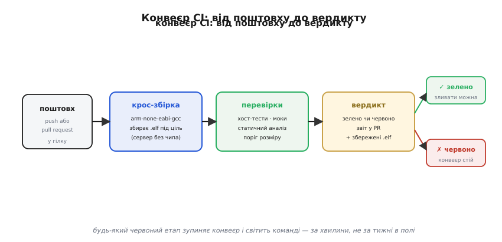
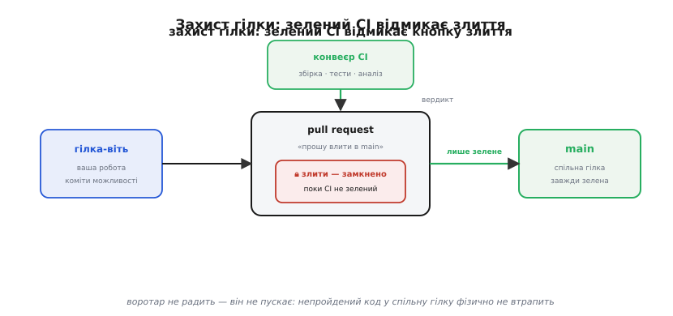
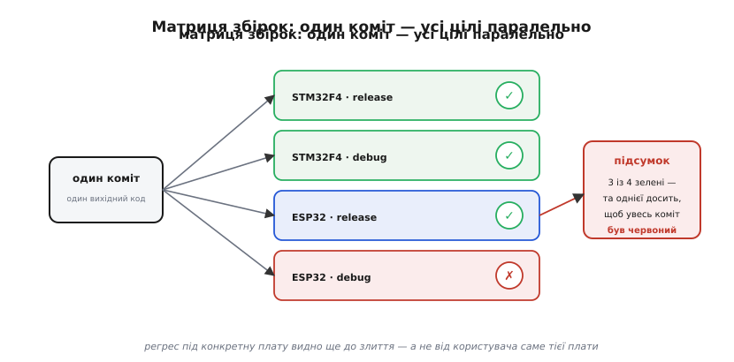

# CI для прошивки: конвеєр, що ганяє ваші тести на кожну зміну

Ви вже вмієте перевіряти прошивку [шарами](root:embedded/firmware-testing) — хост-тести логіки, моки на швах, статичний аналіз, а для цілого апарата ще й симуляцію. Набір інструментів зібрано. Лишилася одна тиха, але дорога тріщина: **уся ця машинерія допомагає лише тоді, коли її справді запускають**. А запускає її людина — і саме тут усе й сиплеться.

Уявіть звичайний вівторок. Ви поспіхом правите одну гілку в драйвері, бо горить. Тести? «Та я ж дрібницю зачепив, потім проганю». Компілюється — комітите — забули. За тиждень колега тягне вашу зміну до себе, збирає під **іншу** плату — і воно не лінкується, бо ваша «дрібниця» зламала складання під той чіп, якого у вас під рукою нема. Ще за два тижні воно вже в полі. Жоден із написаних тестів не був поганим — їх просто **ніхто не запустив у потрібну мить**. Людська пам'ять і дисципліна — найслабша ланка всієї піраміди.

Ліки прості й старі як промислове програмування: заберімо запуск у людини й віддаймо його **невтомному роботові**, що проганяє весь набір перевірок сам — на **кожну** зміну коду, без нагадувань і без винятків «бо горить». Цього робота й звуть **безперервною інтеграцією** (англ. *continuous integration*, CI — «безперервне зливання» роботи докупи). Ця тема — про те, що він робить, чому в прошивці це складніше, ніж деінде, і як він стає воротарем спільної гілки.

## Що таке CI насправді

Назва спершу збиває з пантелику: до чого тут «інтеграція», коли йдеться про тести? Слово тягнеться від головного болю, з якого CI і народився. Коли над кодом працює кілька людей, кожен місяцями пише своє в окремій гілці, а потім усі раптом зливають написане докупи — і настає «пекло злиття»: шматки, що поодинці працювали, разом не збираються й не миряться. Ідея CI: **не** накопичувати розбіжності місяцями, а вливати роботу в спільну гілку **часто, дрібними порціями — і щоразу відразу перевіряти**, що зливання не зламало ціле. «Безперервно інтегрувати» — значить постійно зводити роботу всіх до одного справного стану, а не раз на квартал.

> 📜 Термін «continuous integration» ужив Ґреді Буч ще 1991-го; практику підхопило й загострило екстремальне програмування (щоденні, а то й частіші зливання), а першим відкритим CI-сервером став CruiseControl 2001 року. Як ідея дозрівала й чому саме автоматична збірка стала її серцем: [Звідки взялася безперервна інтеграція](root:embedded/firmware-ci/hist-ci.md).

Технічно CI — це **сервер, що стежить за репозиторієм** і, щойно туди прилітає новий коміт, сам проганяє наперед описаний ланцюг перевірок: забрати свіжий код, зібрати його, прогнати тести, а тоді голосно оголосити вердикт — **зелено** (усе пройшло) чи **червоно** (щось зламано). Той ланцюг звуть **конвеєром** (англ. *pipeline* — труба, якою деталь проходить станцію за станцією), а машину, що виконує одну його ділянку, — **раннером** (англ. *runner* — виконавець, «бігун»). Ви один раз описуєте конвеєр текстовим файлом у репозиторії, і далі він працює сам на кожну зміну — рік за роком.

*Поштовх (push або pull request) запускає ланцюг станцій: крос-збірка під ціль → перевірки, яких ви вже навчилися → вердикт зелено/червоно зі збереженими артефактами. Будь-який червоний етап зупиняє конвеєр і світить команді — за хвилини, не за тижні в полі.*

Ключове слово — **автоматично**. Різниця між «маємо тести» і «маємо CI» — та сама, що між димовою сигналізацією в шухляді й тією, що прикручена до стелі й сама верещить. Тести в шухляді захищають рівно настільки, наскільки ви пам'ятаєте їх дістати. CI прикручує їх до стелі.

## Чому в прошивці це складніше

Для звичайної програми конвеєр очевидний: сервер бере той самий код, тим самим компілятором збирає той самий бінар, який поїде користувачам, — і одразу його ж і запускає. У прошивці цей ланцюг **розривається** у двох місцях, і обидва треба зшити.

Перший розрив — **чужа архітектура**. Сервер CI — це майже завжди звичайна машина x86 у хмарі. А ваша прошивка має крутитися на Cortex-M чи Xtensa. Тому на сервері прошивку доводиться **крос-компілювати** (англ. *cross* — навхрест, на інший бік: збирати на одній архітектурі код для іншої): компілятор `arm-none-eabi-gcc` живе на x86, а на виході дає машинний код під Arm. Сервер той бінар **зібрати може, а виконати — ні**: під ним немає ані такого процесора, ані периферії. Складання проходить, запуск — ні.

Другий розрив випливає з першого: **на сервері немає чипа**. Отут і окуповується той поділ на шари, що ви вже провели. Тести чистої логіки компілюються **під сам сервер** (під x86, а не під Arm) і біжать там нативно за секунди — жодного заліза не треба. Код, що торкається заліза, у CI підмінюють моками або ганяють в емуляторі — програмі, що вдає чіп разом із пам'яттю й регістрами. А те, що живе **тільки** в реальному залізі — тайминг, електрика, — сервер узагалі не бачить; його лишають окремому стендові (про нього — далі).

> 🔧 **Навіщо це.** Саме цей розрив і робить розділення логіки та заліза не примхою чистоплюя, а **умовою автоматизації**. Прошивку, зліплену з логіки й доступу до GPIO в одну грудку, на безчиповому сервері не перевірити ніяк — лишається тільки ручне «залив і дивлюся». Прошивку з чітким швом сервер ганяє сам на кожен коміт: логіку — нативно, драйвери — під моком чи в емуляторі. Тестовна архітектура — це те, що взагалі **вмикає** CI для прошивки.

Через ці два розриви крок «збірка» в конвеєрі прошивки вагоміший, ніж деінде: сама успішна крос-збірка вже є перевіркою. Якщо код зібрався під усі ваші цільові чіпи — половину бід (зокрема ту «дрібницю», що ламає складання під сусідню плату) вже спіймано, ще до єдиного тесту. Як зібрати з цих частин повний робочий конвеєр — крос-компілятор, хост-тести на Unity, поріг розміру й збереження бінарів, — з реальним файлом-описом і типовими пастками: [Робочий конвеєр CI для прошивки](root:embedded/firmware-ci/proj-ci-pipeline.md).

## Воротар спільної гілки

Дотепер CI лише **повідомляв** вердикт. Та найбільша його сила вмикається, коли вердикт стає **обов'язковим до злиття**. Пригадайте, як робота потрапляє в спільну гілку: не прямим комітом, а через [запит на злиття](root:embedded/gitflow-branching) — pull request, яким ви просите влити свою гілку-віть у `main`. І ось тут репозиторій можна навчити простого, але залізного правила: **кнопка «злити» лишається замкненою, поки CI не зазеленіє**. Це правило звуть **захистом гілки** (англ. *branch protection*).

*Правило захисту гілки ставить CI воротарем перед main: робота живе у гілці-віті, pull request просить її влити, але кнопка злиття замкнена, поки конвеєр не зазеленіє. Воротар не радить — він не пускає: непройдений код у спільну гілку фізично не втрапить.*

Різниця тонка, але вирішальна. Просто «маємо CI» — це порадник: він каже, що зламано, а послухати чи ні — ваша воля, і в гарячий вівторок ви його проігноруєте. Захист гілки перетворює пораду на **ворота**: зламаний код у `main` не потрапляє **фізично** — не тому, що всі свідомі, а тому, що система не пускає. Звідси й головна обіцянка, на якій тримається спокій команди: **`main` завжди зелений**. Будь-хто будь-якої миті може взяти звідти код і бути певним, що він принаймні збирається під усі цілі й проходить усі тести. Спільна гілка перестає бути місцем, де «щось могло зламатися відучора», і стає твердим ґрунтом.

## Одна прошивка — багато цілей

Є ще одна біда, суто прошивна, яку CI знімає майже задарма. Той самий код нерідко їде на **кілька різних плат** — і в кількох варіантах збірки (з налагоджувальними символами й без, з різними ввімкненими можливостями). Кожна така пара «плата + варіант» — це окрема збірка, і кожна може зламатися **окремо**: правка, що чудово збирається під STM32, раптом не лінкується під ESP32, бо там інший обсяг пам'яті чи інший драйвер.

Перевіряти всі ці цілі руками — саме те, що людина проґавить першим. Тому CI розкладає той самий коміт **віялом** на всі цілі відразу — паралельними роботами, кожна зі своїм вердиктом. Такий набір комбінацій звуть **матрицею збірок** (англ. *build matrix* — таблиця «цілі × варіанти»).

*Той самий коміт розкладається віялом на всі цілі — плати × варіанти — паралельними роботами, кожна зі своїм зелено/червоно. Однієї червоної досить, щоб увесь коміт був червоний. Регрес під конкретну плату видно ще до злиття — а не від користувача саме тієї плати.*

Виграш точний: регрес під якусь одну плату видно **до** злиття — а не за місяць, коли поскаржиться користувач саме тієї плати, якою у вас нема на кого зібрати. І оскільки роботи біжать **паралельно**, чотири цілі перевіряються майже за той самий час, що й одна.

## Де CI впирається в стіну

Чесно окреслимо межу. Конвеєр на хмарному сервері ганяє логіку, драйвери під моками, код в емуляторі — і ловить майже все. Але є клас бід, до яких він **сліпий за своєю природою**: реальний тайминг, гонки між перериваннями, [просідання живлення](book:programming/brownout), електричні примхи, дрібні розбіжності справжньої периферії з її описом. Емулятор цього не вигадає, а чипа на сервері нема.

Тут CI не зупиняється — він **дотягується до заліза**. Замість хмарної машини роботу конвеєра можна доручити **власному раннеру** (англ. *self-hosted runner* — виконавцю на своєму залізі): це ваш комп'ютер у лабораторії, до якого проводом підключено справжню плату. Конвеєр на такому раннері робить те саме — забирає коміт, збирає, — але останнім кроком **заливає** свіжу прошивку в живий чіп і ганяє тести просто на ньому. Так автоматика сягає й туди, куди хмара не дістає: перевірку на реальному залізі теж чіпляють до кожної зміни. Це вже окремий стенд зі своїми законами — про нього наступний крок, [HIL-стенд](root:embedded/hil-testing). А коли прошивка керує цілим апаратом — дроном, роботом, — той самий конвеєр може прогнати її й у [симуляції всього апарата](book:programming/sitl-simulation), де модель фізики заступає і чіп, і світ довкола.

## З чого почати

Не наставляйте одразу матрицю з десяти плат і стенд із залізом — з цього тільки опустяться руки. Одна дія варта найпершого кроку: **опишіть конвеєр, який на кожен pull request робить дві речі — крос-збирає прошивку під вашу головну ціль і проганяє хост-тести логіки**. Це кілька рядків тексту в репозиторії, а віддача негайна: більше ніхто не вливає код, що не збирається чи валить тести, — бо ворота не пустять.

Далі сітка розростається сама, як і сітка тестів: додали другу плату — дописали рядок у матрицю; завели поріг розміру бінаря — конвеєр стереже й від непомітного розпухання; з'явився стенд — почепили HIL-прогін окремою роботою. Кожен доданий крок стереже ще один клас регресу назавжди, не питаючи нічиєї пам'яті.

І в цьому вся суть. Тести доводять, що код правильний, **сьогодні**; CI доводить, що він лишається правильним **щодня, на кожну зміну, під кожну ціль** — і робить це, поки ви спите. Прошивка, кожна зміна якої проходить крізь зелений конвеєр, — це прошивка, якій команда може довіряти не на слово, а на доказ: спільна гілка завжди збирається, завжди проходить тести й ніколи не чекає, поки хтось згадає їх запустити.

---
